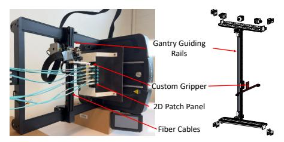

# *D. Hardware Failure Handling by R2D2 Software*

R2D2's mechanical components are designed for long service lifetimes. Nonetheless, the system incorporates graceful degradation mechanisms modeling after occasional hardware failures of individual R2D2 units and robot controllers.

R2D2 applies a hierarchical failure-management model: (1) Unit faults outside reconfiguration. Failures outside active reconfiguration fall into two categories. First, if a R2D2 gantry robot fails while idle, the robot controller reports the fault to the system controller (§V-B). Because connectors are passively latched, existing links remain mechanically secured. The system controller then marks the unit unhealthy, excludes it from future reconfigurations, and schedules it for service. Second, if a link fails after it has already been established, the local R2D2 unit controller first attempts a retry over the existing physical path. If this retry fails (e.g., due to persistent physicallink degradation), the R2D2 system controller provisions a

Fig. 7: R2D2 prototype.

local replacement link by allocating spare optical connectors at both target resource nodes and physically routing around the failure transparently to the running workload. Only if both local recovery mechanisms fail does R2D2 fall back to VM live migration or priority reallocation in the next scheduling cycle. (2) Unit faults during reconfiguration. Faults during active reconfiguration also fall into two categories. Insertionrelated faults (e.g., transient alignment errors) are low risk and are handled through local retry. If the retry fails, or if the unit halts, the R2D2 system controller assigns an alternate robot to complete the same compute–memory-pair configuration. If no alternate robot is available, the scheduler falls back to the next-best feasible placement under the current fabric state. In the worst case, the request is deferred for priority allocation in the next scheduling cycle. By contrast, movement-related anomalies—including abnormal retention force, motor current, or encoder deviation—may threaten existing latched links. In such cases, the controller halts the unit, powers it down, and reports the fault. Only the link currently being reconfigured is affected. The scheduler then assigns an alternate robot to complete the same compute–memorypair configuration (§V-C), while the faulty unit is queued for service. (3) Controller-level or multiple failures. If a robot controller becomes unreachable, the affected R2D2 units are first isolated and their existing links are verified. All links associated with the failed controller are then marked static and excluded from future reconfiguration. Depending on the SLA, the system controller may also migrate migratable tasks away from impaired robots—and, under multiple failures, away from impaired rows—to healthy ones. We detail this livetask-migration methodology in §VII. As with unit-level faults, unreachable controllers are excluded from future scheduling and queued for service.

