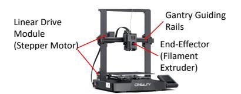
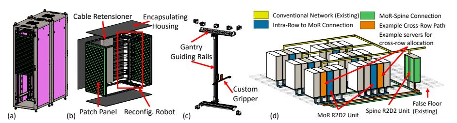
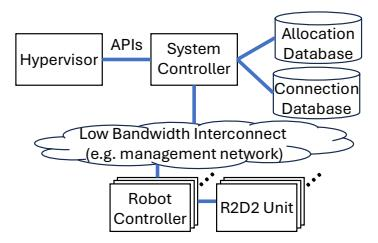

# R2D2: **R**obotized **R**econfigurable Network for **D**isaggregated **D**atacenters

Linus Y. Wong\*†, Zhiyao Tang\*†, Justin R. Yu<sup>†</sup>, Zhilei Zheng<sup>§‡</sup>, Jonathan M. Smith<sup>‡</sup>, André DeHon<sup>†‡</sup>, Jing Li<sup>†‡</sup>

†Department of Electrical and Systems Engineering, University of Pennsylvania, Philadelphia, Pennsylvania, USA †Department of Computer and Information Science, University of Pennsylvania, Philadelphia, Pennsylvania, USA Emails: {lywong, zhiyaot, justinyu, zhileiz}@seas.upenn.edu, jms@cis.upenn.edu, {andre, janeli}@seas.upenn.edu

Abstract—Disaggregated datacenters present unique network challenges. Current network hardware serving disaggregation traffic is spatially overprovisioned with statically configured all-to-all connectivity and temporally overprovisioned with static, per-packet switching costs, regardless of actual network traffic patterns. This leads to significant underutilization and reduces the cost benefits of resource disaggregation.

To address this, we propose R2D2, a robot-enabled reconfigurable datacenter network architecture. Through softwarehardware co-design, R2D2 exploits the spatial and temporal locality of network traffic to achieve efficient network specialization. In particular, for the first time, R2D2 leverages mature commodity robotics to reconfigure the network and establish direct, single-hop physical connections between disaggregated resources on demand, eliminating the spatial overprovisioning of all-to-all connections. Furthermore, R2D2 dynamically reconfigures the network on demand to adapt to changing traffic patterns, thereby removing the need for continuous per-packet switching; hence, avoiding temporal overprovisioning. Lastly, we introduce a co-optimized runtime system, co-designed with the robotized network architecture, to improve performance, resource-efficiency, and availability. We demonstrated the feasibility of R2D2 with comprehensive experimental evaluations and a robot prototype, using real-world applications and datacenter allocation traces. Our results show that R2D2 achieves up to 38% reduction in network costs and up to 84% savings in network energy consumption, while delivering comparable endto-end application performance compared to state-of-the-art fattree and OCS networks.

*Index Terms*—Memory Disaggregation, Reconfigurable Networks, Datacenter, Cloud Computing.

## I. INTRODUCTION

Datacenters are increasingly disaggregated, with hardware components traditionally collocated within the same physical server enclosure now being separated into independently managed resource pools [1], [3], [9], [12], [14], [17], [25], [26], [30], [31], [35], [39], [41], [42], [57], [60], [61], [68], [69], [74], [75]. Disaggregation aims to improve the utilization of disaggregated resources like CPU, memory, and storage, thereby reducing the operational costs.

However, this shift increases network costs, which diminish the anticipated overall cost savings from disaggregation [1]. In a disaggregated datacenter (DDC), traditional *local* inter-


Fig. 1: Comparison of conventional network and R2D2.

connects including chip-level connections (e.g., processor or memory bus) and server-level connections (e.g., PCIe) are replaced by datacenter-scale or rack-scale network that connects separate pools of resources (compute, memory, storage) distributed across servers. This generates significant network traffic as system software now needs to access remote resources over an "external" network, instead of local interconnects within the server. Notably, disaggregation traffic — distinct from application traffic between distributed applications is generated by system software for essential management and access to disaggregated resources, requiring ultra-low latency (sub- $10\mu$ s) and high bandwidth (40–400 Gbps) [25]. To serve disaggregation traffic, DDCs commonly employ network designs similar to those used in non-disaggregated traditional datacenters, but provision a costly, fully connected, highbandwidth, and RDMA-capable network with high-end network switches and network interface cards (NICs), dedicated to disaggregation and separate from application traffic. In these networks, cables are statically wired to provide highbandwidth all-to-all connectivity, and switches are statically configured to perform fixed, per-hop packet switching, regardless of the network traffic.

Nevertheless, this *static, traffic-agnostic, one-size-fits-all* network design leads to significant overprovisioning in hardware, undermining disaggregation cost advantages. Our network traffic analysis identifies two types of over- provisioning: spatial and temporal. **Spatial overprovisioning** arises because current network hardware statically provisions *all-to-all* connections (cables) between servers, despite disaggregation traffic exhibiting >98% sparsity — communication

<sup>\*</sup>Both authors contributed equally to the paper.

Work done while at University of Pennsylvania.

happens only between a small subset of compute and memory nodes allocated to the same task, leaving most links unused. Temporal overprovisioning stems from the current network hardware design aiming to maximize capacity for a worstcase, constantly changing traffic pattern at the finest-grained *per-packet* switching granularity (100s ns). However, disaggregation traffic forms stable, long-lived flows between computememory node pairs (minutes to hours), underutilizing finegrained packet switching. Our study further show that common task placement policies, designed for performance and resource utilization in DDCs, exacerbates overprovisioning.

In a nutshell, the current DDC network hardware is spatially overprovisioned with all-to-all connectivity and temporally overprovisioned with per-packet switching rate, thereby diminishing the cost-saving benefits of resource disaggregation. To address this issue, we propose R2D2- Robotized Reconfigurable Network for Disaggregated Data- centers – a *switch-less*, connection-oriented network architecture using hardware/software co-design. R2D2 leverages robotic reconfiguration to establish direct physical connections between disaggregated resources (CPU, memory, storage) only as needed, eliminating the spatial overprovisioning of all-to-all connections. Furthermore, R2D2 *dynamically* reconfigure the network on demand to adapt to changing disaggregation traffic patterns (e.g., VM launch), thereby removing the need for continuous per-packet switching and avoiding temporal overprovisioning. This is in stark contrast to state-of-the-art (SOTA), switchbased, statically provisioned networks that rely on all-to-all, always-on switching and are agnostic to actual traffic patterns.

We note that R2D2 is inspired not only by the spatial sparsity and temporal stability of disaggregated traffic patterns, but also by recent advances in robotics enabling low-cost, high-precision automation via gantry robots widely used in 3D printing and semiconductor manufacturing. Specifically, R2D2 repurposes commodity gantry robots for network reconfiguration in DDCs. Gantry robots offer sub-10 µm repeatable precision over a large operation envelope at lower cost than articulated arms. Our feasibility analysis (§III-A) shows these properties fit the demands of disaggregation traffic: the large operation envelope leverages spatial sparsity to enable high radix, while the reconfiguration speed (10 s) suffices to serve the stable temporal changes (minutes to hours). Thus, gantry robots are well-suited to realize R2D2's adaptive, runtime physical network reconfiguration.

The R2D2 system comprises two main components: (1) a hardware architecture built from an optical fiber fabric dynamically reconfigured by repurposed commodity gantry robots integrated into datacenter racks, enabling single-hop, low-latency, high-bandwidth connectivity between disaggregated resources by eliminating all-to-all wiring or per-packet switching; (2) a software runtime that co-optimizes physical topology and task placement by coordinating reconfiguration across datacenter system controller and embedded robotic controllers while actively engineering traffic patterns to promote sparse and long-lived connections. Each R2D2 robotic unit has high radix and can serve thousands of nodes, enabling datacenter-wide connectivity with at most two levels of hierarchy. The software layer spans global resource management and robot control, with a hierarchical design decoupling high-level scheduling from low-level motion planning to ensure scalability and responsiveness. Reconfiguration costs are incorporated into placement decisions to maintain sparse and stable network topologies and minimize robotic movements. Details on the R2D2 hardware and software components are in §IV and §V.

The R2D2 architecture reduces cost and energy consumption by leveraging mature, commodity robotic platforms to dynamically (re-)configure physical links *on demand*, eliminating the spatial and temporal overprovisioning inherent in statically configured, all-to-all, packet-switching networks. By repurposing off-the-shelf components and provisioning only the necessary connectivity and reconfiguration speed, R2D2 achieves lower costs than modern 400GbE switch-based architectures. This cost advantage scales with system size: the highradix of R2D2 units enables datacenter scale connectivitiy with at most two levels of hierarchy. The required robotic units and fiber links grow only linearly with system scale, maintaining scalability and cost-efficiency. In contrast, traditional switchbased networks require deeper hierarchies with more nodes, leading to superlinear growth in cost per node. In energy use, R2D2's direct connection approach decouples maintenance of active data paths from topology updates, consuming no power for sustained dataflows and only during infrequent reconfigurations. Even during reconfiguration, the transient peak power (∼120W) is below the static power consumption of a lightly loaded traditional switch (∼400W). Crucially, R2D2 achieves these cost and energy advantages without sacrificing performance. Unlike conventional switched fabrics, it establishes direct, point-to-point physical links, eliminating per-hop latency and shared bandwidth bottlenecks, allowing endpoints to communicate at the full line rate.

We evaluate R2D2 in terms of cost, power, and performance on real-world benchmarks, using network traces from disaggregated applications [25] and allocation traces from production datacenters [32]. Our prototype, built with a commodity 3D printer and fiber patch panels/cables, measures the cost, power, latency, and throughput of robotic reconfiguration. Compared to a SOTA fat-tree and OCS baselines, R2D2 reduces hardware cost by up to 38% and energy consumption by up to 84%. R2D2 also improves flow completion time by up to 43.3% and throughput by up to 70.2% over fat-tree. At the application level, R2D2 can achieve performance comparable to that of fat-tree and OCS networks.

We summarize our main contributions as follows:

- We present the first in-depth characterization of traffic in disaggregated datacenters, identifying and quantifying the significant spatial and temporal locality that leads to network overprovisioning. Guided by our discovery, we further demonstrate the feasibility of using commodity gantry robotics to physically reconfigure network links to meet these traffic demands.
- We design and present *R2D2*, a novel robotized reconfigurable network architecture that, for the first time,

leverages commodity gantry robots to dynamically reconfigure direct physical links between compute and memory nodes. By physically adapting the network topology to traffic patterns, *R2D2* exploits the identified spatial and temporal locality to directly address the cost and energy inefficiencies of static, overprovisioned networks.

- We develop a co-designed runtime system that jointly manages both task scheduling and robotic network reconfiguration. Our system features a hierarchical design for scalability and a novel scheduling algorithm that, by incorporating the physical reconfiguration cost, promotes sparse and stable network connections.
- We present a comprehensive evaluation using real-world applications through a combination of prototyping and system simulation. The results demonstrate that *R2D2* reduces network hardware's cost by up to 38% and energy consumption by up to 84%, while maintaining comparable end-to-end performance with SOTA fat-tree and OCS baselines.

## II. BACKGROUND AND MOTIVATION

## *A. Network Cost for Resource Disaggregation*

The network is a critical component in disaggregated datacenter architectures with significant cost and energy overheads [1]. It serves two types of traffic: *disaggregation traffic*, which enables communication between disaggregated resources such as compute, memory, and storage; and *application traffic*, which supports communication among applications running on the servers. Disaggregation traffic is essential to system functionality for resource access and system-level management, thus demands high bandwidth (40–400Gbps) and ultra-low latency (sub-10µs). To meet these stringent requirements, prior work on disaggregated systems [3], [25], [30], [57], [61], including commercial datacenters [9], typically adopts a costly, fully connected, RDMA-capable fattree network dedicated exclusively to disaggregation traffic and isolated from application traffic, significantly increasing both network cost and energy consumption [1].

To quantify these overheads, we evaluate two fully connected RDMA networks with 512 and 2048 nodes, as detailed in Table I. Both use SOTA 400 GbE switches, NICs, and servers with NICs directly attached to CPUs [6]. The network accounts for 23.1% of system cost and 21.3% of power at 512 nodes, and 23.0% and 25.7%, respectively, at 2048 nodes, underscoring the substantial cost and energy overheads of disaggregated networking.

## *B. Gantry Robots*

Gantry robots are widely used in cost-sensitive automation because they offer sub-10 µm repeatable positioning accuracy at a cost one to two orders of magnitude lower than articulated arms of comparable reach. A typical Cartesian gantry robot consists of three primary subsystems: an End-effector (e.g., gripper, nozzle, probe) mounted on a moving carriage; Orthogonal guide rails that constrain motion to three perpendicular axes; and Linear drive modules that actuate the end-effector within its operational envelope (Figure 2).

The performance and cost advantages of gantry robots stem from their orthogonal structure, which kinematically decouples the axes. This design natively supports Cartesian motion, avoiding costly inverse kinematics, and has high positioning accuracy, since errors are bounded to a single axis rather than accumulating across joints. As shown in Table II, commodity hardware with simple controllers can achieve sub-10 µm accuracy over meter-scale envelopes. This combination of low cost and high precision makes gantries ideal for tasks such as 3D printing, PCB assembly, and semiconductor fabrication.

## *C. Disaggregation Traffic Analysis*

We analyze network traffic to characterize disaggregation traffic patterns and identify opportunities for network specialization. Using VM traces from production datacenters [32], we examine spatial sparsity and temporal stability of disaggregation traffic. Detailed setup can be found in §VI-A.

We evaluate three representative resource placement policies from prior works [3], [17], [30], [31], [57], [61]: 1) *Randomfit*: Randomly assigns compute and memory nodes, prioritizing scheduling speed [3] or load balancing [17], resulting in a worst case for sparsity and stability. 2) *Best-fit*: Assigns compute and memory nodes to minimize fragmentation [30] while treating all compute-memory pairs uniformly. 3) *Topologyaware*: Prioritize assignment to compute-memory pairs with existing affinity [31], [57], [61], improving sparsity and stability while maintaining utilization.

Spatial Sparsity: We construct heatmaps of steadystate compute-memory traffic (Fig. 3(a)-(b)), following TVMPP [51] and ECHO [15]. At 512 nodes, 98.8%, 99.1%, and 99.5% of links carry no traffic under random-fit, best-fit, and topology-aware placement, respectively, equivalent to each compute node using only 6, 5, and 3 of 511 possible memory links. Sparsity increases in the 2048-node system (Fig. 3(b)) to 99.7%, 99.8%, and 99.8%, or roughly 6, 4, and 4 active links per node, indicating that sparsity persists across scales.

Temporal Stability: We measure the fraction of stable compute-memory connections over time (Fig. 3(c)–(d)), following Infiniswap [30] and Sinbad [13]. At 512 nodes, temporal stability remains above 0.99 across 1000-3000 s interval for all policies, and exceeds 0.997 for topology-aware. At 2048 nodes, temporal stability is above 0.996 across all intervals. This stability arises from long VM lifetimes [32] and, for topology-aware, explicit compute-memory node bindings.

The above spatial sparsity and temporal stability contrast starkly with the fully connected and ns-to-µs per-hop packet switching design of current disaggregation networks, leading to spatial and temporal overprovisioning.

Spatial Overprovisioning: Current disaggregation network designs provide high-bandwidth all-to-all connectivity. However, our analysis demonstrates that disaggregation traffic, especially under topology-aware placement, exhibits up to 99.8% spatial sparsity. This signifies a vast majority of potential links carry no traffic, rendering allocated connectivity highly

| C                                    | 512-r        | ode Setup   |     | 2048-node Setup |             |      |  |  |  |
|--------------------------------------|--------------|-------------|-----|-----------------|-------------|------|--|--|--|
| Components                           | Cost (\$)    | Power (W)   | Qty | Cost (\$)       | Power (W)   | Qty  |  |  |  |
| FS 32x400Gb Switch (N8610-32D) [23]  | 18.8K        | 1000        | 48  | l -             | _           | -    |  |  |  |
| FS 64x400Gb Switch (N9510-64D) [24]  | -            | -           | -   | 37.3K           | 2524        | 96   |  |  |  |
| Total switch power and cost          | 902K         | 48.0K       | -   | 3581K           | 242K        | -    |  |  |  |
| Total nodes supported                | -            | -           | 512 | -               | -           | 2048 |  |  |  |
| Switching per node                   | 1762         | 93.8        | -   | 1748            | 118         | -    |  |  |  |
| SuperMicro 222HA-TN Dual Socket [67] | 26366        | 1100        | 256 | 26366           | 1100        | 1024 |  |  |  |
| Intel Xeon 6952P 96 Core CPU         | Included     | Included    | 2   | Included        | Included    | 2    |  |  |  |
| 64GB DDR5-6400 DRAM                  | Included     | Included    | 24  | Included        | Included    | 24   |  |  |  |
| Broadcom P1400GD 400Gb NIC [8]       | 2198         | 75          | 2   | 2198            | 75          | 2    |  |  |  |
| Total per node                       | 17143        | 550         | -   | 17129           | 550         | -    |  |  |  |
| Switching per node (as %)            | 3960 (23.1%) | 117 (21.3%) | -   | 3946 (23.0%)    | 141 (25.7%) | -    |  |  |  |

TABLE I: Cost and power breakdown for 512-node and 2048-node fully-connected network configurations.

underutilized. For instance, in a system with 2048 nodes, 99.8% sparsity means each machine actively communicates over approximately 4 links out of 2047 possible connections. This spatial overprovisioning implies future disaggregation networks could benefit from designs exploiting orders of magnitude sparser connectivity, leading to substantial reductions in hardware cost and power consumption.

**Temporal Overprovisioning:** Current disaggregation networks are engineered for extremely low-latency, dynamic nsto- $\mu$ s per-hop packet switching This design is optimized for highly bursty and unpredictable general-purpose datacenter traffic. In stark contrast, our findings reveal that disaggregation traffic patterns are remarkably stable over minutes to hours (1000s of seconds). The architectural choice of fine-grained, per-packet routing for traffic that changes on such a significantly slower timescale represents severe temporal overprovisioning. This profound mismatch implies that disaggregation networks could operate at orders of magnitude coarser time granularities (e.g. minute-to-hour basis), substantially reducing control overhead and offering significant opportunities for network cost and power savings.

#### III. R2D2 OVERVIEW

## A. Feasibility of Commodity Robot Reconfiguration

In §II-C, we demonstrated that the spatial sparsity and temporal stability of disaggregation traffic mismatch the design assumptions of current disaggregated datacenter networks leading to significant overprovisioning. Consequently, we ask: Can we leverage commodity robots to reconfigure the physical network topology to exploit the spatial and temporal locality of disaggregation traffic, thus eliminating the need for complex, overprovisioned network switching? This subsection evaluates the feasibility of commodity robotics in meeting the spatial connectivity and temporal reconfiguration demands of disaggregation traffic.

a) Spatial Connectivity: As shown in our spatial traffic analysis (§II-C), disaggregated traffic is sparse but still requires a modest degree of concurrent connectivity per node. Specifically, with a topology-aware placement strategy, each compute node communicates concurrently with approximately 3-4 memory nodes in 512-node and 2048-node clusters, and vice versa. This bidirectional fanout of 4 represents the minimum degree of concurrent links needed to support flexible



Fig. 2: A commodity 3D Printer (Gantry Robot)

| Item                         | Cost   | Power | Speed  | Precision | Build Size                                                                                                                        |
|------------------------------|--------|-------|--------|-----------|-----------------------------------------------------------------------------------------------------------------------------------|
| Creality Ender-3 V3 KE [46]  | \$279  | 350W  | 0.6m/s | 0.1mm     | $\begin{array}{l} 0.22m \times 0.22m \times 0.24m \\ 0.25m \times 0.21m \times 0.22m \\ 0.8m \times 0.8m \times 1.0m \end{array}$ |
| Prusa MK4S [49]              | \$729  | 120W  | 0.6m/s | 0.1mm     |                                                                                                                                   |
| Elegoo OrangeStorm Giga [47] | \$2499 | 1524W | 0.3m/s | 0.1mm     |                                                                                                                                   |

TABLE II: Cost, power, speed, precision, and size of different commodity 3D printers.

allocation and reduce resource stranding. With random and best-fit placement, the required number of active connections slightly increases to at most 6—still significantly below the theoretical worst case of 511 and 2047 connections per node in fully connected topologies for 512-node and 2048-node clusters, respectively.

Hence, the spatial sparsity of disaggregation traffic makes it possible to reconfigure the physical network topology while staying within both the rack's spatial budget and the reachand-accuracy envelope of commodity gantry robots.

Concretely, an 4-way fan-out over a 512-compute/512-memory pod requires  $512 \times 4 = 2048$  unique compute-to-memory links and thus 4096 connection points to be managed by the reconfiguring robots. To give a scale of size, existing fiber panels used in datacenter today can pack 96 fiber connectors per  $4.5 \, \mathrm{cm}$  rack units. Utilizing both front and back of the rack unit, we can maximally pack  $96 \times 2 = 192$  connectors per rack unit. As a result, the rack space required to accommodate the compute-memory pods of a total of 1024 machines is  $\frac{4096}{192} \times 4.5 \, \mathrm{cm} \approx 96 \, \mathrm{cm} \approx 21.3 \, \mathrm{U}$  occupying about half of a  $48\mathrm{U}$  rack while leaving  $2\mathrm{U}$  buffer space for power, controllers, and the robot's home dock. For a 1024-compute/1024-memory pod, the requirement is  $\approx 42.6 \, \mathrm{U}$ .

Meanwhile, largest commodity 3-D printer offers an 80 cm by 80 cm planar reach with 100 cm Z-clearance, comfortably covering the 48.3 cm(19in.)-wide rack face. Because the port count and the corresponding rack space used scale *linearly* with fan-out and node count, doubling the cluster size or modestly increasing fan-out still fits within one (or at most two) racks. Consequently, the small active-link budget afforded by spatial sparsity keeps the R2D2 fabric within the service envelope of a single, low-cost commodity 3-D printer.

b) Temporal Reconfiguration: Disaggregation traffic exhibits temporal stability over timescales ranging from minutes to hours (i.e., thousands of seconds), as characterized in §II-C. This property offers a compelling opportunity to exploit commodity robotic systems for physical reconfiguration. In contrast to traditional networks that operate at nanosecond timescales, robotic reconfiguration on the order of tens of seconds is more than sufficient.

In our running example, the 512-compute/512-memory pod occupies just 21.3 U – about 100 cm of vertical space – across the rack's 48 cm width. The longest possible move, between


Fig. 3: (a) Disaggregation traffic heatmap for three different placement strategies at 512 nodes: (i) Random-fit, (ii) Best-fit, (iii) topology-aware. (b) Disaggregation traffic heatmap for three different placement strategies at 2048 nodes: (i) Random-fit, (ii) Best-fit, (iii) topology-aware. (c) Percentage of connection that remains unchanged after time at 512 nodes for (i) Random-fit, (ii) Best-fit, (iii) topology-aware. (d) Percentage of connection that remains unchanged after time at 2048 nodes for (i) Random-fit, (ii) Best-fit, (iii) topology-aware.


Fig. 4: Overview of R2D2, a hardware-software co-designed system for disaggregation network.

diagonal corners, spans  $\sqrt{(100\,\mathrm{cm})^2+(48\,\mathrm{cm})^2}\approx 111\,\mathrm{cm}$ . At a conservative  $300\,\mathrm{mm\,s^{-1}}$  (readily achieved by commodity XYZ gantries; see §II), the worst-case traversal time is  $111\,\mathrm{cm}/300\,\mathrm{mm\,s^{-1}}\approx 3.7\,\mathrm{s}$ ; for a 1024-compute/1024-memory pod, the corresponding worst case is  $\approx 7.3\,\mathrm{s}$ .

Including overheads for motion control, alignment precision, cable insertion and removal, and cable management, we conservatively estimate that a full reconfiguration can be completed in under 15 seconds. This sub-minute operation time is orders of magnitude faster than the timescale of disaggregation traffic dynamics. Thus, the temporal slack is sufficiently large to make robotic physical network reconfiguration not only feasible but also practical for real-world datacenter operations.

#### B. R2D2 System Overview

Having established the feasibility of using commodity robot reconfiguration to meet the demands of disaggregation traffic in §III-A, we now present the system overview of R2D2 (Robotic Reconfigurable Disaggregated Datacenter). R2D2 is a hardware/software co-designed system that exploits the spatial sparsity and temporal stability of disaggregation traffic and harnesses the explosive growth of commodity robots to create a cost-effective, power-efficient, and low-latency network fabric. The system is built upon two tightly integrated layers: a hardware layer of R2D2 robots and a software

runtime that actively co-optimizes task placements and the physical topology reconfiguration in response to dynamically changing disaggregation traffic.

The hardware layer (§IV) consists of a physical network fabric built from direct fiber optic connections, reconfigured on demand by robots. This direct, single-hop connectivity eliminates many layers of hierarchical switching, delivering the low-latency, high-bandwidth communication essential for memory disaggregation. By repurposing commodity Cartesian robots and leveraging the speed, precision, cost-effectiveness, and power efficiency of 3D-printer technology, R2D2 enables low-cost, energy-efficient network reconfiguration. A single robot can manage a meter-scale reconfiguration patch panel serving up to 4608 nodes, allowing the architecture to scale to datacenter-scale with a two-level hierarchy. These robots are integrated into standard computing racks with high-density patch panels, enabling seamless adoption in modern datacenters.

The software layer (§V) provides essential resource management capabilities and facilitate seamless integration of R2D2 into the datacenter's ecosystem. The R2D2 software runtime hierarchy spans from the datacenter hypervisor resource allocation and network reconfiguration down to embedded robotic controllers. Its core function is to jointly manage task placement and network reconfiguration. The system's scheduling algorithm (§V-C) preferentially assigns workloads to alreadyconnected nodes and incorporate the cost of physical reconfiguration into allocation fitness calculation. As a result, this policy actively engineers traffic to enhance its spatial sparsity and temporal stability, minimizing the radix of NIC ports and frequency of robotic movements. When topology changes are needed, high-level commands are delegated to dedicated robot controllers on embedded boards, which manage the lowlevel motion planning, closed-loop control, and fault handling. This hierarchical separation of the runtime design ensures the system remains scalable and computationally tractable.



Fig. 5: (a) R2D2 hardware overview in rack chassis. (b) R2D2 unit exploded diagram. (c) Gantry robot internals (d) R2D2 fabric integrated into existing datacenter grid layout.



Fig. 6: The integration of R2D2 software into datacenter stack.

#### IV. R2D2 HARDWARE ARCHITECTURE

The R2D2 architecture is a reconfigurable network fabric that uses commodity Cartesian (gantry) robots to dynamically establish direct optical fiber connections between nodes. The R2D2 architecture is built from individual R2D2 units (§IV-A). Each unit is a standalone datacenter rack assembled from off-the-shelf components, including robotic systems repurposed from commodity 3D printers, commercial patch panels, and standard fiber optics. The mature robotics deliver the speed, precision, and energy efficiency required for fine-grained physical network reconfiguration at low cost. Leveraging high-density patch panels and the large build volumes of current 3D printer robots, a single R2D2 unit supports thousands of fiber connections between servers.

The R2D2 fabric is built from multiple R2D2 units and integrates seamlessly with existing datacenter layouts (§IV-B). Each unit serves one of two roles, both using identical hardware: a Middle-of-Row (MoR) unit, positioned centrally within a server row to manage fibers from thousands of NICs and provide full intra-row connectivity, or a Spine unit, which interconnects MoR units across rows to deliver datacenter-scale connectivity and load balancing. The MoR supports even the highest-density server deployments, while the Spine aggregates inter-row links for efficient resource utilization.

In the remainder of this section, we present the detailed design of the R2D2 unit (§IV-A) and its integration into existing datacenter infrastructure (§IV-B), and highlight the key benefits of the R2D2 architecture (§IV-C).

#### A. R2D2 Unit

Each R2D2 unit consists of four key components: (1) an *encapsulation housing* that encloses and protects the robotic and cabling components, fiting within a standard datacenter rack (Fig. 5). (2) two *patch panel* that expose network cable termination points for both server NICs and inter-unit connections, (3) a *cable retensioning* mechanism that manages network cable slack , and (4) a *gantry-based robot* that physically establishes and removes network links.

**Encapsulation Housing:** The housing is a standard datacenter rack-mount chassis, with patch panels front and back, and a cable retensioner and reconfiguring robot inside. The housing seals the cable connectors from datacenter airflow and attenuates ambient vibration from surrounding servers, thereby reducing contact face scraping and contamination.

Front and Back Patch Panels: The patch panels host

receptor ports in a dense  $48\times96$  rectangular array on the front and back of the R2D2 unit. Exterior ports connect directly to server NICs, while interior ports form a grid accessible to the reconfiguring robot. The panel layout is co-designed with the robot's movement plane to ensure every port lies within its operational envelope.

**Cable Retensioner:** The cable retensioner is a reservoir of slack cables with a constant-force spring reel to retract unused length for connected cables and to fully retract disconnected cables during reconfiguration. This helps prevent entanglement [52] or collision with robotic movements.

Reconfiguring Robot: The R2D2 reconfiguring robot is built using enhanced commodity Cartesian gantry systems and comprises three main components: (1) the gripper, (2) the gantry and guiding rails, and (3) the linear drive module. To establish a connection, the robot retrieves an optical cable from the retensioner, aligns its connector with the target receptor on the patch panel, and inserts it to complete the link between server NICs. Its motion is constrained to a 2D plane, with linear guides and stepper motors enabling precise, repeatable positioning across the receptor grid.

The core modification to commodity gantry systems is a custom gripper - a modular end-effector optimized for connectors. It incorporates self-alignment features to tolerate minor misalignments and reduce wear, integrated sensors to verify latch engagement, and an optional miniature servo to actuate the release tab for unplugging. Once latched, the link is passive, allowing the robot to continue with other reconfigurations. The design targets low-cost scalability, using simple control logic on a lightweight microcontroller. Material-based optimizations can further simplify the gripper; for example, our physical prototype (§VI-B) eliminates the servo by leveraging the natural flex of 3D-printed material.

Because individual R2D2 units are architected for independent execution, we can natively exploit algorithmic-level parallelism across multiple units. We detail this orchestration strategy in the software runtime section (§V).

#### B. R2D2 Fabric

The R2D2 fabric is a direct-connect network that integrates seamlessly into existing datacenters. Built from high-radix, rack-compatible R2D2 units, it provides direct, single-hop connectivity for thousands of nodes without disturbing existing network infrastructure. Fig. 5(c) illustrates its integration into a standard layout.

R2D2 Middle-of-Row (MoR) Unit The R2D2 MoR Unit is a R2D2 unit centered at each server rack row, connecting to all servers in the row to minimize cable length and complexity. We adopt a centralized MoR design over a distributed ToR model to maximize intra-row connectivity. This enables any compute node to connect to any memory node within the row, independent of physical rack placement.

All R2D2 units – including MoR – are high-radix, reducing fabric hierarchy and enabling dense disaggregation. It can provide up to 48×48×2=4608 ports across front and back panels, all within 42U racks, shown in Fig. 5(b). This enables a single unit to serve up to 27 high-density racks (4 servers/U, 168 servers/rack), 4536 servers. For fault tolerance or additional bandwidth, servers may connect to multiple MoR units, with multi-path routing handled in R2D2 software.

R2D2 Spine Unit To scale beyond a single row, R2D2 uses Spine units that interconnect MoR units to form a datacenterwide fabric. Spine units leverage unused MoR ports to enable cross-row, global compute-memory sharing and reduce resource stranding. Like MoR units, Spine units offer a high radix of 4608 ports, enabling fabric scaling to over 10 million servers with full bandwidth.

## *C. Key Benefits of R2D2 Hardware Architecture*

Cost and Scalability R2D2 offers low cost and near-linear cost scalability compared to conventional network architectures. Leveraging off-the-shelf gantry robots from the 3D printing market reduces per-port cost to ∼\$10, a fraction of the ∼\$400 for modern 400 GbE switches. Its high radix enables scaling with at most two levels hierarchy for a datacenterscale fabric. A single R2D2 MoR unit can support up to 4608 servers, while a 2-tier MoR-Spine topology can scale to over 10 million. Traditional fat-tree networks scale superlinearly in cost; expanding from 512 to 8192 servers with 32-port switches requires moving from a 2-level (1024 cables, 48 switches) to a 3-level fabric (24,576 cables, 1280 switches), increasing cable and switch costs per server by 50% and 67%.

Low Energy R2D2 delivers energy advantage over conventional electronic switches by using passive fiber connections and only consuming power for on-demand connectivity changes. Unlike conventional switches that perform per-packet per-hop forwarding with always-on ASICs and line cards, R2D2 maintains connections through passive physical links, drawing no power during steady-state operation.

Each R2D2 unit consumes under 10W when idle and peaks at approximately 120W during reconfiguration. In contrast, a 64-port 400 Gbps switch draws 2.5 kW at peak load and still consumes hundreds of watts under light load; even an idle line card can draw 70W. By reconfiguring network topology only on demand, R2D2 eliminates the continuous energy overhead of active switching, reducing power and cooling demands.

Low Latency and High Bandwidth R2D2 provides network nodes with direct fiber connections, eliminating the latency and bandwidth bottlenecks from network switching. By bypassing intermediate network hops, R2D2 avoids portto-port forward latency of microseconds in network switches, governed only by network software, transceiver delays, and signal propagation speed on network cables. For example, R2D2 endpoints can enjoy full 400 Gbps on a 400 Gbps link. In contrast, switch-based architectures like fat-trees suffer from flow collisions and congestion, especially under incast patterns, reducing effective throughput.

Fault Isolation. A fundamental architectural benefit of R2D2 is the strict physical decoupling of the robotic control plane from the optical data plane. Once a circuit is established, the gantry robot physically detaches from the latched link, leaving an entirely passive optical data path. Because the robots remain completely idle when there are no active reconfiguration tasks, mechanical hardware faults cannot disrupt steady-state operations. Instead, failures manifest exclusively during new VM allocations or topology updates, translating merely into slightly increase allocation latency. We detail how the software runtime mitigates these faults—such as failing over to an alternate robot to ensure active tenant workloads remain completely undisturbed—in §V-D. We provide additional evaluation on the impact of allocation latency in §VII, using failure rates derived from empirical field data to model real-world operational conditions.

## V. R2D2 SOFTWARE RUNTIME

The R2D2 software runtime performs joint orchestration of the robotic reconfiguration of R2D2 hardware and allocation of tasks to co-optimize allocation latency, resource utilization, and network traffic locality. The R2D2 runtime (Fig. 6) has two hierarchical levels: the *system controller* (§V-A), operating at the datacenter orchestration level, and the *robot controller* (§V-B), managing individual robots.

The R2D2 software engineers resource traffic to promote spatial sparsity and temporal stability with the joint resource allocation and network reconfiguration algorithm (§V-C). The algorithm identifies feasible placements and validates physical connectivity between nodes, while minimizing robotic reconfiguration to reduce task placement latency.

To ensure compatibility with existing datacenter orchestration stacks, the system controller exposes standard APIs, such as Azure Protean rules [32], allowing higher-level orchestrators to request resource allocations and network configurations without modifying their orchestration logic.

## *A. R2D2 System Controller*

The R2D2 system controller orchestrates datacenter-wide resource management across the R2D2 fabric. It selects optimal compute and memory placements, validates resource mappings, and ensures physical connectivity via the robotic network, guided by the joint planning algorithm in §V-C.

Placement requests from upper-layer orchestrators (e.g., hypervisors or schedulers) are sent to the system controller via standard APIs, each specifying compute and memory requirements. The controller invokes the joint algorithm to minimize stranded resources and reconfiguration costs, considering current topology and resource availability. If reconfiguration is required, it issues low-level commands to robot

## Algorithm 1 R2D2 Joint Allocation and Reconfiguration

```
1: function ALLOCATETASK(Task t, Compute req C, Mem req M)
2: row ← MAXFITNESS(FEASIBLEROWS(C, M))
3: c[] ← SORT(FEASBILECNODESNORECONF(C, M, row))
4: for i = 1 to n do
5: if COMMIT(c[i], t) then
6: return SUCCESSFUL
7: end for
8: p[] ← SORT(FEASBILECMPAIRS(C, M, row))
9: for i = 1 to n do
10: r[] = AVAILABLEROBOTS(p[i])
11: for j = 1 to m do
12: if RECONFIGURENETWORKBYROBOT(r[j], p[i]) then
13: if COMMIT(p[i], t) then
14: return SUCCESSFUL
15: else
16: MARKROBOTASDOWN(r[j])
17: end if
18: end for
19: end for
20: return QUEUE FOR RETRY
21: end function
```

controllers (e.g., disconnect port A, connect port B). Upon successful reconfiguration, the controller returns the final node assignments to the hypervisor for task scheduling.

## *B. R2D2 Robot Controller*

Each R2D2 robot controller manages a single physical robot and operates on an embedded controller mounted on the robot, offering low-latency, high-fidelity control. The robot controller translates high-level reconfiguration commands into executable motion plans and performs closed-loop control to ensure correctness. Meanwhile, the R2D2 robot controller also actively monitors the R2D2 units' health through a number of metrics such as temperature, motor current, etc.

Upon receiving a reconfiguration request, the controller computes an optimal trajectory for its stepper motors, plans Cartesian motion over the patch panel, and generates lowlevel actuation instructions (e.g., G-code). It monitors feedback during actuation (e.g., encoder position, insertion force) to ensure precise, collision-free cable manipulation.

After successful reconfiguration (e.g., cable latched), the robot controller notifies the system controller to continue the task placement. On an execution error (e.g., stall, misalignment) or an observed unhealthy (e.g., overcurrent, overheating) hardware state, it performs local retries. If retries fail beyond a threshold, it reports failure and flags its corresponding R2D2 unit unavailable to the system controller. The system controller excludes the unit from future reconfigurations and initiates maintenance/failover procedures.

## *C. R2D2 Joint Allocation and Reconfig. Algorithm*

The R2D2 joint task allocation and network reconfiguration algorithm jointly optimizes task placement and dynamic network reconfiguration, in contrast with existing topologyaware disaggregated resource scheduler [31], [57], [61] that optimizes task placement on statically provisioned topology. Its objective is to promote network sparsity and temporal stability by minimizing reconfigurations, while ensuring low allocation latency and high resource utilization.

To achieve scalability, the algorithm follows a two-stage hierarchical process (Alg. 1): selecting a datacenter row, followed by intra-row compute-memory node selection. It first identifies feasible rows with sufficient aggregate resources, then selects the one with the highest fitness score under a best-fit policy. Within the chosen row, the algorithm prioritizes compute nodes that meet task requirements using existing memory links to avoid reconfiguration. Candidates are ranked by a fitness function that considers resource fit and link utilization, promoting balanced traffic and scalable fanout. If no such placement exists, it searches all compute-memory pairs in the row, now allowing reconfiguration, and selects a valid placement using the same fitness metric. It iteratively tries different compute-memory pairs and different robots that are available to connect between the pairs. If none is successful, the task is queued for retry. By favoring existing connections, the algorithm reduces topology changes, promoting network sparsity and stability. Reconfiguration is used only when necessary to sustain utilization.

When reconfiguration is inevitable, particularly under bursty VM allocation demands, R2D2 natively exploits spatial parallelism across its distributed reconfiguration units. The co-optimization algorithm is designed to fully utilize this hardware-level concurrency. As reflected in Alg. 1 (Line 12), it queries a real-time availability list of idle robots for each candidate pair. To avoid localized bottlenecks, the scheduler preferentially selects placements that spatially distribute allocations to distinct, concurrently operating robots across different pods, maximizing parallel execution.

Crucially, the R2D2 system controller and the individual robot controllers operate under an asynchronous dispatch model. Once placement decisions are dispatched to the target robots, the system controller immediately proceeds to evaluate subsequent VM allocations without blocking. Because the software control path is strictly decoupled from the physical actuation phase, multiple robots across the system independently and simultaneously execute their assigned tasks. This decentralized execution ensures that system-wide reconfiguration latency scales gracefully, preventing the system controller from becoming a serialization bottleneck.

