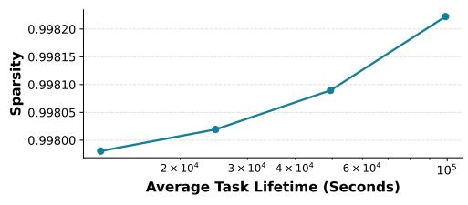

# VI. EVALUATION

We evaluate R2D2 using a combination of small-scale hardware prototyping and datacenter-scale simulation. The prototype validates the mechanical and electrical design, reveals how spec-sheet parameters translate into real hardware behavior, and provides the empirical grounding needed to scale the evaluation to datacenter settings using larger offthe-shelf gantry robots. The datacenter-scale simulations then evaluate R2D2 at both the component level (e.g., how joint allocation–reconfiguration promotes sparsity and locality) and the system level (e.g., task-allocation delay and end-to-end application performance).

## *A. Experimental Setup*

System Setup. We evaluate R2D2 at two scales, 512 and 2048 nodes, using current-generation 400 GbE networks, a practical target for memory disaggregation [57]. Network bandwidth and latency are modeled using a packet-level ns-3 simulator with 500 ns per-hop latency [71]. Allocation latency is measured using a custom discrete-event simulator exercising the R2D2 runtime and scheduling algorithm. Applicationlevel performance is evaluated using real-world disaggregated application traces [25].

Cost and Power Modeling. We build a parametric model calibrated with prototype cost analysis and power measurements. This enables scaling R2D2's efficiency to full datacenter deployments and comparison with fat-tree fabrics.

Workload Selection. For network microbenchmark and application-level benchmark, we adopt real-world disaggregated memory traffic traces from Gao et al. [25] and Shoal [62], as well as machine learning workloads with ASTRA-sim [58]. The memory traffic traces comprise 5 workloads: *bdb*, *GraphLab*, *Memcached*, *Terasort Hadoop (Terasort H)*, and *Terasort Spark (Terasort S)*. Each trace entry encodes a resource access flow between resource nodes with the request time and flow size. Storage traffic are removed to focus on memory disaggregation. As the original trace from [25] contains a fixed number of nodes, we follow the methodology of Shoal [62] for scaling. For ASTRA-sim, we configure the workload after LLaMA 4 Behemoth model [2].

For the task-level microbenchmark, we use the latest cluster of VM traces dataset collected from production datacenters [32], comprising 2064 machines, each equipped with 48 CPU cores and 384GB of memory. Each trace entry contains the requested VM CPU/memory/storage requirements, as well as the duration. We exclude storage and application network requirements to focus on memory disaggregation. The trace includes bursts of 1000s allocation requests per second (Fig. 8(d)). To evaluate R2D2's behavior under such stress, we analyze the latency of largest spikes in §VI-D.

Architectural Baselines We compare R2D2 against stateof-the-art fat-tree and OCS fabrics. Our fat-tree baseline is NDP [34], which achieves over 95% of optimal fat-tree throughput and represents modern production datacenter practice. For OCS baseline, we use 3D MEMS OCS [38], the technology deployed at scale in Google's datacenters [55]. Because commercial OCS devices has limited radix (up to 384 ports), we linearly scale cost and power to 576- and 2304 port configurations using published measurements [38], [70], providing a best-case OCS baseline.

Runtime-Algorithm Baselines To evaluate R2D2's software runtime, we compare R2D2 joint algorithm to a bestfit baseline, a policy widely used in cloud [32], while both scheduling for R2D2 hardware.

## *B. Prototype Evaluation*

To validate the feasibility of robotizing network reconfiguration and to evaluate the physical capabilities and limitations of

| Components                              | Cost          | Power | Qty (576P) | Qty (2304P) | Qty (4608P) |
|-----------------------------------------|---------------|-------|------------|-------------|-------------|
| 42U Server Rack [19]                    | \$307         | 0W    | 1          | 1           | 1           |
| 96 Fiber Patch Panel [22]               | \$109         | 0W    | 6          | 24          | 48          |
| 3m Fiber Patch Cable [21]               | \$6.5         | 0W    | 288        | 1152        | 2304        |
| Elegoo OrangeStorm Giga 3D Printer [47] | \$2499        | -     | 1          | 1           | 1           |
| 0.8m x 0.8m x 1m Metal Gantry           | Incl'd        | 0W    | 1          | 1           | 1           |
| X-axis: 42HD8022-01                     | Incl'd        | 36W   | 1          | 1           | 1           |
| Y-axis: 57HD6436-01                     | Incl'd        | 36W   | 1          | 1           | 1           |
| Z-axis: 42HD8011-19                     | Incl'd        | 36W   | 1          | 1           | 1           |
| Controller Board                        | Incl'd        | 5W    | 1          | 1           | 1           |
| Power Supply                            | Incl'd        | 5W    | 1          | 1           | 1           |
| Gripper                                 | $\approx \$0$ | 0W    | 1          | 1           | 1           |
| 576-Port Total                          | \$5332        | 118W  | _          | _           | _           |
| 2304-Port Total                         | \$12910       | 118W  | -          | _           | -           |
| 4608-Port Total                         | \$23014       | 118W  | -          | -           | -           |

TABLE III: Cost and power breakdown of 576-port, 2304-port, and 4608-port R2D2 hardware configurations.

R2D2 hardware—including how spec-sheet parameters translate to real performance—we built a physical prototype by repurposing a commodity 3D printer [46]. We replace the filament feeder and extruder head with a custom 3D-printed gripper designed to latch onto standard LC optical connectors; replace the build plate with a custom 3D-printed mount for a commodity optical patch panel; and reprogram the firmware to enable direct G-code control of the XYZ stepper motors.

Positioning Accuracy and Repeatability The prototype was programmed to reconfigure connectors at random positions over 500 cycles, achieving a  $100\,\%$  cable-connection success rate and a worst-case positional error of  $0.02\,\mathrm{mm}$ , consistent with the spec sheet rating of the robot.

**Reconfiguration Latency** We measure end-to-end reconfiguration latency—from request receipt to link completion—across distances. The results match our estimates derived using the methodology in §III-A0b based on spec-sheet parameters, validating our feasibility study. Its effect on task-allocation latency is analyzed in §VI-D.

**Power Consumption** During idle operation (all motors disabled, heating pad removed), the prototype's controller, power supply, and sensor draw less than 10 W from the wall (measured via an AC power meter) and peak at 30 W during reconfiguration. This matches the motor spec (3 motors, 5 W each) and informs our energy estimation in §VI-C.

Scaling to Rack-Scale We do not directly extrapolate prototype measurements to rack-scale R2D2 hardware, recognizing that large systems introduce added complexity. Instead, we use the prototype measurements to model performance behavior from spec-sheet parameters. Specifically, we use a larger commodity 3D printer [47] with a rack-scale  $0.8 \times 0.8 \times 1.0$  m motion range; this printer employs kinematics, drive electronics, and connector mechanics similar to our prototype, making the prototype's spec-sheet—to—performance translation applicable to rack-scale deployments.

#### C. Cost and Power Efficiency

As shown in Table III, a 576-port R2D2 unit costs \$5.4K and consumes up to 120 W, while 2304-port and 4608-port units cost \$13K and \$23K with the same peak power.

In the overall network fabric (Fig. 8(a)), R2D2 reduces cost by 23–38% and power by 80% at 512 nodes, and by 23–38% and 84% at 2048 nodes, compared to the fat-tree baseline. R2D2 reduces cost by 24–34% and power by 1–3% at 512 nodes, and by 25–35% and 3–6% at 2048 nodes, compared to

the OCS baseline. These savings grow with scale, highlighting R2D2's scalability. R2D2 units (including robots) account for 2.1–4.0% of the network fabric power at 512 nodes and only 0.5–1.0% at 2048 nodes. This power efficiency is due to 1) passive single-hop connections drawing power only during reconfigurations, and 2) a high radix that amortizes each robot's power over 100s to 1000s of nodes, unlike traditional switches serving only 10s. At 8192 nodes (Table VI), R2D2's cost (36–48%) and power (87%) savings over fat-tree is higher than those of 512 and 2048 nodes, showing better scalability than the current leaf-spine network and three-tier network. At 100G 512-nodes (Table VII), R2D2 maintains cost (42–44%) and power (67–68%) savings. More details in the appendix.

#### D. Microbenchmarks

**Network Evaluation** Fig. 8(b)–(c) shows that R2D2 improves average and tail FCT by up to 43.3% and 18.5%, and average and tail throughput by up to 70.2% and 69.4%, against the SOTA fat-tree baseline design at both 512- and 2048-node scales, demonstrating scalable and consistent improvements in both latency and throughput. R2D2 achieves the same latency and throughput as OCS.

Task Allocation Evaluation R2D2's scheduling latency has only a marginal effect on overall performance. Although absolute latencies are higher: 41–51% (avg) and 27–30% (p99) at 512 nodes, and 5–39% (avg) / 21–29% (p99) at 2048 with spine enabled (Fig. 8(e)–(f)), compared to the fat-tree/OCS baselines, it increases only 0.49% of total VM runtime, as VM execution time dominates. Across all tests, utilization reaches 99% CPU and 69% memory. We do not distinguish between OCS and fat-tree in Fig. 8(e)–(f) as they are within 0.5%.

We analyze the largest task-allocation spikes and find that robotic delay does not amplify them. These spikes incur <15% higher latency than baseline, which is lower than the average allocation-delay increase reported earlier. This is because most spike requests are small, do not require a robotic reconfiguration, and reconfigurations occur in parallel.

Our design-space exploration of existing commodity 3D-printer robots shows that increasing travel speed yields diminishing marginal returns on performance: even a  $2\times$  speedup only reduces task completion time overhead by < 0.01%, a negligible improvement offset by a disproportional  $10\times$  increase in the robot cost (Fig. 8(g)) [44], [45], [47], [48].

To isolate the effectiveness of R2D2's joint algorithm in promoting sparsity and stability and minimizing reconfigurations, we also compared it with the best-fit baseline on R2D2 hardware and observed that the joint algorithm achieves  $10-20\times$  lower average and p99 allocation latency at both scales. The best-fit algorithm, agnostic of robotics, triggers excessive reconfigurations and cascades allocation latency. To quantify robotic reconfiguration parallelism, we find that 37-45% of reconfigurations overlap 2+ robots for the 2 and 4 robot setup.

#### E. Applications

R2D2 reduces network hardware costs by up to 38% and network hardware energy consumption by up to 84%, while

Fig. 8: Results of R2D2 against fat-tree and OCS baselines. (a) Cost and Power. (b) Average and P99 Flow Completion Time (FCT). (c) Average Flow and P01 Flow Throughput. (d) Request Rate for Task Allocation. (e) Average Allocation Latency. (f) P99 Allocation Latency. (g) Sensitivity Analysis on Robot Speed. (h) Normalized Application Performance Speedup.

maintaining application performance comparable to the fat-tree and OCS baselines. As shown in Fig. 8(h), R2D2's application performance is the same as OCS and a slight speedup over fat-tree for the 6 applications (0.59% on average for 512 and 2048 nodes). Similarly, our microservice/serverless study shows that R2D2, with widely used optimization techniques [73], experiences only a modest additional allocation latency on average (<2s, 4%) compared to VM workloads.

#### F. Sensitivity Study

Fig. 9: Sensitivity of link stability to workload lifetime.

To study the operating limit under a diverse range of workloads, we added a sensitivity analysis that sweeps over workload lifetime and arrival rate and measures their impact on the stability of disaggregation traffic patterns. We varied the average workload lifetime from 1.15 days to 3 hours, with a corresponding average arrival rate of 4 to 32 per second and a peak arrival rate of 1K to 8K per second, to match the lifetime of modern short-lived applications such as microservices [73]. We follow the widely used traffic-generation methodology from prior work [62]. As shown in Fig. 9, we found that 1) disaggregation traffic has very small changes (0.44%) in temporal locality when decreasing workload lifetimes from 1.15 days to 3 hours. 2) Because the disaggregation traffic remains stable, R2D2 only experienced a 4s (9%) additional allocation latency when decreasing workload lifetimes from 1.15 days to 3 hours. This can be further reduced to 3s (8%) by scaling the number of robots from 2 to 4. These additional delays are minimal (<0.1%) over the 3-hour lifetime.

#### VII. DISCUSSION

Availability and Durability While R2D2's moving components—reconfiguring robots, optical connectors, and cable retensioners - are subject to mechanical wear, their projected lifetimes match or exceed typical datacenter refresh cycles. Commercial 3D-printer motion stages are rated for 7,500-15,000 continuous hours and, under R2D2's intermittent duty cycle, are projected to last  $\geq 10$  years. Optical connectors are specified for  $\geq 1,000$  mating cycles, while traces indicate only 10-13 per connector per year, providing ample margin for a 4-8-year refresh. Cable retensioners are rated for > 300 full pulls, likewise supporting a  $\geq 10$ -year horizon. These projections are based on vendor ratings and trace-driven workloads.

Although all components are rated well beyond a typical datacenter refresh cycle, real-world manufacturing defects and field conditions can still produce occasional early-life failures. To quantify their impact, we model mechanical faults by injecting a 4% per-day failure rate (approximately 1.5% of 3D prints require human intervention [54], and more complex multi-filament prints report up to 2.8% [56]). We consider a common datacenter service model: next-day replacement [16], [37] to evaluate recovery latency and system-level impact. R2D2's fault-handling mechanism limits increases in task allocation latency to only 2.7% and does not impact allocated application performance. Even after accounting for replacement overhead—including human labor (assuming one highly experienced technician working full time on maintaining R2D2 [4], [5], [29])—the total maintenace OpEx remains negligible at just 9.5% of R2D2's CapEx, with its total cost (CapEx + maintenance OpEx) remains below 85% of the CapEx of a traditional switched network. This localized overhead is far outweighed by the architectural cost savings R2D2 provides relative to traditional switched networks.

We also compare our intervention rate with other existing data center hardware, such as hard drives. Our analysis shows that this intervention burden remains modest, even at datacenter scale, and comparable to the existing intervention rate. For example, a hyperscale deployment with 50,000 servers contains at least 50,000 drives [7]; at a 1–2% annual hard drive disk (HDD) failure rate [66], this implies roughly 500–1,000 HDD failures per year, or about 1.4–2.7 HDD replacements per day. By contrast, supporting the same amount of computer and memory resources using disaggregated resource servers would require about 50 2304-port R2D2 units plus 4 more spine units, and even under a conservative 1.5% per-unit perday intervention rate, this corresponds to only about 0.81 robot-related human interventions per day across the entire datacenter. Therefore, the expected fleet-wide rate of robot-related maintenance remains well below the routine daily maintenance burden of HDD replacement.

**Signal Integrity and Latency.** R2D2 reduces intra-rack port-to-port latency by approximately 42% by eliminating ToR-switch traversal. In the worst case (1/2 row), R2D2 adds roughly 10 m of fiber, contributing less than 50 ns of propagation delay; this is small relative to the 455 ns ToR-switch latency. Accounting for roughly 500 ns RNIC latency, the reduction is  $1 - \frac{500 + 50}{500 + 455} \approx 42.4\%$ .

R2D2 achieves error rates comparable to ToR switches because the added optical attenuation remains within the transceiver link budget. The additional cable length and connector insertion add about 0.1 dB of loss, and a scale-out path across two MoR units and one spine adds at most about 0.3 dB. Both are well below the 1.9 dB budget of 400GBASE-SR8 10 m transceivers, so the impact on error rate is negligible.

**Non-VM Tasks** Virtual machines are the underlying infrastructure for various services such as direct VM allocation, containers, and serverless workloads [32]. By supporting VM-based allocation, R2D2 provides a foundation that can be easily extended to support these non-VM tasks. We leave the exploration of such extensions to future work.

**Resource Fragmentation** While R2D2 does not directly address the reduction of resource fragmentation, it facilitates resource disaggregation to reduce fragmentation. In task-level microbenchmarks, it averages  $\geq 99\%$  compute and  $\geq 69\%$  memory utilization, showing low fragmentation.

**Cable Entanglement** R2D2 avoids cable entanglement by fully retracting the cable with a retensioner between each reconfiguration, following the methodology in [52]. This method has been validated on prototypes, avoiding entanglement under arbitrary cross-connections over extended operation.

VM Migration R2D2 can support VM live migration by treating migration as a standard allocation event with a placement constraint on a resident resource node. For example, a CPU-only migration is treated as a resource allocation for a new CPU node, while the VM's memory remains on its current memory node. The R2D2 system controller then finds a feasible CPU node that can connect to that memory node. Before migration, R2D2 establishes all required links so VMs never experience partial connectivity during migration.

R2D2 supports three migration cases. (1) For CPU-nodeonly migration, the allocator provisions a new CPU node and connects it to the pinned memory node; the hypervisor transfers CPU state and releases the old CPU node after verification. (2) Memory-node-only migration is symmetric to that of CPU-node-only migration. (3) Combined CPU/memory migration is handled as a sequence of the two single-node migrations. If no feasible resource node is available, the controller defers migration until resource became available, rather than disrupting the running VM.

**Complex Topologies/Multi-Path Routing** Because R2D2 is connection-oriented, it supports arbitrary topologies. There are no architectural limitations on communication patterns, provided the endpoints have sufficient transceiver fanout.

For one-to-many communication (e.g., shared storage), R2D2 provisions concurrent circuits from a storage node to multiple clients. For many-to-many patterns (e.g., GPU training), it provisions job-specific structures—such as direct circuits for sparse collectives (e.g., rings, trees)—obviating the need for a full all-to-all physical mesh. R2D2 derives these target graphs from existing topology-optimization frameworks by updating the controller's objective function. Furthermore, because these workloads are highly stable, reconfiguration overhead is easily amortized, relaxing robot speed constraints.

Similarly, multi-path routing in a switchless fabric is implemented natively by provisioning parallel point-to-point optical circuits between endpoints, entirely bypassing in-network packet forwarding. The number of parallel circuits is limited only by port availability. This programmable connectivity allows runtimes to explicitly request parallel paths for bandwidth aggregation, failover redundancy, or strict traffic isolation.

#### VIII. RELATED WORKS

**Network Switches.** A substantial body of prior work has explored alternative network switch technologies for datacenter networks to enhance scalability, cost-efficiency, and performance [11], [27], [33], [50], [55], [62], which can be broadly grouped into software-defined and circuit switches.

Software-defined packet switches: Software-defined packet switches (e.g. Intel Tofino [10], [20], [53]) have been explored to replace traditional fixed-function switches. However, their flexibility is confined to the L2/L3 switching and routing logic; the underlying network hardware remains a statically provisioned, all-to-all topology with fine-grained perpacket switching that cannot adapt to the spatial sparsity of disaggregation traffic. As a result, for traffic with high spatial and temporal locality, only a subset of the hardware capability (e.g., switch packet-forwarding and switching bandwidth) is actually utilized, while the system still pays the cost of topology-level overprovisioning. Compared with same-generation non-programmable switches, softwaredefined switches cost roughly 50% more [10], [23]. They consume similar switch-chip power [23], [53], but still incur substantial static transceiver power (hundreds of watts per lightly loaded switch), additional per-packet processing/forwarding overhead, and hundreds of nanoseconds of extra packet latency [20]. In contrast, although R2D2's mechanical components have higher per-component failure rates than the electronic motherboards used in software-defined switches, its aggregate annual hardware failure rate at datacenter scale remains 3.3× lower than deployed datacenter hard drives, in addition to its hierarchical fault-tolerance mechanisms (§V-D) which further limit the application-/system-level impact.

*Circuit switches:* Optical circuit switches (e.g., Rotor-Net [50], ProjecToR [27], Firefly [33], Jupiter Evolving [55]) replace traditional spine switches to reduce cost, power, and latency. Others, like Larry [11], use electrical circuit switches for dynamic rerouting and congestion mitigation, while Shoal [62] introduces nanosecond-scale circuit switches for coordinationfree scheduling. Nonetheless, these networks are statically provisioned, traffic-agnostic, and all-to-all networks with limited flexibility. Their flexibility is confined to fixed schedule topology changes based on offline demand analyses [27], [33], [50], [55], [62]. Modern OCS designs (e.g., 3D MEMS) rely on non-latching mirrors and incur higher optical attenuation. In contrast, R2D2 uses low-cost commodity robotics and off-theshelf passive components to realize latching, low-loss direct connections. Because disaggregation traffic remains stable at VM-lifetime timescales, R2D2 can hide its relatively slow mechanical reconfiguration time while still adapting the physical topology to actual workload demand, avoiding the attenuation and active-stabilization drawbacks of OCS while providing substantially finer-grained control over resource connectivity.

Overall, unlike prior work that primarily improves switch hardware within a statically provisioned network fabric, R2D2 rethinks the network as a software-hardware co-designed, demand-driven physical interconnect for resource disaggregation, and is largely orthogonal to these prior approaches.

Networks and Interconnects for Resource Disaggregation. A significant body of prior work on resource disaggregation has focused on reducing disaggregation latency and performance overhead by optimizing host software atop standard networks. Infiniswap [30] and FastSwap [3] use one-sided RDMA to bypass remote CPUs. LegoOS [61] is an RDMAbased OS with features like remote memory coalescing.

Recent systems such as Clio [31] remove control logic and transport protocols from memory nodes, while Pond [41] uses CXL for hardware-assisted access. SMART [59] improves RDMA scalability, and Pulse [65] offloads pointer chasing to memory nodes. In contrast, *R2D2* targets the interconnect and its runtime, co-optimizing hardware topology and orchestration. It is complementary to RDMA and memorynode techniques, enabling further latency gains.

Other efforts redesign NICs and protocols to reduce latency and power [28], [62], [64]. Aquila [28] co-designs NIC/ToR hardware with a custom L2 protocol; EDM [64] embeds logic in the PHY to bypass MAC processing. These require invasive stack changes. *R2D2*, by contrast, is host-transparent and compatible with such hardware. Finally, *R2D2* performs fine-grained, demand-driven reconfiguration to capture traffic locality, using commodity robotics instead of custom fast switches, reducing cost and easing deployment.

Robotic-Enhanced Systems. Existing robotic systems in datacenters primarily focused on automating traditional human maintenance tasks [18], [36], [40], [52], [72], rather than reconfiguring the network fabric at runtime to improve network efficiency. Telescent [40], Mizukami et al. [52] and Xu et al. [72] introduce robotic patch panels and robotic arms for automated cable management. Hong et al. [36] explore autonomous network maintenance via robotic agents, while Elbehiery et al. [18] examine broader robotic functions such as equipment handling and environmental monitoring. In addition to targeting fundamentally different objectives than R2D2, all of these systems rely on costly custom-built robots designed for specific tasks. In contrast, R2D2 makes maximal use of mass-produced commodity hardware, enabling cost-effective, scalable, and rapid deployment in datacenters.

Recent proposals have explored mechanical approaches [43], [63], [70] to achieving network configuration or accelerating data movement in data centers. RF-MG [63] leverages physical mobility to improve wireless signal strength. TopoOpt [70] uses robotic patch panels to optimize GPU server communication for distributed ML training (specifically targeting application traffic) based on offline network traffic analysis. DHL [43] physically transports SSDs using magnetic rails to relocate data within the datacenter. R2D2 is orthogonal to these works by targeting disaggregation traffic instead of application traffic or data, exploiting both spatial and temporal locality in traffic patterns by fine-grained, dynamic, on-demand runtime network reconfiguration, and leveraging commodity robotics instead of costly, custom-built components.

## IX. CONCLUSION

We have demonstrated R2D2, a reconfigurable network architecture that, for the first time, leverages mature commodity robotics to dynamically establish direct, single-hop, pairwise physical connections between disaggregated CPU and memory nodes in response to changing traffic patterns. This approach effectively addresses the spatial overprovisioning of statically configured all-to-all connections and the temporal overprovisioning of static, continuous per-packet switching inherent in traditional disaggregated data center networks. By co-scheduling task placement with topology reconfiguration, we reduce both cabling complexity and reconfiguration delays, paving the way for the practical deployment of robotized networking in DDCs. Our results show that R2D2 is feasible to deploy and delivers significant cost and power advantages from a network hardware perspective. Meanwhile, from an application standpoint, R2D2 can achieve a comparable or higher performance over the SOTA fat-tree network. While some challenges remain for moving into production, as we discussed in the paper, we believe that most major issues have been addressed, and we leave the remaining ones for future research. Through this case study, we hope to inspire further exploration into network specialization and robotized systems.

## X. ACKNOWLEDGEMENT

The authors thank the anonymous reviewers for their valuable comments and suggestions. The authors also thank Dr. Jialiang Zhang, Peter Bruno, and the staff of the AddLab at the University of Pennsylvania for their support and contributions during the early stages of this work.

## REFERENCES

- [1] B. Abali, R. J. Eickemeyer, H. Franke, C.-S. Li, and M. A. Taubenblatt, "Disaggregated and optically interconnected memory: when will it be cost effective?" Mar. 2015.
- [2] M. AI, "The Llama 4 herd: The beginning of a new era of natively multimodal AI innovation," https://ai.meta.com/blog/llama-4-multimodalintelligence/, 2025.
- [3] E. Amaro, C. Branner-Augmon, Z. Luo, A. Ousterhout, M. K. Aguilera, A. Panda, S. Ratnasamy, and S. Shenker, "Can far memory improve job throughput?" in *Proceedings of the Fifteenth European Conference on Computer Systems*, ser. EuroSys '20. New York, NY, USA: Association for Computing Machinery, Apr. 2020, pp. 1–16.
- [4] Amazon, "Data Center Technician," https://www.amazon.jobs/en/jobs/3193833/data-center-technician.
- [5] ——, "Senior Data Center Technician," https://amazon.jobs/en/jobs/3178411/senior-data-center-techniciandco-4-dcc-communities.
- [6] Amazon Web Services, "Cloud compute instances amazon ec2 instance types – aws," https://aws.amazon.com/ec2/instance-types/, 2025.
- [7] L. A. Barroso, U. Holzle, and P. Ranganathan, ¨ *The Datacenter as a Computer: Designing Warehouse-Scale Machines*, ser. Synthesis Lectures on Computer Architecture. Cham: Springer International Publishing, 2019.
- [8] Broadcom, "P1400gd | single-port 400g pcie ethernet nic," https://www.broadcom.com/products/ethernet-connectivity/networkadapters/p1400g, 2024.
- [9] W. Cao, Y. Zhang, X. Yang, F. Li, S. Wang, Q. Hu, X. Cheng, Z. Chen, Z. Liu, J. Fang, B. Wang, Y. Wang, H. Sun, Z. Yang, Z. Cheng, S. Chen, J. Wu, W. Hu, J. Zhao, Y. Gao, S. Cai, Y. Zhang, and J. Tong, "Polardb serverless: A cloud native database for disaggregated data centers," in *Proceedings of the 2021 International Conference on Management of Data*, ser. SIGMOD '21. New York, NY, USA: Association for Computing Machinery, Jun. 2021, pp. 2477–2489.
- [10] CDW, "Edgecore 32 port 40g qsfp-dd switch," 2025. [Online]. Available: https://www.cdw.com/product/edgecore-32-port-40g-qsfpdd-switch/7131371
- [11] A. Chatzieleftheriou, S. Legtchenko, H. Williams, and A. Rowstron, "Larry: Practical network reconfigurability in the data center," in *15th USENIX Symposium on Networked Systems Design and Implementation (NSDI 18)*, 2018, pp. 141–156.
- [12] X. Chen, L. Yu, V. Liu, and Q. Zhang, "Cowbird: Freeing cpus to compute by offloading the disaggregation of memory," in *Proceedings of the ACM SIGCOMM 2023 Conference*, ser. ACM SIGCOMM '23. New York, NY, USA: Association for Computing Machinery, Sep. 2023, pp. 1060–1073.
- [13] M. Chowdhury, S. Kandula, and I. Stoica, "Leveraging endpoint flexibility in data-intensive clusters," in *Proceedings of the ACM SIGCOMM 2013 conference on SIGCOMM*, ser. SIGCOMM '13. New York, NY, USA: Association for Computing Machinery, Aug. 2013, pp. 231–242.
- [14] CXL Consortium, "Compute express link," https://computeexpresslink.org/, 2019.
- [15] C. Delimitrou, S. Sankar, A. Kansal, and C. Kozyrakis, "Echo: Recreating network traffic maps for datacenters with tens of thousands of servers," in *2012 IEEE International Symposium on Workload Characterization (IISWC)*, Nov. 2012, pp. 14–24.
- [16] Dell, "ProSupport One for Data Center," 2025. [Online]. Available: https://www.delltechnologies.com/asset/enus/services/support/technical-support/prosupport one for data center service overview data sheet.pdf
- [17] A. Dragojevic, D. Narayanan, M. Castro, and O. Hodson, "Farm: Fast ´ remote memory," in *11th USENIX Symposium on Networked Systems Design and Implementation (NSDI 14)*, 2014, pp. 401–414.
- [18] K. Elbehiery and H. Elbehiery, "Overlay robotized datacenter system," in *Proceedings of Eighth International Congress on Information and Communication Technology*. Springer, Singapore, 2023, pp. 1–14.
- [19] R. Electronics, "Raising electronics 42u 4 post server rack open frame enclosure 19" adjustable depth 22-34"," https://risingracks.com/raisingelectronics-42u-4-post-open-frame-server-rack-enclosure-19-adjustabledepth-22-34/, 2025.
- [20] D. Franco, E. Ollora Zaballa, M. Zang, A. Atutxa, J. Sasiain, A. Pruski, E. Rojas, M. Higuero, and E. Jacob, "A comprehensive latency profiling study of the Tofino P4 programmable ASIC-based hardware," *Computer Communications*, vol. 218, pp. 14–30, Mar. 2024.

- [21] FS, "3m (10ft) fiber patch cable, 1 fiber, lc upc simplex to lc upc simplex, multimode (om4), lszh, 1.2mm, tight-buffered, aqua," https://www.fs.com/products/300743.html, 2025.
- [22] ——, "48 port lc fiber patch panel, om4 multimode," https://www.fs.com/products/69082.html, 2025.
- [23] ——, "N8610-32d switch datasheet," https://www.fs.com/products\ support.html?isPica=false\&categories\ id=5125\&third\ categories\ id=4228\&products\ model=N8610-32D\&style\ id=15\&files\ id=7768, 2025.
- [24] ——, "N9510-64d switch datasheet," https://www.fs.com/products\ support.html?isPica=false\&categories\ id=3404\&third\ categories\ id=3255\&products\ model=N9510-64D\&style\ id=15\&files\ id=7808, 2025.
- [25] P. X. Gao, A. Narayan, S. Karandikar, J. Carreira, S. Han, R. Agarwal, S. Ratnasamy, and S. Shenker, "Network requirements for resource disaggregation," in *12th USENIX Symposium on Operating Systems Design and Implementation (OSDI 16)*, 2016, pp. 249–264.
- [26] Gen-Z Consortium, "Gen-z," https://genzconsortium.org/, 2016.
- [27] M. Ghobadi, R. Mahajan, A. Phanishayee, N. Devanur, J. Kulkarni, G. Ranade, P.-A. Blanche, H. Rastegarfar, M. Glick, and D. Kilper, "Projector: Agile reconfigurable data center interconnect," in *Proceedings of the 2016 ACM SIGCOMM Conference*, ser. SIGCOMM '16. New York, NY, USA: Association for Computing Machinery, Aug. 2016, pp. 216–229.
- [28] D. Gibson, H. Hariharan, E. Lance, M. McLaren, B. Montazeri, A. Singh, S. Wang, H. M. G. Wassel, Z. Wu, S. Yoo, R. Balasubramanian, P. Chandra, M. Cutforth, P. Cuy, D. Decotigny, R. Gautam, A. Iriza, M. M. K. Martin, R. Roy, Z. Shen, M. Tan, Y. Tang, M. Wong-Chan, J. Zbiciak, and A. Vahdat, "Aquila: A unified, low-latency fabric for datacenter networks," in *19th USENIX Symposium on Networked Systems Design and Implementation (NSDI 22)*, 2022, pp. 1249–1266.
- [29] Google, "Data Center Technician IV Google Careers," https://www.google.com/about/careers/applications/jobs/results/ 108492767394439878-data-center-technician-iv.
- [30] J. Gu, Y. Lee, Y. Zhang, M. Chowdhury, and K. G. Shin, "Efficient memory disaggregation with infiniswap," in *14th USENIX Symposium on Networked Systems Design and Implementation (NSDI 17)*, 2017, pp. 649–667.
- [31] Z. Guo, Y. Shan, X. Luo, Y. Huang, and Y. Zhang, "Clio: a hardwaresoftware co-designed disaggregated memory system," in *Proceedings of the 27th ACM International Conference on Architectural Support for Programming Languages and Operating Systems*, ser. ASPLOS '22. New York, NY, USA: Association for Computing Machinery, Feb. 2022, pp. 417–433.
- [32] O. Hadary, L. Marshall, I. Menache, A. Pan, E. E. Greeff, D. Dion, S. Dorminey, S. Joshi, Y. Chen, M. Russinovich, and T. Moscibroda, "Protean: Vm allocation service at scale," in *14th USENIX Symposium on Operating Systems Design and Implementation (OSDI 20)*, 2020, pp. 845–861.
- [33] N. Hamedazimi, Z. Qazi, H. Gupta, V. Sekar, S. R. Das, J. P. Longtin, H. Shah, and A. Tanwer, "Firefly: a reconfigurable wireless data center fabric using free-space optics," in *Proceedings of the 2014 ACM conference on SIGCOMM*, ser. SIGCOMM '14. New York, NY, USA: Association for Computing Machinery, Aug. 2014, pp. 319–330.
- [34] M. Handley, C. Raiciu, A. Agache, A. Voinescu, A. W. Moore, G. Antichi, and M. Wojcik, "Re-architecting datacenter networks and ´ stacks for low latency and high performance," in *Proceedings of the Conference of the ACM Special Interest Group on Data Communication*, ser. SIGCOMM '17. New York, NY, USA: Association for Computing Machinery, Aug. 2017, pp. 29–42.
- [35] Hewlett Packard Corporation, "The machine: A new kind of computer," https://www.hpl.hp.com/research/systems-research/themachine/, 2014.
- [36] F. Hong, I. Sarantopoulos, E. Hogg, D. Richardson, Y. Zhang, H. Williams, D. Sweeney, A. Chatzieleftheriou, and A. Rowstron, "Selfmaintaining [networked] systems: The rise of datacenter robotics!" in *Proceedings of the 23rd ACM Workshop on Hot Topics in Networks*, ser. HotNets '24. New York, NY, USA: Association for Computing Machinery, Nov. 2024, pp. 159–166.
- [37] HPE, "HPE Proactive Care Service Support Services," 2025. [Online]. Available: https://www.hpe.com/psnow/doc/4aa3-8855enw.pdf
- [38] hubersuhner, "POLATIS® 7000 Optical Circuit Switch - HUBER+SUHNER," 2025. [Online]. Available: https://www.hubersuhner.com/en/shop/product/other-systems/optical-

- switches/rack-mount-circuit-switches/85223159/polatis-7000-opticalcircuit-switch
- [39] Intel Corporation, "Intel rack scale design architecture white paper," https://www.intel.com/content/dam/www/public/us/en/documents/whitepapers/rack-scale-design-architecture-white-paper.pdf, 2018.
- [40] A. S. Kewitsch, "Large scale, all-fiber optical cross-connect switches for automated patch-panels," *Journal of Lightwave Technology*, vol. 27, no. 15, pp. 3107–3115, Aug. 2009.
- [41] H. Li, D. S. Berger, L. Hsu, D. Ernst, P. Zardoshti, S. Novakovic, M. Shah, S. Rajadnya, S. Lee, I. Agarwal, M. D. Hill, M. Fontoura, and R. Bianchini, "Pond: Cxl-based memory pooling systems for cloud platforms," in *Proceedings of the 28th ACM International Conference on Architectural Support for Programming Languages and Operating Systems, Volume 2*, ser. ASPLOS 2023. New York, NY, USA: Association for Computing Machinery, Jan. 2023, pp. 574–587.
- [42] K. Lim, J. Chang, T. Mudge, P. Ranganathan, S. K. Reinhardt, and T. F. Wenisch, "Disaggregated memory for expansion and sharing in blade servers," in *Proceedings of the 36th annual international symposium on Computer architecture*, ser. ISCA '09. New York, NY, USA: Association for Computing Machinery, Jun. 2009, pp. 267–278.
- [43] G. Lopez-Parad ´ ´ıs, I. M. Hair, S. Kannan, R. Rabbat, P. Murray, A. Lopes, R. Zahedi, W. Zuo, and J. Balkind, "The case for data centre hyperloops," in *2024 ACM/IEEE 51st Annual International Symposium on Computer Architecture (ISCA)*, Jun. 2024, pp. 230–244.
- [44] MatterHackers, "BigRep PRO Industrial Large-Format 3D Printer," https://www.matterhackers.com/store/l/bigrep-pro-industrial-largeformat-3d-printer, 2025.
- [45] ——, "Builder3D Extreme 1500 PRO 3D Printer," https://www.matterhackers.com/store/l/builder3d-extreme-1500-pro-3d-printer/sk/MSSM848L, 2025.
- [46] ——, "Creality Ender 3 V3 KE 3D Printer," https://www.matterhackers.com/store/l/creality3d-ender-3-v3-ke-3dprinter, 2025.
- [47] ——, "Elegoo OrangeStorm Giga High-Speed Large-Format 3D Printer Kit Enterprise Bundle," https://www.matterhackers.com/store/l/elegooorangestorm-giga-high-speed-large-format-3d-printerkit/sk/MSTCQ8SV, 2025.
- [48] ——, "Modix BIG-120X V4 3D Printer Kit," https://www.matterhackers.com/store/l/modix-big-120x-v4-3d-printerkit/sk/MTPRRVG8, 2025.
- [49] ——, "Prusa MK4S 3D Printer Fully Assembled," https://www.matterhackers.com/store/l/prusa-mk4s-3dprinter/sk/M1XK1N88, 2025.
- [50] W. M. Mellette, R. McGuinness, A. Roy, A. Forencich, G. Papen, A. C. Snoeren, and G. Porter, "Rotornet: A scalable, low-complexity, optical datacenter network," in *Proceedings of the Conference of the ACM Special Interest Group on Data Communication*, ser. SIGCOMM '17. New York, NY, USA: Association for Computing Machinery, Aug. 2017, pp. 267–280.
- [51] X. Meng, V. Pappas, and L. Zhang, "Tvmpp: Improving the scalability of data center networks with traffic-aware virtual machine placement," in *2010 Proceedings IEEE INFOCOM*, Mar. 2010, pp. 1–9.
- [52] M. Mizukami and M. Makihara, "Fiber-handling robot and optical connection mechanisms for automatic cross-connection of multiple optical connectors," *Optical Engineering*, vol. 52, no. 7, p. 076116, Jul. 2013.
- [53] E. Networks, "DCS810 Edgecore Networks," 2023. [Online]. Available: https://www.edge-core.com/product/dcs810/
- [54] C. Oriotis, "ReDeTec Prusa Print Farm Report," https://redetec.com/blogs/blog/redetec-prusa-print-farm-report, 2023.
- [55] L. Poutievski, O. Mashayekhi, J. Ong, A. Singh, M. Tariq, R. Wang, J. Zhang, V. Beauregard, P. Conner, S. Gribble, R. Kapoor, S. Kratzer, N. Li, H. Liu, K. Nagaraj, J. Ornstein, S. Sawhney, R. Urata, L. Vicisano, K. Yasumura, S. Zhang, J. Zhou, and A. Vahdat, "Jupiter evolving: Transforming google's datacenter network via optical circuit switches and software-defined networking," in *Proceedings of ACM SIGCOMM 2022*, 2022.
- [56] J. Pru˚sa, "Original Prusa i3 MK3S and MMU2S release, SL1 and ˇ powder-coated sheets update," Feb. 2019.
- [57] Y. Qiao, C. Wang, Z. Ruan, A. Belay, Q. Lu, Y. Zhang, M. Kim, and G. H. Xu, "Hermit: Low-latency, high-throughput, and transparent remote memory via feedback-directed asynchrony," in *20th USENIX Symposium on Networked Systems Design and Implementation (NSDI 23)*, 2023, pp. 181–198.

- [58] S. Rashidi, S. Sridharan, S. Srinivasan, and T. Krishna, "Astra-sim: Enabling sw/hw co-design exploration for distributed dl training platforms," in *2020 IEEE International Symposium on Performance Analysis of Systems and Software (ISPASS)*, 2020, pp. 81–92.
- [59] F. Ren, M. Zhang, K. Chen, H. Xia, Z. Chen, and Y. Wu, "Scaling up memory disaggregated applications with smart," in *Proceedings of the 29th ACM International Conference on Architectural Support for Programming Languages and Operating Systems, Volume 1*, ser. ASPLOS '24, vol. 1. New York, NY, USA: Association for Computing Machinery, Apr. 2024, pp. 351–367.
- [60] Z. Ruan, M. Schwarzkopf, M. K. Aguilera, and A. Belay, "Aifm: High-performance, application-integrated far memory," in *14th USENIX Symposium on Operating Systems Design and Implementation (OSDI 20)*, 2020, pp. 315–332.
- [61] Y. Shan, Y. Huang, Y. Chen, and Y. Zhang, "Legoos: A disseminated, distributed os for hardware resource disaggregation," in *13th USENIX Symposium on Operating Systems Design and Implementation (OSDI 18)*, 2018, pp. 69–87.
- [62] V. Shrivastav, A. Valadarsky, H. Ballani, P. Costa, K. S. Lee, H. Wang, R. Agarwal, and H. Weatherspoon, "Shoal: A network architecture for disaggregated racks," in *16th USENIX Symposium on Networked Systems Design and Implementation (NSDI 19)*, 2019, pp. 255–270.
- [63] J. M. Smith, M. P. Olivieri, A. Lackpour, and N. Hinnerschitz, "Rfmobility gain: concept, measurement campaign, and exploitation," *IEEE Wireless Communications*, vol. 16, no. 1, pp. 38–44, Feb. 2009.
- [64] W. Su and V. Shrivastav, "Edm: An ultra-low latency ethernet fabric for memory disaggregation," in *Proceedings of the 30th ACM International Conference on Architectural Support for Programming Languages and Operating Systems, Volume 1*, ser. ASPLOS '25. New York, NY, USA: Association for Computing Machinery, Mar. 2025, pp. 377–394.
- [65] Y. Tang, S.-s. Lee, A. Bhattacharjee, and A. Khandelwal, "pulse: Accelerating distributed pointer-traversals on disaggregated memory," in *Proceedings of the 30th ACM International Conference on Architectural Support for Programming Languages and Operating Systems, Volume 1*, ser. ASPLOS '25. New York, NY, USA: Association for Computing Machinery, Mar. 2025, pp. 858–875.
- [66] D. S. Team, "Backblaze Drive Stats for Q2 2025 | Hard Drive Failure Rates," https://www.backblaze.com/blog/backblaze-drive-statsfor-q2-2025/, Aug. 2025.
- [67] Thinkmate, "Supermicro superserver 222ha-tn (sys-222ha-tn)," https:// www.thinkmate.com/system/superserver-222ha-tn, 2025.
- [68] C. Wang, H. Ma, S. Liu, Y. Li, Z. Ruan, K. Nguyen, M. D. Bond, R. Netravali, M. Kim, and G. H. Xu, "Semeru: A memory-disaggregated managed runtime," in *14th USENIX Symposium on Operating Systems Design and Implementation (OSDI 20)*, 2020, pp. 261–280.
- [69] C. Wang, H. Ma, S. Liu, Y. Qiao, J. Eyolfson, C. Navasca, S. Lu, and G. H. Xu, "Memliner: Lining up tracing and application for a farmemory-friendly runtime," in *16th USENIX Symposium on Operating Systems Design and Implementation (OSDI 22)*, 2022, pp. 35–53.
- [70] W. Wang, M. Khazraee, Z. Zhong, M. Ghobadi, Z. Jia, D. Mudigere, Y. Zhang, and A. Kewitsch, "Topoopt: Co-optimizing network topology and parallelization strategy for distributed training jobs," in *20th USENIX Symposium on Networked Systems Design and Implementation (NSDI 23)*, 2023, pp. 739–767.
- [71] B. Wheeler, "Tomahawk 4 switch first to 25.6tbps," *Microprocessor Report*, Dec. 2019.
- [72] X. Xu, H. Chen, M. Scheutzow, J. E. Simsarian, R. Ryf, G. Qua, A. Hande, R. Dinoff, M. Szczerban, M. Mazur, L. Dallachiesa, N. K. Fontaine, J. Sandoz, M. Coss, and D. T. Neilson, "Automated fiber switch with path verification enabled by an ai-powered multi-task mobile robot," *Journal of Optical Communications and Networking*, vol. 16, no. 6, pp. 624–630, Jun. 2024.
- [73] Y. Zhang, ´I. Goiri, G. I. Chaudhry, R. Fonseca, S. Elnikety, C. Delimitrou, and R. Bianchini, "Faster and Cheaper Serverless Computing on Harvested Resources," in *Proceedings of the ACM SIGOPS 28th Symposium on Operating Systems Principles*, ser. SOSP '21. New York, NY, USA: Association for Computing Machinery, Oct. 2021, pp. 724–739.
- [74] Y. Zhang, C. Ruan, C. Li, X. Yang, W. Cao, F. Li, B. Wang, J. Fang, Y. Wang, J. Huo, and C. Bi, "Towards cost-effective and elastic cloud database deployment via memory disaggregation," *Proc. VLDB Endow.*, vol. 14, no. 10, pp. 1900–1912, Jun. 2021.
- [75] Y. Zhou, H. M. G. Wassel, S. Liu, J. Gao, J. Mickens, M. Yu, C. Kennelly, P. Turner, D. E. Culler, H. M. Levy, and A. Vahdat,

"Carbink: Fault-tolerant far memory," in *16th USENIX Symposium on Operating Systems Design and Implementation (OSDI 22)*, 2022, pp. 55–71.

#### APPENDIX

In this appendix, we construct fat-tree, OCS, and R2D2 networks to compare their cost and power consumption.

For the 512-node system, we configure a 400 GbE fattree using Broadcom P1400GD 400 Gb NICs [8] and N8610- 32D switches with 32×400 Gb ports [23]. For the 2048 node system, we instead employ N9510-64D switches with 64×400 Gb ports [24], while retaining the same NICs. For the 8192-node 3-tier system, we uses the same NICs and switches as the 512-node system. For the 100G 512-node system, we use Mellanox ConnectX-5 100 Gb NICs and N8560-32C, switches with 32×100 Gb ports. In all cases, copper cables connect servers to top-of-rack switches, and optical links connect switches.

For comparison, we construct equivalent 2-robot and 4 robot R2D2 fabrics with identical NICs. Switches are replaced by R2D2 units interconnected entirely via optical links. To interface multiple robots with a single NIC, the 2-robot fabric uses 400G-to-2×200G breakouts, while the 4-robot fabric uses 400G-to-4×100G breakouts.

For OCS baseline, we construct equivalent 2-OCS and 4- OCS fabrics with identical NICs. R2D2 units are replaced by OCS. Because state-of-the-art MEMS OCS are limited to 384 ports, we scale pricing and power from latest 384-port data [38], [70].

Table IV, Table V, and Table VI summarize the 400G cost and power results. At 512 nodes, the fat-tree costs USD 2.89 M and consumes 59.4 kW, the OCS costs USD 2.39 M (2-OCS) / USD 3.41 M (4-OCS) and consumes 11.8 kW / 12.2 kW, compared to USD 1.80 M (2-robot) / USD 2.24 M (4-robot) and 11.6 kW / 11.9 kW for R2D2. R2D2 achieves 38% (2 robot) and 23% (4-robot) lower cost, and roughly 80% lower power compared to fat-tree, and 24.6% (2 units) and 34.5% (4 units) lower cost, and 1.4% (2 units) and 2.6% (4 units) lower power compared to OCS. At 2048 nodes, the fat-tree costs USD 11.5 M and consumes 288 kW, the OCS costs USD 9.54 M (2-OCS) / USD 13.6 M (4-OCS) and consumes 47.4 kW / 48.9 kW, whereas R2D2 requires USD 7.18 M / 8.90 M and 45.9 kW / 46.2 kW. R2D2 achieves 38% (2-robot) and 23% (4-robot) cost reduction with 84% lower power compared to fat-tree, and 24.9% (2 units) and 34.7% (4 units) lower cost, and 2.8% (2 units) and 5.6% (4 units) lower power compared to OCS. At 8192 nodes, the fat-tree costs USD 55.8 M and consumes 1.46 MW, the OCS costs USD 50.1 M (2-OCS) / USD 78.5 M (4-OCS) and consumes 197 kW / 211 kW, whereas R2D2 requires USD 28.8 M / 35.9 M and 185 kW / 187 kW. R2D2 achieves 48% (2-robot) and 36% (4-robot) cost reduction with 87% lower power compared to fat-tree, and 42% (2 units) and 54% (4 units) lower cost, and 6% (2 units) and 12% (4 units) lower power compared to OCS. Table VII summarize the 100G 512-node cost and power results.

Notably, R2D2 units contribute only a small fraction of the overall network, indicating low sensitivity to individual robot cost and power. At 512 nodes, R2D2 robotic units account for just 0.6–1.0% of total cost and 2.1–4.0% of power, dropping further to 0.4–0.6% of cost and 0.5–1.0% of power at 2048 nodes. In contrast, network switches dominate fat-tree networks, contributing 31.3% of cost and 80.8% of power at 512 nodes, and 31.1% and 84% respectively at 2048 nodes. Meanwhile, OCS units contributes significant network cost (25–35%) but minor power consumption (3.4–6.5%).

|                                     | 512-node Fat-Tree |              |      | 2-OCS       |              |      | 4-OCS     |              |      | 2         | -Robot R2D2  |      | 4-Robot R2D2 |              |      |
|-------------------------------------|-------------------|--------------|------|-------------|--------------|------|-----------|--------------|------|-----------|--------------|------|--------------|--------------|------|
| Components                          | Cost (\$)         | Power (W)    | Qty  | Cost (\$)   | Power (W)    | Qty  | Cost (\$) | Power (W)    | Qty  | Cost (\$) | Power (W)    | Qty  | Cost (\$)    | Power (W)    | Qty  |
| N8610-32D 32 x 400Gb switch         | 18.8K             | 1000         | 48   | _           | -            | _    | I -       | _            | -    | -         | _            | -    | _            | _            | _    |
| OCS Unit (576 Ports)                | _                 | _            | -    | $\sim$ 300K | ~200         | 2    | ~300K     | ~200         | 4    | i -       | _            | -    | -            | -            | -    |
| R2D2 Unit (576 Ports)               | _                 | _            | -    | -           | -            | -    | -         | _            | -    | 5.4K      | 120          | 2    | 5.4K         | 120          | 4    |
| Broadcom P1400GD 400Gb NIC          | 2198              | 22.3         | 512  | 2198        | 22.3         | 512  | 2198      | 22.3         | 512  | 2198      | 22.3         | 512  | 2198         | 22.3         | 512  |
| Copper 400Gb Cable (2m)             | 169               | Incl. in NIC | 512  | -           | -            | -    | -         | _            | -    | i -       | _            | -    | -            | -            | -    |
| Optical Transceivers                | 749               | Incl. in NIC | 1024 | -           | -            | -    | -         | _            | -    | i -       | _            | -    | -            | -            | -    |
| Optical 400G to 2x200G Transceivers | _                 | _            | -    | 1293        | Incl. in NIC | 512  | -         | _            | -    | 1293      | Incl. in NIC | 512  | -            | -            | -    |
| Optical 400G to 4x100G Transceivers | -                 | _            | -    | -           | _            | -    | 2123.5    | Incl. in NIC | 512  | -         | _            | -    | 2123.5       | Incl. in NIC | 512  |
| Optical Cables (3/5/10m)            | 10                | Incl. in NIC | 512  | -           | -            | -    | -         | _            | -    | i -       | _            | -    | -            | -            | -    |
| Optical Cables (10m)                | -                 | -            | -    | Incl'd      | Incl. in NIC | 1024 | Incl'd    | Incl. in NIC | 2048 | Incl'd    | Incl. in NIC | 1024 | Incl'd       | Incl. in NIC | 2048 |
| Total                               | 2.89M             | 59.4K        |      | 2.39M       | 11.8K        |      | 3.41M     | 12.2K        |      | 1.80M     | 11.6K        |      | 2.24M        | 11.9K        |      |

TABLE IV: Comparison of cost and power components for a 400G 512-node fat-tree, a 2-OCS network, a 4-OCS network, a 2-robot R2D2 fabric, and a 4-robot R2D2 fabric. OCS pricing and power scaled from [38], [70]. Network hardware pricing from FS.com.

|                                     | 2048-node Fat-Tree |              |      |           | 2-OCS        |      |           | 4-OCS        |      |           | 2-Robot R2D2 |      |           | 4-Robot R2D2 |      |  |
|-------------------------------------|--------------------|--------------|------|-----------|--------------|------|-----------|--------------|------|-----------|--------------|------|-----------|--------------|------|--|
| Components                          | Cost (\$)          | Power (W)    | Qty  | Cost (\$) | Power (W)    | Qty  | Cost (\$) | Power (W)    | Qty  | Cost (\$) | Power (W)    | Qty  | Cost (\$) | Power (W)    | Qty  |  |
| N9510-64D 64 x 400Gb switch         | 37.3K              | 2524         | 96   | _         | -            | _    | l -       | -            | _    | l -       | -            | -    | _         | -            | _    |  |
| OCS Unit (2304 Ports)               | -                  | _            | -    | ~1.2M     | ~800         | 2    | ~1.2M     | ~800         | 4    | i -       | _            | -    | -         | _            | -    |  |
| R2D2 Unit (2304 Ports)              | -                  | _            | -    | -         | -            | -    | -         | _            | -    | 13K       | 120          | 2    | 13K       | 120          | 4    |  |
| Broadcom P1400GD 400Gb NIC          | 2198               | 22.3         | 2048 | 2198      | 22.3         | 2048 | 2198      | 22.3         | 2048 | 2198      | 22.3         | 2048 | 2198      | 22.3         | 2048 |  |
| Copper 400Gb Cable (2m)             | 169                | Incl. in NIC | 2048 | -         | _            | -    | -         | _            | -    | i -       | _            | -    | -         | _            | -    |  |
| Optical Transceivers                | 749                | Incl. in NIC | 4096 | -         | -            | -    | -         | _            | -    | i –       | _            | -    | -         | -            | -    |  |
| Optical 400G to 2x200G Transceivers | -                  | _            | -    | 1293      | Incl. in NIC | 2048 | -         | _            | -    | 1293      | Incl. in NIC | 2048 | -         | _            | -    |  |
| Optical 400G to 4x100G Transceivers | -                  | _            | -    | -         | _            | -    | 2123.5    | Incl. in NIC | 2048 | i -       | _            | -    | 2123.5    | Incl. in NIC | 2048 |  |
| Optical Cables (3/5/10m)            | 10                 | Incl. in NIC | 2048 | -         | _            | -    | -         | _            | -    | i -       | _            | -    | -         | _            | -    |  |
| Optical Cables (10m)                | -                  | -            | -    | Incl'd    | Incl. in NIC | 4096 | Incl'd    | Incl. in NIC | 8192 | Incl'd    | Incl. in NIC | 4096 | Incl'd    | Incl. in NIC | 8192 |  |
| Total                               | 11.5M              | 288K         |      | 9.55M     | 47.3K        |      | 13.6M     | 48.9K        |      | 7.18M     | 45.9K        |      | 8.90M     | 46.2K        |      |  |

TABLE V: Comparison of cost and power components for a 400G 2048-node fat-tree, a 2-OCS network, a 4-OCS network, a 2-robot R2D2 network, and a 4-robot R2D2 network. OCS pricing and power scaled from [38], [70]. Network hardware pricing from FS.com.

|                                     | 8192-node Fat-Tree |              |       | 2-OCS     |              |       | 4-OCS     |              |       | 2-Robot R2D2 |              |       | 4-Robot R2D2 |              |       |
|-------------------------------------|--------------------|--------------|-------|-----------|--------------|-------|-----------|--------------|-------|--------------|--------------|-------|--------------|--------------|-------|
| Components                          | Cost (\$)          | Power (W)    | Qty   | Cost (\$) | Power (W)    | Qty   | Cost (\$) | Power (W)    | Qty   | Cost (\$)    | Power (W)    | Qty   | Cost (\$)    | Power (W)    | Qty   |
| N8610-32D 32 x 400Gb switch         | 18.8K              | 1000         | 1280  | I -       | _            | _     | _         | _            | _     | _            | -            | - 1   | _            | -            | _     |
| OCS Unit (2304 Ports)               | -                  | _            | -     | ~1.2M     | ~800         | 18    | ~1.2M     | ~800         | 36    | -            | _            | -     | -            | _            | -     |
| R2D2 Unit (2304 Ports)              | -                  | _            | -     | l –       | _            | -     | -         | _            | -     | 13K          | 120          | 18    | 13K          | 120          | 36    |
| Broadcom P1400GD 400Gb NIC          | 2198               | 22.3         | 8192  | 2198      | 22.3         | 8192  | 2198      | 22.3         | 8192  | 2198         | 22.3         | 8192  | 2198         | 22.3         | 8192  |
| Copper 400Gb Cable (2m)             | 169                | Incl. in NIC | 8192  | -         | -            | -     | -         | -            | -     | -            | -            | - 1   | -            | _            | -     |
| Optical Transceivers                | 749                | Incl. in NIC | 16384 | i -       | _            | -     | -         | _            | -     | -            | _            | -     | -            | _            | -     |
| Optical 400G to 2x200G Transceivers | -                  | _            | -     | 1293      | Incl. in NIC | 512   | -         | _            | -     | 1293         | Incl. in NIC | 8192  | -            | _            | -     |
| Optical 400G to 4x100G Transceivers | -                  | _            | -     | i -       | _            | -     | 2123.5    | Incl. in NIC | 8192  | -            | _            | -     | 2123.5       | Incl. in NIC | 8192  |
| Optical Cables (3/5/10m)            | 10                 | Incl. in NIC | 8192  | i -       | _            | -     | -         | _            | -     | -            | _            | -     | -            | _            | -     |
| Optical Cables (10m)                | -                  | -            | -     | Incl'd    | Incl. in NIC | 16384 | Incl'd    | Incl. in NIC | 32768 | Incl'd       | Incl. in NIC | 16384 | Incl'd       | Incl. in NIC | 32768 |
| Total                               | 55.8M              | 1.46M        |       | 50.1M     | 197K         |       | 78.5M     | 211K         |       | 28.8M        | 185K         |       | 35.9M        | 187K         |       |

TABLE VI: Comparison of cost and power components for a 400G 8192-node fat-tree, a 2-OCS network, a 4-OCS network, a 2-robot R2D2 network, and a 4-robot R2D2 network. OCS pricing and power scaled from [38], [70]. Network hardware pricing from FS.com.

|                                    | 512-node Fat-Tree |              |      | 2-OCS     |              |      | 4-OCS     |              |      | 2         | -Robot R2D2  |      | 4-Robot R2D2 |              |      |
|------------------------------------|-------------------|--------------|------|-----------|--------------|------|-----------|--------------|------|-----------|--------------|------|--------------|--------------|------|
| Components                         | Cost (\$)         | Power (W)    | Qty  | Cost (\$) | Power (W)    | Qty  | Cost (\$) | Power (W)    | Qty  | Cost (\$) | Power (W)    | Qty  | Cost (\$)    | Power (W)    | Qty  |
| N8560-32C 32 x 100Gb switch        | 68.7K             | 450          | 48   | l -       | _            | _    | I -       | _            | -    | _         | -            | -    | _            | _            | _    |
| OCS Unit (576 Ports)               | _                 | _            | -    | ~300K     | ~200         | 2    | ~300K     | ~200         | 4    | -         | -            | -    | -            | _            | -    |
| R2D2 Unit (576 Ports)              | _                 | _            | -    | -         | _            | -    | -         | _            | -    | 5.4K      | 120          | 2    | 5.4K         | 120          | 4    |
| Mellanox ConnectX-5 100Gb NIC      | 429               | 19.3         | 512  | 429       | 19.3         | 512  | 429       | 19.3         | 512  | 429       | 19.3         | 512  | 429          | 19.3         | 512  |
| Copper 100Gb Cable (2m)            | 54                | Incl. in NIC | 512  | -         | _            | -    | -         | _            | -    | -         | -            | -    | -            | _            | -    |
| Optical Transceivers               | 74                | Incl. in NIC | 1024 | -         | _            | -    | -         | _            | -    | _         | -            | -    | -            | _            | -    |
| Optical 100G to 2x50G Transceivers | _                 | _            | -    | 271       | Incl. in NIC | 512  | i -       | _            | -    | 271       | Incl. in NIC | 512  | -            | _            | -    |
| Optical 100G to 4x25G Transceivers | -                 | -            | -    | -         | _            | -    | 271       | Incl. in NIC | 512  | -         | -            | -    | 271          | Incl. in NIC | 512  |
| Optical Cables (3/5/10m)           | 10                | Incl. in NIC | 512  | -         | _            | -    | i -       | _            | -    | -         | -            | -    | -            | _            | -    |
| Optical Cables (10m)               | -                 | -            | -    | Incl'd    | Incl. in NIC | 1024 | Incl'd    | Incl. in NIC | 2048 | Incl'd    | Incl. in NIC | 1024 | Incl'd       | Incl. in NIC | 2048 |
| Total                              | 658K              | 31.5K        |      | 957K      | 10.3K        |      | 1.57M     | 10.6K        |      | 369K      | 10.1K        |      | 3.80M        | 10.4K        |      |

TABLE VII: Comparison of cost and power components for a 100G 512-node fat-tree, a 2-OCS network, a 4-OCS network, a 2-robot R2D2 fabric, and a 4-robot R2D2 fabric. OCS pricing and power scaled from [38], [70]. Network hardware pricing from FS.com.