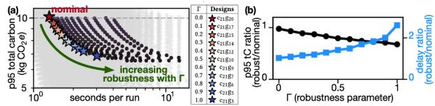
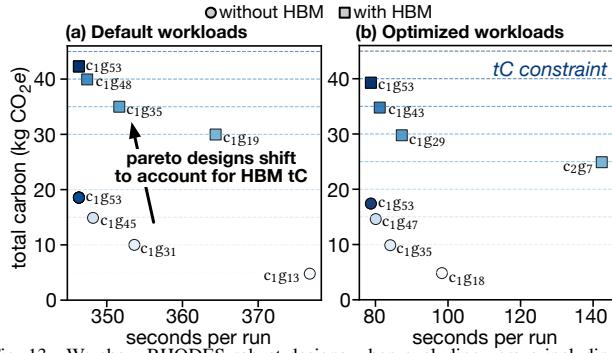
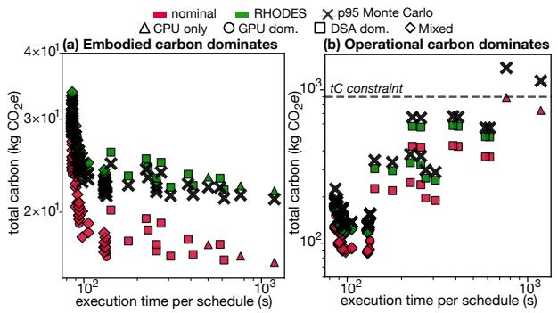
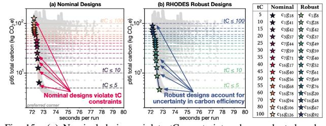
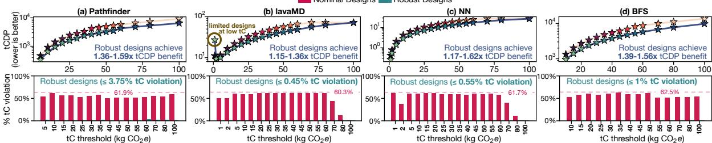
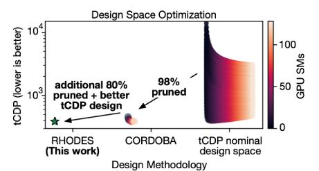
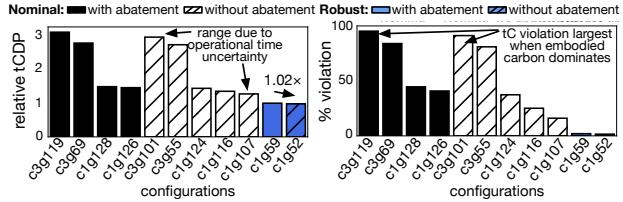
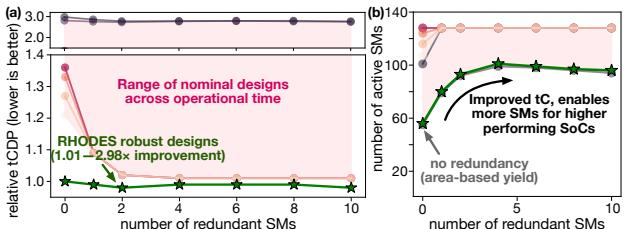

# *B. Minimizing Execution Time Given a tC Constraint*

Optimizing SoCs with CPU cores and GPU SMs. Here, we first consider SoC case studies excluding the carbon footprint of main memory, as this information may not be available at early design stages. Fig. 11 (a)–(d) present the p95 total carbon footprint (y-axis) of the hardware design space exploration for a range of Rodinia workloads [17]; Breadth-First Search

Fig. 12. Designers can tune the level of robustness in RHODES by sweeping the robustness parameter, Γ. (a) Higher Γ increases robustness. (b) Highlights the design trade-offs between robustness (i.e. lower tC) and objective target performance (i.e. execution time) for Heartwall Fig. 11e.

(BFS), Pathfinder, Myocyte, and Heartwall. The x-axis represents operational time quantified by number of workload runs. Each curve corresponds to a distinct SoC design, where red-hued lines indicate nominal designs and blue-hued lines indicate RHODES robust designs. The bottom panels of Fig. 11 capture a specific snapshot of the design space at 5×104 runs, which serves two purposes. It allows us to evaluate the performance of our robust designs excluding the impact of operational time highlighted in Fig. 10, and to explore designs at the cusp of embodied to operational carbon dominance, where embodied carbon dominates at shorter operational times, and operational carbon dominates at longer operational times. We enforce a tC ≤ 10 kg CO2e constraint (dashed line), alongside power and area constraints, where grey points/lines indicate designs that do not meet the design constraints.

In addition to tC and performance metrics, we quantify violation (%) as the fraction of MC samples in which a design exceeds the tC constraint. In Fig. 11 (a)–(b), nominal designs consistently exceed 10 kg CO2e, violating the tC constraint in 49.85%–54.4% of the samples. RHODES designs, on the other hand, have 1.38–1.57× lower tC than their nominal counterparts, with a maximum violation rate of 1.1% tC and negligible performance degradation. This demonstrates two key points. First, *even when operational time is known exactly, uncertainties in other carbon footprint parameters (§III-B) impact designs measurably*. Second, *designers do not necessarily have to sacrifice performance to meet carbon constraints*

EVALUATION FOR A RANGE OF MONTE CARLO DISTRIBUTIONS SAMPLING ACROSS WORKLOADS. TC CONSTRAINT:  $t_C \le 10 \text{ kg CO}_2e$ . N indicates nominal design and **R** indicates RHODES design. RHODES robust designs have  $1-1.5 \times$  lower TC (i.e. better) versus nominal designs.

| Distribution | Function                               | bfs (N:c1g36, R:c1g23) |           | pathfinder (N:c3g20, R:c1g28) |                  | myocyte (N:c1g28, R:c1g28) |       |                  | nn (N:c 1 g 48 , R:c 1 g 37 ) |               |           | heartwall (N:c21g20, R:c21g3) |       |                  |           |       |
|--------------|----------------------------------------|------------------------|-----------|-------------------------------|------------------|----------------------------|-------|------------------|---------------------------------------------------------------------------|---------------|-----------|-------------------------------|-------|------------------|-----------|-------|
| Distribution |                                        | N p95       | $R_{p95}$ | Impr.                         | N p95 | $R_{p95}$                  | Impr. | N p95 | $R_{p95}$                                                                 | Impr.         | $N_{p95}$ | $R_{p95}$                     | Impr. | N p95 | $R_{p95}$ | Impr. |
| Normal       | $\mathcal{N}(\mu, \sigma)$             | 13.39                  | 9.56      | 1.40×                         | 14.00            | 9.31                       | 1.50× | 6.95             | 6.95                                                                      | 1.00×         | 14.60     | 10.03                         | 1.46× | 11.09            | 7.50      | 1.48× |
| Exponential  | $\mu - \sigma + \mathcal{E}(1/\sigma)$ | 13.98                  | 9.87      | $1.42 \times$                 | 14.75            | 9.88                       | 1.49× | 7.36             | 7.36                                                                      | 1.00×         | 14.89     | 10.21                         | 1.46× | 11.37            | 7.62      | 1.49× |
| Uniform      | $U(\mu \pm \sqrt{3}\sigma)$            | 13.53                  | 9.55      | $1.42 \times$                 | 13.92            | 9.48                       | 1.47× | 7.02             | 7.02                                                                      | 1.00×         | 14.77     | 10.13                         | 1.46× | 11.21            | 7.59      | 1.48× |
| Bernoulli    | $\mu - \sigma + 2\sigma B(1/2)$        | 14.03                  | 9.73      | 1.44×                         | 13.46            | 9.81                       | 1.37× | 7.14             | 7.14                                                                      | 1.00×         | 15.01     | 10.29                         | 1.46× | 11.23            | 7.63      | 1.47× |
| Cauchy       | $C(\mu,\sigma)$                        | 13.10                  | 9.30      | $1.41 \times$                 | 13.42            | 9.20                       | 1.46× | 6.75             | 6.75                                                                      | $1.00 \times$ | 14.15     | 9.71                          | 1.46× | 10.82            | 7.46      | 1.45× |

Fig. 13. We show RHODES robust designs when excluding versus including HBM carbon footprint across tC constraints for 9 Rodinia workloads.

under uncertainty. We show RHODES identifies designs that satisfy both objectives simultaneously. We also validate Fig. 11 RHODES designs under a wide range of uncertain parameter distributions simulated using MC in Table IV (see §IV).

Fig. 11c highlights the case where both nominal and RHODES RO independently select the same design,  $c_1g_{28}$ . This outcome is expected when the feasible design space provides sufficient margin from the tC constraint. Even in such cases, optimizing with RHODES is valuable for designers to verify that the selected design is inherently robust. This shows that when sufficient total carbon design margin exists, the convergence of nominal and RHODES optimizations, validates the designer's choice at no additional cost to performance or carbon efficiency.

In contrast, Fig. 11d shows a robust design  $c_{21}g_3$ , while it has  $1.49\times$  lower total carbon than the nominal design  $c_{21}g_{20}$ , it incurs significant performance degradation, indicating that the robust design is overly conservative. To address such scenarios, designers can tune the robustness parameter  $\Gamma$  in the uncertainty sets (§III-A), by sweeping  $\Gamma$  from zero (no uncertainty) to 1 (full uncertainty set), as demonstrated in Fig. 12a (zoomed in). Fig. 12b shows that as  $\Gamma$  increases, the robustness of the designs to total carbon variations improves (black line), while performance degrades (blue line). Therefore, in cases when optimizing under tC uncertainty incurs significant performance degradation, designers can use robustness parameter  $\Gamma$  in RHODES to continuously trade-off the level of tC robustness versus performance degradation according to their design requirements.

**Optimizing SoCs considering main memory.** We also explore the impact of accounting for the tC, both operational and embodied, of main memory (e.g. HBM) into RHODES robust designs. This is particularly important as design stages progress, given that memory has been shown to contribute significantly to the tC of server-grade systems [32]. Fig. 13 shows the shift in RHODES robust designs when excluding (circles) versus including (squares)

Fig. 14. We extend RHODES to optimize for overall execution time by modeling workload level parallelism (WLP) scheduling for heterogeneous SoCs spanning CPU cores, GPU SMs, DSAs and HBM.

Fig. 15. (a) Nominal designs violate tC constraints when evaluated under uncertainty (suboptimal), (b) RHODES robust designs satisfy the same design constraints while accounting for uncertainty. For example, the pathfinder nominal design  $c_{16}g_{126}$  exceeds the tC  $\leq$  100 kg CO2e constraint 58.3% of the time (for  $5\times10^4$  runs), while the corresponding robust design  $c_{16}g_{92}$  violates it only 0.4%, with only 0.1% lower performance (execution time in seconds). RHODES robust design yields  $1.43\times$  carbon efficiency (tCDP) improvement.

HBM carbon footprint across a range of tC constraints (y-axis) and execution time (x-axis) for nine Rodinia workloads. Several Rodinia workloads are setup and teardown-heavy [55], which are CPU-bound. Therefore, we show results for both (a) default setup and teardown times, and (b) optimized setup and teardown times  $(5 \times [55])$  for efficiency-sensitive deployments.

Fig. 13 shows that accounting for HBM tC results in two primary changes in RHODES robust designs. First, tC increases to account for the additional embodied carbon of HBM and the operational carbon of memory transfers, requiring designers to accommodate for higher tC constraints. For example,  $c_1g_{53}$  with HBM incurs  $2.28\times$  higher tC for the same operational time and performance, shifting the satisfied tC constraint from tC  $\leq$  20 kg CO $_2e$  to tC  $\leq$  45 kg CO $_2e$  (Fig. 13a). Second, for the same tC constraint (e.g. tC  $\leq$  30 kg CO $_2e$ ), robust designs with HBM have less compute resources to remain within the tC constraint, e.g.,  $c_1g_{53}$  to  $c_1g_{19}$  in (a), and  $c_1g_{53}$  to  $c_1g_{29}$  in (b). Note that designs in Fig. 13b can sustain higher compute resources (e.g. more GPU SMs) for the same tC constraint compared to (a), since optimized workloads reduce operational carbon.

tc threshold (kg CO2e) tc threshold (kg CO2e) tc threshold (kg CO2e) tc threshold (kg CO2e) tc threshold (kg CO2e) tc threshold (kg CO2e) tc threshold (kg CO2e) Fig. 16. RHODES consistently yields robust designs with improved carbon efficiency (tCDP) compared to nominal designs, which do not consider uncertainty. We calculate the percentage violation rate for the tC threshold based on the number of Monte Carlo samples for each design, where RHODES designs consistently outperform nominal designs. Each distinct tCDP value represents a distinct SoC design (shown in Fig. 15 legend for Pathfinder).

As designs stages progress and memory configurations become known, incorporating memory carbon footprint into RHODES is important to avoid underestimating tC or over-provisioning compute resources that violate tC constraints in practice.

Modeling WLP considering DSAs and HBM. We further showcase the versatility of RHODES by extending it to model workload level parallelism (WLP) [55], i.e. independent application phases concurrently executing on the SoC, by leveraging HILP's ILP Job-Shop Scheduling Problem (JSSP) architecture formulation [55]. Notice that formulating WLP as a JSSP results in an NP-complete problem for large design spaces, making it a time-intensive scheduling optimization problem (we refer interested readers to the details here [55]). Our modeling in §III-B and §III-A applies consistently across problem formulations.

We explore the design space of SoCs with 1, 2 or 4 CPUs, an optional GPU with 4, 16, or 32 SMs, and optional 2 or 4 DSAs with 4 or 16 PEs, scheduling 7 Rodinia workloads. In Fig. 14, each point represents an SoC configuration spanning CPU only, GPU dominant (no DSAs), DSA dominant (no GPU), and mixed (both GPU and DSAs) designs. We show the tC footprint modeled by the nominal optimization, RHODES optimization, and the p95 Monte Carlo simulations to reflect realistic uncertainty.

As in previous case studies, robust design trends observed in Fig. 11 generalize to these more complex heterogeneous SoCs, since the added design complexity does not fundamentally change how RHODES models and accounts for uncertainty. In Fig. 14a, when embodied carbon dominates (e.g. 1 year of hardware use), nominal optimization underestimates total carbon by 1.166×-1.318× when evaluated against p95 tC, while RHODES tC modeling remains within 0.951×-0.970×, reducing the average impact of tC uncertainty by 1.17×. In Fig. 14b, when operational carbon dominates (e.g. 5-7 years of hardware use), nominal optimization underestimates total carbon by  $1.453 \times -1.552 \times$ , while RHODES tC modeling is within 1.093×-1.147× of p95 tC. Furthermore, at a  $tC \le 26 \text{ kg } CO_2 e$  constraint (Fig. 14a), the robust design  $c_1 g_4 d_4^{16}$  achieves 1.16× lower tC than the nominal design  $c_1 g_{32} d_0^0$  with  $0.91 \times$  the performance. Fig. 14b also shows that CPU only designs fail to satisfy the  $tC \le 900 \text{ kg CO}_2 e$  constraint under uncertainty when operational carbon dominates, due to their limited performance and high energy consumption. These results demonstrate that RHODES scales to complex design spaces, spanning CPUs, GPUs, DSAs, main memory, and workload-level parallelism modeling, while consistently producing more robust designs than nominal optimization under uncertainty.

Fig. 17. CORDOBA [23] eliminates 98% of the design space as suboptimal by considering uncertainty only in operational time. RHODES expands carbon-efficient optimization by incorporating multiple uncertainties across tC parameters. RHODES further prunes 80–90% of the remaining designs and uncovers a more carbon-efficient optimum not present in CORDOBA's search space.

## C. Minimizing tCDP

Directly optimizing tCDP, by multiplying total carbon and execution time, in RHODES introduces non-linearity in the decision variables (modeling choices discussed in §III-A). Instead, RHODES traces the Pareto front of total carbon versus execution time by solving a series of linear subproblems: for each tC threshold in an increasing sequence, we minimize execution time subject to the tC threshold constraint. By iterating across tC thresholds, we find the set of Pareto-optimal points for which we can compute tCDP and find the tCDP optimal design without introducing non-linearity into the optimization.

Optimizing SoCs with CPU cores and GPU SMs. Fig. 15 shows that nominal designs, when evaluated against p95 tC, violate tC thresholds by 61.9% for "pathfinder" at a tC threshold of  $10 \log CO_2 e$ . Fig. 16 (a)–(d) quantify tCDP trends across a range of tC thresholds  $(1-100 \log CO_2 e)$  and workloads. Across workloads, RHODES consistently yields more carbon-efficient (lower tCDP) and more robust (lower tC violation) designs than nominal counterparts. The exception is Fig. 16b "lavaMD" at a tC threshold of  $1 \log CO_2 e$ , where the severely constrained design space forces a conservative design  $c_1 g_1$  with low performance. In such cases, designers can explore tuning robustness parameter  $\Gamma$  (Fig. 12, §III-A) directly from RHODES optimization output, without requiring Monte Carlo simulation.

**Evaluating RHODES versus CORDOBA.** Beyond nominal optimization, we evaluate RHODES versus CORDOBA's optimization methodology [23]. CORDOBA employs a discretized approach to optimize tCDP across operational time. Consequently, CORDOBA's output designs depend on the discrete operational times selected by the designer. For example, to optimize SoC configurations for operational time between 3–6 years  $(10^6-8\times10^7 \text{ runs})$  for "heartwall", CORDOBA identifies five tCDP

Fig. 18. Accounting for larger uncertainties in fabrication abatement rates (<95%) yields a different robust design with little carbon efficiency (tCDP) improvement (1.02×). The range of CORDOBA designs (ordered in increasing operational time), consistently perform worse versus RHODES designs.

optimal designs  $c_1g_2$ ,  $c_1g_4$ ,  $c_1g_{10}$ ,  $c_1g_{14}$ , and  $c_1g_{19}$ . Depending on the range of operational times and the size of the design space, a designer may obtain a non-trivial number of candidate designs. The designer then manually selects among these candidate designs, based on available data and practical factors, such as cost and tC-performance trade-offs. RHODES eliminates this manual process by encoding uncertainties across multiple parameters directly into the optimization model, automatically selecting  $c_1g_{16}$  as the robust design, achieving better carbon efficiency than all CORDOBA candidates. Fig. 17 highlights that while CORDOBA eliminates 98% of the original design space as suboptimal, RHODES further prunes 80–90% of the remaining designs, and uncovers a more carbon-efficient design not captured in CORDOBA's candidate design space.

RHODES designs also significantly reduce the simulation-toreal gap. For example, under uniform and normal distributions of operational time, the nominal-to-real gap (including CORDOBA candidate designs) is  $1.23 \times -3 \times$  and  $1.4 - 3.49 \times$ , respectively. RHODES robust designs reduce this gap to  $1.12 \times$  and  $1.01 \times$ , respectively. These results highlight a critical takeaway: while CORDOBA effectively narrows the design space by sweeping tCDP across operational time, it relies on nominal tC parameters. Therefore, CORDOBA is useful when quantifying the relative carbon efficiency of designs, however, its absolute tC estimate can deviate substantially. In cases where a designer must ensure that tC does not exceed a specific threshold, manually selecting an inappropriate CORDOBA design (e.g. due to limited knowledge of uncertain parameters) can result in 95.6% tC threshold violation with a tCDP 3.17× worse than the RHODES robust design (discussed next in Fig. 18). RHODES automates robust carbon-efficient optimization, which is especially useful when optimizing manually over large design spaces with multiple uncertain parameters becomes practically infeasible.

Quantifying the impact of abatement uncertainty. During chip fabrication, abatement systems are used to reduce harmful gas emissions, and abatement rates quantify their effectiveness in reducing GPW's associated emissions. While many carbon quantification models assume high abatement rates (95–99%), foundry reported data are much lower and highly variable (Fig. 6b). To evaluate the impact of this uncertainty, we perform two RHODES optimizations: one with 95% abatement data in the uncertainty set and one with near 0% abatement. Fig. 18 shows that the resulting robust designs differ only slightly, where  $c_1g_{52}$  (near 0% abatement) is only  $1.02\times$  more carbon-efficient than  $c_1g_{59}$  (95% abatement) when evaluated under no abatement

Fig. 19. Designing GPUs with architectural redundancy improves tCDP.

MC simulations. This demonstrates that even when operational carbon dominates, uncertainties in embodied carbon parameters can still shift the robust design. RHODES enables architects to quantify how fabrication uncertainties impact SoC designs and optimizes robust architectures under fabrication variability.

Quantifying the impact of architectural redundancy on car**bon efficiency.** In architectural redundancy [45], [64], additional SMs (cores) are manufactured on a GPU (CPU) die to tolerate more manufacturing defects than designs with no redundancy and area-based yield models [48]. This redundancy introduces a trade-off, where more redundant cores increase die area and accordingly embodied carbon, but simultaneously improve die yield. We quantify how optimizing with tC uncertainty can impact architectural redundancy benefits for robust hardware design. To model redundancy, we calculate the probability that at least the required number of SMs are functional as follows:  $\sum_{k=n_{\text{SMsNeed}}}^{n_{\text{SMsTotal}}} {n_{\text{SMsTotal}} \choose k} (e^{-A_{\text{SM}}D_0})^k (1 - e^{-A_{\text{SM}}D_0})^{n_{\text{SMsTotal}}-k}.$ Fig. 19a shows that RHODES robust design  $c_1g_{56}$  achieves up to 2.98× tCDP improvement with 2 redundant SMs compared to nominal designs (shaded region). Fig. 19b shows that as redundancy improves yield, tC decreases which enables higher performing SoCs with more active SMs. This highlights that a small number of redundant SMs (2-4 SMs) can significantly improve carbon efficiency, by improving defect-tolerance and yield which amortizes embodied carbon. However, over-provisioning redundancy shows diminishing carbon efficiency returns as the embodied carbon overhead outweighs the yield benefits.

## VI. CONCLUSION

RHODES addresses the key challenge of  $\mathcal{D}_A$  uncertainty in optimizing  $CO_2$  efficiency of computing systems, where the severe lack of data prevents designers from being able to precisely quantify underlying probability distributions of key parameters that impact carbon footprint. Methods that rely on probability distributions for uncertainty-aware design are thus insufficient for optimizing  $CO_2$  efficiency of computing systems. Instead, RO techniques in RHODES leverage *uncertainty sets* to jointly optimize carbon footprint and performance, in the presence of  $\mathcal{D}_A$  and  $\mathcal{D}_V$  uncertainties. RHODES can also be extended to account for additional objectives, e.g., related to cost and demand, where RO techniques have been employed extensively.

#### ACKNOWLEDGMENTS

We thank Carole-Jean Wu, Benjamin Boucher, Theodoros Koukouvinos, Periklis Petridis, Dick den Hertog, Dimitris Bertsimas & Flavio Calmon for their valuable discussions. We acknowledge valuable support from the Harvard Salata Institute, NSF Expeditions in Computing: 2326605 & NSF CAREER: 2443303.

## REFERENCES

- [1] "Electricity Maps," 2025. [Online]. Available: https://app.electricitymaps.com/map/
- [2] E. Adida and G. Perakis, "A robust optimization approach to dynamic pricing and inventory control with no backorders," *Mathematical Programming*, vol. 107, no. 1, pp. 97–129, 2006. [Online]. Available: https://doi.org/10.1007/s10107-005-0681-5
- [3] A. Alameldeen and D. Wood, "Variability in architectural simulations of multi-threaded workloads," in *The Ninth International Symposium on High-Performance Computer Architecture, 2003. HPCA-9 2003. Proceedings.*, 2003, pp. 7–18.
- [4] Anonymous, "Uncertainty-aware Carbon Accounting for Large-scale AI models with Market-based Attribution," in *Submitted to The Fourteenth International Conference on Learning Representations*, 2025, under review. [Online]. Available: https://openreview.net/forum?id=T4PMT8ZCZo
- [5] Apple, "iPhone 17 Product Environmental Report," 2025. [Online]. Available: https://www.apple.com/la/environment/pdf/products/iphone /iPhone 17 PER Sept2025.pdf
- [6] D. Bertsimas and B. Boucher, "Probabilistic robust optimization," 2023. [Online]. Available: https://www.dropbox.com/scl/fi/juilh8nbwdzqfdug slnep/Probabilistic Robust Optimization.pdf?rlkey=2tzei01om7a2l7m6 hrqg0mjb1&e=1&dl=0
- [7] D. Bertsimas, D. B. Brown, and C. Caramanis, "Theory and applications of robust optimization," *SIAM Review*, vol. 53, no. 3, pp. 464–501, 2011. [Online]. Available: https://doi.org/10.1137/080734510
- [8] D. Bertsimas, D. de Moor, D. den Hertog, T. Koukouvinos, and J. Zhen, "An exact method for a class of robust nonlinear optimization problems," *25th International Symposium on Mathematical Programming (ISMP 2024)*, 2024. [Online]. Available: https://optimization-online.org/2024/07/anexact-method-for-a-class-of-robust-nonlinear-optimization-problems/
- [9] D. Bertsimas and D. Den Hertog, *Robust and Adaptive Optimization*. Dynamic Ideas LLC, 2022.
- [10] D. Bertsimas and A. G. Koulouras, "Marginal pricing in adaptive robust unit commitment under load and capacity uncertainty," *IEEE Transactions on Power Systems*, vol. 40, no. 1, pp. 341–354, 2025.
- [11] D. Bertsimas and M. Sim, "The price of robustness," *Operations Research*, 2004. [Online]. Available: https://doi.org/10.1287/opre.1030.0065
- [12] J. Bezanson, A. Edelman, S. Karpinski, and V. B. Shah, "Julia: A fresh approach to numerical computing," *SIAM review*, vol. 59, no. 1, pp. 65–98, 2017. [Online]. Available: https://doi.org/10.1137/141000671
- [13] L. Boakes, M. Garcia Bardon, V. Schellekens, I.-Y. Liu, B. Vanhouche, G. Mirabelli, F. Sebaai, L. Van Winckel, E. Gallagher, C. Rolin, and L.- Ragnarsson, "Cradle-to-gate life cycle assessment of cmos logic technologies," in *2023 International Electron Devices Meeting (IEDM)*, 2023, pp. 1–4.
- [14] J. Bornholt, T. Mytkowicz, and K. S. McKinley, "Uncertain¡t¿: a first-order type for uncertain data," *SIGPLAN Not.*, vol. 49, no. 4, p. 51–66, Feb. 2014. [Online]. Available: https://doi.org/10.1145/2644865.2541958
- [15] S. B. Boyd, *Life-cycle assessment of semiconductors*. Springer Science & Business Media, 2011.
- [16] E. Brunvand, D. Kline, and A. K. Jones, "Dark silicon considered harmful: A case for truly green computing," in *2018 Ninth International Green and Sustainable Computing Conference (IGSC)*, 2018, pp. 1–8.
- [17] S. Che, M. Boyer, J. Meng, D. Tarjan, J. W. Sheaffer, S.-H. Lee, and K. Skadron, "Rodinia: A benchmark suite for heterogeneous computing," in *2009 IEEE International Symposium on Workload Characterization (IISWC)*, 2009, pp. 44–54.
- [18] X. Chen, L. Han, A. Bhagavathula, and U. Gupta, "CarbonClarity: Understanding and Addressing Uncertainty in Embodied Carbon for Sustainable Computing," 2025. [Online]. Available: https://arxiv.org/abs/2507.01145
- [19] J. Choe, "HBM (High Bandwidth Memory) Technology Trend: 2024 and Beyond," TechInsights, Tech. Rep., 2024.
- [20] W. Cui and T. Sherwood, "Estimating and understanding architectural risk," in *Proceedings of the 50th Annual IEEE/ACM International Symposium on Microarchitecture*, ser. MICRO-50 '17. New York, NY, USA: Association for Computing Machinery, 2017, p. 651–664. [Online]. Available: https://doi.org/10.1145/3123939.3124541
- [21] L. Eeckhout, "FOCAL: A First-Order Carbon Model to Assess Processor Sustainability," in *Proceedings of the 29th ACM International Conference on Architectural Support for Programming Languages and Operating Systems, Volume 2*, ser. ASPLOS '24. New York, NY, USA: Association for Computing Machinery, 2024, p. 401–415. [Online]. Available: https://doi.org/10.1145/3620665.3640415

- [22] Electric Power Research Institute (EPRI), "Powering Intelligence: Analyzing Artificial Intelligence and Data Center Energy Consumption," 2024. [Online]. Available: https://www.epri.com/research/products/000000003002028905
- [23] M. Elgamal, D. Carmean, E. Ansari, O. Zed, R. Peri, S. Manne, U. Gupta, G.-Y. Wei, D. Brooks, G. Hills, and C.-J. Wu, "CORDOBA: Carbon-Efficient Optimization Framework for Computing Systems," in *2025 IEEE International Symposium on High Performance Computer Architecture (HPCA)*, 2025, pp. 1289–1303.
- [24] C. Elsworth, K. Huang, D. Patterson, I. Schneider, R. Sedivy, S. Goodman, B. Townsend, P. Ranganathan, J. Dean, A. Vahdat, B. Gomes, and J. Manyika, "Measuring the environmental impact of delivering AI at Google Scale," 2025. [Online]. Available: https://arxiv.org/abs/2508.15734
- [25] EPA Facility Level Information on GreenHouse gases Tool (flight), "2023 Greenhouse Gas Emissions from Large Facilities," 2023. [Online]. Available: https://ghgdata.epa.gov/ghgp/main.do#/listFacility/
- [26] F. Fayza, C. Demirkiran, S. P. Rao, D. Bunandar, U. Gupta, and A. Joshi, "Epicarbon: A carbon modeling tool for electro-photonic accelerators," in *2025 IEEE/ACM International Conference On Computer Aided Design (ICCAD)*, 2025, pp. 1–9.
- [27] M. Garcia Bardon, P. Wuytens, L.- Ragnarsson, G. Mirabelli, D. Jang, G. Willems, A. Mallik, A. Spessot, J. Ryckaert, and B. Parvais, "DTCO including Sustainability: Power-Performance-Area-Cost-Environmental score (PPACE) Analysis for Logic Technologies," in *2020 IEEE International Electron Devices Meeting (IEDM)*, 2020, pp. 41.4.1–41.4.4.
- [28] B. Gaudette, C.-J. Wu, and S. Vrudhula, "Improving smartphone user experience by balancing performance and energy with probabilistic qos guarantee," in *2016 IEEE International Symposium on High Performance Computer Architecture (HPCA)*, 2016, pp. 52–63.
- [29] ——, "Optimizing user satisfaction of mobile workloads subject to various sources of uncertainties," *IEEE Transactions on Mobile Computing*, vol. 18, no. 12, pp. 2941–2953, 2019.
- [30] Google, "Environmental Report 2025," 2025. [Online]. Available: https://www.gstatic.com/gumdrop/sustainability/google- 2025 environmental-report.pdf
- [31] D. Grey-Stewart, D. Kong, M. Elgamal, G. Kyriazidis, J. Morris, and G. Hills, "Quantifying trade-offs in power, performance, area, and total carbon footprint of future three-dimensional integrated computing systems," in *2025 Design, Automation Test in Europe Conference (DATE)*, 2025, pp. 1–7.
- [32] U. Gupta, M. Elgamal, G. Hills, G.-Y. Wei, H.-H. S. Lee, D. Brooks, and C.-J. Wu, "ACT: Designing Sustainable Computer Systems with an Architectural Carbon Modeling Tool," in *Proceedings of the 49th Annual International Symposium on Computer Architecture*. New York, NY, USA: Association for Computing Machinery, 2022. [Online]. Available: https://doi.org/10.1145/3470496.3527408
- [33] U. Gupta, Y. G. Kim, S. Lee, J. Tse, H.-H. S. Lee, G.-Y. Wei, D. Brooks, and C.-J. Wu, "Chasing Carbon: The elusive environmental footprint of computing," in *2021 IEEE International Symposium on High-Performance Computer Architecture (HPCA)*. Los Alamitos, CA, USA: IEEE Computer Society, mar 2021, pp. 854–867.
- [34] Gurobi Optimization, LLC, "Gurobi Optimizer Reference Manual," 2024. [Online]. Available: https://www.gurobi.com
- [35] imec, "imec.netzero Public." [Online]. Available: https://netzero.imec-int.com
- [36] S. Ji, Z. Yang, X. Chen, S. Cahoon, J. Hu, Y. Shi, A. K. Jones, and P. Zhou, "Scarif: Towards carbon modeling of cloud servers with accelerators," 2024. [Online]. Available: https://arxiv.org/abs/2401.06270
- [37] A. K. Jones, Y. Chen, W. O. Collinge, H. Xu, L. A. Schaefer, A. E. Landis, and M. M. Bilec, "Considering fabrication in sustainable computing," in *2013 IEEE/ACM International Conference on Computer-Aided Design (ICCAD)*, 2013, pp. 206–210.
- [38] A. K. Jones, L. Liao, W. O. Collinge, H. Xu, L. A. Schaefer, A. E. Landis, and M. M. Bilec, "Green computing: A life cycle perspective," in *2013 International Green Computing Conference Proceedings*, 2013, pp. 1–6.
- [39] S. W. Jones, "Modeling 300mm Wafer Fab Carbon Emissions," in *2023 International Electron Devices Meeting (IEDM)*, 2023, pp. 1–4.
- [40] S. M. Khan and A. Mann, "Ai chips: What they are and why they matter," Center for Security and Emerging Technology, Tech. Rep., 2020.
- [41] D. Kline, N. Parshook, X. Ge, E. Brunvand, R. Melhem, P. K. Chrysanthis, and A. K. Jones, "GreenChip: A tool for evaluating holistic sustainability of modern computing systems," *Sustainable Computing: Informatics and Systems*, vol. 22, pp. 322–332, 2019. [Online]. Available: https://www.sciencedirect.com/science/article/pii/S2210537917300823

- [42] S. Krishnan, A. Yazdanbakhsh, S. Prakash, J. Jabbour, I. Uchendu, S. Ghosh, B. Boroujerdian, D. Richins, D. Tripathy, A. Faust, and V. Janapa Reddi, "ArchGym: An Open-Source Gymnasium for Machine Learning Assisted Architecture Design," in *Proceedings of the 50th Annual International Symposium on Computer Architecture*, ser. ISCA '23. New York, NY, USA: Association for Computing Machinery, 2023. [Online]. Available: https://doi.org/10.1145/3579371.3589049
- [43] S. Longofono, D. Kline, R. Melhem, and A. K. Jones, "Toward secure, reliable, and energy efficient phase-change main memory with MACE," in *2019 Tenth International Green and Sustainable Computing Conference (IGSC)*, 2019, pp. 1–8.
- [44] Y. Luo and L. K. John, "Using Statistical Theory to Study Issues in Microprocessor Simulation," in *Technical Report TR-040225-01. University of Texas, Department of ECE.*, 2008. [Online]. Available: https://lca.ece.utexas.edu/pubs/yue-ibm-cas04.pdf
- [45] R. E. Lyons and W. Vanderkulk, "The use of triple-modular redundancy to improve computer reliability," *IBM Journal of Research and Development*, vol. 6, no. 2, pp. 200–209, 1962.
- [46] F. Mazurek, A. Tschand, Y. Wang, M. Pajic, and D. Sorin, "Rigorous evaluation of computer processors with statistical model checking," in *Proceedings of the 56th Annual IEEE/ACM International Symposium on Microarchitecture*, ser. MICRO '23. New York, NY, USA: Association for Computing Machinery, 2023, p. 1242–1254. [Online]. Available: https://doi.org/10.1145/3613424.3623785
- [47] Microsoft, "2025 Environmental Sustainability Report," 2025. [Online]. Available: https://cdn-dynmedia-1.microsoft.com/is/content/microso ftcorp/microsoft/msc/documents/presentations/CSR/2025-Microsoft-Environmental-Sustainability-Report.pdf
- [48] B. Murphy, "Cost-size optima of monolithic integrated circuits," *Proceedings of the IEEE*, vol. 52, no. 12, pp. 1537–1545, 1964.
- [49] A. C. Newkirk, J. Fernandez, J. Koomey, I. Latif, E. Strubell, A. Shehabi, and C. Samaras, "Empirically-Calibrated H100 Node Power Models for Reducing Uncertainty in AI Training Energy Estimation," 2025. [Online]. Available: https://arxiv.org/abs/2506.14551
- [50] A. Ning, G. Tziantzioulis, and D. Wentzlaff, "Supply Chain Aware Computer Architecture," in *Proceedings of the 50th Annual International Symposium on Computer Architecture*, ser. ISCA '23. New York, NY, USA: Association for Computing Machinery, 2023. [Online]. Available: https://doi.org/10.1145/3579371.3589052
- [51] A. Ning and D. Wentzlaff, "Chip Architectures Under Advanced Computing Sanctions," in *Proceedings of the 52nd Annual International Symposium on Computer Architecture*, ser. ISCA '25. New York, NY, USA: Association for Computing Machinery, 2025, p. 1225–1239. [Online]. Available: https://doi.org/10.1145/3695053.3731012
- [52] I. O'Brien, "Data center emissions probably 662% higher than big tech claims. Can it keep up the ruse?" 2024. [Online]. Available: https://www.th eguardian.com/technology/2024/sep/15/data-center-gas-emissions-tech
- [53] C. I. S. Operator, "California ISO," 2023. [Online]. Available: https://www.caiso.com/TodaysOutlook/Pages/emissions.html
- [54] T. Pirson, T. P. Delhaye, A. G. Pip, G. Le Brun, J.-P. Raskin, and D. Bol, "The environmental footprint of ic production: Review, analysis, and lessons from historical trends," *IEEE Transactions on Semiconductor Manufacturing*, vol. 36, no. 1, pp. 56–67, 2023.
- [55] J. Rogers, L. Eeckhout, and M. Jahre, "HILP: Accounting for Workload-Level Parallelism in System-on-Chip Design Space Exploration," in *2025 IEEE International Symposium on High Performance Computer Architecture (HPCA)*, 2025, pp. 1275–1288.
- [56] J. Rogers, L. Eeckhout, T. Soliman, and M. Jahre, "Neoscope: How Resilient Is My SoC to Workload Churn?" in *Proceedings of the 52nd Annual International Symposium on Computer Architecture*, ser. ISCA '25. New York, NY, USA: Association for Computing Machinery, 2025, p. 1296–1310. [Online]. Available: https://doi.org/10.1145/3695053.3731014
- [57] G. Roussilhe, T. Pirson, M. Xhonneux, and D. Bol, "From silicon shield to carbon lock-in? the environmental footprint of electronic components manufacturing in taiwan (2015–2020)," *Journal of Industrial Ecology*, vol. 28, no. 5, p. 1212–1226, Jul. 2024. [Online]. Available: http://dx.doi.org/10.1111/jiec.13487
- [58] Semiconductor Industry Association (SIA), "Chipmakers Are Ramping Up Production to Address Semiconductor Shortage. Here's Why that Takes Time," 2021. [Online]. Available: https://www.semiconductors.org/chipm akers-are-ramping-up-production-to-address-semiconductor-shortageheres-why-that-takes-time/#:∼:text=Manufacturing%20a%20finished% 20chip%20for,additional%206%20weeks%20to%20complete.

- [59] T. Sherwood, E. Perelman, G. Hamerly, and B. Calder, "Automatically characterizing large scale program behavior," *SIGPLAN Not.*, vol. 37, no. 10, p. 45–57, Oct. 2002. [Online]. Available: https://doi.org/10.1145/605432.605403
- [60] C. C. Sudarshan, N. Matkar, S. Vrudhula, S. S. Sapatnekar, and V. A. Chhabria, "Eco-chip: Estimation of carbon footprint of chiplet-based architectures for sustainable vlsi," in *2024 IEEE International Symposium on High-Performance Computer Architecture (HPCA)*, 2024, pp. 671–685.
- [61] Taiwan Ministry of Economic Affairs, Energy Administration, "2021 Electricity Carbon Emission Factor." [Online]. Available: https://www. moeaea.gov.tw/ECW/English/content/Content.aspx?menu id=20721
- [62] ——, "2022 Electricity Carbon Emission Factor." [Online]. Available: https://www.moeaea.gov.tw/ECW/English/content/Content.aspx?menu id=24200
- [63] ——, "Energy Statistics Handbook 2024," 2024. [Online]. Available: https://www.esist.org.tw/a0303/02/en/publication/handbook/?tab=Sum mary&subtab=
- [64] E. Talpes, D. D. Sarma, G. Venkataramanan, P. Bannon, B. McGee, B. Floering, A. Jalote, C. Hsiong, S. Arora, A. Gorti, and G. S. Sachdev, "Compute solution for tesla's full self-driving computer," *IEEE Micro*, vol. 40, no. 2, pp. 25–35, 2020.
- [65] TechPowerUP, "AMD EPYC 7543," 2025. [Online]. Available: https://www.techpowerup.com/cpu-specs/epyc-7543.c2379
- [66] ——, "NVIDIA A100 PCIe 40 GB," 2025. [Online]. Available: https://www.techpowerup.com/gpu-specs/a100-pcie-40-gb.c3623
- [67] TSMC, "Logic technology." [Online]. Available: https://www.tsmc.com/english/dedicatedFoundry/technology/logic
- [68] ——, "TSMC 2024 Sustainability Report," 2024. [Online]. Available: https: //esg.tsmc.com/file/public/2024-TSMC-Sustainability-Report-e.pdf
- [69] United States Environmental Protection Agency (EPA), "Greenhouse Gas Equivalenies Calculator," 2024. [Online]. Available: https://www.epa.gov/energy/greenhouse-gas-equivalencies-calculator
- [70] U.S. Energy Information Administration, Form EIA-861M, "Electric Power Monthly," U.S. Energy Information Administration (EIA), Tech. Rep., 2026. [Online]. Available: https://www.eia.gov/electricity/monthly/current month/january2026.pdf
- [71] J. Wang, D. S. Berger, F. Kazhamiaka, C. Irvene, C. Zhang, E. Choukse, K. Frost, R. Fonseca, B. Warrier, C. Bansal, J. Stern, R. Bianchini, and A. Sriraman, "Designing cloud servers for lower carbon," in *2024 ACM/IEEE 51st Annual International Symposium on Computer Architecture (ISCA)*, 2024, pp. 452–470.
- [72] M. Wang, W. Lv, F. Yang, C. Yan, W. Cai, D. Zhou, and X. Zeng, "Efficient yield optimization for analog and sram circuits via gaussian process regression and adaptive yield estimation," *IEEE Transactions on Computer-Aided Design of Integrated Circuits and Systems*, vol. 37, no. 10, pp. 1929–1942, 2018.
- [73] Wissolik, Mike and Zacher, Darren and Torza, Anthony and Day, Brandon, "Virtex UltraScale+ HBM FPGA: A Revolutionary Increase in Memory Performance," XILINX, Tech. Rep., 2019. [Online]. Available: https://do cs.amd.com/api/khub/documents/spQZaozIMEJCwco8GlLxPg/content
- [74] T. Xiao, F. F. Nerini, H. D. Matthews, M. Tavoni, and F. You, "Environmental impact and net-zero pathways for sustainable artificial intelligence servers in the USA," in *Nature Sustainability*, vol. 8, 2025, p. 1541–1553.
- [75] Y. Zhao, Y. K. Zhao, C. Wan, and Y. C. Lin, "3d-carbon: An analytical carbon modeling tool for 3d and 2.5d integrated circuits," in *Proceedings of the 61st ACM/IEEE Design Automation Conference*, ser. DAC '24. New York, NY, USA: Association for Computing Machinery, 2024. [Online]. Available: https://doi.org/10.1145/3649329.3658482