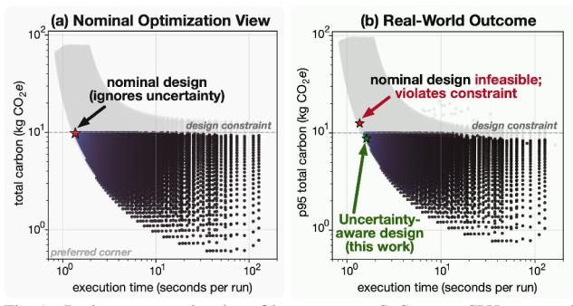
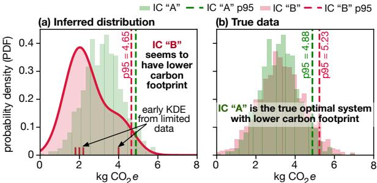
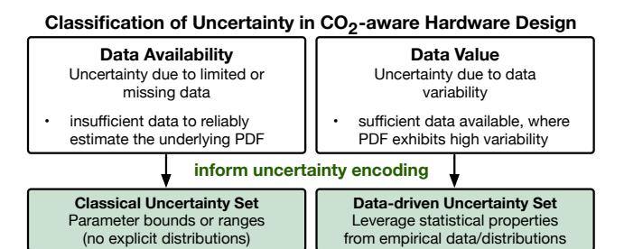
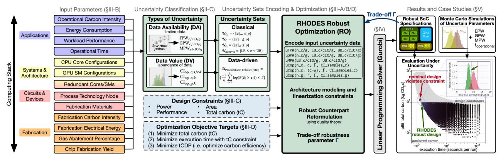
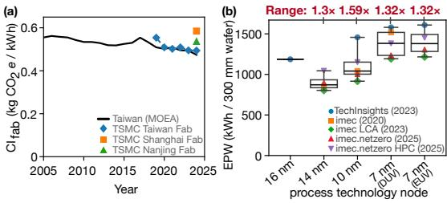
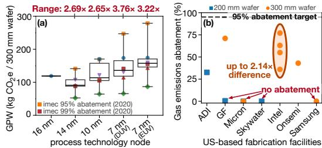
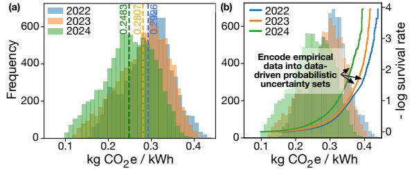
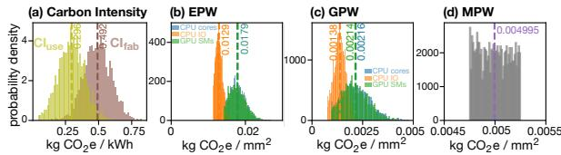
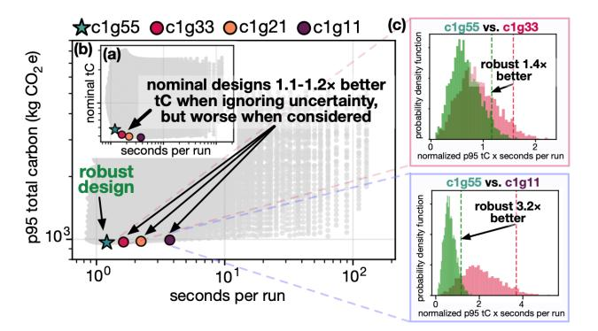
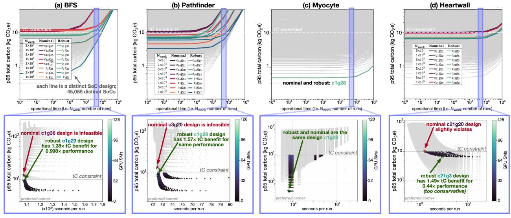

# RHODES: Robust Optimization for Uncertainty-Aware Design of CO2-Efficient Computing Systems

Mariam Elgamal1 , Abdulrahman Mahmoud2 , Gu-Yeon Wei1 , David Brooks1 , Gage Hills1 1Harvard University, 2MBZUAI

*Abstract*—The *inherent uncertainty in quantifying carbon footprint* is a major challenge for designing environmentally sustainable computing systems. While existing efforts propose a variety of approaches to address this uncertainty, optimizing carbon footprint and energy efficiency together, while also accounting for *uncertainty* in carbon footprint, remains challenging. We identify two types of uncertainty in CO2-aware hardware design: *data value* (DV) uncertainty, where probability distributions of CO2-related parameters exhibit high standard deviation (e.g., fluctuations in CO2 emissions of the power grid), and *data availability* (DA) uncertainty, in which probability distributions of CO2-related parameters cannot even be reliably estimated due to a lack of data (e.g., carbon emissions during integrated circuit fabrication, with very few data points available). D*A uncertainty is especially challenging*. To address this challenge, we leverage mathematical Robust Optimization (RO) techniques that enable uncertainty-aware decision-making *without* requiring explicit probability distributions. We present RHODES, a robust optimization framework for designing CO2-efficient computing systems under carbon footprint data uncertainty. RHODES jointly models DV and DA uncertainties at multiple layers of the computing stack to optimize total carbon (tC) under uncertainty, and can target 3 different primary objectives (we include example results for specific systems, details in the full paper): *(1) minimizing execution time given a performance constraint:* designs that do not account for uncertainty incur 1.7× worse tC for the same performance constraint; *(2) minimizing execution time given a tC constraint:* RHODES produces robust designs with 1.36× lower tC and only 0.2% execution time degradation, for complex heterogeneous system-on-chip (SoC), considering domain specific accelerators and workload level parallelism; and *(3) minimizing total carbon delay product (tCDP, a metric of CO*2 *efficiency):* improves tCDP by 1.3–3.17× vs. state-of-the-art CO2-aware optimization frameworks.

## I. INTRODUCTION

Computing is becoming increasingly resource-intensive. For instance, datacenter power demand in the United States alone is projected to grow by 5–15% annually, primarily driven by Artificial Intelligence (AI) workloads and the rapid adoption of large-scale Large Language Models [22]. This growth entails an increase in carbon footprint emissions, which reflects in 2025 corporate sustainability reports, including 23.4% increase of Microsoft's emissions since 2020 [47] and 51% increase of Google's emissions since 2019 [30].

Notably, recent investigations show that carbon footprint emissions of in-house datacenters at major technology companies are 7.62× higher than officially reported between 2020 and 2022 [52]. A recent study projects US datacenter AI emissions to incur between 24 to 44 million metric tons of CO2 equivalents (CO2e) annually by 2030 [74]. The nearly twofold spread between projections is equivalent to adding 5.6 to 10.3 million gasoline-powered cars on the road annually1 , highlighting the scale and uncertainty in carbon emissions. The rapid growth and variation in emissions reporting reveal deep uncertainties in carbon footprint quantification. This variability and uncertainty in quantifying carbon footprint are not merely a reporting problem, but a fundamental design challenge that needs to be explicitly accounted for when optimizing CO2-aware designs.

Quantifying the total carbon footprint of a computing system over its lifetime (tC, quantified in mass of CO2e) includes both *operational carbon* due to hardware use, and *embodied carbon* due to hardware manufacturing [33]. Existing works have developed models and tools to quantify the carbon footprint of a wide range of computing systems [13], [15], [26], [27], [31], [32], [39], [41], [60]. Despite these efforts, carbon quantification data sources are rampant with variability and limited data availability resulting in major uncertainties in the underlying parameters for quantifying carbon footprint.

Uncertainty in carbon footprint results from multiple sources at multiple levels of the computing stack, described in detail in this paper. These include embodied carbon parameters, such as: Materials Per Wafer (MPW) from materials sourcing, Energy Per Wafer (EPW) from energy consumption in integrated circuit (IC) fabrication facilities, and Gases Per Wafer (GPW) from direct gas emissions during fabrication. These parameters suffer from either limited data, e.g. few data points with low statistical confidence, or the use of outdated data, e.g. data from previous generations of technology nodes applied inadequately to more advanced nodes. For instance, embodied carbon parameters from semiconductor supply chains are often inconsistent across vendors and reporting methodologies, and may consist of as few as one data point per technology node (detailed examples in §III-B). Operational carbon parameters also have significant variations and fluctuations beyond the designer's control, these include Carbon Intensity of use (CIuse) dependent on the availability of renewables/nonrenewables, and operational time (toperational), which quantifies the duration of hardware use throughout the system's lifetime. In contrast, carbon intensity data from electrical grids are abundant, regularly updated and in cases live-trackable [1], [53]. This dichotomy creates a fundamental challenge for CO2-aware hardware design optimization, where to optimize the tC of computing systems, methods must remain effective in *both*.

Toward formalizing a framework to quantify carbon footprint in the presence of such wide variability and uncertainty, we classify two types of uncertainty in CO2-aware hardware design:

• Data Value (DV): This uncertainty arises when data are sufficiently available but exhibit variability, such as high standard deviation. Such uncertainty can be addressed using established empirical and learning-based methods [42], [72] that leverage the statistical distributions of the data. A representative example is CIuse.

1Quantified using the US Environmental Protection Agency (EPA) greenhouse gas equivalencies calculator [69].

Fig. 1. Design space exploration of heterogeneous SoC across CPU cores and GPU SMs. (a) The nominal design, optimized without accounting for carbon footprint uncertainty, appears feasible but violates the total carbon constraint once realistic variability is considered. (b) RHODES *optimizes* with uncertainties in multiple carbon footprint parameters, producing an uncertainty-aware design that satisfies design constraints and achieves better carbon efficiency.

• Data Availability (DA): This uncertainty emerges when data are limited (e.g. few data points with wide spread). In this case, the underlying probability distribution functions (e.g. mean, standard deviation, higher order moments) cannot be reliably estimated, due to a lack of statistical significance from a small sample size (as demonstrated in II-A). This includes embodied carbon parameters MPW, EPW, and GPW.

Fig. 1 illustrates the impact of uncertainty on designing carbonefficient computing systems. In this example, we optimize the configuration of a system-on-chip (SoC), including CPU cores and GPU streaming multiprocessors (SMs), to minimize execution time subject to a tC constraint. To quantify the benefits of our approach, we refer to both the *nominal design* and the *robust design*. The *nominal design* is the design optimized without accounting for uncertainty in tC parameters (i.e. assuming that all parameters have their nominal values). This serves as our baseline. The *robust design* is the design optimized while explicitly accounting for uncertainty in tC parameters (this work). We consider the impact of variations on the total carbon footprint of *both* designs. In Fig. 1a, the nominal design appears optimal when evaluated under fixed parameter assumptions. However, under realistic variations the nominal design becomes suboptimal and violates the design constraint (Fig. 1b). This highlights the need for tractable design optimization methodologies that can jointly optimize over multiple uncertain tC parameters, especially when data and distribution knowledge are limited. Even then, optimizing the tC of a computing system under uncertainty along with conventional powerperformance-area optimizations becomes a different undertaking.

To that end, how can we, as computer designers and researchers, systematically and tractably reason about multiple uncertainties, some with unknown distributions, in multiple design parameters while optimizing for different workloads on different architectures? To address this question, we leverage Robust Optimization (RO) [7], [9], a mathematical optimization paradigm for uncertainty-aware decision-making with computational tractability in high dimension problem spaces. RO enables systematic design under uncertainty without requiring explicit probability distributions. This makes RO particularly well-suited for CO2-aware design, where some parameters may have enough data to rely on distribution properties (DV) and other parameters may have limited data (DA) as few as one or four data points! Fig. 1b demonstrates how the robust design (green star) remains feasible and carbon-efficient under these uncertainties.

We develop RHODES2 , a Robust Optimization framework to design carbon-efficient computing systems under carbon footprint data uncertainty. RHODES, implemented in Julia, takes input parameters from multiple layers of the computing stack, including fabrication (e.g. process technology node, die area, embodied carbon data), architectural specifications (e.g. CPU cores, GPUs, domain-specific accelerators, memory, power and bandwidth constraints), and workload characterization data based on HILP's [55] software profiling. Given designer-specified constraints (e.g. power, performance, area, and tC), RHODES jointly models DA and DV uncertainties and creates the vectors and linearized constraints required by our RO formulation. RHODES then invokes an optimization solver (e.g. Gurobi [34]) to identify the carbon-efficient system configuration under uncertainty.

RHODES targets *three primary optimization objectives*, enumerated below. For each objective, we perform Monte Carlo simulations to evaluate the impact of uncertainty on both *nominal designs* and *RHODES designs*, where we show for a variety of case studies:

- ❶ *minimize total carbon given a performance constraint (§V-A):* For SoC configurations with CPU cores and GPU SMs, we show nominal designs incur 1.7× worse tC for the same performance constraint when accounting for uncertainty.
- ❷ *minimize execution time given a total carbon constraint (§V-B):* For SoC configurations with CPU cores and GPU SMs, RHODES produces designs with 1.58× lower tC with only 0.2% execution time degradation and only 1.1% tC constraint violation versus 54.4% tC violation for nominal designs. We show accounting for memory tC in SoC optimization is important, where ignoring it can underestimate tC by 2.28× and lead to overprovisioned compute configurations that violate tC constraints. We further demonstrate the versatility of RHODES by modeling complex heterogeneous design spaces, spanning CPUs, GPUs, domain specific accelerators (DSAs), main memory, and workloadlevel parallelism (WLP): RHODES consistently produces robust designs within 0.951–1.147× of tC simulated using Monte Carlo, versus 1.17–1.55× underestimation by nominal optimization.
- ❸ *minimize total carbon delay product (tCDP) (§V-C):* tCDP [23] is a carbon efficiency that balances energy efficiency and embodied carbon. Compared to CORDOBA [23], a state-of-the-art optimization framework for CO2-aware design, which optimizes tCDP across uncertain operational time, RHODES achieves 1.3–3.17× better tCDP and further prunes 80–90% of CORDOBA's design space to uncover a more carbon-efficient design not captured by CORDOBA. Beyond operational time, we show that fabrication uncertainties (e.g. variable abatement rates) can shift the optimal robust architecture, including when operational carbon dominates improving tCDP by 1.02×. We show incorporating architectural redundancy improves tCDP by 1.01–2.98× in GPU dominant SoCs.

2https://github.com/mariamelgamal/RHODES

Fig. 2. While statistical methods are useful in characterizing uncertainties, inferring distributions, e.g. using kernel density estimation (KDE), with limited data can lead to incorrect conclusions and optimizations.

#### II. RELATED WORKS AND BACKGROUND

We begin by discussing prior statistical methods used to tackle uncertainty in quantifying carbon footprint (§II-A), and related works (§II-B). §II-C provides a brief primer for RO.

## A. Understanding the Impact of $\mathcal{D}_A$ Uncertainty

Here we focus on the impact of  $\mathcal{D}_A$  uncertainty, when there is very little data. Toward understanding uncertainty in  $CO_2$ -aware computing, recent works have proposed statistical frameworks, e.g. using kernel density estimations (KDE), to capture uncertainties in carbon footprint parameters through estimating their probability density functions (PDFs) [4], [18], mapping  $\mathcal{D}_A$  uncertainty into  $\mathcal{D}_V$  uncertainty. In Fig. 2, we demonstrate how statistical inference with limited data can lead to misleading conclusions.

Consider, as an illustrative example, two integrated circuits (ICs) "A" and "B". IC "A" is manufactured at a lagging technology node with abundant data to quantify the embodied carbon footprint estimate. IC "B" is fabricated at a more advanced technology node, which has only four available data points. By applying KDE using a gaussian kernel to IC "B"'s sparse data and computing the 95th-percentile (p95) carbon footprint, the designer may conclude that IC "B" has lower carbon footprint than IC "A" (Fig. 2a). However, as more data become available for IC "B"'s process technology node, the estimated p95 reverses, revealing that IC "A" has the lower carbon footprint (Fig. 2b). This example highlights how statistical methods alone are insufficient when data are sparse, limiting their effectiveness for large-scale CO2-aware design optimization across many uncertain parameters.

Unlike power or performance which can be empirically measured and calibrated [49], carbon quantification depends on incomplete and a multitude of data sources from supply chain life cycle assessments [5], [13], [15], and other carbon footprint models [27], [31], [32], [35], [39], [41]. Capturing these diverse sources of uncertainty and encoding them appropriately within optimization frameworks is essential for robust CO2-aware design.

#### B. Related Works

There are a range of works on CO2-aware design in the presence of uncertainty, and a wide range of statistical methods to deal with variability. Such methods, including stochastic optimization [72], Bayesian optimization [42], and statistical machine learning methods [42], along with many of the works described

Fig. 3. RHODES classification of uncertain data in CO2-aware hardware design.

below are well-suited when uncertain data are available ( $\mathcal{D}_V$  uncertainty). However, many of these approaches are not specifically designed to deal with  $\mathcal{D}_A$  uncertainty, and thus their effectiveness degrades when data are extremely sparse (e.g. the KDE example in §II-A). The benefit of *Robust Optimization (RO)* is it does not rely on the underlying probability distribution function, and instead relies on the formulation of deterministic uncertainty sets (§III-A). RHODES is specifically designed to deal with  $\mathcal{D}_A$  uncertainty and also simultaneously deals with  $\mathcal{D}_V$  uncertainty, making it especially suitable for  $CO_2$ -aware design optimization.

Prior works have quantified and modeled the rising environmental impact and carbon emissions of computing systems [13], [16], [24], [27], [31], [33], [36]–[39], [43], [54], [57], [71]. To enable designers to trade-off environmental impacts of competing systems, GreenChip [41] quantifies embodied and operational carbon of a wide range of computing systems, and integrates with architecture simulators to evaluate system trade-offs using indifference point analysis. To quantify carbon footprint of chips manufactured at sub-28 nm technology nodes, ACT leverages fabrication characterization and industry data, and proposes carbon-centric design metrics [32]. ECO-CHIP [60], 3D-Carbon [75], and EPiCarbon [26] model the carbon footprint of emerging integration techniques and technologies, such as three-dimensional ICs, chiplets and electro-photonic accelerators.

To address the inherent uncertainties in carbon footprint data, FOCAL proposes a parameterized first-order model using first principles to evaluate processor sustainability [21]. Prior efforts such as GreenChip utilize indifference point analysis to identify break-even points between two designs [31], [41]. CarbonClarity leverages statistical methods, such as KDE, to model temporal and spatial uncertainties in embodied carbon footprint [18]. To optimize computing systems for carbon efficiency, CORDOBA utilizes the Lagrange multiplier when the carbon intensity of use is unknown at design time, as well as heuristic methods to optimize over uncertain hardware operational time [23]. Neoscope proposes an Integer Linear Programming (ILP) tool to investigate SoC architectures resilient to workload churn and leverages FOCAL to quantify SoC carbon efficiencies [56].

Apart from sustainable computing, prior works have explored a plethora of statistical methods to better characterize and quantify the impact of uncertainty, such as runtime variability, on design decisions and simulations [3], [14], [20], [28], [29], [44], [46], [59]. To quantify architecture risk, prior work utilizes Monte Carlo-based uncertainty injection to model process, design, and projection variations using synthetic distributions [20].

Fig. 4. RHODES, our robust optimization framework for uncertainty-aware design of carbon-efficient computing systems.

#### C. Robust Optimization Primer

Optimization methods offer tractable and practical solutions for high dimensional problems. We leverage Robust Optimization (RO), a subfield of optimization that explicitly encodes the uncertainty in the optimization problem, by systematically separating uncertain numerical data from the deterministic structure of the optimization problem, which is known in advance and common across all realizations of the uncertainty [7], [9]. RO transforms the underlying uncertainties in the problem into tractable deterministic formulations by defining uncertainty sets (described in §III-A), which bound the possible realizations of the uncertain parameters [9]. RO does not rely or require assumed or known data distributions. This is a key advantage of RO, where uncertainty sets can be constructed using the properties of existing distributions or empirical data, without needing the full data distribution. This enables RO to maintain the tractability of deterministic optimization models, while enabling robustness to parameter variations.

Implementing an RO problem begins similarly as a standard deterministic optimization formulation: defining the objective function, design constraints, and the uncertain parameters. However, the key difference is the robust solution must remain feasible for all realizations of the uncertain parameters within the uncertainty set, which introduces an infinite number of constraints that cannot be solved directly. To preserve tractability, we reformulate the problem into an equivalent deterministic optimization problem, the *robust counterpart*, introducing additional variables and constraints to model the uncertainty. This reformulation method collapses all possible uncertainty realizations, as defined by the uncertainty set, into a deterministic problem that can be efficiently solved using conventional optimization solvers. Deriving the robust counterpart typically requires advanced knowledge of duality theory (we refer interested readers to literature [7], [9], [11]).

RHODES leverages RO and bridges the gap between RO theory and practical CO2-aware design. Fig. 3 illustrates how we classify uncertain parameters in CO2-aware hardware design, which informs the mathematical formulations of our uncertainty set encoding detailed in §III-A.

## III. RHODES FRAMEWORK

In this section, we dive into the implementation details of our RHODES framework. First, \$III-A details the mathematical

TABLE I
PARAMETERS IN RHODES. PARAMETERS WITH UNCERTAINTY ARE BOLDED.

| Type                  | Symbol                                                                                                                        | Description                                                                                                                                                                                                                                                                                                                                                                                                                                 | Units                                                                                                                                                                                                                   |  |  |  |
|-----------------------|-------------------------------------------------------------------------------------------------------------------------------|---------------------------------------------------------------------------------------------------------------------------------------------------------------------------------------------------------------------------------------------------------------------------------------------------------------------------------------------------------------------------------------------------------------------------------------------|-------------------------------------------------------------------------------------------------------------------------------------------------------------------------------------------------------------------------|--|--|--|
| Input Parameters   | EPW MPW GPW D0 toperational CI fab CI use $T_{k,i}$ $P_{k,i}$ $A_i$ $\mathcal{K}_i^f$ $\mathcal{K}_o^c$ | Electrical energy consumption in IC fabrication Emissions due to materials procured for fabrication Direct gases emitted during IC fabrication Defect density for yield estimation Operational time quantified by number of cycles Carbon intensity of fabrication energy source Use-phase carbon intensity Execution time of workload $k$ on die $i$ Power per workload $k$ on die $i$ Area of die $i$ Production cost per area of die $i$ | kWh cm -2 g CO 2 e cm -2 g CO 2 e cm -2 defects cm -2 workload runs g CO 2 e kWh -1 s W mm 2 \$ USD mm -2 |  |  |  |
|                       | $\mathcal{K}^o$                                                                                                               | Operational cost per kWh                                                                                                                                                                                                                                                                                                                                                                                                                    | \$ USD kWh -1                                                                                                                                                                                                |  |  |  |
| Decision Variables | $c_n$ $g_m^f$                                                                                                                 | Number of CPU cores $n$ Number of GPU SMs $m$ and frequency $f$ in MHz                                                                                                                                                                                                                                                                                                                                                                      | count                                                                                                                                                                                                                   |  |  |  |
| Output Parameters  | $\begin{array}{l} {\rm A_{total}} \\ {\rm T}_k \\ {\rm E}_k \\ {\cal K}_k \\ {\rm tC}_k \end{array}$                          | Total area of SoC components $(c_n, g_n^f)$ Delay of workload $k$ on SoC Operational energy per workload $k$ on SoC Total cost per workload $k$ on SoC Total cost per workload $k$ on SoC                                                                                                                                                                                                                                       | mm 2 s kWh \$ USD g CO 2 e                                                                                                                                                                        |  |  |  |

formulations of RHODES uncertainty sets implementation. Second, §III-B details the parameters we consider for quantifying total carbon and their uncertainties, which are then encoded into the *uncertainty sets*. Third, we detail how RHODES performs architectural modeling based on heterogeneous System-on-Chip (SoCs) to model a rich set of design requirements, constraints, and choices for uncertainty-aware design space optimization (§III-C). While this paper focuses on heterogeneous SoC design space, RHODES is a modularized uncertainty-aware framework for carbon-efficient design that can be easily extended to other interesting architectural design spaces. Lastly, §III-D illustrates the variety of optimization targets and constraints supported by RHODES. Fig. 4 shows an overview of our RHODES framework. Table I describes the input parameters, decision variables, and output parameters of RHODES.

#### A. Encoding the Uncertain Data into Uncertainty Sets

We formalize the mathematical formulations of the uncertainty sets used to encode the uncertainty parameters described in §III-B, following the classification of  $\mathcal{D}_A$  versus  $\mathcal{D}_V$  in Fig. 3, where each uncertainty set is denoted by  $\mathcal{U}$ . Uncertainty sets capture the range of possible realizations for each uncertain parameter (extensive details in [9]) and are the foundation of the RO formulation in RHODES.

 $\mathcal{D}_A$  Uncertainty Sets.  $\mathcal{D}_A$  uncertainties are modeled using fundamental classical uncertainty sets (eq. 1), that do not require

complete knowledge of the underlying data distribution. Common choices include the box uncertainty  $\mathcal{U}_{\ell_\infty}$ , which bounds uncertain parameters within the interval  $[-\rho,\rho]$ , as well as the interval set  $\mathcal{U}_{\text{interval}}$ , where users can define explicit upper (UB) and lower (LB) bounds for their uncertain parameters (others in [9]). Both uncertainty sets represent cases where no additional information is available on the statistical relationships among uncertain variables, which currently holds for many tC parameters (e.g. EPW, MPW, GPW). With more knowledge of the parameter relationships (even without more data), less conservative uncertainty sets, such as  $\mathcal{U}_{\ell_1}$  based on the L1 norm and  $\mathcal{U}_{\ell_2}$  uncertainty set based on the euclidean (i.e. L2) norm3 can be employed.

$$\begin{split} & \mathcal{U}_{\ell_{\infty}} = \{z \in \mathbb{R}^{n} : \|z\|_{\infty} \leq \rho\}, \quad \mathcal{U}_{\ell_{1}} = \{z \in \mathbb{R}^{n} : \|z\|_{1} \leq \rho\}, \\ & \mathcal{U}_{\ell_{2}} = \{z \in \mathbb{R}^{n} : \|z\|_{2} \leq \rho\}, \quad \mathcal{U}_{\text{interval}} = \{z \in \mathbb{R}^{n} : \text{LB} \leq z \leq \text{UB}\} \quad \text{(1)} \\ & \mathcal{U}_{\text{budget}} = \{z \in \mathbb{R}^{n} : \|z\|_{1} \leq \rho, \ \|z\|_{\infty} \leq \Gamma\}. \end{split}$$

We modularize these diverse uncertainty sets in RHODESfor users to freely determine their uncertainty conservativeness and the relationships of their tC parameters, especially as more data and parameters become available. In this paper, we use  $\mathcal{U}_{interval}$  and  $\mathcal{U}_{\ell_{\infty}}$  with tuned robustness parameters (see Fig. 12), to explore the trade-off between robustness and performance optimality in uncertainty-aware carbon-efficient design. Another uncertainty set  $\mathcal{U}_{budget}$  (§III-A) avoids being overly conservative by leveraging Central Limit Theorem conclusions (we refer interested readers to [9]), where it is statistically unlikely for all uncertain parameters to reach their extreme values at the same time. We leverage  $\mathcal{U}_{budget}$  in our WLP case study (§V-B) to prevent optimizing for worst-case values simultaneously across EPW, GPW, and MPW across the different SoC components.  $\mathcal{D}_{\mathbf{V}}$  Uncertainty Sets. As more data becomes available, it is important to leverage available data to construct more accurate and less conservative uncertainty sets. We particularly focus on the probabilistic robust (PRO) uncertainty set  $\mathcal{U}_{PRO}$  [6], due to its ability to model heavy-tailed data samples and its effectiveness in reducing the average constraint violations compared to fundamental  $\mathcal{U}$ .

$$\mathcal{U}_{\text{PRO}} = \{ z \in \mathbb{R}^n : \frac{-1}{n} \sum_{i=1}^n log(\mathbb{P}(\tilde{z}_i \ge z_i)) \le \Gamma \}, \tag{2}$$

where  $\Gamma > 0$  is the probabilistic parameter threshold (set to 1 in our experiments, more details in [6]), and n is the number of independent uncertain parameters. This uncertainty set is derived from the reliability function (or log-survival), that is the probability of survival (complementary to the cumulative distribution function, i.e. CDF, which represents the probability of failure). Therefore,  $\mathcal{U}_{PRO}$  fully leverages the available information about the uncertainty, where the reliability function captures the entire distribution, including tail behavior, and can distinguish between different distributions even when they share the same mean and variance. Fig. 7 illustrates the reliability functions (i.e. log-survival curves) of the yearly CAISO  $\mathcal{D}_{V}$  data used to construct  $\mathcal{U}_{PRO}$  for  $CI_{use}$  and  $CI_{fab}$ . Furthermore,  $\mathcal{U}_{PRO}$  can be formulated from sampled empirical data (e.g. using Monte Carlo simulations). Using ordered samples  $y_{i,1} \leq ... \leq y_{i,N_{data}}$ ,

3Lp norm is defined as 
$$||x||_p = (\sum_{i=1}^n |x_i|^p)^{\frac{1}{p}}$$
, where  $p > 0$ .

Fig. 5. (a) Depending on the fabrication facility's carbon intensity data,  $CI_{fab}$  may exhibit either a data availability ( $\mathcal{D}_A$ ) or a data value ( $\mathcal{D}_V$ ) uncertainty. Here,  $CI_{fab}$  is treated as a  $\mathcal{D}_A$  parameter based on the limited data reported in TSMC's public sustainability reports [61]–[63]. If grid level data such as CAISO (Fig. 7) are applicable,  $CI_{fab}$  should be modeled as a  $\mathcal{D}_V$  parameter to capture temporal variations in carbon intensity. (b) EPW data [13], [27], [35], [39] illustrate a  $\mathcal{D}_A$  uncertainty (up to 5 data points per technology node).

we can estimate  $\mathbb{P}(\tilde{z}_i \geq y_{i,j}) \approx \frac{N_{\text{data}} + 1 - j}{N_{\text{data}}}$  [6]. Hence, PRO can generalize to enable uncertainty sets constructed from empirical data to accurately capture real-world variability.

Given the uncertain parameter  $z_i = y_{i,j}$ , and using linear strong duality, we implement the robust counterpart [6], which adds one constraint per data sample  $N_i$  and is equivalent to

$$\begin{cases}
n\Gamma\alpha + \sum_{i=1}^{n} \beta_{i} \leq b, \\
-\log\left(\frac{N_{i}+1-j}{N_{i}}\right)\alpha + \beta_{i} \geq x_{i}y_{i,j}, \quad \forall i \in [n], \ \forall j \in [N_{i}], \\
\alpha \geq 0
\end{cases}$$
(3)

Eq. 3 is the robust counterpart of  $\mathcal{U}_{PRO}$  in eq. 2 when solved with sample distributions, where  $\alpha$  and  $\beta$  are dual variables (extensive details in [6]). This enables us to sample any dataset to model and optimize over PRO uncertainty.

## B. Parameters Contributing to Uncertainty in tC

The total carbon footprint (tC) of an IC is quantified as follows [23], [32]:

$$tC = C_{embodied} + C_{operational}$$

$$= (CI_{fab} \cdot EPW + MPW + GPW) \cdot \frac{A}{Y} + \int_{0}^{t_{operational}} CI_{use}(t)P(t)dt$$
 (4)

where  $C_{embodied}$  is the embodied carbon footprint due to fabrication, and  $C_{operational}$  is the operational carbon footprint due to hardware use.  $C_{embodied}$  is quantified by summing the contributions from the total  $CO_2e$  impact of the fabrication electrical energy consumption EPW, the fabrication materials MPW, and the direct gases emitted during the fabrication process GPW. A and Y are the chip area and yield.  $CI_{fab}$  is the carbon intensity of the energy source used in fabrication.  $C_{operational}$  is computed by quantifying the total  $CO_2e$  impact of system use over its operational lifetime  $t_{operational}$ , where  $CI_{use}$  is the carbon intensity of the electricity consumed to power P the system. Extensive details for quantifying tC are in [23], [31], [32], and we describe the relevant information that relates to uncertainty in the remainder of this sub-section.

Building on the classification in Fig. 3, we construct the corresponding uncertainty sets in RHODES RO models. Each parameter is classified into  $\mathcal{D}_V$  or  $\mathcal{D}_A$  uncertainty. Table II shows the quantitative parameters for  $\mathcal{D}_A$  uncertainty set formation. Exact equations for deriving values used for  $\mathcal{D}_V$  and  $\mathcal{D}_A$  uncertainty sets are in our github repository.

Fig. 6. (a) GPW  $\mathcal{D}_A$  uncertainty across technology nodes accounting for 95–99% abatement [13], [27], [35], [39] (legend follows Fig 5b). (b) Reported gas abatement percentages in US-based fabrication facilities [25] often do not meet the 95% abatement target, including many with 0% abatement.

CIfab. While grid level carbon intensity data may be available through public platforms, such as CAISO [53] and Electricity Maps [1], fabrication facilities often source power from multiple sources, including on-site renewable generation and uninterruptible power supply systems [68]. For example, Fig. 5a shows the carbon intensity of Taiwan's grid (between 0.474–0.562 kg CO2e per kWh) versus TSMC fabrication facilities (between  $0.494-0.5849 \text{ kg CO}_2e \text{ per kWh}$  [61]-[63], [68]. The duration of IC fabrication is typically on the order of several months [58], which also results in temporal fluctuations in carbon intensity that need to be accounted for. Therefore, we classify CIfab as a data value  $\mathcal{D}_V$  uncertainty parameter, to capture temporal and regional variations of the energy sources ( $\mathcal{D}_{V}$  example shown in Fig. 7). In cases of data scarcity, CIfab can alternatively be modeled as a  $\mathcal{D}_{A}$  uncertainty parameter (such as Fig. 5a). Both uncertainty formulations are supported in RHODES (further details in Table II). EPW. The electrical energy consumption of IC fabrication tools is dependent on wafer throughput, process technology node, and fabrication facility-specific process flows, tools and utilization. Fig. 5b highlights the wide range of EPW data uncertainty per process technology node for a 300 mm Si wafer (up to 1.59× variation per technology node) [13], [27], [35], [39]. Reported datasets also differ in scope and system boundaries. For instance, the fabrication tools model in ( ) imec (2020) [27] assumes 100% tool utilization, whereas imec LCA (2023) [13] assumes 70% utilization with 50% idle energy consumption (♠). Such variations are largely beyond the designer's control, and large-scale production often spans multiple fabrication facilities with distinct infrastructures and energy profiles. These variations underscore the importance of incorporating EPW as a  $\mathcal{D}_A$ uncertainty to model variations across fabrication environments. GPW. Direct gas emissions and abatement practices vary widely across fabrication facilities, where abatement refers to on-site treatment systems that reduce or neutralize greenhouse gases produced during IC fabrication. Fig. 6a shows GPW data with up to  $3.76\times$  variation per technology node at  $\geq 95\%$  abatement, exhibiting  $\mathcal{D}_A$  uncertainty. Fig. 6b illustrates the gap between reported abatement values in US-based fabrication facilities from [25] (between 0%-77%) versus the 95-99% abatement levels commonly assumed in carbon quantification models [13], [27]. Even within the same vendor, abatement percentages can vary significantly across facilities. For example, in 2023 Intel US-based 300 mm wafer fabrication facilities reported abatement percentages ranging between 36%-77% (2.14× difference). As a case

Fig. 7. (a)  $CI_{use}$   $\mathcal{D}_V$  uncertainty illustrated through variations in the carbon intensity of the California grid (CAISO [53]) across 12 months between years 2022-2024, due to fluctuations in renewable versus non-renewable energy generation. The dataset provides hourly measurements equivalent to 720 points per month. (b) We encode the CAISO data into a probabilistic robust uncertainty set  $\mathcal{U}_{PRO}$ , to capture temporal and energy source fluctuations, modeling  $CI_{use}$  as a  $\mathcal{D}_V$  uncertainty independent of the data distribution.

study, we evaluate how uncertainty in GPW, due to abatement percentages, impacts robust  $CO_2$ -aware SoC design in §V-C. **MPW.** MPW is one of most difficult and least quantified parameters in carbon quantification efforts. Many prior works either omit or assume a constant value across all process technology nodes due to outdated or scarce data [32]. Recent works have begun to quantify MPW emissions more thoroughly through detailed analysis of fabrication process flows [31]. Accordingly, we model MPW using a conservative  $\pm 5\%$   $\mathcal{D}_A$  uncertainty for nominal MPW (500 g  $CO_2e$  per cm²) across all technology nodes. As improved data become available, RHODES uncertainty sets can be readily updated, reflecting the generality of our methodology rather than dependence on any specific dataset.

**Yield.** Fabrication yield is vendor and process dependent, varying with defect density  $(D_0)$  and node maturity, making it a  $\mathcal{D}_A$  uncertainty. Since the SoCs in our design space are fabricated at mature nodes, 7 nm (EUV) and 12 nm (in mass-production since 2018 and 2013, respectively [67]), we model yield deterministically using a Murphy yield model [48] with 0.1–0.15 defects per cm²  $(D_0)$ . Yield is therefore not explicitly treated as an uncertainty in RHODES, although its area dependence is inherently captured in the optimization. In §V-C, we evaluate the impact of redundant cores/SMs on the carbon efficiency of robust designs.

 $\text{CI}_{\text{use}}$ . Similar to  $\text{CI}_{\text{fab}}$ ,  $\text{CI}_{\text{use}}$  depends on the energy mix and fluctuations of the grid during system operation. The use of renewable versus non-renewables significantly impacts  $\text{CI}_{\text{use}}$  and the overall operational carbon of the system (e.g. the difference between a coal versus a solar-powered grid is  $19.5 \times [32]$ ). We leverage the CAISO dataset with hourly granularity [53], which enables a  $\mathcal{D}_V$  uncertainty parameter. Fig. 7 shows the empirical  $\text{CI}_{\text{use}}$  data we encode into a  $\mathcal{D}_V$  probabilistic robust uncertainty set ( $\mathcal{U}_{PRO}$  [6]), that is independent of the underlying data distribution.

 $t_{operational}$ . Operational time is the total execution time of the system, including background processes and idle time (i.e. when the system is consuming energy). Since  $t_{operational}$  is dependent on hardware use and user behavior, it is difficult to determine apriori at design time. Operational time also influences whether a system is embodied or operational carbon dominant, determining how embodied carbon amortizes over the system's lifetime [21], [23], [41]. While major hardware vendors may have internal profiling data, we account for the common case where hardware use data are unavailable and model operational time as a  $\mathcal{D}_A$  uncertainty.

#### TABLE II

UNCERTAINTY SETS IN RHODES. FPW AND GPW ARE DISTINCT FOR CPU CORES (c), CPU I/O DIE (cIO), AND GPU SMS (g), DEPENDING ON THE TECHNOLOGY NODE,  $C_{OP}$  DEPENDS ON THE SETUP/TEARDOWN (s/td) ON CPU cores, and compute phase selection (k) on CPU or GPU.  $n_{c/g}$ IS NUMBER OF CPU CORES/GPU SMs. WE SHOW EXAMPLE PARAMETER VALUES USED TO ENCODE UNCERTAINTY SET PARAMETERS IN RHODES.

ARE VECTORS OF SAMPLED CI

| CI SAMPLES ARE VECTORS OF SAMPLED CI USE (FIG. 7).                                                                                                 |                                               |                                                                                                                                                                                                                                                                       |  |  |  |  |  |  |  |  |  |
|--------------------------------------------------------------------------------------------------------------------------------------------------------------------------|-----------------------------------------------|-----------------------------------------------------------------------------------------------------------------------------------------------------------------------------------------------------------------------------------------------------------------------|--|--|--|--|--|--|--|--|--|
| Parameter                                                                                                                                                                | Type Uncertainty Set Function $(\mathcal{U})$ |                                                                                                                                                                                                                                                                       |  |  |  |  |  |  |  |  |  |
| $\begin{array}{c} \operatorname{FPW}_{c/c\operatorname{IO}/g} \\ \operatorname{GPW}_{c/c\operatorname{IO}/g} \\ \operatorname{MPW}_{c/c\operatorname{IO}/g} \end{array}$ | $\mathcal{D}_{A}$ $\mathcal{D}_{A}$           | $ \begin{array}{l} \mathcal{U}_{interval} \colon \text{uFPW (n\_c/g, LB\_c/cIO/g, UB\_c/cIO/g)} \\ \mathcal{U}_{interval} \colon \text{uGPW (n\_c/g, LB\_c/cIO/g, UB\_c/cIO/g)} \\ \mathcal{U}_{interval} \colon \text{uMPW (LB\_c/cIO/g, UB\_c/cIO/g)} \end{array} $ |  |  |  |  |  |  |  |  |  |
| $C_{\text{op, }c,s/td}$ $C_{\text{op, }c,k}$ $C_{\text{op, }g,k}$                                                                                                        | $\mathcal{D}_{V}$                             | $\mathcal{U}_{PRO}$ : uCop(n_c, c, $\Gamma$ , CI_samples_c) $\mathcal{U}_{PRO}$ : uCop(n_c, (c-w), $\Gamma$ , CI_samples_c) $\mathcal{U}_{PRO}$ : uCop(n_g, r, $\Gamma$ , CI_samples_g)                                                                               |  |  |  |  |  |  |  |  |  |
| Example Parameter Values (kg CO 2 e / 300 mm wafer)                                                                                                           |                                               |                                                                                                                                                                                                                                                                       |  |  |  |  |  |  |  |  |  |
|                                                                                                                                                                          | LB_c                                          | UB_c LB_cIO UB_cIO LB_g UB_g                                                                                                                                                                                                                                          |  |  |  |  |  |  |  |  |  |
| FPW GPW MPW                                                                                                                                                        | 565.5 65.7 318.1                        | 888.0     380.6     587.3     565.5     904.3       247.1     52.5     141.2     65.7     247.1       388.8     318.1     388.8     318.1     388.8                                                                                                                   |  |  |  |  |  |  |  |  |  |

**Modeling Choices.** To maintain the linearity of our optimization, we ensure that the tC formulation remains linear in the uncertain parameters (eq. 4). For instance, directly accounting for uncertainties in CIfab and EPW, or CIuse and toperational would result in nonlinearity in the uncertain parameters. To preserve linearity and improve tractability at large design spaces, we recognize without loss of generality that unknown multiplied by unknown is the same as unknown multiplied by a constant. Therefore, we treat the products of the uncertain parameters as new linearized variables; CIfab and EPW are combined into FPW and CIuse and toperational are combined into the new linear parameter Cop. This transformation maintains the model's linearity without explicitly introducing nonlinear uncertainty terms. We leave explicit definition of the nonlinear uncertainties, which can be done by leveraging state-of-the-art RO techniques such as the Reformulation Perspectification Technique (RPT) [8], for future work. Table II summarizes example uncertainty sets implemented in RHODES for each uncertain parameter. For brevity, the robust counterpart formulations, such as eq. 3, are omitted due to space limitations. The mathematical derivations and code implementation are available in our github repository.

#### C. Modeling Heterogeneous Architectures

Each heterogeneous SoC comprises one or more CPU cores, and an optional GPU (i.e. zero or one) with a configurable number of SMs. The candidate CPU core configurations form the set  $C = \{1, ..., 32\}$ .  $c \in \mathbb{Z}_2^{(|C|)}$  is the binary decision vector of length |C| indexed by  $i \in C$ , where exactly one element equals 1 to indicate the selected CPU core configuration and the remaining elements are zero. The candidate GPU configurations form the set  $G = \{(m, f) \mid m \in \{1, ..., 128\}, f \in \{f_{210}, ..., f_{765}\}\}$ , where m indicates SM count and f indicates one of 11 candidate clock frequencies (in MHz).  $g \in \mathbb{Z}_2^{(|G|)}$  is the binary decision vector of length |G| indexed by  $j \in G$ , where at most one element equals 1 to indicate the optional GPU SM configuration (SM count and clock frequency) and the remaining elements are zero.

Workload Execution Time. To model workloads on heterogeneous SoCs, each workload execution is composed of three phases: setup (s), compute (k), and teardown (td). The setup and teardown phases are sequential and therefore executed on CPU cores; the compute phase is parallelizable and can run on either CPU or GPU. Notice that each workload has one setup, one compute, and one teardown phase as shown in [55]. For a single workload, the compute phase is dependent on the setup phase executing first, therefore both phases for the same workload cannot execute in parallel. Similarly, the teardown phase cannot execute before the compute phase is executed.

To model GPU versus CPU selection for the compute phase, we introduce a binary variable  $x \in \mathbb{Z}_2$ , where 1 indicates GPU selection and 0 indicates CPU selection. We introduce auxiliary variable  $w_i \in [0,1]$  as a linearization of the product  $w_i = c_i x$ , to represent the active CPU and GPU configurations in the optimization. The term  $(c_i - w_i)$  activates the CPU compute phase when x=0, and is zero when x=1. The GPU compute phase is activated by  $g_j$  directly, where the selection constraint  $\sum_{j \in G} g_j = x$  enforces  $g_j = 0$  when x = 0 and selects exactly one  $\overrightarrow{GPU}$  configuration when x=1. These are expressed as follows:

$$(c_i - w_i) = \begin{cases} c_i, & x = 0 & (\text{CPU compute phase}) \\ 0, & x = 1 & (\text{GPU compute phase}) \end{cases} \quad \forall i \in C$$

$$\sum_{j \in G} g_j = \begin{cases} 0, & x = 0 & (\text{CPU compute phase}) \\ 1, & x = 1 & (\text{GPU compute phase}) \end{cases}$$
(5)

The total execution time of a workload on the selected SoC configuration is as follows:

$$(\mathbf{T}_{c,s} + \mathbf{T}_{c,td})^{\top} c + \mathbf{T}_{c,k}^{\top} (c - w) + \mathbf{T}_{g,k}^{\top} g \le T_{\max},$$
 (6)

where  $\mathbf{T}_{c,s} \in \mathbb{R}_+^{(|C|)}$  and  $\mathbf{T}_{c,td} \in \mathbb{R}_+^{(|C|)}$  are vectors indexed by  $i \in C$  denoting the setup and teardown times of the workload executed sequentially on a CPU core configuration  $c_i$ .  $T_{c,k} \in \mathbb{R}_+^{(|C|)}$  is the vector of the CPU compute-phase execution time indexed by  $i \in C$ , and multiplied by (c-w) to activate only when the compute phase runs on CPU (x = 0).  $\mathbf{T}_{g,k}\!\in\!\mathbb{R}_+^{(|G|)}$  is the vector of the GPU compute-phase execution time indexed by  $j \in G$ , and multiplied by g to capture the GPU configuration only when the GPU is active (x=1).  $T_{\text{max}}$  is the user-defined execution time constraint.

**Power Consumption.** The total SoC power consumption accounts for active and idle power of the selected CPU and GPU configurations.  $P_c \in \mathbb{R}_+^{(|C|)}$  and  $P_g \in \mathbb{R}_+^{(|G|)}$  are vectors of active power consumption, while  $P_{c,\text{idle}} \in \mathbb{R}_+^{(|C|)}$  and  $P_{g,\text{idle}} \in \mathbb{R}_+^{(|G|)}$ are vectors of idle power consumption, indexed over C and G respectively. Note that power consumptions are estimated from thermal design power (TDP) as in [55]. The first constraint applies to cases where the CPU is active and the GPU is idle, which includes the setup and teardown phases always executed on CPU, and the compute phase when x = 0. The second constraint applies to the compute phase when the GPU is active and the CPU is idle (x=1).  $P_{\text{max}}$  is the user-defined SoC total power constraint.

$$P_c^{\top} c + P_{g,\text{idle}}^{\top} g \le P_{\text{max}}$$

$$P_{c,\text{idle}}^{\top} c + P_{g}^{\top} g \le P_{\text{max}}$$
(7)

**Area.** The total SoC area includes the CPU cores area  $A_c \in \mathbb{R}_+^{(|C|)}$ , I/O die area  $A_{cIO} \in \mathbb{R}_+^{(|C|)}$ , which scales linearly with the number of CPU cores, and the GPU SMs area 

 ● Optimize Carbon
 ● Carbon-Constrained Optimization
 ● Optimize Carbon Efficiency

 min tC
 min T
 min tCDP

 s.t. (6)-(9)
 s.t. (7)-(10)
 s.t. (7)-(9)

Fig. 8. RHODES optimization targets subject to (s.t.) design constraints.

 $A_g \in \mathbb{R}_+^{(|G|)}$  depending on the selected configuration.  $A_{\max}$  is the user-defined SoC total area constraint.

$$(A_c + A_{cIO})^\top c + A_a^\top g \le A_{\text{max}} \tag{8}$$

Cost. The total monetary cost accounts for both fabrication costs  $\mathcal{K}_{\text{fabrication}}$  and operational costs  $\mathcal{K}_{\text{operational}}$ .  $\mathcal{K}_{\text{fabrication}}$  is quantified by multiplying die area with the user-configurable parameter fabrication cost per area  $\mathcal{K}^f$ , dependent on technology node (in \$ per mm²).  $\mathcal{K}_{\text{operational}}$  is quantified by multiplying the total energy consumption of the SoC  $E_{\text{total}}$  with the user-configurable operational energy cost per kWh  $\mathcal{K}^o$  (in \$ per kWh). Refer to §IV for our cost estimation methodology.  $\mathcal{K}_{\text{max}}$  is the user-defined SoC total cost constraint.

$$\mathcal{K}_{\text{fabrication}} = (A_c \mathcal{K}_c^f + A_{c\text{IO}} \mathcal{K}_{c\text{IO}}^f)^\top c + (A_g \mathcal{K}_g^f)^\top g 
\mathcal{K}_{\text{operational}} = E_{\text{total}} \mathcal{K}^o 
\mathcal{K}_{\text{fabrication}} + \mathcal{K}_{\text{operational}} \leq \mathcal{K}_{\text{max}}$$
(9)

#### D. Optimization Formulation

RHODES incorporates 3 optimization targets (Fig. 8), to model trade-offs in power-performance-area-total carbon (PPAtC):

- **O** Optimizing Carbon Footprint. PPA-constrained formulation that minimizes total carbon footprint (tC) of the system.
- **2** Carbon-Constrained Optimization. In this formulation, the designer can optimize for a variety of objectives, including performance (e.g. execution time, T), energy efficiency, throughput, or cost (in \$), while constraining total carbon emissions:

$$(tC_c + tC_{cIO})^{\top} c + tC_g^{\top} g \le tC_{max}$$
 (10)

**Optimizing Carbon Efficiency.** Here, the optimization target is the carbon efficiency metric, total carbon-delay product (tCDP) [23], which quantifies the trade-off between embodied carbon, operational carbon, and energy efficiency.

Below we detail an example RO formulation for carbon-constrained optimization:

subject to 
$$\begin{split} & [(\text{FPW}_c + \text{GPW}_c + \text{MPW}_c) \odot A_c]^\top c \\ & + \left[ (\text{FPW}_c + \text{GPW}_c + \text{MPW}_c) \odot A_c \right]^\top c \\ & + \left[ (\text{FPW}_c + \text{GPW}_c + \text{MPW}_c) \odot A_g \right]^\top c \\ & + \left[ (\text{FPW}_c + \text{GPW}_c + \text{MPW}_c) \odot A_g \right]^\top c \\ & + \left[ (\text{FPW}_c + \text{GPW}_c + \text{MPW}_g) \odot A_g \right]^\top c \\ & + \left[ (\text{FPW}_g + \text{GPW}_g + \text{MPW}_g) \odot A_g \right]^\top c \\ & + \left[ (\text{FPW}_g + \text{GPW}_g + \text{MPW}_g) \odot A_g \right]^\top c \\ & + \left[ (\text{FPW}_g + \text{GPW}_g + \text{CP}_{op, c,td} (c - w) + \text{C}_{op, g}^\top g \leq \text{tC}_{\text{max}}, \\ & \forall \text{FPW}_c \in \mathcal{U}_{\text{PPW},c}^{\text{DA}}, \text{GPW}_c \in \mathcal{U}_{\text{GPW},c}^{\text{DA}}, \text{MPW}_c \in \mathcal{U}_{\text{MPW},c}^{\text{DA}}, \\ & \forall \text{FPW}_c \in \mathcal{U}_{\text{FPW},c}^{\text{DA}}, \text{GPW}_c \in \mathcal{U}_{\text{GPW},c}^{\text{DA}}, \text{MPW}_c \in \mathcal{U}_{\text{MPW},c}^{\text{DA}}, \\ & \text{FPW}_{c,\text{IO}} \in \mathcal{U}_{\text{MPW},c,\text{IO}}^{\text{DA}}, \text{GPW}_c \in \mathcal{U}_{\text{GPW},g}^{\text{DA}}, \\ & \text{MPW}_g \in \mathcal{U}_{\text{MPW},g}^{\text{DA}}, \text{Cop.}_c, s \in \mathcal{U}_{\text{CI},c,s}^{\text{DV}}, \text{Cop.}_{c,td} \in \mathcal{U}_{\text{CI},c,td}^{\text{DV}}, \\ & \text{Cop.}_{c,k} \in \mathcal{U}_{\text{CI},c,k}^{\text{DV}}, \text{Cop.}_g \in \mathcal{U}_{\text{CI},g}^{\text{DV}}, \\ & P_c^\top c + P_g^\top_{\text{idle}} c + P_g^\top g \leq P_{\text{max}} \\ & P_{c,\text{idle}}^{-\text{T}} c + P_g^\top g \leq P_{\text{max}} \end{split}$$

 $(A_c + A_{c,\mathrm{IO}})^{\top} c + A_g^{\top} g \leq A_{\mathrm{max}}$  Here we minimize total workload execution time subject to tC, power, and area constraints. The tC constraint ensures the selected SoC configuration does not exceed tCmax for any realization of the uncertain embodied (FPW, GPW, MPW) and operational (Cop) carbon parameters within their respective  $\mathcal{D}_{\mathrm{A}}$ 

and  $\mathcal{D}_V$  uncertainty sets, annotated as  $\mathcal{U}^{DA}$  and  $\mathcal{U}^{DV}$ , respectively (see uncertainty set functions and parameters in Table II).

The embodied carbon of the CPU core die, CPU IO die, and GPU die are computed as the element-wise product (①) of the uncertain embodied carbon parameters (FPW, GPW, MPW) with their respective areas  $(A_c, A_{c,IO}, A_a)$ , selecting the active configuration using decision vectors c and g. Each of the embodied carbon parameters are bounded by interval uncertainty sets  $\mathcal{U}_{\text{interval}}$ , with lower and upper bounds detailed in Table II. The operational carbon terms  $C_{op, c,s}$ ,  $C_{op, c,td}$ ,  $C_{op, c,k}$ , and  $C_{op, g}$ represent the uncertain operational carbon parameters of each workload phase on the selected configuration. Cop parameters are implemented using PRO uncertainty sets  $\mathcal{U}_{PRO}$  due to  $\mathcal{D}_{V}$ uncertainty. Note that RHODES Cop implementation accounts for uncertain CIuse, uncertain toperational, and the power and execution time of the corresponding phase to compute operational carbon under all realizations of the corresponding uncertainty set. Each of the operational carbon parameters are multiplied by c, (c-w), or g depending on whether each phase executes on CPU or GPU.

RHODES can be flexibly extended to incorporate other CO2-aware design metrics, due to our modular uncertainty set implementation. Each RO problem is reformulated and transformed into a standard Mixed Integer Linear Programming (MILP) problem, solvable by a wide array of linear solvers (§IV).

## IV. EVALUATION METHODOLOGY

Workloads. We leverage profiled Rodinia benchmark [17] data provided publicly by HILP [55]. HILP breaks down each workload to three dependent phases of setup, compute, and teardown, and reports phase level execution time data. HILP focuses on the performance modeling of workload level parallelism in early-stage design space exploration. Therefore, our parameters, decision variables, modeling and design objectives in §III are fundamentally distinct.

**SoC Configurations.** Our SoC configurations leverage HILP's profiled workloads, and incorporates a design space of ranging from 1 to 32 CPU cores, and 0 to 128 GPU SMs with a range of GPU clock frequencies from 210 to 765 MHz. For our configurations,  $\mathbf{c}_n$  indicates a CPU with n number of cores, and  $\mathbf{g}_m^f$  indicates a GPU with m number of SMs at f MHz clock frequency. The default clock frequency for designs reported in this paper is 765 MHz unless indicated otherwise.

The area of the CPU cores is quantified based on the AMD EPYC 7453 32-core processor [65], where each CPU core is estimated as 10.125 mm2 implemented at a 7 nm (EUV) technology node, and a corresponding 6.5 mm2 I/O die per core implemented at a 12 nm technology node. To estimate the GPU area per SM based on an NVIDIA A100 GPU [66], we divide the total GPU area of 826 mm2 implemented at a 7 nm (EUV) technology node by the number of active SMs (108 SMs), resulting in 7.65 mm2 per SM.

For full system analysis (§V-B), we model a high bandwidth memory (HBM3) comprising an HBM stack of 8 DRAM die totaling 16 GB, with an area footprint of 107.09 mm2 and average access energy of 7 pJ/bit [19], [55], [73]. Additionally, we model domain specific accelerators (DSAs) at 4× the GPU

#### TABLE III

WE EVALUATE THE NOMINAL DESIGN (NO UNCERTAINTY) VERSUS RHODES ROBUST DESIGN, USING MONTE CARLO ASSUMING FULL KNOWLEDGE OF PARAMETER DISTRIBUTIONS. BOTH DESIGNS ARE EVALUATED USING THE 95TH-PERCENTILE (P95) TOTAL CARBON FROM THE MONTE CARLO.

| Case | Data Uncertainty Handling                                                                  | Method                                                                |
|------|--------------------------------------------------------------------------------------------|-----------------------------------------------------------------------|
|      | No uncertainty considered Uncertainty sets Full knowledge of parameter distributions | Nominal optimization Robust optimization Monte Carlo evaluation |

Fig. 9. Probability distributions used in the Monte Carlo evaluation, where  $\mathcal{N}(\mu,\sigma)$  denotes a normal distribution with mean  $\mu$  and standard deviation  $\sigma$ , and  $\mathcal{U}(a,b)$  denotes a uniform distribution with lower bound a and upper bound b. (a)  $\text{Cl}_{\text{fab}}: \mathcal{N}(0.492,0.098), \text{Cl}_{\text{use}}: \mathcal{N}(0.296,0.098),$  (b) FPW:  $\mathcal{N}(0.0179,0.00215)$  for CPU cores,  $\mathcal{N}(0.0179,0.00206)$  for GPU SMs,  $\mathcal{N}(0.0129,0.000898)$  for CPU IO die. (c) GPW (>90% abatement):  $\mathcal{N}(0.00216,0.000653)$  for CPU cores,  $\mathcal{N}(0.00214,0.000635)$  for GPU SMs,  $\mathcal{N}(0.00138,0.000298)$  for CPU IO die. (d) MPW:  $\mathcal{U}(0.004745,0.005245)$  for CPU cores, CPU IO die, and GPU SMs. Units are kg  $\text{CO}_2e/\text{kW}h}$  for CI and kg  $\text{CO}_2e/\text{mm}^2$  for FPW, GPW, MPW.

efficiency in line with prior works [55], for our workload level parallelism (WLP) analysis ( $\S$ V-B).  $\mathbf{d}_{m}^{n}$  indicates m number of DSAs, each with n number of processing elements (PEs).

Furthermore, we model monetary cost (as described in §III-C), including fabrication and operational costs, in line with prior works [50], [51], [56].  $\mathcal{K}^f$  is a user-defined production cost parameter accounting for fabrication, design, assembly and testing. For example, we set  $\mathcal{K}^f$  to \$0.10 per mm2 for 12 nm technology node ICs and \$0.24 per mm2 for 7 nm technology node ICs as described in [40].  $K^o$  is a user-defined energy cost parameter, which amounts to \$0.17 per kWh (residential sector, e.g., consumer devices) and \$0.13 per kWh (commercial sector, e.g., datacenters) based on the average US energy cost in 2025 [70]. Note that, while §III-C describes how to formulate cost as part of our RHODES framework, the primary optimization objectives we target in this paper focus on uncertainty in total carbon footprint (rather than cost), since RO techniques for cost optimization have been extensively studied in operations research [2], [7], [9]–[11]. Configuring the Solver. We implement RHODES optimization models in Julia [12]. Our robust model implementations are solver-agnostic, therefore they can be utilized with a wide variety of solvers. In this work, we use the Gurobi solver [34] for our implementation and results (example scripts provided in our github). Solver Computational Runtime. The computational runtime of our RHODES framework for a single RO run, incorporating all the uncertainty parameters for all configurations, is under 5 minutes (for 45,088 unique configurations). Our experiments are conducted with a 0 optimality gap on an ARM-based 8-core CPU using up to 8 threads. Optimizing WLP is more compute intensive (§V-B), therefore we run our experiments on Intel(R) Xeon(R) CPU E5-2680 at 2.40 GHz using up to 28 threads.

**Evaluation & Validation.** To quantify the tC and carbon efficiency benefits of the robust designs compared to the nominal design (i.e. not accounting for tC uncertainty), we perform Monte

Fig. 10. (a) Without accounting for uncertainty, the nominal designs (colored circles) appear to have better  $1.1-1.2\times$  carbon footprint. (b) Once uncertainties in total carbon including operational time are considered, the nominal designs perform worse than the robust design. (c) RHODES robust design (green star) is  $1.4-3.2\times$  more carbon-efficient than the nominal designs under uncertainty.

Carlo (MC) evaluations using synthetic distributions generated for each parameter to simulate a range of manufacturing variations and hardware use conditions (see Table III and Fig. 9). The MC evaluations draw 2,000 samples per uncertain parameter. CIfab and CIuse are sampled from bounded normal distributions with a minimum value of  $0.041 \text{ kg CO}_2 e/\text{kWh}$ , corresponding to the carbon intensity of solar energy [32]. EPW and GPW parameters are sampled from bounded normal distributions, with minimum thresholds enforced by rejection resampling to ensure non-negative values. MPW is sampled from a uniform distribution over  $\pm 5\%$  of the mean. EPW, GPW, MPW are normalized and divided by the wafer area  $A_w = 70,685.83 \,\mathrm{mm}^2$ prior to sampling. The mean and standard deviation values reported in Fig. 9 caption are the empirical statistics derived from the generated samples, where the standard deviation is derived from the spread value divided by 2 (i.e.  $\sigma = \text{spread}/2$ ).

Part of the challenge in evaluating CO2-aware designs in sustainable computing in general is the lack of data, which is also why optimizing for carbon efficiency is inherently difficult [23]. We validate our RHODES designs on multiple distributional assumptions, following common practices in RO [6], and our robust designs consistently outperform nominal designs as shown in Table IV. We note, however, as with any modeling-based evaluation, garbage in, garbage out still applies—if the simulated distributions are irrelevant to the uncertainties modeled, both nominal and robust designs lose practical relevance. We validate RHODES designs across a wide range of tC uncertain data distributions, including normal, uniform, exponential, bernoulli, and cauchy distributions (Table IV). For each uncertain parameter, we enforce a minimum threshold during Monte Carlo sampling to prevent physically unrealistic values (e.g. negative energy or operational time).

## V. RESULTS

Here, we present our results demonstrating the effectiveness of RHODES to improve performance and tC, despite realistic  $\mathcal{D}_A$  and  $\mathcal{D}_V$  uncertainties, for the three optimization targets (Fig. 8).

## A. Minimizing tC Given a Performance Constraint

Fig. 10 shows the total carbon (y-axis) versus execution time in seconds (x-axis) for both nominal and RHODES robust designs

Fig. 11. *(Top)* each line represents a distinct SoC configuration, showing p95 total carbon of each design (y-axis) versus operational time (quantified by number of runs) for a variety of Rodinia workloads. RHODES robust designs consistently achieve better carbon footprint under uncertainty compared to nominal designs.

optimized for Rodinia "lavaMD" workload. The nominal designs (colored circles) in Fig. 10a appear to have 1.1–1.2× lower total carbon than the robust design c1g55 when tC uncertainty is not accounted for. However, this presents an incomplete picture of the total carbon of the design space. Using MC simulations with synthetic distributions for each uncertain parameter (Fig. 9), we compute the p95 total carbon to reflect real-world variations. Under these conditions, the nominal designs exhibit up to 1.7× worse tC for the c1g33 SoC, primarily due to unaccounted uncertainty in operational time. Designs optimized only under nominal carbon footprint conditions can therefore mislead designers and researchers into overestimating tC and carbon efficiency benefits.

In contrast, RHODES yields designs that are more realistic and resilient to uncertainties, through explicit incorporation of uncertainty at the optimization phase. Fig. 10c demonstrates that RHODES robust design c1g55 achieve 1.4–3.2× better carbon efficiency than the nominal designs c1g33, c1g21, c1g11, due to its better energy efficiency which results in lower operational carbon over longer operational times that the nominal optimization does not account for. While it is unlikely for a designer to compare both c1g11 and c1g55 for the same workload given the large difference in compute resources, the comparison illustrates the consequence of ignoring uncertainty. *Note that the robust design* c1g55 *is not the design with the lowest tC in the full design space (grey designs). This is because both robust and nominal designs are evaluated on Monte Carlo simulations that neither of the optimizations were exposed to, to ensure fair and unbiased validation.*

