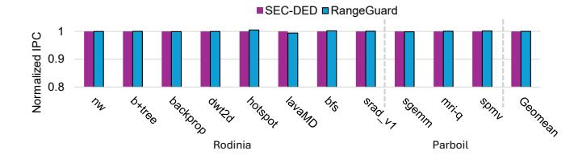

# C. Hardware Overheads

To estimate the hardware cost of RangeGuard, we implement its encoder and decoder in SystemVerilog and evaluate two configurations. For RG 8b SSC, the encoder extracts 8-bit RIDs using a flip-flop-based RangeMap. For each 32B access, it compares the 8-bit exponent of each of the sixteen 16-bit values against all 16 RangeMap entries in parallel, requiring 256 8-bit comparators but completing RID extraction in one cycle. A second cycle generates the redundancy bits. RG 4b DSC uses the same structure with a smaller 4-entry

 $\label{thm:constraints} Table~V\\ Hardware~overheads~of~BF16~RangeGuard$ 

| Metric | Component       | RG 8b SSC                    | RG 4b DSC                   |
|--------|-----------------|------------------------------|-----------------------------|
| Area   | Encoder (total) | $3,300 \ \mu m^2 \ (6,500)$  | $800 \ \mu m^2 \ (1,600)$   |
|        | - RangeMaps     | $3,100 \ \mu m^2 \ (6,200)$  | $650 \ \mu m^2 \ (1,300)$   |
|        | - ECC encoder   | $200 \ \mu m^2 \ (300)$      | $150 \ \mu m^2 \ (300)$     |
|        | Decoder (total) | $7,800 \ \mu m^2 \ (15,400)$ | $4,200 \ \mu m^2 \ (8,200)$ |
|        | - RangeMaps     | $6,700 \ \mu m^2 \ (13,200)$ | 1,600 $\mu m^2$ (3,000)     |
|        | - ECC decoder   | $1,100 \ \mu m^2 \ (2,200)$  | $2,600 \ \mu m^2 \ (5,200)$ |
| Power  | Encoder (total) | 0.54 mW                      | 0.18 mW                     |
|        | Decoder (total) | 0.61 mW                      | 0.63 mW                     |

RangeMap, reducing the lookup to 64 8-bit comparators, and uses a different generator matrix for redundancy generation.

The decoder regenerates RIDs from the received data in one cycle using the same RangeMap-based lookup structure as the encoder. For area reporting, we model a separate RangeMap in the decoder, although the encoder and decoder can share a single flip-flop-based table in practice. In the next cycle, the decoder computes the syndrome and performs error detection. When an error is detected, it applies correction using a modified Berlekamp–Massey algorithm hardened in logic gates [48]–[50], requiring one additional cycle per correction.

We synthesize the RTL using Synopsys Design Compiler with a UMC 28nm standard-cell library at 1GHz. We report area in NAND2 equivalents to make the results more process independent, and we further break down the area into RangeMap and ECC logic to help estimate the overhead of configurations with multiple RangeMaps.

Table V presents the results. The combined area of the

Figure 9. IPC comparison between SEC-DED and RangeGuard.

8-bit SSC encoder and decoder is  $11,100~\mu\mathrm{m}^2$ , which is larger than that of the 4-bit DSC configuration (5,000  $\mu\mathrm{m}^2$ ) due to its larger RangeMap. Nevertheless, this total overhead corresponds to only 21,900 NAND2 equivalents (87,600 transistors). Considering modern GPUs with billions of transistors this is a small portion of the die area (e.g., 5e-7 in 208B-transistor Blackwell).

