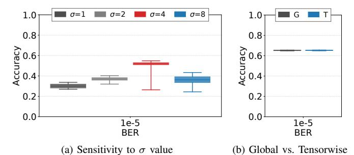

# D. GPU System Performance

To assess the performance cost of the protection, we use the cycle-level GPU simulator Accel-Sim [51], configured to model an NVIDIA V100 GPU. Since memory errors are rare (occurring on the scale of days or months), we focus on evaluating RangeGuard's impact in error-free scenarios.

We adjust the read latency to reflect the decoding overhead. We assume that RangeGuard requires 2 cycles to return error-free data (immediately after error detection stage), while the baseline already spends 1 cycle on error detection, resulting in a net 1-cycle increase in read latency. We do not increase the write latency, because the baseline already uses 1 cycle for encoding and the additional cycle can be hidden while the request waits in the memory-controller queue or during DRAM write latency (i.e., the interval between the DRAM write command and the arrival of write data). We evaluate 11 workloads from Rodinia [52] and Parboil [53].

Figure 9 shows the results. Owing to the GPU's throughput-oriented design, the extra cycle of read latency has a negligible effect on performance, reducing geomean Instructions-Per-Cycle (IPC) by only 0.008%. Even for the most memory-intensive workloads in our suite, the IPC drop remains below 0.05%, while compute-bound workloads are virtually unaffected. These results indicate that RangeGuard's protection can be deployed in GPU systems without sacrificing throughput and system performance.

## E. Sensitivity Analysis

To study how semantic protection in RangeGuard depends on mapping parameters, we conduct a sensitivity analysis of range mapping by varying the sigma value and mapping granularity, using the same experimental methodology as in Section VI-B.

**Sigma Size:** To evaluate the sensitivity of the  $\sigma$  value, we first constructed a RangeMap using the simple mapping scheme described in Section V-B while using 2-bit RIDs. As discussed in Section V-B,  $\sigma$  plays a critical role in balancing parameter coverage against mapping resolution. Fig. 10a highlights that protection efficacy is highly dependent on an

Figure 10. Experimental results on robustness and hyperparameter sensitivity.

optimal  $\sigma$ . Both excessively small and large  $\sigma$  values fail to adequately capture the value distribution, thereby undermining the semantic protection and triggering a sharp decline in model accuracy.

**Mapping Granularity:** We compared global mapping (G) and tensorwise mapping (T) to evaluate the influence of mapping granularity on diverse internal distributions (Fig. 10b). Global mapping uses a fixed configuration ( $\sigma=4$ , 4-bit RID), and tensorwise mapping generates dedicated RangeMaps via the Lloyd-Max algorithm [54], [55] modified to minimize MAE. While this approach provides more precise reconstruction, it incurs substantial area overhead in the encoder and decoder to manage the massive number of unique RangeMaps. Despite its simplicity, global mapping provides sufficient resilience. This is because, at a bit error rate of  $10^{-5}$ , the precision of the global mapping already ensures the semantic integrity of the model without requiring tensor-specific optimization.

## VII. CONCLUSION

As DRAM scales and 3D-stacked memories become pervasive, multi-bit faults are increasingly common and especially harmful for modern DNNs and LLMs. We show that a few exponent flips can create extreme outliers, collapsing accuracy at very low BERs where prior bit-centric mitigation schemes already break down.

This paper presented RangeGuard, a metadata-centric framework that protects ranges instead of raw bits. Range-Guard encodes compact Range Identifiers (RIDs) into the existing 16-bit parity bits per 32-byte block, detects interrange deviations, and performs bounded approximate correction by restoring the range and substituting a representative value. We develop MAE-aware RangeMap construction and two concrete configurations (8b SSC, 4b DSC) that fit within current GPU memory interfaces. Under realistic DRAM fault modes, RangeGuard tolerates errors affecting 64+ data bits per block while keeping errors bounded, preserves near-baseline accuracy for CNNs and LLMs at high BERs, and incurs only a negligible performance impact (0.008% IPC loss). These results demonstrate that reallocating limited redundancy from bit correctness to semantic range consistency is a practical and effective direction for building fault-resilient DNN/LLM systems on future error-prone memories.

## REFERENCES

- [1] JEDEC Solid State Technology Association, "JESD79-4D: DDR4 SDRAM Standard," JEDEC, Standard, 2021.
- [2] JEDEC Solid State Technology Association, "JESD79-5C.01: DDR5 SDRAM Standard," JEDEC, Standard, 2024.
- [3] C. Li, Y. Zhang, J. Wang, H. Chen, X. Liu, T. Huang, L. Peng, S. Zhou, L. Wang, and S. Ge, "From correctable memory errors to uncorrectable memory errors: What error bits tell," in *International Conference for High Performance Computing, Networking, Storage and Analysis (SC)*, 2022.
- [4] R. Wu, S. Zhou, J. Lu, Z. Shen, Z. Xu, J. Shu, K. Yang, F. Lin, and Y. Zhang, "Removing obstacles before breaking through the memory wall: A close look at HBM errors in the field," in *USENIX Annual Technical Conference (ATC)*, 2024.
- [5] Y. Ryu, S.-G. Ahn, J. H. Lee, J. Park, Y. K. Kim, H. Kim, Y. G. Song, H.-W. Cho, S. Cho, S. H. Song, H. Lee, U. Shin, J. Ahn, J.-M. Ryu, S. Lee, K.-H. Lim, J. Lee, J. H. Park, J.-S. Jeong, S. Joo, D. Cho, S. Y. Kim, M. Lee, H. Kim, M. Kim, J.-S. Kim, J. Kim, H. G. Kang, M.-K. Lee, S.-R. Kim, Y.-C. Kwon, Y. Y. Byun, K. Lee, S. Park, J. Youn, M.-O. Kim, K. Sohn, S.-J. Hwang, and J. Lee, "A 16 GB 1024 GB/s HBM3 DRAM With Source-Synchronized Bus Design and On-Die Error Control Scheme for Enhanced RAS Features," *IEEE Journal of Solid-State Circuits (JSSC)*, 2023.
- [6] D. H. Yoon and M. Erez, "Virtualized and flexible ECC for main memory," in *ACM International Conference on Architectural Support for Programming Languages and Operating Systems (ASPLOS)*, 2010.
- [7] A. N. Udipi, N. Muralimanohar, R. Balasubramonian, A. Davis, and N. P. Jouppi, "LOT-ECC: Localized and tiered reliability mechanisms for commodity memory systems," in *ACM/IEEE International Symposium on Computer Architecture (ISCA)*, 2012.
- [8] J. Kim, M. Sullivan, and M. Erez, "Bamboo ECC: Strong, safe, and flexible codes for reliable computer memory," in *IEEE International Symposium on High Performance Computer Architecture (HPCA)*, 2015.
- [9] J. Kim, M. Sullivan, S. Lym, and M. Erez, "All-Inclusive ECC: Thorough end-to-end protection for reliable computer memory," in *ACM/IEEE International Symposium on Computer Architecture (ISCA)*, 2016.
- [10] D. Kim, J. Lee, W. Jung, M. B. Sullivan, and J. Kim, "Unity ECC: Unified memory protection against bit and chip errors," in *International Conference for High Performance Computing, Networking, Storage and Analysis (SC)*, 2023.
- [11] I. S. Reed and G. Solomon, "Polynomial codes over certain finite fields," *Journal of the Society for Industrial and Applied Mathematics*, 1960.
- [12] H. Jun, J. Cho, K. Lee, H.-Y. Son, K. Kim, H. Jin, and K. Kim, "HBM (High Bandwidth Memory) DRAM Technology and Architecture," in *IEEE International Memory Workshop (IMW)*, 2017.
- [13] S. Ha, S. Lee, G. Bae, D. Lee, S. Kim, B. Woo, N. Lee, Y. Lee, and S. Pae, "Reliability Characterization of HBM featuring HK+MG Logic Chip with Multi-stacked DRAMs," in *IEEE International Reliability Physics Symposium (IRPS)*, 2023.
- [14] L. Li, P. Ton, M. Nagar, and P. Chia, "Reliability Challenges in 2.5D and 3D IC Integration," in *IEEE Electronic Components and Technology Conference (ECTC)*, 2017.
- [15] K. C. Chun, Y. K. Kim, Y. Ryu, J. Park, C. S. Oh, Y. Y. Byun, S. Y. Kim, D. H. Shin, J. G. Lee, B.-K. Ho, M.-S. Park, S.-J. Cho, S. Woo, B. M. Moon, B. Kil, S. Ahn, J. H. Lee, S. Y. Kim, S.-K. Choi, J.-S. Jeong, S.-G. Ahn, J. Kim, J. J. Kong, K. Sohn, N. S. Kim, and J.-B. Lee, "A 16-GB 640-GB/s HBM2E DRAM with a data-bus window extension technique and a synergetic on-die ECC scheme," *IEEE Journal of Solid-State Circuits (JSSC)*, 2020.
- [16] H. Jun, S. Nam, H. Jin, J.-C. Lee, Y. J. Park, and J. J. Lee, "Highbandwidth memory (HBM) test challenges and solutions," *IEEE Design & Test*, 2016.
- [17] J. Lee, K. Cho, C. K. Lee, Y. Lee, J.-H. Park, S.-H. Oh, Y. Ju, C. Jeong, H. S. Cho, J. Lee, T.-S. Yun, J. H. Cho, S. Oh, J. Moon, Y.-J. Park, H.- S. Choi, I.-K. Kim, S. M. Yang, S.-Y. Kim, J. Jang, J. Kim, S.-H. Lee, Y. Jeon, J. Park, T.-K. Kim, D. Ka, S. Oh, J. Kim, J. Jeon, S. Kim, K. T. Kim, T. Kim, H. Yang, D. Yang, M. Lee, H. Song, D. Jang, J. Shin, H. Kim, C. Baek, H. Jeong, J. Yoon, S.-K. Lim, K. Y. Lee, Y. J. Koo, M.- J. Park, J. Cho, and J. Kim, "13.4 A 48GB 16-High 1280GB/s HBM3E DRAM with All-Around Power TSV and a 6-Phase RDQS Scheme for TSV Area Optimization," in *IEEE International Solid-State Circuits Conference (ISSCC)*, 2024.

- [18] A. Farmahini-Farahani, S. Gurumurthi, G. Loh, and M. Ignatowski, "Challenges of High-Capacity DRAM Stacks and Potential Directions," in *Workshop on Memory Centric High Performance Computing*, 2018.
- [19] C. Y. Lee, S. Kim, H. Jun, K. W. Kim, and S. J. Hong, "TSV technology and challenges for 3D stacked DRAM," in *Symposium on VLSI Technology (VLSI-Technology): Digest of Technical Papers*, 2014.
- [20] T. Kim, J. Lee, Y. Kim, H. Park, H. Hwang, J. Kim, H. Jung, and D. W. Kim, "Thermal Improvement of HBM with Joint Thermal Resistance Reduction for Scaling 12 Stacks and Beyond," in *IEEE Electronic Components and Technology Conference (ECTC)*, 2023.
- [21] M. V. Beigi, Y. Cao, S. Gurumurthi, C. Recchia, A. Walton, and V. Sridharan, "A Systematic Study of DDR4 DRAM Faults in the Field," in *IEEE International Symposium on High-Performance Computer Architecture (HPCA)*, 2023.
- [22] X. Du and C. Li, "Predicting uncorrectable memory errors from the correctable error history: No free predictors in the field," in *International Symposium on Memory Systems (MEMSYS)*, 2021.
- [23] A. Grattafiori, A. Dubey, A. Jauhri, A. Pandey, A. Kadian, A. Al-Dahle, A. Letman, A. Mathur, A. Schelten, A. Vaughan, A. Yang, A. Fan, A. Goyal, A. Hartshorn, A. Yang, A. Mitra, A. Sravankumar, A. Korenev, A. Hinsvark, A. Rao, A. Zhang, A. Rodriguez, A. Gregerson, A. Spataru, B. Roziere, B. Biron, B. Tang, B. Chern, C. Caucheteux, C. Nayak, C. Bi, C. Marra, C. McConnell, C. Keller, C. Touret, C. Wu, C. Wong, C. C. Ferrer, C. Nikolaidis, D. Allonsius, D. Song, D. Pintz, D. Livshits, D. Wyatt, D. Esiobu, D. Choudhary, D. Mahajan, D. Garcia-Olano, D. Perino, D. Hupkes, E. Lakomkin, E. AlBadawy, E. Lobanova, E. Dinan, E. M. Smith, F. Radenovic, F. Guzman, F. Zhang, G. Synnaeve, ´ G. Lee, G. L. Anderson, G. Thattai, G. Nail, G. Mialon, G. Pang, G. Cucurell, H. Nguyen, H. Korevaar, H. Xu, H. Touvron, I. Zarov, I. A. Ibarra, I. Kloumann, I. Misra, I. Evtimov, J. Zhang, J. Copet, J. Lee, J. Geffert, J. Vranes, J. Park, J. Mahadeokar, J. Shah, J. van der Linde, J. Billock, J. Hong, J. Lee, J. Fu, J. Chi, J. Huang, J. Liu, J. Wang, J. Yu, J. Bitton, J. Spisak, J. Park, J. Rocca, J. Johnstun, J. Saxe, J. Jia, K. V. Alwala, K. Prasad, K. Upasani, K. Plawiak, K. Li, K. Heafield, K. Stone, K. El-Arini, K. Iyer, K. Malik, K. Chiu, K. Bhalla, K. Lakhotia, L. Rantala-Yeary, L. van der Maaten, L. Chen, L. Tan, L. Jenkins, L. Martin, L. Madaan, L. Malo, L. Blecher, L. Landzaat, L. de Oliveira, M. Muzzi, M. Pasupuleti, M. Singh, M. Paluri, M. Kardas, M. Tsimpoukelli, M. Oldham, M. Rita, M. Pavlova, M. Kambadur, M. Lewis, M. Si, M. K. Singh, M. Hassan, N. Goyal, N. Torabi, N. Bashlykov, N. Bogoychev, N. Chatterji, N. Zhang, O. Duchenne, O. C¸ elebi, P. Alrassy, P. Zhang, P. Li, P. Vasic, P. Weng, P. Bhargava, P. Dubal, P. Krishnan, P. S. Koura, P. Xu, Q. He, Q. Dong, R. Srinivasan, R. Ganapathy, R. Calderer, R. S. Cabral, R. Stojnic, R. Raileanu, R. Maheswari, R. Girdhar, R. Patel, R. Sauvestre, R. Polidoro, R. Sumbaly, R. Taylor, R. Silva, R. Hou, R. Wang, S. Hosseini, S. Chennabasappa, S. Singh, S. Bell, S. S. Kim, S. Edunov, S. Nie, S. Narang, S. Raparthy, S. Shen, S. Wan, S. Bhosale, S. Zhang, S. Vandenhende, S. Batra, S. Whitman, S. Sootla, S. Collot, S. Gururangan, S. Borodinsky, T. Herman, T. Fowler, T. Sheasha, T. Georgiou, T. Scialom, T. Speckbacher, T. Mihaylov, T. Xiao, U. Karn, V. Goswami, V. Gupta, V. Ramanathan, V. Kerkez, V. Gonguet, V. Do, V. Vogeti, V. Albiero, V. Petrovic, W. Chu, W. Xiong, W. Fu, W. Meers, X. Martinet, X. Wang, X. Wang, X. E. Tan, X. Xia, X. Xie, X. Jia, X. Wang, Y. Goldschlag, Y. Gaur, Y. Babaei, Y. Wen, Y. Song, Y. Zhang, Y. Li, Y. Mao, Z. D. Coudert, Z. Yan, Z. Chen, Z. Papakipos, A. Singh, A. Srivastava, A. Jain, A. Kelsey, A. Shajnfeld, A. Gangidi, A. Victoria, A. Goldstand, A. Menon, A. Sharma, A. Boesenberg, A. Baevski, A. Feinstein, A. Kallet, A. Sangani, A. Teo, A. Yunus, A. Lupu, A. Alvarado, A. Caples, A. Gu, A. Ho, A. Poulton, A. Ryan, A. Ramchandani, A. Dong, A. Franco, A. Goyal, A. Saraf, A. Chowdhury, A. Gabriel, A. Bharambe, A. Eisenman, A. Yazdan, B. James, B. Maurer, B. Leonhardi, B. Huang, B. Loyd, B. D. Paola, B. Paranjape, B. Liu, B. Wu, B. Ni, B. Hancock, B. Wasti, B. Spence, B. Stojkovic, B. Gamido, B. Montalvo, C. Parker, C. Burton, C. Mejia, C. Liu, C. Wang, C. Kim, C. Zhou, C. Hu, C.-H. Chu, C. Cai, C. Tindal, C. Feichtenhofer, C. Gao, D. Civin, D. Beaty, D. Kreymer, D. Li, D. Adkins, D. Xu, D. Testuggine, D. David, D. Parikh, D. Liskovich, D. Foss, D. Wang, D. Le, D. Holland, E. Dowling, E. Jamil, E. Montgomery, E. Presani, E. Hahn, E. Wood, E.-T. Le, E. Brinkman, E. Arcaute, E. Dunbar, E. Smothers, F. Sun, F. Kreuk, F. Tian, F. Kokkinos, F. Ozgenel, F. Caggioni, F. Kanayet, F. Seide, G. M. Florez, G. Schwarz, G. Badeer, G. Swee, G. Halpern, G. Herman, G. Sizov, G. J. Zhang, G. Lakshminarayanan, H. Inan, H. Shojanazeri, H. Zou, H. Wang, H. Zha, H. Habeeb, H. Rudolph, H. Suk, H. Aspegren, H. Goldman, H. Zhan, I. Damlaj, I. Molybog,

- I. Tufanov, I. Leontiadis, I.-E. Veliche, I. Gat, J. Weissman, J. Geboski, J. Kohli, J. Lam, J. Asher, J.-B. Gaya, J. Marcus, J. Tang, J. Chan, J. Zhen, J. Reizenstein, J. Teboul, J. Zhong, J. Jin, J. Yang, J. Cummings, J. Carvill, J. Shepard, J. McPhie, J. Torres, J. Ginsburg, J. Wang, K. Wu, K. H. U, K. Saxena, K. Khandelwal, K. Zand, K. Matosich, K. Veeraraghavan, K. Michelena, K. Li, K. Jagadeesh, K. Huang, K. Chawla, K. Huang, L. Chen, L. Garg, L. A, L. Silva, L. Bell, L. Zhang, L. Guo, L. Yu, L. Moshkovich, L. Wehrstedt, M. Khabsa, M. Avalani, M. Bhatt, M. Mankus, M. Hasson, M. Lennie, M. Reso, M. Groshev, M. Naumov, M. Lathi, M. Keneally, M. Liu, M. L. Seltzer, M. Valko, M. Restrepo, M. Patel, M. Vyatskov, M. Samvelyan, M. Clark, M. Macey, M. Wang, M. J. Hermoso, M. Metanat, M. Rastegari, M. Bansal, N. Santhanam, N. Parks, N. White, N. Bawa, N. Singhal, N. Egebo, N. Usunier, N. Mehta, N. P. Laptev, N. Dong, N. Cheng, O. Chernoguz, O. Hart, O. Salpekar, O. Kalinli, P. Kent, P. Parekh, P. Saab, P. Balaji, P. Rittner, P. Bontrager, P. Roux, P. Dollar, P. Zvyagina, P. Ratanchandani, P. Yuvraj, Q. Liang, R. Alao, R. Rodriguez, R. Ayub, R. Murthy, R. Nayani, R. Mitra, R. Parthasarathy, R. Li, R. Hogan, R. Battey, R. Wang, R. Howes, R. Rinott, S. Mehta, S. Siby, S. J. Bondu, S. Datta, S. Chugh, S. Hunt, S. Dhillon, S. Sidorov, S. Pan, S. Mahajan, S. Verma, S. Yamamoto, S. Ramaswamy, S. Lindsay, S. Lindsay, S. Feng, S. Lin, S. C. Zha, S. Patil, S. Shankar, S. Zhang, S. Zhang, S. Wang, S. Agarwal, S. Sajuyigbe, S. Chintala, S. Max, S. Chen, S. Kehoe, S. Satterfield, S. Govindaprasad, S. Gupta, S. Deng, S. Cho, S. Virk, S. Subramanian, S. Choudhury, S. Goldman, T. Remez, T. Glaser, T. Best, T. Koehler, T. Robinson, T. Li, T. Zhang, T. Matthews, T. Chou, T. Shaked, V. Vontimitta, V. Ajayi, V. Montanez, V. Mohan, V. S. Kumar, V. Mangla, V. Ionescu, V. Poenaru, V. T. Mihailescu, V. Ivanov, W. Li, W. Wang, W. Jiang, W. Bouaziz, W. Constable, X. Tang, X. Wu, X. Wang, X. Wu, X. Gao, Y. Kleinman, Y. Chen, Y. Hu, Y. Jia, Y. Qi, Y. Li, Y. Zhang, Y. Zhang, Y. Adi, Y. Nam, Y. S. Wang, Y. Zhao, Y. Hao, Y. Qian, Y. Li, Y. He, Z. Rait, Z. DeVito, Z. Rosnbrick, Z. Wen, Z. Yang, Z. Zhao, and Z. Ma, "The Llama 3 Herd of Models," *arXiv preprint arXiv:2407.21783*, 2024.
- [24] S. Gurumurthi, K. Lee, M. Jang, V. Sridharan, A. Nygren, Y. Ryu, K. Sohn, T. Kim, and H. Chung, "HBM3 RAS: Enhancing resilience at scale," *IEEE Computer Architecture Letters (CAL)*, 2021.
- [25] M.-J. Park, H. S. Cho, T.-S. Yun, S. Byeon, Y. J. Koo, S. Yoon, D. U. Lee, S. Choi, J. Park, J. Lee, K. Cho, J. Moon, B.-K. Yoon, Y.-J. Park, S.-m. Oh, C. K. Lee, T.-K. Kim, S.-H. Lee, H.-W. Kim, Y. Ju, S.-K. Lim, S. G. Baek, K. Y. Lee, S. H. Lee, W. S. We, S. Kim, Y. Choi, S.-H. Lee, S. M. Yang, G. Lee, I.-K. Kim, Y. Jeon, J.-H. Park, J. C. Yun, C. Park, S.- Y. Kim, S. Kim, D.-Y. Lee, S.-H. Oh, T. Hwang, J. Shin, Y. Lee, H. Kim, J. Lee, Y. Hur, S. Lee, J. Jang, J. Chun, and J. Cho, "A 192-Gb 12- High 896-GB/s HBM3 DRAM With a TSV Auto-Calibration Scheme and Machine-Learning-Based Layout Optimization," *IEEE Journal of Solid-State Circuits (JSSC)*, 2022.
- [26] Hugging Face, "Hugging Face Model Hub," https://huggingface.co, 2025, accessed on 2025-11-15.
- [27] JEDEC Solid State Technology Association, "JESD238A: High Bandwidth Memory 3 (HBM3) DRAM," JEDEC, Standard, 2023.
- [28] JEDEC Solid State Technology Association, "JESD270-4: High Bandwidth Memory 4 (HBM4) DRAM," JEDEC, Standard, 2025.
- [29] NVIDIA Corporation, "NVIDIA A100 Tensor Core GPU Architecture," NVIDIA, Tech. Rep., 2020.
- [30] M. B. Sullivan, N. Saxena, M. O'Connor, D. Lee, P. Racunas, S. Hukerikar, T. Tsai, S. K. S. Hari, and S. W. Keckler, "Characterizing and mitigating soft errors in GPU DRAM," in *IEEE/ACM International Symposium on Microarchitecture (MICRO)*, 2021.
- [31] NVIDIA Corporation, "NVIDIA H100 Tensor Core GPU Architecture Whitepaper," NVIDIA, Tech. Rep., 2022.
- [32] I. Catalan, J. Flich, and C. Hern ´ andez, "Exploiting neural networks bit- ´ level redundancy to mitigate the impact of faults at inference," *The Journal of Supercomputing*, 2025.
- [33] M. Qin, C. Sun, and D. Vucinic, "Robustness of neural networks against storage media errors," *arXiv preprint arXiv:1709.06173*, 2017.
- [34] S.-S. Lee and J.-S. Yang, "Value-aware parity insertion ECC for faulttolerant deep neural network," in *Design, Automation & Test in Europe Conference & Exhibition (DATE)*, 2022.
- [35] T. Park, S. Gorgin, D. Kim, J. Shin, M. B. Sullivan, and J. Kim, "PoP-ECC: Robust and flexible error correction against multi-bit upsets in DNN accelerators," in *ACM/IEEE Design Automation Conference (DAC)*, 2025.

- [36] S. Hong, P. Frigo, Y. Kaya, C. Giuffrida, and T. Dumitras, , "Terminal brain damage: Exposing the graceless degradation in deep neural networks under hardware fault attacks," in *USENIX Security Symposium (USENIX Security)*, 2019.
- [37] A. Mahmoud, T. Tambe, T. Aloui, D. Brooks, and G.-Y. Wei, "Golden-Eye: A platform for evaluating emerging numerical data formats in DNN accelerators," in *IEEE/IFIP International Conference on Dependable Systems and Networks (DSN)*, 2022.
- [38] Y. Sun, Z. Coalson, S. Chen, H. Liu, Z. Zhang, S. Hong, B. Fang, and L. Yang, "Demystifying the resilience of large language model inference: An end-to-end perspective," in *International Conference for High Performance Computing, Networking, Storage and Analysis (SC)*, 2025.
- [39] M. B. Sullivan, S. K. S. Hari, B. Zimmer, T. Tsai, and S. W. Keckler, "SwapCodes: Error codes for hardware-software cooperative GPU pipeline error detection," in *IEEE/ACM International Symposium on Microarchitecture (MICRO)*, 2018.
- [40] S. T. Wasim, K. H. Soboka, A. Mahmoud, S. H. Khan, D. Brooks, and G.-Y. Wei, "Hardware resilience properties of text-guided image classifiers," *Advances in Neural Information Processing Systems (NeurIPS)*, 2023.
- [41] Z. Chen, G. Li, and K. Pattabiraman, "A low-cost fault corrector for deep neural networks through range restriction," in *IEEE/IFIP International Conference on Dependable Systems and Networks (DSN)*, 2021.
- [42] H. Chung, E. Oh, S. Baek, H. Yoon, J. Yoo, S. Lee, Y. Lee, A. Bramhanand, B. Dodds, Y. Zhou, and N. S. Kim, "DRAM fault classification through large-scale field monitoring for robust memory RAS management," in *IEEE/ACM International Symposium on Microarchitecture (MICRO)*, 2025.
- [43] A. Mahmoud, N. Aggarwal, A. Nobbe, J. R. S. Vicarte, S. V. Adve, C. W. Fletcher, I. Frosio, and S. K. S. Hari, "PyTorchFI: A runtime perturbation tool for DNNs," in *IEEE/IFIP International Conference on Dependable Systems and Networks Workshops (DSN-W)*, 2020.
- [44] H. Huang, C. Liu, X. Xue, B. Liu, H. Li, and X. Li, "MRFI: An opensource multiresolution fault injection framework for neural network processing," *IEEE Transactions on Very Large Scale Integration (VLSI) Systems (TVLSI)*, 2024.
- [45] T. Xie, J. Zhao, Z. Wan, Z. Zhang, Y. Wang, R. Wang, R. Huang, and M. Li, "ReaLM: Reliable and efficient large language model inference with statistical algorithm-based fault tolerance," in *ACM/IEEE Design Automation Conference (DAC)*, 2025.
- [46] Y. He, P. Balaprakash, and Y. Li, "FIdelity: Efficient resilience analysis framework for deep learning accelerators," in *IEEE/ACM International Symposium on Microarchitecture (MICRO)*, 2020.
- [47] L. Gao, J. Tow, B. Abbasi, S. Biderman, S. Black, A. DiPofi, C. Foster, L. Golding, J. Hsu, A. Le Noac'h, H. Li, K. McDonell, N. Muennighoff, C. Ociepa, J. Phang, L. Reynolds, H. Schoelkopf, A. Skowron, L. Sutawika, E. Tang, A. Thite, B. Wang, K. Wang, and A. Zou, "The language model evaluation harness," 07 2024. [Online]. Available: https://zenodo.org/records/12608602
- [48] R. Chien, "Cyclic decoding procedures for Bose-Chaudhuri-Hocquenghem codes," *IEEE Transactions on Information Theory (TIT)*, 2003.
- [49] G. Forney, "On decoding BCH codes," *IEEE Transactions on Information Theory (TIT)*, 2003.
- [50] Z. Liang and W. Zhang, "Efficient Berlekamp-Massey algorithm and architecture for Reed-Solomon decoder," *Journal of Signal Processing Systems*, 2017.
- [51] M. Khairy, Z. Shen, T. M. Aamodt, and T. G. Rogers, "Accel-Sim: An Extensible Simulation Framework for Validated GPU Modeling," in *ACM/IEEE International Symposium on Computer Architecture (ISCA)*, 2020.
- [52] S. Che, J. W. Sheaffer, M. Boyer, L. G. Szafaryn, L. Wang, and K. Skadron, "A characterization of the Rodinia benchmark suite with comparison to contemporary CMP workloads," in *IEEE International Symposium on Workload Characterization (IISWC)*, 2010.
- [53] J. A. Stratton, C. Rodrigues, I.-J. Sung, N. Obeid, L.-W. Chang, N. Anssari, G. D. Liu, and W.-m. W. Hwu, "Parboil: A Revised Benchmark Suite for Scientific and Commercial Throughput Computing," *Center for Reliable and High-Performance Computing*, 2012.
- [54] J. Max, "Quantizing for minimum distortion," *IRE Transactions on Information Theory*, 1960.
- [55] S. Lloyd, "Least squares quantization in PCM," *IEEE Transactions on Information Theory (TIT)*, 1982.