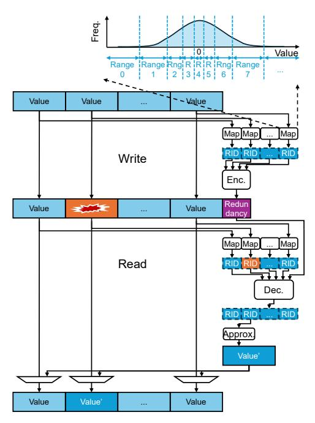

# I. INTRODUCTION

DRAM reliability is degrading with density/voltage scaling and 3D integration. Conventional 2D devices (e.g., DDR4/5) [1], [2] face shrinking noise margins and rising marginal cell defects. High Bandwidth Memory (HBM) further introduces complex processing (e.g., wafer thinning, Through Silicon Via (TSV) formation, thermal cycling) and harsher thermal/mechanical stress, which elevate fault susceptibility. Fleet-scale reports find HBM2 raw error rates substantially higher than DDR4 (∼ 500×), and production GPU clusters observe uncorrectable multi-bit HBM3 errors on the order of hours [3], [4]. As systems provision more memories for bandwidth and capacity, dense multi-bit faults are no longer rare-event tails.

These faults can be devastating for *Deep Neural Networks (DNNs)*. While DNNs tolerate small numerical perturbations—such as quantization noise or rounding error that remains a tiny fraction of the original value—random *bit flips* can cause catastrophic deviations. For example, flipping the most significant exponent bit of a *bfloat16 (BF16)* value turns 0.5 into 2 127 ≈ 1.7 × 1038, injecting an astronomically large outlier that can propagate through the network and sharply degrade accuracy.

*Large Language Models (LLMs)* are particularly susceptible. Unlike *Convolutional Neural Networks (CNNs)*, where spatial filters may attenuate local anomalies, a transformer in an LLM can *amplify* a single corrupted token feature through multi-head attention, *preserve* it across layers via residual connections, and *stabilize* its presence through normalization. This combination lets one faulty activation persist, interact with many tokens, and cascade through subsequent blocks, magnifying its impact on logits and sequence generation, and ultimately destabilizing the final output (Section III-C).

However, providing robust protection under realistic system constraints is challenging. DNN accelerators (e.g., GPUs) operate on small memory-access granularities (e.g., 32 bytes) to avoid overfetch, leaving little opportunity to amortize redundancy. Contemporary GPU memories provision only 2 bytes of parity per 32-byte block (6.25%), yet practical failure modes can corrupt up to *4 bytes* within the same block [5]. Under this tight budget, conventional *bit-centric* protection schemes struggle to handle dense multi-bit corruptions without incurring unacceptable storage or bandwidth overheads. These constraints motivate rethinking how to spend scarce parity so that it protects what actually matters for model correctness.

This paper introduces *RangeGuard*, a metadata-centric error-correcting framework for DNNs and approximate computing. Instead of protecting raw bits, RangeGuard protects per-value *metadata*: a compact *Range Identifier (RID)* that encodes the value's numeric interval. This design enables far more efficient use of limited redundancy: for example, restoring a corrupted 32-bit value from a dense 32-bit fault can require at least 64 bits of redundancy, whereas restoring a 4-bit RID of that value needs only 8 bits. Moreover, RangeGuard allocates its correction capability to errors that *change ranges*. If bit flips perturb only lower bits and keep the value within the same range, the RID is unchanged and consumes no correction budget. Only severe errors that flip critical bits and cause an *inter-range* deviation trigger correction, ensuring that scarce redundancy is spent on semantically harmful faults rather than benign intra-range perturbations.

Figure 1 presents an overview of RangeGuard. On a write, each value is mapped to an RID via a *RangeMap*, and an *Error Correcting Code (ECC)* encodes the RID symbols into a short

Figure 1. An overview of RangeGuard. ECC operates on RIDs, rather than raw data bits, and repairs corrupted data by restoring it to a representative value of the range.

redundancy field. The explicit RIDs are then discarded; only the original data and the encoded RID redundancy are stored in memory. On a read, RangeGuard regenerates candidate RIDs from the fetched data and applies ECC decoding over these regenerated RIDs and the stored redundancy. Inter-range errors are detected and corrected by the decoder, whereas intrarange errors remain undetected and do not consume correction capacity. After restoring the RID, RangeGuard replaces the corrupted value with a representative value for that range, so the resulting error magnitude is bounded by the range width and has limited impact on DNN accuracy.

Because each RangeMap is tailored to a specific data format and value distribution, a single map offers limited flexibility in modern DNN systems with multiple formats and diverse value distributions. To address this issue, RangeGuard utilizes multiple maps and address-based ECC selection [6]. The memory controller maintains multiple maps for different numeric formats or value distributions while also preserving a conventional exact-correction scheme. The operating system supports the appropriate protection mode for each data region by encoding ECC-selection metadata (Map Tag) in otherwise unused upper physical-address bits (e.g., bits [57:54]). Since these bits lie beyond the implemented physical-memory capacity, they do not affect the actual memory location and instead serve only as control metadata. This mechanism enables flexible per-region protection without disrupting normal address translation or existing ECC operation.

Our evaluation shows that RangeGuard delivers strong robustness to dense, multi-bit corruptions within the standard redundancy budget. Using the 2-byte redundancy per 32-byte block available in contemporary GPU memories, one Range-Guard instantiation tolerates two inter-range errors affecting up to 64 data bits, while bypassing an unbounded number of intrarange errors. This strong protection preserves LLM accuracy even at extremely high *Bit Error Rates (BERs)*: for example, an unprotected Llama-3.2-1B model suffers significant accuracy loss from just a single bit flip at critical positions, whereas RangeGuard maintains robust execution up to BER =  $10^{-6}$  and incurs only small degradation at BER =  $10^{-5}$ . At the same time, RangeGuard operates within existing GPU memory interfaces and incurs negligible performance overhead and no additional storage overhead.

The major contributions of this paper are as follows:

- We propose RangeGuard, a metadata-centric protection framework that uses per-value Range Identifiers (RIDs) to provide strong, efficient reliability under tight redundancy budgets.
- We analyze how DRAM bit flips map to value errors and quantify how these errors degrade end-to-end accuracy for both CNNs and LLMs, revealing LLMs are highly vulnerable to errors possibly due to their transformer layers.
- We develop an optimization framework for constructing the value-to-RID range mapping and present practical heuristics that minimize its overhead while preserving protection quality.
- We design a memory system that supports diverse data formats and value distributions with RangeGuard.

The rest of this paper is organized as follows. Section II provides background on numeric formats and ECC. Section III characterizes how bit flips translate into value errors and end-to-end accuracy loss. Section IV discusses prior work on DNN fault tolerance and ECC. Section V presents the design of RangeGuard, including RangeMap construction and architectural support. Section VI evaluates RangeGuard's reliability and overheads. Section VII concludes the paper.

## II. BACKGROUND

This section lays the groundwork for RangeGuard by reviewing DNN data types and ECC fundamentals.

## A. DNN Data Types

DNNs trade accuracy, throughput, memory footprint, and energy through their numeric formats. Two families dominate: *floating point* (for wide dynamic range and optimization stability) and *integer* (for efficient deployment via quantization).

1) Floating-point (FP): Floating-point formats capture fine-grained value changes while offering large dynamic range. Although FP32 (32-bit) was the historical default, modern training is largely mixed precision: FP16 (16-bit) or BF16 (bfloat16, 16-bit) for activations/gradients, with FP32 accumulators or "master" weights. FP16 typically employs dynamic loss scaling to avoid underflow, whereas BF16 retains FP32's exponent range to reduce the risk of underflow and improve training stability. Emerging 8-bit floating-point formats (FP8) typically use 4-bit or 5-bit exponents (E4M3 and E5M2, respectively), enabling lower storage, memory traffic, and computation cost.

*2) Integers (INT):* After training, many systems *quantize* tensors to low-bit *integers* for efficient inference. Quantization maps real values to integers via a scale (and optionally a zero point). A widely used baseline employs INT8 weights and activations with INT32 accumulation; pushing below 8 bits (e.g., INT4/INT3) generally requires quantization-aware training and related techniques to preserve accuracy.

Quantization leverages DNNs' tolerance to small perturbations: under uniform quantization, the absolute error is bounded by the quantization step size and is typically only a small fraction of the original value, yielding negligible accuracy loss. In contrast, a *bit flip* can cause far larger deviation than the original value. For floating point, flipping exponent bit p *scales* the value by 2 ±2 p , exhibiting an effectively *doubleexponential* sensitivity to bit position (Section III-B). Such deviations beyond the original value can be intolerable for DNNs (Section III-C), motivating strong protection against memory errors.

