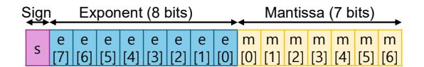
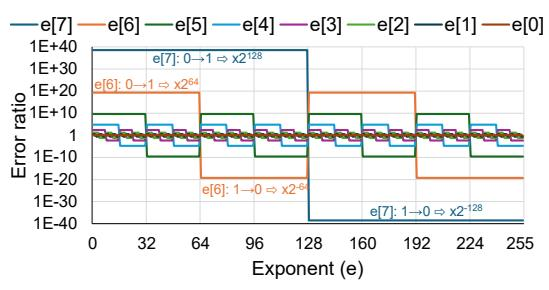
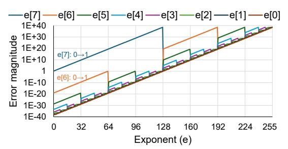
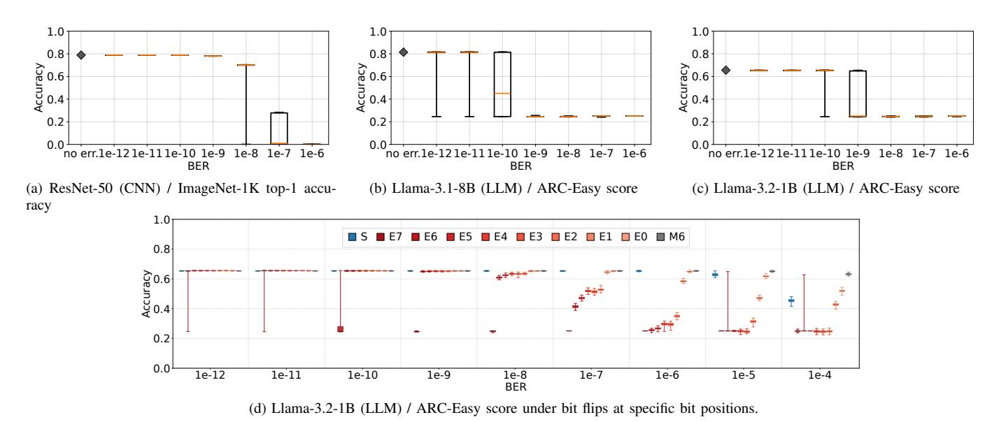
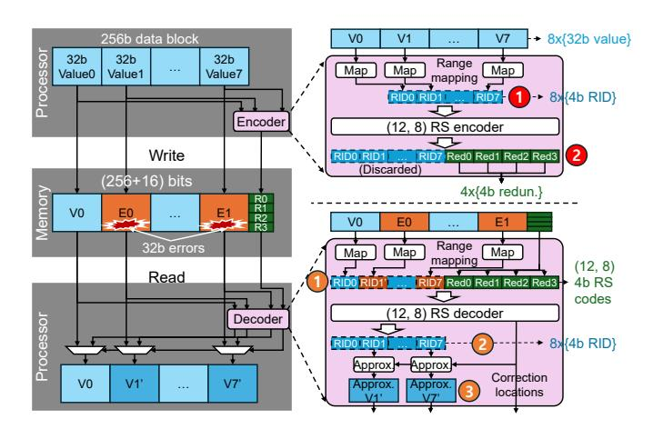
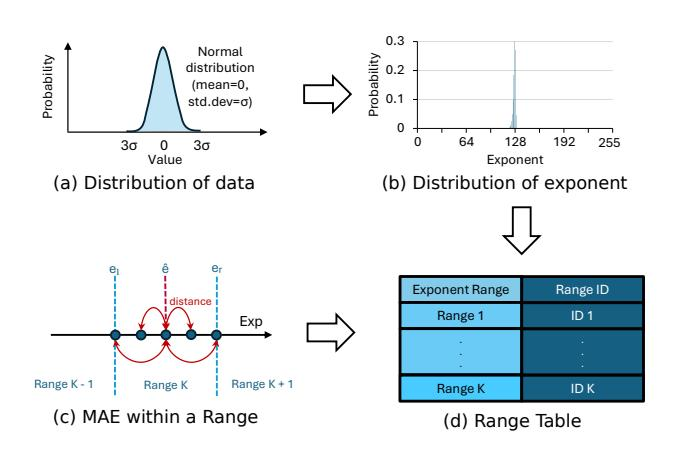
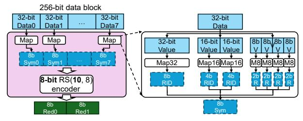
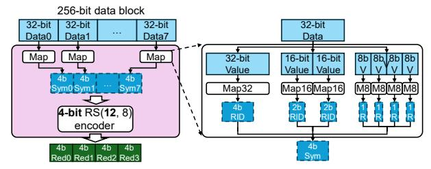
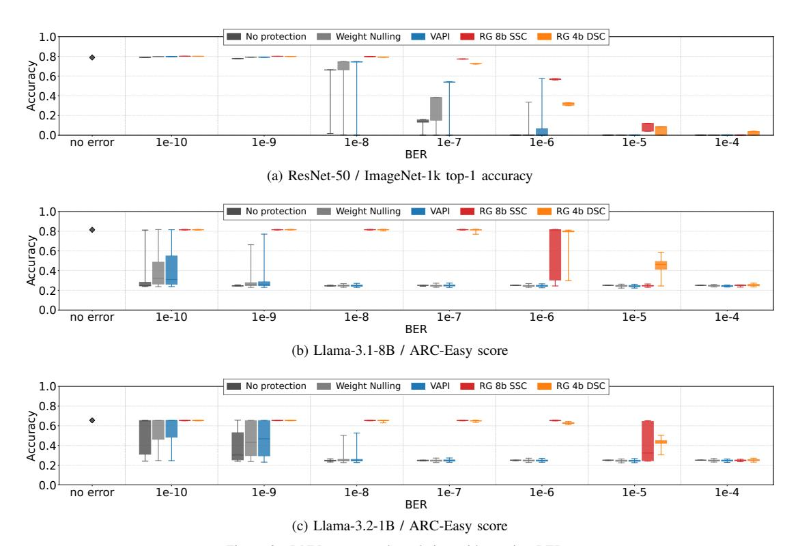

# III. MOTIVATION

This section explains how low–level bit flips can propagate to large value deviations in DNN tensors and ultimately degrade model accuracy.

## *A. HBM Errors*

HBM underpins modern AI infrastructure by delivering extreme bandwidth and high energy efficiency via TSVs and silicon interposers. The same 2.5D integration, however, introduces—and amplifies—reliability hazards. Dense stacking, TSV/microbump interconnects, and elevated operating temperatures increase the likelihood of manufacturing defects, thermo-mechanical stress, and heat-induced marginalities compared to planar DDR devices [12]–[20].

Fleet-scale measurements demonstrate a pronounced reliability gap between stacked HBMs and traditional DRAMs [3], [4], [21]–[23]. A useful comparison is HBM2 versus DDR4, because both expose *raw* device errors (i.e., no on-die ECC). In ByteDance's server fleet (100,000 servers with DDR4 memories), the average incidence over eight months is *0.07 errors per device per month* [3]. In contrast, Huawei's study of 15,000 domain-specific accelerators over two years reports a mean of *35 errors per device per month* for HBM2 core dies [4]. While platform and workload differences preclude a perfectly controlled comparison (HBM with higher bandwidth can exhibit more frequent errors from a permanent fault), the resulting ∼*500*× gap highlights the severity of HBM reliability challenges.

Later generations (e.g., HBM3 and DDR5) integrate *ondie ECC (O-ECC)* that corrects many errors before they exit the bank group, reducing externally visible errors. Public descriptions indicate that HBM3 employs stronger deviceinternal coding than DDR5 (e.g., 16-bit symbol correction with 12.5% internal redundancy versus single-bit correction with 6.25% in DDR5), targeting multi-bit patterns that arise from peripheral faults [5], [24], [25].

However, the scope of O-ECC is inherently limited: faults originating *outside* the bank group—global data/command lines, I/O circuitry, and TSVs/microbumps—can still surface at the system boundary. Moreover, certain *intra*-bank peripheral failures can exceed the 16-bit correction capability. For example, a HBM3 sub-wordline (SWL) driver typically fans out to 32 data bits per access and operates at elevated voltages to suppress leakage [5]; this stress raises wear-out risk, and a single defective driver can corrupt all serviced bits in a burst. Such 32-bit errors overwhelm O-ECC's correction capability and propagate to the host.

As a result, data centers continue to observe non-trivial *exposed* HBM errors. During a 54-day Llama-3 (405B) pretraining run on 16,384 H100 GPUs, Meta reported *72* unexpected job interruptions attributed to uncorrectable HBM3 errors [23]. The GPUs utilize processor-side ECC (*System ECC, or S-ECC*) with Single Error Correction (SEC) capability, and this number indicates that the cluster experienced exposed multi-bit errors every 18 hours.

Although differences in platforms and measured metrics (e.g., job interruptions versus error counts) prevent a perfectly controlled comparison, this reported failure rate represents a substantial improvement over HBM2 (from 5,600 FIT/device to 90 FIT/device). However, the overall uncorrectable error

Figure 2. The bfloat16 (BF16) data format.

rate remains significantly higher than that of DDR4 (near zero FIT), underscoring the considerable reliability challenges in recent HBMs.

## B. Memory Errors to Value Errors

Not all memory errors translate into the same numerical impact: the magnitude of a *value error* depends on (i) the data type, (ii) flipped bit location, and (iii) the original value. We illustrate this sensitivity with single-bit flips on BF16, while RangeGuard also considers multi-bit faults and other data types.

A BF16 number has one sign bit s, eight exponent bits e (bias = 127), and seven mantissa (fraction) bits m (Figure 2). For a normalized value,

$$x = (-1)^s \times 2^{e-\text{bias}} \times (1.m),$$
 (1)

where (1.m) denotes the implicit leading-1 mantissa.

- 1) Sign-bit flip: Toggling the sign  $(s \rightarrow 1 s)$  yields x' = -x and an absolute error |x' x| = 2|x|. This error can be large but is *bounded* and strictly proportional to the original magnitude.
- 2) Mantissa-bit flip: Flipping the k-th mantissa bit (weight  $2^{-(k+1)}$ , with k=0 the most significant) produces

$$x' = (-1)^s 2^{e - \text{bias}} \left( (1.m) \pm 2^{-(k+1)} \right) = x \left( 1 \pm \frac{2^{-(k+1)}}{1.m} \right)$$

 $|x'-x|=\frac{2^{-(k+1)}}{1.m}\times |x|\leq \frac{1}{2}|x|. \tag{2}$  Thus a single mantissa-bit flip cannot exceed half the

original magnitude (tight when m=0, k=0), and its effect decays exponentially with k. Because these contributions form a geometric series, the cumulative perturbation from mantissa errors remains bounded by the original value (i.e., |x'-x|<|x|) even if all mantissa bits flip.

3) Exponent-bit flip: Exponent flips can be catastrophic. Flipping the p-th exponent bit (weight  $2^p$ ; with p=0 the least significant) changes the stored exponent by  $\Delta e=\pm 2^p$ , giving

$$x' = (-1)^s \times 2^{e + \Delta e - \text{bias}} \times (1.m) = 2^{\Delta e} \times x.$$
 (3)

This has three implications. First, the Scale Factor (SF =  $2^{\Delta e} = 2^{\pm 2^p}$ ) grows double-exponentially with bit index, so high-order flips cause orders-of-magnitude shifts. Second, error polarity matters:  $0 \rightarrow 1$  amplifies (SF =  $2^{+2^p} \geq 2$ ) and can yield effectively unbounded error (e.g., p=7 gives SF =  $2^{128} \approx 3 \times 10^{38}$ ), whereas  $1 \rightarrow 0$  attenuates (SF =  $2^{-2^p} \leq \frac{1}{2}$ ), pulling the value towards zero and producing a bounded error not exceeding |x|.

To visualize SFs, we inject single-bit flips across different bit positions of specific exponent values e and plot the error

(a) Error ratio (=x'/x) under a single exponent-bit flip.

(b) Error magnitude (=|x'-x|) for the same scenarios.

Figure 3. Impact of exponent-bit flips in BF16. We vary the original exponent value e and its flip bit position e[i].

 $\label{thm:constraints} Table\ I \\ Summary\ of\ error\ ratios\ (=x'/x)\ induced\ by\ bit\ flips.$ 

| Bit Flip          | BF16 Bit Position |                   |                   |                   |  |                   |                 |                  |  |
|-------------------|-------------------|-------------------|-------------------|-------------------|--|-------------------|-----------------|------------------|--|
| ыс гир            | s                 | e[7]              | e[6]              | e[5]              |  | e[0]              | m[0]            | m[1]             |  |
| $0 \rightarrow 1$ | ×(-1)             | $\times 2^{2^7}$  | $\times 2^{2^6}$  | $\times 2^{2^5}$  |  | $\times 2^{2^0}$  | $\times 2^{-1}$ | ×2 -2 |  |
| $1 \rightarrow 0$ | ^(-1)             | $\times 2^{-2^7}$ | $\times 2^{-2^6}$ | $\times 2^{-2^5}$ |  | $\times 2^{-2^0}$ | ^2              | ^ 2              |  |

ratio (=x'/x) (Figure 3a). The result shows a dramatic range, spanning from  $2^{-128}$  to  $2^{128}$ —with alternating bands based on polarity  $(0 \to 1 \text{ vs. } 1 \to 0)$ . For example, when e=64, flipping e[7]  $(64 \to 192)$  multiplies the value by  $2^{128} \approx 3 \times 10^{38}$ ; conversely, flipping the same bit when e=192  $(\to 64)$  yields  $2^{-128} \approx 3 \times 10^{-39}$ , effectively driving the value toward zero. Finally, flips that produce e=0 or e=255 enter BF16's special regimes (subnormals/zero or  $\pm \infty$ /NaN), causing discontinuities or NaNs (not shown).

Table I summarizes BF16's bit-level vulnerability. Exponent bits are highly fragile: their error ratios grow double-exponentially with bit index. Moreover, the effect is strongly polarity-dependent:  $0\rightarrow 1$  flips cause catastrophic amplification, whereas  $1\rightarrow 0$  flips induce large attenuation. The sign always introduces a ratio of -1, but its impact is overshadowed by the extreme amplifications in exponent bits. In contrast, mantissa bits only introduce fractional changes, and their ratios decay exponentially with bit position, making them comparatively benign.

The final implication is that the *error magnitude* depends on both the scale factor and the original value  $(|x'-x|=|\mathrm{SF}-1|\cdot|x|)$ . When |x| is small, even large multiplicative factors can yield small absolute deviations; conversely, for large |x|, even small factors can produce large errors. Figure 3b visualizes this behavior for exponent-bit flips with m=0: the error scales with the original value and exhibits clear polarity asymmetry— $0\rightarrow1$  (amplification) dominates  $1\rightarrow0$  (attenuation).

## *C. Memory Errors to DNN Accuracy*

We next examine how these value errors translate into end-to-end accuracy loss using three DNN models: a CNN (ResNet-50) and two transformer-based LLMs (Llama-3.1- 8B and Llama-3.2-1B), instantiated from Hugging Face [26] (PyTorch) with BF16 weights and activations. For ResNet-50, we report ImageNet-1k top-1 accuracy; for the LLMs, we report ARC-Easy accuracy (four-way multiple choice, so random guessing yields 0.25).

To simulate the effect of DRAM errors, we inject random bit flips in both the weights and intermediate activations of the networks during PyTorch-based inference (Section VI-B). For each target *Bit Error Rate (BER)*, we inject errors uniformly across all bit positions of BF16 and assess the model's accuracy. For each model and BER, we run 100 Monte-Carlo trials and summarize the resulting accuracies using box-andwhisker plots.

*1) Overall Robustness:* Figure 4(a-c) compare the overall robustness of the three models. ResNet is relatively tolerant to errors: its accuracy is essentially unchanged up to BER = 10−9 . At BER = 10−8 , the distribution broadens—most runs remain reasonably accurate while some collapse toward zero indicating that only certain errors are catastrophic. By BER = 10−7 most runs produce near-zero accuracy, and higher BERs completely destroy the model.

The two LLMs exhibit much higher vulnerability, losing accuracy at BERs roughly two to three orders of magnitude lower than the CNN. Llama-3.1 already shows noticeable degradation at BER = 10−10, and all trials converge to chancelevel performance by BER = 10−9 . Llama-3.2 is slightly more robust but follows the same trend: a non-trivial fraction of runs collapses at BER = 10−10 and most do so by BER = 10−9 .

These results highlight two main observations:

- LLMs can be significantly more fragile than CNNs, likely due to token-based processing and transformer dynamics (attention amplification and residual pathways that can propagate outliers).
- Accuracy varies widely across trials at a fixed BER, suggesting that a small number of extreme value outliers trigger catastrophic degradation.
- *2) Bit-level Robustness:* We now focus on *bit-level* robustness to validate the analysis presented in Section III-B. We limit error injection to a single bit position at a time, keeping all other bits error-free. Although we present results for Llama-3.2, similar trends are observed for other models as well.

Figure 4d illustrates these findings. Errors in sign and mantissa bits do not significantly affect accuracy until BER = 10−5 , while errors in exponent bits cause catastrophic failures even at much lower BERs, such as BER = 10−12. This aligns with the analysis in Section III-B, where mantissa flips induce ×(< 1) perturbations, sign flips cause a bounded ×(−1) change, and exponent flips lead to unbounded range changes.

Additionally, a few unlucky bit flips in critical exponent bits are sufficient to severely degrade LLM accuracy. Llama-3.21B, with approximately 1B parameters and 156B activations, experiences ∼1.5 flipped bits per trial at a BER = 10−11 on e[7]. Despite this small error rate, 10 out of 100 trials drop to near random-guess accuracy. Even at BER = 10−12 , which corresponds to an average of 0.15 flipped bits per trial, 1 out of 100 trials still collapses, showing that a *single* unlucky exponent flip can be enough to break the model.

These bit-level results reinforce three key insights:

- Not all bits are equally important: Sign and mantissa bits have relatively minor effects, whereas exponent bits—especially high-order ones—dominate failures.
- Few critical flips are enough to break the model: A *single* unlucky exponent flip can be enough to destabilize the model's performance, even with a low BER.
- At increased BERs, protection must cover more than just the top exponent bit: While e[7] is the most vulnerable, other exponent bits also lead to severe accuracy degradation as the BER rises (e.g., 10−8 in the Llama-3.2 case).

Collectively, these observations show that DNNs, especially LLMs, are highly fragile to memory errors and require robust protection to maintain reliable performance.

## IV. PRIOR WORK

Protecting DNN accuracy under memory errors has followed two broad paths. Industry predominantly deploys bitprecise ECC within a fixed redundancy budget, whereas academia increasingly explores semantics-aware protection, leveraging value distributions and model tolerance to extract more robustness per parity bit.

## *A. Industry Practice*

Modern GPUs provision 16 bits of ECC per 256-bit block [27], [28]. This budget is typically allocated to either bitlevel SEC–DED or *Single-Symbol Correction (SSC)* using 8 bit symbol RS codes. SEC–DED guarantees correction of any single-bit error and detection of any double-bit error within the 272-bit codeword (256 data + 16 parity). Conceptually, it designates *correction* for exactly the 272 single-bit error syndromes out of the 2 16 = 65,536 possible syndromes, and flags most other nonzero syndromes as detected uncorrectable errors (DUEs). This allocation yields very strong *detection* coverage (about 99.6% for > 2-bit errors) and correspondingly low *silent data corruption (SDC)* risk.

Alternatively, vendors can encode 8-bit symbols with RS(34, 32) to correct a *single* 8-bit symbol error within the block. Because more syndromes are devoted to correction events, residual *detection* coverage for uncorrectable multisymbol faults is weaker (about 86.8%). In practice, vendors often prefer SEC–DED for its superior detection properties [29]– [31] and rely on higher-level mechanisms (e.g., checkpoint/ rollback) to recover from DUEs. However, recent large-scale LLM training highlights that such recoveries incur substantial overhead, frequent job interruptions and degraded cluster availability [23].

Figure 4. DNN accuracy under random bit flips across varying BERs.

#### B. Academic ECC Solutions

Recent research has proposed various techniques to mitigate the impact of memory errors on AI models. Unlike conventional ECC schemes, these methods often leverage the statistical redundancy and value distribution of DNN parameters to improve fault tolerance at low cost. Representative approaches include the following.

Variable Protection (VP) [32] exploits the inherent redundancy of neural network weights to enhance resilience against memory faults. By utilizing consistent bit patterns observed across weight groups, it enables lightweight error recovery with little impact on model accuracy. Although VP improves bit-level robustness, its protection coverage is limited by the characteristics of the model architecture and data representation.

Qin et al. [33] study the robustness of DNNs against storagemedia errors and propose *Weight Nulling*, which adds a single parity bit per weight by repurposing the least significant bit. On a parity mismatch, the scheme replaces the corrupted weight with zero rather than correction. However, its parity check only detects odd-number bit errors and may lose important information when applied to weights with large magnitudes.

Value-Aware Parity Insertion (VAPI) [34] targets 8-bit quantized CNN weights. It observes that most weights lie near zero and adopts sign-magnitude representation so that some higher-order bits (e.g.,  $b_6$ ,  $b_5$ ) are rarely used. VAPI overwrites those "less important" bits with parity while keeping the overall storage overhead small. Using a DEC(64,50) code, it corrects up to two bit errors per 64-bit block of weights without retraining, but it still focuses on stored weights only and assumes 8-bit quantization with specific value distributions.

PoP-ECC [35] introduces a two-tier design that protects virtual parities (VPs) rather than raw weights, and stores only parities-of-parities (PPs) generated from the VPs. Combined with channel-wise quantization, this design provides strong

tolerance to multi-bit upsets. However, its focus on exact value recovery constrains how much efficiency it can ultimately achieve.

Despite their differences, these approaches share a common goal: protecting individual data bits. Some exploit intrinsic redundancy in neural parameters or alter data representations to achieve lightweight fault tolerance, often trading universality or coverage for storage efficiency.

## C. DNN Reliability

Another line of research studies end-to-end reliability during DNN execution. Hong et al. [36] showed that hardware-induced errors can still severely affect DNN inference. To evaluate such vulnerabilities systematically, Mahmoud et al. [37] proposed a framework that quantifies the impact of hardware faults across multiple numerical formats. Most of these studies, however, focus on image-classification models.

Reliability analysis for LLMs has only recently emerged. Sun et al. [38] characterized the end-to-end impact of memory and compute errors during LLM inference and showed that error propagation in transformer architectures differs from that in image-classification models. Their study identifies vulnerable bit positions, but it does not provide a detailed characterization of the numerical mechanisms that drive this sensitivity.

Several mitigation techniques aim to improve the fault resilience of DNNs. Sullivan et al. [39] proposed *SwapCodes*, a hardware–software cooperative mechanism that leverages register-file ECC and instruction duplication to detect transient errors in GPU pipelines. Wasim et al. [40] showed that initializing the classification layer with text-guided embeddings can improve the resilience of image classifiers by increasing classification margins and reducing sensitivity to activation faults. Chen et al. [41] proposed *Ranger*, which constrains layer activations to statistically profiled ranges and suppresses catastrophic fault-induced value spikes.

Figure 5. RangeGuard on a 256-bit block containing eight FP32 values.

#### V. RANGEGUARD

This section presents RangeGuard, a novel ECC framework that preserves DNN accuracy under severe memory errors. With the standard HBM ECC budget of 16 parity bits per 256-bit block (6.25% redundancy), RangeGuard tolerates more than 64 flipped data bits per block—roughly 8× the raw-bit coverage of conventional bit-centric schemes, which can correct up to 8 flipped bits under the same budget.

Conventional ECC protects individual *data bits*, so redundancy grows with the number of bits being guarded. Some prior designs attempt to save redundancy by protecting only "important" bits (e.g., integer MSBs). For floating-point DNNs, however, this approach is fragile: as shown in Section III-B, flips in sign or exponent can amplify error magnitude beyond the original value, and even the most-significant mantissa bit shifts a value by one-half. Simply prioritizing a subset of bits does not align with what actually drives model failure.

RangeGuard instead protects compact, per-value *metadata* in the form of *Range Identifiers (RIDs)*. The numeric domain is partitioned into a small number of ranges, and each value is mapped to the index of its range (e.g., a 4-bit RID). Because RIDs are much smaller than the underlying values, they can be strongly protected within a tight parity budget. On a fault, RangeGuard first corrects the RID and then *approximately* reconstructs the value by substituting a representative of that range, bounding the post-repair error by the range width.

#### A. Architecture

Figure 5 shows RangeGuard applied to a 256-bit block with eight FP32 values. In this example, two FP32 values are completely corrupted (Value1→Error0 and Value7→Error1, 64 bits in total).

1) Write path (encode): Each FP32 value is first mapped to one of 16 predefined ranges (1), producing a 4-bit RID. The eight RIDs are then encoded using a RS code over 4-bit symbols, RS(12,8), which generates four 4-bit parity symbols (16 bits total) (2). The encoder discards the explicit RIDs and stores only the original 256-bit data plus the 16-bit parity.

- 2) Memory errors: During storage or transfer, memory faults can perturb the data. We categorize them as:
  - **Intra-range errors:** Bit flips change the value but keep it within the same range (e.g., lower mantissa flips). These are considered semantically benign.
  - Inter-range errors: Bit flips move the value into a different range (e.g., sign/exponent flips or large mantissa shifts) and are considered harmful.
- 3) Read path (decode): On a read, RangeGuard regenerates the eight RIDs from the received FP32 values (1); corrupted data may yield erroneous RIDs. The regenerated RIDs and the stored RS(12,8) parity are passed to the RS decoder, which corrects up to two erroneous RID symbols (2). For each corrected RID, the corresponding FP32 value is replaced with the representative of that range (3), achieving bounded approximate correction.

If the RS code can correct t symbols, RangeGuard tolerates up to t inter-range errors (RID errors) per block, while any number of benign intra-range errors pass through without consuming correction capacity. Each value position uses a small mux: if the RID decoder flags no error (either a true no-error case or an intra-range error), the raw FP32 value is forwarded; if an inter-range error is corrected, the range representative is used instead. When the number of inter-range errors exceeds t, the decoder raises a DUE (or results in SDC in rare cases).

Conceptually, RIDs resemble quantization levels, but with a crucial difference: RangeGuard uses ranges only as *recovery targets*, not as the primary storage format. Error-free values are stored and used at full precision; only corrupted values are snapped back to their range representatives. This metadatacentric, range-aware design is what allows RangeGuard to provide strong, bounded-error protection under a fixed GPU ECC budget.

## B. Range Mapping

Range mapping decides (i) how values are grouped into ranges and (ii) how large the post-repair error can be, so it has a direct impact on DNN accuracy. If ranges are too *wide*, RangeGuard wastes its limited RID space on rarely used magnitudes (e.g.,  $2^{127}$ ) and cannot describe common values precisely. If ranges are too *narrow*, many RIDs are spent on almost identical values (e.g.,  $[2^{-126}, 2^{-125})$  vs.  $[2^{-125}, 2^{-124})$ ) for only marginal MAE improvement. The goal is to construct a *RangeMap* that balances coverage of realistic value distributions against a tight RID budget and bounded-error requirements.

1) Ideal Mapping: We define the RangeMap objective as minimizing Mean Absolute Error (MAE) after repair:

$$MAE = \int_{-\infty}^{\infty} PDF(x) |x - \hat{x}(x)| dx, \qquad (4)$$

where  $PDF(\cdot)$  is the distribution of x, and  $\hat{x}(x)$  is the representative of the range that x falls into.

Figure 6. Construction algorithm for simple range mapping.

If x follows a normal distribution with mean 0 and standard deviation  $\sigma$ , i.e.,  $x \sim \mathcal{N}(0, \sigma^2)$ , and we use 2-bit RIDs (4 ranges) for BF16, we parameterize the four ranges as

$$(-\infty, c_1\sigma), [c_1\sigma, c_2\sigma), [c_2\sigma, c_3\sigma), [c_3\sigma, +\infty),$$

with corresponding representatives  $r_1\sigma, r_2\sigma, r_3\sigma, r_4\sigma$ . For a given choice of  $\{c_i, r_i\}$ , the MAE is

MAE = 
$$\sum_{i=1}^{4} \int_{c_{i-1}\sigma}^{c_i\sigma} PDF(x) |x - r_i\sigma| dx$$
, (5)

where  $c_0 = -\infty$  and  $c_4 = +\infty$ .

We solve this optimization once offline using standard L1optimal scalar quantization. For the normalized Gaussian, the optimal thresholds and representatives are

$$(c_1, c_2, c_3) = (-0.8217, 0, 0.8217)$$
  
$$(r_1, r_2, r_3, r_4) = (-1.2657, -0.3778, 0.3778, 1.2657).$$

These normalized values can be reused for any format (e.g., FP32, BF16, INT8) whose data follow a similar distribution after scaling by  $\sigma$ .

2) Simple Mapping: In practice, RangeGuard may apply several RangeMaps in parallel within a block and support multiple formats at once. To keep hardware simple, we restrict the mapping logic to the exponent field (motivated by Section III-B). For BF16, the construction procedure is summarized in Figure 6.

We first derive the exponent distribution for the same distribution of a zero-mean Gaussian with standard deviation  $\sigma$ . Let e denote the 8-bit BF16 exponent. Its probability mass function is

$$P(e=k) = 2\left[\Phi\left(\frac{2^{k+1-127}}{\sigma}\right) - \Phi\left(\frac{2^{k-127}}{\sigma}\right)\right], \quad (6)$$

where  $\Phi(\cdot)$  is the Cumulative Distribution Function (CDF) of the standard normal distribution.

Next, we build a range table over the exponent domain that minimizes MAE at the *magnitude* level. Let the exponent space be

$$\mathcal{E} = \{0, 1, \dots, 255\},\$$

Table II EXAMPLE OF A 4-ENTRY RANGE TABLE WHEN  $\sigma = 4$ .

| Exponent   | Value         | Boundary | Representative |
|------------|---------------|----------|----------------|
| Range      | Range         | Exponent | Value          |
| [0, 127]   | (0, 2)        | 01111111 | 0.5            |
| 128        | [2, 4)        | 10000000 | 2              |
| 129        | [4, 8)        | 10000001 | 4              |
| [130, 255] | $[8, \infty)$ | 11111111 | 8              |

and define a monotonic mapping function representing the numerical scale of each exponent:

$$f(e) = 2^{e-127}$$
.

We partition  $\mathcal{E}$  into K contiguous intervals  $\{[l_k,r_k]\}_{k=1}^K$ , and assign a representative exponent  $\hat{e}_k \in [l_k,r_k]$  to each interval. In this case, all values within a given interval are bounded by the same representative exponent after Range-Guard recovery. Therefore, the overall MAE can be expressed as the weighted sum of reconstruction errors within each range:

$$L = \sum_{k=1}^{K} \sum_{e=l_k}^{r_k} P(e) | f(e) - f(\hat{e}_k) |.$$

Through this process, we obtain a *globally optimal range table* that minimizes the overall MAE under the given exponent distribution and average error model.

Table II shows an example 4-entry range table for  $\sigma = 4$ . This  $\sigma$  is conservatively chosen so that most LLM values (roughly  $\pm 3\sigma \approx \pm 12$ ) fall within the covered region.

#### C. ECC Configurations

RangeGuard is a flexible framework that can be tuned to different reliability targets under a fixed 16-bit parity budget. We consider two RS-based designs that trade off correction strength and reconstruction fidelity: 8b Single-Symbol Correction (SSC) and 4b Double-Symbol Correction (DSC), shown in Figure 7.

In both cases, protection is organized at 32-bit granularity: each 32-bit value corresponds to one RS symbol, so common burst faults (e.g., 16-bit local wordline faults or 32-bit subwordline driver faults) fall within a single symbol and can be corrected with less redundancy.

- 1) 8b SSC: The 8b SSC configuration uses 8-bit symbols and an RS(10,8) code, where 8 data symbols and 2 parity symbols form one ECC word. A 256-bit block is split into eight 32-bit values, each mapped to an 8-bit RID symbol; the 16-bit ECC lane stores two parity symbols and enables correction of any single symbol in the block (up to 32 corrupted data bits). This configuration provides fine-grain range information and thus higher-quality approximate reconstruction.
- 2) 4b DSC: The 4b DSC configuration uses 4-bit symbols with an RS(12,8) code, comprising 8 data symbols and 4 parity symbols. Each 32-bit value is mapped to a 4-bit RID symbol; the 16-bit ECC lane holds four parity symbols and supports correction of up to two symbols (up to 64 corrupted data bits). Because each value gets fewer RID bits, the recovered

(a) 8-bit RS(10, 8) Single Symbol Correction for moderate BERs.

(b) 4-bit RS(12, 8) Double Symbol Correction for high BERs.

Figure 7. RangeGuard ECC configurations.

values are coarser, but the configuration offers stronger protection against overlapping faults. The 12-symbol word length respects the RS maximum of 15 symbols for 4-bit symbols.

#### D. Multi-Format Support

Modern DNNs employ multiple numeric formats (e.g., FP32, BF16, FP8, INT8) and exhibit distinct value distributions across layers (weights vs. activations, early vs. late blocks). RangeGuard adapts to this diversity in a structured way. First, RangeGuard can host multiple RangeMaps in parallel, each tuned to a specific format and tensor class (e.g., FP32 weights, BF16 activations, FP8 logits). As shown in Figures 7a and 7b, each RangeMap instance includes sub-maps for 32-, 16-, and 8-bit values. For sub-32b values, each submap produces smaller RIDs, and several of these are packed into a single RID symbol to match the ECC symbol width. As the value size shrinks, more values fit in 32-bit data, so we increase the number of sub-maps and reduce RID bits per value. This allows the same ECC budget to be reused efficiently across formats without assigning ranges to values that never appear. On the downside, this incurs more hardware costs by requiring multiple instances of sub-maps per 32-bit data.

We choose the per-value RID widths to satisfy both semantic fidelity and DRAM fault characteristics. In particular, common DRAM fault modes can corrupt up to 32 aligned bits within a block (Section III-A). To make such a fault appear as a single symbol error, RangeGuard packs the RIDs of values that share the same 32-bit-aligned region into one RID symbol. A 32-bit region can contain two 16-bit values, four 8-bit values, or eight 4-bit values. For example, using 4/2/1-bit RIDs for 16/8/4-bit values lets all RIDs in a 32-bit region fit into one 8-bit symbol, enabling correction with a single 8-bit-symbol SSC. Alternatively, using 2/1-bit RIDs for 16/8-bit values packs the region into one 4-bit symbol,

enabling correction with a single 4-bit-symbol code while leaving additional correction capability for multiple faults.

Second, the memory controller selects the appropriate submap using a small tag embedded in the physical address, similar to prior address-based ECC selection schemes [6]. Specifically, RangeGuard repurposes unused upper address bits (e.g., bit[57:54]) as a *Map Tag*, enabling the controller to identify the target sub-map without extra pins or sideband signals and to switch mappings on the fly. On reads, the decoder consults this tag to pick the correct sub-map and reconstruct the representative value from the decoded RID. For data regions that require exact recovery, the Map Tag can also select a conventional ECC scheme (e.g., SEC-DED), thereby providing exact but weaker protection. This mechanism allows RangeGuard to support different data types and protection requirements with minimal hardware changes.

Taken together, these components—RID-based architecture, SSC/DSC ECC configurations, exponent-aware RangeMaps, and multi-format support—turn RangeGuard into a drop-in, GPU-compatible protection layer that spends the ECC budget on what actually matters: keeping values in safe numeric ranges. The memory system still stores and moves raw data at full precision, but when faults occur, RangeGuard detects harmful range changes, snaps corrupted values back to well-chosen representatives, and lets benign noise pass through. In the next section, we show that this design yields strong coverage under realistic DRAM fault modes, preserves CNN and LLM accuracy at high BERs, and incurs negligible area and performance overhead.

#### VI. EVALUATION

This section evaluates the reliability benefits and hardware costs of RangeGuard compared to existing state-of-the-art error correction schemes.

#### A. Error Coverage

We begin by comparing the correction capabilities of Range-Guard against common fault modes encountered in DRAM systems. These fault modes were derived from prior DRAM error studies [5], [42] and include:

- Single-Error (SE) Fault: A fault that causes a single bit to flip within a block, typically resulting from faulty cells or marginal bitlines.
- Double Adjacent Error (DAE) Fault: A fault that induces two adjacent bit errors within a block, often occurring due to cell-to-cell bridging faults or TSV faults.
- 16-bit Error (16E) Fault: A fault that causes up to 16 bit errors within a 16-bit boundary, which can result from issues like local wordline or column select line faults.
- **32-bit Error (32E) Fault:** A fault that leads to up to 32 bit errors within a 32-bit boundary, typically caused by sub-wordline driver faults.
- Full-Chip (FC) Fault: A fault that corrupts all bits within a block.

Because RangeGuard can tolerate a single instance of most fault modes except FC, we evaluate both single-fault and

Table III
A COMPARISON OF CORRECTION AND DETECTION COVERAGE IN VARIOUS
FAULT SCENARIOS.

| Fault        |     |                    | Weight             | I                  | RG 8b              | RG 4b              |
|--------------|-----|--------------------|--------------------|--------------------|--------------------|--------------------|
| Modes Result |     | Baseline           | Nulling            | VAPI               | SSC                | DSC                |
| Wiodes       | CE  | 100.000            | 0.000              | 100.000            | 330                | DSC                |
| SE           | DUE | 0.000              | 100.000            | 0.000              |                    |                    |
| -            | CE  | 100.000            | 0.000              | 100.000            |                    |                    |
| DAE          | DUE | 0.000              | 74.997             | 0.000              |                    |                    |
| D. 12        | SDC | 0.000              | 25.003             | 0.000              | DE                 |                    |
| -            | CE  | 100.000            | 0.000              | 0.209              | BE                 |                    |
| 16E          | DUE | 0.000              | 50.011             | 99.782             | 100.000            |                    |
|              | SDC | 0.000              | 49.989             | $9 \times 10^{-3}$ |                    |                    |
| -            | CE  | $3 \times 10^{-3}$ | 0.000              | $9 \times 10^{-6}$ |                    |                    |
| 32E          | DUE | 99.996             | 25.007             | 99.994             |                    |                    |
|              | SDC | $1 \times 10^{-3}$ | 74.993             | $6 \times 10^{-3}$ |                    |                    |
|              | CE  | 4.949              | 0.000              | 100.000            |                    |                    |
| SE+          | BE  |                    |                    |                    | 94.507             | BE                 |
| SE           | DUE | 95.051             | 94.117             | 0.000              | 5.493              | 100.000            |
|              | SDC | 0.000              | 5.883              | 0.000              | 0.000              |                    |
| -            | CE  | 4.633              | 0.000              | 93.899             |                    |                    |
| SE+          | BE  |                    |                    |                    | 94.396             |                    |
| DAE          | DUE | 95.367             | 72.245             | 6.101              | 5.604              |                    |
|              | SDC | 0.000              | 27.755             | 0.000              | 0.000              |                    |
|              | CE  | 0.000              | 0.000              | 0.173              |                    |                    |
| SE+          | BE  |                    |                    |                    | 88.379             |                    |
| 16E          | DUE | 99.999             | 50.001             | 99.826             | 11.621             |                    |
|              | SDC | $1 \times 10^{-3}$ | 49.999             | $1 \times 10^{-3}$ | 0.000              |                    |
|              | CE  | 0.000              | 0.000              | $1 \times 10^{-5}$ |                    |                    |
| SE+          | BE  |                    |                    |                    | 75.097             |                    |
| 32E          | DUE | 99.999             | 25.003             | 99.999             | 24.903             |                    |
|              | SDC | $2 \times 10^{-3}$ | 74.997             | $8 \times 10^{-4}$ | 0.000              |                    |
|              | CE  | 0.000              | 0.000              | 0.000              |                    | ,                  |
| FC           | BE  |                    | ~                  |                    | 0.000              | $1 \times 10^{-4}$ |
|              | DUE | 99.998             | $2 \times 10^{-3}$ | 100.000            | 99.998             | 99.998             |
|              | SDC | $2 \times 10^{-3}$ | 99.998             | 0.000              | $2 \times 10^{-3}$ | $2 \times 10^{-3}$ |

double-fault cases within a block. For each fault scenario, we randomly select the fault location(s) within a block and inject bit corruptions within the affected region. Except for SE, each bit within the fault boundary is flipped independently with 50% probability. We then apply the ECC decoder and classify each outcome as a *Corrected Error (CE)*, DUE, or SDC. For RangeGuard, we report *Bounded Error (BE)* instead of CE because the design targets bounded approximate recovery rather than exact bitwise correction. We repeat each experiment  $10^9$  times and report the resulting outcome probabilities.

We compare two configurations of RangeGuard (8-bit SSC and 4-bit DSC) against a baseline, Weight Nulling [33], and VAPI [34]. Our baseline models an HBM3-style stack that uses a 16-bit RS(19,17) code as O-ECC to correct storage-side faults inside the device and a 16-bit cyclic redundancy check (CRC16) as S-ECC to provide end-to-end error detection. We assume all errors occur during storage to go through O-ECC and S-ECC. For Weight Nulling and VAPI, which repurpose some unused exponent bits for parity, we assume that the value distribution allows for this repurposing.

Table III compares error coverage across the schemes. The baseline provides exact correction only when faults remain within the O-ECC correction range. Its CE coverage is already negligible for 32E, correcting only  $3\times10^{-3}\%$  of cases, and it completely loses CE capability once the fault pattern exceeds the O-ECC range, as in SE+16E and SE+32E.

Weight Nulling uses parity bits only for detection and offers no correction; its parity-based checks miss most multi-bit patterns. VAPI corrects SE, SE+SE, and DAE well, but its

Table IV
FAULT-MODE DISTRIBUTION AND EXPECTED FLIPPED BITS USED DURING
THE DNN ACCURACY MEASUREMENT.

| Fault Mode | Fault Ratio        | Error Count | Error Ratio        |
|------------|--------------------|-------------|--------------------|
|            | (A)                | (B)         | $(A \times B)$     |
| SE         | $0.009 \times BER$ | 1           | $0.009 \times BER$ |
| DAE        | $0.012 \times BER$ | 2           | $0.023 \times BER$ |
| 16E        | $0.022 \times BER$ | 8           | $0.175 \times BER$ |
| 32E        | $0.050 \times BER$ | 16          | $0.793 \times BER$ |
| Total      |                    |             | BER                |

bit-level protection is still weak against wider multi-bit faults. In contrast, RangeGuard provides the strongest overall coverage. RG 8b SSC corrects all single faults (except FC), while RG 4b DSC extends support to two simultaneous faults. Both configurations show negligible misdetection, with an FC misdetection rate of  $2\times10^{-3}\%$ . Thus, RangeGuard is robust for both common (single-fault) and rare (two-fault) scenarios; faults that trigger more than three range changes are expected to be exceedingly rare.

## B. DNN Accuracy

We next compare DNN accuracy across schemes under more realistic DRAM fault patterns. Unlike the single-bit injection experiments in Section III-C, here we randomly inject SE, DAE, 16E, and 32E faults to reflect common post–on-die-ECC failures. We adopt fault ratios from a DDR5 fault classification study [42] and weight each mode by its expected number of flipped bits so that the combined contribution of all modes matches the target BER (Table IV). This setup lets us stress each scheme under a more realistic mix of sparse and bursty multi-bit errors rather than idealized single-bit flips.

During PyTorch-based inference, we inject randomly generated faults into stored weights and intermediate activations before subsequent layers consume them, following the methodology of recent DNN fault-injection frameworks [38], [43]–[46]. For each fault, we flip bits within the affected region with 50% probability, apply the corresponding ECC algorithm to the corrupted block, and update the tensor only when the outcome is uncorrectable or bounded-corrected. We then measure the final inference accuracy and repeat the experiment 100 times for each BER and protection scheme. For the LLM experiments, we conduct inference with Im-evaluation-harness [47].

Figure 8 shows how accuracy degrades as BER increases. The *no-protection* case behaves similarly to the single-bit experiments: ResNet-50, Llama-3.1, and Llama-3.2 exhibit sharp accuracy drops around BERs of  $10^{-8}$ ,  $10^{-10}$ , and  $10^{-10}$ , respectively, and quickly approach chance-level performance beyond those points. For the LLMs, the run-to-run spread is noticeably worse than in the single-bit case, likely because clustered faults (16E, 32E) more frequently strike exponent fields and generate extreme outliers that dominate attention and residual paths.

Weight Nulling and VAPI provide only limited improvement over this baseline. Their weak coverage for bursty multi-bit

Figure 8. DNN accuracy degradation with varying BERs.

errors leaves substantial accuracy loss at moderate BERs, with curves that remain close to the no-protection case, especially for LLMs.

In contrast, RangeGuard closely tracks the no-error baseline across a wide BER range despite the presence of multi-bit errors. ResNet and Llama-3.1 maintain near-baseline accuracy up to BER =  $10^{-7}$ , and Llama-3.2 remains robust up to  $BER = 10^{-6}$ , significantly extending the usable BER envelope compared to other schemes. Even beyond these thresholds, RangeGuard degrades much more gracefully than bit-centric approaches, confirming that bounding range changes rather than raw bit mismatches is an effective strategy for preserving DNN and LLM accuracy under realistic fault patterns. Between the two RangeGuard configurations, the better choice is model-dependent: 8b SSC outperforms 4b DSC on ResNet and Llama-3.2 by providing more accurate approximate correction with its 16-entry RangeMap, while 4b DSC is preferable for Llama-3.1 thanks to its stronger tolerance to overlapping faults and higher symbol-level correction capability.

