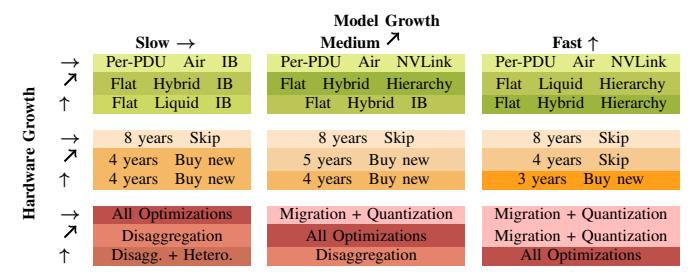

# A. Existing Cross-Stage Optimizations

IT provisioning → Build. AI hardware trends are driving datacenter redesigns: flatter power hierarchies for high-density accelerators, liquid cooling [84], and InfiniBand/NVLink networking [90]. These upfront investments increase build costs but simplify future refreshes and extend deployment lifetimes.

Operate → IT provisioning. Heterogeneity-aware scheduling helps repurposing older GPUs for workloads better suited to their capabilities: compute-intensive phases (*e.g.*, prefill or large models) run on newer GPUs, while memory- or bandwidth-bound phases (*e.g.*, decode or smaller models) are offloaded to older generations [68], [94]. This strategy smooths refresh costs and maintains high utilization, turning hardware upgrades into opportunities for redistribution and continued value rather than premature hardware retirement.

**Build** → **Operate.** Infrastructure decisions made at build time shape operational flexibility. Scheduling frameworks translate these choices into software controls that smooth demand, enable safe hardware derating, and sustain efficiency. Conversely, coordinated derating of servers and power devices within the power hierarchy allows oversubscription and denser deployments; effectively "upgrading" infrastructure at runtime without new physical buildouts [93], [104].

Compound TCO Benefits. Figure 15b shows that cross-stage strategies compound savings. Optimizing single stages reduces TCO by 20–30%, combining build and refresh exceeds 35%, and a holistic approach cuts over 40%. Assuming linear growth in hardware and models (Table IX), the optimal *build* uses flat power delivery, hybrid cooling, and hierarchical networking. For *refresh*, extend server lifetimes to five years and adopt new hardware as available. For *operation*, apply *all* optimizations.

## B. Opportunities for Cross-Stage Optimizations

Looking ahead, several opportunities emerge when infrastructure, hardware, and software are explicitly co-designed with lifecycle interplay in mind.

**Infrastructure.** Today's software supports heterogeneous fleets, but build and refresh strategies can better leverage heterogeneity. Rack-level provisioning with mixed-generation

| Optimization Technique                         | Description                                              | TCO Impact                          |
|------------------------------------------------|----------------------------------------------------------|-------------------------------------|
| Smooth Model Migration [45], [85]              | Gradual migration from old to newer models upon releases | Avoid rapid hardware procurement    |
| Model Quantization [66], [123]                 | Lower precision to reduce compute/memory                 | Lower hardware needs and cost/inf.  |
| KV-Cache Management [27], [88]                 | Optimize storage and reuse of KV cache                   | Increase older hardware reuse       |
| Disaggregation [88], [94], [110], [125], [127] | Split distinct phases onto different hardware            | Extend useful life of heterog. gens |
| Alternative Architectures                      | Mixture-of-Experts [100], State-Space-Models [38]        | Increase older hardware reuse       |
| Model Routing [22], [53]                       | Direct workloads to the most efficient model variant     | Increase older hardware reuse       |
| Heterogeneity-Aware Scheduling [55], [68]      | Map workloads to optimal/available hardware generation   | Defer refresh costs                 |
| Infrastructure-Aware Scheduling [104], [105]   | Exploit headroom within infra capacity envelopes         | Improve infrastructure efficiency   |

TABLE VIII: Operation stage software optimizations that introduce new cross-stage optimization opportunities.

TABLE IX: Optimal cross-stage strategies based on model and hardware trends under exponential user demand growth. The rows represent *build*, *refresh*, and *operate* stages. Color gradient shows degree of lifecycle adaptation required.

accelerators or general-purpose compute reduces interconnect bottlenecks and power fragmentation. Combined with heterogeneous derating, these setups adapt efficiently. While they require upfront investment, they offer long-term gains.

Hardware. Emerging AI accelerators have traditionally shaped datacenter infrastructure design. Looking ahead, future accelerators should be designed not only for performance but also for long-term compatibility with the existing infrastructure. Lower power density and moderated TDP simplify power delivery and cooling, reducing fragmentation. For example, accelerators could combine high-power SMs to handle the compute-bound prefill phase with Processing-in-Memory (PIM) units tailored for the memory-bound decode phase, enabling more efficient execution within the same server.

Operation. Techniques such as KV-cache management or new model architectures (*e.g.*, MoEs) shift the balance between compute and memory needs, reshaping both refresh priorities and placement strategies. Cross-stage planning anticipates these shifts by provisioning memory or storage servers that support multiple GPU generations.

