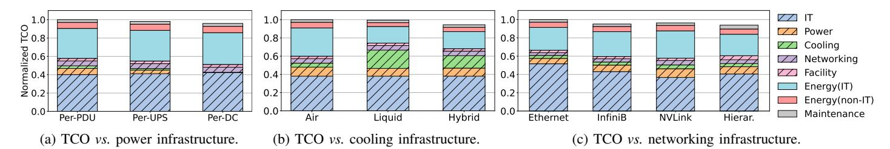
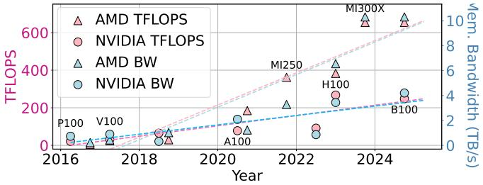

# B. Cooling Infrastructure

**Traditional Approach.** Most datacenters use air-based cooling [20], [23], [48], [69], [104], where chillers or adiabatic units deliver cold air via air handling units (AHUs) through raised floors or hot/cold aisle containment. Cooling is provisioned conservatively for peak thermal loads, and PUE

|       |                         | Power domain    |                  |                 |
|-------|-------------------------|-----------------|------------------|-----------------|
|       | Feature                 | Per-PDU         | Per-UPS          | Per-DC          |
| CapEx | Stranding Complexity | Lower Higher | Medium Medium | Higher Lower |
| OpEx  | Maintenance             | Lower           | Medium           | Higher          |
| Other | Fault isolation         | Excellent       | Good             | Poor            |

TABLE V: Comparison of power delivery infrastructure designs. Green: good, yellow: moderate, red: poor.

|       | Feature           | Air    | Hybrid | Liquid |
|-------|-------------------|--------|--------|--------|
| CapEx | Complexity        | Lower  | Medium | Higher |
| OpEx  | Energy efficiency | Lower  | Medium | Higher |
|       | Maintenance       | Lower  | Medium | Higher |
| Other | High-dense racks  | Lower  | Medium | Higher |
|       | Noise level       | Higher | Medium | Lower  |

TABLE VI: Comparison of cooling infrastructure designs.

is optimized with airflow management and economization. Modern datacenters achieve PUE of 1.1–1.3 [3], [31], [75].

Rearchitecting for AI. High-density GPU racks generate 4–8× more heat per rack than CPU systems [84], requiring higher airflow, lower inlet temperatures, and more fan energy, pushing air cooling to its limits. Liquid cooling (e.g., cold plates or immersion) [32], [54] is increasingly adopted for dense GPU deployments [7], [84]. While upfront CapEx and complexity are higher, OpEx is reduced via improved heat transfer, lower chiller load, and reduced fan power (Table VI). Hybrid designs (combining liquid for high-density racks and air for low-density) balance cost, density, and maintainability. Hence, contrary to common narratives that air cooling is "simpler and cheaper" and liquid cooling is "more efficient," we find that a 75/25 hybrid design improves the TCO by 9%.

## C. Networking Infrastructure

**Traditional Approach.** General-purpose datacenters use multi-tier Ethernet (*e.g.*, leaf–spine) with moderate oversubscription [8], [34], which is cost-effective for CPU workloads with modest bandwidth and latency requirements.

Rearchitecting for AI. AI workloads impose far higher network demands than general-purpose datacenters. Emerging practice uses hierarchical designs for inference [62]: NVLink for intra-server tensor parallelism [90], [101] and lower-cost networks for pipeline parallelism across servers. We evaluate four network designs: (1) all Ethernet, (2) all InfiniBand [5], (3) all NVLink [90], and (4) a hierarchical approach (NVLink intra-server, InfiniBand intra-rack, Ethernet inter-rack). Table VII summarizes cost-performance trade-offs, and Figure 6c shows hierarchical reduces TCO by 6% versus a flat high-performance network. By matching interconnects to AI workloads, hierarchical networking scales efficiently without over-provisioning expensive low-latency links. By isolating first-principles trade-offs among performance, cost, and workload needs, we treat these configurations as design reference points rather than deployment blueprints. For example, an all-NVLink fabric is not a realistic large-scale deployment (its topology, scalability, and availability constraints make it

Fig. 6: TCO vs. infrastructure designs during the build stage.

|       | Feature   | Ethernet | InfiniBand | NVLink | Hierarchical |
|-------|-----------|----------|------------|--------|--------------|
| CapEx | Cost      | Lower    | Medium     | Higher | Medium       |
| OpEx  | Energy    | Lower    | Medium     | Higher | Higher       |
|       | Maintain  | Lower    | Medium     | Higher | Medium       |
| Perf  | Bandwidth | Lower    | Higher     | Higher | Higher       |
|       | Latency   | Higher   | Lower      | Lower  | Medium       |

TABLE VII: Comparison of networking infrastructure designs.

Fig. 7: Evolution of AMD and NVIDIA GPUs showing TFLOPS (left axis) and memory bandwidth (right) over time.

impractical) but an upper-bound case showing ideal highbandwidth, low-latency connectivity. This lets us reason about which architectural choices remain efficient across lifecycle stages rather than optimizing any single layer in isolation.

