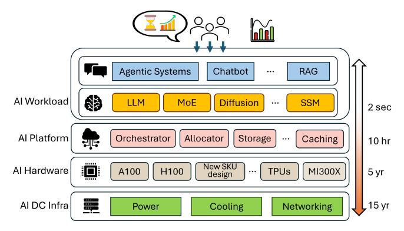
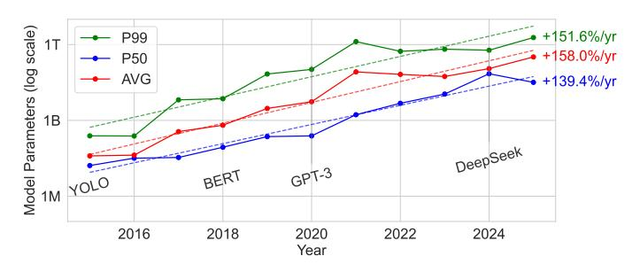

# Rearchitecting the Datacenter Lifecycle for AI

Jovan Stojkovic\* Chaojie Zhang† Íñigo Goiri† Ricardo Bianchini†
\*The University of Texas at Austin † Microsoft Azure

Abstract—The rapid rise of large language models (LLMs) has driven an enormous demand for AI inference infrastructure, mainly powered by high-end GPUs. While these accelerators offer immense computational power, they incur high capital and operational costs due to frequent upgrades, dense power consumption, and cooling demands, making total cost of ownership (TCO) for AI datacenters a critical concern for cloud providers.

Unfortunately, traditional datacenter lifecycle management (designed for general-purpose workloads) struggles to keep pace with AI's fast-evolving models, rising resource needs, and diverse hardware profiles. We rethink the AI datacenter lifecycle scheme across three stages (building, IT provisioning, and operation) highlighting how power, cooling, and networking decisions affect long-term TCO. We focus on hardware refresh strategies aligned with evolving hardware trends and evaluate operational software optimizations that further reduce cost.

While these optimizations at each stage yield benefits, unlocking the full potential requires rethinking the entire lifecycle. We present a holistic lifecycle management framework that optimizes decisions across all three stages, accounting for workload dynamics, hardware evolution, and system aging. Our approach reduces TCO by 40% compared to traditional methods and offers guidelines for managing AI datacenter lifecycles in the future.

#### I. Introduction

Generative LLMs are reshaping industries, from education [9] and healthcare [95] to software development [28] and scientific research [122]. Their rapid adoption is driven by the ability to perform complex reasoning, summarization, and interactive tasks with minimal supervision, creating unprecedented demand for scalable AI inference infrastructure [60].

Modern LLM inference relies on high-end GPUs (*e.g.*, NVIDIA A100 [82] and H100 [81]), which deliver high performance but incur steep financial and infrastructure costs. A single H100 server exceeds \$200k [18] and draws up to 10.2kW [94], [105], far surpassing the power and cooling demands of traditional CPU servers [80]. To support these workloads, cloud providers have built specialized datacenters for high-throughput inference, making AI-serving one of the most resource-intensive and costly datacenter operations [79].

Researchers have proposed software and hardware techniques that improve the performance [2], [19], [59], [74], [94], [118], [124], [126] or energy-efficiency [98], [102], [104], [105] of LLM inference clusters. However, for providers, the key challenge is minimizing the TCO over the datacenter lifecycle, spanning CapEx (*e.g.*, infrastructure build-out) and OpEx (*e.g.*, energy) while meeting user performance needs. Traditional practices, such as regular refresh cycles [41] and conservative provisioning [46], [63], [103], [120], fall short for AI workloads: models scale rapidly [24], hardware has higher cost and infrastructure demands [18], [51], and inference is highly sensitive to latency and quality [104], [105].

Our Work. To address this challenge, we first break down the datacenter lifecycle into stages: build, IT provisioning, and operation, each with distinct costs and optimization opportunities. Build defines the physical infrastructure, including power topology (e.g., flat [7] vs. hierarchical [26], [120]), cooling (e.g., air vs. liquid [32], [43]), and networking (e.g., NVLink [90] vs. Ethernet). IT provisioning governs when and how to decommission and buy new hardware, balancing performance gains, costs, and infrastructure constraints. Operation manages runtime workloads through placement, scheduling, and software-level optimizations.

For AI fleets, the hardware refresh dominates long-term cost because GPU performance, power, and costs evolve rapidly. We introduce a framework that rearchitects the lifecycle for AI datacenters around this refresh challenge. It evaluates alternative strategies across all stages and identifies the most cost-effective combination. In *build*, we compare emerging infrastructure designs to understand and balance long-term scalability, efficiency, and performance. In *IT provisioning*, we evaluate when to adopt new hardware and retire old systems, assessing the impact on TCO given AI's distinct model and hardware characteristics. In *operation*, we assess the impact of software techniques (*e.g.*, model migration, LLM inference disaggregation, and workload scheduling) over lifecycle TCO.

Because these stages are tightly interdependent, we introduce a TCO-driven framework that enables joint reasoning across stages, available at https://github.com/Azure/AI-Lifecycle-Compass [76]. The framework quantifies how decisions at one stage expand or constrain the feasible design space of others and shift the optimal operating point. We leverage TCO modeling to evaluate architectural choices and derive guidance for redesigning the AI datacenter lifecycle.

By leveraging workload growth trends, hardware roadmaps, and cost models, our framework projects future scenarios and identifies refresh points that balance performance, utilization, and operational cost. For example, investing in a larger powersharing domain increases *build*-time cost but provides greater flexibility for accelerator refreshes during *IT provisioning* and improves *operation* efficiency.

We build our framework using open-source LLMs, public hardware specifications, and detailed cost data from public sources. Stage-specific optimizations reduce TCO by 15% (build), 23% (IT provisioning), and 19% (operation). Our cross-stage strategy achieves up to a 40% TCO reduction. Looking ahead, we identify emerging cross-stage opportunities and provide guidelines for adapting AI datacenter lifecycle management to future model and hardware trajectories.

**Summary.** This paper makes the following main contributions:

Fig. 1: Hosting AI workloads from models to hardware and supporting datacenter infrastructure.

- A lifecycle-driven characterization of GPU and LLM inference over performance-power behaviors, highlighting how workload and system optimizations change the effective value of hardware across generations.
- Lifecycle-aware optimization framework integrating workload trends, hardware evolution, and infrastructure.
- Principled AI hardware refresh policy that incorporates infrastructure cost to minimize lifecycle TCO.
- Comprehensive cross-stage evaluation showing that coordinated lifecycle management reduces TCO by up to 40% compared to conventional siloed approaches and remain robust across diverse trend deviations and future scenarios.

## II. HOSTING AI WORKLOADS

Figure 1 shows the stack hosting AI workloads within a cloud provider: from datacenter infrastructure and specialized hardware to the workloads. We analyze these workloads and their demands on underlying hardware and infrastructure.

## A. AI Workloads

Nowadays, cloud providers host a wide range of AI workloads: large language models (LLMs), vision and multimodal models, speech, recommendation systems, and classical deep neural networks (DNNs) [16], [42], [56]. These workloads vary widely in compute complexity, memory footprint, performance, accuracy, and input modalities. The largest difference is between training and inference workloads: training demands high-bandwidth memory, fast interconnects, and fault-tolerant checkpointing, while inference workloads range from latency-sensitive, memory-bound LLMs at small batch sizes to throughput-oriented vision and recommendation pipelines.

This paper focuses on LLM inference, which is rapidly becoming the dominant workload in AI datacenters [16], [56], [93], [94]. For this workload, the most critical factors for datacenter build and provisioning are the size and architecture of the models (which drive compute and memory needs) and the user demand (the sustainable load).

**AI Model Trends.** These workloads have rapidly evolved in scale, architecture, and demand over the past decade.

Scale. Model sizes have grown dramatically, driving up compute, memory, and interconnect demands. Larger models require more FLOPs for inference, larger and higher-bandwidth on-device memory, and—once they outgrow a

Fig. 2: The P50, P99, and average size of the most popular AI models published in the last decade.

single GPU—multi-GPU execution with high-bandwidth, low-latency links for activation exchange. Figure 2 shows that model scale has increased exponentially: from GNMT's ~200M parameters in 2016 [115], to GPT-3's 175B in 2020 [10], and to Llama 4 Behemoth with over 2T parameters [72]. However, post-2023 trends suggest a slowdown, with growth turning linear [25] and potentially becoming sublinear or flat. This plateau reflects diminishing returns from traditional scaling and reduced training-efficiency gains. As a result, attention is shifting to alternatives: distillation compresses capabilities into smaller, more efficient models [117], while reasoning models leverage time-extended compute to improve performance without significant parameter growth [13], [39].

Architecture. Model architecture dictates the compute and memory bandwidth required for inference. Transformer-based models dominate deployments [109]: attention layers scale quadratically with sequence length, and matrix multiplications (GEMM) require high FLOP throughput and sustained memory bandwidth. Alternatives like state-space models (SSMs) [38] replace attention with convolution-like operations, reducing memory footprint and improving long-context scalability. Mixture-of-Experts (MoE) models [100] cut average compute by activating only a subset of experts, but increase memory and network pressure due to expert sharding. Fine-tuning (e.g., LoRA [47]) further reduce resource needs by updating only a small parameter subset.

Despite architectural differences, modern AI models share a common computational core: GEMMs. This uniformity enables unified performance modeling for AI inference, unlike traditional datacenters with heterogeneous workloads. Even emerging agentic systems [1], [12], which coordinate multiple LLMs, still rely on these same foundational computations.

**User Demand.** The global AI market is projected to grow from \$638B in 2024 to over \$3.68T by 2034 [128], with U.S. generative AI expected to see a 36.3% CAGR through 2030 [33]. This growth is driving increased inference workloads, which already dominate AI operational costs [93]. Unlike training, inference incurs higher cumulative costs due to continuous, large-scale deployment serving millions of queries daily [60]. Cloud providers like Microsoft, Amazon, and Google report 15–25% year-over-year growth in AI workloads [57], [96], [113], reflecting rising user demand and the shift toward scalable, cost-efficient inference infrastructure.

