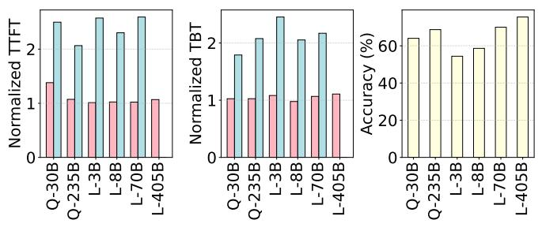
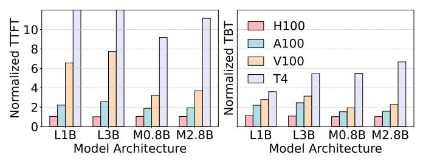
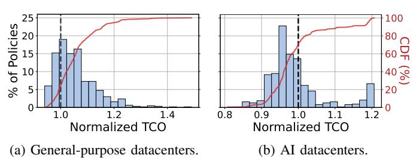
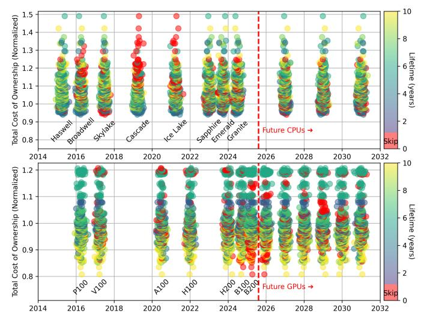
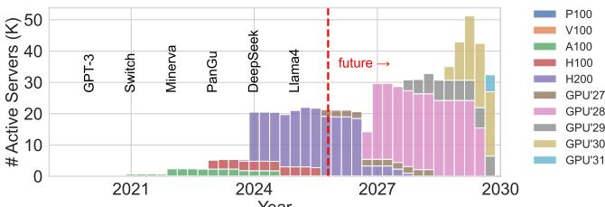
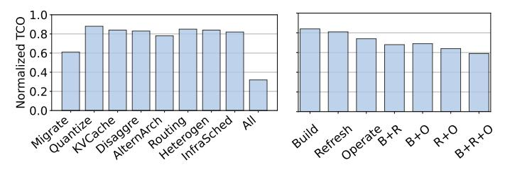

# V. Provisioning AI Hardware

The primary driver of TCO is IT cost, dominated by hardware management. The main challenge is deciding when to retire aging servers and deploy new ones. Hardware refresh is no longer a periodic, maintenance-driven process. For AI fleets, it is a strategic mechanism for ensuring performance, efficiency, and scalability as models and their system demands evolve rapidly. Informed decisions require translating raw hardware capabilities into cross-stack efficiency.

## A. Current Hardware AI Trends

Release Cycle. Figure 7 shows that GPU vendors are aggressively releasing new generations every year far exceeding the traditional 2–3 year cycle of CPU releases. Similar dynamics hold for other specialized AI hardware such as TPUs [56] and LPUs [37], which also follow fast-paced release cycles. This pace means that fleets often encounter multiple viable upgrade opportunities within a single depreciation window, complicating refresh planning and GPU lifetime decisions.

Raw Throughput. GPUs from vendors like NVIDIA and AMD have evolved significantly. From the NVIDIA P100, which offered modest FP16/FP32 throughput, to modern GPUs such as the B200 that deliver vastly higher performance through advanced tensor cores, increased memory bandwidth, and optimizations in sparsity and mixed precision. Figure 7 shows NVIDIA datacenter GPU trends from 2016 to 2025: compute throughput rose nearly 12× and memory bandwidth over 5×, with even stronger gains for AMD GPUs [4].

Workload-level Efficiency: Beyond FLOPS. Raw FLOPS rarely dictate realized performance and efficiency for LLM inference workloads. To understand the gap, we evaluate the performance of AI inference workloads with different model sizes and architectures across GPU generations. We ran experiments using vLLM [59] on real hardware and compare against the roofline model, which shows within 5% of errors for Llama3 [71] models. All runs use a 2K sequence length and batch size of 8. We measure TTFT and TBT in milliseconds. Then, we normalize the values to the H200 baseline per model. Model Size. We evaluate scalability using Llama3 [71] models from 1B to 405B parameters on NVIDIA GPUs: T4, V100, A100, H100, and H200. We configure TP [101] with the smallest value that fits each model across most GPUs (e.g., TP1 for 1B/3B, TP4 for 8B, TP8 for 70B/405B). Some setups fail on older GPUs due to memory limits. Figure 8 shows that small Llama3 models (1B-8B) remain efficient on older GPUs, while larger models (70B-405B) expose architectural bottlenecks in memory bandwidth and tensor-core throughput. The decode phase (TBT) is less sensitive to GPU generation than the prefill phase, reflecting its lower compute demands [94]. These effects demonstrate large discrepancies between FLOPS scaling and actual, model-specific performance scaling.

Model Architecture. We evaluate the impact of model sparsity by comparing sparse Qwen3 models (30B A3B and 235B A22B) with dense Llama3 models of similar sizes. Model structure significantly influences hardware viability and effi-

Fig. 8: TTFT and TBT latencies for different sizes of Llama-3 LLM across GPU generations normalized to H200.

Fig. 9: Latencies and accuracies for dense (Llama3) and sparse models (Qwen3) across GPU generations normalized to H200. Pink and blue bars for H100 and A100, respectively.

ciency. Figure 9 shows that sparse models scale better on older GPUs, maintaining competitive accuracy while outperforming dense counterparts in latency. For example, Qwen3-235B-A22B matches Llama3-70B in accuracy but degrades less on older hardware (though it requires nearly twice the GPU memory). This highlights the value of sparsity-aware designs for workload-level efficiency on older generations, extending the useful lifetime implied from raw performance.

Figure 10 compares transformer-based (Llama3-3B) with state-space-based (Mamba-2.8B). State-space models are more hardware-efficient: for 2K sequences using TP1, Llama3 runs 7.7× slower on V100 than on H200, while Mamba slows down by only 3.6×. This shows the architectural compatibility of state-space models with older or less performant GPUs.

Escalating Hardware Cost. This performance growth comes with sharply rising costs. The NVIDIA P100 debuted around \$9K per GPU (roughly \$90K per server), whereas the modern H100 costs about \$30K per GPU (over \$350K per server) [18]. AMD's MI series follow a similar trend, with newer generations carrying significantly higher price tags. In contrast, CPU server costs have risen more moderately over the same period. For example, from around \$7K per server for Intel's Haswell [52] systems in 2014 to approximately \$12K for the latest Granite Rapids [50] generation in 2025. The steep GPU cost-performance curve heightens the stakes of refresh decisions: replacing hardware too early wastes both hardware costs and triggers new infrastructure buildouts prematurely, while replacing too late risks sacrificing efficiency.

**Model Efficiency: Cost and Power Implications.** Combining performance with cost and power reveals trends hidden to raw FLOPS or workload level latency and goodput alone. While the goodput per Watt of large models degrades substantially on

Fig. 10: Latencies for transformer (Llama3) and state space (Mamba) models across GPUs normalized to H200.

older hardware, the gap is much smaller for smaller models. For example, Llama3-70B on an A100 yields roughly  $3 \times 10^{10}$  lower goodput per Watt than on an H100, while Llama-1B on an A100 is only about 18% lower. In terms of goodput per Watt per dollar, the A100 actually outperforms the H100 by 8–23% for the 1B, 3B, and 8B models, but delivers about  $2 \times 10^{10}$  lower efficiency for Llama-70B. In fact, for smaller models, even the V100 is on par with the H100, achieving performance per Watt per dollar within 5% of it.

This makes a key point for refreshing planning and GPU hardware lifetime: hardware generations do not degrade uniformly across workload profiles. Real efficiency gains materialize only when the full cross-stack interaction (*e.g.*, model specifics, power, cost) is favorable. This motivates refresh policies that leverage TCO optimizations for cross-stack efficiency.

## B. TCO-driven Refresh Policies and Server Lifetime

**Traditional Approach.** General-purpose datacenters typically follow a steady CPU refresh cycle with five years of server lifetime [111]. This baseline policy strikes a balance between capital and operational efficiency.

Alternative strategies include extending server lifetimes to reduce CapEx (at the expense of higher energy use and maintenance) or shortening lifetimes to deploy more efficient hardware sooner, increasing capital costs but improving energy and space efficiency. Skipping intermediate generations is another option when current hardware meets workload needs and newer gains are marginal.

We enumerate refresh strategies with an allowed lifetime for each generation from 0 (skip) to 10 years in one-year increments and evaluate their TCOs using Monte Carlo simulations (explained in Section III-C). Overlapping lifetimes permit multi-generation co-hosting, while decommissioning occurs deterministically at the end of the assigned lifetime. All resale and end-of-life assumptions are fixed across experiments.

Figure 11a shows the TCO distribution of all feasible refresh strategies, normalized to the baseline. Most policies fall to the right of the baseline, indicating that a 5-year refresh cycle remains among the most cost-effective choices for general-purpose datacenters.

Figure 12 shows the same data broken down by hardware generation. The top of Figure 12 presents a per-CPU-generation view, showing how varying the server lifetime of each individual hardware generation, from 0 years (skipping that generation entirely) to 10 years, impacts normalized TCO.

Fig. 11: TCO distribution for various hardware refresh policies in general-purpose and AI datacenters.

Fig. 12: TCO changing refresh policy for each hardware generation in general-purpose and AI datacenters.

For general-purpose datacenters, most generations favor 4–6 year refresh cycles, with Skylake being the exception, where skipping the generation yields lower TCO.

**Rearchitecting for AI.** The dynamics of AI accelerators and workloads differ substantially from those of general-purpose datacenters, rendering the traditional refreshes sub-optimal. Compounding the growth in hardware cost and model evolution, cross-stack efficiency can leap dramatically across GPU generations or change little at all, depending on architectural shifts and model trends. Figure 11b shows that many alternative refresh strategies can reduce TCO by 15–20% compared to the baseline.

Hardware-Driven Refresh Signals. Figure 12 shows the TCO changing the refresh cycle (and skipping) for each hardware generation. Three dominant hardware-driven trends emerge.

*Newer is much better*: when new GPUs provide substantial efficiency gains, early decommissioning of older hardware is justified, and datacenters benefit from upgrading as soon as the next generation is available. For example, moving from NVIDIA V100 to A100 GPUs is beneficial.

*Older is competitive*: for most GPU generations, extending hardware lifespan beyond 6 years remains cost-effective. This held true for all generations prior to B100.

Newer is similar or worse: when new GPUs offer marginal or negative efficiency gains, it is better to extend the life

Fig. 13: Server count by GPU type over time in an AI fleet following the optimal refresh policy for minimizing TCO.

of existing hardware and skip intermediate generations. For example, it is preferable to skip B100/B200 GPUs.

Workload Evolution. If models grow significantly (e.g., GPT-family releases [92]) refresh cycles must be accelerated to provision more efficient hardware that can handle the increased compute needs. If model sizes stabilize or decrease, extending hardware lifetime becomes more cost-effective.

Example Optimal Timeline. Figure 13 shows the deployment of GPU server generations under the optimal refresh policy to minimize TCO. The policy skips some generations (e.g., B100, B200) entirely, as extending the service life of H100 and H200 GPUs proves more cost-effective. When a newer generation delivers substantial performance and efficiency gains, the policy triggers earlier decommissioning and demand-driven purchases to match workload growth and model sizes. Compared to the baseline policy in Figure 4, this approach yields a smoother, more balanced mix of old and new hardware, and at times even a modest reduction in total server count due to improved GPU efficiency (e.g., in early 2027).

## C. Lessons

Fixed refresh intervals are not sufficient for AI workloads. Unlike traditional datacenters, where hardware and workloads change gradually, AI accelerators and models evolve at a much faster pace and interact in a complex, cross-stack ways. FLOPS increases do not reliably translate to realizable performance. Some generations deliver dramatic performance gains, while others bring only marginal improvements. These shifts are further amplified by rapid increases in power and thermal densities, hardware costs, and release frequency, changing the trade-offs between raw performance and efficiency.

Thus, AI datacenters must adopt flexible hardware refresh strategies that considers full TCO and cross-stack efficiency, responding to evolving hardware efficiency and workload trends. This may involve aggressively retiring older GPUs when new generations deliver significant efficiency gains, while extending the life of existing hardware (or skipping intermediate generations) when improvements are limited.

## VI. OPERATING AN AI DATACENTER

Once hardware is provisioned, the challenge is sustaining high utilization while meeting SLOs across a diverse, evolving fleet. This requires software to orchestrate varying workloads, hardware generations, and performance—cost trade-offs, all influenced by prior build and refresh decisions.

Fig. 14: Performance and performance/Watt for DCPerf applications [106] across generations of Intel servers.

(a) TCO vs. software optimization. (b) TCO vs. stages. Fig. 15: TCO for optimization during *operation* and for stages, normalized to the baseline without optimizations.

**Traditional Approach.** Workloads typically run on homogeneous hardware pools with uniform deployment, from baremetal servers and VMs to microservices and serverless. Most use the latest hardware, while some remain on legacy systems until decommissioned [36]. Software stacks are tuned for predictable performance, requiring minimal adaptation to hardware diversity or rapid workload changes.

We use the DCPerf benchmark suite [106] to evaluate performance and power efficiency of Intel server generations. Figure 14 shows that throughput and performance per Watt scale nearly linearly with newer servers, supporting the common practice of migrating workloads to the latest generation. Rearchitecting for AI. AI workloads and hardware trends differ significantly from general-purpose datacenters (Section V-A). Unlike CPUs, GPU performance improvements for AI are uneven across generations and vary by model and use case. Thus, traditional direct-migration strategies are suboptimal. Achieving efficiency requires software optimizations that align evolving models, growing demand, and a heterogeneous fleet while controlling cost and meeting SLOs.

Optimizations. Table VIII summarizes operational techniques affecting build and refresh. Model migration, quantization, and KV-cache management reduce compute and memory pressure. Disaggregation leverages fast interconnects and aligns workload phases with appropriate hardware. Heterogeneity-aware routing, placement, and scheduling match workloads to hardware in real time, while infrastructure-aware scheduling accounts for datacenter constraints (e.g., power, cooling), linking operations to build-time decisions.

TCO savings. These optimizations extend hardware lifetime, defer costly refreshes, and increase infrastructure value. Figure 15a shows 12–39% TCO reductions per strategy. *Model migration* yields the largest gains by reducing post-release compute load, while *disaggregation* and *infrastructure-aware* 

scheduling achieve strong savings without changing work-loads. Combining all strategies cuts TCO by over 60%; although not fully additive, the cumulative impact is substantial.

#### A. Lessons

Fixed, uniform operations are insufficient for evolving models and heterogeneous hardware. Software techniques shift operations from reactive to proactive, extending hardware utility, leveraging heterogeneous fleets, and dynamically aligning workloads with available resources. By linking operations, refresh, and build decisions, these methods transform rigid hardware timelines into adaptive, lifecycle-aware policies.

## VII. CROSS-STAGE OPTIMIZATIONS

The largest TCO savings come from cross-stage rearchitecting the end-to-end AI datacenter lifecycle.

