# Reducing Page Faults via Invalidation-based Mapping Propagation in Multi-GPU Systems

Junsung Kim∗ *Yonsei University* Seoul, Republic of Korea junsung.kim@yonsei.ac.kr

Dongho Ha *Yonsei University* Seoul, Republic of Korea dongho9601@gmail.com

Sungwoo Kim *Yonsei University* Seoul, Republic of Korea sungwoo.kim@yonsei.ac.kr

Wonho Cho *Yonsei University* Seoul, Republic of Korea wonho.cho@yonsei.ac.kr

Sungbin Kim *Yonsei University* Seoul, Republic of Korea sungbin.kim@yonsei.ac.kr

Yufei Ding *UCSD* La Jolla, CA, USA yufeiding@ucsd.edu

Won Woo Ro *Yonsei University* Seoul, Republic of Korea wro@yonsei.ac.kr

*Abstract*—Unified Virtual Memory in multi-GPU systems provides scalable hardware resources with simplified memory management to users. However, its performance is often restricted by high-latency page faults. When a page migrates, the migration mechanism invalidates old mappings on all GPUs but updates the new mapping only on the destination GPU. This leaves other GPUs' page table entries invalid, generating subsequent page faults when the non-destination GPUs attempt to access the migrated page. Additionally, we observe that naively updating all GPUs' entries incurs extra page table walks, resulting in significant latency overhead. To address this, we propose *ShadowUpdate*, a redesign of the migration handling mechanism to reduce page faults by leveraging the invalidation phase. *ShadowUpdate* exploits the existing invalidation broadcast to proactively propagate the new mapping simultaneously. By combining invalidation and mapping updates, this approach eliminates redundant page faults and the associated page table walks, accelerating the overall migration process. To ensure correctness, *ShadowUpdate* also includes a lightweight in-flight migration tracker that holds translation requests during migration, records the new mapping at invalidation, and releases the requests once the page copy completes to prevent invalid accesses. *ShadowUpdate* improves overall performance by 1.40× on average over a baseline UVM design across 14 representative multi-GPU UVM workloads.

## I. INTRODUCTION

Multi-GPU systems, such as NVIDIA's DGX [50], are widely adopted to meet the high computational and memory demands of modern applications [11], [21], [26], [41], [45], [76]. However, managing memory in multi-GPU systems remains a significant challenge, as users manually manage memory allocations and data movement across multiple devices. To address this, these systems adopt Unified Virtual Memory (UVM) [3], [33], [46]–[48], which enables the use of a unified pointer across devices and supports transparent page migration, relieving users from manual data placement.

However, UVM-enabled multi-GPU systems often suffer from non-uniform memory access (NUMA) overheads caused by page sharing and placement. Under the first-touch policy, a

∗This paper was done when the author was a visiting scholar at the University of California, San Diego (UCSD).

page is placed on the first accessing device and remains there, so later accesses from other devices become remote accesses, increasing latency and interconnect traffic. On-demand migration [52] reduces such remote accesses by moving pages to the requesting device, but in multi-GPU systems with shared pages, it can trigger frequent migrations. To balance these two costs, modern GPUs since NVIDIA Volta adopt *access counter-based migration* policies [38], [47]–[49], [75].

Access counter-based migration policy monitors the number of accesses from each device to pages and triggers migration only when a GPU access count reaches a predefined threshold. If a device does not have a valid mapping in its local page table, it triggers a page fault. Then, the GPU issues an address translation service (ATS) request [56], [73] to the host, which performs a centralized page table walk and returns the translation result via interconnects. This communication with the host and multiple memory accesses for page table lookups significantly degrade overall performance in multi-GPU systems. With the returned remote mapping, the GPU performs remote accesses until the access count reaches the threshold and another migration is triggered. It prevents frequent migrations while reducing remote accesses.

Despite its advantages in reducing remote accesses and page migrations, this policy now suffers from page faults for retrieving remote mappings. We find that the existing migration handling mechanism is a major source of additional page faults. While this mechanism updates the new mapping only on the destination GPU, the other GPUs are left with invalid mappings. When other GPUs attempt to access the migrated page, they experience page faults again because the mapping was invalidated but not updated, even if they had accessed that page before. We refer to this as a *re-fault*. This re-fault triggers a host-side page table walk again. We observe that re-faults account for 73.59% of all page faults.

To demonstrate that the UVM driver installs updated mapping information only on the destination GPU during migration handling, we log the virtual page numbers that trigger page faults while running the BFS benchmark from the

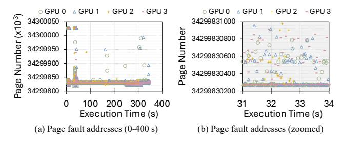

Fig. 1: Page fault addresses in a four-RTX 3090 Ti system.

SHOC suite [18] on a four-RTX 3090 Ti system. Its memory footprint is 9.31 GB, and its vertices are distributed across four GPUs. Figure 1 plots page fault addresses over time for each GPU. Figure 1(a) shows faults over the full execution, and Figure 1(b) zooms in on a specific window. Across all GPUs, the same pages repeatedly trigger faults as execution progresses. This suggests that after a page is migrated, the new mapping is installed only on the destination GPU and is not propagated to the other GPUs. Consequently, when other GPUs later access the same page, they experience page faults again, leading to re-faults in multi-GPU systems.

Several prior works explored page fault overhead and page migration optimizations, primarily focusing on the ondemand page migration policy [1], [2], [11], [16], [24], [33], [41], [42], [48], [79]. In contrast, relatively little research investigated the access counter-based migration policy, despite its widespread adoption in multi-GPU systems. One notable work, IDYLL [38], mitigates GPU page walk contention caused by invalidation requests under access counter-based migration, but does not reduce the page faults themselves.

A straightforward solution to reduce re-faults is to broadcast the new mapping to all GPUs, instead of updating only the destination GPU. However, this approach requires each GPU to perform additional page table walks to install the new mapping, introducing extra latency and potential contention with ongoing address translations. We observe that the invalidation process itself provides an opportunity to eliminate this overhead, as it already traverses the GPU page tables through the GPU memory management unit (GMMU) to invalidate page table entries (PTEs) across GPUs. This can be exploited to simultaneously propagate the updated mapping and prevent re-faults without incurring additional page table walks.

Based on this observation, we propose *ShadowUpdate*, a migration handling mechanism that eliminates re-faults. ShadowUpdate piggybacks new mapping information onto the invalidation requests already broadcast to maintain translation coherence. It prevents re-faults without additional page table walks and also shortens migration latency. Figure 2 compares the baseline migration mechanism and ShadowUpdate using an example where GPU 0 accesses virtual address 0xA, triggering page migration, and GPU 1 later accesses the same address. In the baseline (Figure 2a), GPU 1 incurs a re-fault because its old mapping is invalidated but not updated. In contrast, ShadowUpdate (Figure 2b) propagates the new mapping with the

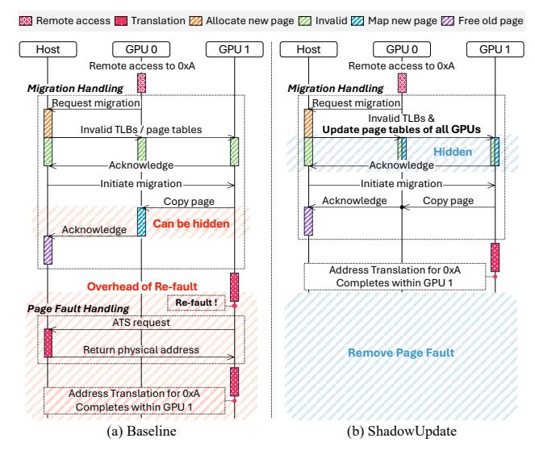

Fig. 2: Comparison between the baseline and ShadowUpdate.

invalidation signals, allowing GPU 1 to resolve the translation locally without a re-fault. Moreover, because the new mapping is updated during invalidation, ShadowUpdate removes the mapping step after page copy, further accelerating migration.

While ShadowUpdate effectively propagates updated mappings early, allowing access to the new mapping before the page copy completes can lead to correctness issues. If a GPU accesses the newly installed mapping before the data copy completes, it accesses an incorrect memory location. To prevent such premature accesses, ShadowUpdate employs an *Inflight Migration Tracker (IfMT)*, a lightweight hardware table that temporarily blocks translation requests to pages under the migration process. During the copy phase, any access requests to the migrating page are pended and later released once the migration completes, ensuring safe and correct access.

We make the following contributions:

- We identify page faults as a critical bottleneck under access counter-based migration in multi-GPU systems.
- We reveal that the current migration handling mechanism causes frequent re-faults by leaving non-destination GPUs without updated mappings after migration, and analyze the challenges of propagating updated mappings across GPUs.
- We propose ShadowUpdate, a redesigned migration handling mechanism that eliminates re-faults by proactively propagating updated mappings through piggybacking them on invalidation messages, avoiding additional page table walks. ShadowUpdate ensures translation correctness with a lightweight hardware IfMT and further accelerates the migration process by overlapping the mapping phase with the invalidation phase.
- We evaluate ShadowUpdate across 14 applications from diverse multi-GPU benchmark suites [5], [15], [18], [19], [68], [80]. ShadowUpdate improves overall performance by 1.40× on average compared to the baseline UVM system.

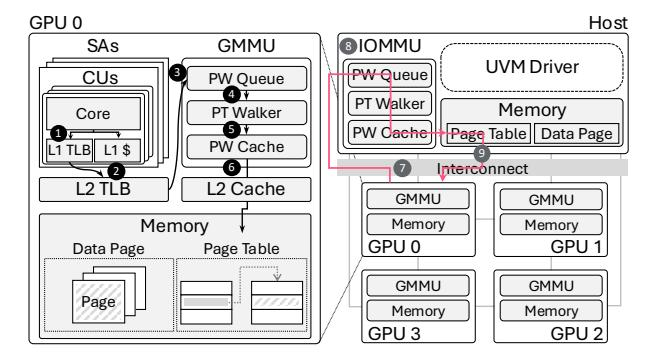

Fig. 3: Baseline multi-GPU architecture.

#### II. BACKGROUND

#### A. UVM and Multi-GPU Architecture

Modern multi-GPU systems support UVM, which provides a unified virtual address space, allowing multiple GPUs to access shared data through a single pointer [31], [33], [47]-[49]. This significantly simplifies programming by eliminating the need for explicit memory allocation. UVM transparently manages memory placement using page migration, dynamically relocating data to the GPU that accesses it. Figure 3 illustrates the architecture of a typical UVM-enabled multi-GPU system. GPUs are interconnected through high-bandwidth links such as PCIe or NVLink [23], [57], enabling efficient inter-device communication. Each GPU maintains local memory and its own page table. For address translation, GPUs include a GMMU composed of a page walk queue (PWQ), a page table walker (PTW), and a page walk cache (PWC) to accelerate translation. When a page fault occurs because the GPU cannot resolve the translation locally, the host handles the translation.

## B. Address Translation in Multi-GPU Systems

Figure 3 also illustrates the address translation process in multi-GPU systems. The process begins when a memory request generated by a compute unit (CU) is sent in parallel to the private L1 TLB and L1 cache (1). If the L1 TLB misses, the request is forwarded to the shared L2 TLB (2). On an L2 TLB miss, the request is forwarded to the GMMU, which performs a page table walk on the local page table. The request is first queued in the PWQ, awaiting an available PTW (3). The PTW traverses the multi-level page table to resolve the translation request (4). The PTW checks the PWC for intermediate translation results (5). If the required entries are not found in the PWC, the PTW accesses the L2 cache and GPU memory to fetch the corresponding PTEs (6). Once translation completes within the GPU, the mapping is returned to the CU, and the request proceeds to the data cache lookup.

However, if the local page table lacks the required mapping, which is called a *page fault*, the request must be handled by the host. In this case, the GMMU issues an ATS request [56], [73] over the interconnect to the host IOMMU (7). The translation request is enqueued in the host-side PWQ and processed by the PTW, which accesses both the PWC and the centralized page table to complete the translation (8). Once resolved,

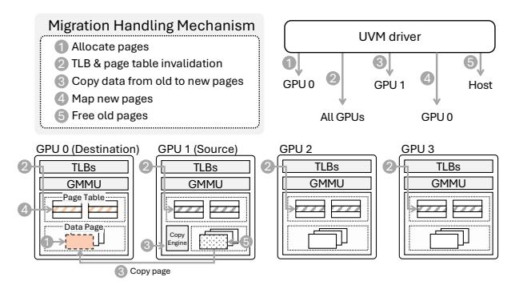

Fig. 4: Migration mechanism in multi-GPU systems.

the host sends the result back to the requesting GPU via the interconnect (②). The GPU then updates its local page table and replays the original request using the new mapping.

#### C. Access Counter-Based Page Migration

First-touch migration often incurs frequent remote accesses, whereas on-demand migration [52] can lead to excessive page migrations. To balance these two extremes, NVIDIA GPUs starting with the Volta architecture [49] adopt an access counter-based migration scheme. This approach monitors the number of accesses to each page and only triggers migration once an access count reaches a predefined threshold (e.g., 256 accesses in Ampere GPUs [47], [51]). By deferring migration until the threshold is reached, this strategy reduces excessive migrations, avoiding unnecessary data movement and improving performance. Under this policy, when a GPU first attempts to access remote memory, it triggers a page fault. The GPU sends an ATS request to the host, which performs a page table walk and returns the resolved remote mapping via interconnects as described in Section II-B. Using this remote mapping, the GPU continues remote accesses until the access count reaches the threshold, at which point a migration request is issued. As a result, this policy reduces remote accesses and prevents frequent migrations. Despite its benefits in reducing both remote accesses and page migrations, the current policy still suffers from page faults when retrieving remote mappings. These page faults require the host to perform address translations, degrading overall performance in multi-GPU systems. In this study, we focus on the page faults under the access counter-based migration policy.

## D. Migration Handling Mechanism

Figure 4 shows the current page migration handling mechanism [62], [77], which is triggered when the access counter exceeds a predefined threshold. Once the access threshold is reached while GPU 0 is accessing a remote page on GPU 1, GPU 0 issues an interrupt to the host to initiate the migration process. The UVM driver on the host allocates new physical pages on the requesting GPU to serve as the migration destination (1). Note that the driver already knows the source page locations from prior remote accesses. Next, the driver broadcasts invalidation requests to all GPUs to remove existing virtual-to-physical mappings from page

tables and TLBs, ensuring translation coherence across the system. Each GPU then performs TLB shootdowns [6], and invalidates the corresponding PTEs through page table walks via GMMU (2). Once all invalidations are acknowledged, the host instructs the copy engine to begin transferring the data (3). The host then sends the new mapping to the destination GPU, where the driver updates the GPU local page table accordingly (4). Finally, the host frees the old pages and adds them back to the available memory pool (5), and each step of this migration handling mechanism is processed serially to ensure system correctness.

TABLE I: Configuration of baseline multi-GPU systems.

| Component                | Configuration                                           |  |  |  |  |
|--------------------------|---------------------------------------------------------|--|--|--|--|
| Shader Array (SA)        | 16 per GPU                                              |  |  |  |  |
| CU                       | 4 per SA                                                |  |  |  |  |
|                          | 16KB vector cache per CU, 4-way                         |  |  |  |  |
| L1 Caches                | 16KB scalar cache per SA, 4-way                         |  |  |  |  |
|                          | 32KB instruction cache per SA, 4-way                    |  |  |  |  |
| L2 Cache                 | 2MB, 16-way, writeback, shared by all CUs               |  |  |  |  |
| DRAM                     | 4GB, 1 TB/s, 100-cycle latency                          |  |  |  |  |
| L1 TLB                   | 32 entries, 32-way, 1-cycle latency                     |  |  |  |  |
| L2 TLB                   | 512 entries, 16-way, 10-cycle latency                   |  |  |  |  |
|                          | Host MMU 16 shared page table walkers [41]              |  |  |  |  |
| Page table walker        | GMMU 8 shared page table walkers [38], [60], [64]       |  |  |  |  |
|                          | 100-cycle latency per level [27], [38]                  |  |  |  |  |
| Page walk queue          | 64 entries shared across page table walkers             |  |  |  |  |
| Page walk cache          | 128 entries shared across page table walkers [38], [60] |  |  |  |  |
| Access counter threshold | 256 [51]                                                |  |  |  |  |
| CPU-GPU network          | 32 GB/s                                                 |  |  |  |  |
| GPU-GPU network          | 600 GB/s                                                |  |  |  |  |

TABLE II: List of workloads.

| Abbr. | Benchmark Description                    | Migration PKI | Page Fault PKI | Footprint |  |
|-------|------------------------------------------|------------------|-------------------|-----------|--|
| MM    | Matrix Multiplication [5]                | 0.1276           | 4.8285            | 32 MB     |  |
| FW    | Floyd-Warshall Algorithm [5]             | 0.6110           | 21.6208           | 32 MB     |  |
| BS    | Bitonic Sort [5]                         | 0.6637           | 5.3311            | 18 MB     |  |
| C2D   | 2-D Convolution [19]                     | 0.0906           | 2.1079            | 50 MB     |  |
| IM    | Image to Column [19]                     | 0.0385           | 0.8875            | 78 MB     |  |
| LeNet | LeNet [19]                               | 0.1380           | 2.1077            | 26 MB     |  |
| FIR   | Finite Impulse Response [68]             | 0.0273           | 0.4760            | 64 MB     |  |
| AES   | Advanced Encryption Standard [68]        | 0.0167           | 0.3080            | 32 MB     |  |
| KM    | K-Means Clustering Algorithm [68]        | 0.2032           | 3.3859            | 65 MB     |  |
| MIS   | Maximal Independent Set [15]             | 0.5423           | 21.3018           | 12 MB     |  |
| MM3   | 3 Matrix Multiplications [80]            | 0.2090           | 2.0495            | 28 MB     |  |
| MVT   | Matrix Vector Product and Transpose [80] | 0.4042           | 3.1385            | 64 MB     |  |
| SpMV  | Sparse Matrix Vector Multiplication [18] | 3.5395           | 26.6264           | 82 MB     |  |
| BFS   | Breadth-First Search Algorithm [18]      | 0.0275           | 0.4160            | 16 MB     |  |

#### III. METHODOLOGY

To evaluate the effectiveness of our proposed ShadowUpdate design, we use MGPUSim [67], a cycle-accurate multi-GPU simulator that has been validated against industrial GPUs [4]. Our evaluation system models a 4-GPU platform, where each GPU has its own private page table, memory, and GMMU. The simulator is extended to faithfully implement access counter-based page migration. Our evaluation setup is configured in detail in Table I. Each GPU consists of 16 SAs, and each SA contains 4 CUs, for a total of 64 CUs per GPU. Each CU has private L1 caches and L1 TLBs, while all CUs share a unified L2 cache and L2 TLB. Page walks are managed by a shared GMMU that contains multiple PTWs, a PWQ, and a PWC. For inter-GPU and CPU-GPU communication, the simulator models a 600 GB/s high-bandwidth inter-GPU

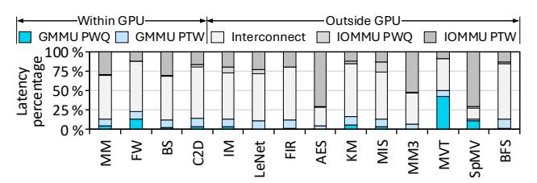

Fig. 5: Latency breakdown of page table walk requests.

interconnect and a 32 GB/s CPU-GPU interconnect. We adopt a distributed CTA scheduling policy [7] to improve inter-CTA locality.

We evaluate ShadowUpdate using various benchmark suites, including AMD APP SDK [5], DNN-MARK [19], HETERO [68], PANNOTIA [15], POLYBENCH [80], and SHOC [18]. Details of the simulated workloads are shown in Table II. These workloads vary in data access patterns, inter-GPU page sharing intensity, frequency of migration, and page fault rate. The workloads are implemented for multi-GPU execution, provided by MGPUSim, and are also used in prior multi-GPU studies [11], [38], [41], [42], [61]. Each workload is compiled using OpenCL and ported to execute under the MGPUSim simulation environment. Table II also provides Migration Per Kilo Instruction (MPKI), Page Fault Per Kilo Instruction (PFPKI), and memory footprints.

#### IV. MOTIVATION

Address translation can become a major bottleneck in modern GPUs when a mapping is missing from the local page table, triggering a host-side page fault. In multi-GPU systems, page migration further increases this overhead by causing *refaults*. This section analyzes the cause and impact of re-faults and discusses how to reduce them.

## A. Page Fault Characteristics

A page fault occurs when address translation cannot be resolved within the GPU using its local page table, forcing the GPU to request the mapping from the host page table. To understand the performance impact of page faults in multi-GPU systems, we analyze the latency breakdown of translation requests. Figure 5 shows the latency components after an L2 TLB miss, separating GPU-internal components (e.g., GMMU PWQ/PTW) from external components (e.g., interconnect and IOMMU PWQ/PTW). We find that 78.32% of the total latency comes from page fault handling outside the GPU, including interconnect delay and host-side page table walks. This long latency path stalls translation requests and delays many threads accessing the page. Therefore, reducing page faults is essential for improving throughput in multi-GPU systems.

Page faults in multi-GPU systems can be classified into two types: (i) *cold-faults* and (ii) *re-faults*. A *cold-fault* occurs when a GPU accesses a page for the first time and does not have the mapping in its local page table. In contrast, a *re-fault* occurs when a GPU re-accesses a page after it has migrated to another GPU. In Figure 6(a), Page A initially resides in GPU Z. When GPU X and Y access Page A for the first

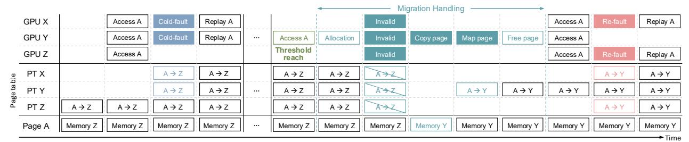

(a) Example of cold-faults

(b) Example of re-faults

Fig. 6: Two types of page faults.

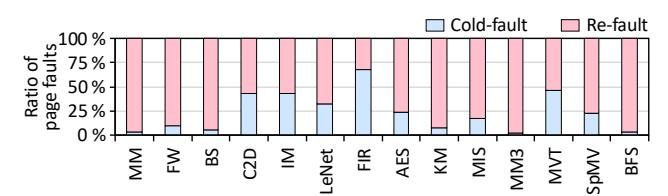

Fig. 7: Ratio of re-faults among page faults.

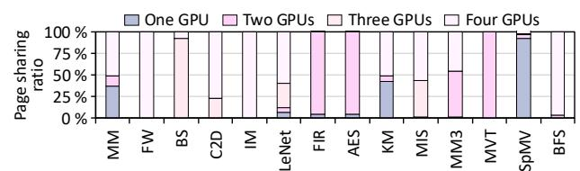

Fig. 8: Ratio of page sharing across GPUs.

time, they experience cold-faults because they do not yet have the mapping. After the host returns the translation results, both GPUs can perform remote accesses to Page A. Later, in Figure 6(b), re-accesses from GPU Y trigger migration of Page A to GPU Y after the access threshold is reached. During migration, invalidation signals are broadcast to all GPUs, removing the mappings for Page A from the TLBs and page tables of GPU X, Y, and Z. After migration, only the destination GPU Y updates its page table with the new mapping and continues execution. In contrast, GPU X and Z incur re-faults when they access Page A again, even though they had previously retrieved its mapping. These re-faults occur because migration invalidates the old mapping on all GPUs, including those not directly involved in the migration.

Figure 7 presents the ratio of cold-faults and re-faults across various workloads. We observe that re-faults account for the majority of the overall page faults across all benchmarks, representing 73.59% on average. This result reveals that most page faults are not caused by first-time accesses (i.e., coldfaults), but rather by re-accesses to the migrated page that was invalidated during the migration process. Importantly, re-faults incur the same handling path as page faults, requiring address translation to be serviced by the host through centralized page table walks and interconnect communication. The key difference is that a re-fault occurs even though the GPU already resolved the mapping once before. This redundancy represents a waste of translation effort and host-side resources, making re-faults a major and overlooked performance bottleneck in multi-GPU systems. Reducing re-faults is therefore essential for minimizing translation latency and improving throughput.

## B. Root Cause of Re-faults

**Page Sharing Characteristic:** Page sharing is a common characteristic of multi-GPU systems [11], [38], [41], [42], [45]. This occurs because parallel applications typically dis-

tribute work across GPUs while operating on shared data structures such as matrices, graphs, or input/output buffers. As a result, threads on different GPUs frequently access overlapping regions of memory. These access patterns trigger page migrations, as each GPU attempts to bring shared pages into its local memory to improve access latency. During migration, PTEs across all GPUs are invalidated to maintain translation coherence, which causes re-faults because GPUs that previously accessed the page lose their valid mappings. To examine the extent of this sharing behavior, Figure 8 presents the page sharing ratio across various benchmarks. The results reveal that many benchmarks have a large fraction of pages accessed by multiple GPUs, indicating substantial inter-GPU sharing. This sharing frequently triggers page migrations, which invalidate PTEs and lead to re-faults.

Migration Handling Mechanism: While high page sharing increases the frequency of page migrations, the fundamental cause of re-faults lies in the current migration handling mechanism. The UVM driver handles the migration request through a five-step process to relocate the page, as described in Section II-D. However, the new mapping is updated only on the destination GPU after the copy phase, whereas all GPU PTEs are invalidated. Other GPUs, even those that previously accessed the page and had valid mappings, do not receive the updated mapping after the migration process is completed. As a result, once the page is migrated, the GPUs are left with invalid entries and experience re-faults to fetch the updated mapping. These re-faults undermine performance, especially in workloads with high page sharing. This motivates the need to redesign the existing migration handling mechanism to propagate updated mappings not only to the destination GPU but to all GPUs.

Challenges of New Mapping Propagation: A naive approach to avoid re-faults is to broadcast the updated page mapping to all GPUs after copying the page, along with

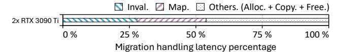

Fig. 9: Latency breakdown of migration handling.

updating the destination GPU. While this approach may seem straightforward, it introduces several challenges due to the additional page table walk requests required on each GPU. First, propagating updated mappings across all GPUs incurs significant communication and page walk overhead. Figure 9 presents the latency breakdown of the five-step migration handling process, measured on a two-RTX 3090 Ti system with PCIe Gen4, using NVIDIA open-source GPU driver [51]. Note that the results are averaged over the benchmarks in Table II for representative results, and the breakdown trends are largely consistent across workloads. Step 4 of the mechanism (map new page) is only performed on the destination GPU, but it accounts for 26.02% of the total migration handling latency, contributing significant overhead. Extending it to all GPUs would significantly increase latency and hurt scalability. Second, these mapping updates to all GPUs can interfere with ongoing address translation requests. In multi-GPU systems with high translation pressure, additional page table walk requests required for updating mappings may contend with existing translation requests, leading to queuing delays in the PWQ. Previous studies [35], [38], [42], [64] already identified page walk contention as a critical bottleneck in GPU memory subsystems. Therefore, a redesigned migration handling mechanism should ensure the propagation of updated mappings to all GPUs while preventing additional page table walk overhead.

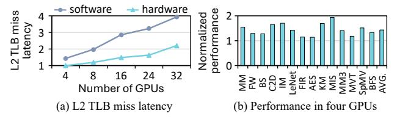

Fig. 10: Comparison of software-driven and hardware-based new mapping update approaches.

Need for Hardware-based Mapping Update: To further understand the cost of updated mapping installation, we compare two possible mapping update approaches: software-driven update and hardware-based update. In the software-driven approach, the host CPU sends mapping update requests to GPUs, and each GPU performs page table walks to install the updated mapping. In contrast, the hardware-based approach lets GPU hardware handle the page table walk and update process with minimal host-side software intervention. Figure 10(a) shows the L2 TLB miss latency as the number of GPUs increases, normalized to the hardware-based approach in a four-GPU system. The hardware-based approach consistently achieves lower L2 TLB miss latency than the software-driven approach, and the gap becomes larger as the number of GPUs increases,

reaching up to  $2.37\times$ . This is because the software-driven approach cannot leverage hardware PWCs, lengthens migration handling, and increases tail latency. Moreover, scaling to more GPUs concentrates more mapping update requests on the host, creating host-side contention and further degrading scalability. Figure 10(b) compares the performance of the two approaches in a four-GPU system. The hardware-based approach achieves 1.38× higher performance on average than the software-driven approach. These results demonstrate that software-driven page table walks incur significantly higher latency than hardware page walks, and this overhead increases as the number of GPUs grows. Therefore, eliminating re-faults efficiently and scalably requires a hardware-based mapping update mechanism rather than a software-driven broadcast. Based on these observations, we adopt a hardware-based new mapping update scheme as the baseline for our design throughout this paper.

#### V. REDESIGNING MIGRATION HANDLING MECHANISM

#### A. Design Goals

In this paper, we propose ShadowUpdate, a redesigned migration handling mechanism with lightweight hardware support to reduce re-faults in multi-GPU systems. ShadowUpdate is guided by three goals: efficiently propagating updated mappings to all GPUs without extra page table walks, maintaining translation coherence across GPUs, and keeping the hardware overhead lightweight. ShadowUpdate is built upon these design goals, which we detail in the following sections.

## B. ShadowUpdate

New mapping propagation: In current multi-GPU systems, when a page migrates, only the destination GPU updates its page table with the new location, while other GPUs are left with invalid mappings and later incur re-faults. To address this, we design a migration handling mechanism that broadcasts updated mappings to all GPUs and identifies the proper point to perform this broadcast. As shown in Figure 4, current migration handling consists of five stages. Determining when to broadcast the new mapping depends on the availability of two key pieces of information: the virtual address (VA) and the destination physical address (PA). The VA is available from the start of migration handling because it is included in the interrupt from the requesting GPU. In contrast, the destination PA becomes available only after the initial allocation step at the destination. Therefore, the updated mapping can be broadcast after this allocation step.

Another key factor is the cost of updating PTEs, which requires multi-level page table walks by the GMMU. These operations involve multiple memory accesses and may contend with ongoing translation requests. To avoid additional page table walks, ShadowUpdate hides new PTE updates within the existing migration mechanism. As shown in step (2) of Figure 4, invalidation signals are already broadcast to all GPUs before page copy. These invalidations use GMMU page table walks to clear old mappings [38]. ShadowUpdate leverages this process by attaching the new physical address of the

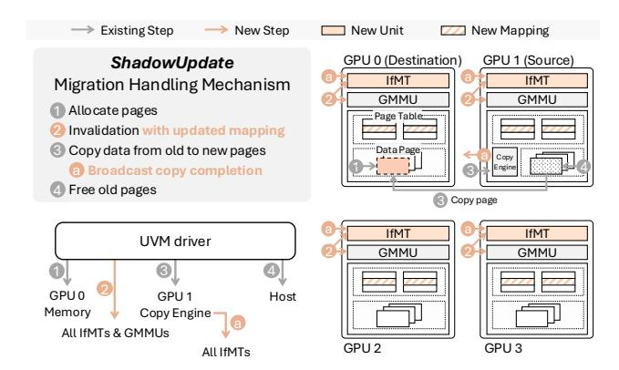

Fig. 11: ShadowUpdate Overview.

migrating page to the invalidation message. This piggybacked update allows each GPU to update its page table without an extra page table walk.

Furthermore, piggybacking the updated mapping onto invalidation not only removes additional page table walks on non-destination GPUs, but also moves the destination GPU's mapping update earlier in the migration process. In other words, the mapping update is absorbed into the invalidation step already required for translation coherence, making migration lighter and faster. As shown in Figure 9, the mapping step alone accounts for 26.02% of total migration latency, while invalidation already occupies 30.35%. By overlapping these two steps, ShadowUpdate significantly reduces migration latency.

Preventing invalid access: In the baseline, old mappings on all GPUs are invalidated before page copy to prevent accesses to the wrong location. If another GPU accesses the migrating page during the copy phase, the request is blocked in translation because the mapping is already invalid. After the copy completes and the new mapping becomes valid, the translation is replayed. This ensures translation coherence and prevents incorrect accesses. In contrast, ShadowUpdate propagates the new mapping early with the invalidation messages. However, this can expose the new mapping before page copy completes. To prevent such invalid accesses, ShadowUpdate uses a lightweight hardware structure called the Inflight Migration Tracker (IfMT). The IfMT tracks pages under migration and blocks translation requests to them even though local page tables have already been updated. Once the page copy completes, the IfMT removes the corresponding entry and allows translation to proceed safely with the new mapping. Section V-C describes the IfMT in detail.

How ShadowUpdate operates: Figure 11 shows an overview of ShadowUpdate using a case where GPU 0 accesses a remote page on GPU 1, triggering migration. First, the UVM driver allocates space for the page on the destination GPU, GPU 0 ( 1 ). Next, ShadowUpdate broadcasts invalidation signals carrying the updated mapping to all GPUs ( 2 ). Upon receiving these signals, each GMMU updates its local page table, performs a TLB shootdown, and stores the mapping in the IfMT to block translation requests to in-flight pages. Thus, old TLB entries are invalidated while the new mapping is made available in both the local page tables and the IfMT, without incurring additional page table walks. After invalidation, the page is copied from source GPU 1 to destination GPU 0 ( 3 ). Once the copy completes, completion signals are broadcast to all GPUs to evict the corresponding IfMT entry ( a ). Because these signals use the GPU-to-GPU interconnect, their overhead is negligible compared to the cost of re-faults. Finally, the UVM driver frees the old page on GPU 1, completing migration ( 4 ). The blocked translation requests are then released and proceed using the updated mappings in the local page tables.

## *C. In-flight Migration Tracker Support*

As discussed earlier, ShadowUpdate maintains translation coherence with the support of the IfMT. The IfMT is placed after the L2 TLB and blocks page table walk requests to inflight pages. In this section, we describe the details of the IfMT structure, which is composed of an Updated Migration Page Table (UMPT) and a Cuckoo filter, as shown in Figure 12.

Updated Migration Page Table: The UMPT ensures correct translation during page migration by tracking in-flight pages and blocking translation requests to them. Each entry stores the VA, the new PA, and a pending (P) bit. When a request targets a migrating page, the UMPT sets the P bit and holds the request until copying completes, after which the stored new PA is returned to the L2 TLB. We model the UMPT as a 256 entry fully associative structure with 8 parallel comparators, requiring up to 32 cycles in the worst case.

Cuckoo filter [22]: Checking the UMPT after every L2 TLB miss would add noticeable latency, so ShadowUpdate integrates a Cuckoo filter into the IfMT for lightweight screening. The filter quickly determines whether a requested VA is likely under migration, with no false negatives, thereby avoiding most unnecessary UMPT lookups. Our design uses 64 buckets, each with four 11-bit fingerprints derived from hashed VAs using xxHash [17]. During lookup, both candidate buckets are checked in parallel in one cycle. If the filter reports a match, the UMPT is accessed to confirm the entry and set the pending bit. Otherwise, the request proceeds directly to the GMMU. This design provides fast filtering with an average false positive rate of 0.94%.

Translation lookup procedure: Figure 12 illustrates the detailed operations of the IfMT in the ShadowUpdate mechanism. In this example, page address 0xA is currently undergoing migration and is recorded in the UMPT. When a CU issues a memory request targeting 0xA, the request triggers a TLB lookup. Due to prior TLB shootdown, neither the L1 nor L2 TLBs contain a valid entry for 0xA, causing the request to miss and be stored in the L2 TLB miss status holding register (MSHR) to prevent redundant translation requests for the same address ( A ). Rather than immediately forwarding the request to the GMMU, the request is first forwarded to the IfMT. Then, the Cuckoo filter checks whether the requested page (e.g., 0xA) is currently under migration. If the Cuckoo filter returns a negative result, which is guaranteed not to have false negatives,

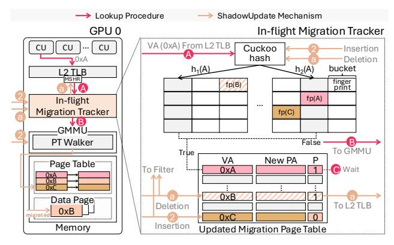

Fig. 12: Detailed operations of IfMT in ShadowUpdate.

the request is confirmed to target a non-migrating page. In this case, the request bypasses the UMPT and proceeds directly to the GMMU for a page table walk (B). However, if the Cuckoo filter returns a true result (i.e., the fingerprint for 0xA exists), the UMPT is then looked up to confirm whether the page is under migration. In this case, the IfMT marks the request with a P bit and holds the translation (C). This prevents access to an incomplete page mapping and allows it to return directly to the L2 TLB once migration completes.

Insertion: In ShadowUpdate, the updated mapping information is broadcast alongside the invalidation signal, simultaneously updating all GPU local page tables and informing the IfMT that the corresponding page is now in-flight. Upon receiving the updated mapping, the IfMT inserts the VA-to-PA mapping into the UMPT and adds the corresponding fingerprint to the Cuckoo filter (2). These operations are performed as part of the second step of the ShadowUpdate process. However, if the UMPT becomes full, the migration process is paused until an entry is freed. Once an entry becomes available, the migration process resumes. Therefore, the number of UMPT entries is a key design parameter, and we analyze the optimal number of entries in Section VI-D.

**Deletion:** Once a page copy completes, the ShadowUpdate mechanism initiates a cleanup process to remove the corresponding tracking entry. For example, when the copy of page 0xB finishes, the GPU copy engine broadcasts a completion signal to all GPUs indicating that the migration of page 0xB is done. Upon receiving this signal, each GPU updates its IfMT. The Cuckoo filter deletes the fingerprint associated with page 0xB, ensuring that subsequent translation requests are no longer filtered as an in-flight page. At the same time, the entry in the UMPT corresponding to 0xB is evicted, indicating that this page is no longer under migration and that future requests can proceed with normal page table walks. If the evicted UMPT entry has its pending bit set, the stored new PA is returned to the L2 TLB MSHR, allowing the translation to complete without replaying an additional page table walk (1). This not only reduces redundant translation overhead but also ensures fast recovery for threads that were stalled due to pending address translations.

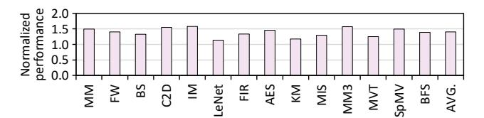

Fig. 13: Overall performance of ShadowUpdate.

#### VI. EVALUATION

In this section, we evaluate the proposed ShadowUpdate using MGPUSim [67] and provide a comprehensive analysis.

## A. Overall Performance

Figure 13 presents the normalized performance of the proposed ShadowUpdate across various workloads listed in Table II, with all results normalized to the baseline GPU page migration handling mechanism under access counterbased migration policy. On average, ShadowUpdate achieves a 40.15% performance improvement, demonstrating consistent benefits across various benchmarks. This improvement comes from ShadowUpdate's ability to eliminate unnecessary refaults and reduce migration latency by piggybacking updated PTEs onto the invalidation signals. ShadowUpdate merges the invalidation and mapping steps, allowing the updated mapping to be propagated early while maintaining correctness using IfMT. This design reduces page faults and enables address translation to be handled entirely within the GPU. Furthermore, ShadowUpdate reduces overall migration handling latency, especially considering the breakdown shown in Figure 9, where the mapping phase accounts for a significant portion of the migration. By overlapping the mapping step with the invalidation phase, ShadowUpdate hides this latency and reduces stall time for threads waiting on migrated pages.

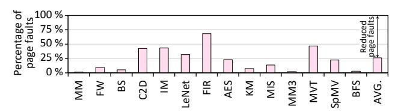

Fig. 14: The number of page faults normalized to the baseline.

To further evaluate ShadowUpdate in mitigating re-faults, Figure 14 presents the number of page faults under ShadowUpdate, normalized to the baseline migration mechanism. ShadowUpdate reduces total page faults by 73.83% on average by propagating updated PTEs to all GPUs during invalidation. The benefits of ShadowUpdate are especially pronounced in workloads with high inter-GPU page sharing and frequent migrations. For instance, in graph analytics workloads such as BFS and MIS, where multiple threads on different GPUs repeatedly access common data structures like adjacency lists, the baseline mechanism invalidates useful translations, triggering re-faults. ShadowUpdate avoids this by ensuring all sharers receive the correct mapping upon migration. Overall, these results show that ShadowUpdate installs updated mappings

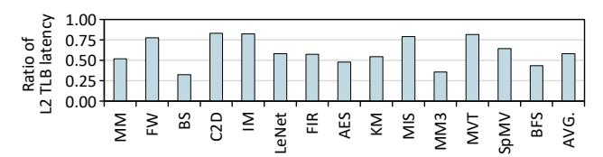

Fig. 15: Normalized L2 TLB miss latency of ShadowUpdate.

across all GPUs during invalidations, which keeps mappings available and reduces re-faults in multi-GPU systems.

To better understand the latency benefits of ShadowUpdate beyond page fault reduction, Figure 15 shows the normalized L2 TLB miss latency compared to the baseline. On average, ShadowUpdate reduces L2 TLB miss latency by 41.92%, demonstrating its effectiveness in lowering address translation latency. Because it reduces page faults and serves more translation requests within the GPU, L2 TLB misses are handled more quickly. In addition, ShadowUpdate avoids extra page table walks for mapping propagation, preventing further contention in the GMMU. As a result, updated mappings can be served locally within the GPU, shortening the TLB miss handling path. Notably, MM, BS, MM3, and BFS show more than 50% reduction in L2 TLB miss latency. As shown in Figure 14, these workloads also experience substantial page fault reduction and are highly sensitive to translation latency due to frequent shared page accesses across GPUs. Overall, faster translation resolution leads to higher thread progress and improved system throughput.

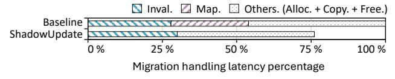

Fig. 16: Migration handling latency in ShadowUpdate.

Figure 16 shows the migration handling latency breakdown of ShadowUpdate, normalized to the baseline. By piggybacking mapping propagation onto the invalidation broadcast, ShadowUpdate effectively performs mapping updates during the invalidation phase. This increases the invalidation cost by 3.23 percentage points due to the larger payload and additional GPU-to-GPU signaling required to manage the IfMT. Despite this overhead, ShadowUpdate eliminates the mapping update phase, which accounts for 26.02% of the baseline latency, and reduces the overall migration handling latency by 22.79%.

## B. Area and Power Overhead

We evaluate the area and power overhead of ShadowUpdate. The Cuckoo filter in IfMT consists of 64 buckets, each with four slots. With each fingerprint being 11 bits, the total size is 352 bytes (11 bits  $\times$  256 / 8). We estimate the area and power of the Cuckoo filter using Synopsys Design Compiler with the FreePDK 45nm library [66]. The results show that the Cuckoo filter requires an additional area of  $0.0243mm^2$  and increases power consumption by 1.5852mW. The UMPT in IfMT has 256 entries. Each entry consists of a 36-bit virtual

page number field, a 40-bit physical page number field, and a 1-bit pending field. The total size of UMPT is 2464 bytes (77 bits  $\times$  256 / 8). We also evaluate the area and power overhead using CACTI 7.0 with 22nm technology [10]. The results show an area overhead of  $0.8171mm^2$  and a power consumption of 81.35mW. For comparison, the area of the AMD Fiji GPU with GCN3 architecture [65], [70], is 596 mm² at 28nm. When translated to 28nm, the Cuckoo filter and UMPT occupy only 0.0016% and 0.2221% of the total area, respectively, representing a small area overhead.

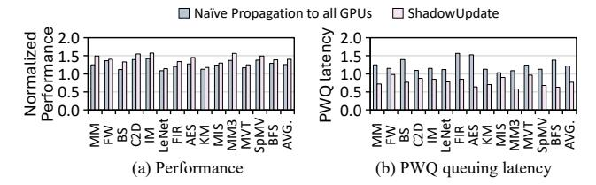

Fig. 17: Comparison of naive mapping propagation and ShadowUpdate.

#### C. Comparison with Naive Mapping Propagation

We compare ShadowUpdate with naive mapping propagation to separate the benefit of re-fault elimination from the benefit of optimized mapping propagation. Naive propagation broadcasts the updated mapping to all GPUs after page copy, thereby eliminating re-faults similarly to ShadowUpdate. However, it installs the updated mappings through additional page table walks and does not overlap the mapping update with the invalidation phase. As a result, naive propagation removes refaults, but cannot reduce migration handling latency or page walk contention. Figure 17(a) shows that naive propagation improves performance by 1.26× on average over the baseline, confirming that eliminating re-faults provides substantial benefit. However, ShadowUpdate achieves a higher average speedup of 1.40× by also reducing the cost of mapping propagation. This additional gain comes from hiding the mapping update within the invalidation phase and avoiding the extra page table walks required by naive propagation.

Figure 17(b) further shows that naive propagation increases GMMU PWQ queuing latency by  $1.25\times$  on average because each migration injects additional PTW requests on all GPUs. In contrast, ShadowUpdate lowers PWQ queuing latency to  $0.76\times$  of the baseline by piggybacking updated mappings on invalidation requests, which already traverse the page tables for translation coherence. This lower queuing latency contributes to the additional performance gain of ShadowUpdate over naive propagation. Overall, these results show that refault elimination alone is not sufficient because the overhead of mapping propagation can offset part of its benefit. ShadowUpdate avoids this overhead by eliminating re-faults while also reducing migration handling latency and GMMU contention.

## D. Sensitivity Study

**Page Table Walkers:** Figure 18 shows the performance of ShadowUpdate under increasing numbers of PTWs in the

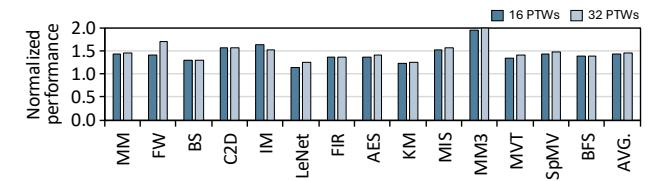

Fig. 18: ShadowUpdate with various number of PTWs.

GMMU, normalized to the baseline for each PTW configuration. ShadowUpdate achieves  $1.42\times$  and  $1.46\times$  performance improvement with 16 and 32 PTWs, respectively. ShadowUpdate mitigates host-side translation overhead by eliminating page faults, whereas increasing the number of PTWs in the GMMU reduces GPU-side translation contention. Therefore, when more PTWs are available, GPU-side overhead is alleviated, making the host-side overhead from page faults more dominant. As a result, the benefits of ShadowUpdate become more pronounced under configurations with increased PTWs.

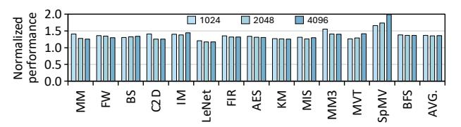

Fig. 19: Normalized performance with various L2 TLB entries.

**L2 TLB Entries:** Figure 19 shows the normalized performance improvement of ShadowUpdate across different L2 TLB sizes, where each bar is normalized to its corresponding baseline with the same L2 TLB entry count. Overall, ShadowUpdate remains effective even with a larger L2 TLB. Increasing L2 TLB capacity can reduce capacity misses and keep translations resident longer, so the baseline translation overhead may change in a workload-dependent manner. For some workloads, a larger TLB reduces PTW pressure and thus narrows the performance gap. For others, it changes the balance of translation and migration costs, slightly increasing the relative benefit of eliminating re-faults. Importantly, during page migration, TLB shootdowns invalidate the translations for the migrated pages to maintain translation coherence. Therefore, for migrated pages, a larger L2 TLB provides little to no benefit under the baseline, because their mappings are explicitly invalidated and subsequent accesses can still trigger re-faults. Since ShadowUpdate targets these migrationinduced page faults and shortens the migration process itself, it continues to provide consistent benefits even when L2 TLB entries are large.

**UMPT Entries:** Figure 20 shows the performance trend as the number of UMPT entries varies. When the number of UMPT entries is small, the migration process slows down because it must wait for an entry to become available during migration handling. As the number of entries increases, the UMPT shortages decrease, but a larger table increases the lookup latency. Overall, performance degradation due to entry

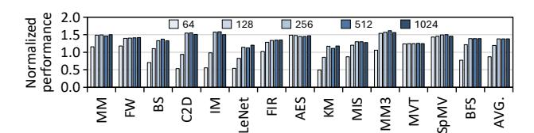

Fig. 20: Normalized performance with various UMPT entries.

shortages dominates. With 64 and 128 entries, the average performance improvement is limited  $(0.87 \times \text{ and } 1.19 \times, \text{ respectively})$ . In contrast, performance improves significantly once the number of entries reaches 256, indicating that entry shortages are mostly resolved. Beyond this point, performance saturates, showing negligible gains with larger configurations. Therefore, 256 entries provide the most efficient balance with only minor area overhead.

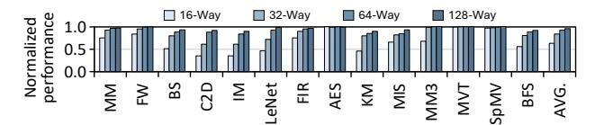

Fig. 21: ShadowUpdate with various UMPT associativities.

**UMPT** Associativity: The UMPT tracks in-flight migrating pages to ensure correctness by blocking translations until copy completion. If a migrating page cannot be inserted into the UMPT, the migration process must stall until an entry becomes available. With a set-associative UMPT, each migrating page is assigned to a set based on its virtual address index bits, and it can occupy only one of the limited ways within that set. When the target set becomes full, the insertion fails due to a conflict, even if other sets still have free entries. Unlike conventional caches, UMPT entries cannot be evicted to resolve such conflicts because they must be retained until migration completes. Therefore, maximizing effective capacity by avoiding conflictinduced failures is critical. We mitigate lookup cost using the Cuckoo filter, making capacity the primary design objective. Figure 21 shows normalized performance for different UMPT associativities, normalized to the fully associative UMPT. All configurations use the same lookup logic with eight parallel comparators. As associativity decreases, performance degrades because conflict-induced insertion failures reduce the effective number of trackable in-flight migrations, increasing stall time. The 16-way design drops to  $0.63\times$  of the fully associative UMPT. These results motivate our fully associative UMPT design, which best utilizes the available entries and avoids conflict-related stalls.

Number of GPUs: To further evaluate ShadowUpdate in large-scale systems, we scale the system from 8 to 32 GPUs. Figure 22 shows the normalized performance of ShadowUpdate for each GPU configuration, where each bar is normalized to the corresponding baseline at the same GPU count. ShadowUpdate delivers consistent and generally increasing benefits as the number of GPUs grows, reaching a speedup of  $1.57\times$  with 32 GPUs. As the GPU count increases, page sharing across GPUs typically becomes more pronounced,

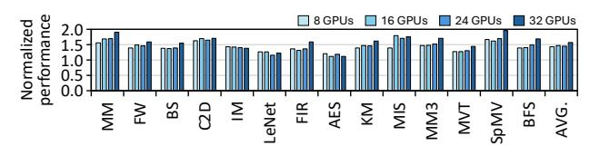

Fig. 22: Normalized performance with a large number of GPUs.

increasing the likelihood of re-faults after migration under the baseline UVM policy. In addition, larger systems intensify host-side address translation pressure, increasing contention in the IOMMU and related software control paths. By proactively propagating updated mappings and eliminating re-faults, ShadowUpdate reduces translation pressure and alleviates this contention, leading to larger performance gains at scale.

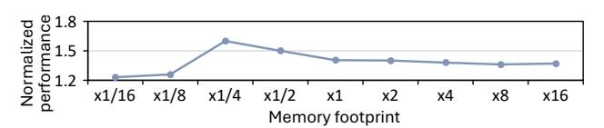

Fig. 23: ShadowUpdate with various memory footprints.

Large Memory Footprint: To evaluate whether ShadowUpdate remains effective across different memory footprints, Figure 23 shows the average speedup as we scale the memory footprint of each benchmark from one sixteenth to sixteen times its default size, normalized to the baseline at the same footprint. For 4, 8, and 16 times scaling, some workloads generate extremely long instruction streams, so we cap the instruction count and focus on overall trends. At  $\times 1/16$  and  $\times$ 1/8, the working set is too small to induce frequent page migrations and re-faults, so ShadowUpdate delivers smaller gains of  $1.23 \times$  and  $1.26 \times$ . As the footprint increases to  $\times 1/4$ and  $\times 1/2$ , migrations and re-faults account for a larger share of execution time, leading to larger improvements. Beyond the default footprint, the speedups remain stable up to  $\times 16$ . Even at  $\times 16$ , where some workloads reach gigabyte scale footprints, ShadowUpdate achieves a  $1.36\times$  speedup, close to  $1.40\times$ at the default size, indicating that ShadowUpdate remains effective at large footprints and that the default footprint is representative of multi-GPU UVM behavior.

## E. ShadowUpdate with Large Pages

We evaluate ShadowUpdate with 2MB large pages, as shown in Figure 24. We also increased the benchmark size and access counter threshold to ensure a fair experiment. ShadowUpdate achieves a 1.38× performance improvement with 2MB large pages. While large pages increase TLB reach, re-faults due to invalidations remain because page migrations still occur. Large pages can increase page sharing, potentially causing more frequent page migrations. However, the access counter threshold is also raised to match the larger page size. This prevents a severe increase in migrations, resulting in a similar performance improvement. Additionally, while

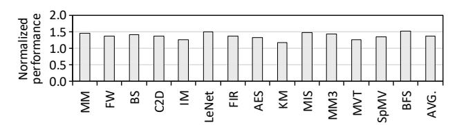

Fig. 24: Normalized performance with 2MB large pages.

ShadowUpdate accelerates the migration handling process by hiding the mapping update phase, the longer copy latency in 2MB large pages reduces this benefit. Therefore, reducing re-faults in large pages is the major factor for performance improvement.

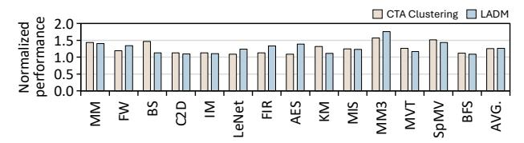

Fig. 25: Normalized performance of ShadowUpdate with other CTA scheduling schemes [32], [37].

## F. ShadowUpdate with Other CTA Scheduling Policies

Figure 25 shows ShadowUpdate's performance under two other CTA scheduling schemes [32], [37]. Each bar is normalized to its corresponding baseline that uses the same scheduling scheme. CTA Clustering [37] groups adjacent CTAs and co-schedules them on the same CU, improving locality and increasing L1 cache hits. This reduces remote accesses and can lower migration frequency, leaving less headroom for ShadowUpdate. However, clustering is limited by load-balance and utilization constraints and cannot eliminate remote accesses and migrations entirely. As a result, ShadowUpdate remains effective and achieves a 1.24× average speedup. LADM [32] analyzes access patterns to co-optimize threadblock placement and data placement, increasing local accesses and reducing remote traffic. While this can also reduce migrations, shared pages and dynamic access patterns still trigger migrations and translation-coherence events, so re-fault and mapping-propagation overheads remain in the baseline. Therefore, ShadowUpdate continues to provide benefits under LADM, delivering a 1.26× average speedup.

## G. Comparison with State-of-the-art Works

As shown in Figure 26, we compare ShadowUpdate against state-of-the-art multi-GPU optimizations under an access counter-based migration policy, including Trans-FW [41] and IDYLL [38], with results normalized to Trans-FW. Trans-FW handles page faults by offloading host MMU handling to remote GMMUs, which reduces host MMU contention. However, it does not reduce the number of page faults and can introduce additional contention at remote GMMUs. In contrast, ShadowUpdate eliminates re-faults, substantially

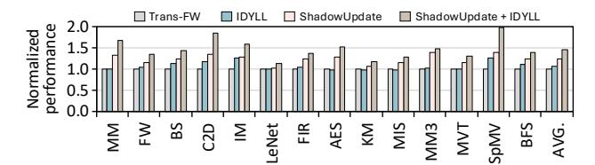

Fig. 26: Comparison with Trans-FW [41] and IDYLL [38].

reducing the number of host page walk requests as shown in Figure 14, and preventing host-side MMU contention. Moreover, ShadowUpdate piggybacks mapping updates on existing broadcasts, which avoids extra PTW requests and can even reduce GMMU contention. As a result, ShadowUpdate achieves a 1.22× performance improvement over Trans-FW.

IDYLL reduces GMMU contention by sending invalidation requests only to the required GPUs and using lazy invalidation to avoid unnecessary page table walks. However, IDYLL primarily mitigates GPU-side translation overhead, whereas ShadowUpdate targets host-side overhead caused by re-faults. Since page faults handled outside the GPU have a larger performance impact than PWQ latency from GMMU contention as shown in Figure 5, ShadowUpdate provides larger benefits. In addition, ShadowUpdate can also reduce GMMU contention by updating mappings together with invalidation broadcasts, and it accelerates the migration process itself. Consequently, ShadowUpdate achieves a 1.16× speedup over IDYLL. Moreover, ShadowUpdate and IDYLL are complementary, combining them yields a 1.36× speedup over IDYLL alone and a 1.18× speedup over ShadowUpdate alone, because IDYLL reduces unnecessary in-GPU page table walks while ShadowUpdate minimizes host-served page faults and hides the mapping phase during migration handling.

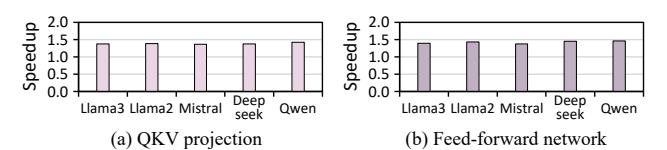

Fig. 27: ShadowUpdate with LLM models.

## H. Large Language Model

To evaluate whether ShadowUpdate remains effective for LLM workloads, we construct micro kernels for the QKV projection and FFN modules using representative models, including Llama3-8B [25], Llama2-7B [71], Mistral-7B-v0.3 [30], Deepseek-llm-7b-chat [14], and Qwen-14B [9]. The core computation of GEMM is implemented by an output tiled kernel that tiles the output matrix along the M and N dimensions and iterates over K, following the common structure used in cuBLAS. To reflect multi-GPU execution, we apply columnwise tensor parallelism by partitioning the weight matrices along the output dimension across GPUs. Figure 27(a) shows that ShadowUpdate consistently improves the performance of QKV projection across models, achieving an average speedup

of 1.37×. Figure 27(b) shows similar benefits for FFN, with an average speedup of 1.42× across models. These consistent gains arise because both QKV projection and FFN are dominated by GEMMs, and under tiled execution with an identical job distribution policy, they exhibit similar pagelevel UVM behavior. As a result, the underlying migration and re-fault patterns remain comparable across models, allowing ShadowUpdate to deliver stable improvements in various LLM models.

TABLE III: Comparison with prior techniques.

| Techniques                                  | Reduce Re-faults | Reduce Migration time | Reduce Host MMU Latency | Reduce PTW Requests | Multi- GPU |
|---------------------------------------------|---------------------|--------------------------|----------------------------|------------------------|---------------|
| TLB optimizations [12], [28], [36]          | X                   | X                        | <b>✓</b>                   | ✓                      | X             |
| [8], [42], [53], [58], [59], [72], [78]     |                     |                          |                            |                        |               |
| Page management [7], [11], [74], [75], [79] | X                   | X                        | <b>✓</b>                   | Х                      | <b>/</b>      |
| MMU acceleration [41]                       | Х                   | X                        | <b>/</b>                   | Х                      | <b>/</b>      |
| Invalidation optimization [38]              | X                   | X                        | Х                          | ✓                      | /             |
| ShadowUpdate (Our approach)                 | /                   | <b>/</b>                 | <b>/</b>                   | <b>✓</b>               | /             |

#### VII. RELATED WORK

Address Translation Optimizations: Prior work has explored many GPU address translation optimizations in both the TLB [8], [12], [20], [28], [29], [36], [40], [42], [53], [58], [59], [69], [72], [78] and MMU [34], [35], [38], [41], [43], [54], [55], [63]. These efforts improve translation efficiency by extending TLB reach, optimizing page table walks, or improving scheduling of translation requests. Prior studies proposed variable-sized page grouping, translation-aware scheduling, large hardware-managed TLB structures, neighborhood-aware page walks, and dynamic page walker sharing across tenants [28], [36], [39], [60], [64].

NUMA and Multi-GPU Memory Management: Optimizations for NUMA systems and multi-GPU memory management have been proposed to improve data locality and reduce remote accesses [7], [11], [13], [32], [45], [61], [75], [79]. Wang et al. [74] proposed a fine-grained dynamic page placement mechanism to reduce NUMA overhead in multi-GPU systems. Milic et al. [44] introduced a NUMA-aware multi-socket GPU architecture that mitigates NUMA effects through dynamic interconnect bandwidth allocation.

Unlike prior techniques, ShadowUpdate addresses redundant re-faults in multi-GPU systems by redesigning how updated mappings are propagated during migration. As summarized in Table III, prior TLB optimization and MMU acceleration techniques mainly reduce host MMU latency and page table walk requests by improving translation efficiency, but they do not address re-faults or migration time. Prior page management schemes improve locality and reduce remote accesses in multi-GPU systems, yet they do not eliminate re-faults caused by invalidation after migration. Invalidation optimization is the closest to our work because it leverages the invalidation process and targets multi-GPU systems, but it still does not reduce re-faults or shorten migration time. In contrast, ShadowUpdate directly targets the migration handling path and simultaneously reduces re-faults, migration time, host MMU latency, and page table walk requests by propagating updated mappings during invalidation.

## VIII. CONCLUSION

This paper identifies re-faults, page faults caused by incomplete mapping updates during access counter-based migration, as a major bottleneck in multi-GPU systems. We show that efficiently broadcasting updated mappings is challenging and that naive approaches introduce additional page table walks and contention. To address this, we propose ShadowUpdate, which proactively installs updated mappings by piggybacking them on invalidation messages. ShadowUpdate employs a lightweight hardware IfMT to preserve correctness and handle in-flight pages. By overlapping mapping updates with invalidation, ShadowUpdate eliminates re-faults and accelerates migration completion. Across 14 applications from diverse multi-GPU benchmark suites, including AMD APP SDK [5], DNN-MARK [19], HETERO [68], PANNOTIA [15], POLYBENCH [80], and SHOC [18], ShadowUpdate improves performance by 1.40× on average compared to the baseline UVM design, demonstrating substantial reductions in page faults and improved scalability. Furthermore, ShadowUpdate complements existing optimizations and provides a practical path toward more efficient UVM in future multi-GPU systems.

## IX. ACKNOWLEDGEMENTS

This work was supported by Institute of Information & communication Technology Planning & Evaluation (IITP) grant funded by the Korea government (MSIT) (No. 2025-0-00441, Memory-Centric Architecture Using the Reconfigurable PIM Devices), and by the Global Research Cluster program and a research grant from Samsung Advanced Institute of Technology (SAIT). Won Woo Ro is the corresponding author.

## REFERENCES

- [1] T. Allen, B. Cooper, and R. Ge, "Fine-grain quantitative analysis of demand paging in unified virtual memory," *ACM Trans. Archit. Code Optim.*, vol. 21, no. 1, Jan. 2024. [Online]. Available: https://doi.org/10.1145/3632953
- [2] T. Allen and R. Ge, "Demystifying gpu uvm cost with deep runtime and workload analysis," in *2021 IEEE International Parallel and Distributed Processing Symposium (IPDPS)*. IEEE, 2021, pp. 141–150.
- [3] ——, "In-depth analyses of unified virtual memory system for gpu accelerated computing," in *Proceedings of the International Conference for High Performance Computing, Networking, Storage and Analysis*, ser. SC '21. New York, NY, USA: Association for Computing Machinery, 2021. [Online]. Available: https://doi.org/10.1145/3458817. 3480855
- [4] AMD, "AMD GRAPHICS CORES NEXT (GCN) ARCHITECTURE," 2012, https://www.techpowerup.com/gpu-specs/docs/amd-gcn1 architecture.pdf.
- [5] ——, "AMD APP SDK OpenCL Optimization Guide." 2015, https://www.amd.com/content/dam/amd/en/documents/radeontech-docs/programmer-references/AMD OpenCL Programming Optimization Guide2.pdf.
- [6] N. Amit, "Optimizing the TLB shootdown algorithm with page access tracking," in *2017 USENIX Annual Technical Conference (USENIX ATC 17)*. Santa Clara, CA: USENIX Association, Jul. 2017, pp. 27–39. [Online]. Available: https://www.usenix.org/conference/atc17/technicalsessions/presentation/amit
- [7] A. Arunkumar, E. Bolotin, B. Cho, U. Milic, E. Ebrahimi, O. Villa, A. Jaleel, C.-J. Wu, and D. Nellans, "Mcm-gpu: Multi-chip-module gpus for continued performance scalability," *ACM SIGARCH Computer Architecture News*, vol. 45, no. 2, pp. 320–332, 2017.

- [8] R. Ausavarungnirun, J. Landgraf, V. Miller, S. Ghose, J. Gandhi, C. J. Rossbach, and O. Mutlu, "Mosaic: a gpu memory manager with application-transparent support for multiple page sizes," in *Proceedings of the 50th Annual IEEE/ACM International Symposium on Microarchitecture*, 2017, pp. 136–150.
- [9] J. Bai, S. Bai, Y. Chu, Z. Cui, K. Dang, X. Deng, Y. Fan, W. Ge, Y. Han, F. Huang *et al.*, "Qwen technical report," *arXiv preprint arXiv:2309.16609*, 2023.
- [10] R. Balasubramonian, A. B. Kahng, N. Muralimanohar, A. Shafiee, and V. Srinivas, "Cacti 7: New tools for interconnect exploration in innovative off-chip memories," *ACM Trans. Archit. Code Optim.*, vol. 14, no. 2, Jun. 2017. [Online]. Available: https://doi.org/10.1145/3085572
- [11] T. Baruah, Y. Sun, A. T. Dinc¸er, S. A. Mojumder, J. L. Abellan, ´ Y. Ukidave, A. Joshi, N. Rubin, J. Kim, and D. Kaeli, "Griffin: Hardware-software support for efficient page migration in multi-gpu systems," in *2020 IEEE International Symposium on High Performance Computer Architecture (HPCA)*, 2020, pp. 596–609.
- [12] T. Baruah, Y. Sun, S. A. Mojumder, J. L. Abellan, Y. Ukidave, A. Joshi, ´ N. Rubin, J. Kim, and D. Kaeli, "Valkyrie: Leveraging inter-tlb locality to enhance gpu performance," in *Proceedings of the ACM International Conference on Parallel Architectures and Compilation Techniques*, 2020, pp. 455–466.
- [13] L. Belayneh, H. Ye, K.-Y. Chen, D. Blaauw, T. Mudge, R. Dreslinski, and N. Talati, "Locality-aware optimizations for improving remote memory latency in multi-gpu systems," in *Proceedings of the International Conference on Parallel Architectures and Compilation Techniques*, 2022, pp. 304–316.
- [14] X. Bi, D. Chen, G. Chen, S. Chen, D. Dai, C. Deng, H. Ding, K. Dong, Q. Du, Z. Fu *et al.*, "Deepseek llm: Scaling open-source language models with longtermism," *arXiv preprint arXiv:2401.02954*, 2024.
- [15] S. Che, B. M. Beckmann, S. K. Reinhardt, and K. Skadron, "Pannotia: Understanding irregular gpgpu graph applications," in *2013 IEEE International Symposium on Workload Characterization (IISWC)*. IEEE, 2013, pp. 185–195.
- [16] S. Chien, I. Peng, and S. Markidis, "Performance evaluation of advanced features in cuda unified memory," in *2019 IEEE/ACM Workshop on Memory Centric High Performance Computing (MCHPC)*, 2019, pp. 50–57.
- [17] Y. Collet, "xxhash extremely fast hash algorithm," https://xxhash.com/.
- [18] A. Danalis, G. Marin, C. McCurdy, J. S. Meredith, P. C. Roth, K. Spafford, V. Tipparaju, and J. S. Vetter, "The scalable heterogeneous computing (shoc) benchmark suite," in *Proceedings of the 3rd workshop on general-purpose computation on graphics processing units*, 2010, pp. 63–74.
- [19] S. Dong and D. Kaeli, "Dnnmark: A deep neural network benchmark suite for gpus," in *Proceedings of the General Purpose GPUs*, ser. GPGPU-10. New York, NY, USA: Association for Computing Machinery, 2017, p. 63–72. [Online]. Available: https: //doi.org/10.1145/3038228.3038239
- [20] Y. Du, M. Liu, Y. Yang, M. Zhang, and X. Tang, "Enhancing gpu performance via neighboring directory table based inter-tlb sharing," in *2022 IEEE 40th International Conference on Computer Design (ICCD)*, 2022, pp. 146–153.
- [21] A. Eklund, P. Dufort, D. Forsberg, and S. M. LaConte, "Medical image processing on the gpu–past, present and future," *Medical image analysis*, vol. 17, no. 8, pp. 1073–1094, 2013.
- [22] B. Fan, D. G. Andersen, M. Kaminsky, and M. D. Mitzenmacher, "Cuckoo filter: Practically better than bloom," in *Proceedings of the 10th ACM International on Conference on Emerging Networking Experiments and Technologies*, ser. CoNEXT '14. New York, NY, USA: Association for Computing Machinery, 2014, p. 75–88. [Online]. Available: https://doi.org/10.1145/2674005.2674994
- [23] D. Foley and J. Danskin, "Ultra-performance pascal gpu and nvlink interconnect," *IEEE Micro*, vol. 37, no. 2, pp. 7–17, 2017.
- [24] D. Ganguly, Z. Zhang, J. Yang, and R. Melhem, "Interplay between hardware prefetcher and page eviction policy in cpu-gpu unified virtual memory," in *Proceedings of the 46th International Symposium on Computer Architecture*, ser. ISCA '19. New York, NY, USA: Association for Computing Machinery, 2019, p. 224–235. [Online]. Available: https://doi.org/10.1145/3307650.3322224
- [25] A. Grattafiori, A. Dubey, A. Jauhri, A. Pandey, A. Kadian, A. Al-Dahle, A. Letman, A. Mathur, A. Schelten, A. Vaughan *et al.*, "The llama 3 herd of models," *arXiv preprint arXiv:2407.21783*, 2024.

- [26] T. D. Hartley, U. Catalyurek, A. Ruiz, F. Igual, R. Mayo, and M. Ujaldon, "Biomedical image analysis on a cooperative cluster of gpus and multicores," in *ACM International Conference on Supercomputing 25th Anniversary Volume*, 2008, pp. 413–423.
- [27] B. Hyun, Y. Kwon, Y. Choi, J. Kim, and M. Rhu, "Neummu: Architectural support for efficient address translations in neural processing units," in *Proceedings of the Twenty-Fifth International Conference on Architectural Support for Programming Languages and Operating Systems*, ser. ASPLOS '20. New York, NY, USA: Association for Computing Machinery, 2020, p. 1109–1124. [Online]. Available: https://doi.org/10.1145/3373376.3378494
- [28] A. Jaleel, E. Ebrahimi, and S. Duncan, "Ducati: High-performance address translation by extending tlb reach of gpu-accelerated systems," *ACM Transactions on Architecture and Code Optimization (TACO)*, vol. 16, no. 1, pp. 1–24, 2019.
- [29] S. Jang, J. Park, O. Kwon, Y. Lee, and S. Hong, "Rethinking page table structure for fast address translation in gpus: A fixed-size hashed page table," in *Proceedings of the 2024 International Conference on Parallel Architectures and Compilation Techniques*, ser. PACT '24. New York, NY, USA: Association for Computing Machinery, 2024, p. 325–337. [Online]. Available: https://doi.org/10.1145/3656019.3676900
- [30] A. Q. Jiang, A. Sablayrolles, A. Mensch, C. Bamford, D. S. Chaplot, D. de las Casas, F. Bressand, G. Lengyel, G. Lample, L. Saulnier, L. R. Lavaud, M.-A. Lachaux, P. Stock, T. L. Scao, T. Lavril, T. Wang, T. Lacroix, and W. E. Sayed, "Mistral 7b," 2023. [Online]. Available: https://arxiv.org/abs/2310.06825
- [31] John Hubbard and Jerome Glisse, "GPUs: HMM: Heterogeneous Memory Management," pp. 1–26, May. 2017, [Online], Available: https://www.redhat.com/files/summit/session-assets/2017/S104078 hubbard.pdf.
- [32] M. Khairy, V. Nikiforov, D. Nellans, and T. G. Rogers, "Localitycentric data and threadblock management for massive gpus," in *2020 53rd Annual IEEE/ACM International Symposium on Microarchitecture (MICRO)*. IEEE, 2020, pp. 1022–1036.
- [33] H. Kim, J. Sim, P. Gera, R. Hadidi, and H. Kim, "Batch-Aware Unified Memory Management in GPUs for Irregular Workloads," in *Proceedings of the Twenty-Fifth International Conference on Architectural Support for Programming Languages and Operating Systems*, March. 2020, pp. 1357–1370.
- [34] O. Kwon, Y. Lee, J. Park, S. Jang, B. Tak, and S. Hong, "Distributed page table: Harnessing physical memory as an unbounded hashed page table," in *2024 57th IEEE/ACM International Symposium on Microarchitecture (MICRO)*, 2024, pp. 36–49.
- [35] J. Lee, G. Ko, M. K. Yoon, I. Jeong, Y. Oh, and W. W. Ro, "Marching page walks: Batching and concurrent page table walks for enhancing gpu throughput," in *2025 IEEE International Symposium on High Performance Computer Architecture (HPCA)*, 2025, pp. 1662–1677.
- [36] J. Lee, J. M. Lee, Y. Oh, W. J. Song, and W. W. Ro, "Snakebyte: A tlb design with adaptive and recursive page merging in gpus," in *2023 IEEE International Symposium on High-Performance Computer Architecture (HPCA)*. IEEE, 2023, pp. 1195–1207.
- [37] A. Li, S. L. Song, W. Liu, X. Liu, A. Kumar, and H. Corporaal, "Locality-aware cta clustering for modern gpus," *ACM SIGARCH Computer Architecture News*, vol. 45, no. 1, pp. 297–311, 2017.
- [38] B. Li, Y. Guo, Y. Wang, A. Jaleel, J. Yang, and X. Tang, "Idyll: Enhancing page translation in multi-gpus via light weight pte invalidations," in *2023 56th IEEE/ACM International Symposium on Microarchitecture (MICRO)*, 2023, pp. 1163–1177.
- [39] B. Li, Y. Wang, and X. Tang, "Orchestrated scheduling and partitioning for improved address translation in gpus," in *2023 60th ACM/IEEE Design Automation Conference (DAC)*. IEEE, 2023, pp. 1–6.
- [40] B. Li, Y. Wang, T. Wang, L. Eeckhout, J. Yang, A. Jaleel, and X. Tang, "Star: Sub-entry sharing-aware tlb for multi-instance gpu," in *2024 57th IEEE/ACM International Symposium on Microarchitecture (MICRO)*, 2024, pp. 309–323.
- [41] B. Li, J. Yin, A. Holey, Y. Zhang, J. Yang, and X. Tang, "Trans-fw: Short circuiting page table walk in multi-gpu systems via remote forwarding," in *2023 IEEE International Symposium on High-Performance Computer Architecture (HPCA)*, 2023, pp. 456–470.
- [42] B. Li, J. Yin, Y. Zhang, and X. Tang, "Improving address translation in multi-gpus via sharing and spilling aware tlb design," in *MICRO-54: 54th Annual IEEE/ACM International Symposium on Microarchitecture*, 2021, pp. 1154–1168.

- [43] A. Margaritov, D. Ustiugov, E. Bugnion, and B. Grot, "Prefetched address translation," in *Proceedings of the 52nd Annual IEEE/ACM International Symposium on Microarchitecture*, 2019, pp. 1023–1036.
- [44] U. Milic, O. Villa, E. Bolotin, A. Arunkumar, E. Ebrahimi, A. Jaleel, A. Ramirez, and D. Nellans, "Beyond the socket: Numa-aware gpus," in *Proceedings of the 50th Annual IEEE/ACM International Symposium on Microarchitecture*, 2017, pp. 123–135.
- [45] H. Muthukrishnan, D. Lustig, D. Nellans, and T. Wenisch, "Gps: A global publish-subscribe model for multi-gpu memory management," in *MICRO-54: 54th Annual IEEE/ACM International Symposium on Microarchitecture*, 2021, pp. 46–58.
- [46] N. Nazaraliyev, E. Sadredini, and N. Abu-Ghazaleh, "Gpuvm: Gpu-driven unified virtual memory," 2024. [Online]. Available: https://arxiv.org/abs/2411.05309
- [47] Nikolay Sakharnykh, "Everything You Need to Know about Unified Memory," pp. 1–86, March. 2018, [Online], Available: https://on-demand.gputechconf.com/gtc/2018/presentation/s8430 everything-you-need-to-know-about-unified-memory.pdf.
- [48] ——, "Memory management on modern gpu architectures," pp. 1–74, March. 2019, [Online], Available: https://developer.download. nvidia.com/video/gputechconf/gtc/2019/pre-sentation/s9727-memorymanagement-on-modern-gpu-architectures.pdf.
- [49] NVIDIA, "NVIDIA Tesla V100 GPU Architecture," pp. 1–58, 2017, [Online], Available: https://images.nvidia.com/content/voltaarchitecture/pdf/volta-architecture-whitepaper.pdf.
- [50] NVIDIA, "Nvidia dgx-2," 2019. [Online]. Available: https://www.nvidia.com/content/dam/en-zz/Solutions/Data-Center/ dgx-1/dgx-2-datasheet-us-nvidia-955420-r2-web-new.pdf
- [51] NVIDIA, "NVIDIA Linux Open GPU Kernel Module Source," https: //github.com/NVIDIA/open-gpu-kernel-modules, 2022, [Online].
- [52] NVIDIA Corporation, "Nvidia pascal architecture," https: //images.nvidia.com/content/pdf/tesla/whitepaper/pascal-architecturewhitepaper.pdf, April 2016, whitepaper.
- [53] C. H. Park, T. Heo, J. Jeong, and J. Huh, "Hybrid tlb coalescing: Improving tlb translation coverage under diverse fragmented memory allocations," in *Proceedings of the 44th Annual International Symposium on Computer Architecture*, 2017, pp. 444–456.
- [54] C. H. Park, I. Vougioukas, A. Sandberg, and D. Black-Schaffer, "Every walk's a hit: making page walks single-access cache hits," in *Proceedings of the 27th ACM International Conference on Architectural Support for Programming Languages and Operating Systems*, ser. ASPLOS '22. New York, NY, USA: Association for Computing Machinery, 2022, p. 128–141. [Online]. Available: https://doi.org/10.1145/3503222.3507718
- [55] J. Park, O. Kwon, Y. Lee, S. Kim, G. Byeon, J. Yoon, P. J. Nair, and S. Hong, "A case for speculative address translation with rapid validation for gpus," in *2024 57th IEEE/ACM International Symposium on Microarchitecture (MICRO)*. IEEE, 2024, pp. 278–292.
- [56] PCI-SIG, "Address Translation Services Revision 1.1," http://www. pcisig.com/specifications/iov/ats/, 2009.
- [57] ——, "PCI Express® Base Specification," https://pcisig.com/ specifications, 2023, accessed in 2023.
- [58] B. Pham, A. Bhattacharjee, Y. Eckert, and G. H. Loh, "Increasing tlb reach by exploiting clustering in page translations," in *2014 IEEE 20th International Symposium on High Performance Computer Architecture (HPCA)*. IEEE, 2014, pp. 558–567.
- [59] B. Pham, V. Vaidyanathan, A. Jaleel, and A. Bhattacharjee, "Colt: Coalesced large-reach tlbs," in *2012 45th Annual IEEE/ACM International Symposium on Microarchitecture*. IEEE, 2012, pp. 258–269.
- [60] B. Pratheek, N. Jawalkar, and A. Basu, "Improving gpu multi-tenancy with page walk stealing," in *2021 IEEE International Symposium on High-Performance Computer Architecture (HPCA)*, 2021, pp. 626–639.
- [61] ——, "Designing virtual memory system of mcm gpus," in *2022 55th IEEE/ACM International Symposium on Microarchitecture (MICRO)*. IEEE, 2022, pp. 404–422.
- [62] N. Sakharnykh, "Maximizing unified memory performance in cuda," https://developer.nvidia.com/blog/maximizing-unified-memoryperformance-cuda/, 2017, nVIDIA Developer Blog.
- [63] S. Shin, G. Cox, M. Oskin, G. H. Loh, Y. Solihin, A. Bhattacharjee, and A. Basu, "Scheduling page table walks for irregular gpu applications," in *2018 ACM/IEEE 45th Annual International Symposium on Computer Architecture (ISCA)*. IEEE, 2018, pp. 180–192.
- [64] S. Shin, M. LeBeane, Y. Solihin, and A. Basu, "Neighborhood-aware address translation for irregular gpu applications," in *2018 51st Annual*

- *IEEE/ACM International Symposium on Microarchitecture (MICRO)*, 2018, pp. 352–363.
- [65] R. Smith. (2015) The amd radeon r9 fury x review: Aiming for the top. Accessed: 2025-07-24. [Online]. Available: https: //www.anandtech.com/show/9390/the-amd-radeon-r9-fury-x-review
- [66] J. E. Stine, I. Castellanos, M. Wood, J. Henson, F. Love, W. R. Davis, P. D. Franzon, M. Bucher, S. Basavarajaiah, J. Oh, and R. Jenkal, "Freepdk: An open-source variation-aware design kit," in *2007 IEEE International Conference on Microelectronic Systems Education (MSE'07)*, 2007, pp. 173–174.
- [67] Y. Sun, T. Baruah, S. A. Mojumder, S. Dong, X. Gong, S. Treadway, Y. Bao, S. Hance, C. McCardwell, V. Zhao, H. Barclay, A. K. Ziabari, Z. Chen, R. Ubal, J. L. Abellan, J. Kim, A. Joshi, and ´ D. Kaeli, "Mgpusim: Enabling multi-gpu performance modeling and optimization," in *Proceedings of the 46th International Symposium on Computer Architecture*, ser. ISCA '19. New York, NY, USA: Association for Computing Machinery, 2019, p. 197–209. [Online]. Available: https://doi.org/10.1145/3307650.3322230
- [68] Y. Sun, X. Gong, A. K. Ziabari, L. Yu, X. Li, S. Mukherjee, C. Mc-Cardwell, A. Villegas, and D. Kaeli, "Hetero-mark, a benchmark suite for cpu-gpu collaborative computing," in *2016 IEEE International Symposium on Workload Characterization (IISWC)*. IEEE, 2016, pp. 1–10.
- [69] X. Tang, Z. Zhang, W. Xu, M. T. Kandemir, R. Melhem, and J. Yang, "Enhancing address translations in throughput processors via compression," in *Proceedings of the ACM International Conference on Parallel Architectures and Compilation Techniques*, 2020, pp. 191–204.
- [70] TechPowerUp, "Amd fiji gpu specs," 2015, accessed: 2025-07-24. [Online]. Available: https://www.techpowerup.com/gpu-specs/radeonr9-fury-x.c2677
- [71] H. Touvron, L. Martin, K. Stone, P. Albert, A. Almahairi, Y. Babaei, N. Bashlykov, S. Batra, P. Bhargava, S. Bhosale *et al.*, "Llama 2: Open foundation and fine-tuned chat models," *arXiv preprint arXiv:2307.09288*, 2023.
- [72] G. Vavouliotis, L. Alvarez, V. Karakostas, K. Nikas, N. Koziris, D. A. Jimenez, and M. Casas, "Exploiting page table locality for agile tlb ´ prefetching," in *2021 ACM/IEEE 48th Annual International Symposium on Computer Architecture (ISCA)*. IEEE, 2021, pp. 85–98.
- [73] J. Vesely, A. Basu, M. Oskin, G. H. Loh, and A. Bhattacharjee, "Observations and opportunities in architecting shared virtual memory for heterogeneous systems," in *2016 IEEE International Symposium on Performance Analysis of Systems and Software (ISPASS)*. IEEE, 2016, pp. 161–171.
- [74] Y. Wang, B. Li, A. Jaleel, J. Yang, and X. Tang, "Grit: Enhancing multi-gpu performance with fine-grained dynamic page placement," in *2024 IEEE International Symposium on High-Performance Computer Architecture (HPCA)*. IEEE, 2024, pp. 1080–1094.
- [75] Y. Wang, B. Li, M. T. I. Ziad, L. Eeckhout, J. Yang, A. Jaleel, and X. Tang, "Oasis: Object-aware page management for multi-gpu systems," in *2025 IEEE International Symposium on High Performance Computer Architecture (HPCA)*. IEEE, 2025, pp. 1678–1692.
- [76] C. Xie, F. Xin, M. Chen, and S. L. Song, "Oo-vr: Numa friendly object-oriented vr rendering framework for future numa-based multi-gpu systems," in *2019 ACM/IEEE 46th Annual International Symposium on Computer Architecture (ISCA)*. IEEE, 2019, pp. 53–65.
- [77] Z. Yan, D. Lustig, D. Nellans, and A. Bhattacharjee, "Nimble page management for tiered memory systems," in *Proceedings of the Twenty-Fourth International Conference on Architectural Support for Programming Languages and Operating Systems*, ser. ASPLOS '19. New York, NY, USA: Association for Computing Machinery, 2019, p. 331–345. [Online]. Available: https://doi.org/10.1145/3297858.3304024
- [78] ——, "Translation ranger: Operating system support for contiguityaware tlbs," in *Proceedings of the 46th International Symposium on Computer Architecture*, 2019, pp. 698–710.
- [79] V. Young, A. Jaleel, E. Bolotin, E. Ebrahimi, D. Nellans, and O. Villa, "Combining hw/sw mechanisms to improve numa performance of multigpu systems," in *2018 51st Annual IEEE/ACM International Symposium on Microarchitecture (MICRO)*. IEEE, 2018, pp. 339–351.
- [80] T. Yuki and L.-N. Pouchet, "Polybench," 2015.