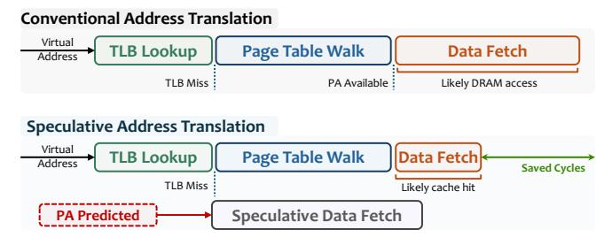

# 2.1. Speculative Address Translation

Previous works [21, 88-90, 111] hide address translation latency by speculating on the physical address, allowing the processor to issue early memory accesses and fetch data before address translation completes: a process called speculative ad*dress translation.* Figure 1 shows the data fetch sequence under conventional and speculative address translation. In a conventional system, address translation and data fetching happen sequentially. The processor first performs a TLB lookup to translate the virtual address (VA) to a physical address (PA). If the TLB lookup results in a miss, the processor initiates a page table walk (PTW) to resolve the VA-to-PA mapping. Only after the PTW completes can the processor issue the memory access to fetch the data. This sequential process can lead to significant performance degradation, especially when the PTW requires high-latency DRAM accesses to complete. With speculative address translation, the processor predicts the physical address and issues an early speculative memory access to fetch the data before starting the PTW. If the prediction is correct, the speculative fetch can partially or fully overlap data fetching with address translation, hiding the latency of address translation and improving performance. If the prediction is incorrect, the processor fetches an irrelevant cache block. Such mispredictions do not affect correctness, but consume memory bandwidth, waste energy, and may pollute the cache.

Figure 1: Data fetch sequence under (top) conventional address translation and (bottom) speculative address translation.

### 2.2. Challenges in Speculative Address Translation

Predicting the physical location of data based on the virtual address is challenging because conventional OSes do not establish stable, easily predictable VA-to-PA mappings/1 First, modern OSes use fully-associative virtual memory: during a page fault, the allocator maps the faulting virtual page to any currently available physical frame [112]. Second, memory fragmentation and memory utilization continually change which frames are available. Together, these effects make VA-to-PA mappings highly dependent on runtime conditions, limiting the potential for accurate PA prediction.

#### 2.3. Limitations of Prior Works

SpecTLB [88], the first work that proposed speculative address translation, relies on the OS to reserve large pages in order to achieve accurate hardware-side PA prediction. On the OS

side, a FreeBSD-like [105] OS allocation scheme reserves candidate 2MB regions but does not immediately use them as large pages. Instead, it allocates 4KB pages from the reserved region and only promotes the region to a large page when the OS detects that the region is highly utilized. On the hardware side, SpecTLB adds a TLB structure that records reserved but not-yet-promoted large-page regions and predicts the PA by speculatively assuming a fixed VA-to-PA offset within each reserved region.

SpOT [21] extends this idea from fixed-size large pages to arbitrarily-large contiguous virtual-to-physical mappings. On the OS side, SpOT uses contiguity-aware paging (CA-paging) to sustain contiguous VA-to-PA mappings over time. Whenever possible, CA-paging places pages from the same virtually contiguous memory object, called a Virtual Memory Area (VMA) in Linux [113], in a contiguous physical segment, while preserving standard demand paging (i.e., pages are allocated on demand). On the first fault to a VMA, CA-paging searches a contiguity map, an OS metadata structure that tracks available contiguous physical segments, to find a free physical segment that can accommodate the VMA. It then allocates the faulting page in that segment, records the resulting VA→PA offset for the VMA (i.e., the fixed PA-minus-VA displacement implied by that first placement), and uses that offset as a guide to allocate later-faulted pages from the same VMA in a best-effort manner. This way, CA-paging tries to establish contiguous VA-to-PA mappings over time, which SpOT leverages to perform accurate speculative address translation. On the hardware side, SpOT leverages the contiguous mappings created by CA-paging and caches them as contiguity descriptors in a small prediction table indexed by the load/store program counter (PC). Each descriptor records the virtual range (base and bounds), access permissions, and a speculative VA→PA offset for a recently observed mapping. On a TLB miss, the processor uses the load-/store PC to retrieve a contiguity descriptor, checks whether the missed VA falls within the descriptor's range, and computes a speculative physical address as VA + offset.

2.3.1. Limits of Contiguous Multi-Page Mappings. Table 1 shows the key properties of contiguity-based speculative address translation techniques that rely on (i) structured contiguity (e.g., SpecTLB [88]) or (ii) arbitrary contiguity (e.g., SpOT [21]). Both SpecTLB [88] and SpOT [21] depend on preserving multi-page invariants: structured and fixed-size multipage physical regions (e.g.,  $512 \times 4$ KB pages) in SpecTLB [88] or arbitrarily-large (i.e., base and bounds of a single mapping can be arbitrary) contiguous physical segments in SpOT [21]. These invariants are challenging to maintain when (i) memory fragmentation, which is observed to be high in mobile and large-scale systems (e.g., datacenters) [5, 92], severely limits the available physical memory contiguity, and (ii) co-running applications compete for contiguous allocations, a phenomenon we call allocation interference, which can rapidly increase memory fragmentation even when the system is lightly loaded.

We quantitatively analyze the sensitivity of contiguity-based speculative address translation techniques to fragmentation and allocation interference, which motivates Revelator's hash-based placement invariant. We focus on SpOT [21] as it is the most recent work that relies on contiguity, but our analysis applies to any approach that relies on contiguous multi-page mappings for speculation (e.g., SpecTLB [88]).

&lt;sup>1Predicting PAs using other program features (e.g., PCs), beyond VAs, is not meaningful because in conventional OSes the faulting VA and its properties (e.g., access type, permissions) are the only relevant program-visible features that affect PA selection.

Table 1: Comparison between (i) contiguity-based and (ii) Revelator's hash-based speculative address translation techniques.

| Property                     | Structured contiguity                            | Arbitrary contiguity                                          | Hash-based allocation                                                 |
|------------------------------|--------------------------------------------------|---------------------------------------------------------------|-----------------------------------------------------------------------|
|                              | (SpecTLB [88])                                   | (SpOT [21])                                                   | (This work: Revelator)                                                |
| Placement invariant          | Fixed-size 2MB pages                             | Arbitrarily-large contiguous physical segments                | Per-page hash-based placement                                         |
| Speculation metadata         | None                                             | Contiguity descriptors per memory object                      | Counters per hash function                                            |
| Hardware complexity          | ▼ Extra TLB for reserved large pages             | ▼ Cache for contiguity descriptors                            | ▲ Hash function circuitry and counters                                |
| Sensitivity to fragmentation | ▼ Single "hole" prevents reserving a large page* | ▲ Speculation coverage and accuracy drops as "holes" increase | ▲ Successful hash-based allocation depends only on memory utilization |
| Allocation interference      | ▼ Allocation interference creates holes          | ▼ Allocation interference disrupts contiguity                 | ▲ Independent of allocation interference                              |
| Memory allocation            | ▲ Fewer physical memory allocations              | Minimal impact on latency                                     | ▼ Small increase in latency                                           |

\* A "hole" is an occupied page within an otherwise contiguous physical region that splits a large block into smaller non-contiguous segments, creating memory fragmentation.

**2.3.2. Sensitivity to Fragmentation.** To quantify SpOT's sensitivity to fragmentation, Figure 2 shows the average speculation coverage (i.e., the fraction of TLB misses that are speculatively translated) and accuracy (i.e., the fraction of correct speculative address translations) across 11 translation-intensive workloads at different fragmentation levels (see §6 for details). We make three key observations. (1) Under low fragmentation (<1%), SpOT delivers near-perfect accuracy ( $\approx$ 100%) and high coverage (>85%). (2) At medium fragmentation levels (10-20%), accuracy drops to  $\approx$ 70% and coverage degrades sharply: at 10% fragmentation, coverage reduces to  $\approx$ 40%, and beyond 20% fragmentation, SpOT speculates on fewer than 20% of TLB misses. (3) At high fragmentation ( $\approx$ 50%), SpOT provides very low coverage (below 10%). Together, these observations show that the effectiveness of contiguity-based speculative address translation techniques (e.g., SpOT) heavily depends on memory fragmentation. In §7.1, we further show the performance gains provided by SpOT and Revelator under different fragmentation levels over the baseline system.

Figure 2: Speculation coverage (left) and accuracy (right) of SpOT [21], a state-of-the-art speculative address translation technique, in a system with different memory fragmentation levels

**2.3.3. Sensitivity to allocation interference.** SpOT's data placement strategy is effective when a small number of VMAs can be mapped to large contiguous physical segments, but it becomes fragile under allocation interference. Since SpOT does not preallocate the entire VMA, other VMAs or co-running applications can consume pages inside the targeted physical segment before subsequent page faults occur. Interleaved allocations create holes, disrupt the contiguity that SpOT relies on for speculative translation, and force the system to fall back to the conventional allocation policy (i.e., fully-associative data placement).

Figure 3 quantifies how allocation interference affects (i) the available physical memory contiguity and (ii) the ratio of successful offset-based allocations, i.e., the fraction of allocations that follow the VMA's recorded VA $\rightarrow$ PA offset. In this experiment, (1) memory is minimally fragmented (i.e., memory utilization is less than 1%) to isolate the effects of allocation in-

terference, (2) we use a microbenchmark that allocates memory for a configurable number of 1GB VMAs, and (3) we execute applications in a simulated system that employs a round-robin thread scheduler and 128GB of main memory (see §6 for details about the simulation methodology).

Figure 3: Sensitivity of SpOT to allocation interference: (a) ratio of successful offset-based allocations as the number of VMAs or co-running applications increases, (b) size reduction of the largest contiguous physical segments under background memory hogging, (c) increase in the number of contiguous physical segments under background memory hogging, and (d) successful offset-based allocations under finer-grained allocation interleaving.

Figure 3 (a) shows the ratio of successful offset-based allocations (i) as the number of VMAs within one application increases and (ii) as the number of co-running applications increases. We make two key observations. First, increasing the number of VMAs within a single application gradually reduces the ratio of successful offset-based allocations. The success rate remains near 100% with up to 8 VMAs and stays above 60% even at 64 VMAs. Second, increasing the number of co-running applications reduces the ratio of successful offsetbased allocations from  $\approx$ 80% with 2 applications to  $\approx$ 5–10% with 64 applications. We conclude that SpOT is more sensitive to inter-application interference than to the number of VMAs within a single application, because concurrent applications interleave independent allocation streams and create irregular allocation patterns that rapidly disrupt the available physical memory contiguity.

Figure 3 (b) shows the number of free contiguous physical segments for different hog rates as a foreground application runs alongside the background hog. We observe that as the hog

rate increases and as the foreground application allocates more memory, the number of free contiguous physical segments grows from a few dozen to several thousand. This growth in the number of segments indicates that the free physical memory becomes highly fragmented, thereby reducing SpOT's effectiveness (as shown in [§7.1\)](#page-10-0).

Figure [3](#page-3-2) (c) measures how background memory hogging (i.e., allocation and freeing of pages performed by a co-running background process) affects the largest available contiguous physical segments. In this experiment, we run a background memory hog that allocates and frees pages at different rates (i.e., hog rate of *N*% means that the background hog allocates *N* pages per 100 pages allocated by the foreground application) alongside the foreground application. We make two key observations. First, even a low hog rate (20%) reduces the largest contiguous physical segments by 50–80%. Second, as the hog rate increases, the largest contiguous physical segments degrade further, and at 80% hog rate, the largest contiguous segment consists of only a few pages (≈32). We conclude that even moderate background allocation activity can break the large free contiguous physical segments into substantially smaller ones, which in turn significantly reduces SpOT's speculation coverage and accuracy (as shown in [§7.1\)](#page-10-0).

Figure [3](#page-3-2) (d) shows the effect of allocation interleaving granularity with 16 applications running concurrently. We vary the allocation turn size (i.e., the number of pages each application allocates before the OS scheduler switches execution to the next application) from 4096 pages down to 16 pages. We observe that reducing the allocation turn size from 4096 pages to 16 pages reduces successful offset-based allocation from 100% to 11%. A smaller allocation turn size interleaves allocation requests from different applications more frequently, creating holes inside the physical segments that SpOT tries to preserve. We conclude that SpOT's offset-based placement breaks down rapidly under fine-grained allocation interleaving.

Taken together, these results show that SpOT's reliance on contiguous physical regions makes speculation fragile under realistic allocation dynamics: competing VMAs, co-running applications, and background allocation activity all break large free regions into smaller pieces, reducing offset-based allocation success. Our goal in this work is to design a speculative address translation mechanism that does not rely on contiguous multi-page mappings and can instead provide high speculation coverage and accuracy even under high fragmentation and high loads of allocation interference.

