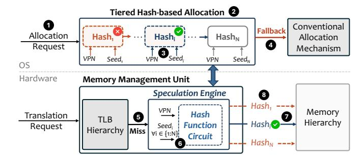

# 3. Revelator: Design Overview

We present Revelator, a hardware-OS cooperative scheme that uses hashing to enable highly accurate speculative address translation with minimal system modifications. The key idea of Revelator is to have the OS establish a predictable per-page hash-based data placement that the hardware leverages to predict the physical address of requested data. Figure [4](#page-4-0) shows an overview of Revelator's key components and workflow.

Key Mechanism. At the OS level, Revelator employs a tiered hash-based allocation policy. When the OS receives a request to allocate a physical frame for a virtual page 1 , it computes a bounded sequence of candidate physical page numbers (PPNs), with one candidate per allocation tier (i.e., hash attempt). For tier *i* ∈ [1*, N*], the OS applies the same hash function *h* to the VPN and a tier-specific seed *seedi* , producing

Figure 4: Revelator Overview

*P P Ni* = *h*(*V P N, seedi*). The OS attempts to allocate the virtual page to these candidate frames in tier order 2 . If *P P Ni* is free, the OS allocates the virtual page to the corresponding physical frame 3 , establishing a predictable VA-to-PA mapping that the hardware can later recompute using the same VPN and seed. If *P P Ni* is occupied, the OS advances to the next tier and computes another deterministic candidate using the same VPN but a different seed. Because each tier probes an independently chosen candidate frame, a system with memory utilization *u* gives each candidate an approximately 1 − *u* chance of being free, making it increasingly unlikely that all *N* candidates are occupied, even under high memory utilization. If all *N* candidate physical frames are occupied, the OS falls back to the conventional allocation policy 4 . We analyze the probability of successful hash-based allocation and its dependence on memory utilization in Section [4.1.](#page-5-0)

At the hardware level, when a translation request misses in the TLB hierarchy 5 , Revelator invokes a lightweight speculation engine that mirrors the OS's tiered hash-based allocation policy. First, the speculation engine uses the same hash function circuit and tier-specific seeds to recompute the candidate *P P Ns* for the miss-causing *V P N* 6 . Second, it combines each candidate *P P Ni* with the page offset to form a candidate physical address and issues selected speculative data requests to the memory hierarchy. If a candidate corresponds to the actual physical address 7 , the speculative data fetch overlaps with the page table walk, and the data can arrive before address translation completes. In the example of Figure [4,](#page-4-0) the OS successfully allocates the virtual page to the candidate frame in tier *i*. However, the hardware does not know a priori which tier the OS used to place the data, so it may also issue extra speculative fetches for candidates from other tiers, such as tiers 1 and *N* 8 . In [§4.3,](#page-5-1) we describe how the speculation engine uses a speculation degree filter to reduce this extra memory traffic by limiting which candidate requests are issued.

Key Benefits. As shown in Table [1,](#page-3-0) Revelator avoids the limitations of prior contiguity-based mechanisms. First, Revelator's prediction accuracy does not depend on memory fragmentation but only on memory utilization. This is because Revelator's allocation policy enforces a per-page hash-based placement invariant, rather than relying on free contiguous multi-page physical segments. Second, as Revelator's effectiveness does not depend on memory fragmentation, it is naturally resilient to allocation interference. Third, Revelator requires only small OS changes: (i) the OS allocator is modified to support tiered hash-based allocation, and (ii) the OS maintains a small amount of counters per hash function to track the successful allocation rate of each hash function and guide the

hardware-based speculation. Fourth, Revelator requires only small hardware changes: (i) a lightweight speculation engine that computes the same hash function as the OS and (ii) a small number of hardware counters to track the successful allocation rate per hash attempt and guide speculation.

