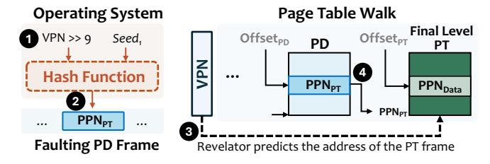
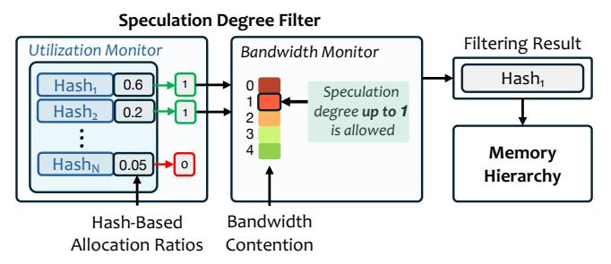

# 4.2. Hash-Based Page Table Allocation

Revelator also applies hash-based allocation to final-level page table (PT) frames, making the VA-to-PTE mapping predictable and enabling the hardware to speculatively fetch the final PTE at the start of the PTW. Unlike data-page allocation, PT-frame allocation uses a single hash attempt rather than multiple tiers (a conservative choice because the potential performance benefit of additional PT-frame hash attempts does not justify the cost of issuing multiple speculative PTE fetches per TLB miss). Figure 5 illustrates Revelator's allocation policy for PT frames. When allocating a final-level PT frame, the OS computes one target PPN using  $H_1(VPN>>9)$ , where the VPN is rightshifted by 9 because each final-level PT frame contains PTEs for 512 contiguous VPNs **1**. If the target PPN is free, the OS allocates the PT frame to that PPN and updates the corresponding page-directory (PD) entry with the selected PT-frame PPN, allowing a conventional PTW to normally reach the PT frame **2**. Otherwise, Revelator falls back to the conventional allocator to find a frame for the PT. When the hash-based PT-frame allocation succeeds, the MMU can also recompute the same PT frame's PPN from the VPN, combine it with the PTE offset, and speculatively fetch the final PTE at the start of the PTW **3**. This overlaps the final PTE fetch with the earlier levels of the PTW, accelerating the walk and reducing address translation latency (§4.3).

### 4.3. Hardware: OS-Guided Speculative Translation

**4.3.1. Speculation Engine.** The speculation engine is part of the memory management unit (MMU) and works in tandem with the OS's tiered hash-based allocation policy to predict the physical page number (PPN) for a given virtual page number (VPN) and fetch the corresponding data before address translation completes.

&lt;sup>2Using the PID as input to the hash function ensures that the same VPNs across different processes map to different candidate PPNs.

Figure 5: Revelator's hash-based allocation for page table frames.

**Speculative PA Calculation.** On an L2 TLB miss, the speculation engine extracts the VPN and page offset from the faulting VA. It then recomputes the same bounded sequence of candidate PPNs that the OS considered during allocation by hashing the VPN with each configured seed. Each candidate PPN is concatenated with the page offset to form a candidate PA. For final-level page table frames, the speculation engine similarly hashes  $VPN \gg 9$  to predict the PT-frame PPN and combines it with the PTE offset to form a candidate PTE address. Because the hardware does not know a priori which hash attempt succeeded during OS allocation, it can generate up to N candidate PAs, one per tier, and issue speculative fetches in the configured tier order. The latency of the hash function circuitry is only 2–3 cycles, which is negligible compared to the latency of a PTW (40–100 cycles).

4.3.2. Dynamically Adapting Speculation Degree. Revelator needs to decide how many of the hash-based candidate PPNs to turn into actual speculative memory requests on each L2 TLB miss, which we refer to as the speculation degree. The speculation degree controls a trade-off between address translation coverage and memory system pressure. A larger degree (e.g., N=4) covers pages allocated by later tiers and therefore increases the likelihood that at least one speculative fetch targets the correct PPN. However, for each additional tier, an additional speculative memory request needs to be issued, consuming bandwidth and potentially delaying demand accesses. A smaller degree (e.g., N=1) avoids unnecessary traffic when most pages are allocated by the first tier, but it misses pages that were allocated by later tiers (N>1), which become more common as memory utilization increases. Because the right degree depends on both allocation behavior and available bandwidth, Revelator uses a speculation degree filter to dynamically select how many candidate PAs to fetch.

**Memory Utilization:** As memory utilization increases, the OS is more likely to use secondary tiers ( $H_2$ ,  $H_3$ , etc.) or the conventional allocator to allocate a page. In such scenarios, increasing the speculation degree improves speculative hit likelihood.

Memory bandwidth: When memory bandwidth is abundant, Revelator can speculate on more candidate PAs because the extra requests are less likely to contend and safely improve speculation coverage without hurting demand requests. When bandwidth is scarce, however, speculative requests to candidate PAs that do not match the OS-selected PPN become costly: they occupy memory queues, consume interconnect and DRAM bandwidth, and can delay demand requests.

The Speculation Degree Filter: Figure 6 shows the design of the speculation degree filter. It employs two monitors to dynamically adapt speculation degree. First, the memory utilization monitor tracks the fraction of all successful allocations

performed by each tier. Second, the bandwidth monitor tracks bandwidth usage. The speculation degree filter uses the utilization monitor to drop tiers that have allocated fewer pages than a pre-defined threshold. For the remaining tiers, the filter adaptively adjusts the degree based on the available memory bandwidth. The final PA candidates are speculatively fetched.

Figure 6: Speculation degree filter design.

