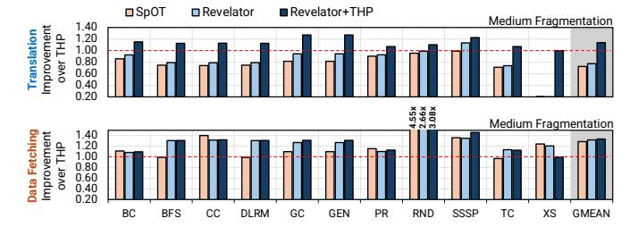
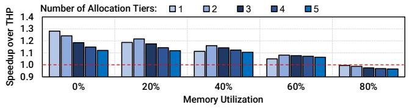
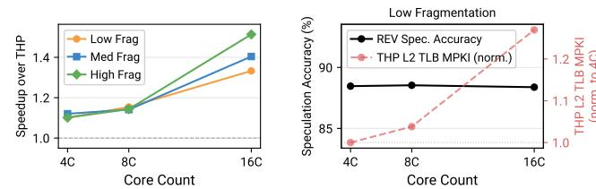

# 7.1. Native Execution Environments

Fig. [13](#page-10-3) shows the performance provided by Revelator and Revelator+THP compared to 8 state-of-the-art translation schemes (and a 64K-entry L2 TLB) across three fragmentation levels: (top) low, (middle) medium, and (bottom) high fragmentation. Fast Page Table Walks. In the low (medium) fragmentation scenario, Revelator outperforms ASAP, DMT, and ECH by 20% (13%), 19% (13%), and 20% (13%), respectively. While effective, these approaches parallelize or reduce the steps of the PTW but the processor still waits for at least one memory access before fetching the data. Revelator provides a complementary benefit by overlapping the final data fetch with the PTW, hiding the latency that remains even after the walk itself is accelerated. Larger or Smarter TLBs. Under low fragmentation, L2 TLB-64K provides a small benefit over THP (≈4% on average), standalone Revelator roughly breaks even compared to the THP baseline system, and Revelator+THP improves performance by ≈12% by exploiting abundant 2MB contiguity. This is expected: when 2MB contiguity is abundant, THP already provides high TLB reach while standalone Revelator does not filter 2MB translations in TLBs. As fragmentation increases, this trend reverses. Under medium fragmentation, Revelator improves performance by ≈19% over THP, compared to only ≈2% for L2 TLB-64K. Under high fragmentation, where most memory

is backed by 4KB pages, L2 TLB-64K improves performance by only ≈3%, while Revelator improves performance by ≈25%. Increasing L2 TLB capacity helps only when the additional entries convert misses into hits. This is more likely under low fragmentation, where 2MB pages are abundant and can be captured in TLBs, but becomes less likely as fragmentation increases and more translations require 4KB entries that are not present in the TLB. When a miss still occurs, the processor pays the full PTW cost. Revelator targets this residual cost by starting the data fetch during the PTW, so it can hide latency even for translations that a larger TLB fails to capture.

Speculation-based Schemes. We compare Revelator against SpOT [\[21\]](#page-13-7), a state-of-the-art contiguity-based speculative address translation technique analyzed in [§2.](#page-2-3) Under low fragmentation, SpOT improves performance by 11% over THP by exploiting large contiguous mappings, matching the performance of Revelator+THP. Standalone Revelator roughly breaks even compared to the THP baseline system in this setting because it does not leverage 2MB pages being translated by the TLBs, while SpOT and Revelator+THP do by design. Under medium fragmentation, SpOT's speedup drops to 9% as contiguous mappings become harder to preserve. In contrast, Revelator improves performance by 19%, outperforming SpOT by 8.5%, because its hash-based placement does not rely on physical contiguity. Under high fragmentation, SpOT's speedup drops further to 8%, while Revelator and Revelator+THP improve performance by 25% and 26%, respectively. This shows that Revelator+THP preserves the benefits of large pages when contiguity exists, while falling back to 4KB hash-based placement and speculation to maintain high performance when contiguity is scarce.

Understanding Revelator's Performance. Fig. [14](#page-11-0) breaks down how SpOT (without THP enabled), Revelator, and Revelator+THP affect address translation and data fetch latency in a system with medium fragmentation across 11 data-intensive workloads. SpOT and standalone Revelator respectively increase address translation latency over THP by 28% and 23% on average. THP remains a strong translation baseline at medium fragmentation: many translations are served by the L2 TLB, and PTWs terminate at the 3rd level due to the presence of 2MB

Figure 13: Performance speedup achieved by ReserveTHP [\[105\]](#page-16-15), SpecTLB [\[88\]](#page-15-3), L2 TLB-64K, POM-TLB [\[107\]](#page-16-29), ASAP [\[108\]](#page-16-16), DMT [\[16\]](#page-13-9), ECH [\[19\]](#page-13-10), Mosaic Pages [\[106\]](#page-16-18), SpOT [\[21\]](#page-13-7), Revelator and Revelator+THP over THP [\[105\]](#page-16-15) across three fragmentation levels.

pages. Revelator+THP reduces address translation latency by 13% by preserving available 2MB mappings while accelerating PTWs for the remaining 4KB translations. All three schemes improve data fetch latency by issuing data requests before address translation completes: SpOT, Revelator, and Revelator+THP respectively reduce data fetching by 28%, 31%, and 33% on average.

Figure 14: Improvement in address translation latency (top), and data fetch latency (bottom) achieved by SpOT [21], Revelator and Revelator+THP over THP (medium fragmentation) across 11 data-intensive workloads.

Impact of Hash Functions and Memory Utilization. Figure 15 shows Revelator's speedup over THP with up to 5 allocation tiers (i.e., hash attempts) as memory utilization increases from 0% to 80% in a system with medium fragmentation. Revelator maintains an 8% average speedup even under high memory pressure, where 60% of pages cannot be allocated via a hash function. The best tier count depends on utilization: one tier performs best at 0% utilization because the primary target is usually available, while two tiers help at 40% utilization by increasing the chance of finding a free target. Using too many tiers adds redundant speculation overhead, causing a 4% slowdown with four tiers at 80% utilization. These results show that the useful speculation degree should track how many allocation tiers are likely to succeed at a given memory utilization: each additional tier creates another hash-derived candidate address that hardware may speculatively fetch, but fetching candidates from unlikely tiers wastes bandwidth. This motivates the speculation degree filter described in §4.3, which dynamically selects how many tier candidates Revelator should issue as speculative requests.

Figure 15: Average speedup over THP achieved by Revelator (medium fragmentation) with up to 5 allocation tiers (i.e., hash attempts) at different memory utilization levels across 11 data-intensive workloads.

Additional Sensitivity Studies. We further evaluate three sources of Revelator's behavior: (1) the contribution of speculating for page table entries versus the final data fetch, (2) the speculation degree filter's ability to reduce bandwidth overhead, and (3) the cache pollution caused by mis-speculation. These studies show that Revelator's speedup primarily comes from hiding the final data fetch, that degree filtering reduces wasted fetches without sacrificing performance, and that cache blocks of mis-speculated data rarely evict useful data from the L2 cache. We provide the detailed analysis for all three studies in the extended version of this paper [114].

**Impact on Energy Consumption.** Using McPAT [150], in Fig. 16 we evaluate the energy consumption of Mosaic Pages, SpOT, Revelator, and Revelator+THP compared to THP under medium fragmentation across 11 data-intensive workloads. We observe that Revelator+THP reduces energy consumption by 5.5% over THP and 2.2%, 4.3%, and 2.7% over Mosaic Pages, SpOT, and standalone Revelator, respectively. We provide a comprehensive energy analysis in the extended version of the paper [114].

Figure 16: Reduction in energy consumption achieved by Mosaic Pages [106], SpOT [21], Revelator and Revelator+THP over THP in a system with medium fragmentation across 11 data-intensive workloads.

Revelator in Virtualized Environments. We evaluate Revelator in virtualized environments and compare Nested Paging+THP (NP-THP) against DMT [16] and three Revelator configurations: Horizontal (§4.5), Diagonal (§4.5) and Full (§4.5), which combines both forms of speculation. Horizontal provides little benefit because the nested translations are often retrieved by the nested TLB, while Diagonal improves performance by 11% over NP-THP and 6% over DMT. Full combines both forms of speculation and reaches 13.6% average speedup over NP-THP. We provide extended analysis on virtualized environments in the extended version of the paper [114].

Revelator in Multicore Systems. We evaluate Revelator and THP in 4-, 8- and 16-core configurations across 30 mixes of Google server traces (we compare against SpOT only in the multicore-NUMA evaluation to reduce the total volume of experiments). Fig. 17 (left) shows that Revelator consistently outperforms THP as core count increases, providing average speedups ranging from 1.08× under low fragmentation on 4 cores to 1.50× under high fragmentation on 16 cores. The benefit grows with core count because more applications compete for 2MB pages, causing THP to fall back to 4KB pages more often while Revelator does not rely on contiguity and continues to hide translation overhead. Fig. 17 (right) supports this trend: THP's L2 TLB MPKI increases by more than 20% from 4 to 16 cores, while Revelator's speculation accuracy remains stable at 87-88%.

Figure 17: (Left) Average speedup achieved by Revelator over THP under low/medium/high fragmentation; (right) L2 TLB MPKI increase for THP versus speculation accuracy for Revelator under low fragmentation across 4/8/16-core systems.

Revelator in NUMA Systems. We evaluate Revelator in an 8-node/64-core NUMA system across 30 mixes of Google server traces while varying the spillover rate from 0% to 50%, where spillover is the fraction of an application's pages allocated out-

side its dominant NUMA node. The OS policy allocates pages on the dominant node (preferred) until it reaches a per-node memory utilization threshold, at which point it starts allocating on other nodes, increasing spillover. Fig. 18 shows Revelator's performance speedup over SpOT [21] and the fraction of PTW latency hidden by Revelator (Hints ON/OFF §4.6) and SpOT. Revelator consistently outperforms SpOT, retaining an average 1.08× speedup even at 50% spillover (up to 1.20× speedup at 0% spillover), where many pages reside outside the dominant node. Bloom-filter-based hints sustain this benefit by directing speculation to likely remote nodes, allowing Revelator to hide 85–95% of PTW latency across spillover rates. We provide a detailed NUMA analysis, including additional system configurations and bandwidth overheads, in the extended version of the paper [114].

Figure 18: Average speedup and hidden PTW latency achieved by Revelator with Hints ON/OFF over SpOT in an 8-node/64core NUMA system at different spillover rates across 30 mixes of Google server traces.

