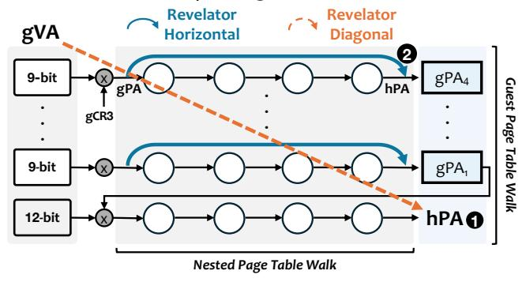
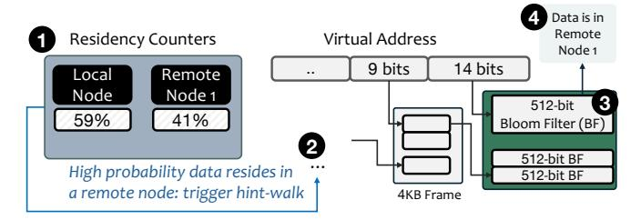

# 4.5. Revelator in Virtualized Environments

Revelator's functionality naturally extends to virtualized systems. In this section, we describe Revelator in the context of x86-64 virtualization with Nested Paging [109], where address translation requires a two-dimensional page table walk from guest virtual addresses to guest physical addresses and then to host physical addresses. Our insight is to leverage tiered hash-based allocation and hardware speculation in two *complementary and composable* ways. Figure 8 illustrates the two approaches.

**Diagonal speculation.** First, Revelator can be used to predict the final host physical address (hPA) directly from the guest virtual page number (gVPN), overlapping the *entire* 2D PTW with data fetching (*diagonal speculation*,  $\blacksquare$ ). In this approach, the hypervisor employs tiered hash-based allocation and allocates hPAs using the guest virtual address as the input to the hash function (Hash(gVA) = hPA). We provide more details on how the hypervisor can implement diagonal speculation without guest cooperation in the extended version of this paper [114].

Horizontal speculation. Second, Revelator can make the guest-physical (gPA) to host-physical (hPA) mapping predictable by having the hypervisor allocate hPAs using Revelator's standard hash-based policy, with the gPA as the hash input (§4.1). This enables *horizontal speculation* during nested page table walks. Once the guest PTW identifies the gPA of a guest page-table page, the hardware hashes that gPA to predict the hPA where the page resides. It then speculatively fetches the cache line containing the next-level guest PTE before the nested translation completes **2**.

Figure 8: Revelator's workflow in x86-64 virtualized environments that use Nested Paging [109].

#### 4.6. Revelator in NUMA Systems

NUMA Placement and Speculation. In NUMA systems, the OS selects the node from which each page is allocated according to the active memory policy, such as Interleave, Local, Bind, or Preferred [122-124]. This node selection becomes part of the physical address, but for common policies such as Local, Bind, and Preferred, the hardware usually does not know the target node before address translation resolves. This uncertainty makes PA speculation challenging. Speculating across every node wastes bandwidth, while speculating only locally misses optimization opportunities for pages placed remotely due to policy, pressure, or migration. Existing contiguity-based mechanisms (e.g., SpOT [21]) face the same NUMA-local fragmentation problem, because they still depend on finding or preserving large contiguous regions within the selected node. If such schemes instead use the memory capacity of a remote node to preserve contiguity, the resulting access latency and interconnect traffic can offset their address translation benefits.

OS Side: Policy-First Node-Scoped Hashing. Revelator keeps NUMA placement under OS control because the selected NUMA node affects the latency and bandwidth of every later memory access to the page which is often more important than reducing address translation latency. During allocation, the OS first selects the target node  $n^*$  according to the active NUMA policy. Revelator then performs tiered hash-based

placement only within  $n^*$ 's address range, making intra-node 4KB placement predictable without changing the OS's locality decision. If all intra-node hash attempts fail, Revelator falls back to the conventional allocator within  $n^*$ . This policy-first design preserves OS locality decisions while avoiding the need to find large contiguous physical regions inside the selected node. We focus on Local, Bind, and Preferred, because unlike Interleave, their target node is not directly derivable from the VPN and is therefore challenging for PA speculation. Hardware Side (1): Dominant-Driven Speculation. Figure 9 illustrates Revelator's NUMA-aware speculation policy. The speculation engine maintains per-NUMA-node counters  $C_n$ , incremented when a translation resolves and data resides in node n. These counters provide an empirical probability distribution, estimating the likelihood that data resides in node n  $(p_n = C_n / \sum_i C_i \mathbf{0})$ . Let  $p_{\text{dominant}}$  be the probability of the dominant node with the highest counter value  $(n_{\text{dom}} = \arg \max_n C_n)$ . (Note: the dominant node is not necessarily local). If  $p_{\text{dominant}} \geq T_{\text{dom}}$  ( $T_{\text{dom}} = 0.8$ ), Revelator speculates only within the dominant node.

Hardware Side (2): Hint-Assisted Speculation.  $p_{\text{dominant}} < T_{\text{dom}}$ , no single node clearly dominates, increasing the chance that the page resides in a non-dominant node **2**. Without identifying the target node, the engine must either speculate across every node (wasting bandwidth), or forfeit speculation. To avoid missing speculation opportunities, Revelator executes two concurrent actions: (i) speculates within the dominant node for likely hits, and (ii) performs a hint walk, a parallel lookup in a new OS-managed Bloom-filter table indexed by the VPN, to determine whether the page may reside in a non-dominant node **3**. The hint walk is not part of the correctness-critical address translation path: it only returns a possible NUMA node for speculation, and the resolved page table translation still determines the correct physical address. If the hint points to a non-dominant node, Revelator issues one additional speculative fetch using the hash-derived candidate address within that node **4**. We provide more details about this hint structure in the extended version of this work [114].

Figure 9: Revelator's workflow in NUMA systems.

