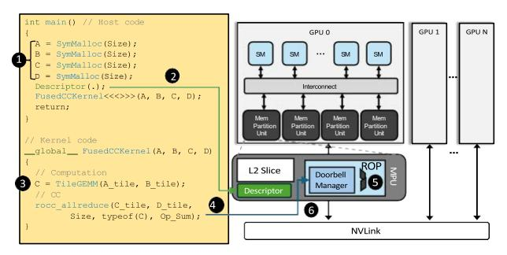

# A. Challenges in repurposing ROPs for CC

Despite the benefits of using ROP for CC, there are several challenges in repurposing ROP for CC. First, there is no



Fig. 15: RoCC Walkthrough

interface to trigger CC on ROP. The CC should be triggered as soon as either a GEMM tile output is produced by the local GPU or data is received from a remote GPU rank. However, there is no interface to command ROPs to start the CC operations. Second, the granularity of ROP operations and CC operations does not match. As ROPs can only execute atomics or memory loads and stores individually, the CC operations should be decomposed to a series of such finegrained atomics. Third, ROP should be able to identify the next destination GPU rank and send messages to it in each step of CC operation. To completely offload CC from SMs or host CPU, ROPs should be able to identify the next destination address throughout the steps of a given CC. This requires ROP to know the data flow of individual CC operations. Fourth, data for each CC step should be within an L2 slice residing in the same MPU with the target ROP. Because each ROP is linked to a dedicated L2 cache slice, tensor tiles used in each step should not be mapped across L2 cache slices. The following sections explain how we tackle these challenges.

#### B. RoCC Overview

Figure 15 illustrates an example walkthrough of RoCC when N GPUs run a GEMM followed by a CC operation. RoCC uses a fused kernel to enable fine-grained GEMM and CC synchronization. Before launching the kernel, the input and output tensors are allocated with our proposed symmetric tensor allocator **①**. This allocator maps tensor tiles on symmetric physical addresses across the GPU ranks, thereby removing the burden of address translations during the inter-rank communication (details in Section V-F). The target CC information (e.g., base addresses, dimension, and shape of the tensor tiles, each GPU's rank ID, CC type, and data type) is provided in an *RoCC descriptor* (details in SectionV-C) **2**. In the fused kernel, GPUs execute GEMM on the assigned tensor tiles in parallel on SMs 3. When a warp finishes its tile computation, it writes the result tile to memory and commands ROP to begin the CC phase. To command ROP to start the CC, we introduce a GPU intrinsic function per CC operation (e.g., rop allreduce (.), details in Section V-C) 4. The necessary information for the CC (e.g., tile address, operation type) is sent via descriptors and our proposed messaging scheme, doorbell (details in Section V-E). To ensure each ROP can process data within its dedicated L2 slice, we partition each tile, which can be potentially mapped across multiple L2

slices, into a cache line unit and have each ROP to process only the cache lines located in the L2 slice that resides within the same MPU as that ROP.

After launching the CC function, the warps compute their next tile on SMs (i.e., fine-grained overlapping between GEMM and CC). In the meantime, ROPs decode the doorbell messages and convert the target CC operations into the form that the ROP can execut. For this, we propose *collective* primitive decomposition (Section V-D). We define CC primitives, which are modularized sub-functions of CC operations (e.g., send, recvReduceSend, etc). Then, each primitive is encoded with a set of ROP micro-operations (μOps). By employing two decoders, each translates CC function to primitives, and primitive to ROP μOps, RoCC runs each CC operation through a multi-stage primitive executions on ROP. After finishing one primitive stage, ROPs issue a doorbell command to another ROP in the next GPU rank 6, according to the message switching order of the given CC operation (as shown in Figure 5(a) - (c)). Each CC function is implemented with a pre-determined sequence of primitives, as listed in Table I. Thus, the next GPU rank can be identified once the ROP knows the current primitive stage and the target CC operation. This information is embedded in the aforementioned descriptors and updated at every stage. Within the target GPU rank, the specific memory address to copy the result can be identified without a translation or estimation thanks to the aforementioned symmetric tensor allocation. As tensors are mapped on the symmetric physical addresses across GPU ranks, the source and destination physical addresses are identical except for the GPU rank ID.

Until the entire tensor computation completes, SMs continue processing subsequent GEMM tiles, while ROPs handle CC issued via doorbells, by either the local SMs or remote GPUs, in parallel. The following sections will discuss the details of each of the proposed components.

## C. Programming Interface

To command ROP to start the CC phase, we need software and hardware interfaces. We present two software interface designs at different granularities.

Following the conventional collective libraries, we may extend the existing APIs for ROPs (e.g., drop-in replacement for NCCL/RCCL with roccAllreduce(.)) and make the DL frameworks use it after GEMM kernels. It provides good portability, but its coarse-grained overlapping will limit the performance gain using ROPs. Thus, we propose a more fine-grained approach, where each warp can command ROP upon completing the warp-worth tile computation.

As shown in Listing 1, we design an intrinsic function per CC operation. The example code shows the function for AllReduce, rocc\_allreduce(.). The function semantics are designed following the existing CC libraries, such as MPI and NCCL. For example, rocc\_allreduce(.) uses the following function arguments: Src (source data address), Dst (destination data address), size (the count of elements), dataType (the data type of the elements), and OpType (the

type of reduction operation). The usage is as easy as adding a line after output tile storage (line 8) to start CC function (line 10). To make the function to issue CC operations to ROP, we extend the GPU ISA to have one instruction per CC operation (e.g., we add three instructions, ROP\_AR, ROP\_AG, and ROP\_A2A). These instructions are issued via the existing atomic instruction datapath, with the warp ID and the output tile address to be processed in ROP.

```
def gemm_allreduce(A, B, C, D, BLOCK_K)
for k0 in 0..K step BLOCK_K: // Tiled GEMM
   A_tile = load A[..]
   B_tile = load B[..]
   acc += dot(A_tile, B_tile)
   // Fused function such as ReLU.

store C[..] = acc
   // RoCC communication
   rocc_allreduce(&(C[..]), &(D[...]),
```

Listing 1: Code Example using RoCC intrinsic function.

To offload CC tasks from SMs to ROPs without further coordination, the ROPs should have the full information about the CC operation. To provide this, we introduce *RoCC descriptor* (Figure 16a), which consists of the input and output tensor pointers (*SrcBase* and *DstBase*), tensor dimension (*TensorDim*), warp-tile shape (*TileShape*), CC operation type (*CollType*), and data type (*DataType*). In the host code (e.g., DL framework), before calling the tensor kernel, an RoCC descriptor is created. We design a driver API for this purpose. Then, the descriptor will be stored in a dedicated on-chip buffer within each MPU and used until the end of the kernel.

