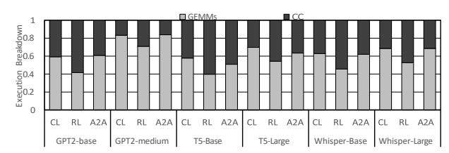
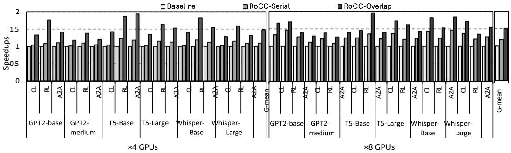
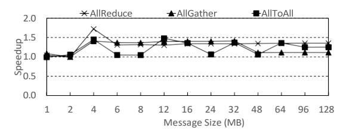
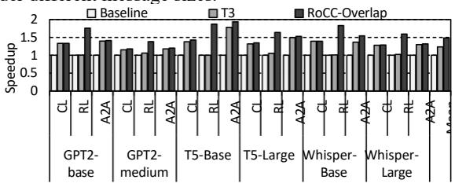
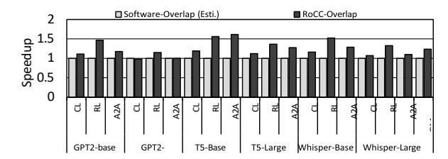
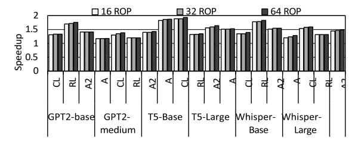

# B. Performance Results

1) Overall performance: Figure 21 compares three parallel schemes in a 4- and 8-GPU system. The baseline runs GEMM and CC sequentially. The RoCC variant, RoCC-Serial, invokes RoCC's drop-in APIs (i.e., non-overlapped interface discussed

Fig. 20: Simulated execution time breakdown between GEMM and CC phases: The CC portion ranges align with measurements collected from a real V100 machine.

in Section V-C) to offload CC operations after each GEMM kernel finishes. The drop-in APIs are executed in a separate kernel. In our proposed *RoCC-Overlap*, we use the warp-level intrinsics to interleave computation and CC at fine granularity. With 4 GPUs, *RoCC-Serial* achieves a 9% speedup and *RoCC-Overlap* reaches 48%. With 8 GPUs, improvements rise to 27% and 54%, respectively. Averaged across both scenarios, *RoCC-Serial* delivers a 18% gain and *RoCC-Overlap* achieves a 51% gain over the baseline.

- 2) Overlapping Evaluation: We quantify compute-CC overlap ratio with GEMMend Start In Figure 22, RoCC achieves an average of 83.4% overlapping. This ratio increases with larger models because extended GEMM phases provide more opportunity to hide communication latency. The unoverlapped portion stems from the initial GEMM and final CC phases, which cannot be hidden, and varies with tile size across models.
- 3) Contention Analysis: RoCC's high GEMM-CC overlapping might cause resource contention and negatively impact GEMM's performance. In Figure 23, we compare the per-

TABLE II: Evaluated Model Parameters

| Model         | Hidden Size | FFN Inner Size | Sequence length |
|---------------|-------------|----------------|-----------------|
| GPT-2-base    | 768         | 3072           | 1024            |
| GPT-2-medium  | 1024        | 4096           | 1024            |
| T5-base       | 768         | 2048           | 1024            |
| T5-large      | 1024        | 2816           | 1024            |
| Whisper-base  | 512         | 2048           | 2048            |
| Whisper-large | 1280        | 5120           | 1024            |

TABLE III: Simulation Parameters

| Parameter                 | Value                         |  |
|---------------------------|-------------------------------|--|
| Number of GPU             | 4, 8                          |  |
| Number of SMs             | 80 per GPU                    |  |
| L1 Data Cache             | 128 KB, 4-Way, 16 MSHRs       |  |
| L1 Inst Cache             | 32 KB, 4-Way, 16 MSHRs        |  |
| L2 Cache                  | 6 MB, 16-way, 64 MSHRs        |  |
| NoC Configuration         | XBar. 32B flit size           |  |
| Number of MPU (LLC slice) | 64 [22], [59], [63], [64]     |  |
| CPU-GPU Connection        | PCIe Gen4 x16.                |  |
|                           | 150 cycle latency [12], [30]  |  |
| GPU-GPU Connection        | 300 GBps, full-mesh topology  |  |
| Num of ROP                | 1 per MPU, 64 in total        |  |
| size of ROP cache         | 1KB per MPU                   |  |
| ROP datapath latency      | 28 cycles Sec.IV              |  |
| ROP ALU concurrency       | 4 Sec.IV                      |  |
| ROP ALU latency           | 3 cycles Sec.IV               |  |
| Max Concurrent Doorbells  | 4                             |  |
| DRAM                      | tRC=24, tRCD=7, tRP=7, tCL=7, |  |
|                           | tWL=2, tRAS=17,tRRDl=3,       |  |
|                           | tRRDs=2, tFAW=20, tRTP=3,     |  |
|                           | tCCDl=1, tCCDs=1. ≈900 GBps   |  |

Fig. 21: Overall Performance: RoCC-Overlap is the proposed fine-grained overlapping. RoCC-Serial is a variant that uses a dedicated CC kernel invocation to ROP.

Fig. 22: Overlapping ratio

Fig. 23: GEMM performance under contention of overlapping.

formance of GEMM with and without concurrent CC. On average, RoCC incurs only a 6.25% slowdown on GEMM. This limited impact is because ROPs operate asynchronously on CC operations, while SMs focus on compute-intensive kernels, so contention remains minimal.

4) CC Performance: To evaluate CC efficiency, we compare the latency of CC-only in the SM-based baseline and RoCC-Serial. Note that RoCC-Overlap's fine-grained CC computation makes it hard to measure the end-to-end communication time. Figure 24 shows the speedup of RoCC-Serial over the SM-based baseline for various message sizes. With small messages, both perform similarly because startup overhead (GPU frontend, address translation, etc.) dominates and is not hidden by RoCC. With larger messages, due to the NoC overhead, RoCC using near-memory ROP outperforms, with speedups of 35% for AllReduce, 11% for AllGather, and 25% for AllToAll.

5) Comparison with state-of-the-art: The most closely related work is T3 [44]. T3 uses a DMA engine for data transfer and PIM for reduction. DMA-based transfer is orthogonal to RoCC; however, HBM-PIM must switch between compute and memory modes [55], [56], [62], incurring significant overhead when PIM computation blocks memory requests. We

Fig. 24: Speedup of RoCC-Serial over software-based baseline under different message sizes.

Fig. 25: Performance comparison with the state-of-the-art.

implement T3 on a practical dual-mode HBM-PIM system and compare its performance with RoCC. As shown in Figure 25, T3 achieves a 23% speedup over the baseline, whereas RoCC attains 48% on four GPUs. The gap is largest for the *RowLinear* kernel because RoCC uses **native** near-memory ROP units, while dual-mode HBM-PIM experiences contention between GEMM memory traffic and PIM reduction operations.

6) Comparison with the software solution: We compare RoCC with an oracle software-based overlapping, where GEMM perfectly overlaps with CC. We adopt an SM splitting scheme similar to prior works [14], [32], [60], where 20% of SMs are dedicated for CC. As shown in Figure 26, RoCC outperforms this oracle software solution by an average of 23%. The main overhead of the software solution is the limited compute capacity for GEMM and contentions in the shared resources (e.g., caches and NoC) between GEMM and CC. In contrast, RoCC offloads CC to underutilized ROPs and uses doorbell-based synchronization without polluting caches or interconnects.

## C. Primitive Latency

To assess the impact of near-memory computing with ROP, we broke down the speedup of ROP-Overlap by primitive.

Fig. 26: Performance comparison with oracle software-based overlapping.

Fig. 27: Performance with different number of ROPs

Following prior work [19], we included L2, NoC, and DRAM latencies, attributing network latency to *recv*. As shown in Figure 30(b), RoCC achieves an average of 15% latency reduction across all primitives, with larger gains when *copy* is involved. The primary source of improvement is nearmemory computing on ROPs, which accelerates memory copy operations and avoids NoC traversal and L1 miss penalties. *Send* and *Recv* show no speedup, as they are pure messagepassing primitives dependent on the network medium.

