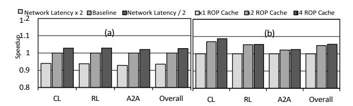

# *D. Sensitivity Analysis*

*1) Number of ROPs:* ROP count influences the CC arithmetic throughput and potentially overall bandwidth. Figure 27 shows the speedup with varying number of ROPs. Halving (32) and quartering (16) the ROP count drops performance by only 3.7% and 5.4%, respectively. This minor sensitivity to ROP count stems from the low operational intensity of CCs and the fact that throughput is network-bound as discussed in Section IV-C.

*2) Inter-GPU Latency:* We evaluate the performance of RoCC under different inter-GPU network latencies. As shown in Figure 28(a), with 2x slower and faster interconnect, RoCC exhibits a marginal performance impact, 6.5% decreased and 2.5% increased performance over the baseline. Note that network latency has a marginal but higher impact on the performance than ROP count (previous section), which aligns with our roofline analysis.

*3) RoCC with SM-side ROP:* Some architectures (e.g., ARM Mali [2], NVIDIA TU102 [36]) integrate ROP units within SMs. We evaluate RoCC's effectiveness by placing ROPs in SMs. This variant achieves 31% speedup over the baseline (Figure 29), which demonstrates our design's flexibility. However, our proposed L2-side deployment achieves higher performance with fewer ROPs, which we attribute to reduced data movement overhead than SM-side ROP.

Fig. 28: Performance with different network (a) and ROP cache (b) settings.

Fig. 29: Performance with different ROP designs

*4) Size of ROP cache:* We evaluate the performance impact of ROP cache size. As shown in Figure 28(b), RoCC achieves 4*.*8% and 5*.*5% speedups with 2x and 4x larger ROP caches. These modest gains reflect CC's streaming access pattern and infrequent data reuse.

