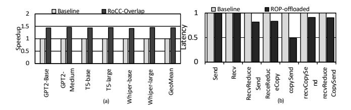
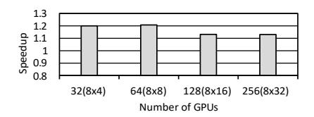

# *G. Speedup on Diverse GPU Architectures*

We evaluate effectiveness of RoCC on broader GPU architectures, by simulating NVIDIA Hopper (H100) and Blackwell (B200) GPUs besides the baseline Volta (V100) GPU. For H100, we use 24 ROPs, 132 SMs, 50 MB of L2 cache, 3.35 TBps of memory bandwidth, and 900 GBps of NVLink bandwidth. For B200, we configure two chiplets, having a total of 48 ROPs, 148 SMs, 126 MB of L2 cache, 8 TBps of memory bandwidth, and 1.8 TBps of NVLink bandwidth.

Fig. 30: End-to-end Performance (a) and per-primitive latency performance (b).

Fig. 31: Speedup on larger-scale platforms: (XxY) means Y groups of GPUs use data parallelism, where each group runs tensor parallelism with X GPUs.

Results are shown in Figure 32. Overall, RoCC consistently achieves a substantial performance benefit over the baseline in all three GPUs by fully offloading CC to ROPs. RoCC achieves additional 3% and 2% speedups on H100 and B200 compared to V100. This is because memory bandwidth has scaled faster than SM compute (10x vs. <2× from V100 to B200) and RoCC exploits this by offloading CC to ROPs, which access memory independently of SMs.

#### H. Hardware Overhead

RoCC comprises a 32-entry doorbell buffer, a 4-entry collective command buffer, primitive and collective decoders, a per-MPU doorbell manager, and a descriptor buffer. The decoders use simple lookup tables to translate each CC type into primitives and  $\mu$ Ops, while the doorbell manager arbitrates doorbells with regular memory and atomic requests. The doorbell buffer (0.75 KB), collective command buffer (66 B), and descriptor buffer (77 B), along with lookup tables (1 KB) used for collective decoder and primitive decoder, together contribute a total hardware cost of about 2.4% of an L2 slice based on CACTI v7.0 [35]. The doorbell manager takes up the area for two one-bit comparators, two 32-bit registers, a 4-bit counter, and a 4-bit comparator.

