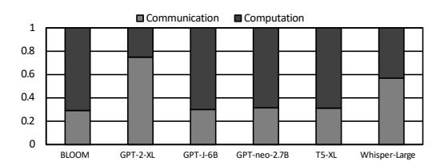
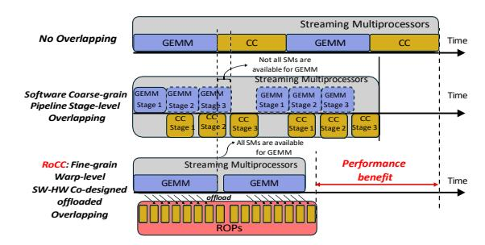
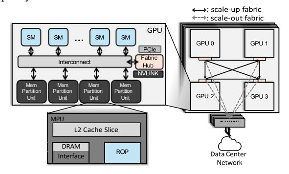
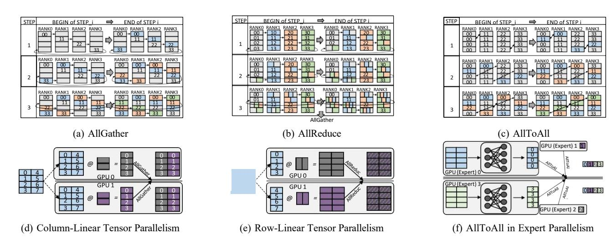
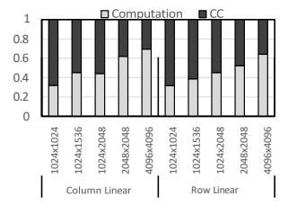
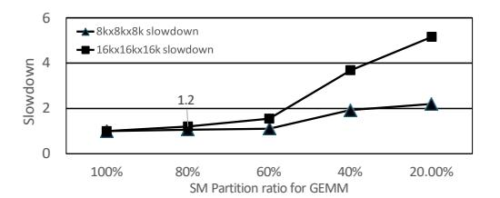
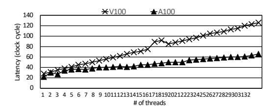
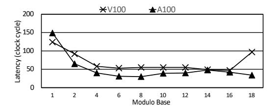

# RoCC: Harnessing Raster Operations Pipeline for Efficient Tensor Collective Communication

Yuan Feng *University of California, Merced* yfeng44@ucmerced.edu

Daniel Wong *University of California, Riverside* daniel.wong@ucr.edu

Hyeran Jeon *University of California, Merced* hjeon7@ucmerced.edu

*Abstract***—This paper introduces RoCC, which enables finegrained overlapping between compute and collective communication (CC) phases of LLM computing on GPUs, by offloading the CC to underutilized raster operations pipelines (ROPs). ROPs can provide fruitful performance for CC as they reside near the memory and have reduction computation capability. We first reverse engineer the ROP microarchitecture of two GPU architectures to model ROPs and add small logics to enable asynchronous computing and messaging for CC. We also decompose any CC operations into a sequence of ROP microoperations. In our cycle-level simulations of a 4- to 8-GPU node with LLM training workloads, RoCC delivers an average of 51% and 23% speedups over the non-overlapping baseline and oracle kernel fusion, with only 2.4% L2 cache worth of area. On larger systems with 32 to 256 GPUs, RoCC consistently achieves speedups from 13 – 21%.**

## I. INTRODUCTION

Large language models (LLMs) evolve quickly demonstrating unprecedented capabilities in language understanding, reasoning, and generation with hundreds of billions of parameters. This rapidly growing model scale has outpaced the computing and memory capacity of individual accelerators, inspiring the widespread adoption of hybrid parallelism schemes (data, tensor, and pipeline parallelism). Central to these schemes are collective communication (CC) such as *AllReduce*, *AllGather*, and *AllToAll* that synchronize activations and gradients across devices. As model sizes grow, CC increasingly dominates end-to-end latency, making communication a performance limiter of LLM training and inference.

Figure 1 presents a breakdown of the training time of six popular open-source LLMs that use a combination of pipeline and tensor parallelisms. CC contributes significantly to the total training time (between 29% and 75%) due to modern LLM's training parallelism methodology. For small models, simple data parallelism, where multiple GPUs run replicated models with each handling a subset of data and synchronizing only once per batch, was sufficient. As the infrequent synchronization latency can be overlapped with the compute phase latency, the communication cost was easily amortized. By contrast, modern LLMs often cannot use data parallelism alone due to the large model size; they use a fine-grained tensor parallelism or a mixture-of-expert (MoE) parallelism, where all GPUs collaboratively complete individual tensor or token computations, requiring frequent synchronizations via CC. As more GPUs are involved in the training, synchronization



Fig. 1: Communication-Computation breakdown with modern 2D-pipelined LLM training.

delays would further increase and dominate the overall LLM training performance.

To reduce the communication overhead, several solutions were introduced. Software-based overlapping [16], [32], [61] fuses kernels to use a subset of Streaming Multiprocessors (SMs) for CC while the remaining SMs handle general matrix multiply (GEMM) computation. While these approaches can run on off-the-shelf GPUs, they suffer from resource contention between CC and GEMM. They also require significant programming effort to design custom tiled GEMM kernels and fuse/synchronize them with CC functions. More importantly, it is challenging to do fine-grained overlapping with these approaches, which makes it inherently *difficult to hide the communication overheads completely*. To enable better overlapping without resource contention, hardwareassisted approaches [26], [44], [47], [48] were introduced, which offload CC operations to separate accelerators. While they enable the full capacity of SMs for GEMM, which is impossible in software approaches, they incur the *additional cost of adding new hardware accelerators* and interfacing them with existing GPUs. Note that these accelerators require a complete datapath to handle multi-step CC operations and issue memory/network requests independently from the GPU. Even one of the lightest designs requires tens of floating-point units and several megabytes of internal buffers [48].

We introduce *RoCC*, which enables fine-grained computecommunication overlapping without extra accelerators. Instead of adding new accelerators, we propose to extend existing GPU compute engines. Modern GPUs are equipped with various specialized engines besides the general-purpose SMs, such as tensor/matrix core, raster operations pipeline (ROP), and ray tracing accelerators. These specialized engines are designed to support a specific type of operations. To handle CC operations, the engine should be able to 1) execute reduction, 2) issue memory requests independently to SMs,

3) be available during LLM training and inference, and 4) preferably reside near memory to reduce resource contention with SMs (e.g., interconnects and caches), if possible. We propose to use ROPs for a collective engine because ROPs are the only engine that fulfill all these requirements. Sitting next to the memory partitions, ROPs are used for performing atomic operations asynchronously to the SMs while being vastly underutilized during LLM computing.

However, there are challenges to repurposing ROPs for CC. First, there is no interface to trigger CC on ROP. We enable triggering CC on ROP by adding only one intrinsic function and one instruction per CC operation. Second, ROP's operational semantics does not match collective routines. We introduce a systemic way to map any CC operations to a sequence of ROP micro-operations. Third, there is no mechanism to route the multi-step CC operations among ROPs. We design a lightweight doorbell-based messaging scheme that requires neither SMs nor CPUs for CC scheduling/routing. Fourth, each ROP can process data only within a single L2 cache slice. We assign tiles to ROPs in a cache line unit so that ROPs can process tensor tiles in its dedicated L2 slice.

Figure 2 shows the projected benefit of RoCC. RoCC outperforms coarse-grained software overlapping because all SMs can be used for GEMM, and the CC can be overlapped in a fine-grained warp level. Also, RoCC is more cost-effective than hardware solutions that use new CC accelerators because RoCC repurposes the existing ROPs. Note that we only add decoding and routing logics to support CC operations while reusing all other components in the ROP, such as ALUs, memory issue logics, cache, request queues, etc, which occupy the largest portion of the ROP. In our evaluations with six LLM models on a 4- and 8-GPU node, RoCC shows an average of 51% and 20% speedups over the baseline and an adapted stateof-the-art solution, at the cost of only 2.4% area of L2 cache. The performance scales well on state-of-the-art AI-focused GPUs. RoCC also outperforms the oracle software solution, where GEMM and CC are perfectly overlapping via sharing SMs, by an average of 23%. RoCC consistently shows 13% - 21% speedups in larger systems with 32 - 256 GPUs. Our sensitivity studies also prove the effectiveness of RoCC under significantly fewer ROPs and SM-side ROPs, with marginal speedup degradations.

Our contributions are as follows:

- To the best of our knowledge, this is the first study leveraging underutilized ROP units for CC to speed up LLM computing. RoCC demonstrates that any CC functions can be implemented with combinations of ROP operations.
- RoCC enables fine-grained compute-communication overlapping with almost zero coordination from SMs. With our novel messaging scheme, ROPs can perform the multistep CC with almost full autonomy.
- We discover undocumented ROP microarchitecture details through reverse engineering. The findings are accommodated in our design, roofline analysis, and evaluation. Our ROP roofline model justifies the usage of ROPs for CC.



Fig. 2: Projected speedup of RoCC: (1) No overlapping shows the naive approach that runs GEMM and CC kernels sequentially by time-sharing SMs between the kernels. (2) Software overlapping assigns a subset of SMs for CC, thus GEMM is executed over multiple stages. Once a GEMM stage is finished, its CC and the next GEMM stage can be overlapped. (3) On the other hand, RoCC enables higher and finer-grained overlapping because GEMM can use the full capacity of SMs and CC is offloaded to ROPs.



Fig. 3: Multi-GPU architecture


Fig. 4: Micro-architecture of MPU

#### II. BACKGROUND

## A. Multi-GPU and ROP Architecture

Figure 3 shows a multi-GPU cluster in a modern data center. Multiple GPUs are linked via fast interconnects such as NVLink and Infinity Fabric. Each GPU consists of multiple SMs. SMs are interfaced with multiple memory partition units (MPUs) via on-chip network (NoC). Each MPU consists of an L2 cache slice, a (or multiple) DRAM controller(s), and an ROP. An ROP can access data in the L2 cache slice that is in the same MPU. For graphics workloads, ROP is responsible for processing the final pixel data before it's displayed on



Fig. 5: CC operations and their usages for DL training on Multi-GPU systems: (a)-(c) show three representative CC patterns when four GPUs (ranks) are involved in the computation. (d)-(f) show the usage of each or a combination of the patterns for DL training and inference.

the screen. ROPs handle tasks like blending colors, antialiasing, depth testing, and writing pixels to the framebuffer. To take advantage of its closer proximity to L2 and memory, ROP's programmability has been extended to support atomic operations, which effectively expanded the usage of ROPs to general-purpose applications.

Figure 4 draws ROP's major components and data flow [42], [50]. The ROP data flow is initiated when the MPU receives an atomic operation request packet from the SM 1. Once the arbiter recognizes that the request is an atomic operation, not a regular L2 request 2, the request is enqueued in the atomic command buffer 3. Each cycle, the command generator dequeues one atomic command 4. To fetch the operand value, the internal ROP cache is accessed, and then L2 upon misses 3. The ROP ALU's computation results are written back to the ROP cache 6 and sent to the result sequencer to enforce atomic sequence 7. Then the results are sent to the MPU's results buffer, L2 slice, and to the requester SM 8.

## B. CC and Parallel DL Training

CC is a set of communication operations used in distributed parallel computing. CC is extensively used by deep learning (DL) training via CC libraries (e.g., NCCL, RCCL). The top three illustrations in Figure 5 show the common CC patterns in distributed DL computing with four GPU ranks.

- AllGather (Fig. 5a) allows each rank to share its local tensor and receive the concatenation of all ranks' contributions.
- AllReduce (Fig. 5b) performs an element-wise reduction across all ranks and returns the result to every participant.
- AllToAll (Fig. 5c) has each rank to send/receive distinct slices of a tensor to/from all ranks (full data redistribution).
   The bottom three diagrams in Figure 5 show the example usages of the three patterns. In column-linear parallelism (Fig. 5d), a weight matrix is split by output columns. Each rank computes on its assigned slice, which can be collected with an AllGather. Row-linear parallelism (Fig. 5e) divides the weight

matrix by input rows. Each rank produces partial outputs, which are aggregated via AllReduce. Expert (MoE) parallelism (Fig. 5f) dynamically routes token subsets to specialized subnetworks ("experts") across ranks. Expert models running on distributed GPUs perform the multi-layer perceptron (MLP) layers in parallel and distribute their outputs with AllToAll.

#### III. MOTIVATION

#### A. Inefficiencies in Executing CC on SMs

To understand the efficiency of running CC on SMs (as used in software overlapping), Figure 6a shows a roofline analysis of NVIDIA V100 GPU, considering the compute capacity of CUDA cores, memory bandwidth, and network (NVLink) bandwidth. The ring-base AllReduce in FP32 and FP16 are plotted over the model. AllReduce has several orders of magnitude lower operational intensity (≈ 0.1 FLOPs/Byte) than CUDA cores' compute capacity and performance is bounded by network bandwidth. When memory bandwidth is lower than network bandwidth, AllReduce is bound to memory bandwidth. AllGather and AllToAll are also network (or memory) bound because they have no computation; they do memory copy, concatenation, and chunking instead. For such a network/memory-bound CC computing, SMs' abundant computing resources are wasted because CC spend most of its time accessing memory and experience long latencies due to SM's distance from memory. In newer GPUs, the inefficiency worsens because compute capacity scales faster than NoC bandwidth across GPU generations [9], [29], [54].

To verify the inefficiency, we characterize CC execution at the sub-layer level. We broke down the execution time of two tensor parallelism implementations into compute and CC phases. We implemented a column- and a row-linear parallelism codes for one tensor processing by using PyTorch distributed APIs [46], which internally uses NCCL library that calls separate compute and CC kernels. Figure 6b shows the

results. Across various input sizes, CC takes 40% - 70% of the total execution time. Even with a significantly lower compute load than the computation phase, CC takes up significant time. This is because of the aforementioned inefficiency of running CC on SMs. As SMs should fetch data from memory and network to perform simple arithmetic of CC operations, the CC phase experiences extensive memory and NoC latencies when executed on SMs, as in software approaches.

#### B. Performance Impact of Sharing SMs for Compute Phases

Though SMs are not the ideal execution units for CC, as they are the only general-purpose execution units, software overlapping solutions run both CC and computation phases on SMs via spatial and temporal sharing [6], [32], [45]. To understand the performance impact of SM sharing, we measured GEMM performance while partitioning the SMs with libsmctrl [4]. As shown in Figure 7, with 80% of SMs, GEMM slows down by 20%. The performance drops exponentially with fewer SMs, showing that running CC on SMs is inefficient and negatively impacts compute phases.

#### C. ROP Utilization During CC

The results in the earlier subsection motivate us to explore a better way to execute CC on a GPU. We especially find other execution units that can 1) speed up CC by reducing memory access latency and 2) hide CC execution time through CC and compute phase overlapping. Out of several special-purpose cores in GPUs, such as tensor/matrix cores, ROP, and ray tracing accelerators, ROPs reside near the memory (Section II), and can perform various arithmetic operations and issue memory requests independently from SMs. To check the availability of ROPs for LLM computing, we profiled the utilization of ROPs while training an LLM, Qwen2-7B [3], on a server with four NVIDIA V100 GPUs connected via NVLink. We used industrial standard FlashAttention [10] with the HuggingFace library for the utilization profiling. Out of the profiled 11476 kernels, only 141 kernels issued any atomic instructions, and of those, a mere 28 were GEMM kernels. Moreover, during each GEMM execution, only ≈0.0183% were atomic operations on average. Because ROP instructions take up only tens of cycles (reverseengineered latency measurements in Section IV), the hardware remains largely idle, resulting in a limited active duty cycle.


(a) Roofline analysis of CUDA cores for AllReduce



(b) Execution time breakdown of compute and CC under tensor parallelism and various input size

Fig. 6: CC Characteristics.



Fig. 7: GEMM performance under SM partitioning


Fig. 8: ROP bandwidth over GPU generations: In AI-focused GPUs (H100, H200, and B200), ROP (atomic) bandwidth scales while graphics (pixel) throughput significantly declines.

This demonstrates that the ROPs are highly underutilized during LLM training and will be available to perform CC. ROP availability in newer GPUs: Recently, GPU architectures have specialized for either graphics (e.g., NVIDIA RTX, AMD Radeon, and Intel Arc) or AI applications (e.g., NVIDIA Hopper and AMD Instinct MI series). AI-focused GPUs reduce or remove some graphics-related components, such as ray tracing cores, texture mapping units, and graphics command processors [17], [34]. However, ROPs are kept in AI GPUs for atomic operations, while their quantities and graphics functionalities are reduced [38]. To understand the sustained availability of ROPs for CC in newer GPUs, Figure 8 benchmark five recent GPU models, including AI-specialized GPUs, H100, H200, and B200. We measured the bandwidth of atomic operations by micro-benchmarking the maximum throughput of atomicAdd operations. To verify the reduced graphics capability in AI-focused GPUs, we also plotted the pixel processing throughputs [53]. We observe that the pixel rate has decreased significantly in AI GPUs, dropping from 225.6 Giga Pixels per second (GPixel/s) on the A100 to only 47.16 GPixel/s on the H200. However, atomic bandwidth has substantially increased from 422.51 Giga Operations per second (GOp/s) on the A100 to 729.783 GOp/s on B200. This demonstrates that atomic bandwidth is decoupled from graphics capabilities. The continued ROP integration with increased memory bandwidth sustains ROP bandwidth in AIfocused GPUs. These results support ROPs usage for CC across GPU generations.

#### IV. DEMYSTIFYING ROP HARDWARE

From the observations presented in Section III, we found that ROP is a good candidate to offload the CC. As the ROP microarchitecture is not well documented, we aim to discover more details through reverse engineering.

#### A. Methodology

To understand the atomic pipeline within the ROP hardware, we wrote micro-benchmark kernels in SASS, which read the on-chip special clock counter register SR\_CLOCKLO into three CSR registers (c1, c2, and c3) before and after an atomic operation, as shown in Figure 9. RED.E.ADD is an atomic reduction instruction using addition operation. We used TuringAS [57] to assemble the kernel. We tested on two NVIDIA GPUs, V100 and A100, with driver version 570.133.20 and CUDA toolkit version 12.1.

#### B. Reverse-engineered Results

Interplay between SM and ROP: When we ran the kernel in Figure 9 with a single thread, the time gap between c2 and c3 was 1-3 clock cycles, which matches the typical register-to-register read latency (i.e., two consecutive SR\_CLOCKLO reads). Considering that individual SMs run in-order, such observation means that the atomic instruction returns immediately after the instruction command is sent to ROP. In other words, the ROP hardware performs atomic operations asynchronously from the GPU core pipeline.

```
Move Data to 12-
cache

Perform
Atomic at ROP

RED .E. ADD. F32. STRONG.GPU [input_lo+0x4], tid;

// RED returned immediately. c3-c2 = ~3cycles CSR c3, SR CLOCKLO;
```

Fig. 9: Kernel for checking interplay between SM and ROP

ROP Pipeline Latency: To ensure the completion of the atomic instruction and measure the ROP pipeline latency, we added a memory load instruction as a barrier right after the atomic operation, as shown in Figure 10. By making the load instruction read from the same address that the atomic operation is performed on, we can guarantee that the atomic operation completes before the load instruction. To estimate the ROP pipeline depth, we also compared the atomic operation latencies while increasing number of threads. We made all threads access the same address such that data can be fetched from the ROP cache, not from memory.

```
Move Data to 12 cache

Load Data from 12 Cache

Load Coache

Load Coache

Load Coache

Load Coache

Load Coache

Load Coache

Load Coache

Load Coache

Load Coache

Load Coache

Load Coache

Load Coache

Load Coache

Load Coache

Load Coache

Load Coache

Load Coache

Load Coache

Load Coache

Load Coache

Load Coache

Load Coache

Load Coache

Load Coache

Load Coache

Load Coache

Load Coache

Load Coache

Load Coache

Load Coache

Load Coache

Load Coache

Load Coache

Load Coache

Load Coache

Load Coache

Load Coache

Load Coache

Load Coache

Load Coache

Load Coache

Load Coache

Load Coache

Load Coache

Load Coache

Load Coache

Load Coache

Load Coache

Load Coache

Load Coache

Load Coache

Load Coache

Load Coache

Load Coache

Load Coache

Load Coache

Load Coache

Load Coache

Load Coache

Load Coache

Load Coache

Load Coache

Load Coache

Load Coache

Load Coache

Load Coache

Load Coache

Load Coache

Load Coache

Load Coache

Load Coache

Load Coache

Load Coache

Load Coache

Load Coache

Load Coache

Load Coache

Load Coache

Load Coache

Load Coache

Load Coache

Load Coache

Load Coache

Load Coache

Load Coache

Load Coache

Load Coache

Load Coache

Load Coache

Load Coache

Load Coache

Load Coache

Load Coache

Load Coache

Load Coache

Load Coache

Load Coache

Load Coache

Load Coache

Load Coache

Load Coache

Load Coache

Load Coache

Load Coache

Load Coache

Load Coache

Load Coache

Load Coache

Load Coache

Load Coache

Load Coache

Load Coache

Load Coache

Load Coache

Load Coache

Load Coache

Load Coache

Load Coache

Load Coache

Load Coache

Load Coache

Load Coache

Load Coache

Load Coache

Load Coache

Load Coache

Load Coache

Load Coache

Load Coache

Load Coache

Load Coache

Load Coache

Load Coache

Load Coache

Load Coache

Load Coache

Load Coache

Load Coache

Load Coache

Load Coache

Load Coache

Load Coache

Load Coache

Load Coache

Load Coache

Load Coache

Load Coache

Load Coache

Load Coache

Load Coache

Load Coache

Load Coache

Load Coache

Load Coac
```

Fig. 10: Kernel for measuring ROP latency

Figure 11 shows the results. With a single thread, the atomic instruction takes about 28 cycles on V100 and 22 cycles on A100, which we interpret as the total latency of the full datapath of the ROP pipeline and L2 to ROP cache fetch latency. With more threads, the atomic instruction latency increases by around 3 cycles on V100 and 1 cycle on A100, which accounts for the total latency of one ROP pipeline stage and an ROP cache access.

Degree of Parallelism: To check how many execution units are in ROPs, we issued atomic operations to different



Fig. 11: ROP latency reverse engineering

addresses simultaneously on the same ROP by using 32 threads in a warp, as shown in Figure 12. Compared to Figure 10, data index value was modularized to make each thread access different data points, while still accessing the same L2 cache line to remove cache miss penalty from the measurements and also enforce that all threads access the same ROP unit.

```
Move Data to L2-
cache

Load Data from L2 Cache

Load Data from L2 Cache

CSR c2, SR_CLOCKLO;

// For brevity, we omit the actual address calculation RED.E.ADD.F32.STRONG.GPU [input_lo+tid%base*0x4], tid;
LDG.E.STRONG.GPU r2, [input_lo+tid%base*0x4];

// Get Atomic Latency from (c3-c2-L2 Latency)
CSR c3, SR_CLOCKLO;
```

Fig. 12: Kernel for checking ROP parallelism

Figure 13 presents the results. X-axis shows the modulo base (divisor) value. The divisor value of one means that all threads target the same address, so all atomic operations are sequentially executed. As we increase the divisor value, the overall latency decreases because the threads targeting different address can be processed on different execution units (parallelism!). The latency becomes stable when divisor reaches four on both GPUs. This indicates that all available execution units are fully occupied. We conclude that there are four execution units that can run in parallel in an ROP. This finding aligns with PTX's maximum atomic width being four 32-bit floats [31].



Fig. 13: ROP parallelism reverse engineering

#### **Summary of findings:**

- 1. ROPs run asynchronously from SMs.
- 2. The ROP datapath latency for an atomic operation is 28 cycles and each ROP pipeline stage takes 3 cycles on V100 (22 cycles and 1 cycle, respectively on A100).
- 3. ROP pipeline supports 4-way 32-bit scalar parallelism.


Fig. 14: Roofline analysis of ROPs for AllReduce of V100 (blue) and A100 (green)

