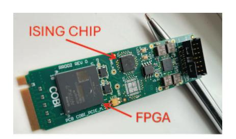

# *B. Benchmarks*

We use two benchmark families, *seen* and *unseen* (Table III). *Seen* problems are custom-crafted stress-test batches designed to probe capacity limits, while *unseen* problems are publicly available stressmarks used in prior work. Seen batches are intentionally designed to be structurally challenging, with varied clause widths and clause-to-variable ratios. Unseen batches are drawn from the publicly available SATLIB repository, which provides random 3SAT problems from the transition region, known to be hard for a wide range of solvers [28].

## *C. Hardware (Ising Machine) Testbed*

We evaluate SATIC and its bag of tricks on a representative Ising machine featuring 45 all-to-all connected spins, each corresponding to a CMOS ring oscillator operating at room temperature. The coefficient range spans [−14, +14]. Under the same hardware budget, such an all-to-all connected 45-spin chip is roughly equivalent to a 1000+ spin chip with limited

Fig. 8: Hardware testbed featuring an Ising card.

neighbor connectivity. For further details on the underlying coupled-oscillator Ising chip family, we refer readers to [20].

The Ising chip is mounted on a board integrated with an FPGA to enable PCIe communication with a host PC through the PCIe port (Fig.8). This ease of integration made over 2 billion hardware accesses possible over the course of this study. The server is equipped with an Intel(R) Xeon(R) Gold 6240R CPU running at 2.40 GHz, offering 24 physical cores and 48 threads. Using PCIe multiplexers, eight Ising cards are mounted on the server. This setup allows concurrent parallel repeats over eight Ising cards. SATIC itself, along with the bag of tricks – SATIC++ as demonstrated in Fig.7 – is implemented in Python 3.8.

There is an Ising hardware-specific step in the SATIC++ flow, encapsulated by the *Machine Embedding* block in Fig.7. SATIC++ features two hardware embedding tricks optimized for the target Ising hardware: Adaptive Spin Merging and Dynamic Upscaling. Previous work demonstrated how multiple physical spins can be merged to increase the machine coefficient range, however, only *statically* in a brute-force fashion [46]. With Adaptive Spin Merging we extend this idea to *dynamically* merge *unused* physical spins. The resulting increase in coefficient range minimizes potential accuracy loss due to coefficient rounding or scaling. Similarly, Dynamic Upscaling enhances the common practice of problem coefficient scaling to match the machine coefficient range [46] and comes in two flavors. The core idea is to adaptively determine the scaling factor either by tracking the largest coefficient or the second-largest (and capping the largest one accordingly). We apply the latter strategy when there is a large gap between the largest and second-largest coefficients.

