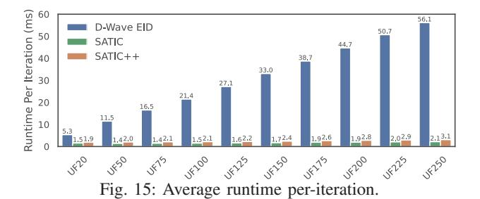
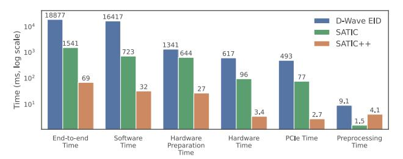

# *E. Overall Performance on Unseen Problems*

For an unbiased performance evaluation, we test SATIC++ on unseen benchmark problems from SATLIB's UF series ranging from UF20 to UF250. We run each instance with 120 independent repeats, using a fixed 50K iteration limit. Fig.12 summarizes the results.

Fig. 12: SATIC++ performance on unseen batches. *Repeats* here correspond to successful repeats.

We observe that SATIC can find solutions for instances up to UF150, while SATIC++ successfully solves all instances up to UF175, where each problem is 23× larger than the hardware capacity. For UF200, UF225, and UF250, SATIC++ solves 98, 97, and 92 out of 100 instances, respectively.

Fig.13 provides the Time to Solution (TTS). Due to the excessively long runtime of D-Wave EID, we limited the evaluation to 20 randomly selected instances per batch for D-Wave EID and SATIC, each repeated 120 times with a 50K iteration limit. In contrast, SATIC++ features very low iteration counts per solution, allowing us to experiment with all 3700 instances.

To demonstrate that SATIC++ is a hardware-agnostic global Ising/QUBO compiler for SAT, we replace the 45-spin Ising chip by D-Wave's Tabu solver [22] – a classical QUBO/Ising solver in software. Tabu accepts the same 45-variable QUBO subproblems produced by SATIC++. While the Ising chip has a limited coefficient range, it is fast (200 μs maximum annealing time) and energy-efficient (4.8 μJ per iteration). By contrast, Tabu does not have any coefficient range limitation but incurs a 20 ms timeout (maximum annealing time) and about 3.3 J energy consumption per iteration – which renders Tabu ≈ 2 orders of magnitude slower and 5 orders of magnitude less energy efficient than the Ising chip.

We observe that, while D-Wave EID fails on problems larger than 20 variables (UF20), SATIC can handle up to 150 variables (UF150). Specifically, SATIC++ successfully solves all instances up to UF175, and a total of 3,687 instances including the challenging UF250 problems (1,065 clauses, 250 variables, 3SAT), which reside near the 3SAT phase transition region. Remarkably, SATIC++ achieves this on a highly constrained 45-spin Ising chip.

Fig. 13: Time to Solution (TTS) comparison (lower is better).

## *F. Ablation Study for the Bag of Tricks*

Because SAT is NP-complete, establishing general theoretical guarantees for solver heuristics is not possible. SAT solvers therefore rely on empirically validated heuristics (e.g., WalkSAT's make/break) [63], similar in nature to our tricks. To analyze the effect of individual tricks systematically, we conduct an extensive set of experiments on two problem batches: Batch-4-50-500, a seen 50-variable 500-clause 4SAT benchmark; and UF75, an unseen 3SAT benchmark from SATLIB. Each benchmark contains 100 problem instances, and each configuration is executed for 120 independent repeats. With 23 total configurations, this results in 276,000 total runs per batch. As each run involves thousands of iterations, the total evaluation involves more than a billion hardware calls, necessitating the use of relatively small problem instances to keep the runtime manageable.

Fig.14 illustrates the individual and combined impact of different tricks. We group the experiments into three categories:

- Group A: All tricks are activated by default, and one trick is deactivated at a time to measure its contribution through performance degradation.
- Group B: All tricks are deactivated, and one is activated at a time to evaluate its isolated benefit.
- Group C: Tricks are cumulatively activated in a fixed order, showing how performance evolves as more tricks become active.

Intermediate representation and subproblem formation tricks: Baseline SATIC (configuration B0) forms subproblems in a theoretically sound way: Selecting variables on the VIG guarantees clause-completeness and ancillaryawareness (Section III). However, it does not specify *which* variables to choose for each subproblem. Purely random

Fig. 14: Ablation study. *Instance* denotes the solved-instance rate per batch; *Repeat*, the rate of successful repeats; and *Iteration*, the iteration count to solution. All values are normalized for better visualization, with 0 being the worst and 100, the best value.

choices lead to slow convergence; purely deterministic choices can adversely bias the search.

- Limited Neighbors has the largest impact, as seen from B0 vs. B2, A4 vs. A5, and C0 vs. C1. It prunes the VIG to keep only the strongest connections, so subproblems are drawn from tightly related neighborhoods rather than arbitrary variable sets. When subproblems are more representative of the original problem, downstream tricks are much more effective. The main cost is an MST-based preprocessing step on the VIG with near-linear runtime (Section V-E).
- Neighbor Shuffling randomizes the BFS traversal order to add controlled diversity. Without Limited Neighbors, the system is already highly stochastic and shuffling hurts (B0 vs. B3). With Limited Neighbors in place, shuffling helps explore alternative but still relevant neighborhoods and improves performance (C1 vs. C2).

Formulation tricks: The goal of our formulation heuristics is to maximize the quality of the SAT-to-QUBO conversion

- reducing the number of ancillary variables, utilizing the hardware coefficient range effectively, and smoothing the energy landscape.
- ILP Mix (ILP + Chancellor's) allows more problem variables to be mapped to the limited-capacity Ising hardware and generally improves solution quality (B0 vs. B4, A1 vs. A3). However, ILP-style formulations are more sensitive to negative literals, so their benefit is limited without Negative Literal Inversion (e.g., C2 vs. C3). Flat ILP Mix (Flat ILP + Chancellor's) shows a similar pattern (B0 vs. B5), trading a slightly larger ancillary count for a tighter coefficient range.
- Negative Literal Inversion (NLI) improves all formulation types used in this work by smoothing the energy landscape. NLI-1 inverts variables based on global polarity and works particularly well on 3SAT instances such as UF75 (B0 vs. B6, C3 vs. C4), while NLI-2 inverts literals based on clause width and is better suited to 4SAT benchmarks such as Batch-4-50-500 (B0 vs. B7, C3 vs. C5). Negative Literal Inversion is especially effective when combined with ILPstyle formulations.

Hardware mapping tricks: These heuristics target better use of physical spins as a constrained resource, as well as the limited machine coefficient range.

- Spin Merging helps when the QUBO formulation has large coefficients by merging multiple physical spins into one logical spin and distributing the coefficients across them (B0 vs. B8). Its benefit is most pronounced on 4SAT problems with naturally larger coefficients (Batch-05).
- (Dynamic) Upscaling pushes QUBO coefficients slightly above the hardware limit, assuming the hardware performs better with a more spread-out coefficient range. It is useful for smaller 3SAT problems like UF20, has little effect on UF75, and is harmful for large 4SAT problems like Batch-05, where coefficients already exceed the limit (B0 vs. B9).

Runtime optimization tricks: Local Search is a runtime heuristic that fully randomizes the global solution vector at fixed iteration intervals, effectively performing a quick restart without rerunning preprocessing. It helps when the restart threshold roughly matches the typical time to solution as in Batch-05 (A0 vs. A6; B0 vs. B1), but hurts when set too aggressively, as in UF75 (B0 vs. B1), where premature restarts interrupt runs that are close to convergence.

## *G. Runtime Overhead*

Fig.15 provides batch-wise averages for runtime per iteration. Without loss of generality, we consider the average of 120 repeats with 50K iterations for 10 randomly selected instances from each batch. We use the same Python 3.8 environment for all frameworks. D-Wave EID is taken from the D-Wave Hybrid package [64], following the methodology described in the official documentation [65].

We observe that the runtime of D-Wave EID scales extremely poorly with increasing problem sizes (along the positive x-axis direction) because the decomposition operations repeatedly run on the entire QUBO. As a result, even for

the smallest problem UF20, SATIC++ and SATIC are 2.8× and 3.5× faster. The gap becomes more pronounced for the largest problem, rendering SATIC++ and SATIC 18× and 26× faster. Even though the problem size increases by a factor of 12.5× from UF20 to UF250, the runtime for SATIC in its most basic form (without the bag of tricks) increases by only 1.4×; for SATIC++, by 1.6×; and for D-Wave EID, by 10.6×, respectively.

To complement the per-iteration analysis, Fig.16 reports an end-to-end runtime comparison with a timing breakdown across software and hardware components (log scale), considering UF20 with a 10K iteration limit. End-to-end time is the sum of *Software Time* (compiler overhead) *Hardware Preparation Time* (Linux driver time), *Hardware Time* (Ising hardware time), *PCIe Time* (total PCIe communication time), and *Preprocessing Time* (one-time cost of compilation).

Fig. 16: End-to-end runtime comparison with timing breakdown (log scale).

The breakdown confirms that SATIC++ substantially reduces the practical system-level overhead in addition to reducing iterations. The measured end-to-end time is 69.3 ms for SATIC++, compared to 1,540.9 ms for SATIC and 18,877.0 ms for D-Wave EID, corresponding to 22.2× speedup over SATIC and 272.4× over D-Wave EID. We also observe that D-Wave EID is dominated by software-side runtime (16,417.0 ms out of 18,877.0 ms, ≈87%), which is consistent with repeatedly performing decomposition on the full QUBO. In contrast, SATIC and SATIC++ keep both software and hardware overheads much lower by decomposing at the CNF level and reducing subproblem size before formulation.

Overall, we observe that runtime optimization tricks detailed in Section V-D are highly effective. Ancillary Estimation significantly reduces the time spent on subproblem checks – by nearly a factor of 9 – by avoiding repeated formulation. Bulk Freeze substantially decreases unit propagation time, even when accounting for its own overhead. Formulation tricks such as Clause Based Formulation Mix also help keep the runtime overhead at bay.

## VIII. RELATED WORK

Subproblem formation, i.e., problem decomposition, is the key step in mapping a SAT problem to Ising hardware. One of the most widely used decomposers is D-Wave's qbsolv, which partitions large QUBOs into smaller sub-QUBOs and solves them iteratively using energy-based heuristics [50]. Refinements to this method include accounting for problem sparsity and the target hardware's connectivity to enable larger problems [62].

Hybrid decomposers utilize classical solvers such as Tabu Search to guide subproblem selection, which can improve solution accuracy at the expense of higher runtime overhead for problem decomposition [66]. Decomposition methods such as divide and concur and regional belief propagation [67] can help D-Wave quantum annealers solve problems up to 5× larger than those allowed by the Ising hardware's capacity.

Another decomposer uses a multi-level coarsening approach, which compresses the QUBO graph into super-nodes and progressively refines the solution through uncoarsening [68]. Meanwhile, task-specific decomposers tailored for problems like bin-packing [69] and max-cut [70] leverage domain-specific structures to boost efficiency and scalability. Aside from decomposition, a quantum annealer can also be used to accelerate a SAT solver, as demonstrated in [71].

In contrast to SATIC, most decomposers operate at the QUBO level, after the SAT problem is transformed into QUBO form. While generic QUBO-based decomposers like qbsolv offer broad applicability, more effective solutions often come from structure-aware or CNF-aware approaches like SATIC that directly leverage the original problem formulation.

## IX. CONCLUSION

Recent advancements in Ising machines position them as highly promising hardware accelerators for Boolean satisfiability (SAT), a classical combinatorial optimization problem with numerous practical use cases. While SAT is notoriously difficult to solve on conventional von Neumann systems, realizing the potential of Ising machines requires effectively bridging the gap between the inherent structure of SAT problems and the architectural characteristics of Ising machines. In this paper, we present SATIC, a novel optimizing compiler equipped with a bag of heuristic tricks, designed to address this challenge.

We provide a comprehensive quantitative performance characterization as well as a comparison to representative alternatives using a significant number of non-trivial SAT problem instances. Most importantly, our study uses a fabricated Ising chip as its hardware testbed. We thereby demonstrate that SATIC enables the Ising hardware to solve SAT problems up to 73× larger than its native capacity. As Ising hardware continues to evolve, practical problem mapping frameworks like SATIC will play a central role in bridging the application– hardware gap.

