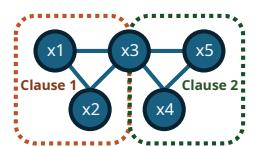
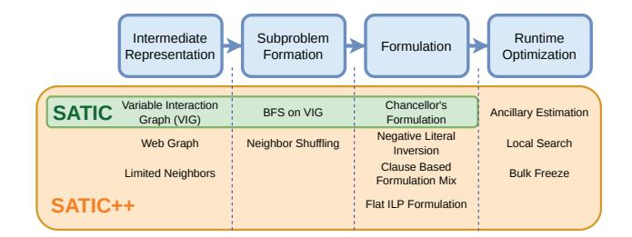
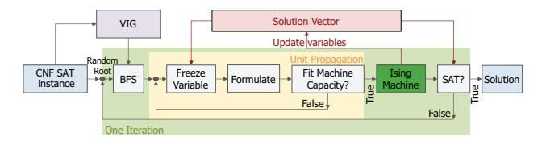
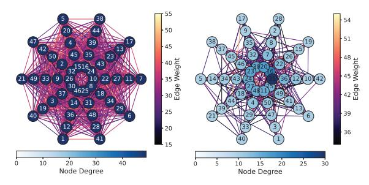

# SATIC: An Optimizing Ising Compiler for SAT(isfiability)

Ahmet Efe, Husrev Cılasun, Abhimanyu Kumar, Nafisa S. Prova, Ziqing Zeng, Tahmida Islam, Ruihong Yin, ¨ Chaohui Li, Peter Kreye, Chris H. Kim, Sachin S. Sapatnekar, Ulya R. Karpuzcu *University of Minnesota, Twin Cities* {efe00002, ukarpuzc}@umn.edu

*Abstract*—Ising machines show great potential as hardware solvers for combinatorial optimization problems such as Boolean Satisfiability (SAT) – one of the hardest classic problems of practical importance. Unlocking this potential, however, is only possible by bridging the gap between SAT problem characteristics and Ising machine specifics. In this paper, we introduce a novel optimizing compiler featuring a bag of powerful heuristic tricks, SATIC, toward this goal. We evaluate SATIC on a representative manufactured Ising chip. Our measurements show that SATIC enables Ising machines to solve up to 73× larger SAT problems than the hardware capacity would otherwise allow, demonstrating unmatched performance and scalability.

*Index Terms*—Ising model, Boolean satisfiability, SAT, QUBO, Ising machines, optimizing compiler, problem decomposition.

## I. INTRODUCTION

Boolean Satisfiability (SAT) is one of the classic combinatorial optimization problems (COPs) with a wide range of real-world applications ranging from software verification [1], hardware verification [2], computational biology [3], and financial modeling [4] to AI [5]. In general terms, each COP seeks to identify values for a discrete set of variables that minimize (or maximize) a given objective function defined over that variable set. While SAT represents one of the hardest problems in theoretical computer science – belonging to the complexity class *NP-complete* and being the very first problem proven to be NP-complete [6], its relevance continues to grow as more real-world problems are expressed in SAT terms [7]–[19].

By construction, classic von Neumann architecture-based solvers cannot effectively solve SAT at scale. Based on a fundamentally different operating principle, physics-inspired hardware solvers, *Ising machines*, have emerged as promising alternatives. The idea is to map the global minima of a COP to the minimum energy states of a physical system incorporating interacting discrete bodies, termed *Ising spins*. In this model, Ising spins represent problem variables; interspin connections, correlations or interactions between problem variables as imposed by problem constraints. The Ising machine naturally stabilizes at a minimum energy state upon perturbation. Therefore, we can engineer these systems such that as the machine converges to a minimum energy state, with high probability, it approaches a solution to a given COP.

Ising machines differ from each other primarily in the technology used to implement spins, which can range from conventional CMOS oscillators [20] to superconducting qubits [21]. Technology choice governs the maximum possible number of spins that a machine can support, i.e., the *machine capacity*, as well as the maximum degree of connectivity between spins. Machine capacity and connectivity limits may look different across technology choices; however, a limit does exist for each technology, which directly poses a challenge for problem mapping:

- (i) Problem constraints translate into specific types of correlations or interactions between problem variables, which cannot always be easily captured by an Ising machine due to limited machine (spin-to-spin) connectivity. Ising machines model inter-spin correlations or interactions by actual physical interspin connections.
- (ii) The problem size and hence the number of problem variables – in emerging optimization problems of practical importance keeps increasing; however, the number of spins in an Ising machine (to match problem variables) cannot increase indefinitely due to physical limits. Inevitably, problems must be chunked into subproblems to fit the machine capacity.

This gives rise to a fundamental gap between *characteristics of practical combinatorial optimization problems* – including SAT as a representative example – and *capabilities of Ising solvers in hardware*. To unlock the full potential of Ising machines, it is imperative to bridge this gap through innovation in optimizing compilers for Ising machines, which is the scope of our paper.

The first step in mapping a problem to an Ising solver is *mathematical formulation*, which entails translating problem variables and constraints into Ising parameters. This is followed by *subproblem formation*, as imposed by Ising machine limitation (ii). *Mathematical formulation*, especially in the presence of Ising machine limitation (i), typically introduces extra variables (that do not correspond to problem variables), mainly to enforce problem constraints, which results in a larger and often harder problem than the original. This further complicates the subsequent *subproblem formation* step.

In this paper, we introduce SATIC, a novel, lightweight, and modular compiler framework designed to efficiently map generic SAT problems to emerging Ising machines. The core idea behind our design is to perform *subproblem formation* directly on the problem's original structure – before mathematical formulation, in contrast to common practice. This constitutes the key novelty of our work, complemented by a set of heuristic techniques that enable and optimize this process.

Key components of SATIC are a graph-based intermediate representation native to SAT problems that helps maintain structural fidelity; an efficient problem decomposer to extract subproblems that match the Ising machine capacity; and a runtime to orchestrate subproblem processing until the system converges to an optimal solution.

SATIC features a bag of powerful heuristic tricks to maximize problem mapping efficiency, thereby enabling Ising machines to solve up to  $73\times$  larger SAT problems than the hardware capacity would otherwise allow, demonstrating unmatched performance and scalability. SATIC is compatible with a broad range of Ising machine architectures, as well as Ising solvers implemented in software [22], [23]. In a nutshell, this paper

- Identifies explicit correctness conditions ancillaryawareness and clause-completeness, respectively – for SATto-Ising compilation, and characterizes the pathologies that arise when these conditions are violated.
- Introduces SATIC, a novel SAT-to-Ising compiler flow that enforces these conditions by construction and that enables problem scaling beyond raw Ising hardware spin capacity.
- Extends SATIC to SATIC++ with novel heuristics across the system stack, demonstrating up to 73× effective capacity scaling on a 45-spin CMOS Ising chip.

In the following, Section II covers the background; Section III, challenges in Ising compiler design; Section IV, the basics of SATIC; Section V, SATIC's bag of tricks; Sections VI and VII, evaluation; Section VIII, related work; and Section IX, a summary and discussion of our findings.

### II. BACKGROUND

### A. SAT(isfiability) Basics

SAT is after finding an assignment to Boolean variables that makes a given formula true. It was the first problem proven to be NP-complete [6], and many fundamental problems can be encoded as SAT instances [24]. As a result, SAT has become a standard model in areas such as formal verification [7]–[11], bioinformatics [12], cryptanalysis [13]–[16], and neural network verification [17]–[19].

The standard representation for SAT formulae is *Conjunctive Normal Form* (CNF): A conjunction of *clauses*, where each clause is a disjunction of *literals*, and where a literal is either a variable x or its negation  $\neg x$  [25]. A CNF instance is satisfiable if every clause evaluates to true. We denote by kSAT the class of SAT problems where each clause contains exactly k literals. Any kSAT clause with k > 3 can be converted to an equivalent set of 3SAT clauses in polynomial time.

Another common representation for structural analysis of SAT instances is *Variable Interaction Graph* (VIG) [26], whose nodes are variables and whose edges connect variables that appear together in at least one clause.

Random SAT problems are uniformly randomly generated instances. Their hardness depends on the clause-to-variable ratio and is maximized in the *transition region* [27]. Random SAT problems in this region are challenging for various types of solvers and commonly used as stressmarks [28].

#### B. Ising Machines

The *Ising model* [29]–[31] describes a system of spins  $s_i \in \{-1, +1\}$  with energy

$$H(s) = -\sum_{i < j} J_{ij} s_i s_j - \sum_i h_i s_i, \tag{1}$$

where  $J_{ij}$  encodes pairwise couplings and  $h_i$  encodes local fields. Physical Ising systems tend to relax toward low-energy configurations; the goal in computation is to find (or approximate) a ground state that minimizes H(s).

Ising machines are engineered systems that exploit this relaxation behavior to solve combinatorial optimization problems, including SAT. Spins can be realized using quantum hardware such as superconducting qubits or Rydberg atoms [32]–[35], or using classical electronics such as coupled oscillators and CMOS-based annealers [36]–[38]. Lucas showed that all 21 of Karp's NP-complete problems [24] can be written as Ising Hamiltonians [39]. In particular, SAT can be encoded by mapping Boolean variables to spins; and clauses, to appropriate inter-spin interactions so that satisfying assignments correspond to low-energy states.

#### C. Mathematical (Ising/QUBO) Formulation of SAT

A common alternative to the Ising formulation is *Quadratic Unconstrained Binary Optimization* (QUBO), which uses binary variables  $x_i \in \{0,1\}$  instead of spins. Over a vector  $x \in \{0,1\}^n$ , the QUBO energy is

$$H(x) = x^{\top} Q x, \tag{2}$$

where Q is a real-valued  $n \times n$  matrix [40]. QUBO is isomorphic to the Ising model via the transformation  $s_i = 2x_i - 1$  [39], enabling SAT instances to be converted seamlessly between Ising and QUBO representations [41]–[43].

In SAT-to-QUBO formulations, the energy is constructed so that each clause contributes a fixed penalty when unsatisfied and a fixed reward otherwise [44]. Achieving this typically requires introducing *ancillary* variables that do not correspond to original SAT problem variables. Ancillary variables increase the size of the QUBO/Ising instance and directly reduce the maximum SAT problem size that can fit on hardware. Approximate formulations that reduce ancillary usage can improve capacity but may distort clause energy symmetry and harm solution quality.

Different SAT-to-QUBO formulations exist, which differ from each other in how they trade (formulation) accuracy for ancillary overhead [43]–[45]. For 3SAT, *Chancellor's formulation* offers a good balance, mapping an n-variable, m-clause instance to n+m spins [42], [46]. For kSAT with k>2, applying a kSAT-to-3SAT conversion followed by Chancellor's formulation yields n+m(2k-5) spins. More compact alternatives exist for kSAT, such as the ILP-based formulation in [46], which uses  $n+m\log_2(k)$  spins for k>2.

When a direct formulation exceeds hardware capacity, *decomposers* split the problem into smaller subproblems that fit on the target machine. Classical SAT solvers also use decomposition, but mainly for performance through parallelism

TABLE I: QUBO Hamiltonian  $H_{C1}$  for clause  $C_1 = (x_1 \lor x_2 \lor x_3)$  from Eq.(3). Last two columns specify the minimum possible  $H_{C1}$  and the corresponding  $a_1$  value.

|   |       |       |       |       | $H_{\epsilon}$ | C1      |                |                        |
|---|-------|-------|-------|-------|----------------|---------|----------------|------------------------|
| i | $x_1$ | $x_2$ | $x_3$ | $C_1$ | $a_1 = 0$      | $a_1=1$ | $\min(H_{C1})$ | $arg min_{a_1} H_{C1}$ |
| 0 | 0     | 0     | 0     | 0     | 0              | 2       | 0              | 0                      |
| 1 | 0     | 0     | 1     | 1     | -1             | 0       | -1             | 0                      |
| 2 | 0     | 1     | 0     | 1     | -1             | 0       | -1             | 0                      |
| 3 | 0     | 1     | 1     | 1     | -1             | -1      | -1             | {0,1}                  |
| 4 | 1     | 0     | 0     | 1     | -1             | 0       | -1             | 0                      |
| 5 | 1     | 0     | 1     | 1     | -1             | -1      | -1             | {0,1}                  |
| 6 | 1     | 1     | 0     | 1     | -1             | -1      | -1             | {0,1}                  |
| 7 | 1     | 1     | 1     | 1     | 0              | -1      | -1             | 1                      |

or simplification [47]–[49]. In contrast, Ising-oriented decomposers are designed to restructure the problem specifically to meet the spin count and connectivity constraints of Ising hardware [46], [50].

#### III. ISING COMPILER DESIGN: CHALLENGES

The potential of Ising machines as promising alternatives to classical SAT solvers can only be enabled by efficient *problem mapping*, a multi-step process which we refer to as *Ising compilation* by forming an analogy to classical compilers. Inefficiency in compilation can easily undermine the utility of Ising machines if the time spent for problem mapping (in software) significantly exceeds the time spent in finding a solution (in hardware) [51].

#### A. Variable Selection in Subproblem Formation

SAT-to-QUBO conversion (Section II-C) introduces ancillary variables which do not correspond to actual problem variables. Consider the QUBO (Chancellor's) formulation of an example 3SAT clause  $C_1 = (x_1 \lor x_2 \lor x_3)$ , where  $a_1$  represents a binary ancillary variable:

$$H_{C_1}(x_1, x_2, x_3) = \min_{a_1 \in \{0, 1\}} \left[ -x_1 - x_2 - x_3 + x_1 x_2 + x_1 x_3 + x_2 x_3 - a_1(x_1 + x_2 + x_3 - 2) \right]$$
(3)

The solver now has to find a suitable assignment to the ancillary variable  $a_1$ , as well as the problem variables  $x_1$ ,  $x_2$ ,  $x_3$ , such that the QUBO energy  $H_{C1}$  assumes its minimum value for any assignment to  $(x_1, x_2, x_3)$  rendering C1 = 1. Table I reports C1 and  $H_{C1}$  values, considering all assignments to  $(x_1, x_2, x_3)$  indexed by i. We observe that  $C_1$  is satisfied (=1) for i=1 to 7. Accordingly, the assignment to  $a_1$  must guarantee that  $H_{C1}$  assumes its minimum value for i=1 to 7. A fixed  $a_1$  cannot always guarantee that  $H_{C1}$  assumes its minimum value for i = 1 to 7. For example, if  $a_1$  is fixed to 0 (column 6 in Table I), satisfying assignment i = 7 would render the same energy  $H_{C1}$  as the only unsatisfying assignment i = 0, distorting the alignment of the Hamiltonian energy landscape with the original problem's objective function. For hard SAT instances in the transition region where solutions are sparse, such distortion can significantly reduce the probability of finding a correct solution and impede convergence.

In principle, ancillary values should not be fixed. However, ancillary-unaware subproblem formation can unintentionally




- (a) Before formulation
- (b) After formulation

Fig. 1: Visual representation of the example from Eq.(6).

assign a fixed value to an ancillary – by forming subproblems that include problem variables but exclude the clause-specific ancillary. As an illustrative example, consider the QUBO formulation for the clause  $C_2 = (\neg x_3 \lor x_4 \lor x_5)$ :

$$H_{C_2}(x_3, x_4, x_5) = \min_{a_2 \in \{0, 1\}} \left[ -(1 - x_3) - x_4 - x_5 + x_4 x_5 + (1 - x_3)x_5 + (1 - x_3)x_4 - a_2((1 - x_3) + x_4 + x_5 - 2) \right]$$

$$(4)$$

Assume that we have the following problem in CNF form:

$$F = C_1 \wedge C_2 = (x_1 \vee x_2 \vee x_3) \wedge (\neg x_3 \vee x_4 \vee x_5)$$
 (5)

This yields the QUBO objective:

$$H_{\rm F}(x_1, x_2, x_3, x_4, x_5) = H_{C_1}(x_1, x_2, x_3) + H_{C_2}(x_3, x_4, x_5)$$
(6)

Five problem  $(x_1, x_2, x_3, x_4, x_5)$  and two ancillary  $(a_1, a_2)$ variables in Eq.(6) require 7 Ising spins. The variable interaction graph in Fig.1a (Fig.1b) visualizes the problem structure for CNF (QUBO) representations. Let us assume that the target Ising machine only has 4 spins, hence can accommodate only 4-variable subproblems, where the problem from Fig.1b features 7 variables. Even for this small example, there are  $\binom{7}{4} = 35$  ways to choose a 4-variable subproblem. Among these, only the selections  $(x_1, x_2, x_3, a_1)$  and  $(x_3, x_4, x_5, a_2)$ keep each clause objective intact. In contrast, a subproblem with  $(x_1, x_2, x_3, x_4)$  excludes both  $a_1$  and  $a_2$ . Before solving a subproblem, solvers must set excluded variables to fixed values - this is the only way for the subproblem to capture interactions between selected and excluded variables. Hence, by excluding the ancillary variables as such, we can no longer guarantee that the solver optimizes the intended per-clause objective from Eq.(3) and Eq.(4).

This is a fundamental shortcoming for generic subproblem formation. State-of-the-art approaches prioritize selection of higher degree variables (i.e., variables interacting with many others). A higher degree implies a higher energy (H) impact. In 3SAT, however, by construction, ancillaries tend to have lower degree (they interact only with the variables of their clause) and are therefore more likely to be excluded from subproblems – distorting the alignment of the Hamiltonian energy landscape with the original problem's objective function. We quantify this effect in Section VII.

Ancillary-awareness: In forming a subproblem, each ancillary variable must be grouped with the actual problem variables in its respective clause to align the Hamiltonian energy landscape with the original problem's objective function. State-of-the-art approaches, including D-Wave's highly optimized absolv [50], [52], overlook this.

#### B. Clause Selection in Subproblem Formation

QUBO formulation introduces energy reward and penalty terms at the clause granularity to guide convergence to a solution. Therefore, subproblem formation must consider clauses in their entirety – including ancillary variables – rather than randomly picking variables across clauses until reaching the target variable count (subproblem size). This guarantees ancillary-awareness, but another challenge emerges: For each variable x, QUBO solvers typically prioritize an assignment x=v ( $v\in\{0,1\}$ ) that maximizes the number of satisfied clauses containing x. This can be thought of as a majority vote across all clauses included in the respective subproblem that contain x. Accordingly, if some subset of clauses containing x are excluded from a subproblem, the suggested assignment x=v may become biased.

Consider the example from Eq.(5) and assume that the target Ising machine has 4 spins. To preserve **ancillary-awareness**, we can form two 4-variable subproblems by considering clauses in their entirety: One with  $(x_1, x_2, x_3, a_1)$  for  $C_1$  and one with  $(x_3, x_4, x_5, a_2)$  for  $C_2$ . Each subproblem gets solved independently, but they share the variable  $x_3$ . The assignment to  $x_3$  in the solution to the first subproblem (satisfying  $C_1$ ) can very well conflict with the assignment to  $x_3$  in the solution to the second subproblem, because each subproblem includes only a subset of the clauses containing  $x_3$  and not all.

As each clause encodes a constraint, not considering all clauses in subproblem formation directly translates into not considering all constraints on any selected variable. Enforcing clause-completeness, however, can increase subproblem size.

Clause-completeness: If a variable is selected in forming a subproblem, all clauses containing that variable should be included such that the full set of constraints on that variable get considered during variable assignment. Otherwise, different subproblems may optimize different subsets of clauses and produce conflicting assignments to the same variable, which can slow down or prevent convergence.

#### IV. SATIC: MACROSCOPIC VIEW

The mismatch between practical problem sizes (in terms of the number of variables) and Ising machine capacity (in terms of the number of spins) makes problem decomposition into subproblems inevitable. Subproblems must be formed in a way that each fits the underlying Ising machine. However, this is not sufficient for correctness. **Ancillary-awareness** (Section III-A) and **clause-completeness** (Section III-B) set the correctness conditions for variable and clause selection during subproblem formation. Our optimizing Ising compiler



Fig. 2: SATIC in a nutshell with the complete bag of tricks. for SAT, SATIC, enforces **ancillary-awareness** and **clause-completeness** by construction, from the ground up. To the best of our knowledge, SATIC is the first framework that enforces both properties to enable unmatched practical scalability.

A key initial step in mapping a problem to an Ising solver is mathematical formulation, which introduces ancillary variables that do not correspond to actual problem variables (Section II). Ancillary-awareness as well as clause-completeness constrains how ancillary variables must be handled during subproblem formation. The native representation for SAT problems is CNF. Mathematical formulation typically entails conversion from CNF to QUBO. The core idea behind SATIC, contrary to common practice, is to perform variable selection to form subproblems before mathematical formulation (i.e., conversion to QUBO) takes place, using the native (CNF) problem representation that does not (and cannot) have any ancillary variables by construction. SATIC. SATIC features a bag of powerful heuristic tricks to efficiently implement this core idea, as summarized in Fig.2.

SATIC's intermediate representation for orchestrating variable selection is based on Variable Interaction Graphs (VIG). After selecting variables at the CNF-level, SATIC assigns fixed values to (i.e., *freezes*) the unselected variables and simplifies the resulting CNF through *unit propagation* [53]. This effectively reduces the number of variables per clause in the subproblem, which, after mathematical formulation, results in fewer ancillary variables by definition. Subproblems formed by SATIC therefore become more likely to match the Ising machine capacity. SATIC makes **ancillary-awareness** automatic; and **clause-completeness**, much easier to satisfy.

For example, considering the example problem in Eq.(5) under a 4-spin Ising hardware limit, SATIC would form subproblems by selecting variables at the CNF level – say  $(x_1,x_2,x_3)$  – and by assigning fixed values to the unselected variables  $(x_4=0 \text{ and } x_5=0)$ . The original CNF then reduces to the subproblem CNF  $(x_1\vee x_2\vee x_3)\wedge (\neg x_3)$ , which fits the 4-spin hardware after formulation: The first clause introduces one ancillary variable; while the second, single-variable clause remains intact after formulation. This preserves ancillary-awareness, as well as clause-completeness because the subproblem formed before formulation contains all clauses including selected variables.

Algorithm 1 and Fig.3 provide a closer look into SATIC:

(1) Generate the VIG, where nodes represent variables and an edge exists between two variables if they share a clause



Fig. 3: SATIC Flow.

(Line 13). Fig.1a shows an example VIG.

- (2) Initialize the *global solution vector* (Line 14). Any assignment can work here, including random assignments.
- (3) Pick a random root variable on the VIG (Line 16) and perform breadth-first search (BFS) to generate a list of variables L ordered by their distance to the root (Line 17).
- (4) Formulate the problem in QUBO form (Line 31) and check the problem size (Line 32). If the problem size exceeds the Ising machine capacity (Line 33), start a loop.
- (5) Pick a variable to *freeze* from the bottom of the variable list *L* (generated in Step (3)), remove it from the list, and apply unit propagation. Freezing entails picking a predetermined value for the respective variable from the *global solution vector* (Line 34), which serves as a running container for partial solutions as the algorithm progresses.
- (6) Reformulate (Line 35) and check the subproblem size (Line 36). If the size still exceeds the Ising machine capacity, return to Step (5) to freeze another variable.
- (7) If the subproblem size matches the Ising machine capacity, send the subproblem to the Ising machine (Line 19).
- (8) Retrieve the solution from the Ising machine and update the global solution vector with the subproblem (local) solution (Line 21).
- (9) Check if the global solution vector satisfies the original problem (Line 22). If it does, the algorithm terminates successfully (Line 24). If not, return to Step (3), and continue until either a solution is found or the maximum iteration limit is reached.

In summary, SATIC ensures ancillary-awareness automatically by constructing subproblems at the CNF-level, before QUBO formulation. Since variable selection takes place at the CNF-level, where no ancillary variables exist yet, there is practically no way to leave them out during subproblem formation. At the same time, through the BFS traversal of the VIG and unit propagation, SATIC guarantees clausecompleteness by ensuring that all clauses involving a selected variable are included in the subproblem. Freezing unselected variables effectively reduces the literal count per clause, which leads to fewer ancillary variables during subproblem-to-QUBO conversion, leaving more room for actual problem variables. Oftentimes, 3SAT clauses reduce to 2SAT or 1SAT clauses, which require no ancillary variables. Since unit propagation has linear time complexity [54], the time complexity of SATIC (Algorithm 1) becomes O(TL) for a CNF with L literals over T iterations.

Using the pre-formulation VIG for variable selection reduces the cost of graph traversal significantly. For example, a representative, nontrivial 50-variable/200-clause 3SAT prob-

#### Algorithm 1 SATIC: Macroscopic View

```
1: Input: SAT formula in CNF (residing in CNF.file)
 2: Output: Global solution vector and SAT status
     # Q_{\text{sub}}: Subproblem after formulation (QUBO)
    # Q_{\text{sub}}.size: Subproblem size after formulation
 5:
     # S_{global}: Global solution vector
 6: # S_{\text{sub}}: Subproblem solution vector
    # max.var: Variable count in CNF
 8: # machine.capacity: Target Ising machine capacity
     # max.iter: Maximum permissible number of iterations
10:
     procedure SATIC(CNF.file, max.iter)
         CNF, max.var \leftarrow ReadCNF(CNF.file)
12.
13:
          VIG \leftarrow CreateGraph(CNF)
          S_{\text{global}} \leftarrow \text{RandomAssignment}(\text{max.var})
14.
15:
          while iteration<max.iter do
16:
              root \leftarrow Randint(1, max.var)
17:
              var.list \leftarrow BFS(VIG, root)
18:
              Q_{\text{sub}} \leftarrow \text{UnitProp}(\text{CNF}, \text{max.var}, \text{var.list}, S_{\text{global}})
19.
              S_{\text{sub}} \leftarrow \text{IsingHardware}(Q_{\text{sub}})
20:
              # Update the global solution with the subproblem solution
21.
               S_{\text{global}} [\dots] \leftarrow S_{\text{sub}}
22:
              SAT \leftarrow CheckSolution(CNF, S_{global})
              if SAT is true then
23.
                   break
25.
              end if
26:
          end while
27:
         return (S_{global}, SAT)
28: end procedure
29:
     procedure UNITPROP(CNF, max.var, var.list, S_{global})
30:
31:
          Q_{\text{sub}} \leftarrow \text{Formulate}(\text{CNF}, \text{max.var})
32.
          Q_{\text{sub}}.\text{size} \leftarrow \text{CheckSize}(Q_{\text{sub}})
33:
          while Q_{\text{sub}}.size > machine.capacity do
34.
              CNF_{sub} \leftarrow VarFreeze(CNF, var.list, S_{global})
35:
              Q_{\text{sub}} \leftarrow \text{Formulate}(\text{CNF}_{\text{sub}}, \text{max.var})
36:
              Q_{\text{sub}}.\text{size} \leftarrow \text{CheckSize}(Q_{\text{sub}})
37:
         end while
38:
          return Q_{\text{sub}}
39: end procedure
```

lem from the transition region becomes a 250-variable QUBO problem under Chancellor's formulation – which incurs as many variables as the number of original problem variables plus the number of clauses (Section II-C). All of these 250 variables must be considered for variable selection if subproblem formation is deferred until after formulation. SATIC, on the other hand, only deals with a 50-node VIG in this case for variable selection. A clause-to-variable ratio of  $\approx 4$  demarcates the transition region for 3SAT (k=3), which can reach  $\approx 10$  for 4SAT (k=4) [55]. Accordingly, SATIC's efficiency gets more pronounced for larger k.

## V. SATIC: MICROSCOPIC VIEW

We next detail SATIC's bag of tricks (Fig.2), which builds on the core framework introduced in the previous section for higher performance and scalability.

## A. Intermediate Representation Tricks

SATIC uses the Variable Interaction Graph (VIG) to iteratively select subproblem variables and constructs a VIG once for


Fig. 4: Weighted VIG representation for Eq.(7).

each SAT problem when compilation starts. We introduce edge weights to standard VIGs, where each weight reflects how many times two variables co-occur within the same clause. Fig.4 provides an example for the CNF SAT instance:

$$(x_1 \vee \neg x_2) \wedge (\neg x_1 \vee x_2) \wedge (x_1 \vee \neg x_2 \vee x_3) \tag{7}$$

SATIC's first heuristic trick, Limited Neighbors, prunes the weighted VIG by retaining only the top N most strongly connected neighbors for each variable, using edge weights. N is a parameter pre-determined based on the size of the target Ising machine. This ensures that variable neighborhoods reflect the most structurally relevant interactions during subproblem selection.

The heuristic begins by constructing a *Maximum Spanning Tree (MST)* of the weighted VIG, prioritizing the highestweight edges to preserve full graph connectivity while discarding all other connections. A refinement step follows the MST construction, iterating over each node and incrementally restoring previously discarded edges, in descending order of weight, up to the pre-specified per-node neighbor limit N. This two-step procedure balances global connectivity with locally important structure.

In dense kSAT instances, particularly for higher values of k, variable degrees can easily exceed the subproblem-size limits imposed by the machine capacity. Limited Neighbors is particularly effective in such cases because it distills only the most meaningful connections for each variable. At the same time, by compressing the VIG, Limited Neighbors can significantly accelerate iterative BFS traversals during subproblem formation.

Visualizing SAT instances to uncover structural properties such as connectivity (which directly captures inter-variable correlations) is a common practice [56]–[58]. Building on this tradition, we introduce the Web Graph, a SATIC-native VIG visualization, with examples shown in Fig.5. Web Graph arranges SAT variables radially, placing the most densely connected variables at the center; the least, along outer arcs. Node colors encode connectivity density; edge colors, co-occurrence frequency of variables in the same clause. Web Graph makes dense or sparse regions, bipartitions, or unconnected variables immediately visible to guide the user in SATIC's downstream optimization passes.

## *B. Subproblem Formation Tricks*

To select subproblem variables, SATIC performs BFS starting from a randomly picked root variable on the VIG by default. As variables adjacent in the VIG tend to be more strongly correlated, including them in the same subproblem results in better performance. There may be multiple, equally eligible



(a) Before Limited Neighbors (b) After Limited Neighbors

Fig. 5: Web Graph visualization of a representative 50 variable, 2700-clause 6SAT problem, before (a) and after (b) Limited Neighbors with <sup>N</sup> = 10.

variables to pick from at each BFS level, which the default flow does not consider. Neighbor Shuffling is an effective heuristic trick to avoid any potential bias induced by such cases. The idea is randomly permuting the adjacency list at each BFS level in different iterations.

## *C. Formulation Tricks*

SAT-to-QUBO formulation efficiency directly affects solver performance. SATIC uses three heuristic tricks – all performed after subproblem formation, before QUBO formulation – to maximize formulation efficiency.

The first trick, Negative Literal Inversion, is designed to reduce unintended local energy traps induced by the formulation. Standard formulations such as Chancellor's typically use the transformation <sup>¬</sup><sup>x</sup> → (1−x) for negative literals – as, for example, depicted in Eq.(4). While this preserves clause-based energy penalty-reward semantics, it may cause the resulting QUBO coefficients to be slightly different for clauses with more positive literals vs. clauses with more negative literals. Such coefficient differences can distort the energy landscape, which may potentially lead to local minima and make finding the global solution harder for the Ising machine.

Negative Literal Inversion can be thought of as some form of renaming that takes place after subproblem formation and before QUBO formulation. If a variable appears mostly as a negative literal in the subproblem, we invert its polarity such that it becomes a positive literal in the QUBO formulation. The number of variables or clauses remains intact otherwise. Once the corresponding subproblem is formulated as a QUBO instance, sent to the Ising machine, and solved, we revert the inverted literals to the original SAT representation.

The second trick, Clause Based Formulation Mix, aims to reduce the number of ancillary variables induced by the formulation, by fusing different SAT-to-QUBO formulations at the clause level. After subproblem formation at the CNF-level, SATIC typically renders a mix of low-k clauses over a range of k. The idea behind Clause Based Formulation Mix is using a formulation optimized for the clause-specific k for each such subproblem clause. Specifically, SATIC fuses clauses generated by Chancellor's and ILP formulations. As detailed in Section II-C, in terms of ancillary variable overhead,


Fig. 6: Bulk Freeze Flow.

Chancellor's is more efficient for  $k \le 3$ ; ILP, for k > 3. By using the more efficient formulation for each clause, **Clause Based Formulation Mix** can significantly reduce the ancillary variable count in each subproblem, effectively increasing the problem size a limited-capacity Ising machine can handle.

In ILP (Chancellor's) formulation, the energy reward – the contribution of each satisfied clause to the objective function to be minimized – is 0 (-1); the energy penalty per unsatisfied clause, +1 (0). While the energy reward/penalty ranges are different, both formulations have the same spectral energy distance, i.e., they preserve the problem structure, rendering their clause-level combination mathematically safe. Clause Based Formulation Mix works particularly well with Negative Literal Inversion.

Similar to classical systems, Ising machines cannot increase machine precision indefinitely, which imposes a limit on the QUBO coefficient ranges. This effect is more pronounced for the standard ILP formulation, where the weights of ancillary variables grow by powers of 2 by construction. For example,  $2a_2 + 1a_1$  applies for the ancillaries of a 4SAT clause (k = 4);  $4a_3 + 2a_2 + 1a_1$ , for the ancillaries of a 7SAT clause (k = 7). While ILP formulation incurs a lower number of ancillary variables than Chancellor's for larger k, the coefficient range is wider, which may stress the underlying Ising machine. The third trick, Flat ILP formulation, addresses this by selectively replacing each ILP ancillary with multiple ancillary variables of lower weight without compromising ILP's original energy reward/penalty semantics. Using this trick in the example 7SAT clause,  $4a_3 + 2a_2 + 1a_1$  under the standard ILP formulation becomes  $2a_4 + 2a_3 + 2a_2 + 1a_1$ , balancing ancillary count with coefficient range.

#### D. Runtime Optimization Tricks

SATIC also features several runtime optimization tricks: Ancillary estimation reduces SATIC's runtime by avoiding repeated (sub)QUBO formulations that are only used to check whether a subproblem fits the target Ising machine. When capacity is predictable, we estimate (sub)QUBO size directly from the (sub)CNF by counting clause widths (k). For a given formulation, we precompute ancillary overhead in a small lookup table indexed by k and use this table during subproblem formation. For example, Chancellor's formulation uses roughly (2k-5) ancillaries per kSAT clause. Without ancillary estimation each size check would trigger fullfledged translation of a subproblem to QUBO, where ancillary estimation only uses a linear-time scan over the subproblem CNF per check.

Local Search is a heuristic trick to escape local minima by randomly shuffling the values in the global solution vector


Fig. 7: SATIC++: SATIC flow with the entire bag of tricks.

(Algorithm 1) after a preset number of iterations without a solution. In most such cases, **Local Search** represents a lighter-weight, equally effective alternative to a hard restart, and is customizable according to the needs of specific problem instances.

**Bulk Freeze** (Fig.6) is a runtime optimization that streamlines SATIC's unit propagation. In the default flow, SATIC freezes variables one at a time and reruns unit propagation after each freeze until the resulting subproblem fits the target machine. **Bulk Freeze** reduces this overhead by learning, from an initial iteration, a typical number of variables *B* to be frozen, and then speculatively freezing *B* variables at once in later iterations. Because the number of spins required by a subproblem can vary across iterations, the bulk-frozen subproblem may still exceed the hardware capacity or may under-utilize it. In such cases, **Bulk Freeze** falls back to one-by-one refinement around *B*. This preserves adaptability while avoiding many repeated unit-propagation passes.

TABLE II: Time complexity.

| Component / Heuristic           | Complexity              | Hyperparameters |
|---------------------------------|-------------------------|-----------------|
| SATIC (baseline, no heuristics) | O(TL)                   | _               |
| Limited Neighbors               | $O( E \log V )$         | $\overline{N}$  |
| Neighbor Shuffling              | O( V + E )              | _               |
| Negative Literal Inversion      | $O(L_s)$                | _               |
| Clause Based Formulation Mix    | $O(m_s)$                | _               |
| Ancillary Estimation            | $O(L_s)$                | -               |
| Bulk Freeze                     | $O(L_s)$                | -               |
| Local Search                    | O(n)                    | $T_{\rm LS}$    |
| SATIC++ (overall)               | $O(TL) + O( E \log V )$ | $N, T_{\rm LS}$ |

