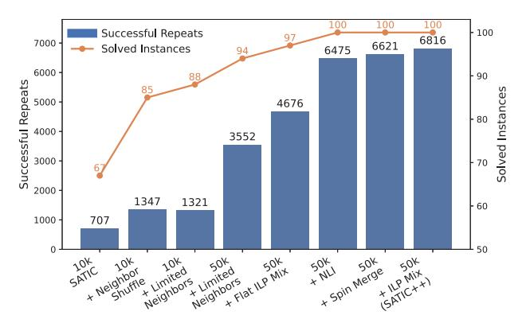

# VII. EVALUATION

## *A. Stress Test*

To evaluate SATIC, we consider two configurations: SATIC, the bare compiler without heuristics, and SATIC++, the full compiler with all heuristics enabled. We focus on a particularly challenging benchmark: Batch-4-100-1000, containing 100 4SAT instances with 100 variables and 1000 clauses, and yielding a clause-to-variable ratio of 10, which lies in the transition region [55]. These problems are dense and structurally complex, hence, ideal for stress-testing. The equivalent QUBO sizes become ≈3100 variables with Chancellor's formulation, and 2100 with ILP. This renders a problem variableto-hardware spin ratio of 69× – 47× on the Ising chip. The

| Category                      | Type   | Benchmark        | k | n   | m    | Instance Count | Solved Instances | Ratio |
|-------------------------------|--------|------------------|---|-----|------|----------------|------------------|-------|
|                               | seen   | Batch-4-50-500   | 4 | 50  | 500  | 100            | 100              | 23.3  |
|                               | seen   | Batch-4-100-1000 | 4 | 100 | 1000 | 100            | 100              | 46.7  |
| CRAFTED - QUIET PLANTING [61] | seen   | Batch-4-125-1300 | 4 | 125 | 1300 | 50             | 50               | 60.6  |
|                               | seen   | Batch-4-150-1570 | 4 | 150 | 1570 | 50             | 50               | 73.1  |
|                               | seen   | Batch-4-175-1800 | 4 | 175 | 1800 | 50             | 40               | 83.9  |
|                               | seen   | Batch-2-50-60    | 2 | 50  | 60   | 100            | 100              | 1.1   |
| CRAFTED - AI PLANNING [61]    | seen   | Batch-3-50-275   | 3 | 50  | 275  | 100            | 100              | 7.2   |
|                               | seen   | Batch-3-50-300   | 3 | 50  | 300  | 100            | 100              | 7.8   |
|                               | unseen | UF20             | 3 | 20  | 91   | 1000           | 1000             | 2.5   |
|                               | unseen | UF50             | 3 | 50  | 218  | 1000           | 1000             | 6.0   |
|                               | unseen | UF75             | 3 | 75  | 325  | 100            | 100              | 8.9   |
|                               | unseen | UF100            | 3 | 100 | 430  | 1000           | 1000             | 11.8  |
|                               | unseen | UF125            | 3 | 125 | 538  | 100            | 100              | 14.7  |
| SATLIB - UNIFORM RANDOM [28]  | unseen | UF150            | 3 | 150 | 645  | 100            | 100              | 17.7  |
|                               | unseen | UF175            | 3 | 175 | 753  | 100            | 100              | 20.6  |
|                               | unseen | UF200            | 3 | 200 | 860  | 100            | 98               | 23.6  |
|                               | unseen | UF225            | 3 | 225 | 960  | 100            | 97               | 26.3  |
|                               | unseen | UF250            | 3 | 250 | 1065 | 100            | 92               | 29.2  |

TABLE III: SAT Benchmark characteristics and a summary of performance results. Naming for seen batches follow *Batchk-n-m* convention, where k denotes the clause width; n, the number of problem variables; and m, the number of clauses. *Ratio* depicts the relative size of the problem (in QUBO form with the best possible formulation incurring the least number of ancillary variables) with respect to the Ising machine capacity.

high density – 4000 literals per instance – demands aggressive optimization in both decomposition and hardware embedding.

Fig.9 provides a quantitative characterization. The left yaxis captures the number of successful repeats; the right yaxis, the number of solved instances. We first set the iteration limit to 10,000 and evaluate the basic SATIC flow using a simple local search strategy that restarts the system at regular intervals. Then, 67 out of 100 instances in Batch-4-100-1000 yield at least one successful solution. However, our goal is to achieve full coverage across all instances.

Fig. 9: SATIC vs. SATIC++.

Neighbor Shuffling introduces structural diversity in subproblem selection and improves the number of solved instances from 67 to 85. Node degrees in Batch-4-100-1000 can reach 80, while the Ising chip can only handle subproblems with around 20 variables per iteration. This means that even with Neighbor Shuffling, selecting 20 variables from 80 potential neighbors becomes effectively random, which may degrade subproblem quality.

Limited Neighbors limits each node's neighbors to the ones with top 10 strongest connections – approximately half the hardware capacity. This forces the BFS traversal to explore deeper, structurally relevant areas of the graph, and Limited Neighbors thereby increases the number of solved instances from 85 to 88. However, the total number of successful repeats drops slightly from 1,347 to 1,321, indicating that some of the previously solvable instances became harder to solve due to reduced local redundancy.

We next increase the iteration limit from 10,000 to 50,000. This further raises the number of solved instances from 88 to 94 and boosts the successful repeat count significantly from 1,321 to 3,552. While not a heuristic trick in itself, increasing the iteration budget simply enables more opportunities for convergence to a solution.

Chancellor's formulation leads to very large coefficients, many of which get capped to match the hardware coefficient range, leading to accuracy loss. The situation is even worse with the standard ILP formulation. Flat ILP generally helps in this case. However, both ILP and Flat ILP perform poorly on 2SAT clauses, which frequently emerge after unit propagation. Clause Based Formulation Mix combines Flat ILP for higher-width clauses with Chancellor's for 2SAT cases, and thereby increases the number of solved instances from 94 to 97; and the successful repeat count, from 3,552 to 4,676.

We further observe that subproblems with a high number of negative literals often lead to suboptimal solutions on the Ising hardware. Applying Negative Literal Inversion (NLI) to address this increases the number of solved instances from 97 to 100; and the total number of successful repeats, from 4,676 to 6,475. With this core set of tricks, we are able to solve all instances in Batch-4-100-1000.

There is still room for improvement. Specifically, we realize

that SATIC with this core bag of tricks does not always generate subproblems large enough to fully utilize the available physical spins on the Ising hardware. Adaptive Spin Merging practically balances (unused) spin count with coefficient range, on demand, carefully considering the coefficient distribution of each problem instance, which in turn increases the number of successful repeats from 6,475 to 6,621 – particularly helping harder instances.

The final improvement comes from revisiting the formulation. Specifically, instead of mixing Flat ILP and Chancellor's, we combine the standard ILP with Chancellor's. ILP typically introduces larger coefficients that risk being capped and degrading accuracy, which Adaptive Spin Merging successfully addresses. As a result, with this combination, the number of successful repeats increases from 6,621 to 6,816 – the best performance for this batch.

Fig. 10: Scalability analysis. *50K–100K* on the x-axis demarcates the respective iteration limit (time budget) per batch, which grows with batch size for a fair comparison. *Ratio* captures the problem variable-to-hardware spin ratio, as reported by the last column in Table III.

## *B. Scalability Analysis*

Fig.10 reports the performance of SATIC++ for larger SAT problems. The left y-axis captures the number of successful repeats; the right y-axis, the number of solved instances. As we move in the positive x-direction, problem sizes grow significantly (Table III). We observe that SATIC++ can successfully solve all problem instances up to Batch-4-150-1570, which corresponds to problems 73× larger than our 45-spin Ising hardware. Any batches larger than this (Batch-4-175-1800 as a proxy) – while still partially solvable – exhibit significantly lower repeat success rates. We conservatively set Batch-4-175- 1800 as the upper bound for SATIC++'s practical scalability.

