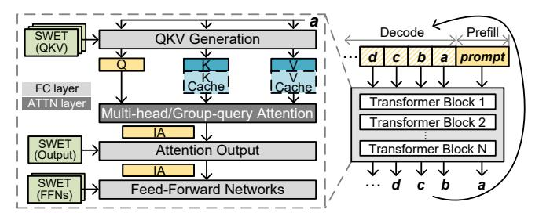

# *A. Generative LLM Inference*

LLM Structure and the Prefill/Decode Phase. Generative Dense or Mixture-of-Experts (MoE) [19], [48], [79] LLMs comprise Transformer decoder blocks [8]. Each block features Feed Forward Network (FFN) and Multi-Head (MHA) or Grouped-Query (GQA) [2] attention (ATTN) layers, depicted in Fig. 1. The auto-regressive inference consists of *prefill* phase, processing all prompt tokens in parallel using GEMM, and *decode* phase, generating one token at a time using previous tokens and stored context [71], mainly relying on the more memory-bandwidth-intensive GEMV.

Model Deployment and Runtime Execution. Distributed LLM inference in clusters typically employs pipeline, tensor and sequence parallelism [6], [80], along with batching. For

Fig. 1: LLM structure (Dense) and the data categories.

pipeline parallelism, *micro batch size* is the number of requests handled by a pipeline stage at a time and *system batch size* is the product of micro batch size and pipeline depth. *System throughput* measures total system output tokens per time window, improved by larger micro batch sizes that enhance Weight reuse. In contrast, *per-user throughput*, defined as the reciprocal of the Time Between Tokens (TBT), decreases with larger batches for increased per-iteration computation.

Data Categories. Generative LLM inference involves three key data categories: Weight, intermediate activations (IA), and dynamically updated key-value caches (KVCache) from the QKV Generation layer (Fig. 1) during each decode step to avoid recomputation. While Weight and IA resemble traditional DNNs, KVCache grows rapidly with sequence length and batch size, dominating memory in long-context scenarios [110]. These categories exhibit distinct heterogeneity in volume, access patterns, and write intensity, informing hybrid memory design (detailed in Sec. III-B).

