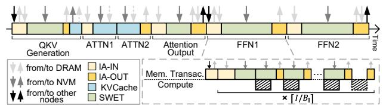
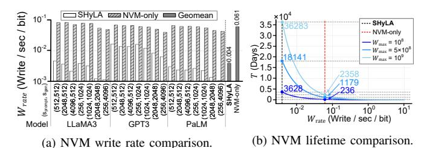

# B. Architecture Abstraction and SHyLA Analytical Model

Each MCM chiplet is modeled as a compute die comprising a unified MAC array and three unified buffers for input, weight, and output (the latter two sized as the Table IV values multiplied by the tile number). Each compute die is paired with hybrid memory devices characterized by capacity and effective read/write bandwidth, derived from hardware bandwidth scaled by utilization (Sec. III-A). This abstraction forms the foundation of the SHyLA analytical model.



Fig. 8: SHyLA analytical model.

The SHyLA analytical model represents LLM workloads as GEMM/GEMV sequences with double buffering to overlap computation with Weight/KVCache loading, as illustrated in Fig. 8, excluding the tail computation (dashed block) for simplicity. This assumption is validated by simulations showing that unmasked compute stalls on the critical path contribute less than 20% to the total runtime. To estimate intra-chiplet execution time, we consider the GEMM in Fig. 6b, with IA-IN/OUT in DRAM and Weight in NVM. The execution time  $T_{\rm intra}$  (in cycles) of GEMM is:

$$T_{\text{intra}} = \left\lceil \frac{I}{B_{\text{I}}} \right\rceil \cdot \left[ \frac{B_{\text{I}} \cdot J \cdot IA\_bw}{DRAM\_BW \cdot util_{\text{DRAM\_RD}}} + \left\lceil \frac{K}{B_{\text{K}}} \right\rceil \cdot \left( \frac{J \cdot B_{\text{K}} \cdot Weight\_bw}{NVM\_BW \cdot util_{\text{NYM\_RD}}} + \frac{B_{\text{I}} \cdot B_{\text{K}} \cdot IA\_bw}{DRAM\_BW \cdot util_{\text{DRAM\_WR}}} \right) \right]$$
(2)

where bw denotes the byte-width of each data category,  $B_{\rm I}/B_{\rm K}$  are the tiling factors defined in Sec. V-A, DRAM/NVM-BW. represent the DRAM/NVM hardware bandwidth (Byte/cycle), and util indicates the achieved read/write bandwidth utilization. Simulations show the bandwidth-utilization-centric dataflow attains 90% utilization for DRAM read/write, 70% for NVM read, and 10% for NVM write due to high write latency. These values are adopted in our analytical model.

Our dataflow mandates inter-chiplet communication at the outputs of Attention Output and FFN2 layers (Fig. 6a). Using

the Dense model structure as a representative case, tensor parallelism induces two communications per Transformer block. Pipeline parallelism communicates only at the end of the last block in a stage, and these transfers can overlap with tensor communication, differing only in targeting next-stage chiplets. The inter-chiplet communication overhead for each Transformer block is modeled as  $T_{\text{inter}}$  (in cycles):

$$T_{\text{inter}} = \frac{2 \cdot I \cdot d \cdot ACC\_bw \cdot (1 - \frac{1}{p_{\text{t}}})}{ICNT\_BW} + \frac{2 \cdot I \cdot d \cdot IA\_bw \cdot (1 - \frac{1}{p_{\text{t}}})}{ICNT\_BW}$$
(3)

where  $ACC\_bw$  is the byte-width of IA partial sums and  $ICNT\_BW$  (Byte/cycle) is the interconnect bandwidth. Each chiplet gathers partial sums from peers, accumulates locally, and then broadcasts its partition to reconstruct the full IA. This communication overhead is minimal in later evaluation.

The end-to-end latency is estimated by accumulating the intra- and inter-chiplet execution times across all inference iterations for a given configuration.

#### C. SHyLA Two-Stage DSE Methodology

The hybrid memory and deployment design space together constitute an expansive SHyLA design space, making an exhaustive search for the throughput-optimal design under peruser constraints costly even with analytical models. Additionally, the selected design must deliver consistent performance across diverse models to ensure hardware generalization. To address this, we propose a two-stage DSE methodology, comprising a system-throughput-oriented heuristic-based stage to determine the configurations for hybrid memories, followed by a per-user-throughput-constrained evolutionary exploration.


Fig. 9: SHyLA two-stage DSE methodology.

Stage 1: System-Throughput-Oriented Heuristic-Based Hybrid-Memory-Configuration Determination. As shown in Fig. 9 left, Stage 1 takes four inputs: (1) LLM workload specifications, (2) fixed architecture parameters, (3) hybrid memory configurations, and (4) heuristic deployment configurations. (2-4) is listed in Table II. This stage selects the hybrid memory design point that maximizes system throughput, with batch size determined by memory capacity, while keeping deployment settings fixed heuristically. The hybrid memory space in Table III is then exhaustively searched, with system throughput estimated from SHyLA analytical model.

TABLE III: SHyLA DSE Parameters

| Area-Ratio-<br>(NVM, DRAM)                                                                                             | (1.8, 0.2), ( <b>1.6, 0.4</b> ), (1.2, 0.8), (1, 1), (0.8, 1.2), (0.4, 1.6), (0.2, 1.8) |
|------------------------------------------------------------------------------------------------------------------------|-----------------------------------------------------------------------------------------|
| NVM-(BW., CAP.) <sup>a</sup>                                                                                           | {(138, 0.5), ( <b>112, 1</b> ), (59, 2)} (GB/s, GB)                                     |
| DRAM-(BW., CAP.)                                                                                                       | \[ \{ (138, 0.125), (112, 0.25), (59, 0.5)\} \] (GB/s, GB)                              |
| PD                                                                                                                     | {0 (aggregation), 1 (disaggregation)}                                                   |
| b                                                                                                                      | $ [1,b_{\max}]^{\mathrm{b}}$                                                            |
| $p_{\mathrm{p}},p_{\mathrm{t}},p_{\mathrm{e}}, \ prefill-p_{\mathrm{p}},prefill-p_{\mathrm{t}},prefill-p_{\mathrm{e}}$ |                                                                                         |

<sup>&</sup>lt;sup>a</sup> This is the bandwidth-capacity trade-off of one memory plane.

To determine the hybrid memory configuration for a 16-chiplet system, we adopt PD aggregation with  $(p_t, p_p) = (8, 2)$  as a heuristic, since PD aggregation avoids Weight duplication and a higher  $p_t$  enables larger micro batch sizes than higher  $p_p$ , improving system throughput before batch size saturation in moderate-scale systems. We evaluate 6 MHA+Dense model workloads, and select configurations maximizing geomean system throughput, yielding an optimal design as highlighted in Table III (per-chiplet 4-Hi NVM capacity is computed as  $4 \times \frac{1.6}{1.6+0.4} \times 20 \times 1 = 64$  GB; NVM/DRAM capacities and bandwidths are derived similarly in Table V).

Insight: Stage 1 reveals an optimal 4:1 NVM-to-DRAM area ratio combining a balanced bandwidth-capacity trade-off in NVM with a DRAM configuration optimized for bandwidth. This design prioritizes NVM area allocation since Weight operations—the dominant runtime component—benefit from both larger capacity (better Weight reuse with larger micro batch sizes) and higher bandwidth. KVCache reads depend solely on bandwidth, and NVM's capacity-driven gains saturate once on-chip buffering becomes the bottleneck, after which area is best spent on bandwidth. Meanwhile, excessive DRAM area reduction risks IA bandwidth bottlenecks during prefills or large batches, so DRAM retains minimal capacity for IA storage while dedicating the rest to bandwidth.

Stage 2: Per-User-Throughput-Constrained DSE with Evolutionary Algorithm (EA). As shown in Fig. 9 right, Stage 2 performs per-user-throughput-constrained DSE based on the optimal hybrid memory design from Stage 1, enforcing the SLO-derived per-user throughput constraint. An evolutionary algorithm with Top-K selection (Algorithm 1) searches for configurations that maximize system throughput while satisfying the constraint. The search direction adapts dynamically: when the constraint is met, it prioritizes higher system throughput (e.g., larger b or PD = 0); otherwise it shifts toward improving per-user throughput (e.g., smaller b or larger  $p_t$ ).

We evaluate the two-stage DSE using GPT3-175B (Table VI) with  $(s_{\text{prompt}}, s_{\text{gen}}) = (1024, 1024)$  and DSE settings (N, G, K) = (15, 10, 5), under a constraint of  $T_{\min}^{\text{user}} = 25$  tokens/s/user. Our method selects a configuration within the top 0.3% of system throughput across the exhaustive hybrid memory and deployment design space (Table III), using fixed parameters from Table IV. Generalization of the selected configuration to other workloads is discussed in Sec. VII-E. Leveraging our simplified analytical model alongside the

heuristic-based Stage 1 DSE and the evolutionary algorithm in Stage 2, the execution times are approximately 3 minutes and 8.5 minutes, respectively. These results, obtained on a 96-core Intel Xeon Gold 5418Y machine, demonstrate a practical runtime overhead suitable for real-world deployments.

#### **Algorithm 1** EA of Per-User-Throughput-Constrained DSE

```
Require: Population size N, Top-K system throughput set size K,
     Per-user throughput constraint T_{\min}^{\text{user}}, Generation limit G
Ensure: Top-K config. with highest system throughput
 1: Initialize Population \mathcal{P} = \{c_1^1, c_2^1, \dots, c_N^1\} with random deploy-
     ment parameters, Top-K performance set \mathcal{T} = \emptyset, Evaluated
     config. set \mathcal{C} = \emptyset
 2: for generation g = 1 to G do
          Evaluate each c_i^g: obtain system throughput T_i^{\mathrm{sys}} and per-user
     throughput T_i^{user}
           Record evaluated config.: C \leftarrow C \cup P
 4:
 5:
           for each c_i^g \in \mathcal{P} do
 6:
                \mathcal{P}_{\text{new}} = \emptyset
                if T_i^{\text{user}} \geq T_{\min}^{\text{user}} then
 7:
                     \mathcal{T} \leftarrow \text{UpdateTopK}(\mathcal{T}, c_i, T_i^{\text{sys}})
 8:
                     Set evolution direction: increase T^{\text{sys}}
 9:
10:
                     Set evolution direction: decrease T^{\text{user}}
11:
12:
                Generate offspring c_i^{g+1}, \mathcal{P}_{\text{new}} \leftarrow \mathcal{P}_{\text{new}} \cup \{c_i^{g+1}\}
13:
14:
           end for
          \mathcal{P} = \mathcal{P}_{new}
```

## VII. EVALUATION

#### A. Methodology

16: **end for** 

17: return  $\mathcal{T}$ 

Simulation Configuration. The compute and memory dice occupy  $400 \text{mm}^2$  each, and PCM is selected as the NVM prototype due to its high density, inherent 3D-stackability, and proven commercial maturity (e.g., Intel Optane), ensuring that its manufacturing readiness and process characteristics are better aligned with DRAM. Memory bandwidth and capacity are derived via CACTI-3DD [11], assuming shared peripheral circuitry and an NVM cell density  $4\times$  that of DRAM [74]. The TSV pitch is set to  $10~\mu\text{m}$  following manufacturing practice [58], and inter-chiplet bandwidth follows a scaled NVLink model for A100 [63]. Detailed configurations are listed in Table IV.

TABLE IV: Simulation Configuration

| System         | Chiplet number: 16, PD aggregation ( $PD$ =0), $p_p$ : 2, $p_t$ : 8, $p_e$ : 8, Interconnect bandwidth (ICNT_BW): 429GB/s [63], Interconnect energy: 8pJ/bit [14], IA_bw/ACC_bw/KVCache_bw: 2, Weight_bw: 1, TSV pitch: $10\mu$ m, TSV energy: $0.167pJ/bit$ [11] |
|----------------|-------------------------------------------------------------------------------------------------------------------------------------------------------------------------------------------------------------------------------------------------------------------|
| Compute<br>Die | Tech.: 7nm, Chiplet area: 400 mm <sup>2</sup> , Tile number: 20, Freq.: 1GHz, FP16 MAC_Width: 32, MAC_Lane_Num: 32, MAC_Tree_Num/tile: 4, FP16 MAC energy: 0.2pJ/MAC [31], [86], Global input buffer: 4MB, Weight buffer/tile: 1.2MB, Output buffer/tile: 100KB   |
| DRAM           | Tech.: 25nm [61], 4 layers, Cell density: 1×, Freq.: 541MHz [93] tCL:14, tWR:9, tRCD:14, tRP:14 [10], [89], RD./WR. energy: 2.1/1.41pJ/bit [44], BG. energy: 70.31mW/GB [46]                                                                                      |
| NVM            | PCM, 4 layers, Cell density: 4× [74], Freq.: 541MHz [93] tCL:14, tWR:1000, tRCD:120, tRP:14 [10], [89], RD./WR. energy: 3.4/17.84pJ/bit [44], BG. energy: 4.23mW/GB [25]                                                                                          |

 $<sup>^{\</sup>mathrm{b}}$   $b_{\mathrm{max}}$  is the maximum micro batch size supported by system memory.

 $<sup>^{\</sup>mathrm{c}}$  If PD=0, prefill- $p_{\mathrm{e}}=$  prefill- $p_{\mathrm{p}}=$  prefill- $p_{\mathrm{t}}=0$ .

TABLE V: System Configuration Comparison

|                                  | H800         | MI300X            | DRAM-only   | NVM-only    | SHyLA                  |
|----------------------------------|--------------|-------------------|-------------|-------------|------------------------|
| Die <sup>a</sup> Number          | 8            | 4                 | 16          | 16          | 16                     |
| Area (mm <sup>2</sup> )          | 814          | b                 | 400         | 400         | 400                    |
| Memory<br>Capacity (GB)          | HBM2e:<br>80 | HBM3:<br>192      | DRAM:<br>40 | PCM:<br>80  | DRAM: 2<br>PCM: 64     |
| Bandwidth (GB/s)                 | 2000         | 5300              | 1180        | 2240        | DRAM: 552<br>PCM: 1792 |
| On-chip Buf. (MB)<br>FP16 TFLOPS | ∼80<br>756   | $\sim 300$ 1307.4 | 30<br>163.8 | 30<br>163.8 | 30<br>163.8            |

<sup>&</sup>lt;sup>a</sup> "Die" refers to either a GPU card or a DSA chiplet in this table. All other specifications are reported on a **per-die** basis.

**Simulation Method.** We model single-chiplet memory access using GPGPU-Sim [36] as chiplets run identical workload partitions in parallel (PD aggregation) or within prefill/decode instances (PD disaggregation), with inter-chiplet communication calculated separately. CUDA [60] manages on-chip buffering and implements the target mapping strategy. GPGPU-Sim's address mapping in memory controller is modified to distribute consecutive addresses across channels for higher bandwidth utilization. Channel count is adjusted to reflect hardware bandwidth derived from CACTI-3DD [11], and DRAM/NVM parameters are configured according to data access behavior of the workload. Our simulation focuses on request-level interactions between the compute die and memory controller, using the bandwidth and timing parameters in Table IV and V as the primary modeling targets. For energy evaluation, we use Table IV parameters with performance simulation statistics and conduct coarse thermal analysis via 3D-ICE [85].

Evaluated Systems. We implement SHyLA system using the optimal hybrid memory design point discussed in Sec. VI-C, with specifications highlighted in Table III. We compare SHyLA against both DSA and GPU baselines, with configurations summarized in Table V. For DSA baselines, we evaluate DRAM-only and NVM-only configurations under identical area constraints, selecting their bandwidth-capacity tradeoffs to maximize geomean throughput. Die area is chosen as the primary normalization metric because it represents a fundamental manufacturing practicality limit and physical cost constraint. In 3D-stacked architectures, area serves as the "currency" designers trade to scale either bandwidth or capacity. Both baselines employ the same deployment and buffering strategies as SHyLA. For GPUs, we evaluate (1) an 8× NVIDIA H800 [20] cluster matched to the compute-die area of a 16-chiplet SHyLA and (2) a  $4\times$  AMD MI300X [4] cluster. Both GPU results use vLLM [43] with continuous batching and PagedAttention. All systems store Weights in INT8 and keep the KVCache, IA, and partial sums in FP16, while MAC operations are performed in FP16.

**Workloads.** As summarized in Table VI, we evaluate five representative LLMs, including LLaMA3 70B [55], GPT3 175B [9], PaLM 540B [13], Mixtral 8×22B [1], and Grok1 314B [96], which cover small, medium, and large model scales and various model structures to assess scalability and sensitivity. Prompt and generated sequence lengths span 256 to 32768. Continuous batching [101] is applied for PD aggregation with

at most one prefill request per micro batch, and the full model is assumed to reside within an MCM package.

TABLE VI: Model Configuration for Evaluation

| Model   | Param. | MHA/GQA | Dense/MoE | L   | H  | d     | $d_{\rm FFN}/d_{\rm Expert}$ |
|---------|--------|---------|-----------|-----|----|-------|------------------------------|
| LLaMA3  | 70B    | GQA     | Dense     | 80  | 64 | 8192  | 28672                        |
| GPT3    | 175B   | MHA     | Dense     | 96  | 96 | 12288 | 49152                        |
| PaLM    | 540B   | GQA     | Dense     | 118 | 48 | 18432 | 73728                        |
| Mixtral | 141B   | GQA     | MoE       | 56  | 48 | 6144  | 16384                        |
| Grok1   | 314B   | MHA     | MoE       | 64  | 48 | 6144  | 32768                        |

## B. Peak System Throughput Analysis

This section analyzes peak system output token throughput under the maximum batch size, determined by reserving memory for Weight and IA and allocating the remainder to KVCache. System throughput is evaluated via total runtime to process a fixed number of requests.

Fig. 10 illustrates the runtime breakdown for four DSA configurations, where *SHyLA-D* denotes the SHyLA system without applying the bandwidth-utilization-centric dataflow introduced in Sec. V-B. *SHyLA* achieves speedups of up to 5.84× (2.02× geomean) over *DRAM-only* and up to 6.03× (1.76× geomean) over *NVM-only*. Table VII reports system output token throughput of the GPU baselines (*H800* and *MI300X*) and the DSAs across the representative workloads from Fig. 10, while also specifying the batch sizes for the DSAs. These performance gains over the GPUs and *DRAM-only* stem from *SHyLA*'s larger micro batch size support, which reduces Weight reloads. Conversely, improvements over *NVM-only* result from DRAM filtering IA write traffic. Various workload characteristics further influence these runtime trends.

TABLE VII: Batch Size and System Output Token Throughput of Representative Workloads\*

| Work-      | В       | atch Siz                   | e            | Syste  | System Output Token Throughput (tok/s) ↑ |        |        |               |              |  |  |  |
|------------|---------|----------------------------|--------------|--------|------------------------------------------|--------|--------|---------------|--------------|--|--|--|
| load<br>ID | SHyLA   | DRAM-<br>only              | NVM-<br>only | SHyLA  | SHyLA-D                                  | H800   | MI300X | DRAM-<br>only | NVM-<br>only |  |  |  |
| 0          | 1333    | 813                        | 1631         | 6312.0 | 5977.1                                   | 1475.6 | 2191.9 | 4865.5        | 1616.4       |  |  |  |
| 1          | 666     | 406                        | 815          | 4495.2 | 4182.4                                   | 999.3  | 1371.7 | 4221.2        | 1568.2       |  |  |  |
| 2          | 533     | 325                        | 652          | 2061.4 | 1968.1                                   | 551.0  | 797.2  | 1735.1        | 665.4        |  |  |  |
| 3          | 296     | 180                        | 362          | 674.0  | 547.9                                    | 311.9  | 411.8  | 588.4         | 314.4        |  |  |  |
| 8          | 180     | 62                         | 247          | 936.8  | 856.3                                    | 190.6  | 273.7  | 752.5         | 400.8        |  |  |  |
| 9          | 90      | 31                         | 123          | 705.7  | 534.9                                    | 99.1   | 164.7  | 401.2         | 326.2        |  |  |  |
| 10         | 72      | 25                         | 98           | 304.7  | 249.8                                    | 62.7   | 99.9   | 191.5         | 147.2        |  |  |  |
| 11         | 39      | 13                         | 54           | 163.1  | 133.6                                    | 30.2   | 52.0   | 97.4          | 82.4         |  |  |  |
| 16         | 80      | 44                         | 101          | 1649.0 | 1392.6                                   | 595.6  | 983.8  | 1194.0        | 702.7        |  |  |  |
| 17         | 40      | 22                         | 50           | 1173.1 | 911.1                                    | 365.6  | 659.0  | 721.0         | 601.4        |  |  |  |
| 18         | 32      | 17                         | 40           | 537.6  | 445.9                                    | 217.1  | 393.8  | 396.8         | 266.5        |  |  |  |
| 19         | 17      | 9                          | 22           | 290.3  | 240.5                                    | 125.2  | 201.3  | 213.1         | 148.9        |  |  |  |
| Geome      | an Sys. | Geomean Sys. Thpt. Ratio ↑ |              |        |                                          | 1×     | 1.57×  | 2.72×         | 1.59×        |  |  |  |

<sup>\*</sup> Batch size for *H800* and *M1300X* baseline is determined dynamically by vLLM at runtime, with GPU memory as the only constraint ensured by our configuration. Workload subset due to space limits. Workload IDs match those in Fig. 10.

**Model Size.** For small models (e.g., LLaMA3), *SHyLA* exhibits marginal improvements over *DRAM-only* as both systems saturate in batch size, benefiting little from additional Weight reuse. Conversely, large models (e.g., PaLM, Grok1) impose substantial memory footprints that squeeze KVCache capacity in *DRAM-only* systems, forcing smaller batch sizes

<sup>&</sup>lt;sup>b</sup>No officially released data.


Fig. 10: Normalized system runtime of evaluated systems across various workloads, targeting peak system throughput.

and frequent Weight reloading. *SHyLA* alleviates this by leveraging NVM's high density to sustain larger batch sizes, thereby amortizing Weight-loading overhead. Due to the comparable batch sizes employed by both systems across all models under identical sequence lengths, *SHyLA*'s performance gains over *NVM-only* remain insensitive to model size.

**Model Structure Variations.** *SHyLA* exhibits superior scaling compared to *DRAM-only* for dense-attention models like GPT and Grok1. These models impose severe KVCache pressure absorbed by *SHyLA*'s higher capacity. Notably, performance gains remain consistent across both Dense and MoE structures. Although MoE introduces sparsity, its coarse-grained (expertlevel) nature ensures that activated expert Weights are retrieved via large-block, contiguous reads, maintaining *SHyLA*'s NVM bandwidth utilization and dataflow efficiency.

**Request Sequence Lengths.** *SHyLA* demonstrates increased gains over *DRAM-only* for requests with extended sequence lengths (≥8k, black labels in Fig. 10). Such workloads generate massive KVCache footprints easily accommodated by *SHyLA*'s superior memory capacity. This performance driver mirrors the trends observed in dense-attention models. Conversely, *SHyLA*'s advantage over *NVM-only* is most significant for shorter sequences. In these scenarios, larger batch sizes exacerbate the IA write overhead in the *NVM-only* baseline.

**Prefill vs. Decode Ratio.** *SHyLA* generally provides greater advantages over *DRAM-only* for decode-heavy requests. This stems from the heavy decode phase amplifying the poor Weight reuse caused by the limited batch sizes in *DRAM-only* systems. Conversely, *SHyLA*'s performance gains over *NVM-only* remain insensitive to the prefill-to-decode ratio.

**Takeaways:** SHyLA delivers robust gains over DRAM-only in capacity-constrained regimes, particularly for large models, dense attention (e.g., MHA), requests with long context and heavy decode phase, by enabling larger batch sizes and higher data reuse. Its advantages over NVM-only are most evident in requests with shorter sequence. Despite their high capacity, NVM-only systems face fundamental viability limits from restricted write endurance, as discussed in Sec. VII-D.

**Bandwidth-Utilization-Centric Dataflow.** To assess the benefit of the bandwidth-utilization-centric dataflow described in Sec. V, we compare *SHyLA* with a baseline lacking tile grouping and fine-grained operator partitioning (*SHyLA-D*). This baseline utilizes a one-to-one NTile-DTile pairing for cross-memory access. As shown in Fig. 10, *SHyLA* with bandwidth-utilization-centric dataflow achieves a 1.35× higher geomean system throughput. Improved bandwidth utilization

and reduced NVM access overhead for Weight and KVCache drive this performance gain. These results underscore the critical role of dataflow design in unleashing the bandwidth potential of 3D-stacked architectures.

## C. System Throughput Comparison Under SLO Constraints

While Sec. VII-B analyzes peak system throughput at maximum micro batch size, this section evaluates system output token throughput under SLO-constrained per-user throughput. Fig. 11 presents results across different model structures and request sequence lengths in 16- and 64-chiplet systems, sweeping the deployment design space and reporting the upper envelope of system throughput for each per-user throughput under PD aggregation/disaggregation, with shaded lines highlighting the higher system throughput between the two.


Fig. 11: System output token throughput under an SLO constraint of 25 tok/s/user (red dashed line) for various models, sequence lengths and chiplet counts. In the 16-chiplet systems, PD disaggregation is omitted for PaLM (SHyLA and DRAMonly) and Grok1 (DRAMonly) because Weight replication exceeds capacity. Annotations highlight SHyLA's throughput improvement over DSA baselines.

To ensure a high-quality user experience, we adopt a peruser SLO of 25 tokens/s/user [57]. With a fixed chiplet count, SHyLA generally achieves increasing gains over DRAM-only as model size grows (1.17× for LLaMA3, 1.31× for GPT3, and 1.60× for PaLM in 64-chiplet systems), consistent with Sec. VII-B. Under the SLO constraint, SHyLA also shows greater improvement over NVM-only than in the maximum batch size scenario, since NVM-only's high throughput primarily stems from its large batch size enabled by NVM density, which is limited when per-user throughput must be maintained. Moreover, PD aggregation consistently outperforms PD disaggregation. This holds even under heavy-prefill scenarios, as shown in Fig. 11d-f. Disaggregation performs worse because Weight duplication reduces the achievable batch size and KVCache transfers incur NVM write overhead, confirming heuristics in DSE Stage 1.

**System Scalability.** Comparing Fig. 11a-c and Fig. 11g-i shows that *SHyLA*'s system throughput advantage over *DRAM-only* decreases with system scale: as memory capacity increases, *DRAM-only* systems can support large batches, saturating Weight reuse and reducing *SHyLA*'s NVM density benefit. *SHyLA* is therefore most advantageous in moderately scaled systems, and its scalability could extend further for MoE models, which are more capacity-hungry. The gain over *NVM-only* remains consistent, as it primarily stems from mitigating NVM write overhead rather than larger batch sizes.

## D. NVM Endurance and Technology Sensitivity

Endurance. Since NVM may pose endurance concerns, we evaluate its write behavior. Fig. 12a shows the NVM write rate ( $W_{\rm rate}$ ) assuming ideal wear-leveling with uniform cell access. In SHyLA, only KVCache is dynamically written to NVM, and the occasional Weight updates during model or deployment changes (e.g., tensor or pipeline parallelism adjustments) naturally rotate data placement, allowing Weight and KVCache regions to be periodically swapped to balance write stress. NVM-only imposes IA and KVCache writes to NVM, exhibiting  $\sim 15 \times$  higher average write rates than SHyLA, especially for decode-heavy requests.

To evaluate endurance, we model ECP and BBM with a 5% overprovisioning rate (Sec. III-A) and conservatively sweep the maximum write endurance  $W_{\rm max}$  from  $10^8$  to  $10^9$  [29], [77], [100], even though recent studies have reported PCM endurance up to  $10^{12}$  [39]. As shown in Fig. 12b, system lifetime T is estimated using the geomean write rates from Fig. 12a. SHyLA achieves up to  $15.4\times$  longer lifetime, whereas NVM-only can fail within a year under conservative endurance, highlighting its impracticality for sustained deployment.



Fig. 12: NVM write rate and life time comparison.

**Latency Sensitivity.** To assess NVM latency sensitivity, Table VIII reports the geomean system throughput ratio of each latency case to the default configuration (Table IV) across 21 workloads in Fig. 12a. System throughput is less sensitive to write latency (tWR), since NVM writes contribute little runtime, with KVCache writes negligible and IA writes staying in DRAM. Even a  $4\times$  increase in tRCD results in only a  $\sim$ 20%

TABLE VIII: Sys. Thrpt. Ratio with Varying tRCD and tWR

| tRCD<br>tWR |            |       |       |       |       | 1×<br>0.25× |       |       | 1×<br>4× |
|-------------|------------|-------|-------|-------|-------|-------------|-------|-------|----------|
| Sys. Thrpt. | $1 \times$ | 1.05× | 1.03× | 0.93× | 0.83× | 1.03×       | 1.02× | 0.96× | 0.91×    |

slowdown, since large block transfers and streaming read access patterns effectively hide latency through parallelism, leaving bandwidth utilization as the dominant factor.

Different NVM technologies also influence the optimal design point. For example, a technology with lower density (e.g., MRAM), shifts the design space exploration toward configurations prioritizing memory capacity, while higher latency leads to a trade-off for higher bandwidth. However, SHyLA and the DSE framework are technology-agnostic, identifying optimal tradeoff configurations based on input NVM parameters.

