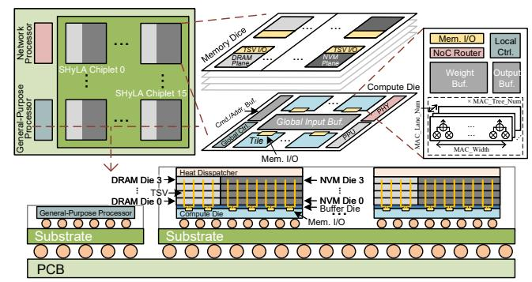

# C. Put it all Together

Memory and data heterogeneity can be jointly characterized by three metrics: **read bandwidth**, **memory capacity**, and **write affinity** (performance and endurance). NVM provides superior density, yielding higher capacity and read bandwidth potential, but suffers from slow writes and limited endurance, whereas DRAM provides lower capacity but balanced read/write performance and better endurance. LLM data

categories differ in their preferences for the three metrics: Weight and KVCache are capacity- and read-intensive, while IA is write-heavy with small capacity needs. Consequently, IA maps to DRAM; write-free and capacity-hungry Weight fits NVM; and KVCache, being capacity- and read-intensive with low write pressure, can also reside in NVM, with any overflow placed in DRAM (Fig. 4d). Notably, KVCache updates are inherently coarse-grained; with a typical head embedding dimension of 128, KV vectors (≥256B) match or exceed NVM physical programming units, maintaining a write amplification factor near 1.0 and avoiding read-modify-write overhead.

#### IV. SHYLA ARCHITECTURE

We propose SHyLA, a hardware-software-heterogeneityaware architecture for cloud-side LLM inference with 3Dstacked NVM-DRAM hybrid memory.

#### A. Architecture Overview

SHyLA is a multi-chip-module (MCM) architecture where each chiplet integrates a compute die with 3D-stacked DRAM and NVM dice, as illustrated in Fig. 5. A general-purpose processor manages inter-chiplet links, while distributing computation workloads using coarse-grained instructions. A network processor similar to NVIDIA's Bluefield [64] handles communication and reduction across boards. This work focuses on the MCM architecture for in-package LLM inference.

Fig. 5: SHyLA architecture overview.

Both DRAM and NVM are implemented as 4-Hi stacks placed in parallel atop a compute die, with signals rerouted through a buffer die, aligning with manufacturing capability and practice. Parallel stacking allows DRAM and NVM to

Fig. 6: Inter-chiplet spatial operator partition (MHA+Dense model) and intra-chiplet temporal operator partition.

be fabricated and optimized independently for their respective bandwidth–capacity trade-offs, avoiding the process and I/O alignment constraints of vertical stacking, where all dice must share a common TSV grid. This expands the hybrid memory design space and enables greater design flexibility. The memory banks of both types are organized into planes, each paired with an underlying compute tile to simplify memory controller and PHY design. Data access across tiles is handled via a specialized NoC on the compute die described in Sec. IV-B.

The compute die consists of 20 identical ∼20mm2 tiles, each integrating components including a MAC datapath sharing similar hierarchies with [78], an NoC router, buffers, and local controllers. It also includes a global input buffer and several auxiliary components, such as a post-processing unit (PPU) for non-linear operations, a chiplet-level controller, and a die-to-die interface for inter-chiplet communication.

