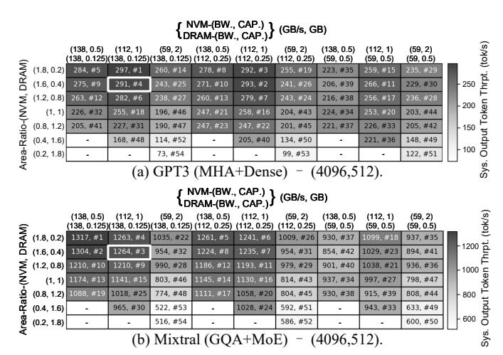

# E. DSE Analysis

**Bandwidth-Capacity Trade-off.** To evaluate how model structures influence bandwidth-capacity trade-off preferences, we analyzed LLaMA3 (GQA+Dense), GPT3 (MHA+Dense), Grok1 (MHA+MoE), and Mixtral (GQA+MoE). We sweep 19  $(s_{\text{prompt}}, s_{\text{gen}})$  pairs (from 256 to 32768) for each model, totaling 76 workloads, as inputs to DSE Stage 1 (Sec. VI-C). We employ a heuristic deployment of PD aggregation with  $(p_t, p_p) = (8, 2)$ , and an additional  $p_e = 8$  for MoE models. As shown in Fig. 13, bandwidth-capacity preferences are primarily driven by the attention mechanism (MHA vs. GQA) rather than model type (Dense vs. MoE). Specifically, GQA's reduced KVCache pressure enables higher micro batch sizes, shifting preference toward NVM bandwidth over capacity. Conversely, MHA models consistently favor a balanced tradeoff in NVM. Furthermore, most workloads prioritize trading off DRAM capacity to achieve higher bandwidth.

Fig. 13: Bandwidth-capacity trade-off preferences across model structures. Bold design denotes selection in Sec. VI-C.

Despite these different bandwidth-capacity trade-off preferences, we evaluate the generalizability of our hybrid memory selection (based on MHA+Dense models in Sec. VI-C) using GPT3 (MHA+Dense) and Mixtral (GQA+MoE) as representative cases. We simulate system throughput across the hybrid memory design space (Table III) using the deployment design space parameters from Table IV. Fig. 14 reports system throughput at maximum batch size, with missing entries indicating that Weight exceeds NVM capacity. For GPT3 (MHA+Dense)-(4096, 512), the DSE-selected design ranks third (while box), confirming that high-performance configurations for MHA favor NVM-dominant area allocation with a balanced bandwidth-capacity trade-off and DRAM optimized for peak bandwidth. For Mixtral (GOA+MoE)-(4096, 512), top designs (e.g., #1, #2 in Fig. 14b) prioritize higher NVM bandwidth over capacity. Notably, we observe strong mutual robustness: evaluating the GQA model at MHA-optimized design points (e.g., #3 and #4 in Fig. 14b) degrades throughput by only ~5%. Similarly, the MHA model maintains high performance at GQA-preferred points (e.g., #5 and #9 in Fig. 14a) with a comparable penalty. This minimal sensitivity demonstrates that the selected hybrid memory configuration generalizes effectively across diverse model structures, making it promising for multi-agent scenarios where workloads with heterogeneous model structures and context lengths coexist.

Fig. 14: System output token throughput and ranking of hybrid memory design points for two model structures.

Generalization Analysis of the Selected Design Point. To evaluate the generality of the current SHyLA design (Sec. VII-A), we compare its system throughput across diverse workloads against per-workload optimized designs generated by using each workload as two-stage DSE input in Fig. 15 (ratios below 1 indicate discrepancies between analytical model and simulation). In most cases, the current SHyLA hybrid memory configuration achieves near-optimal performance (ratio  $\approx 1$ ), with the most pronounced case reaching a ratio of up to 1.27. Overall, the results demonstrate the robustness and broad applicability of the proposed architectural design.

Fig. 15: System output token throughput ratio of the optimal configuration for each workload relative to *SHyLA*.

## F. Energy Consumption and Thermal Analysis

**Energy Consumption.** Fig. 16 shows the system-level energy breakdown for processing a pool of requests across three DSA configurations, which exhibit comparable geomean energy efficiency. Generally, read and compute dominate energy use. Since DRAM and NVM exhibit similar read energy, the higher write energy of NVM is largely offset by the refresh and leakage power unique to DRAM, yielding similar overall

energy consumption across systems. For larger models, limited Weight reuse from small micro batch sizes of *DRAM-only* causes frequent Weight reloads and higher energy consumption. Table IX reports the per-token energy along with *H800* and *MI300X* baselines.

TABLE IX: Energy Consumption\*

| Workload ID                 | E      | Energy Per Output Token (J/tok) $\downarrow$ |        |           |          |  |  |  |  |  |
|-----------------------------|--------|----------------------------------------------|--------|-----------|----------|--|--|--|--|--|
|                             | SHyLA  | H800                                         | MI300X | DRAM-only | NVM-only |  |  |  |  |  |
| 5                           | 0.27   | 1.97                                         | 3.63   | 0.22      | 0.28     |  |  |  |  |  |
| 6                           | 0.16   | 1.35                                         | 2.72   | 0.13      | 0.16     |  |  |  |  |  |
| 12                          | 0.83   | 11.91                                        | 7.67   | 0.79      | 0.76     |  |  |  |  |  |
| 13                          | 0.69   | 6.22                                         | 5.75   | 0.68      | 0.59     |  |  |  |  |  |
| 19                          | 1.37   | 53.08                                        | 34.65  | 1.54      | 1.32     |  |  |  |  |  |
| 20                          | 1.01   | 40.27                                        | 25.42  | 1.26      | 0.92     |  |  |  |  |  |
| Geomean Energy Efficiency ↑ | 15.21× | 1×                                           | 1.02×  | 15.69×    | 15.99×   |  |  |  |  |  |

\* Workload subset due to space limits. Workload IDs shown in Fig. 16.

**Thermal Analysis.** Given the 4-layer NVM-DRAM stack atop the compute die, thermal management is critical. Using 3D-ICE [85], we perform a coarse thermal analysis on workloads with heavy prefill phase, which are more compute-intensive and thermally stressful. Average power estimates in Fig. 16 is used, as LLM workloads exhibit smooth, continuous access without long idle periods. Using liquid cooling with a heat sink's heat transfer coefficient of  $2 \times 10^{-7} \text{W/(um}^2 \cdot \text{K)}$  [65], Table X reports the steady-state temperatures of DRAM, NVM and compute die at an ambient of 300K. All values fall within safe limits, suggesting thermal feasibility.

TABLE X: Steady-State Temperatures\*

| Workload ID           | 1     | 2     | 5     | 8     | 9     | 12    | 15    | 16    | 19    |
|-----------------------|-------|-------|-------|-------|-------|-------|-------|-------|-------|
| DRAM Temp. (K)        | 316.7 | 315.8 | 318.4 | 318.0 | 317.3 | 319.3 | 322.4 | 320.6 | 320.9 |
| NVM Temp. (K)         | 329.1 | 326.1 | 337.6 | 332.6 | 330.1 | 339.8 | 344.5 | 341.0 | 344.4 |
| Compute Die Temp. (K) | 329.3 | 326.2 | 337.6 | 332.8 | 330.3 | 339.9 | 344.6 | 341.1 | 344.5 |

\* Workload IDs shown in Fig. 16.

