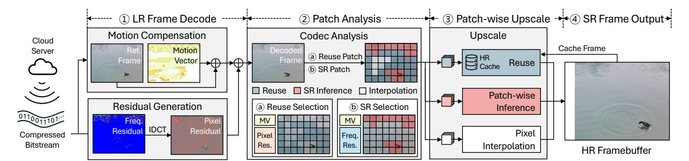

# *A. Correlation of SR Quality and Codec Metadata*

As discussed in Section III-B, our qualitative analysis using patch-wise heatmaps suggests that codec metadata is correlated with the reconstruction quality achieved by SR across different spatial regions. In this section, we conduct a quantitative analysis to characterize this relationship by examining how patch-level characteristics derived from codec metadata correlate with reconstruction quality. Fig. 7 illustrates the expected PSNR gain of SR inference over bicubic interpolation and the fraction of patches for which SR inference outperforms interpolation as a function of different patchlevel characteristics, across diverse video sequences from the NEMO YouTube dataset [5]. Fig. 7(a) shows that as the proportion of low-frequency residual content increases, the expected PSNR difference consistently decreases. This indicates that interpolation is already close to optimal, and SR inference brings only marginal improvement in flat or uniform areas. Conversely, Fig. 7(b) shows that as the proportion of high-frequency residual content increases, the expected PSNR difference consistently rises, indicating that SR inference provides larger gains in patches that contain sharp structure and fine detail that cannot be well restored by simple interpolation. These statistics demonstrate that SR inference is expected to be more beneficial for high-frequency, texture-rich regions than for smooth low-frequency regions.


Fig. 8: Effect of patch reuse in a SR pipeline. (a) ∆MSE defined as the percentage change in MSE of the composite frame relative to the full-frame SR output, where MSE is computed with respect to the ground-truth frame. (b) Upscaling time speedup when reusing patches and running SR on the remaining regions, normalized to full-frame SR latency.

Motion vectors exhibit a similarly consistent trend. As shown in Fig. 7(c), patches with a larger average motion vector magnitude have a monotonically lower expected PSNR difference. This suggests that fast-moving content is inherently harder for the SR model to reconstruct in a way that improves over pixel interpolation, likely due to temporal misalignment and blur. In contrast, patches with small motion vectors, which largely correspond to static content, are more reliably enhanced by SR inference because detailed spatial patterns are stable and easier to recover.

The fraction of patches in which the SR inference outperforms interpolation (∆PSNR > 0) in Fig. 7 reinforces these observations. This ratio decreases with increasing lowfrequency proportion, increases with high-frequency proportion, and declines as the average motion vector magnitude grows. This also means that SR inference outperforms more often when low-frequency content is scarce, high-frequency content is abundant, and motion is small. Taken together, these results demonstrate that the qualitative tendencies discussed in Section III-B generalize across diverse content and emerge as clear global trends rather than isolated examples.



Fig. 9: The SLICE upscaling pipeline.

#### B. Applying Reuse Patches in SR Pipeline

Having established in Section III-C that videos exhibit strong temporal similarity, we investigate whether exploiting this property via patch reuse within a practical SR pipeline yields measurable benefits. Fig. 8(a) shows the relative change in Mean Squared Error (MSE) with respect to the full-frame SR across different reuse ratios. For each reuse ratio, we construct a composite frame by pasting the corresponding super-resolved patches that have zero motion vector and zero residual from the previous frame into the current full-frame SR output. The boxplots show that  $\Delta$ MSE is centered near zero over the entire range of reuse ratios and that its magnitude remains below 0.2%. This indicates that for regions with zero motion vector and zero residual, substituting the current output with super-resolved patches cached from the previous frame preserves reconstruction accuracy relative to full-frame SR.

In terms of upscaling latency, Fig. 8(b) presents a histogram of upscaling speedups grouped by the reuse ratio, normalized to the full-frame SR. Each bar aggregates the speedups of data points in the corresponding reuse bin when patches are reused and SR is applied to the remaining patches. The histogram shows that the speedup grows exponentially with the reuse ratio. This behavior arises because SR inference dominates the computational load. Consequently, reducing the portion of patches that require inference yields meaningful reductions in the overall upscaling time. At high reuse levels, the distribution concentrates around very large speedup values. For example, we observe a 98.24× speedup in this interval, reducing runtime to about 1.02% of the full-frame SR. These extreme gains occur when there is essentially no change between consecutive frames so that the entire frame can be reused, maximizing the benefit of patch reuse. Taken together, these results indicate that patch reuse can also be applied to SR pipelines, delivering substantial acceleration while preserving full-frame SR quality.

#### V. SYSTEM DESIGN

#### A. SLICE Overview

Based on the observations in Section IV, we introduce SLICE, a codec-guided framework that accelerates the video SR pipeline by performing patch-wise SR inference and reusing previously super-resolved content. Operating directly on the standard bitstream, SLICE applies full-frame SR only to intra-coded frames, which are sparsely inserted and typically

account for only a small fraction of frames, and therefore focuses its optimization on the inter-coded frames that dominate video streams. In SLICE, each frame is divided into equally-sized patches, and for each patch the framework selects an upscaling strategy based on motion vectors and residuals from the codec, either reusing existing high-resolution content, running SR inference, or falling back to lightweight pixel interpolation. Since SLICE relies solely on codec information available at the client, the pipeline requires no additional server-side data. At the same time, it substantially reduces the overall SR workload while preserving high perceptual quality.

#### B. Upscaling Pipeline

Fig. 9 illustrates how the SLICE pipeline upscales an input LR video to an HR output. When a compressed video bitstream arrives from the cloud server, the client device receives it and decodes it with the SoC's hardware video decoder (①). This stage follows the standard video decoding pipeline, where the decoder reconstructs inter-coded frames by extracting motion vectors from the bitstream and performing motion compensation on the reference frame. It also parses frequency-domain residuals and applies an IDCT-like inverse integer transform to obtain pixel-domain residuals, which are then added to the motion-compensated prediction to recover the decoded frame. The decoded frame is then ready for super-resolution processing.

SLICE introduces two key stages that leverage codec side information to accelerate the upscaling process. First, in the patch analysis stage (2), SLICE conducts patch-level analysis using motion vectors and residuals to determine the appropriate upscaling strategy for each patch. Based on this analysis, SLICE determines the per-patch upscaling strategy in three steps. It first identifies reuse patches, then selects patches that require SR inference, and finally assigns the remaining patches to interpolation. To reduce the load of SR inference, SLICE prioritizes identifying reuse patches. This ordering lets SLICE exploit cases where many patches can be reused, thereby reducing the number of patches that must be considered for SR inference. A patch is marked for reuse when both the motion vector and pixel-domain residual are zero. Next, from the remaining patches, SLICE selects SR inference patches based on the high-frequency energy of the frequency-domain residual and the magnitude of the motion vector.

#### **Algorithm 1** SLICE Upscale Strategy

```
LR video
   Input:
            video
                               LR video frame
            M^{reuse}
                              Binary mask for patches
            M^{SR}
                              Binary mask for non-reuse patches
   Output: F^{SR}
                              Super-resolved HR frames
1: for each frame f in video do
       if INTRACODED(f) then
2:
                                                     For intra-coded frames
           F^{SR} \leftarrow \text{FULLFRAMeInference}(f)
3.
4:
                                                     ⊳ For inter-coded frames
5:
           (M^{reuse}, M^{SR}) \leftarrow PATCHANALYSIS(\cdot)
6:
            P^{HR} \leftarrow \text{PATCHWISEUPSCALE}(f, M^{SR}, M^{reuse})
           F^{SR} \leftarrow \text{MERGEPATCHES}(P^{HR})
7:
8:
  end for
9:
```

In the subsequent upscale stage (③), SLICE applies the selected strategy to each patch. Reuse patches are filled from the HR cache which stores the HR output of previous frames, SR-inference patches are processed by the SR model, and the rest are upscaled with pixel interpolation. Finally, in the output composition stage (④), all upscaled patches are merged at their original positions and written to the HR framebuffer to produce the final SR frame.

## C. Upscaling Strategy

Algorithm 1 outlines the workflow of the SLICE framework. For intra-coded frames, it performs full-frame inference since these frames cannot exploit motion vectors or residuals. For inter-coded frames, the SLICE framework upscales the frame in three phases: (1) Patch analysis, (2) Patch-wise upscale, and (3) Merging patches.

Patch Analysis. In order to decide an upscale strategy for each patch, SLICE analyzes codec-derived characteristics and partitions patches into two sets, those to be reused from the HR cache, and those to be upscaled by SR inference. Algorithm 2 describes the patch analysis procedure. For each LR frame, SLICE divides the frame into equally-sized  $P \times P$  patches and reads spatial grids of motion vector magnitude, pixeldomain residuals, and frequency-domain residuals from the decoder, where each grid element is aligned to a pixel or a block and stores the codec metadata for that location. It then constructs the Patch Statistics Maps (PSMs) by aggregating these grids over each patch, namely the mean motion vector magnitude, the mean change in pixel residuals, and the ratio of high-frequency energy in the residual signal (Line 3-5). These aggregations are computed by average pooling on the GPU, which produces per-patch means in a single pass using kernel size and stride P for pixel-granularity maps and P/4for 4×4-based grids. Using the codec-guided PSMs, SLICE identifies the patches that can be reused from the previous frame stored in the HR cache. If both the mean motion vector magnitude and the mean change in pixel residuals are zero, the patch is marked as reusable and its location is recorded in the reuse mask  $M^{reuse}$  (Line 6-7). Note that pixel-domain residuals are used rather than transform coefficients in the

#### Algorithm 2 Codec-guided Patch Analysis

```
Input:
                                      Height/width of LR frame
                H, W
                                      Grid of motion vector size
                G^{pix}
                                      Grid of pixel residual
                G^{hf}
                                      Grid of high-frequency energy of frequency residual
                G^t
                                      Grid of total energy of frequency residual
                \tilde{P}
                                      Patch size
                \alpha, \beta
                                      Score weights
                k
                                      Inference area ratio to apply SR
     Output: M^{reuse}
                                      Binary mask for reuse patches
                M^{SR}
                                      Binary mask for SR patches
 1: function PATCHANALYSIS(H, W, G^{mv}, G^{pix}, G^{hf}, G^t, P, \alpha, \beta, k)
          T_h \leftarrow H/P; \quad T_w \leftarrow W/P

    □ Generate Patch Statistics Maps (PSMs)

          mv\_mean \leftarrow AvgPool2D(G^{mv}, P/4, P/4)
 3:
          res\_pixel\_mean \leftarrow AvgPool2D(|G^{pix}|; P, P)
 4:
          hf\_ratio \leftarrow \frac{\text{AvgPool2D}(G^{hf}; P/4)}{\text{AvgPool2D}(G^t; P/4)}
 5:

    ▶ Identify reuse patches

          R \leftarrow (mv\_mean = 0) \cap (res\_pixel\_mean = 0)
 6.
          M^{reuse} \leftarrow \text{False}^{T_h \times T_w}: M^{reuse}[R] \leftarrow True
 7.

          score \leftarrow \alpha \cdot hf\_ratio + \beta \cdot (1 - \text{clip}(mv\_mean/10, 0, 1))
 8:
 g.
          S \leftarrow \text{TopK}(score, k)
10:
          M^{SR} \leftarrow \text{False}^{T_h \times T_w}; \quad M^{SR}[S] \leftarrow \text{True}
          return M^{reuse}, M^{SR}
11.
12: end function
```

frequency-domain for identifying reuse patches. Since intercoded frames may contain intra-coded blocks, leveraging the pixel-domain residuals can prevent such intra-coded blocks from being reused across time.

For the remaining patches, SLICE assigns a score that favors textures with stronger high frequency residuals and smaller motion vectors (Line 8). Since the proportions of the highand low-frequency residuals are strongly coupled, measuring only one of them is sufficient to detect target SR patches at runtime. SLICE therefore uses the high-frequency residuals and the motion vector magnitude of each patch to determine the upscaling strategy. Since the average motion vector magnitude rarely exceeds 10 in typical sequences, we normalize the motion term by dividing it by 10 and then clip it to the range from 0 to 1. The two predictors are weighted by  $\alpha$  and  $\beta$ . Based on our empirical observation that frequency residuals are more informative than motion,  $\alpha$  and  $\beta$  are set as 0.9 and 0.1 respectively (see Fig. 18 for details). The resulting score map score provides a per-patch estimate of how beneficial SR will be given the codec data. A user-supplied ratio kdetermines the total fraction of area processed by the SR model, and SLICE selects the top scoring patches up to this budget with a GPU TopK kernel to form the SR mask  $M^{SR}$ (Line 9-10). Any patch that belongs to neither  $M^{reuse}$  nor  ${\cal M}^{SR}$  is upscaled by pixel interpolation.

**Patchwise Upscale.** After selecting an upscaling strategy through patch-wise analysis, SLICE applies the chosen strategy to each patch. Patches for reuse are filled directly from the HR cache, copying cached pixels at the corresponding coordinates. Patches selected for SR inference are processed in batches

entirely on the GPU. Rather than constructing batches in a loop, the patch grid is transformed into a compact GPU tensor using the unfold operation, and only the patches identified by the SR mask are gathered. The gathered patches are reshaped into batches and evaluated with one or a few forward passes. Keeping extraction and scheduling on the GPU removes CPU round trips and lowers kernel launch overhead, which reduces the overall reconstruction time. The remaining patches are upscaled with pixel interpolation on the GPU. After all patches are produced, SLICE composes the HR frame using the indices provided by the reuse map and the SR map.

Merging Patches. In order to reconstruct the frame from the upscaled patches, SLICE merges these patches into a HR frame and stores it into the framebuffer. Since data must still move between the CPU and GPU logical memory spaces even on SoC platforms with unified memory architectures, SLICE performs merging entirely on the GPU to minimize such transfers. The SR result from the previous frame stays cached on the GPU and is read directly when needed. This design avoids host round trips and keeps data movement minimal. For reuse patches, SLICE arranges patches by rows and groups horizontally adjacent patches into contiguous bands. Each band is copied as one contiguous slice from the cached HR frame into the reconstruction buffer. Then, the patches upscaled with pixel interpolation are copied to its corresponding location. Next, patches selected for SR inference are associated with their target positions within the HR frame. These patches are also reconstructed using the row-wise banded copies as the reuse patches. Keeping all merges on the device eliminates host round trips, improves bandwidth efficiency, and reduces per update overhead while preserving spatial alignment. Finally, the reconstructed HR frame is stored in the GPU framebuffer.

