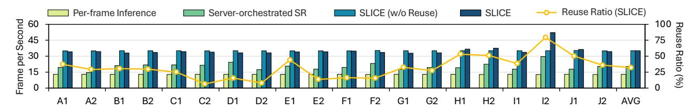
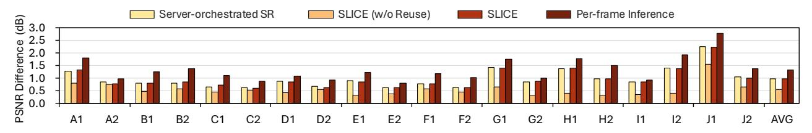
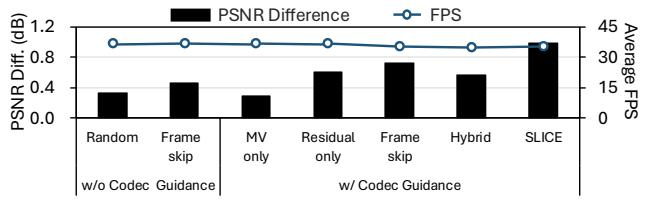
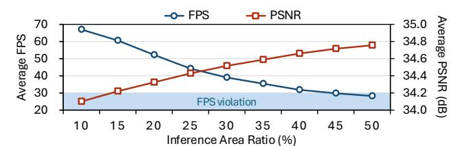
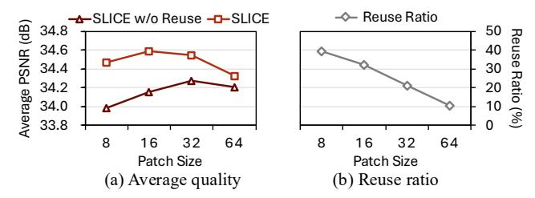
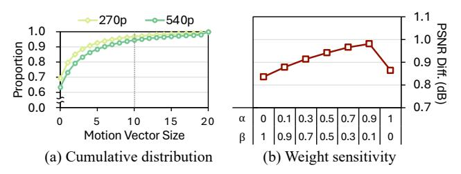

# *B. Results*

Frame Rate. Fig. 10 shows the average frame rate of SLICE and other pipelines for upscaling 270p video frames to 1080p, together with the average reuse ratio of SLICE. For each video we show the average reuse ratio as the mean of per-frame reuse fractions. For a single frame, this fraction is defined as the number of reused patches divided by the total number of patches in the frame. On average, SLICE achieves a 2.72× higher frame rate than per-frame inference and reaches frame rates that fall within the latency budget of video streaming (30 FPS). Per-frame inference applies full-frame SR to every frame, which results in a high computational cost and prevents the pipeline from meeting the latency budget. In contrast, SLICE relies on codec metadata to identify only a subset of regions that require SR inference and reuses patches whenever possible. As a result, the cost of upscaling is greatly reduced and the resulting throughput satisfies the latency requirement.

Compared to server-orchestrated SR, SLICE also delivers higher throughput. In the server-orchestrated pipeline, frames that are not selected by the server are reconstructed via a modified codec, which forces the use of the mobile CPU. Since

Fig. 10: Throughput comparison of SLICE and various upscaling schemes.

Fig. 11: Quality improvement of SLICE and various upscaling schemes over pixel interpolation.

the decoder-like reconstruction runs on a macroblock basis to restore each frame, this process slows down the overall pipeline. In addition, when the server-orchestrated pipeline uses a fixed SR model without per-video training, the server must schedule full-frame inference for a larger fraction of frames to satisfy the target quality constraint. This further increases the computational load on the client device and keeps the frame rate below the latency budget. On the other hand, the entire upscaling process in SLICE including patch analysis, SR inference, and patch merging is executed on the GPU. Moreover, SLICE performs full-frame inference only on intracoded frames, which appear at the beginning of each GOP. This significantly lowers the fraction of frames that require full-frame processing and thereby achieves higher frame rates.

When comparing with SLICE-no-reuse, it attains a slightly higher frame rate than SLICE in several videos. This stems from the additional operations required by SLICE, which must analyze the codec metadata to identify reusable patches and merge these patches when reconstructing each frame, on top of patch-level SR inference and interpolation. For videos with a low reuse ratio, this extra work introduces a small overhead for selecting and merging reusable patches, which can make the frame rate of SLICE marginally lower than that of SLICEno-reuse in these categories. However, this effect is modest and the two schemes still achieve comparable throughput for these videos. For videos with a high reuse ratio, such as H1, H2, and I2, we observe the opposite behavior. In particular, I2 exhibits a reuse ratio of 79.43%, which maximizes the benefit of reuse and allows SLICE to reach a throughput of 52.19 FPS. In these cases, a large fraction of patches can be reused and the reduction in SR inference dominates the small overhead of selecting and merging reusable patches. As a result, SLICE achieves higher frame rates than SLICE-no-reuse in these highreuse cases.

**Quality.** Fig. 11 shows the quality improvement of each upscale pipeline over pixel interpolation. SLICE achieves an average PSNR reduction of 0.35 dB compared to the per-

Fig. 12: Energy consumption breakdown of SLICE.

frame inference, which indicates that its quality is mostly preserved while providing the speedup benefits. The server-orchestrated SR pipeline shows similar PSNR to SLICE since its target quality constraint is explicitly set to match the PSNR achieved by SLICE. The SLICE-no-reuse shows an average PSNR reduction of 0.78 dB relative to per-frame inference, highlighting the significant contribution of the reuse mechanism in terms of quality. In particular, reuse preserves high reconstruction quality across frames by propagating SR-enhanced details from earlier frames to later ones. When reuse is enabled, the system incurs only a small overhead for reuse patch selection and merging, while patch reuse itself provides both speedup and higher reconstruction quality. As a result, the overall quality remains close to per-frame inference.

Energy Consumption. Fig. 12 shows the energy savings achieved by SLICE over per-frame inference. By applying distinct upscaling strategies to different patches, SLICE reduces energy consumption by 62.57% relative to per-frame inference. To perform patch-level upscaling, SLICE adds four additional stages (patch analysis, reuse, interpolation, and merge) to the SR inference pipeline. Despite these additional stages, the total energy consumption remains lower than that of per-frame inference, since the amount of SR inference is significantly reduced. Specifically, although these additional stages incur extra energy cost, together they account for only about 15.86%

TABLE I: Upscaling policies of the relevant baselines for inter-coded frames. Hybrid denotes an upscaling policy that combines frame skipping with patch selection. The remaining regions are upscaled using pixel interpolation.

| Group                 | Scheme               | SR inference type                              | SR ratio | Selection metric | Reuse  |
|-----------------------|----------------------|------------------------------------------------|----------|------------------|--------|
| w/o Codec Guidance | Random Frame-skip | Patch (every frame) Full (35% of frames)    | 35%      | Random           | X X |
| w/ Codec Guidance  | MV-only              | Patch (every frame)                            | 35%      | MV               |        |
|                       | Residual-only        | Patch (every frame)                            | 35%      | Residual         | X      |
|                       | Frame-skip Hybrid | Full (35% of frames) Patch (every 2 frames) | 70%      | MV & Residual    | 1      |
|                       | SLICE                | Patch (every frame)                            | 35%      | MV & Residual    | 1      |

of the energy compared to per-frame inference. In contrast, the energy consumed by SR model inference in SLICE is reduced by 78.56%, resulting in lower overall energy consumption.

Fig. 12 also shows that the inference energy of SLICE is further reduced in the high-reuse regime. This is because upscaling speedup increases super-linearly with reuse ratio, as shown in Fig. 8(b). Since inference energy largely scales with upscaling time, higher reuse ratios lead to larger energy savings in this regime. This explains why E1 and E2 can exhibit similar inference energy despite different reuse ratios, as both already operate at about 40% of the full-frame SR energy, beyond which further increases in reuse ratio yield only marginal savings. In contrast, I2 attains a higher reuse ratio, moving SLICE into a high-reuse regime with lower upscaling time, inference energy, and total energy consumption.

Fig. 13: Relevant baselines compared to SLICE.

Relevant Baselines. To examine the effect of codec guidance on the upscaling pipeline, we compared SLICE with relevant baselines. Table I summarizes the upscaling policies of these baselines. In particular, MV-only and Residual-only operate without reuse, as reuse requires both motion vectors and residuals. For a fair comparison, we matched the overall amount of SR inference computation across the baselines. As shown in Fig. 13, the baselines achieve different PSNR gains over interpolation, indicating that the choice of SR method has a significant impact on reconstruction quality. Notably, the quality gains remain limited without codec guidance. This suggests that simply allocating fixed compute budget is not an effective strategy for SR.

For the baselines with codec guidance, the quality gain depends on how the codec metadata are used. Using only a single codec signal for patch selection shows that either motion vectors or residuals can provide a certain level of guidance, but the resulting quality gain remains limited because reuse cannot be leveraged. In particular, using only motion vectors leads to an even smaller gain, as it tends to prioritize static background regions over high-frequency regions.

Fig. 14: Performance improvement in Xiph dataset.

The Frame-skip, Hybrid (frame-skipping with patch selection), and SLICE all exploit reuse and differ in how SR is allocated over time and space. Frame-skip produces high-quality reference frames by applying full-frame SR to selected frames, but it cannot update high-frequency regions that are introduced in skipped frames. Hybrid concentrates the same SR budget on the selected frames by applying patch selection more aggressively. As a result, SR inference can be allocated to regions that could already be reconstructed well by interpolation. Meanwhile, skipped frames cannot receive fresh SR updates even when they contain regions that would benefit more from SR inference. This explains why distributing patchlevel SR updates across every frame as in SLICE yields higher reconstruction quality at similar throughput.

Generality Across Datasets. To strengthen the generality of the SLICE framework, we measured its throughput and quality on the Xiph dataset [37]. As shown in Fig. 14(a), SLICE achieves a 2.82× throughput improvement compared with perframe inference, while Fig. 14(b) shows that it incurs only a 0.35 dB PSNR reduction. These results indicate that SLICE consistently achieves higher throughput while incurring only a small quality degradation across datasets, further supporting its generality.

## C. Design Space Exploration

Fig. 15: Design space exploration over inference area ratios.

Inference Area Ratio Sensitivity. Fig. 15 shows how the inference area ratio affects the average throughput and reconstruction quality of SLICE over the evaluation videos. As the inference area ratio increases, more patches are processed by the SR model, which increases the computational load and therefore monotonically decreases FPS. At very low ratios, the FPS is well above the latency budget but the PSNR significantly decreases. This indicates that an overly small inference area severely degrades visual quality. In contrast, the average PSNR improves as the inference area ratio increases. At 35%, it is only 0.35 dB lower than per-frame inference. Increasing the ratio from 35% to 40% yields only about

Fig. 16: Design space exploration over patch sizes.

0.08 dB additional gain, suggesting that inference area ratios in this range offer a good trade-off between throughput and quality. Since we target video streaming scenarios with a strict latency budget, we adopt 35% as the default inference area ratio in our evaluation so that we stay within this trade-off region while keeping a larger safety margin in terms of FPS.

Patch Size Sensitivity. Fig. 16(a) illustrates how patch size affects the reconstruction quality of SLICE and SLICE-noreuse for a fixed inference area ratio. For SLICE-no-reuse, the average PSNR first increases as the patch size grows from 8 to 32 and then decreases when the patch size is further increased to 64 pixels. As the patches become larger, each SR inference sees a wider spatial context, which effectively enlarges the receptive field and improves the reconstruction quality. However, a large patch size such as 64 pixels makes it harder for SLICE to focus its capacity on the most informative regions, which in turn reduces the gain from SR inference compared with a patch size of 32 pixels. Comparing SLICE with SLICEno-reuse, we also observe that the PSNR gap between the two curves is large when the patch size is small, and gradually shrinks as the patch size increases. This behavior is consistent with the trend of reuse ratio observed in Fig. 16(b). Since smaller patches allow SLICE to capture motion within the video content at a finer granularity, this increases the chance that a patch can be reused across frames. This increased reuse of patches directly translates into larger quality gains, whereas larger patches exhibit lower reuse opportunities and therefore result in smaller gains.

Although a larger patch size of  $32\times32$  yields higher PSNR for patch-level inference due to its larger receptive field, it also lowers the reuse ratio and thus diminishes the benefits of reuse. In contrast, the  $16\times16$  configuration sacrifices only a small portion of the receptive-field advantage while substantially increasing reuse opportunities, leading to larger overall gains in reconstruction quality. Considering these trade-offs between receptive-field effects and reuse opportunities, we adopt a patch size of  $16\times16$  as the default setting in our evaluation.

GOP Sensitivity. Fig. 17(a) shows throughput and reuse ratio of SLICE under different GOP sizes. Larger GOPs improve FPS since a larger GOP results in fewer intra-coded frames, which in turn reduces the need for full-frame inference. In contrast, the reuse ratio decreases with larger GOPs. Longer inter-coded sequences accumulate motion-estimation errors, which increases residuals and reduces the number of regions that can be reliably reused. We use GOP 120 by default as it is

Fig. 17: Design space exploration over GOPs.

common in general streaming pipelines. Note that SLICE still meets the real-time constraint at GOP 30, which is a typical setting for low-latency live streaming.

Fig. 17(b) further reports the average quality of full-frame SR and SLICE across GOP sizes. With larger GOPs, SLICE performs full-frame inference less often, resulting in a slight reduction in average PSNR. Nevertheless, SLICE consistently exhibits only a minimal quality drop compared to full-frame SR regardless of the GOP setting.

Fig. 18: Parameter sensitivity of SLICE.

**Parameter Sensitivity.** We further analyze the parameters used in Algorithm 2 to validate our design choices and assess parameter sensitivity. Fig. 18(a) plots the cumulative distribution (CDF) of motion vector sizes for 270p and 540p videos. The fraction of motion vectors whose magnitude exceeds 10 is only 3.6% and 6.2% for 270p and 540p respectively, indicating that large motion vectors are rare. Since 4× upscaling 540p results in 4K resolution, dividing motion vector values by 10 is a reasonable and practical normalization for our setting.

Fig. 18(b) shows the quality improvement of SLICE over pixel interpolation as the score weights  $\alpha$  (residual) and  $\beta$ (motion vector) vary, and the default configuration of SLICE  $(\alpha = 0.9, \beta = 0.1)$  yields the highest quality gain. For a fair comparison across weight settings, the reuse mechanism is enabled in all cases. These results indicate that the residual is a more reliable indicator of patch importance than the motion vector magnitude. Since the residual directly reflects prediction error, it better captures regions that are difficult to reconstruct. In contrast, motion vector magnitude is only a coarse cue and can overemphasize regions with large but easily predictable motion. Accordingly, assigning a larger weight to the residual leads to better quality. Nevertheless, the observation that the default setting performs better than the residual-only setting  $(\alpha = 1, \beta = 0)$  suggests that assigning a small weight to the motion vector provides useful complementary information.

