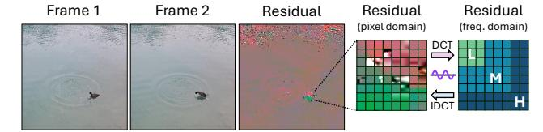

# *B. SR-Augmented Video Streaming Pipeline*

Modern videos are delivered in the form of a compressed bitstream from the server to the client device over the network. To reconstruct it as a sequence of frames, a hardware or software decoder consumes the stream to decompress the encoded frames into pixel-level images. The SR model then upscales each frame, and the result is written to the framebuffer for display. On mobile platforms with tight compute and power budgets, naively upscaling all frames with an SR model often

1Throughout this paper, *Super-Resolution* denotes the neural network-based upscaling method unless otherwise stated.

Fig. 2: Motion vectors and residuals. (a) The coherent motion of the cheese slicer is captured by motion vectors. (b) Disoccluded regions are encoded as residuals.

fails to satisfy latency constraints. For example, the inference latency of EDSR [14] is 120.7× that of bicubic interpolation on Jetson AGX Orin [25] in our experiment. These constraints necessitate methods that accelerate the SR pipeline to meet real-time budgets while preserving perceptual quality.

To deploy SR in a way that preserves frame quality while meeting the latency budget, there are two possible approaches that place the upscaling policy in different locations. First, in a server-orchestrated SR pipeline shown in Fig. 1(b), the server pre-analyzes the video offline and attaches control information to the bitstream [5]. This information specifies which frames should be upscaled by the SR model on the client. The client then decodes the stream, reads the control information, and applies the SR model only to the designated frames. The other frames are reconstructed from a cached super-resolved frame and codec metadata, mirroring the video decoding process. While server-side orchestration remains valuable when offline analysis is feasible, scenarios such as live streaming, video conferencing, and on-device archives do not meet these conditions, which motivates an alternative design where upscaling decisions are made on the client side.

Second, in a client-only SR pipeline, the client determines which frames or regions to upscale solely according to deviceside policies. In these settings, the server transmits only a standard video bitstream. Based on the device-side upscaling policy, the client performs SR on the selected inputs and writes the outputs to the framebuffer. Both server-orchestrated and client-only pipelines share the same decoding and display stages and differ only in the location of the selection policy. While acceleration for server-orchestrated pipelines has received broader attention [5], [6], progress on client-only pipelines remains limited, highlighting the need for dedicated client-side acceleration.

Fig. 3: Residuals in the pixel and frequency domains. The encoder maps pixel-domain residuals to the frequency domain using a DCT-like integer transform, and the decoder reconstructs them using an IDCT-like inverse transform.

