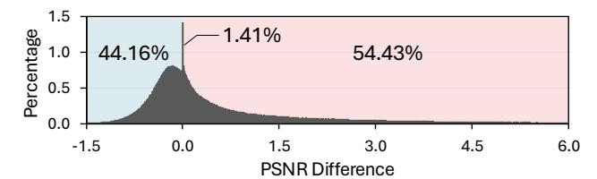
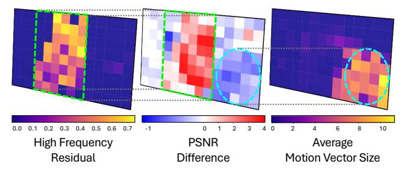

# *C. Preliminaries of Video Codec*

Video codecs exploit spatial and temporal redundancies to compress video into a compact bitstream for efficient transmission and storage. The video codec consists of (1) an encoder that compresses the raw frames into a bitstream, and (2) a decoder that reconstructs pixel-domain frames from the bitstream. Codecs compress both intra-coded frames and intercoded frames, leveraging spatial and temporal prediction, respectively. In inter-coded frames, *motion vectors* describe perblock motion with respect to a reference frame, while *residuals* represent the difference between the motion-compensated prediction and the original frame [26]. The following introduces these concepts using Advanced Video Coding (AVC or H.264) [27] as an example.

Motion Vectors. The movement between the reference frame and current frame is encoded as motion vectors, which are generated during the motion estimation process. The encoder first divides the frame into fixed-size macroblocks (16×16 in H.264/AVC), and may further split them into smaller partitions to improve prediction. For each partition candidate, it searches the reference frame for the best-matching block and assigns the corresponding motion vector. Since a macroblock can be split in various ways, the encoder selects the partitioning and motion vectors that minimize a bitrate-quality cost. As illustrated in Fig. 2(a), the encoder represents the motion in the current frame (Frame 2) as a coordinate offset from the best-matching block in the reference frame (Frame 1).

Residuals. The differences between the current frame and its prediction are represented as residuals. Since motion vectors model only the linear displacement of blocks, they cannot capture complex motions such as rotation, scaling, occlusions/disocclusions, or non-rigid motion across frames. After motion estimation, the encoder forms a motion-compensated prediction from the reference frame and obtains the residual by subtracting the prediction from the original frame, thereby capturing the remaining per-pixel details as depicted in Fig. 2(b).

To compress the residual into a bitstream, the encoder applies a block-based transform such as the integer transform in H.264/AVC, which approximates the Discrete Cosine Transform (DCT) and guarantees the exact inversion in the decoding process [28]. This converts each 4×4 or 8×8 residual block into transform coefficients representing its spatial frequency content, as shown in Fig. 3. The magnitude of each coefficient indicates the energy of the corresponding frequency

Fig. 4: Distribution of patch-wise PSNR gains of EDSR  $(4\times)$  over pixel interpolation.

component in the pixel-domain residual block, with larger values indicating stronger presence. Coefficients near the top-left correspond to low frequencies and those farther to the right or downward correspond to higher frequencies, allowing the grid to be partitioned into low-, mid-, and high-frequency bands [29]. Transforming the residual to the frequency domain concentrates most of the energy in a few low-frequency coefficients, leaving many high-frequency coefficients close to zero and therefore easier to compress [30].

**Decoding Inter-coded Frames.** On the client side, each inter-coded frame is reconstructed from motion vectors and residuals in the bitstream. The decoder performs motion compensation to generate a prediction from the reference frame, then applies an inverse transform to recover the pixel-domain residual. The final reconstruction is obtained by adding the residual to the motion-compensated prediction for each block.

#### III. MOTIVATION

#### A. Client-only SR in Practice

As discussed in Section II-B, the client in a client-only SR pipeline does not receive any video-analysis metadata from the server. In this setting, the client must rely solely on locally available information to devise device-side SR policies that exploit both the information contained in the standard bitstream and the on-device resources in order to upscale the video within the latency budget. By contrast, existing server-orchestrated approaches target a different setting, as they assume tight server-client coordination and access to server-provided analysis metadata, which creates both server-side and client-side challenges in deployments where the server transmits only a standard bitstream.

On the server side, server-orchestrated pipelines typically select the frames to super-resolve by upscaling each frame with the SR model and estimating its quality impact on neighboring frames for each video. To understand the server cost in practice, we implemented this workflow and tested it on real-world videos. Running on a desktop with an Intel Core i7-14700K CPU and an NVIDIA GeForce RTX 3080 Ti GPU, the frame selection process took 24.95 minutes per video on average. While these workflows suit environments that permit server analysis, they cannot be applied for scenarios such as live streaming and video conferencing because the latency budget cannot accommodate server-side frame selection and adaptation. They are also unsuitable for on-device archives where network connectivity may be unavailable or privacy constraints prevent sending content to a server. In addition to

Fig. 5: Patch-wise heatmaps of a frame divided into equally sized patches, showing (from left to right) the proportion of high-frequency residual energy, the PSNR gain of SR over interpolation, and the average motion vector magnitude.

these deployment constraints, server-orchestrated SR pipelines often apply video specific adaptation that retrains the SR model per video to maximize quality, further increasing server cost and latency.

On the client side, some server-orchestrated designs limit the use of the hardware decoder. Since these systems rely on codec augmentations that emit custom auxiliary metadata such as SR frame markers or HR motion vectors, decoding often falls back to software, and the on-chip energy-efficient decoder remains underused. Taken together, these considerations point to a need for an efficient client-only SR approach that relies only on client side information, fully leverages the on chip hardware decoder, and keeps accuracy loss minimal.

