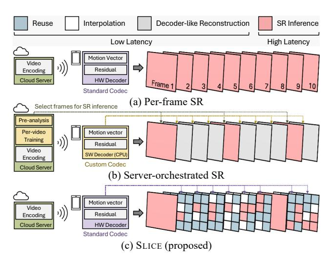

# I. INTRODUCTION

Video has become the dominant component of internet traffic, reflecting continued increases in video streaming demand [1], [2]. This growth is increasingly driven by latency-sensitive workloads, such as live streaming and video conferencing [3], [4]. As this trend continues, the need to deliver both low latency and high visual quality has made network bandwidth a key bottleneck. To mitigate this limitation, clientside upscaling has become a viable alternative [5], [6]. These approaches employ upscaling techniques on the client device to convert low-resolution (LR) video to high-resolution (HR)

Fig. 1: Overview of the SLICE framework.

output. Since conventional upscaling methods such as interpolation struggle to recover fine-grained details, neural network (NN)-based Super-Resolution (SR) models have emerged. By reconstructing plausible textures and patterns, these models achieve significant quality improvements over interpolationbased upscaling. Driven by these gains, industry SR frameworks also employ NN-based methods to upscale streaming video on desktop and laptop PCs [2], [7], [8].

Although NN-based SR models achieve strong perceptual gains, they experience a severe slowdown due to their high computational costs. As shown in Fig. 1(a), when video is delivered from the server to the client as a standard bitstream, typical SR pipelines upscale each frame independently using per-frame inference. Since a single frame requires heavy computation, performing inference per-frame replicates that cost across the sequence and significantly increases the overall computation. This problem is particularly challenging for edge devices with tight compute, memory, and power budgets, which are now the primary medium for video consumption. In latency-sensitive video streaming, where frames must be displayed in a continuous sequence, per-frame inference can exceed the latency budget (e.g., 33 ms at 30 FPS) and violate the timing constraints [9], [10]. Accordingly, a lightweight methodology is needed to efficiently super-resolve LR video within the latency budget while minimizing the quality loss.

To design a resource-efficient SR1 pipeline, serverorchestrated approaches have been widely explored to keep the client lightweight while meeting the timing constraints. Fig. 1(b) illustrates representative designs where an SR model upscales a subset of frames and the remaining frames are synthesized from the previously super-resolved frame using codec metadata in a manner that mirrors decoder reconstruction. In this setting, the server determines which frames to upscale with a SR model and dispatches the plan to the client by embedding it in the bitstream, and per-video fine tuning is often employed to sustain quality. These server-orchestrated methods are effective when server assistance is available and stream analysis is feasible, yet they cannot be applied in scenarios such as live streaming, video conferencing, and videos stored on client devices. As a result, a client-only SR pipeline is needed in which the client determines the upscaling strategy using only client-side information. This direction remains underexplored compared with server-orchestrated pipelines, motivating research on accelerating client-side SR.

To address this need, we find that the codec metadata already present in the standard bitstream for frame reconstruction can be leveraged to accelerate client-only SR. These metadata can serve as a reliable signal indicating where SR models yield the greatest quality gains within a frame. Furthermore, the temporal redundancy in video across time allows this metadata to reveal unchanged regions, enabling reuse of the corresponding content from the prior super-resolved frame. These insights suggest that codec metadata can guide selective, patch-level SR, which applies the SR model only to informative regions of a frame. However, realizing this idea in practice is nontrivial for two reasons. First, we must determine which codec metadata are most suitable for guidance. Second, we must identify in advance which frame regions will yield the greatest benefit from high cost computation.

To meet these requirements, we select motion vectors and residuals from the standard bitstream as our guidance signals and identify two properties that motivate our design. We find that frequency-domain residuals can reliably indicate highfrequency content within each frame. Combined with motion vectors, they enable selective patch level inference by detecting the region where SR delivers the largest gains. Also, the joint use of motion vectors and pixel-domain residuals also supports temporal reuse of unchanged regions across frames, which further reduces the candidate set for inference and eliminates redundant processing. These properties enable region-level targets to be specified before SR inference, forming a practical strategy for client-only pipeline.

Based on these observations, we propose SLICE, a Selective

Local Inference Framework with Codec Exploitation which leverages motion vectors and residuals from the codec to prioritize regions where the SR model yields the greatest quality gains. Fig. 1(c) shows the novel approach of SLICE, which performs inference only on selected patches, reuses unchanged regions identified by motion vectors and residuals, and interpolates the remainder. Since SLICE operates entirely on the client device and consumes the unmodified bitstream, it allows full use of the energy-efficient hardware video decoder without any change. Since codec metadata is available from the decoder prior to SR, the runtime cost of choosing the upscaling strategy can be kept negligible. In our evaluation, SLICE delivers meaningful speedups and energy savings with only a small quality reduction compared to per-frame inference, by performing SR inference only on selected regions and reusing unchanged content from the previous HR frame.

Our contributions are as follows:

- We establish and quantify the correlation between codec metadata and SR quality at the patch level within each frame.
- We observe that these codec metadata can be used to capture regions where the SR model can fully benefit. The use of motion vectors and pixel-domain residuals also gives us an opportunity to reuse regions that remain unchanged.
- We present SLICE, a framework that efficiently upscales LR video to HR using only client-side information, which can leverage the standard video codec.
- Our evaluation on real-world videos shows that SLICE achieves 2.72× speedup and 62.57% energy savings over per-frame inference.

