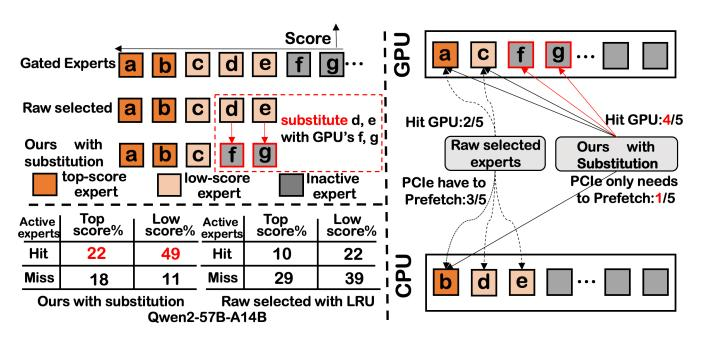
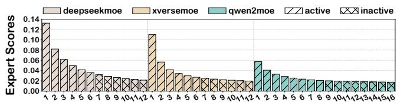

# SMoE: An Algorithm-System Co-Design for Pushing MoE to the Edge via Expert Substitution

Guoying Zhu\*, Meng Li\*, Haipeng Dai\*, Xuechen Liu\*, Weijun Wang†, Keran Li\*, Jun Xiao‡, Ligeng Chen‡, and Wei Wang\*

\*State Key Laboratory for Novel Software Technology, Nanjing University, †Tsinghua University,, †Honor Device Co., Ltd Email: 522023330124@smail.nju.edu.cn, {meng, haipengdai}@nju.edu.cn, 522025330063@smail.nju.edu.cn, wangweijun@air.tsinghua.edu.cn, keranli@smail.nju.edu.cn, sunny-xiaojun@hotmail.com, {chenlg@smail, ww}@nju.edu.cn

Abstract—The Mixture of Experts (MoE) architecture has emerged as a key technique for scaling Large Language Models by activating only a subset of experts per query. Deploying MoE on consumer-grade edge hardware, however, is constrained by limited device memory, making dynamic expert offloading essential. Unlike prior work that treats offloading purely as a scheduling problem, we leverage expert importance to guide decisions, substituting low-importance active experts with functionally similar ones already cached in GPU memory, thereby preserving accuracy. As a result, this design reduces memory usage and data transfer, while largely eliminating PCIe overhead. In addition, we introduce a scheduling policy that maximizes the reuse ratio of GPU-cached experts, further boosting efficiency. Our extensive evaluations show that, compared with state-of-theart approaches, our method achieves a 48% reduction in decoding latency and maintains an expert cache hit rate above 60%, all while preserving nearly lossless accuracy.

#### I. Introduction

MoE architectures offer a promising approach for deploying Large Language Models (LLMs) on edge devices, addressing an increasingly critical need [25, 35, 36]. Edge applications such as smart homes [34], intelligent healthcare [9], autonomous transportation [48], and pervasive video analytics [42] demand low latency and strong data privacy, which makes edge deployment essential. These applications run in a low-batch regime, where latency is more critical than throughput, since an edge LLM usually serves only one device instead of a cluster with high concurrency [20, 29, 40]. Yet, edge servers are often limited in computational capacity and GPU memory, restricting full model deployment and rapid inference [37, 47]. Compared with dense models that compute all parameters for every input, MoE architectures mitigate these constraints by partitioning feed-forward layers into multiple experts [19], activating only a sparse subset per token. This design drastically reduces computational overhead.

However, GPU memory limits force frequent offloading of experts to CPU memory and reloading to the GPU, causing significant inference latency. Since edge GPUs have limited memory and cannot hold all experts simultaneously, inference often requires offloading experts to slower CPU memory or leveraging the CPU to perform computations [23, 26, 50].

Fig. 1: Token generation speed and accuracy vary among prefetching, expert pruning and our substituting methods.

Both PCIe transfers and CPU computation are significantly slower than GPU execution, introducing 10-100× higher latency. In particular, to mitigate prolonged CPU-GPU expert loading latency, existing solutions fall into two categories: (1) expert prefetching and (2) expert pruning. Prefetchingbased works, including MoE-infinity [43], HybriMoE [52], and ProMoE [38], use prefetching instructions to overlap expert loading and computation, hiding CPU-GPU transfer latency. The reduced latency depends on the degree of overlap and is often limited. In contrast, pruning-based approaches [14, 32] reduce latency by directly dropping some experts, which may degrade LLM accuracy due to incomplete expert computation. Moreover, as shown in Fig. 1, to evaluate the effectiveness of these two approaches, we conduct a micro-benchmark on a human examination dataset, including subjects from Math, History, and Biology in the Gaokao benchmark [16]. It can be easily observed that prefetching-based works suffer from high token generation latency, while pruning-based approaches suffer from reduced accuracy. This raises a fundamental yet unanswered question: how can we design a GPU-friendly expert scheduling mechanism that reduces inference latency without compromising model accuracy?

To address this challenge, we propose a novel, third category of methods: expert substitution. This method is motivated by an insightful observation: in fine-grained MoE models like Qwen [6] or DeepSeek [5], although top-k experts may be activated at a given time, only a small subset achieves high scores (termed top-score active experts), while the rest receive scores comparable to inactive experts (low-score active experts). For these low-score experts, substituting them with other experts having similar scores preserves accuracy or

 $^{\bowtie}$ Corresponding authors.

Fig. 2: Naive MoE layer-wise expert loading vs. our substitution-centric expert scheduler.

incurs only limited degradation. This model-level insight opens a system-level optimization opportunity for expert offloading: a low-score activated expert can be replaced with a similar-scoring expert already cached on the GPU. Moreover, this substitution-based method is fully compatible with prefetching-based techniques and can even strengthen them, as it simultaneously reduces the number of experts that need to be prefetched. As Fig. 1 shows, the substitution-based method achieves comparable accuracy with faster token generation than pure prefetching, and comparable generation speed with higher accuracy than pruning on the Gaokao benchmark [16].

To better illustrate our general idea, we provide a simple running example in Fig. 2, which further demonstrates that this strategy largely eliminates the CPU computation burden of low-score active experts while ensuring that top-score active experts are loaded from CPU memory to the GPU in advance. Particularly, by substituting low-score experts d and e with GPU-resident experts f and g of similar scores, the GPU expert hit rate per layer increases from  $\frac{2}{5}$  to  $\frac{4}{5}$ . Besides, this substitution method reduces prefetching overhead from three experts to one and further enhances the GPU expert hit rate to 71% for the Qwen2-57B-A14B model on an A6000 [6].

Challenges. Our work addresses three main challenges:

- How to identify low-score experts and suitable substitutes in GPU memory with minimized accuracy loss?
- How to decide which experts to evict or prefetch, given that cached experts can serve as substitutions, to maximize the overall cache hit rate?
- How to integrate CPU-assisted pipelines to handle experts that can be neither substituted nor prefetched?

#### Contributions. Our contributions are as follows.

- We introduce the SMoE (Expert Scheduler with Substitution) to minimize decoding latency by maximally substituting low-importance active experts with functionally similar ones already cached in GPU memory, while incurring almost no loss in accuracy.
- We design a CPU-GPU-load pipeline system specifically for MoE LLMs with SMoE, capable of handling online workloads without requiring any offline preparation.
- We extensively evaluate our approach on practical workloads, demonstrating its effectiveness and efficiency.

#### II. BACKGROUND

Deploying Large Language Models (LLMs) directly on edge devices is crucial for instant, private, secure, and reliable interaction within user environments like smart homes and autonomous vehicles, demanding real-time processing and immediate perception [20, 27, 30]. For LLM on edge, Time Per Output Token (TPOT) [4] is a critical metric that measures the average time between successively generated tokens during decoding. Edge inference typically handles low-batch requests [20], since an edge LLM serves an individual device rather than a computing cluster. In such low-batch scenarios, performance is often constrained by memory bandwidth as in expert offloading, making TPOT optimization essential.

To address the limited GPU memory on edge hardware, MoE LLMs with online expert offloading offer a solution by segmenting traditional layers into specialized experts [19]. This MoE architecture processes only a sparse subset of parameters per input, significantly easing the strain on constrained GPU resources compared to dense networks.

Our goal is to reduce the decoding latency of LLMs with MoE that feature fine-grained expert segmentation on GPU-memory constrained edge devices. We discuss our background from three perspectives: (1) the model architecture (MoE with fine-grained expert segmentation), (2) the online expert offloading architecture, and (3) the metric TPOT (Time Per Output Token), measuring the latency time between successively generated tokens during decoding.

#### A. LLM with Fine-grained Expert MoE

The MoE LLM substitutes the dense FFN with multiple smaller expert networks [11]. For each input, a router selects the top-k experts to activate, significantly improving parameter efficiency by computing only through these chosen modules.

Unlike traditional MoE that activates 1–2 experts per token, fine-grained MoE divides experts further and activates more per token under similar computational constraints. This promotes specialization and allows richer integration of expert knowledge, enhancing model expressiveness. DeepSeekMoE first introduced this strategy [17], later adopted by models like Qwen2-57B-A14B [6] and XVERSE-MoE-A4.2B [7], achieving strong performance with reduced training costs.

MoE with fine-grained expert segmentation often includes shared experts that process all tokens [18], regardless of routing decisions. This design tackles a major issue in traditional MoE, where common knowledge is redundantly stored. By using shared experts to consolidate common knowledge, the architecture allows other experts to specialize in distinct domains. This division enhances parameter efficiency.

#### B. Expert Offloading in MoE LLMs

Expert Offloading is crucial for deploying MoE LLMs on edge devices, operating at the expert level rather than the layer level, unlike LLM offloading [39, 49]. It strategically allocates a subset of experts and common parameters, such as attention, token embedding, and router weights to GPU memory, while storing all expert parameters in CPU memory. This approach

Fig. 3: Online Expert Offloading in MoE LLMs at one layer. Step 1: Router selects the active experts. Step 2: CPU computes part of the active experts in CPU memory. Step 3: Part of active experts and CPU-computed expert results are transferred to GPU memory via PCIe. Step 4: GPU processes experts, consolidating those results with CPU-computed results.

substantially lowers TPOT compared to general LLM methods like llama.cpp [2], which are not tailored for MoE models. Moreover, other techniques such as PowerInfer [39, 44], which target LLMs with ReLU activation functions, do not provide specific offloading strategies for MoE models.

Similarly to the general LLM offloading technique: two main strategies are used, as shown in Steps 2 and 3 of Fig. 3: either freeing up GPU memory to transfer the necessary expert parameters from CPU memory for GPU computation, or directly performing the computations on the CPU and then aggregating the results with those from the GPU. These two approaches can be pipelined. As shown in Fig. 3, while the CPU computes one expert (E2), another (E0) can be simultaneously loaded into GPU memory via PCIe. Upon E2's completion, its results are then transferred to GPU memory, allowing for concurrent processing and data movement.

Our work addresses unknown edge workloads through online expert offloading. Expert offloading is categorized into online and offline MoE serving strategies, depending on whether experts are dynamically loaded into GPU memory based on the current requests or the entire workload. Online strategies manage dynamically changing edge requests, adapting through flexible scheduling to handle the impact of frequent loading and computation of non-resident experts on latency. Examples include MoE-Infinity [43] and HybriMoE [52]. Offline strategies focus on predetermined workloads, optimizing GPU use by capturing expert activation patterns and employing expert pruning, as seen in MoE-lightning [12].

#### III. MOTIVATION

Deploying MoE LLMs on edge devices necessitates online expert offloading due to constrained GPU memory. As workloads dynamically shift, so does the set of active experts; however, the limited on-device GPU memory cannot always accommodate all required experts. Consequently, active experts residing in GPU memory are processed directly, while

TABLE I: TPOT time ratio distribution for Qwen on A6000.

|     | Low-score loading Top-score loading GPU computing |     |
|-----|---------------------------------------------------|-----|
| 42% | 29%                                               | 29% |

those in CPU memory are either transferred to the GPU for computation or processed directly on the CPU. However, processing experts not already in GPU memory significantly impacts inference latency, regardless of the offloading method. As Fig. 4 shows, this is primarily because PCIe loading can be one to two orders of magnitude slower than GPU computation, and CPU computation is typically one order of magnitude slower. Thus, deployment of MoE LLMs under GPU memory constraints requires minimizing overhead from expert loading.

Several optimization strategies have emerged for online expert offloading to alleviate bottlenecks. One approach increases the hit rate of experts in GPU memory through prefetching and caching. Prefetching predicts future needs, enabling preemptive loading to reduce TPOT impact [43], while caching strategies like LRU minimize data transfers. Another line of work adopts a related idea by optimizing CPU computation through efficient CPU-side loading pipelines [52].

However, current offloading strategies overlook the significant variation in importance among activated experts, scheduling them uniformly. In MoE architectures, an expert's importance to an input is reflected in its router's gate score, with higher scores indicating greater significance. As Fig. 5 illustrates, a distinct pattern of importance scores emerges among activated non-shared experts: only a few achieve high scores (top-score experts), significantly influencing the output, while others have low scores (low-score experts), similar to inactive experts. This differentiation arises because (1) shared experts handle common knowledge and (2) fine-grained segmentation creates highly specialized non-shared experts. Yet, existing online expert offloading methods, such as prefetching and CPU-load pipelining [52], do not consider this pattern of activated experts on output results. This oversight results in time-consuming operations, like CPU computation and PCIe loading of experts, being used for experts that have minimal impact on the final outcome. However, Table I shows that the low-scoring loading time is the main bottleneck of TPOT.

Our proposed online strategy schedules experts by their importance, substituting low-importance active experts (lowscore experts) with functionally similar ones already cached in GPU memory. This mechanism relies on the observation that routing redundancy and noisy gating in sparse MoEs cause tail experts with marginal scores to behave similarly. Previous research indicates that MoE routing exhibits inherent stochasticity because training procedures inject routing noise and enforce load balancing to distribute tokens across the expert pool [19, 36]. Consequently, tail experts within the selected top-k set usually receive marginal scores and demonstrate unstable selection frequencies. These experts generally provide weak or redundant signals. Swapping them with cached alternatives rarely leads to noticeable accuracy drops and may actually prevent the dilution of signals from highly confident experts.

As Fig. 6 illustrates, we first prefetch top-score experts based on predicted expert scores, leveraging pipelining to overlap their loading time with computation. Since PCIe loading time significantly exceeds computation time, as shown in Fig. 4, this prefetching can only ensure timely resource

Fig. 4: CPU/GPU (A6000) time for expert-token computing, & PCIe time for expert loading from 3 MoE LLMs.

access for critical top-score experts. After the gating network determines the actual expert scores and the top-score experts (e.g., k = 3) are selected, a top-score expert like  $E_a$  may already be prefetched while a remaining expert like  $E_c$  resides in CPU memory. This typically requires a PCIe transfer or CPU computation. Unlike previous methods, our approach recognizes the low score and minimal output impact of  $E_c$ . We therefore substitute  $E_c$  with a similarly scored and GPUresident inactive expert such as  $E_d$ . During this process, our scheduler strictly prioritizes the highest-scoring cached candidate whose score falls within a defined threshold. The system specifically attempts to find the closest ranked inactive expert first. If no cached expert satisfies this rigorous score boundary, the scheduler skips the substitution and falls back to either loading the originally selected expert via PCIe or computing it directly on the CPU.

Moreover, although identifying the optimal substitute requires scanning the residing experts in the same layer, this operation incurs no impactful system delay due to the extremely small search space per layer. This lightweight search is executed on the CPU and fully pipelined with ongoing GPU computations and PCIe load operations. This allows almost all the selected experts to be computed directly on the GPU, effectively mitigating the TPOT impact of low-score experts at a negligible cost to accuracy.

#### IV. EXPERT SCHEDULER WITH SUBSTITUTION

This section outlines the design objectives and approach of our scheduler with expert substitution (SMoE), which aims to achieve three key functions. First, it performs substitution of low-score experts, identifying and replacing them to maximize the GPU expert cache efficiency. Second, it implements topscore expert prefetching to overlap loading and computation times, mitigating accuracy loss from replacement. Third, it

Fig. 6: Our idea: prefetching top-score experts and replacing low-score experts in each iteration at one layer.

Fig. 5: Average scores at each ranked position across all tokens and layers (sorted in descending order) from 100 prompts.

TABLE II: Definitions.

| Symbol              | Description                                     |
|---------------------|-------------------------------------------------|
| G                   | Experts already in the GPU.                     |
| $E_a$               | Experts selected by top-k.                      |
| $E_l$               | Low-score experts.                              |
| $E_a \setminus E_l$ | Top-score experts.                              |
| $E_s$               | Experts in $G$ that can serve as substitutes.   |
| $E_p$               | Experts prefetched from the previous layer.     |
| $\alpha$            | Expert substitution threshold.                  |
| $S_{k+1}$           | The gate score of the $k+1$ -th highest expert. |

uses CPU-assisted computing to dynamically decide whether to transfer active experts to the GPU via PCIe or compute them directly on the CPU, addressing prefetching failures and expert-cache router limitations.

#### A. Design Analysis

As discussed earlier, the absence of experts in GPU memory significantly increases inference latency, which can be mitigated by increasing the hit rate of experts cached in the GPU. Our system improves this hit rate by performing expert substitution independently for each layer, rather than considering all experts at once. This design choice reflects the impracticality of jointly analyzing all layers in transformer LLMs, because the experts chosen in one layer can strongly influence subsequent layers.

Our goal is to maximize, for each layer, the number of routing hits on experts that already reside in GPU memory. To analyze this effect, we define several expert sets and measure their hit counts at the layer level, as shown in Table II. Our optimization objective, given by Equation (1), consists of the number of experts already in the GPU and the number of low-score experts replaced by experts in the GPU.

$$\max |G \cap E_a| + \min(|E_l \setminus G|, |E_s|) \tag{1}$$

It can be expanded as  $|(G \setminus E_p \cup E_p) \cap E_a| + \min(|E_l \setminus (G \setminus E_p \cup E_p)|, |E_s|)$ , or decomposed into Equation (2).

$$\max |(G \backslash E_p) \cap E_a| + |E_p \cap E_a| + \min(|E_l \backslash (G \backslash E_p)|, |E_l \backslash E_p|, |E_s|)$$
(2)

Here,  $G \setminus E_p$  and  $E_a$  are constant, as they depend on preexisting expert distributions in the GPU and the top-k selection results by the gate.  $C_1$ ,  $C_2$ : Thus, expanding  $E_l$  and  $E_s$ becomes a viable and beneficial optimization direction. A broader  $E_s$  provides more potential candidates for substitution, while a larger  $E_l$  increases the pool of GPU-resident substitutes, both directly contributing to raising the hit-related terms in our optimization objective. Regarding Ep, increasing it can reduce |El \ Ep| but can increase |Ep ∩ Ea|.*C*5*, C*6: We increase Ep because the growth in |Ep ∩ Ea| directly enhances the overall optimization target, whereas the change in |El \ Ep| does not necessarily contribute positively to the minimization. While increasing Ep and El , we aim to maximize |El \ Ep|, which means minimizing |Ep ∩ Ea|. *C*4:Therefore, we prioritize prefetching the top-score experts.

However, our system needs to apply constraints to El and Es to balance MoE model with GPU hit rate improvement. The scores by the gate represent an expert's importance to the output, so aligning the scores of the substituted experts with those of the low-score experts can prevent a significant drop in accuracy. We introduce a hyperparameter α (expert substitution threshold) that acts as the score threshold to determine which experts in Es and El are eligible for replacement. Specifically, Sk+1 is the gate score of the k + 1-th highest expert. The constraints are:

$$S_{k+1} < \operatorname{Score}(e) < (1+\alpha)S_{k+1}, \quad e \in E_l,$$
  
$$(1-\alpha)S_{k+1} < \operatorname{Score}(e) \le S_{k+1}, \quad e \in E_s.$$

These bounds ensure the scores of El and Es are closely aligned with each other. We aim for El and Es to meet these constraints. The constraint on Ep depends on the time available for loading experts from the previous layer's prefetching start to the current layer's expert computation. *C*5:Thus it requires that the cost of prefetching be sufficiently low to save time and allow for the loading of more experts.

Based on the design analysis, our system's implementation criteria are as follows:

- (1) *C*1: Maximizing El . Low-score experts should constitute a significant proportion of the active experts.
- (2) *C*2: Maximizing Es. The GPU memory must contain an increased inactive experts suitable for substitution.
- (3) *C*3: Constraints on El and Es. The scores of lowscore experts must be comparable to those of certain inactive experts within the GPU to enable smooth substitution.
- (4) *C*4: Minimizing |El ∩ Ep|. Prioritize prefetching topscore experts.
- (5) *C*5: Maximizing Ep. Begin prefetching experts for the next layer as quickly as possible to maximize the number of prefetched experts.
- (6) *C*6: Maximizing Ep. Ensure the prefetching accuracy.

#### *B. Low-score Expert Substitution*

To fulfill these system design requirements, two key *questions* must be addressed: first, how to categorize the active experts selected by the original MoE router, distinguishing between low-score and top-score experts to meet *C*1*, C*3; and second, how to design a GPU cache strategy that retains a greater number of experts eligible for substitution within the GPU, aiming to meet *C*2. We design an expert-cache router and a cache eviction to answer these two questions.

Expert-cache router. Algorithm 1 illustrates our approach for the expert-cache router. Those experts with scores above

