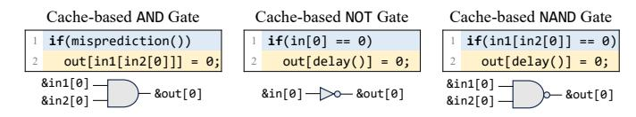

# II. BACKGROUND

#### *A. Memory Dependence Predictor*

In out-of-order CPUs, when the address of a store is not ready, a younger load that is speculatively executed may get a wrong value and cause a pipeline rollback, which is due to the address overlap of the store and load (i.e., they have data dependence). If a data-dependent load executes ahead of the store, the CPU has to squash all subsequent instructions and re-execute them. To avoid the performance penalty of such squashes, modern CPUs use the Memory Dependence Predictor (MDP) to predict the data dependence in these cases.

Fig. [1\(](#page-1-0)a) illustrates how the MDP affects the execution of a delayed store–load pair. ❶ When the store address is delayed, the load (and sometimes the store and contextual auxiliary information) is used to select the MDP's state. ❷ The MDP produces a prediction, with 1 indicating a predicted dependence and 0 indicating independence.

Depending on the predicted and the real data dependence, there are three possible cases, as shown in Fig. [1\(](#page-1-0)b). If the prediction is dependence, the load is blocked until the store commits or its address is resolved. If the prediction is independence and correct, the load executes speculatively before the store address is ready, significantly reducing latency. However, if the prediction is independence but the actual case is dependence, the CPU must squash the speculative instructions once the store address is resolved and re-execute them, resulting in a longer execution time than blocking. These timing differences have been used in manual reverseengineering of MDPs on modern CPUs [\[36\]](#page-13-9), [\[37\]](#page-13-7), [\[51\]](#page-14-5).

Fig. 3. Examples of data cache-based  $\mu$ WM gates. The initial value of in[0], in[1], out[0] and the return values of delay() are 0, and the initial states of all cache lines are cache miss.

#### B. Microarchitectural Side-channel Attacks

Microarchitectural units on modern CPUs are typically transparent to software and do not consider architectural security domains, i.e., they are sometimes not isolated across processes or privileges. The shared units may record program behavior, and their states may be observable to software via timing measurements, which gives rise to microarchitectural side channels. For example, the cache state is observable by memory accesses, where a cache hit leads to a shorter time than a cache miss [70]. Cache side-channel attacks can therefore leak control-flow (i.e., which instruction addresses execute) [16], [38] and data-flow (i.e., which data addresses are accessed) [17], [33] information by probing instruction or data caches, as illustrated in Fig. 2.

**Transient attacks**. Microarchitectural side channels may enable other attacks. As shown in Fig. 2, if a branch predictor predicts x < bound as true, the CPU may speculatively execute an out-of-bound access arr[x] before x is resolved. If an attacker uses the accessed data as an address and accesses a cache line in their own address space (e.g., indexed by arr2), the attacker can infer arr[x] via a cache side channel and thereby bypass the bound check of the branch. Attacks that exploit misspeculation to leak data are known as transient attacks [7], [28], [29], [31].

#### C. Microarchitectural Weird Machines

Microarchitectural structures and speculative execution can be combined to construct Microarchitectural Weird Machines ( $\mu$ WMs). A  $\mu$ WM uses microarchitectural state as registers and microarchitectural behaviors as logic gates [13], [65], [66]. By composing gates into circuits,  $\mu$ WMs can implement arbitrary computation (e.g., SHA-1 [13] and AES [66]) while leaving little traces at the architectural level. Fig. 3 illustrates a cache  $\mu$ WM [26] that encodes bit 1 as a cache hit and bit 0 as a cache miss, where addresses targeting different cache lines encode different bits. The initial values of in [0], in [1] and out [0] are 0, the return value of delay() is 0, and the initial states of all cache lines are set to the miss state.

For the AND gate, the branch is trained to give misprediction and speculatively execute line 2. In line 2, if both &in1[0] and &in2[0] miss in cache, the address resolution of &out[0] will be slower than the branch, resulting in &out[0] still missing in the cache. Otherwise, the resolution of &out[0] is faster, and the speculative memory access of &out[0] fills the value into cache. Similarly, for the NOT and NAND gates, if the gate inputs hit in cache, the branch resolution is fast in line 1, and out is not speculatively accessed during a branch misprediction in line 2, producing

a cache miss when probing it. Conversely, if at least one input misses in cache, &out [0] is speculatively accessed and filled in cache, resulting in a cache hit. As NAND is able to build a Turing-complete machine, the cache  $\mu$ WM can realize arbitrary programs [66].

