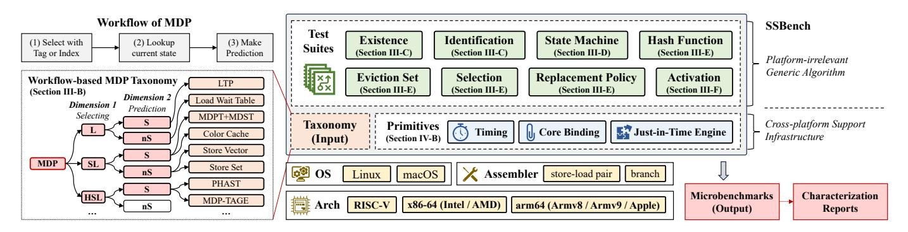

# III. SSBENCH: AUTOMATICALLY IDENTIFYING AND CHARACTERIZING MDPS

To automate the characterization of an MDP, we first need to identify the predictor design: whether it uses both store and load to select the predictor table entry, and whether it incorporates a state machine that provides confidence in its predictions. In this section, we introduce a workflow-based taxonomy, which serves as the input to SSBench (Section III-B). We then design several algorithms for automated MDP identification (Section III-C) and characterization (Section III-D and Section III-E) in SSBench. Finally, we show how to test the security of MDPs based on the characterization (Section III-F).

#### A. Overview of SSBench

An overview of SSBench is shown in Fig. 4. The input to SSBench is the workflow-based taxonomy of MDP designs, which categorizes MDPs into six classes. SSBench provides a platform-agnostic algorithm to identify each design, and then selects the appropriate characterization procedures. To enable cross-platform characterization, SSBench offers a set of abstract primitives. These primitives are implemented on each supported architecture and operating system.

#### B. Workflow-based Taxonomy

Consider the generic workflow of a predictor, as illustrated in Fig. 4. An instruction that triggers a prediction first selects the predictor's table entry using contextual features such as instruction address (IP), data address, or other historical information. The predictor then looks up the entry's current state and produces its final prediction. Based on this workflow, we define two classification dimensions for MDPs.

Dimension 1: Predictor table entry selection method. Some MDPs use only the load IP, ignoring preceding stores [27]. This design is lightweight, but requires stalling a load until all prior stores resolve. Some MDPs use both store and load IPs [9], [62] for finer-grained stalling control. Other complex MDPs integrate additional context like branch history [30] for better prediction accuracy, but with higher hardware overhead. **Dimension 2: State machine for prediction.** Several MDPs do not implement a state machine. If a valid entry is found, the load is simply stalled [49]. This hardware design is simpler but does not consider the dynamic change of the data dependence. Other MDPs include a state machine that dynamically updates confidence for recurring store-load pairs [41]. as shown in Fig Classification results. We perform a systematic survey of existing MDP designs from patents and research papers, and categorize 20 existing MDP designs [2], [9], [12], [18], [27], [30], [32], [39], [41], [42], [46], [47], [49], [57]–[62], [74] based on our workflow-based taxonomy, as shown in Fig. 5.

Fig. 4. Overview of SSBench. We design a workflow-based taxonomy for MDP identification (left), and propose several algorithms for MDP characterization (right). In the taxonomy, the first dimension is the information used for selecting MDP entries (L: only load IP is used, SL: store and load IPs are used, HSL: other information is used). The second dimension is whether the state machine is used (S: stateful, nS: stateless). The leaf nodes are existing MDP designs.

For the first dimension, we denote MDPs that use only the load IP for entry selection as  $\mathbb{L}$ , those that use both store and load IPs as  $\mathbb{SL}$ , and those incorporating additional history as  $\mathbb{HSL}$ . Two MDP designs are outside of the three categories, denoted as  $\mathbb{O}$  (Others), with Store Barrier Cache [18] selected by store IP only, and Branch MDP [12] selected by branch instructions only. Because the design  $\mathbb{O}$  is not common, we exclude it from reverse engineering in this research.

For the second dimension, we denote MDPs with a state machine as S, and those without one as nS. These two dimensions guide SSBench's identification and characterization methods. For example, SL designs require additional consideration of store IPs as potential index or tag bits when reverse-engineering hash functions and organization. Likewise, only stateful MDPs require state-machine characterization.

