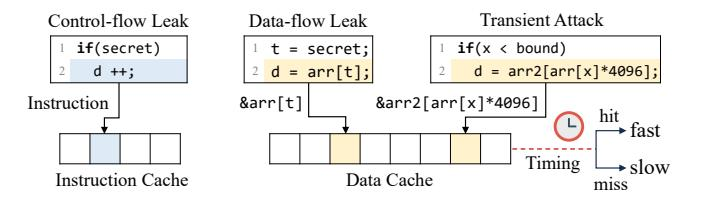

# SSBench: Automated Characterization of Memory Dependence Predictors on Modern CPUs

Chang Liu†, Yu Jin†, Yuchen Fan†, Tianrui Xiao†, Lingfeng Yin‡,

Trevor E. Carlson§, Shuwen Deng†‡(⊠), Dongsheng Wang†‡

†Tsinghua University, {cliu21, jiny25, fanyc22, xiaotr23}@mails.tsinghua.edu.cn, {shuwend, wds}@tsinghua.edu.cn

‡Zhongguancun Laboratory, yinlf@mail.zgclab.edu.cn

§National University of Singapore, tcarlson@comp.nus.edu.sg

Abstract—Memory Dependence Predictors (MDPs) improve the performance of modern CPUs by exposing additional parallelism through predicting data dependence between store and load instructions. Since the 1990s, various MDP designs have been proposed across architectures. Recent studies reveal that MDPs are widely deployed on modern CPUs and can be exploited as side channels to leak data. However, because MDP designs are undocumented, characterizing an MDP design still requires complicated manual analysis.

This paper presents SSBench, the first framework to automate the study of MDPs for security on modern CPUs. We first propose a novel workflow-based MDP taxonomy to classify current MDP designs into six categories, and exploit MDP timing side channels for automated MDP identification. We then propose the counterbased model solver for state machine analysis, and the storeload bounce method for organization analysis. Based on these techniques, we deploy SSBench, which performs cross-platform automated identification and characterization of MDPs on more than 30 CPUs from Intel, AMD, Arm, Apple and RISC-V, and uncovers 14 distinct MDP configurations. Based on SSBench's findings, we propose three novel MDP side-channel attacks. First, on Intel CPUs, we build an MDP-based Weird Machine that achieves up to a 100× performance improvement over state-ofthe-art implementations. Second, on AMD CPUs, we develop a byte-level control-flow attack that breaks the inverse modular function used in RSA key generation in the latest version of WolfSSL. Third, we build the first cache/TLB-free covert channel on Apple CPUs, achieving better performance and stealthiness than the state-of-the-art cache and TLB covert channels.

#### I. INTRODUCTION

Modern CPUs employ speculative execution to increase instruction-level parallelism. To improve the accuracy of speculation, various predictors are employed. For example, the Memory Dependence Predictor (MDP) predicts the data dependence between a load instruction and older store instructions. When a load is predicted to be independent, it is executed out of order (i.e., Speculative Store Bypass, SSB) even if the addresses of older stores are unresolved. Since its introduction in the 1990s [9], numerous designs have been proposed to improve the MDP [30], [32], [41], [46], [49], [58], [62]. So far, the MDP has been widely applied in commercial CPUs [3], [4], [22]. However, because MDPs are transparent to software, their designs often remain undocumented.

On the other hand, the MDP has recently been shown to introduce security issues. The transient execution caused by

MDP mispredictions is one of the root causes of the Spectre-V4 attacks [7], [37], [51]. Moreover, MDPs often violate process and privilege isolation, and can serve as a novel microarchitectural leak source. They have been exploited in side-channel attacks on cryptographic libraries running inside Intel Software Guard Extensions (SGX) [35], machine-learning model extraction [37], and website fingerprinting [36].

However, existing research on MDP security largely relies on complex manual reverse engineering, which cannot provide a comprehensive understanding of MDP security across different platforms. For example, prior work [36] considers only load-indexed Apple MDPs, overlooking designs that incorporate both store and load information, and thereby cannot implement fine-grained MDP side-channel attacks. Another example is the state machine reverse engineering. Unlike branch predictors [71], [72] and prefetchers [8], [20], the MDP exhibits asymmetric performance impacts between dependent and independent cases, where the independent prediction can result in a pipeline flush, while the dependent prediction would only result in a pipeline stall. This additional complexity results in state machines where the prediction threshold and the update values are not symmetrical. For example, AMD's MDP implements the state machine with five counters and ten transfer functions [37], which introduces additional complexity into manual reverse engineering [37].

Meanwhile, current tools for automated reverse engineering mainly focus on characterizing hardware structures such as buffer size and cache associativity [21], [75], or identifying the existence of specific, well-known components, like an existing prefetcher design [55]. These automated reverse-engineering tools tend to be incompatible with the MDP, which may contain indexing tables that utilize multiple IPs, or complex state machines.

In this paper, we address this research gap by tackling the following problems: (Q1) How to automatically identify the existence and design of the MDP on unspecified architectures? (Q2) How to automatically reverse-engineer the state machine of the MDP? (Q3) How to automatically characterize the design parameters of the MDP?

We propose SSBench, the first automated tool for systematic MDP characterization across various architectures. To address Q1, we systematically survey and classify existing MDP designs, and exploit MDP timing side channels to

(⋈) Corresponding author.

automatically identify MDP existence and types on modern CPUs. To address Q2, we construct a counter-based model solver to automatically characterize the state machine of an MDP. To address Q3, we design the store-load bounce method to detect MDP entry collisions and evictions, enabling the characterization of design parameters such as hash functions, table size, associativity, and replacement policy.

We deploy SSBench on 30 CPUs from seven vendors, covering Intel, AMD, Arm, Apple, and RISC-V architectures, and identify three distinct MDP designs. Considering variations in design parameters, these correspond to 14 unique configurations. Using this detailed information, we then demonstrate how SSBench can efficiently uncover its security implications by creating MDP table entry collisions. Based on these, we develop three novel MDP side-channel attacks.

MDP-Gates on Intel. Using SSBench, we find that MDP states can be propagated on Intel CPUs, and the MDP has a 512-entry, direct-mapped table. We exploit it to implement a new microarchitectural Weird Machine (i.e., microarchitectural programming via MDP [\[13\]](#page-13-13), [\[65\]](#page-14-10), [\[66\]](#page-14-11)). Because MDP updates do not require transient execution, MDP-Gates achieves over 100× higher throughput than state-of-the-art Weird Machine implementations [\[26\]](#page-13-14).

MDP-CF on AMD. Using SSBench, we find that loads without preceding stores can update MDP states on AMD CPUs, and implement a byte-level control-flow attack across user processes. By exploiting the fact that AMD's MDP uses the physical address of the load instruction pointer (IP) for indexing, MDP-CF recovers the input parameters of the inverse modular function in the latest version of WolfSSL [\[68\]](#page-14-12) with a 98% success rate in a single trace.

MDP-CC on Apple. Using SSBench, we identify a new MDP design on Apple CPUs, and find that it can be updated by speculative store–load pairs. Based on this finding, we build the first cache and TLB-free covert channel for transient attacks on Apple CPUs, achieving higher bandwidth than prior cache and TLB covert channels [\[19\]](#page-13-15), [\[24\]](#page-13-16), [\[54\]](#page-14-13), while substantially improving stealth, i.e., it operates with nearly zero cache and TLB misses, bypassing performance counter–based detectors [\[6\]](#page-13-17), [\[48\]](#page-14-14), [\[77\]](#page-14-15). We also demonstrate that MDP-CC can transmit data from macOS kernel space to user space, breaking the kernel isolation.

Contributions. In summary, the contributions are as follows:

- ' We present several algorithms to automatically identify and characterize the MDP, including the timing side channels for existence and design type analysis, the counterbased model solver for state machine analysis, the storeload bounce for organization analysis, and collision-based security analysis.
- ' We design SSBench, the first automated framework for MDP characterization. We deploy SSBench on 30 Intel, AMD, Arm, Apple, and RISC-V CPUs, and identify 14 distinct MDP configurations.
- ' Based on SSBench's findings, we propose three novel MDP side-channel attacks on Intel, AMD and Apple CPUs, including MDP-Gates, MDP-CF, and MDP-CC.

Fig. 1. Three distinct detection cases of the MDP for store-load pairs when the store's address is delayed due to arithmetic latency. Prediction denotes the MDP's predicted dependence of the store and load, and dependence denotes the actual dependence, where 1 means dependent and 0 means independent.

Fig. 2. Examples of cache side-channel attacks. An attacker infers cache state from timing differences to leak control-flow or data-flow information, or to construct transient attacks.

The code of SSBench is released under an open-source license. More details can be found in the Artifact Appendix.

