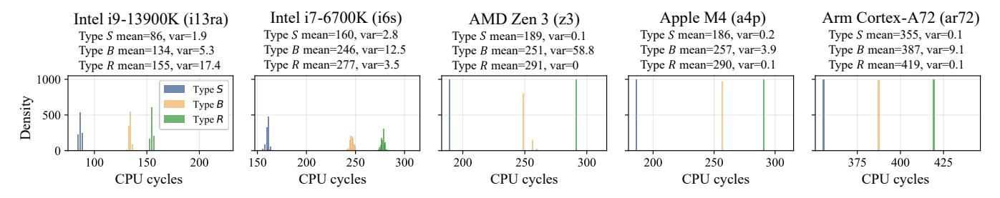

# C. Automated Identification of MDP

In this section, we show how to address Q1 (Automatically identify the existence and design types of the MDP), based on our taxonomy and the MDP timing side channels.

**Notations.** We probe the MDP at fixed store/load IPs using store-pairs from Fig. 6. Following prior work [36], [37], [51], multiplication instructions are used to delay store address generation to amplify observable timing differences (Fig. 1). A store-load pair is denoted as  $Pair_{i_1}^{i_0}$  (store IP  $i_0$ , load IP  $i_1$ ), with IPs varying by address placement. We use  $N_P$  for independent pairs and  $D_P$  for dependent ones, omitting subscripts when IPs are fixed.

#### Identification of the existence of MDP.

If an MDP exists, it initially predicts independence (case 2, Fig. 1), or it conservatively predicts dependence (case 1, Fig. 1) and changes its prediction to independence after a sufficient number of  $N_P \ (\geqslant 10^3, \text{ empirically})$ . For both cases, we can initialize the prediction to independence and treat it as the start of the identification. Otherwise, if the MDP does not exist, loads would always be blocked.

We first test for MDP existence by fixing store/load IPs and executing a sequence of Pairs, measuring times  $T(D_P)$  (dependent) and  $T(N_P)$  (independent). After running a sufficient number of  $N_P$  to initialize the MDP state, we run 100  $N_P$ 

Fig. 5. Workflow-based taxonomy for MDP identification across 20 MDP designs from research papers and patents. The first dimension is the selection mechanism, and the second dimension is the existence of a state machine.

followed by 100  $D_P$ , obtaining 200 timing samples  $t_0$  to  $t_{199}$ . We define:  $T(N_P) = S$  (bypass) for initial state,  $T(D_P) = R$  (Rollback) for first misprediction, and  $T(N_P) = T(D_P) = B$  (Block) after mispredictions. We group samples into three sets:  $T_0 = \{t_0, ..., t_{99}\}, \ T_1 = \{t_{100}\}, \ T_2 = \{t_{101}, ..., t_{199}\}.$ 

Fig. 7 shows the distributions of S, B, and R timings with 1,000 samples corresponding to  $T_0$ ,  $T_1$  and  $T_2$  across five CPUs. For clarity, the timing values are truncated to to values below 500 cycles. As shown in the figure, within this range the S, B, and R timing distributions can be clearly and stably distinguished, and the variance within each type is small. On some AMD CPUs, set  $T_2$  contains type B together with a small number of R. However, there is no overlap between different sets. Further analysis of the noise points

Fig. 6. An example microbenchmark used for MDP states probing in SSBench. The parameter dep controls the dependence in stld. Variables st\_addr and ld\_addr are the data addresses of the store and load.

shows that all noise samples are larger than the maximum R and exhibit a long-tail distribution. This is because the noise mainly originates from transient frequency fluctuations or context switches, making the noise samples sparse and low-frequency. Therefore, we employ DBSCAN [10] to filter out noise and distinguish different timing types.

In DBSCAN,  $\epsilon$  denotes the neighborhood radius that determines whether nearby samples are density-connected, while minPts specifies the minimum number of neighbors required for a point to be treated as a core point in a dense cluster. As shown in Fig. 7, the execution times on each device form several compact clusters whose variances are small, and the noise samples tend to appear as sparse points deviating toward larger execution times. Therefore, we set minPts to 100 and set  $\epsilon=2$  empirically, which is sufficient to connect dense points within the same cluster while filtering out noise.

Applying DBSCAN to each set, we extract min/max values per cluster. We conclude that an MDP exists iff  $\max(T_0) \leq \min(T_2)$  (S/B distinguishable) and  $\min(T_1) \geq \max(T_2 \backslash T_1)$  (B/R distinguishable).

Identification of the design. After MDP detection, SSBench classifies its design type. For  $Dimension\ I$ , we use pairs  $Pair_0^0$ ,  $Pair_1^0$ , and  $Pair_0^1$ . After training with  $D_P^0$ , we measure  $T(N_P^1)$  and  $T(N_P^1)$ . If  $T(N_P^1) = B$  and  $T(N_P^1) = S$ , the design is L or HSL. Otherwise, if both are S, the design is SL or HSL. If the design is HSL, the MDP is indexed with a hash function of branch history and the load IP [41], [49]. To test whether the design is HSL, we train the MDP using  $D_P$  under a fixed and sufficiently long history [71]. If the history information is used, a specific table entry will be selected for the Pair, whereas random histories will not select that entry. We then reset the MDP using  $N_P$  under random branch histories, and test under the same fixed history using  $N_P$ . If  $T(N_P) = B$ , it indicates the history-based selection is used. Otherwise, if  $T(N_P) = S$ , it indicates the design is not HSL.

For Dimension 2, we use  $Pair_0^0$ . After  $D_{P0}^0$  causes a rollback, we repeatedly run  $N_{P0}^0$ . A transition from B to S indicates a stateful design (S). Otherwise, if the prediction does not change and  $T(N_P)$  remains at B, it indicates a stateless design (nS), and the prediction can only be reset by periodic prediction table flushes [9] or table entry eviction. Solution to Challenge 1: Eliminating interference from

other predictors. To prevent other microarchitectural components from affecting the execution time of Pair, we introduce additional randomization, as shown in the C code in Fig. 6. To avoid the effects of the address predictor [29], we randomly generate a base address for each Pair. To avoid the effects of the value predictor [28], we input random values to the store target and load source. To avoid the effects of prefetchers [55], [63], we access the store and load data addresses before executing each Pair, ensuring they reside in the cache. Finally, to avoid the effects of the Predictive Store Forwarding Predictor (PSFP) [37] and memory renaming [53], we further analyze the execution times in  $T_2$ . If both B and S are observed in  $T_2$ , the load is executed out-of-order even when data dependence occurs. If so, in subsequent analyses we adjust the S in  $D_P$ samples to B, and the R in  $N_P$  samples to B (when PSFP gives a misprediction on the data dependence).

#### D. Automatically Characterizing the State Machine

In this section, we show how to address **Q2** (**Automatically characterizing the state machine of the MDP**), based on the counter-based model solver.

Modeling the state machine with hardware counters. Unlike branch predictors [72], MDPs have asymmetric misprediction penalties, leading to unbalanced state machines. For example, switching from dependence to independence may require more independent pairs than the reverse [51]. MDPs also exhibit a cold-start property, with initial transitions needing many mispredictions [37]. We therefore introduce a counter-based state-machine model in Fig. 8.

The state machine uses one or more hardware counters, with predictions based on current counter values and a predicate. Actual dependence outcomes update the counters. For a single counter, update behavior is defined by four parameters  $(upd_{0t}$  to  $upd_{1f})$ , where 0/1 indicates non-dependence/dependence prediction and t/f indicates prediction accuracy. Three additional parameters specify the counter's upper bound (bnd) and overflow/underflow reset behavior (ovf, unf). The model can be extended to multiple counters where output depends on several counters simultaneously (Fig. 8). While adding counters enables representing any state machine, it increases model complexity.

**Model simplification.** In this study, considering the design goals and the extra overhead of MDPs, we further simplify the counter-based model heuristically. In this simplified model, we make the following assumptions: (1) The MDP's initial state is 0 and predicts independence, with unf = 0. If the initial prediction is dependence, we run numerous  $N_P$  to initialize its state to 0. (2) A sufficiently long sequence of independent pairs  $(N_P)$  resets the MDP to state 0, thus  $upd_{1f} = -1$ . (3) The MDP uses a single threshold parameter ths, where the predicate is  $c \le ths$ . Our analysis shows that the simplified model sufficiently covers the MDP design on all tested CPUs. **Counter model solver.** We solve these parameters using Algorithm 1. The insight of this algorithm is to use the automated search to identify boundary conditions. For example, bound  $x_1$  represents the number of  $D_P$  required for the counter to

Fig. 7. Time distribution of S, B and R on five CPUs under test. On all of the tested CPUs, S, B and R have small variance and are clearly distinguishable.

Fig. 8. The state machine models. The single-counter model contains one predicate and seven parameters, and the double-counter model contains three predicates and more parameters.

Fig. 9. Workflow of Algorithm 1 when  $x_3 = \infty$ . Variables  $x_1$ ,  $x_2$ ,  $x_3$ ,  $x_4$ ,  $x_4'$ ,  $x_5$  and  $x_6$  are resolved (with the related lines of the algorithm illustrated), and are used to generate a system of inequalities for state machine parameters.

first transition from below ths to above it. We then formulate equations based on these observed transitions, treating the parameters as unknowns. Fig. 9 illustrates the workflow of Algorithm 1 when  $x_3 = \infty$  and lines 9 to 14 are touched. The algorithm begins by finding the minimal repetition  $x_1$  required to make the counter larger than ths, which establishes the relationship between  $upd_{0f}$  and ths. The algorithm then finds the minimal repetition  $x_2$  required to decrease the counter to ths after  $x_1 \times upd_{0f}$  is executed, which establishes the relationship between  $upd_{1f}$  and ths. The algorithm then tests if  $upd_{0t} > 0$ , which means  $x_3 = \infty$ . If  $upd_{0t} > 0$ ,  $x_4$  establishes the relationship between  $upd_{1t}$  and  $upd_{1f}$ . Finally,  $x_5$  and  $x_6$  establish the relationship between  $upd_{1t}$  and  $upd_{0f}$ ,  $upd_{0f}$  and ths.

**Solution to Challenge 2: Characterizing two MDPs on the same core.** When a core employs two MDPs simultaneously [37], e.g., MDP-1 indexed by load IP only and MDP-2 by both store and load IPs, isolation is necessary during

