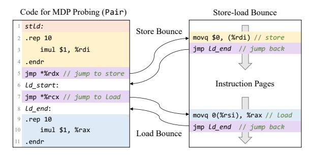

# <span id="page-5-2"></span>Algorithm 1 Parameter Solving for the Single-Counter Model

```
Input: Store-load pair a and n, and timing differences S, B and R
     Output: upd_{0t}, upd_{1f}, upd_{0f}, upd_{1t}, bnd, ovf, unf, ths
    upd_{1f} \leftarrow -1 // Assumption: counter decreases on independent cases
 2: unf \leftarrow 0 // Assumption: on underflow
 3: x_1 \leftarrow \min T((x+1)D_P) = xR B
 4: x_2 \leftarrow \min_{x \in \mathbb{R}} T(x_1 D_P (x+1) N_P) = x_1 R x B S
 5: x_3 \leftarrow \min^{x} T(x_1 D_P (x+1) D_P) = x_1 R x B R
 6: EQ_1 \leftarrow (x_1 - 1) \cdot upd_{0f} \leqslant ths < x_1 \cdot upd_{0f}
 7: EQ_2 \leftarrow ths = x_1 \cdot upd_{0f} - x_2
 8: if x_3 = \infty then // no overflow, no decrease on dependent cases
         x_4 \leftarrow \max_{x} T((x_1 + y)D_P(x + 1)N_P) = x_1R(y + x)BS, \ \forall \ y
 9:
         x_4' \leftarrow \min \ T(x_1 D_P \ (x_2 - 1) N_P \ D_P \ (x + 1) N_P)
10:
11:
                        = x_1 R (x_2 + x) B S
12:
         EQ_3 \leftarrow upd_{1t} = x_4' - 1
13:
         EQ_4 \leftarrow bnd = x_4 + ths
14:
         EQ_5 \leftarrow ovf = 1
15: else // overflow or counter decreases on dependent cases
         x_4 \leftarrow \min \ T((x_1+1)D_P \ (x+1)N_P) = x_1 R \ (x+1)B \ S
16:
17:
         if x_4 > x_2 then // overflow when the counter reaches bnd and reset
             x_4' \leftarrow \min \ T(x_1 D_P) (x_2 - 1) N_P (x + 1) D_P)
18:
                            = x_1 R (x_2 - 1 + x) B R
19:
20:
             x_4'' \leftarrow \min_{x_1} T(x_1D_P(x_2-1)N_P(x_4'-1)D_P xN_P 2D_P)
21:
                            = x_1 R (x_2 + x_4' + x) B
22:
             EQ_3 \leftarrow upd_{1t} > 0
             EQ_4 \leftarrow bnd - ths = x_4' \cdot upd_{1t} - x_4''
23:
             EQ_5 \leftarrow ovf = 0
24:
25:
         else // counter decreases on dependent cases
26:
             x_4' \leftarrow \min \ T(x_1 D_P \ (x_2 - 1) N_P \ (x + 2) D_P)
27:
                            = x_1 R (x_2 - 1) B S x B
28:
             x_4'' \leftarrow \min \ T(x_1 D_P \ (x_2 - 1) N_P \ (x_4' + 1) D_P \ (x + 1) N_P)
             = x_1 R (x_2 - 1) B S x_4' R x B S

EQ_3 \leftarrow upd_{1f} = x_4'' - 1 - x_4' \cdot upd_{0f}
29:
30:
             EQ_4 \leftarrow bnd = x_1 \cdot upd_{0f}
31:
32:
             EQ_5 \leftarrow ovf = 1
33:
34: end if
35: x_5 \leftarrow \min T((x_1 - 1)D_P N_P (x + 1)D_P) = (x_1 - 1)R S x R B
36: x_6 \leftarrow \min \ T((x_1 - 1)D_P \ N_P \ x_5D_P \ (x+1)N_P)
                    = (x_1 - 1)R S x_5 R x B S
38: EQ_6 \leftarrow x_1 \cdot upd_{0f} + upd_{0t} = x_6 + ths
39: EQ_7 \leftarrow upd_{0t} \leq ths
40: Solve the system of inequalities \{EQ_1, ..., EQ_7\} and get parameters
```

testing. (1) For MDP-1 characterization, we use multiple  $Pair_0^x$  sharing the same load IP but different store IPs. After each  $D_{P_0^x}$  in Algorithm 1, we switch to  $D_{P_0^{x+1}}$  and  $N_{P_0^{x+1}}$  to avoid MDP-2 interference from its historical entries. (2) For MDP-2, we use  $Pair_0^0$  and  $Pair_0^1$ , executing Algorithm 1 primarily with  $D_{P_0^0}$  and  $N_{P_0^0}$ . After each  $D_{P_0^0}$ , sufficient  $N_{P_0^1}$ 



<span id="page-6-1"></span>Fig. 10. Store-load bounce for organization characterization, where the store and load in stld are replaced with branches jumping to instruction pages.

executions reset MDP-1's counter state to eliminate its impact on MDP-2 observations.

#### <span id="page-6-0"></span>E. Automatically Characterizing the Organization

A predictor typically maintains a prediction table to support simultaneous predictions for different instructions. We refer to the structure of this table as the organization of the MDP. In this section, we show how to address Q3 (Automatically characterizing the organization of the MDP), based on the store-load bounce. We only describe the methods to characterize the MDPs in design category L, and the method can naturally extend to other designs.

Store-load Bounce. To automatically and efficiently generate the stores and loads at different IPs, we extend the code shown in Fig. 10. In the stld function, we replace the original stores and loads with branches that jump to an instruction page. By pre-filling this instruction page with store and load addresses, we can execute stores and loads with different IPs in a limited search space efficiently. After executing the store or the load, the code jumps back and executes other arithmetic instructions. Hash function reverse-engineering. In hardware implementations, the IP is often compressed before table indexing to reduce hardware cost [15]. We refer to this compression function as the hash function. To automatically reverse engineer the hash function, we use the store-load bounce. First, we use a fixed store-load pair  $Pair_{x_0}^y$  to saturate the MDP's state machine counter with enough  $D_{P_{x_0}}^y$ . Next, we change the IPs to execute another store-load pair  $Pair_{x_1}^y$ , measuring execution time of  $N_{P_{x_1}}^y$ . If we observe  $T(N_{P_{x_1}}^y) = B$ , it means  $x_0$  and  $x_1$  have the same hash value. We collect all addresses that collide with  $x_0$  into a set  $\mathbb{X}$ .

We then construct a differential matrix  $\mathbf{R}$  where  $\mathbf{R}_{i,j}$  is the j-th bit of the XOR between addresses in the i-th pair from  $\mathbb{X} \times \mathbb{X}$ . The nullspace  $N(\mathbf{R}) = \{x \mid \mathbf{R}x = 0\}$  captures linear relationships among input bits, with its dimension equal to the number of hash output bits. Each basis vector maps input bits to an output bit, e.g.,  $\mathbf{x} = \{1,1,1,0\}$  in 4-bit space implies XOR of lowest three bits produces one output. Zero-dimensional nullspace indicates nonlinear hash and requires other heuristic methods [15], [52]. Empirically, in this research, all tested MDP hash functions are linear.

Eviction-set construction and associativity inference. Next, we use addresses with different hash values to construct an

