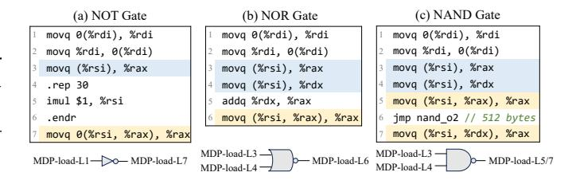

# *D. Results of Characterization*

Table [II](#page-8-0) lists the test results across 30 CPUs. Depending on the parameter difference, we identify 14 distinct MDP configurations, belonging to three MDP design categories. For other types, we use the gem5 simulator to demonstrate the effectiveness of SSBench to identify these MDPs. In this section, we introduce the key results of MDP characterization and highlight SSBench's new findings.

Intel. Intel CPUs maintain the state machine and directmapped architecture discovered in [\[51\]](#page-14-5), but *after the 12th*

TABLE II

EXPERIMENTAL RESULTS OF SSBENCH ON 30 CPUs. V-IP MEANS SELECTION BY VIRTUAL IP. REP MEANS REPLACEMENT POLICY.

| x86-64*                                 | Design              | State Machine                                                                   | V-IP                                       | Hash Function                                                                                                                                                                                                   | Size                 | Way                  | Tag                     | Index       | Rep                        |
|-----------------------------------------|---------------------|---------------------------------------------------------------------------------|--------------------------------------------|-----------------------------------------------------------------------------------------------------------------------------------------------------------------------------------------------------------------|----------------------|----------------------|-------------------------|-------------|----------------------------|
| i6s, i7k, i8c, i9cf, i10cm, i11ro | L-S                 | 0, -1, 15, 14, 15, 1, 0, 0                                                      | ~                                          | [0], [1], [2], [3], [4], [5], [6], [7]                                                                                                                                                                          | 256                  | 1                    | -                       | 0-7         | -                          |
| i12a, i13ra, i14ra, ixg6s            | L-S                 | 0, -1, 15, 14, 15, 1, 0, 0                                                      | ~                                          | [0], [1], [2], [3], [4], [5], [6], [7], [8]                                                                                                                                                                     | 512                  | 1                    | -                       | 0-8         | -                          |
| z3-mdp1                                 | SL-S                | 0, -1, 4, 3, 4, -1, 0, 0                                                        |                                            | [0,12,24,36], [1,13,25,37], [8,20,32,44],                                                                                                                                                                       |                      |                      | -**                     |             |                            |
| <b>z3</b> -mdp2                         | L-S                 | 0, -1, 15, 16, 62, 1, 0, 30                                                     | X                                          | [2,14,26,38], [3,15,27,39], [9,21,33,45],                                                                                                                                                                       | 32                   | 2                    | 4-11                    | 0-3         | LRU                        |
| z4                                      | L-S                 | 0, -1, 14, 0, 42, 1, 0, 28                                                      | [4,16,28,40], [5,17,29,41], [10,22,34,46], | 32                                                                                                                                                                                                              | 2                    | 4-11                 | 0-3                     | FIFC        |                            |
| <b>z</b> 5                              | L-S                 | 0, -1, 14, 16, 60, 1, 0, 28                                                     |                                            | [6, 18,30,42], [7,19,31,43], [11,23,35,47]                                                                                                                                                                      | 64                   | 4                    | 4-11                    | 0-3         | NLRU                       |
| Arm64 / RISC-V                          | Design              | State Machine                                                                   | V-IP                                       | Hash Function                                                                                                                                                                                                   | Size                 | Way                  | Tag                     | Index       | Rep                        |
|                                         |                     |                                                                                 |                                            |                                                                                                                                                                                                                 |                      |                      |                         |             |                            |
| ar72                                    | L-nS                | -                                                                               | ~                                          | [2], [3], [4], [5], [6], [7], [8], [9], [10], [11], [12], [13], [14], [15]                                                                                                                                      | 16                   | 16                   | 6-15 ***             | -           | PLRU                       |
| ar72 ar73                            | L-nS L-nS        | -                                                                               | v v                                     |                                                                                                                                                                                                                 | 16 16             | 16 16             |                         | -           | PLRU                       |
|                                         |                     | - - 0, -1, 14, 0, 14, 1, 0, 0                                             | •                                          | [12], [13], [14], [15] [2], [3], [4], [5], [6], [7], [8], [9], [10], [11],                                                                                                                                   |                      |                      | ***                     |             |                            |
| ar73                                    | L-nS                | _                                                                               | ~                                          | [12], [13], [14], [15] [2], [3], [4], [5], [6], [7], [8], [9], [10], [11], [12], [13], [14], [15], [16] [2], [3], [4], [5], [6], [7], [8], [9], [10], [11],                                                     | 16                   | 16                   | *** 2-16             | -           | FIFO                       |
| ar73                                    | L-nS L-S         | 0, -1, 14, 0, 14, 1, 0, 0                                                       | ~                                          | [12], [13], [14], [15] [2], [3], [4], [5], [6], [7], [8], [9], [10], [11], [12], [13], [14], [15], [16] [2], [3], [4], [5], [6], [7], [8], [9], [10], [11], [12], [13], [14]                                    | 16 32             | 16 32             | *** 2-16 2-14           | -           | FIFO                       |
| ar73 ar76 alp                     | L-nS L-S SL-S | 0, -1, 14, 0, 14, 1, 0, 0 0, -1, 3, 1, 7, 1, 0, 0                            | ~                                          | [12], [13], [14], [15] [2], [3], [4], [5], [6], [7], [8], [9], [10], [11], [12], [13], [14], [15], [16] [2], [3], [4], [5], [6], [7], [8], [9], [10], [11], [12], [13], [14]  [2], [3], [4], [5], [6], [7, 14], | 16 32 90       | 16 32 90       | *** 2-16 2-14 0-11      | - - - | FIFO FIFO LRU LRU |
| ar73 ar76 a1p a1e, a2e, a3e    | L-nS L-S SL-S SL-S  | 0, -1, 14, 0, 14, 1, 0, 0 0, -1, 3, 1, 7, 1, 0, 0 0, -1, 3, 1, 7, 1, 0, 0 | <i>v</i>                                   | [12], [13], [14], [15] [2], [3], [4], [5], [6], [7], [8], [9], [10], [11], [12], [13], [14], [15], [16] [2], [3], [4], [5], [6], [7], [8], [9], [10], [11], [12], [13], [14]                                    | 16 32 90 21 | 16 32 90 21 | *** 2-16 2-14 0-11 0-11 | - - - | FIFO FIFO LRU        |

i6s: Intel i7-6700K (Skylake). i7k: Intel i7-7700K (Kaby Lake). i8c: Intel i5-8400 (Coffee Lake). i9cf: Intel i7-9700 (Coffee Lake). i10cm: Intel i7-10700 (Comet Lake). i11ro: Intel i7-11700 (Rocket Lake). i12a: Intel i9-12900K (Alder Lake). i13ra: Intel i9-13900K (Raptor Lake). i14ra: Intel i9-14900K (Raptor Lake). ixg6s: Intel Xeon Gold 6438Y+ (Sapphire Rapids). z3: AMD EPYC 7543 (zen 3). z4: AMD Ryzen 7950X (zen 4). z5: AMD Ryzen 9950X (zen 5). ar53: Arm Cortex-A53. ar55: Arm Cortex-A55. ar510: Arm Cortex-A510. ar72: Arm Cortex-A72. ar73: Arm Cortex-A73. ar76: Arm Cortex-A76. ale: Apple M1 efficiency core. alp: Apple M2 performance core. a2p: Apple M2 performance core. a2p: Apple M3 performance core. a3e: Apple M3 efficiency core. rvcc910: OpenC910 Core. rvx60: Spacemit X60. rvbcom: SonicBOOM [78].

generation, the number of entries in the table doubled. Correspondingly, the number of bits used for indexing increases from the lowest 8 bits of the load IP to 9 bits.

AMD. AMD Zen 3 uses two MDPs, one in type L-S and the other in type SL-S. The latter also performs forwarding prediction, consistent with [37]. Zen 4 and Zen 5 CPUs only retain the MDP in type L-S. The design parameters of the state machine are also slightly adjusted on Zen 4 and Zen 5. AMD's MDP includes a startup process that requires three mispredictions to activate, thus their state machines set *ths* to be greater than 0. For organization, all three generations of AMD CPUs use the physical IP for indexing, and share the same 12-bit stride hash function. Notably, SSBench is the first to identify a multi-way associative MDP design on AMD CPUs and observe different replacement policies employed in Zen 3, Zen 4, and Zen 5.

**Arm.** We identify different MDP designs across various Arm CPUs. The Cortex-A72 and Cortex-A73 CPUs do not use a state machine. As long as an entry matches and is valid, they predict 1 (dependence) until it is evicted. SSBench *identifies a new state machine in the Cortex-A76*, which is initialized to 14 when the first data dependence occurs, and is unaffected by dependence but is decremented when independence occurs. Like Intel CPUs, Arm's MDPs generally use the lower bits of the load's virtual IP for indexing, but with more bits used. Arm CPUs mostly adopt a fully associative table structure, but with varying replacement policies, including tree-PLRU and FIFO.

Apple. Apple's M-series CPUs generally use similar MDP designs. Notably, SSBench is the first to discover that *Apple's MDP is in design type* SL-S. The state machine in Apple's MDP employs a 3-bit counter, incrementing on data dependence and decrementing on independence. The MDP uses the hashed load's virtual IP [36] as the tag. Apple CPUs use different numbers of entries in their big and little cores.

#### E. Security Evaluation Results

Table III presents the results of the security test of SSBench. Due to space limitations, we only select several CPUs as examples. The results indicate that current CPUs implement an MDP on each core, but do not provide process isolation. As a result, MDPs may leak traces of a previous process on the same core. For example, Intel's MDP does not isolate between SGX and the normal world, leading to MDPeek attacks [35]. AMD's MDP does not provide isolation between processes, which enables cross-process Spectre-V4 attacks [37].

**Security Insight 1:** Processes on the same core share the MDP on most Intel, AMD and Apple CPUs, resulting in cross-process and cross-privilege leaks.

SSBench also shows that MDP states can be propagated, meaning that MDP-induced load blocking can delay the store address generation of another store—load pair, thereby updating another MDP entry. This ability enables the MDP to construct

\*\* z3-mdp1 overlaps with AMD's PSFP and cannot be characterized directly through SSBench.

\*\*\* Results of bits 2-5 on ar72 are used for offset.

TABLE III
SECURITY ANALYSIS OF MDP ON SOME CPUS

|            | Isol    | ation      | Trigger Characterization |             |                |          |  |
|------------|---------|------------|--------------------------|-------------|----------------|----------|--|
| CPU ID     | Process | Privilege  | Chaining                 | No Delay | Single Load | Spec     |  |
| i13ra      | Х       | Х          | V                        | Х           | Х              | ~        |  |
| <b>z</b> 3 | X       | X          | <b>V</b>                 | <b>V</b>    | <b>V</b>       | <b>V</b> |  |
| ar76       | X       | <b>/</b> * | <b>✓</b>                 | <b>V</b>    | V              | ~        |  |
| a2e        | X       | X          | <b>✓</b>                 | <b>~</b>    | X              | ~        |  |
| a2p        | X       | X          | <b>✓</b>                 | <b>~</b>    | X              | ~        |  |

\* MDP states persist during context switch, but do not share with privileged loads

TABLE IV
EXECUTION TIME (IN SECONDS) OF SSBENCH ON SOME CPUS.

| CPU ID     | Test Time | State Machine | Hash Function*  | Organization    |
|------------|-----------|---------------|-----------------|-----------------|
| i13ra      | 2531.59 s | 59.92 (2.4%)  | 2417.47 (95.5%) | 54.21 (2.1%)    |
| <b>z</b> 3 | 4047.87 s | 77.99 (1.9%)  | 2467.47 (61.0%) | 1502.47 (37.1%) |
| ar76       | 1474.41 s | 92.29 (6.3%)  | 920.92 (62.5%)  | 461.20 (31.2%)  |
| a4e        | 3500.45 s | 125.66 (3.6%) | 1895.27 (54.1%) | 1479.52 (42.3%) |
| a4p        | 2102.49 s | 41.541 (2.0%) | 359.27 (17.1%)  | 1701.68 (80.9%) |

\* We separate the time of hash function test from organization test.

Weird Machines (Section V-A). Additionally, SSBench finds that, except for Intel, non-delayed store—load pairs can also update MDPs on other CPUs. On AMD CPUs, even a load without a preceding store can update the MDP, making MDP leaks on AMD CPUs more powerful (Section V-B).

**Security Insight 2:** A load without preceding stores can update the MDP on AMD Zen 3 to Zen 5 CPUs, resulting in control flow leaks of a single load.

Finally, SSBench finds that uncommitted store-load pairs can update the MDP, suggesting that MDPs can serve as a covert channel for transmitting secrets during transient attacks. Our experiments show that, on Apple CPUs, MDP covert channels have better performance than the cache and TLB covert channels in both true capacity and stealth (Section V-C).

**Security Insight 3:** An uncommitted store-load pair can update the MDP on all tested CPUs, meaning the MDP can transmit secrets in a transient attack.

#### F. Execution Time

Table IV shows the test time of SSBench. Due to space limitations, we only select several CPUs as examples. On most of the tested CPUs, the execution time of SSBench is under 2 hours. The majority of the time is spent on the organization testing, especially on the hash function testing. The time for hash function testing depends on the size of the searched address space, and it increases linearly with the size of the testing space. The time for organization testing depends on the MDP table size and associativity. Larger table sizes and higher associativity result in larger eviction sets, requiring more storeload pairs to be executed for each eviction.

Fig. 11. The NOT, NOR and NAND gates based on Intel MDP. Table entries selected by loads in blue serve as the input, while those in yellow serve as the output. For the NAND gate, two loads in yellow share the same entry.

#### V. CASE STUDIES

#### A. MDP-Gates on Intel

Insights from SSBench. SSBench shows that MDP state can propagate from one table entry to another, and shows that recent Intel CPUs expose up to 512 entries in a direct-mapped structure, which ensures that, in the absence of hash collision, predictor outcomes for loads can be persistently preserved. Finally, on Intel CPUs, the MDP update is activated only if the load address is resolved earlier than the store. Combining these findings, Intel MDP can construct an efficient  $\mu$ WM.

**Threat Model**. Following previous work [13], [26], we assume an adversary aims to hide malicious computation circuits (e.g., ALU) inside microarchitectural state to evade software-level detection. The adversary has user-level privileges, and can execute unprivileged code to probe MDP state. The attacker encodes a bit using two MDP states: dependence for bit 1 and independence for bit 0. Initially, all targeted MDP entries are set to 0.

Weird Gates. Fig. 11(a) shows the NOT gate construction. A delayed store-load pair is issued: line 1's load delays line 2's store address, so line 3's load activates the MDP, selecting entry  $E_1$  as input. If  $E_1=1$ , line 3's load is blocked, delaying rax readiness and preventing line 7's load from resolving early. Additional multiplication instructions ensure line 7's load does not activate  $E_2$ , leaving it 0. If  $E_1=0$ , line 3's load issues early, making rax and line 7's address ready before the store, activating the  $E_2$  update. By setting the load in line 7 dependent on the store, the MDP is updated to set  $E_2=1$ , making  $E_2$  the negation of  $E_1$ 's initial state and implementing the NOT gate.

By exploiting additional data dependence, we implement NOR and NAND gates. For the NOR gate, two MDP entries  $E_1$  and  $E_2$  encode the two input bits. Only when both inputs are 0 does the load in line 6 resolve prior to the store, activating entry  $E_3$ . By ensuring that the load in line 6 is dependent on the store,  $E_3$  is set to 1. If either  $E_1$  or  $E_2$  equals 1, the address of the load in line 6 is delayed, preventing the update of  $E_3$ , which remains 0, thereby implementing NOR semantics.

The NAND gate is analogous, but we propagate the states of  $E_1$  and  $E_2$  to two loads in lines 5 and 7, colliding on the same MDP entry  $E_3$ . If at least one of  $E_1$  or  $E_2$  equals 0,  $E_3$  will be activated. By ensuring the loads in lines 5 and 7 are dependent to the store,  $E_3$  is updated to 1. When  $E_1 = E_2 = 1$ , both

TABLE V EVALUATION OF MDP-GATES

| MDP-Gates                       | NOT              | Assign           | OR               | NOR               | NAND              | XOR               |
|---------------------------------|------------------|------------------|------------------|-------------------|-------------------|-------------------|
| Accuracy Time / 107 gates | 99.96% 2.10 s | 99.89% 2.05 s | 99.19% 3.22 s | 99.83% 3.08 s  | 99.45% 3.20 s  | 99.60% 3.14 s  |
| Cache-Gates                     | NOT              | Assign           | OR               | NOR               | NAND              | XOR               |
| Accuracy Time / 107 gates | 82.77% 9.82 s | 69.58% 8.98 s | 82.91% 8.82 s | 74.23% 25.74 s | 82.83% 22.25 s | 75.12% 47.05 s |

TABLE VI COMPARISON ON CIRCUITS OF MDP-GATES AND DATA CACHE-GATES

| Weird Circuit |          |                    | MDP-Gates |         | Data Cache-Gates   |  |  |
|---------------|----------|--------------------|-----------|---------|--------------------|--|--|
|               | Strategy | Naive Best-of-5 |           | Naive   | Best-of-5          |  |  |
| Adder         | Accuracy | 92.63%             | 97.12%    | 67.15%  | 75.37%             |  |  |
|               | Time     | 0.238 ms           | 1.191 ms  | 41.9 ms | 47.1 ms            |  |  |
|               | Strategy | Naive              | Best-of-5 |         | Gates of Time [26] |  |  |
| ALU           | Accuracy | 87.53%             | 99.38%    |         | 43.7% to 84.1%     |  |  |
|               | Time     | 0.882 ms           | 4.423 ms  | 106 ms  |                    |  |  |

loads in lines 3 and 4 are blocked, and E3 remains 0, thereby implementing NAND semantics.

Following prior works [\[13\]](#page-13-13), [\[26\]](#page-13-14), we implement a 4-bit adder and a 4-bit ALU using MDP-Gates. We provide both a simple version and an error-correction version using bestof-5 majority voting. For comparison, we also reproduce data cache–based gates from prior works [\[13\]](#page-13-13), [\[26\]](#page-13-14), [\[65\]](#page-14-10).

Evaluation. We evaluate MDP-Gates on an Intel i9-13900 CPU, measuring accuracy and execution latency for each gate type, as shown in Table [V.](#page-10-1) MDP-Gates achieve over 99% accuracy with execution time below 1 µs across all gates. Twoinput gates execute one or two additional loads, resulting in slightly higher latency than the single-input gate. Compared to the cache gates, the MDP-Gates achieve better accuracy and faster speeds from 3ˆ to 15ˆ.

Table [VI](#page-10-2) shows MDP-Gates achieve over 85% accuracy for 4-bit adder/ALU without error correction. Best-of-5 replication improves accuracy but increases latency 5ˆ because of the replication and majority voting overhead. Our gates can be further improved by equipping them with more efficient faulttolerance strategies from prior work [\[66\]](#page-14-11). Compared to cache gates on the same CPU, MDP-Gates show higher accuracy and ą 100ˆ lower latency, significantly outperforming prior cache-based implementations according to their reported data [\[26\]](#page-13-14) by over two orders of magnitude in execution speed. Discussion. The results above demonstrate that MDP-Gates achieve higher accuracy and significantly better performance than state-of-the-art cache gates. We attribute these advantages to two reasons. First, MDP state propagation does not rely on transient execution [\[65\]](#page-14-10), and therefore avoids the additional costs of predictor training or pipeline rollback. Second, MDP-Gates do not depend on cache residency, making them nearly insensitive to interference from prefetchers [\[26\]](#page-13-14), cache replacement policies, and cache coherence.

Fig. 12. Attack procedure of MDP-CF on inverse modular.

#### *B. MDP-CF on AMD*

Insights from SSBench. SSBench reveals that AMD's MDP is not isolated between different processes, which aligns with the previous research [\[37\]](#page-13-7). SSBench also has a new finding: AMD's MDP can be updated by loads even when no preceding store exists. This means AMD's MDP significantly increases the vulnerable loads compared to prior work [\[35\]](#page-13-8), i.e., from loads with preceding delayed stores to any loads.

Threat Model for Local User-level Attackers. We follow the common local attack models [\[8\]](#page-13-10), [\[11\]](#page-13-36), [\[25\]](#page-13-33), assuming the userlevel attacker can execute unprivileged instructions and pin the attack process to a core shared with the victim. The attacker can also preempt the victim process [\[79\]](#page-14-31) before priming and probing the MDP. Following previous research [\[8\]](#page-13-10), [\[25\]](#page-13-33), we simply use the victim process's yield to emulate synchronization. The victim is another user process running WolfSSL version 5.8.4 [\[68\]](#page-14-12), the latest version at the time of our submission. The attacker targets the \_sp\_invmod\_bin() function, which takes two secret integers u and v and runs the extended Euclidean algorithm (BEEA) to compute v ´1 mod u. The function \_sp\_invmod\_bin() is called during RSA key generation when the configuration flag DRSA\_MIN\_SIZE is set and the private key size is no more than 1,024 bits.

The attacker exploits the MDP side channel to determine, for every iteration of the modular inversion, which loads are executed alongside one of the branch paths, thereby recovering the branch direction and inferring u and v.

Attack Workflow. The workflow of MDP-CF is illustrated in Fig. [12.](#page-10-3) ❶ The attacker creates hash-colliding MDP entries with the victim's loads in the attacker address space, and initializes the counters to 32. ❷ Then the control is transferred to the victim. Depending on the current values of u and v, the victim takes one of the four branch paths and executes the corresponding loads, which in turn update the related MDP entries. ❸ After each iteration, the attacker preempts the victim process, and probes the MDP counters to determine which branch is taken in that round.

Attack Evaluation. We compile WolfSSL using its default compiling optimization. Across the four branch paths in the \_sp\_invmod\_bin() function, we observe 2, 2, 4 and 4 loads without preceding delayed stores. These loads are not vulnerable to MDPeek [\[35\]](#page-13-8) because a load without preceding delayed store cannot update the MDP on Intel. However, SS-Bench finds that these loads can update AMD MDP, resulting in a larger attack surface on the inverse modular function.

Fig. 13. Attack procedures of MDP-CC in transient attacks (a) and data transmission between kernel and user space (b).

For evaluation, we randomly generate 4096-bit modular inversion inputs. Each attack requires 0.275 seconds to collect the trace and recover u and v, achieving 98% accuracy. Since 100% accuracy is needed for full recovery, we apply mathematical noise reduction [35], boosting 75% of traces to full accuracy and successfully inferring the inputs.

#### C. MDP-CC on Apple

Insights from SSBench. SSBench reveals that the MDP can be updated during speculative execution. This finding revises prior conclusions [36] that the speculative update of Apple's MDP is not observed, which is due to the unidentified SL design. We also discover that Apple's MDP lacks isolation between user and kernel space. Based on these insights, we build the MDP-CC on Apple CPUs, which can encode transiently accessed data, and transmit secrets from kernel space to user space. To our knowledge, this is the first cache and TLB-free covert channel demonstrated on Apple CPUs. **Threat Model.** Following prior work [25], [31], [76], we assume a user-level attacker who aims to encode secrets from a transient attack, or to transmit secrets from a kernel trojan. On Apple platforms, the attacker cannot flush cache lines or TLB entries throuth user-available instructions, nor access cycle-level hardware timers, but can still achieve nanosecondlevel timing using software-based counting threads [33]. We further assume that the target system employs runtime defenses that monitor cache and TLB activities [43], [77] (e.g., using kperf [63] to detect cache and TLB misses).

**MDP-CC in transient attacks**. As shown in Fig. 13(a), MDP-CC transmits secret data obtained during transient execution by exploiting the data dependence. The attacker leverages hash collision in Apple's MDP to locate an address that collides with the transiently executed store—load pair. At this address, the attacker initializes the corresponding MDP entry using independent store—load pairs. Through a transient attack, the attacker retrieves a secret bit x and encodes it into the load address. If x = 0, the store and load are dependent, and the counter in the MDP entry is updated to 3; otherwise, the counter remains 0. After transient execution, the attacker probes the MDP and infers the secret bit.

**Evaluation**. We implement MDP-CC in transient attacks on the efficiency cores of Apple M1 to M4 CPUs, and use the performance cores to run a dedicated counting thread for nanosecond-level timing. For comparison, we also reproduce

TABLE VII
COMPARISON OF MDP-CC, CACHE, AND TLB COVERT CHANNELS

| Source | Evaluation             | M1        | M2        | M3         | M4         |
|--------|------------------------|-----------|-----------|------------|------------|
| '      | True Capacity / bps    | 41 129.04 | 59 887.23 | 109 428.51 | 152 144.41 |
| MDP    | Bit Error Rate         | 0.01      | 0.01      | 0.00       | 0.06       |
| MDF    | Cache Miss / # of Inst | 0.01      | 0.01      | 0.01       | 0.01       |
|        | TLB Miss / Cache Miss  | 0.01      | 0.00      | 0.00       | 0.00       |
|        | True Capacity / bps    | 36 934.17 | 33 112.37 | 58 766.14  | 139 319.73 |
| Cache  | Bit Error Rate         | 0.15      | 0.23      | 0.33       | 0.14       |
| Cache  | Cache Miss / # of Inst | 0.25      | 0.26      | 0.24       | 0.27       |
|        | TLB Miss / Cache Miss  | 0.01      | 0.00      | 0.28       | 0.00       |
|        | True Capacity / bps    | 1085.09   | 1145.48   | 0.49       | 76.13      |
| TLB    | Bit Error Rate         | 0.00      | 0.00      | 0.48       | 0.45       |
| ILB    | Cache Miss / # of Inst | 0.01      | 0.00      | 0.00       | 0.01       |
|        | TLB Miss / Cache Miss  | 0.66      | 0.69      | 0.99       | 0.69       |

the latest cache and TLB covert channels [19], [24], each transmitting one bit per iteration. To evaluate performance, we compute the true capacity as t(1-H(e)), where t is the transmission rate, and H(e) is the entropy of the error rate e. To assess stealthiness, we use kperf to measure cache and TLB misses during attacks, and normalize them by counting the total number of executed instructions. The results, shown in Table VII, demonstrate that across M1 to M4, MDP-CC achieves higher true capacity than both cache and TLB covert channels, while incurring almost no cache or TLB misses.

MDP-CC in kernel space. MDP-CC can also transmit information from kernel space to user space, as shown in Fig. 13(b). 
① The spy first initializes an MDP entry in user space whose address collides with a kernel store—load pair. ② The spy invokes a system call and traps into the kernel. ③ In the kernel, the trojan determines whether to execute the colliding store—load pair based on the bit to be transmitted. If sending bit 1, the store-load pair is executed, updating the MDP counter to 3. ④ Upon returning to user space, the spy probes the MDP state to infer the secret bit. We further implement a user—kernel covert channel on the M2 core. The trojan runs in kernel space via the kernel extension (kext). This setup achieves a true capacity of 159578.30 bps, confirming that MDP-CC can transmit secret bits across privilege boundaries.

**Discussion**. The stealthiness of MDP-CC arises from the fact that the update of the MDP is independent of cache or TLB misses. Any delay in a store (e.g., caused by arithmetic operations) can update the MDP, while the update results depend solely on whether the store and load addresses match.

Moreover, the bandwidth of MDP-CC surpasses that of cache and TLB covert channels. This is because, on Apple CPUs, user-mode code cannot execute cache or TLB flush instructions, and attackers have to evict an entry by accessing a large number of addresses. In contrast, the update and probe of the MDP only require four store—load pairs, achieving both higher accuracy and substantially faster data transmission.

#### VI. DISCUSSION

#### A. Mitigation

**Disabling MDP**. The simplest MDP side-channel mitigation is disabling the predictor via SSBD on Intel/AMD [3], [22] or

SSBS on Armv8.5+ [\[5\]](#page-13-35). However, this forces loads to stall until all prior stores resolve addresses, causing significant performance loss. SPEC 2017 intrate benchmarks show average single-core slowdowns of 10.7% (Intel i9-13900K), 13.9% (AMD Zen 3), and 4.3% (Arm Cortex-A76). Additionally, not all platforms support MDP disabling (e.g., Raspberry Pi 4B's Cortex-A72 lacks SSBS).

Software-based mitigations. Software mitigations for MDP side channels include constant-time programming [\[23\]](#page-13-37) to eliminate secret-dependent control/data flows, memory barriers to block MDP updates across sensitive operations [\[35\]](#page-13-8), and OSlevel MDP state flushing during context switches [\[8\]](#page-13-10). While effective against cross-process leaks, these approaches remain vulnerable to MDP-Gates-based weird machines and transient attacks like MDP-CC.

Hardware-based mitigations. Future CPUs might adopt more secure MDP designs using per-process partitioning (PIDs) [\[73\]](#page-14-34), randomized indexing [\[67\]](#page-14-35), or dedicated buffers for cross-context MDP history [\[64\]](#page-14-36). However, applying these techniques to CPU hardware requires tremendous effort.

