# B. MoE Offloading Techniques

Offloading techniques for MoE models aim to mitigate the computational and memory demands of large-scale expert models during inference. Several approaches leverage caching and prefetching to optimize performance on resource-constrained hardware. Mixtral-Offloading [13] dynamically caches expert parameters by offloading infrequently used experts to host memory and uploading activated experts to GPU devices, using mixed-precision quantization to accelerate inference. MoE-Infinity [45] employs activation-aware prefetching to reduce I/O latency by predicting sequence-level

expert activation patterns. EdgeMoE [49] reduces memory footprint through expert-specific bit-width adaptation, minimizing accuracy degradation, and preloads anticipated experts via a compute-I/O pipeline. SiDA-MoE [11] predicts expert activation using a hash-based approach for efficient runtime preloading. Pre-gated MoE [20] optimizes prefetching with a predictive pre-gating mechanism. DAOP [52] dynamically allocates experts between CPU and GPU based on persequence activation patterns, pre-computing predicted experts on CPUs to reduce transfer latency. HybriMoE [54] balances CPU-GPU workloads through dynamic intra-layer scheduling, incorporating inter-layer prefetching and score-based caching to address expert activation variability. Despite these advancements, existing strategies often fail to fully mask expert loading overhead in large-scale MoE models, as limited memory bandwidth and unpredictable activation patterns remain significant bottlenecks in heterogeneous systems.

#### III. CHALLENGES AND OPPORTUNITIES

## *A. Challenges in MoE Offloading*

The sparse activation of MoE models, where only a subset of experts is selected per token, enables computational efficiency but poses significant challenges in resource-constrained environments. Dynamic expert selection leads to irregular memory access patterns, necessitating frequent data transfers between GPU and slower memory tiers, such as CPU or host memory. These transfers introduce substantial latency, often dominating inference time. As shown in Figure 2(a), profiling of Qwen1.5-MoE-A2.7B [38] and DeepSeek-V2-Lite [27] under constrained memory budgets reveals that offloading overhead frequently exceeds computation time, limiting opportunities to overlap data transfers with expert execution.

This challenge is exacerbated by low expert reuse in memory-constrained settings. Figure 2(b) demonstrates that most selected experts reside outside GPU memory, requiring repeated loading and unloading, which results in inefficient memory utilization and redundant data transfers. Existing offloading strategies, such as Mixtral-Offloading [13], MoE-Infinity [45] and HybriMoE [54], rely on heuristic or static prefetching, which struggle to capture dynamic runtime access patterns, leading to low prefetch accuracy and persistent latency bottlenecks.

To quantify these challenges, we formulate the expert loading time in MoE inference. Given an MoE layer with n routed experts, j shared experts, and top-k expert selection per token, the loading time Tload is modeled as:

$$T_{\text{load}} = S \cdot \sum_{l=1}^{L} \left( k_l - p_l \cdot R_l \right) t_{\text{expert}} \tag{1}$$

Here, S denotes the number of decoding steps in the output sequence, L is the number of MoE layers, kl is the number of routed experts activated in layer l, pl is the number of prefetched experts in layer l, l, Rl is the prefetch hit rate, and texpert is the average time to load one expert's parameters. Shared experts, being always activated, are preloaded

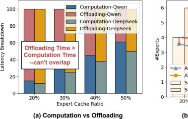

**Time in MoE**

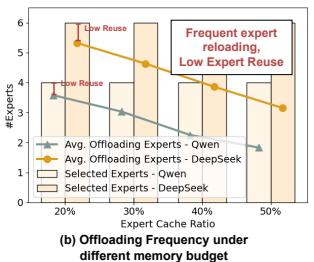

Fig. 2: Offloading bottlenecks in MoE inference under constrained memory. The Expert cache ratio represents the fraction of experts that can be resident in GPU memory. (a) Offloading latency exceeds computation time, contributing significant overhead. (b) Low expert reuse necessitates frequent reloading, degrading memory efficiency.

and excluded from this formulation. This model highlights a critical bottleneck: *loading latency scales with the number of routed experts and is heavily influenced by prefetching effectiveness*, highlighting the need for dynamic, adaptive offloading strategies.

#### *B. Analysis and Key Insights*

Analysis of the expert loading time formula (Equation 1) identifies three critical factors impacting MoE inference efficiency: the number of required experts (kl), the expert prefetching coverage (pl), and the prefetching hit rate (Rl). These factors inform targeted optimizations, as detailed below.

Spatial Imbalance in Expert Contributions. Expert computational contributions exhibit significant layer-wise variation within MoE models, as shown in Figure 3. Lower-ranked experts in top-k routing (e.g., third or fourth in top-4) often receive negligible routing weights (e.g., ≤ 0.05), contributing minimally to the output while incurring loading overhead. This spatial imbalance—where some layers concentrate weights on fewer experts while others distribute them evenly—suggests that uniform top-k selection is suboptimal. A layer-aware strategy that selectively prunes low-contribution experts can reduce kl , thereby decreasing Tload with minimal accuracy degradation.

## Insight 1

Selectively pruning low-contribution experts reduces kl , minimizing Tload while preserving model accuracy.

Temporal Continuity in Expert Access. Expert selection displays pronounced temporal locality in generation tasks, as illustrated in Figure 4. A small subset of experts is repeatedly activated across consecutive decoding steps, particularly in later stages of sequence generation, likely due to their alignment with evolving output semantics. This continuity enables prefetching to reuse frequently accessed experts over short temporal windows, overlapping data transfers with computation to enhance inference efficiency.

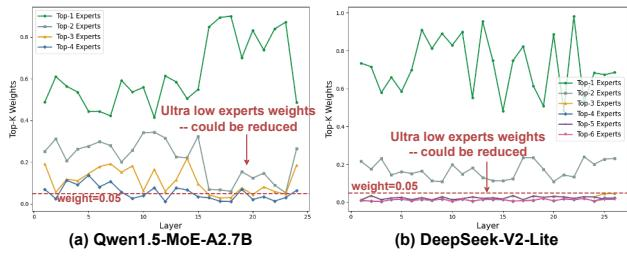

Fig. 3: (a) Qwen1.5-MoE-A2.7B and (b) DeepSeek-V2-Lite-Chat top-k weights across layers on MMLU dataset. Experts with lower routing ranks (e.g., 3rd/4th in top-4) often receive extremely low average weights ( $\leq 0.05$ ), suggesting minimal impact on model output.

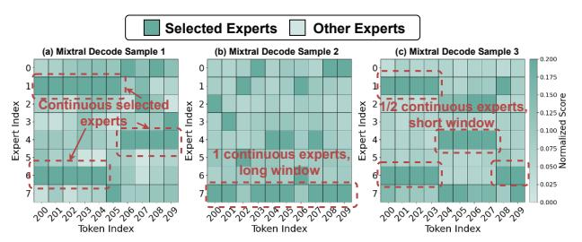

Fig. 4: Temporal continuity and sample-specific variation in expert selection of Mixtral during long-sequence generation (Longbench).

#### Insight 2

Predictive prefetching targeting frequently accessed experts increases  $R_l$ , significantly reducing  $T_{\rm load}$ .

**Variability in Expert Access Patterns.** Expert selection patterns vary widely across tasks, layers, and individual sequences, as shown in Figures 4 and 5. This heterogeneity undermines static prefetching policies, which assume fixed access patterns. A dynamic, token-aware prefetching mechanism is needed to adapt to input-specific and position-specific access behaviors, optimizing  $p_l$  and  $R_l$  for efficient MoE inference.

#### Insight 3

Token-aware adaptive prefetching accommodates variability in expert access patterns across tasks and layers, dynamically optimizing  $R_l$  and minimizing  $T_{\rm load}$ .

#### C. Motivation

Our analysis reveals that high offloading latency and low expert reuse rates significantly degrade the efficiency of current MoE inference frameworks, hindering scalable deployment in resource-constrained environments. Profiling of models like Qwen1.5-MoE-A2.7B and DeepSeek-V2-Lite (Figure 2) shows that offloading overhead often exceeds computation time, exacerbated by frequent expert reloading due to limited

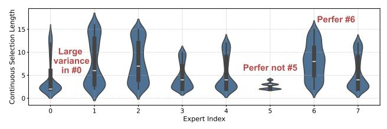

(a) Mixtral on Longbench-Report Summary

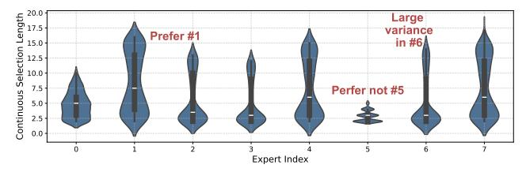

(b) Mixtral on Longbench-Translation

Fig. 5: Violin Plot of expert consecutive selection length distribution in Mixtral on (a) Summary and (b) Translation task. Large variation across experts and tasks illustrates both temporal locality and heterogeneity in expert selection behavior, motivating the need for token-aware adaptive prefetching.

GPU memory. Further analysis (Figures 3, 5) uncovers underexplored spatial and temporal locality in expert access patterns. Significant layer-wise weight imbalance results in low-contribution experts that incur unnecessary loading overhead, while temporal continuity in expert selection, particularly in long-sequence generation, remains underutilized, limiting prefetching effectiveness.

These findings motivate the design of STEP, a hybrid static-dynamic optimization framework that leverages spatial and temporal locality to address these bottlenecks. STEP adaptively reduces the number of activated experts  $(k_l)$  by pruning low-contribution experts, minimizing computational and memory overhead with negligible accuracy impact. It exploits temporal continuity through predictive prefetching to increase the cache hit rate  $(R_l)$ , and employs a token-aware adaptive window mechanism to dynamically adjust to task-and layer-specific access patterns. By minimizing memory traffic and latency, STEP enables efficient and scalable MoE inference in resource-constrained settings.

#### IV. METHODOLOGY

#### A. STEP Framework Overview

Building upon the motivation and insights elaborated in Section III-B, we introduce STEP to address the memory and latency bottlenecks in MoE inference by leveraging spatial and temporal locality in expert selection patterns, as illustrated in Figure 6. STEP employs two-stage optimization to optimize MoE inference in resource-constrained environments.

For offline stage, we introduce a spatial-aware expert allocation mechanism that adaptively selects the optimal number of experts per layer, reducing unnecessary computational and memory overhead (Section IV-B). For online stage, we design

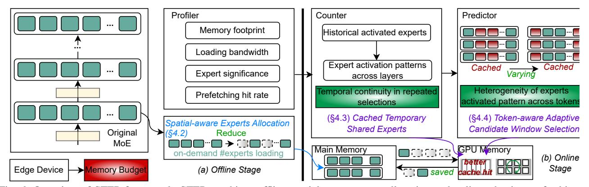

Fig. 6: Overview of STEP framework. STEP combines offline spatial-aware expert allocation and online adaptive prefetching via temporal continuity and window-based control, enabling efficient MoE inference under memory constraints.

a lightweight expert election system that identifies frequently selected routed experts as temporary "shared experts," enabling proactive prefetching to minimize access latency and memory transfers during inference (Section IV-C). Additionally, STEP combines spatial expert importance and temporal selection locality through a token-aware adaptive window mechanism, dynamically adjusting prefetching to task- and layer-specific patterns for enhanced efficiency (Section IV-D). Put all together, STEP workflow minimizes memory traffic and latency, enabling efficient MoE inference on constrained hardware (Section IV-E).

#### B. Spatial-aware Experts Allocation

To mitigate the computational and memory overhead of MoE models, STEP employs offline compression to reduce the number of routed experts per layer. For an MoE layer with n routed experts, j shared experts, and top-k expert selection, the output y is computed as:

$$y = y_{shared} + y_{routed} \tag{2}$$

where  $y_{\text{shared}}$  represents the contribution of shared experts, which are always activated and not subject to gate routing. Their outputs are combined via a weighted sum with equal weights, typically yielding an average output:

$$y_{shared} = \sum_{i=1}^{j} w_i^s E_i^s(x)$$
 or  $\frac{\sum_{i=1}^{j} E_i^s(x)}{j}$  (3)

For routed experts, the gating operation computes scores as:

$$s = W_{aate}x + b_{aate} \tag{4}$$

The top-k expert indices  $l_1, \ldots, l_k$  are selected based on the highest scores, and their routing weights are computed via softmax normalization:

$$w_i^r = \frac{e^{s_{l_i}}}{\sum_{i=1}^k e^{s_{l_i}}}, i = 1, \dots, k$$
 (5)

$$y_{routed} = \sum_{i=1}^{k} w_i^r E_{l_i}^s(x) \tag{6}$$

Significant variation exists in the importance of routed experts across different MoE layers. Experts with low routing weights often contribute minimally to the final output but still incur computational and memory overhead. To exploit this spatial imbalance, STEP uses a calibration dataset to collect top-k routing scores per layer and applies a normalized weight threshold  $\theta$  (e.g., 0.2) to identify low-contribution experts. Layers with consistently low-scoring experts have their number of routed experts ( $k_l$ ) reduced. For instance, in a layer with top-4 weights of 0.62, 0.21, 0.13, and 0.04, STEP allocates three experts, pruning one; in another with weights 0.72, 0.18, 0.08, and 0.02, STEP allocates two experts, pruning two. The remaining experts' weights are re-normalized during computation to preserve output consistency.

This spatial-aware allocation strategy adapts to layer-specific weight distributions, using normalized weights to account for varying score magnitudes across layers. With a threshold of 0.03–0.05, STEP reduces the average number of routed experts per layer by 1-2, significantly reducing computational and memory overhead with minimal accuracy degradation.

## C. Cached Temporary Shared Experts

Although spatial-aware adaptive expert selection reduces the number of activated experts and shortens offloading time, it also lowers the computation latency per step. As a result, the offloading overhead can still dominate the reduced compute time, limiting overall inference performance.

To mitigate this imbalance, STEP introduces a **temporal-aware prefetching mechanism** that exploits the temporal locality of expert usage in MoE inference. By identifying experts that are likely to be reused in upcoming steps, STEP proactively preloads them into GPU memory, overlapping memory transfers with computation to hide offloading latency. In particular, frequently activated experts—especially those consistently selected across steps—are cached as **temporary shared experts**, improving reuse and memory efficiency.

As shown in Figure 7, STEP divides the output sequence into fixed-size token windows and applies a per-layer expert

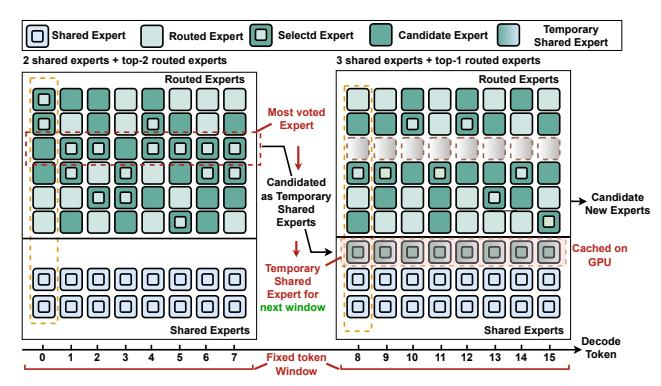

Fig. 7: Example of dynamic routed experts candidate.

election mechanism. Within each window of size L, STEP tracks the top-2k experts per decoding step based on routing scores, rather than only the top-k. Each appearance of an expert in the top-2k grants it a vote, reflecting both its frequency and selection strength. At the end of the window, the top-c experts with the most votes are elected as **temporary shared experts** for the next window. This voting scheme captures expert usage trends that go beyond immediate top-k selections, improving prediction accuracy for prefetching.

Under this mechanism, the effective MoE structure per layer shifts from j shared experts and k routed experts to j+c shared experts and k-c routed experts, where c is the number of elected experts. All shared experts are prefetched before computation begins, reducing dynamic expert loading during each decoding step from k to k-c. Once elected, the temporary shared experts remain fixed throughout the window, even if their actual usage falls below expectations. Note that temporary shared experts are always prefetched to remain resident in GPU memory, but they are executed only when selected by the gating mechanism, consistent with routed experts.

To ensure consistency and support accurate future elections, the gating mechanism continues to compute routing scores for all experts—including elected shared ones—even though only non-elected experts participate in the dynamic selection. This design preserves precise tracking of expert statistics and consistent routing behavior across steps.

In summary, this dynamic routing strategy improves memory efficiency and reduces offloading latency, while maintaining high routing quality across decoding steps. Importantly, temporary shared experts do not increase GPU memory usage. STEP operates under a fixed cache budget, where elected experts replace less frequently used routed experts rather than introducing additional memory allocation.

#### D. Token-aware Adaptive Candidate Window Selection

While fixed-size token windows enable basic expert prefetching, they are suboptimal in diverse generation scenarios and across different MoE layers. In practice, the temporal consistency of expert selection—critical for accurate

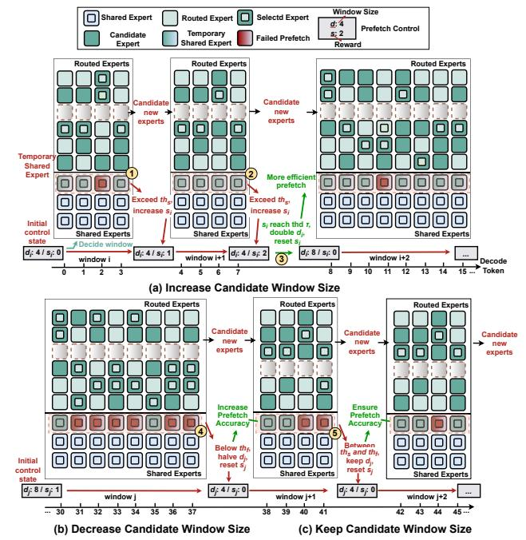

Fig. 8: Adaptive candidate window size change process. For (a) size increase, (1) the initial state is  $d_i=4, s_i=0$ , and window i (token 0-3) has high threshold  $>th_s$ , score+1; (2) window i+1 (token 4-7) also  $>th_s$ , score+1; (3) score reaches the reward threshold, for next window, double window size and reset score for more efficient prefetch. For (b) size decrease, (4) the initial state is  $d_i=8, s_i=1$ , and window j (token 30-37) has low precision  $< th_f$ , for next window, halve window size and reset score for more accurate prefetch. For (c) size unchanged, (5) the window j+1 (token 38-41) has average accuracy between two prefetch threshold, then for next window, keep the window size and reset score.

prediction—varies significantly by task and layer. Fixed window sizes are hard to tune: short windows may lack sufficient context for reliable prediction, while long windows can lead to mispredictions and unnecessary prefetching, increasing latency. In addition, spatially diverse expert activation patterns further challenge scalability.

To address these issues, STEP introduces a Token-aware Adaptive Candidate Window Selection mechanism that dynamically adjusts the voting window size for each MoE layer. Built on the same voting-based expert election framework, this adaptive scheme balances prediction accuracy and memory efficiency by tuning how many decoding steps are used to make prefetch decisions.

Specifically, for each layer, STEP maintains two variables: a reward score  $r_i$ , which tracks recent prefetch accuracy, and a window size  $d_i$ , which controls both the number of steps used to collect votes and the duration for which elected experts are retained. Initialization starts with  $r_i=0$  and  $d_i=1$ . Two global thresholds,  $th_s$  and  $th_f$ , are used to classify prediction

quality—typically set to 75% and 40%, respectively. At the end of each decoding window:

- If accuracy exceeds ths, ri is incremented. When ri reaches a reward threshold τ (e.g., 3 or 4), the window size di is doubled and ri is reset.
- If accuracy drops below thf , the window is halved and ri is reset.
- If accuracy is between thf and ths, the window remains unchanged, and ri is reset.

As shown in Figure 8, this adaptive strategy enables STEP to scale the window size based on observed prediction quality. In Figure 8(a), consistently high prediction accuracy leads to an increase in the window size from 4 to 8. Conversely, in Figure 8(b), low accuracy causes the window size to shrink from 8 to 4. If the accuracy is in between such as Figure 8(c), the window size keep unchanged. This dynamic adjustment allows STEP to react to routing dynamics in real time, improving the balance between prefetch effectiveness and expert selection accuracy.

Importantly, when the window size falls to 1, STEP disables actual prefetching due to limited benefit. This mechanism prevents over-prefetching when prediction confidence is low. However, it continues to track voting statistics, enabling reactivation of prefetching when accuracy improves. Once elected, the shared experts remain fixed throughout the window to avoid frequent swapping due to transient routing fluctuations. These shared experts are still incorporated into the computation of the routed output, with their weights determined by the gating network.

Overall, this adaptive windowing mechanism aligns expert prefetching with token- and layer-specific routing behavior, reducing redundant memory transfers and maintaining routing quality. This leads to more efficient and robust MoE inference.

## *E. STEP Workflow*

STEP framework can be divided into two parts: the offline part and the online part. To illustrate the efficiency gains brought by the STEP framework, we present the end-to-end inference timelines under different configurations in Figure 9.

Figure 9(a) shows the baseline MoE execution timeline. In this conventional setup, each layer first runs the gating network to select experts, then fetches the corresponding expert parameters from CPU to GPU memory over the PCIe bus. Computation begins only after all selected experts are fully loaded. This process is strictly sequential, and due to frequent expert switching across layers, parameters are repeatedly transferred, resulting in high memory traffic and substantial latency.

Figure 9(b) demonstrates the effect of offline spatial-aware compression. By analyzing long-term expert activation patterns, STEP prunes experts with consistently low contribution based on aggregated gating scores. This static pruning reduces the number of candidate experts per layer, thereby lowering both computation cost and PCIe transfer volume. In addition, having fewer experts simplifies runtime gating computation and shortens expert selection latency.

Figure 9(c) illustrates the benefit of online temporal-aware prefetching. STEP exploits short-term expert reuse by identifying high-frequency experts within recent decoding windows and proactively preloading them into GPU memory. This enables the overlap of expert loading and computation, effectively hiding PCIe transfer latency and accelerating inference for frequently used experts.

Figure 9(d) presents the full STEP optimization, where offline compression and online prefetching are combined. This integrated approach results in fewer experts per layer and better overlap between transfer and execution, enabling more parallel and efficient scheduling of gating, transfer, and computation. The two optimizations are orthogonal: offline pruning reduces static computation and bandwidth cost, while online prefetching dynamically hides runtime latency. Depending on the workload, they can be deployed independently or together.

To maximize prefetching efficiency, STEP implements a lightweight strategy that overlaps expert loading with computation. Prefetching operations are scheduled as asynchronous data transfer kernels on a separate GPU stream, leveraging CUDA's non-preemptive kernel execution. STEP launches prefetching kernels ahead of expert computation to ensure data availability, minimizing latency. STEP inserts a CUDA event after the last prefetching kernel in each sequence of decoding steps, recording completion to synchronize the prefetching stream, enabling efficient CPU queries while avoiding blocking synchronization, ensuring data availability as asynchronous streams maximize overlap between data transfers and computation. Together, these optimizations enable a bandwidth-aware and latency-efficient MoE system, significantly accelerating inference without sacrificing model quality.

## *F. Integration with Expert Parallelism*

While STEP mainly targets single-GPU MoE inference under limited memory bandwidth, its design is orthogonal and complementary to Expert Parallelism (EP). EP partitions experts across multiple GPUs to improve compute utilization, whereas STEP focuses on minimizing latency and redundant data transfers within or across EP groups.

In an EP-enabled setting, each expert-parallel group can independently maintain a local cache of hot experts and execute the token-aware adaptive prefetching mechanism. This allows STEP to reuse frequently accessed experts locally without interfering with inter-group communication. On highbandwidth systems such as NVLink or NVSwitch, STEP can further leverage peer GPU HBM memory as a second-level cache: if an expert already resides in a neighboring GPU, it can be fetched directly via peer-to-peer transfer rather than from CPU memory. This hierarchical caching strategy reduces redundant all-to-all exchanges and overlaps prefetch operations with expert computation.

Importantly, STEP requires no modification to the EP execution model. It functions as a lightweight runtime layer that monitors access patterns and dynamically adjusts prefetch windows per EP group. Consequently, STEP enhances EP

TABLE I: Configuration of evaluated MoE models and default evaluation hyperparameter.

|                                    | Mixtral                                                                      | Qwen         | DeepSeek     |  |  |  |
|------------------------------------|------------------------------------------------------------------------------|--------------|--------------|--|--|--|
| #Layers                            | 32                                                                           | 24           | 26           |  |  |  |
| #Shared Experts                    | 0                                                                            | 4            | 2            |  |  |  |
| #Routed Experts                    | 8                                                                            | 60           | 64           |  |  |  |
| #Activated Experts                 | 2                                                                            | 4            | 6            |  |  |  |
| Shared Expert Size                 | -                                                                            | (2048, 5632) | (2048, 1408) |  |  |  |
| Routed Expert Size                 | (4096, 14336)                                                                | (2048, 1408) | (2048, 1408) |  |  |  |
| Activated parameters each token | 13B                                                                          | 2.4B         | 2.7B         |  |  |  |
| Total parameters                   | 46.7B                                                                        | 16B          | 14.3B        |  |  |  |
| Expert Allocation Threshold θ   | 0.25                                                                         | 0.13         | 0.07         |  |  |  |
| Elected experts c                  | 1                                                                            | 1            | 2            |  |  |  |
| Adaptive Candidate Threshold τ  | 4 – window length = 1 or 2 3 – window length = 4 3 – window length ≥ 8 |              |              |  |  |  |
| Good Candidate Accuracy. ths    | 75%                                                                          |              |              |  |  |  |
| Poor Candidate Accuracy. thf    | 40%                                                                          |              |              |  |  |  |

scalability by improving expert reuse, reducing data migration, and overlapping data transfer with computation across GPUs.

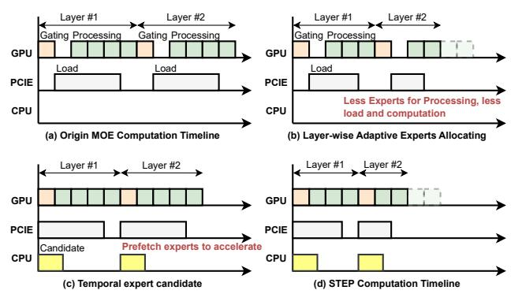

Fig. 9: Timeline of different optimization strategies.

## V. EVALUATION

## *A. Experiment Setup*

Platforms. We evaluate STEP on a server equipped with four NVIDIA A100 GPUs (80GB each), connected via PCIe 4.0 through a 64 GB/s switch. The system is powered by an AMD EPYC 7542 32-core CPU and has 512 GB of main memory. All GPU-GPU and GPU-CPU communications are conducted over PCIe. For fair comparisons, NVLink-based peer-GPU expert sharing is not used in our experiments, all methods share the same host-memory offloading setup.

Models and Datasets. We evaluate STEP using three representative MoE models with distinct architectural characteristics: Mixtral-8x7B-Instruct (Mixtral) [22], DeepSeek-V2-Lite-Chat (DeepSeek) [27], and Qwen1.5-MoE-A2.7B (Qwen) [38]. As summarized in Table I, these models vary in the number of experts, expert sizes, and the presence of shared experts. Specifically, Mixtral is configured with fewer but larger experts and does not include any shared experts. Notably, both DeepSeek and Qwen adopt a larger number of smaller experts and incorporate shared experts that are activated for all input tokens, regardless of routing results. This diversity in expert configuration allows us to comprehensively evaluate STEP's generality across different MoE designs. Note that although their activated parameters are small, the total expert parameters of these MoE models exceed single-GPU memory capacity, making expert offloading necessary. The evaluation datasets span several domains, including commonsense reasoning datasets ARC [10], PIQA [4] and WinoGrande [35], aggregated results datasets MMLU [18], and summary generation datasets CNN/DM [36] and Longbench(Summarization) [3]. We use accuracy for QA tasks and Rouge-L for generation tasks.

Baselines. We compare STEP with the following representative and novel MoE inference frameworks. llama.cpp serves as a CPU-GPU hybrid baseline, employing static layer-to-device mapping without dynamic adaptation. AdapMoE [53] represents a state-of-the-art GPU-centric scheduling framework that reduces on-demand loading overhead through adaptive expert prefetching and caching strategies. HybriMoE [54] combines CPU and GPU resources to enhance hardware utilization by jointly scheduling expert execution and managing cache hierarchies. DAOP [52] is an on-device MoE inference engine that dynamically allocates experts across CPU and GPU based on runtime token-wise activation patterns. Finally, APTMoE [41] is a fine-tuning system that incorporates affinity-aware pipeline parallelism along with hierarchical expert loading and demand-priority scheduling to improve throughput and memory efficiency. MoE-Lightning [5] introduces a system-level optimization framework that achieves high-throughput MoE inference under memory constraints through a CPU–GPU–I/O pipelined execution and a hierarchical roofline performance model. Together, these baselines span a broad design spectrum and allow us to evaluate STEP's effectiveness under diverse scheduling paradigms.

Implementation and Metrics. We implement STEP and all baseline systems on top of the Hugging Face Transformers library. Our experiments simulate real-time inference scenarios by setting the batch size to 1. To assess performance under varying memory constraints, we define a key control metric, Cached Expert Ratio (CER), which denotes the ratio of available GPU expert slots to the total number of experts in the model. By adjusting CER, we simulate limitedmemory environments and observe how inference performance varies with expert caching capacity. To quantify end-to-end inference latency, we adopt two widely used stage-specific metrics. Time To First Token (TTFT) captures the latency from receiving the input prompt to generating the first token during the prefill stage of auto-regressive decoding. Time Per Output Token (TPOT) measures the average latency for generating each subsequent token during the decode stage. These metrics collectively reflect both initial response time and sustained generation throughput. For latency evaluation,

TABLE II: Evaluation results of STEP on the Mixtral-8x7B-Instruct model. MMLU, Arc-e, PIQA, and Winogrande are evaluated using Accuracy. CNN/DM and LongBench are evaluated using Rouge-L and prefetch Hit Rate. Average activated experts per layer and adaptive window length are varied to analyze STEP's trade-off between accuracy and prefetch efficiency.

| Method | Avg. #Experts | Window Size | MMLU | Arc-e        | PIQA | Wino. |         | CNN/DM       |         | LongBench    |
|--------|---------------|-------------|------|--------------|------|-------|---------|--------------|---------|--------------|
|        |               |             |      | Accuracy (%) |      |       | Rouge-L | Hit Rate     | Rouge-L | Hit Rate     |
| Origin | 2             | –           | 77.3 | 75.8         | 64.2 | 71.3  | 35.6    | –            | 34.3    | –            |
|        | 1.75          | 6 8      | 77.0 | 75.4         | 64.1 | 70.2  | 35.4    | 98.8 94.3 | 34.1    | 95.6 90.7 |
| STEP   | 1.5           | 6 8      | 73.2 | 74.5         | 60.8 | 68.6  | 32.3    | 89.4 85.5 | 29.4    | 80.4 72.1 |

TABLE III: Evaluation results of STEP on the Qwen1.5-MoE-A2.7B model. MMLU, Arc-e, PIQA, and Winogrande are evaluated using Accuracy. CNN/DM and LongBench are evaluated using Rouge-L and prefetch Hit Rate.

| Method | Avg. #Experts | Window Size | MMLU | Arc-e        | PIQA | Wino. |         | CNN/DM       |         | LongBench    |
|--------|---------------|-------------|------|--------------|------|-------|---------|--------------|---------|--------------|
|        |               |             |      | Accuracy (%) |      |       | Rouge-L | Hit Rate     | Rouge-L | Hit Rate     |
| Origin | 4             | –           | 70.6 | 68.2         | 58.2 | 60.8  | 31.2    | –            | 26.4    | –            |
|        | 3             | 6 8      | 70.2 | 68.4         | 57.6 | 61.2  | 30.9    | 96.4 91.6 | 26.1    | 90.4 85.8 |
| STEP   | 2.5           | 6 8      | 68.9 | 67.7         | 54.3 | 59.7  | 29.6    | 95.8 86.7 | 24.7    | 86.6 78.8 |
|        | 2             | 6 8      | 66.7 | 66.8         | 50.7 | 55.4  | 28.3    | 92.4 80.1 | 23.1    | 82.3 75.4 |

TABLE IV: Evaluation results of STEP on the DeepSeek-V2-Lite-Chat model. MMLU, Arc-e, PIQA, and Winogrande are evaluated using Accuracy. CNN/DM and LongBench are evaluated using Rouge-L and prefetch Hit Rate.

| Method | Avg. #Experts | Window Size | MMLU | Arc-e        | PIQA | Wino. |         | CNN/DM       |         | LongBench    |
|--------|---------------|-------------|------|--------------|------|-------|---------|--------------|---------|--------------|
|        |               |             |      | Accuracy (%) |      |       | Rouge-L | Hit Rate     | Rouge-L | Hit Rate     |
| Origin | 6             | –           | 58.3 | 52.6         | 60.7 | 57.6  | 28.7    | –            | 25.5    | –            |
|        | 5             | 6 8      | 58.2 | 53.0         | 60.4 | 57.6  | 28.6    | 95.3 93.6 | 25.3    | 93.7 88.6 |
| STEP   | 4             | 6 8      | 56.2 | 51.8         | 58.9 | 55.2  | 27.4    | 93.3 86.2 | 24.6    | 90.8 80.7 |
|        | 3             | 6 8      | 55.8 | 49.2         | 54.1 | 52.4  | 26.9    | 85.6 73.4 | 22.8    | 78.6 69.7 |

we sample fixed-length traces from multiple datasets to ensure consistency and comparability across different models and scheduling strategies.

In accuracy results, we vary two STEP parameters as independent variables: (i) the average number of activated routed experts per MoE layer (Avg. #Experts), controlled by the offline allocation threshold θ, and (ii) the prefetch window length (Window Size), controlled by the online token-aware adaptive window mechanism.

For each model, we evaluate the offline calibration set and apply θ to prune low-contribution experts, which determines the number of routed experts kl in each MoE layer. Avg. #Experts is reported as the layer-wise average, and different settings are obtained by sweeping θ to match target expert budgets.

Window Size denotes the average effective prefetch window during decoding. We vary the candidate thresholds (ths, thf ) and reward threshold τ to control window expansion, and report Window Size as the runtime mean of di across decoding steps and MoE layers. All other model hyperparameters remain unchanged, and Table I lists the default settings.

## *B. Accuracy Results*

We evaluate STEP under various settings, datasets, and models, with results summarized in Table II, Table III, and Table IV. Overall, reducing the average number of allocated experts per layer by one does not degrade task accuracy. Even under more aggressive configurations—such as fewer average experts and longer prefetch windows—STEP consistently maintains stable and reliable performance. Across different models, we observe that the potential for optimization increases with the number of originally routed experts. For instance, in Mixtral, STEP reduces the average expert count without accuracy loss. Meanwhile, DeepSeek shows stronger temporal continuity in expert activation during long-sequence generation compared to Qwen, enabling more aggressive and

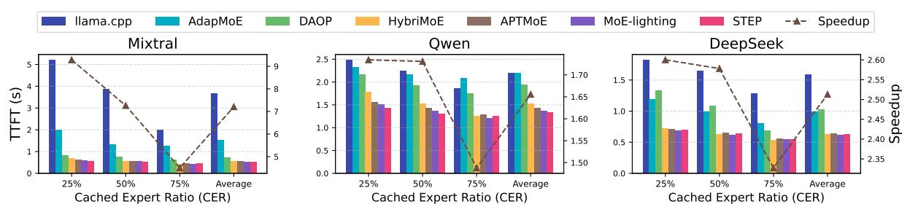

Fig. 10: Prefill stage performance comparison across different cache ratios. Speedup represents the acceleration of STEP relative to llama.cpp. Average reports the geometric mean results.

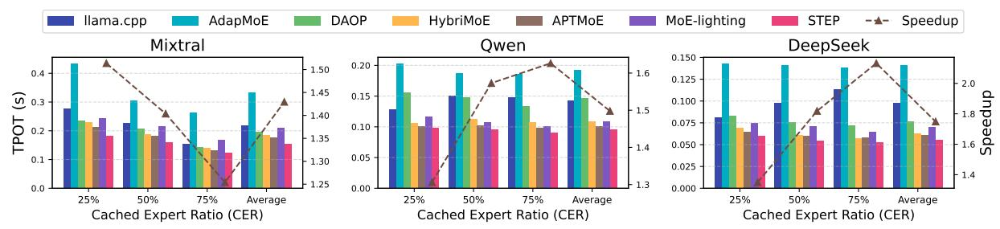

Fig. 11: Decode stage performance comparison across different cache ratios. Speedup represents the acceleration of STEP relative to llama.cpp. Average reports the geometric mean results.

effective expert prefetching and thus yielding larger performance improvements. The minimal accuracy loss in STEP results from its precise identification of redundant experts and high prefetch accuracy, ensuring that temporarily shared experts do not introduce computational errors.

#### C. End-to-end Performance

We evaluate STEP's inference speed across multiple models during both the prefill and decode stages. Note that since Mixtral does not use shared experts, we apply only layerwise expert allocation optimization for Mixtral. For Qwen and DeepSeek, we apply layer-wise expert allocation during the prefill stage and the full STEP optimization—both static and dynamic strategies—during decoding for a comprehensive comparison. We select configurations (highlighted in bold in Tables II, III, and IV) with the highest average expert count and shortest average prefetch window length, ensuring STEP matches the original model's accuracy for fair comparison.

1) **Prefill Stage:** Figure 10 reports TTFT results under varying GPU expert cache ratios (25%, 50%, 75%) with a fixed input length of 512 tokens. STEP consistently outperforms all baselines, achieving average geometric mean speedups of 3.12×, 1.97×, 1.52×, 1.07×, 1.07× and 1.03× over llama.cpp, AdapMoE, HybriMoE, DAOP, APTMoE and MoE-lighting respectively.

Among the baselines, llama.cpp suffers from high prefill latency due to static expert-to-CPU mappings that poorly balance computation under heavy demand. AdapMoE and HybriMoE improve load balancing between GPU and CPU but do not reduce overall expert computation. In contrast,

STEP explicitly reduces redundant computation by pruning low-contribution experts through spatially adaptive allocation. DAOP and APTMoE apply offloading-based strategies, migrating less frequently used experts to CPU based on popularity classification to balance compute and memory loads. While DAOP and APTMoE achieve comparable speedups at high cache ratios due to high expert reuse, STEP outperforms all baselines in TTFT significantly at low cache ratios (e.g., 25%), where reducing redundant computation is critical. MoE-Lightning achieves the highest throughput during prefill similar to STEP. This is attributed to its pipelined execution from system-level, which is orthogonal to STEP's expert-level pruning. This validates STEP's superior efficiency in the prefill stage. Even though all experts may eventually participate across the prefill sequence, not all are simultaneously active for each token. STEP reduces redundant data movement and overlaps cached expert reuse with computation, resulting in measurable latency reduction even during the prefill stage.

**2) Decode Stage:** Figure 11 shows decode-stage performance on three MoE models. STEP achieves the highest throughput and speedup across all cache ratios and models, with average geometric mean speedups of 1.54×, 2.22×, 1.39×, 1.15×, 1.10× and 1.25× over llama.cpp, AdapMoE, HybriMoE, DAOP, APTMoE and MoE-lighting respectively.

STEP's advantage is more pronounced during decoding due to two factors. First, the temporal routed expert candidate mechanism can only be leveraged in the decode stage, where temporal continuity exists, enabling effective prefetching optimizations. Second, decoding involves smaller per-expert workloads but more frequent CPU-GPU data transfers. Under such

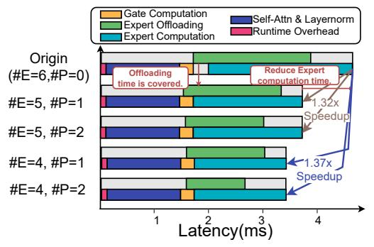

Fig. 12: Decode-stage latency breakdown. The stacked bars represent the relative runtime portions of expert offloading, expert computation, gating, self-attention + layer normalization, and other overheads. #E means the average allocated experts per layer and #P means the average prefetched experts per candidate.

light compute intensity, CPU execution can remain competitive in llama.cpp, and different GPU memory budgets may lead to different CPU–GPU partitioning behaviors; in some cases, a smaller memory budget results in more stable partitioning and reduced synchronization overhead. In contrast, STEP's dynamic co-optimization of computation and memory load better mitigates these bottlenecks, yielding greater acceleration. In contrast, MoE-Lightning employs a static pipeline that excels in batch-oriented prefill but becomes less efficient in token-bytoken decoding, where pipeline parallelism cannot fully overlap small-grained computations. Consequently, STEP maintains higher efficiency under interactive or streaming decoding scenarios, complementing MoE-Lightning's throughputoriented prefill design.

3) Performance Breakdown: We analyze decode-stage inference time in Figure 12, comparing standard MoE execution with STEP's optimized pipeline. In conventional MoE, latency is dominated by expert computation and CPU-to-GPU weight transfers, with offloading often exceeding computation time under tight memory and low expert reuse. Sequential loading and computation cause significant stalls, which STEP mitigates through its optimized pipeline. STEP addresses these issues with two key techniques. First, spatial-aware expert allocation reduces the number of routed experts per layer, cutting redundant computation and lowering execution time. Second, dynamic prefetching proactively loads frequently used experts into GPU memory, overlapping data transfer with ongoing computation and hiding memory latency.

#### *D. Ablation Study*

Impact of STEP Components. Figure 13 compares the baseline with STEP variants using only one optimization component at a time: spatial expert allocation, dynamic routed expert candidates, and dynamic prefetching with adaptive candidate windows. From the plot, each component provides incremental speedup. Spatial allocation alone achieves a 1.46× speedup by eliminating redundant computation. Adding expert

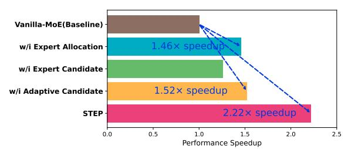

Fig. 13: Impact of STEP's components on inference speedup.

prefetching further improves speedup to 1.52× by overlapping memory transfers with computation. Incorporating adaptive candidate windows boosts speedup to 2.22× by better exploiting temporal locality across layers and decoding steps. While each optimization yields clear benefits, their combination leads to significantly higher gains. The full STEP framework achieves up to 3.12× speedup over the baseline, demonstrating that these techniques not only work effectively in isolation but also complement each other within the MoE framework.

Impact of Spatially Adaptive Expert Allocation. We compare STEP's adaptive allocation against fixed-expert baselines, where each MoE layer routes a constant number of experts (ranging from 5 to 2 or 3.5 to 2), while keeping the overall average expert count consistent across the model. We first measure accuracy on the MMLU benchmark under varying average expert budgets. As shown in Figure 15, STEP's adaptive strategy consistently outperforms fixed allocations. Particularly at low expert budgets (e.g., 3 or 2), fixed routing causes sharp accuracy degradation, whereas STEP maintains significantly better performance. To better understand why STEP is more robust, Figure 16 presents the expert allocation distribution across layers under different average expert budgets. The visualization reveals that STEP assigns more experts to layers that are critical for model accuracy, while reducing expert counts in less sensitive layers. By dynamically concentrating computational resources where they yield the greatest impact, STEP avoids uniform pruning that can harm important layers. This targeted allocation reduces redundant computation without compromising model quality, explaining the sustained accuracy under tighter expert budgets.

We vary the spatial pruning threshold θ and report accuracy and average number of activated experts (Figure 17). Increasing θ reduces the number of allocated experts and computational load. For small θ, accuracy remains stable, indicating that STEP preserves routing diversity, and not sensitive to moderate variations of θ; beyond this range, removing critical experts degrades performance. Our chosen threshold balances accuracy and inference efficiency.

Impact of Dynamic Window Size. We evaluate STEP's adaptive prefetch window against fixed window sizes (4, 6, 8, 16) on the DeepSeek model with the LongBench dataset. Figure 14a shows that STEP's adaptive window consistently achieves higher prefetch accuracy and better generation quality than any fixed window size. This improvement is mainly due

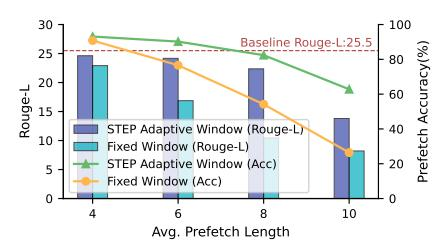

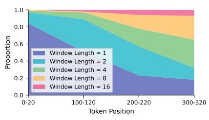

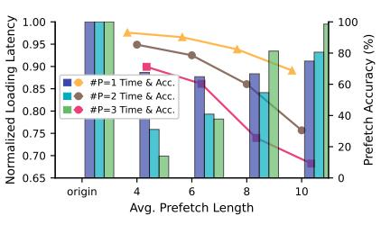

- (a) Effect of Prefetch Window Length on Accuracy and Generation Quality.
- (b) Proportion of Window Length Across Token Positions.
- (c) Latency and Prefetch Accuracy Across Different Number of Prefetch Experts.

Fig. 14: Dynamic Window size evaluation results using Deepseek on the Longbench-Summarization benchmark.

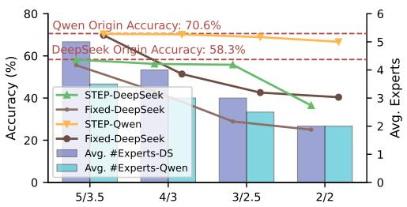

Fig. 15: Accuracy comparison across different average expert counts on DeepSeek with MMLU benchmark.

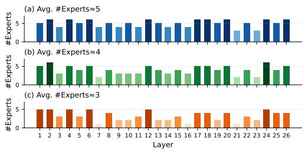

Fig. 16: Expert allocation patterns among layers under different average expert budgets.

to two factors. First, temporal continuity in expert selection is weak at early decoding steps, so premature prefetching hurts accuracy. STEP adapts by reducing prefetching in these early stages. Second, different MoE layers exhibit varied temporal patterns. STEP assigns independent adaptive windows per layer, tuning prefetch lengths based on real-time accuracy feedback. Figure 14b illustrates this behavior: STEP prefetches minimally at early tokens (0–20, 100–120) but aggressively at later tokens (200–220, 300–320) where expert reuse stabilizes.

Finally, Figure 14c analyzes how the number of prefetched experts affects inference time under different prefetch accuracy levels. When prefetch accuracy is above 75%, increasing prefetched experts significantly reduces inference time by overlapping data transfer with computation. When accuracy drops below 40%, excessive prefetching wastes bandwidth and increases latency.

**Batch Sensitivity Analysis.** We vary the batch size from 1 to 8 (input length 512 tokens) and report average speedups un-

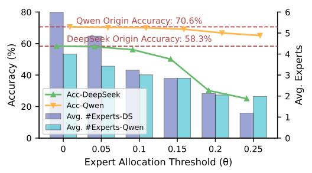

Fig. 17: Accuracy comparison across different expert allocation threshold on DeepSeek with MMLU benchmark.

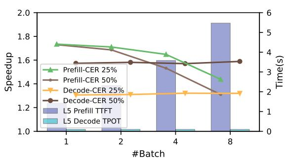

Fig. 18: Speedup of STEP under different batch sizes and cache expert ratios (CERs). The x-axis shows the batch size and the y-axis shows the normalized speedup over llama.cpp.

der different cache expert ratios (Figure 18). Overall throughput increases with batch size, but the relative gain from STEP's dynamic prefetching decreases as data transfers are naturally overlapped. Static spatial expert allocation continues to prune redundant experts effectively, and cached hot experts maintain high reuse, especially under limited GPU memory. Temporal expert reuse in the decode stage provides consistent speedups across all batch sizes.

**Hardware Sensitivity Analysis.** We further evaluate STEP across representative platforms with different interconnect capabilities, including V100, A100, and H20, as shown in Figure 19. As interconnect capability increases, transfer latency decreases and STEP's transfer-hiding advantage becomes less dominant, yet STEP still achieves  $\geq 1.3 \times$  speedup by reducing expert reloads and improving reuse of hot experts. Under hard-

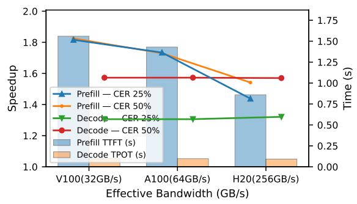

Fig. 19: Speedup of STEP under different hardware architecture and cache expert ratios (CERs). The x-axis shows the architecture with bandwidth and the y-axis shows the normalized speedup over llama.cpp.

ware with limited interconnect bandwidth, adaptive prefetching effectively overlaps offloading, while on more capable platforms the benefits mainly come from reduced redundant transfers and improved expert reuse. These results demonstrate that STEP remains effective across diverse hardware configurations and is compatible with future high-bandwidth interconnects such as NVLink or peer-HBM systems.

#### E. Orthogonality to Prior Optimization Approaches

We further evaluate whether STEP is orthogonal to prior MoE optimization approaches, including system-level offloading/scheduling and model-level compression. We select MoE-I2 [46] and APTMoE [41] as representative examples of MoE compression and offloading optimization.

STEP and compression optimization. MoE-I2 improves efficiency by compressing experts through pruning and low-rank decomposition, which primarily reduces model size and compute cost. In contrast, STEP targets inference-time expert-fetch latency by reducing redundant expert transfers and improving prefetch effectiveness. Since the two methods operate at different levels, they are expected to be complementary.

Table V confirms this behavior. MoE-I2 improves decode throughput from 11.5 to 17.4 tok/s by reducing model size, while STEP alone achieves 18.5 tok/s by optimizing expert fetching. When combined, MoE-I2 + STEP further increases throughput to 24.1 tok/s and reduces TTFT from 616.7 ms to 470.3 ms. This demonstrates that runtime expertfetch optimization remains effective even after aggressive model compression. Importantly, STEP introduces only minor additional accuracy change compared with MoE-I2, indicating that the performance gain mainly comes from system-level optimization rather than further model modification.

**STEP and offloading optimization.** APTMoE improves MoE execution via affinity-aware pipeline tuning and hierarchical loading policies. STEP focuses on a different aspect, reducing effective expert-fetch cost through adaptive prefetch windows and temporary shared expert reuse. Therefore, STEP does not replace scheduling mechanisms but instead improves the quality and efficiency of expert transfers.

TABLE V: Orthogonality between STEP and MoE-I2 compression.

| Method         | TTFT (ms)↓ | Decode tok/s↑ | MMLU Acc.↑ |
|----------------|------------|---------------|------------|
| Original Model | 975.8      | 11.5          | 58.3       |
| MoE-I2         | 616.7      | 17.4          | 51.2       |
| STEP (ours)    | 641.6      | 18.5          | 56.2       |
| MoE-I2 + STEP  | 470.3      | 24.1          | 50.8       |

TABLE VI: Orthogonality between STEP and APTMoE-style runtime optimization.

| Method        | TTFT (ms)↓ | Decode tok/s↑ | Prefetch Hit↑ |
|---------------|------------|---------------|---------------|
| APTMoE        | 653.7      | 15.9          | -             |
| STEP (ours)   | 641.6      | 18.5          | 82.3%         |
| APTMoE + STEP | 531.2      | 21.3          | 86.1%         |

As shown in Table VI, STEP achieves higher decode throughput than APTMoE. More importantly, enabling STEP on top of APTMoE further improves throughput to 21.3 tok/s and reduces TTFT to 531.2 ms. The increased prefetch hit rate indicates that STEP improves transfer efficiency even when advanced loading strategies are already applied.

Overall, these results show that STEP is orthogonal to both model-level and system-level approaches. Unlike prior works that optimize either model structure or loading order, STEP targets token-level expert prefetch, which explains its consistent gains when combined with existing approaches.

#### VI. RELATED WORK

Recent research on efficient MoE inference mainly follows two complementary directions: model-side compression, which reduces expert parameters or computation, and systemside offloading, which optimizes expert placement and data movement across heterogeneous memory tiers.

## A. MoE Compression and Parameter Reduction

Building upon the experience gained from LLM, many efforts focuses on compressing MoE models to reduce their parameter footprint. Existing approaches can be broadly grouped into three categories. First, expert-level reduction methods (e.g., MoE- $I^2$  [46], REAP [23], SlimMoE [26]) prune or replace low-utility experts based on routing statistics or distillation. Second, intra-expert compression methods apply structured decomposition or shared representations, such as low-rank factorization or residual expert modeling (e.g., MoE-SVD [25],  $\Delta$ -Decompression [16], ResMoE [2]). Third, quantization-based approaches (e.g., EAC-MoE [6], MC# [19]) reduce memory and computation via mixed-precision or bit allocation strategies.

While these methods effectively reduce model size or FLOPs, they mainly optimize static compression objectives. In memory-tiered systems, however, MoE inference is often dominated by runtime expert loading and data movement, which are not directly addressed by compression alone.

#### *B. MoE Expert Offloading and Caching*

Another line of work focuses on expert offloading and runtime caching to mitigate limited GPU memory. Representative systems such as MoE-Infinity [45] and fMoE [50] overlap CPU–GPU transfers with computation via asynchronous prefetching and caching. Subsequent work improves transfer efficiency through adaptive scheduling, prediction, or speculative loading [33], [37], [54], while others explore heterogeneous execution and on-demand loading strategies [40].

These systems mainly optimize how experts are fetched, assuming the routed expert set is fixed. When the working set exceeds device capacity under bandwidth constraints, transfer latency remains on the critical path. Scheduling alone cannot eliminate this dependency, especially under dynamic routing with limited expert reuse.

In summary, compression reduces parameter footprint but overlooks runtime data movement, while offloading optimizes transfer policies without shrinking the effective expert working set. STEP bridges this gap by jointly reducing the expert working set and improving prefetch accuracy through spatial allocation and token-aware adaptive control, making it complementary to both directions.

## VII. CONCLUSION

MoE models provide an efficient way to scale LLMs, but their deployment faces memory and latency challenges due to irregular expert access patterns. We propose STEP, a framework that combines layer-wise adaptive expert allocation, dynamic routed expert prefetching, and token-aware adaptive window selection to address these issues. By leveraging spatiotemporal locality for adjusting expert usage, STEP effectively reduces computational overhead and memory traffic. Experiments show that STEP achieves up to 3.12× speedup over state-of-the-art baselines without sacrificing accuracy.

## ACKNOWLEDGMENT

This work was partially supported by the National Key Research and Development Program of China (2024YFE0204300), National Natural Science Foundation of China (Grant No.62402311), Natural Science Foundation of Shanghai (Grant No.24ZR1433700), and Key Research and Development Program of Shanghai (25LN3201200). This work was also supported by Alibaba Group through Alibaba Innovative Research Program. Haibin Guan(hbguan@sjtu.edu.cn) is the corresponding author.

## REFERENCES

- [1] J. Achiam, S. Adler, S. Agarwal, L. Ahmad, I. Akkaya, F. L. Aleman, D. Almeida, J. Altenschmidt, S. Altman, S. Anadkat *et al.*, "Gpt-4 technical report," *arXiv preprint arXiv:2303.08774*, 2023.
- [2] M. Ai, T. Wei, Y. Chen, Z. Zeng, R. Zhao, G. Varatkar, B. D. Rouhani, X. Tang, H. Tong, and J. He, "Resmoe: Space-efficient compression of mixture of experts llms via residual restoration," in *Proceedings of the 31st ACM SIGKDD Conference on Knowledge Discovery and Data Mining V. 1*, 2025, pp. 1–12.
- [3] Y. Bai, X. Lv, J. Zhang, H. Lyu, J. Tang, Z. Huang, Z. Du, X. Liu, A. Zeng, L. Hou *et al.*, "Longbench: A bilingual, multitask benchmark for long context understanding," *arXiv preprint arXiv:2308.14508*, 2023.

- [4] Y. Bisk, R. Zellers, J. Gao, Y. Choi *et al.*, "Piqa: Reasoning about physical commonsense in natural language," in *Proceedings of the AAAI conference on artificial intelligence*, vol. 34, 2020, pp. 7432–7439.
- [5] S. Cao, S. Liu, T. Griggs, P. Schafhalter, X. Liu, Y. Sheng, J. E. Gonzalez, M. Zaharia, and I. Stoica, "Moe-lightning: High-throughput moe inference on memory-constrained gpus," in *Proceedings of the 30th ACM International Conference on Architectural Support for Programming Languages and Operating Systems, Volume 1*, 2025, pp. 715–730.
- [6] Y. Chen, Y. Shao, P. Wang, and J. Cheng, "Eac-moe: Expert-selection aware compressor for mixture-of-experts large language models," in *Proceedings of the 63rd Annual Meeting of the Association for Computational Linguistics (Volume 1: Long Papers)*, 2025, pp. 12 942–12 963.
- [7] Y. Chen, A. F. AbouElhamayed, X. Dai, Y. Wang, M. Andronic, G. A. Constantinides, and M. S. Abdelfattah, "Bitmod: Bit-serial mixture-ofdatatype llm acceleration," in *2025 IEEE International Symposium on High Performance Computer Architecture (HPCA)*. IEEE, 2025, pp. 1082–1097.
- [8] Y. Chen, J. Meng, J.-s. Seo, and M. S. Abdelfattah, "Bbs: Bidirectional bit-level sparsity for deep learning acceleration," in *2024 57th IEEE/ACM International Symposium on Microarchitecture (MICRO)*. IEEE, 2024, pp. 551–564.
- [9] V. Chiley and Databricks NLP Team, "Dbrx: A new open-source large language model," https://www.databricks.com/blog/2024/03/27/ introducing-dbrx-new-state-art-open-llm, March 2024, accessed: 2025- 07-22.
- [10] P. Clark, I. Cowhey, O. Etzioni, T. Khot, A. Sabharwal, C. Schoenick, and O. Tafjord, "Think you have solved question answering? try arc, the ai2 reasoning challenge," *ArXiv*, vol. abs/1803.05457, 2018. [Online]. Available: https://api.semanticscholar.org/CorpusID:3922816
- [11] Z. Du, S. Li, Y. Wu, X. Jiang, J. Sun, Q. Zheng, Y. Wu, A. Li, H. Li, and Y. Chen, "Sida: Sparsity-inspired data-aware serving for efficient and scalable large mixture-of-experts models," *Proceedings of Machine Learning and Systems*, vol. 6, pp. 224–238, 2024.
- [12] A. Dubey, A. Jauhri, A. Pandey, A. Kadian, A. Al-Dahle, A. Letman, A. Mathur, A. Schelten, A. Yang, A. Fan *et al.*, "The llama 3 herd of models," *arXiv e-prints*, pp. arXiv–2407, 2024.
- [13] A. Eliseev and D. Mazur, "Fast inference of mixture-of-experts language models with offloading," *arXiv preprint arXiv:2312.17238*, 2023.
- [14] C. Fang, M. Shi, R. Geens, A. Symons, Z. Wang, and M. Verhelst, "Anda: Unlocking efficient llm inference with a variable-length grouped activation data format," in *2025 IEEE International Symposium on High Performance Computer Architecture (HPCA)*. IEEE, 2025, pp. 1467– 1481.
- [15] W. Fedus, B. Zoph, and N. Shazeer, "Switch transformers: Scaling to trillion parameter models with simple and efficient sparsity," *Journal of Machine Learning Research*, vol. 23, no. 120, pp. 1–39, 2022.
- [16] H. Gu, W. Li, L. Li, Q. Zhu, M. Lee, S. Sun, W. Xue, and Y. Guo, "Delta decompression for moe-based llms compression," *arXiv preprint arXiv:2502.17298*, 2025.
- [17] D. Guo, D. Yang, H. Zhang, J. Song, R. Zhang, R. Xu, Q. Zhu, S. Ma, P. Wang, X. Bi *et al.*, "Deepseek-r1: Incentivizing reasoning capability in llms via reinforcement learning," *arXiv preprint arXiv:2501.12948*, 2025.
- [18] D. Hendrycks, C. Burns, S. Basart, A. Zou, M. Mazeika, D. Song, and J. Steinhardt, "Measuring massive multitask language understanding," *arXiv preprint arXiv:2009.03300*, 2020.
- [19] W. Huang, Y. Liao, J. Liu, R. He, H. Tan, S. Zhang, H. Li, S. Liu, and X. Qi, "Mixture compressor for mixture-of-experts llms gains more," *arXiv preprint arXiv:2410.06270*, 2024.
- [20] R. Hwang, J. Wei, S. Cao, C. Hwang, X. Tang, T. Cao, and M. Yang, "Pre-gated moe: An algorithm-system co-design for fast and scalable mixture-of-expert inference," in *2024 ACM/IEEE 51st Annual International Symposium on Computer Architecture (ISCA)*. IEEE, 2024, pp. 1018–1031.
- [21] R. A. Jacobs, M. I. Jordan, S. J. Nowlan, and G. E. Hinton, "Adaptive mixtures of local experts," *Neural computation*, vol. 3, no. 1, pp. 79–87, 1991.
- [22] A. Q. Jiang, A. Sablayrolles, A. Roux, A. Mensch, B. Savary, C. Bamford, D. S. Chaplot, D. d. l. Casas, E. B. Hanna, F. Bressand *et al.*, "Mixtral of experts," *arXiv preprint arXiv:2401.04088*, 2024.
- [23] M. Lasby, I. Lazarevich, N. Sinnadurai, S. Lie, Y. Ioannou, and V. Thangarasa, "Reap the experts: Why pruning prevails for one-shot moe compression," *arXiv preprint arXiv:2510.13999*, 2025.

- [24] D. Lepikhin, H. Lee, Y. Xu, D. Chen, O. Firat, Y. Huang, M. Krikun, N. Shazeer, and Z. Chen, "Gshard: Scaling giant models with conditional computation and automatic sharding," *arXiv preprint arXiv:2006.16668*, 2020.
- [25] W. Li, L. Li, Y.-L. Huang, M. G. Lee, S. Sun, W. Xue, and Y. Guo, "Structured mixture-of-experts llms compression via singular value decomposition," 2025.
- [26] Z. Li, C. Liang, Z. Zhang, I. Hong, Y. J. Kim, W. Chen, and T. Zhao, "Slimmoe: Structured compression of large moe models via expert slimming and distillation," *arXiv preprint arXiv:2506.18349*, 2025.
- [27] A. Liu, B. Feng, B. Wang, B. Wang, B. Liu, C. Zhao, C. Dengr, C. Ruan, D. Dai, D. Guo *et al.*, "Deepseek-v2: A strong, economical, and efficient mixture-of-experts language model," *arXiv preprint arXiv:2405.04434*, 2024.
- [28] F. Liu, N. Yang, H. Li, Z. Wang, Z. Song, S. Pei, and L. Jiang, "Spark: Scalable and precision-aware acceleration of neural networks via efficient encoding," in *2024 IEEE International Symposium on High-Performance Computer Architecture (HPCA)*. IEEE, 2024, pp. 1029– 1042.
- [29] F. Liu, N. Yang, J. Yang, Z. Wang, C. Guan, Y. Feng, L. Jiang, and H. Guan, "Earth: An efficient moe accelerator with entropy-aware speculative prefetch and result reuse," in *Proceedings of the 31st ACM International Conference on Architectural Support for Programming Languages and Operating Systems, Volume 2*, 2026, pp. 633–646.
- [30] F. Liu, W. Zhao, Z. He, Y. Wang, Z. Wang, C. Dai, X. Liang, and L. Jiang, "Improving neural network efficiency via post-training quantization with adaptive floating-point," in *Proceedings of the IEEE/CVF international conference on computer vision*, 2021, pp. 5281–5290.
- [31] S. Ma, C. Fang, H. Shao, and Z. Wang, "Apt-llm: Exploiting arbitraryprecision tensor core computing for llm acceleration," *IEEE Transactions on Computer-Aided Design of Integrated Circuits and Systems*, 2025.
- [32] S. Masoudnia and R. Ebrahimpour, "Mixture of experts: a literature survey," *Artificial Intelligence Review*, vol. 42, no. 2, pp. 275–293, 2014.
- [33] J. Ou, Y. Chen, B. Xiong, Z. Wang, and W. Tian, "Accelerating mixtureof-experts language model inference via plug-and-play lookahead gate on a single gpu," *Computer Standards & Interfaces*, vol. 94, p. 103996, 2025.
- [34] C. Raffel, N. Shazeer, A. Roberts, K. Lee, S. Narang, M. Matena, Y. Zhou, W. Li, and P. J. Liu, "Exploring the limits of transfer learning with a unified text-to-text transformer," *Journal of machine learning research*, vol. 21, no. 140, pp. 1–67, 2020.
- [35] K. Sakaguchi, R. L. Bras, C. Bhagavatula, and Y. Choi, "Winogrande: An adversarial winograd schema challenge at scale," *Communications of the ACM*, vol. 64, no. 9, pp. 99–106, 2021.
- [36] A. See, P. J. Liu, and C. D. Manning, "Get to the point: Summarization with pointer-generator networks," *arXiv preprint arXiv:1704.04368*, 2017.
- [37] Z. Shen, K. Chu, Y. Zhang, D. Xiang, R. Wu, and W. Zhang, "Expertflow: Adaptive expert scheduling and memory coordination for efficient moe inference," *arXiv preprint arXiv:2510.26730*, 2025.
- [38] Q. Team, "Qwen2 technical report," *arXiv preprint arXiv:2407.10671*, 2024.
- [39] H. Touvron, L. Martin, K. Stone, P. Albert, A. Almahairi, Y. Babaei, N. Bashlykov, S. Batra, P. Bhargava, S. Bhosale *et al.*, "Llama 2: Open foundation and fine-tuned chat models," *arXiv preprint arXiv:2307.09288*, 2023.
- [40] L. Wang, Y. Du, Y. Pan, S. C. Liew, J. Liu, and K. Chen, "Od-moe: Ondemand expert loading for cacheless edge-distributed moe inference," *arXiv preprint arXiv:2512.03927*, 2025.
- [41] Y. Wei, J. Du, J. Jiang, X. Shi, X. Zhang, D. Huang, N. Xiao, and Y. Lu, "Aptmoe: Affinity-aware pipeline tuning for moe models on bandwidthconstrained gpu nodes," in *SC24: International Conference for High Performance Computing, Networking, Storage and Analysis*. IEEE, 2024, pp. 1–14.
- [42] B. Workshop, T. L. Scao, A. Fan, C. Akiki, E. Pavlick, S. Ilic,´ D. Hesslow, R. Castagne, A. S. Luccioni, F. Yvon ´ *et al.*, "Bloom: A 176b-parameter open-access multilingual language model," *arXiv preprint arXiv:2211.05100*, 2022.
- [43] xAI, "Grok-1: Open-source release of 314b parameter mixture-ofexperts model," https://x.ai/blog/grok-1-open-source, March 2024, accessed: 2025-07-22.
- [44] C. Xu, Y. Liu, Z. Li, Q. Chen, H. Zhao, D. Zeng, Q. Peng, X. Wu, H. Zhao, S. Fu *et al.*, "Faasmem: Improving memory efficiency of

- serverless computing with memory pool architecture," in *Proceedings of the 29th ACM International Conference on Architectural Support for Programming Languages and Operating Systems, Volume 3*, 2024, pp. 331–348.
- [45] L. Xue, Y. Fu, Z. Lu, L. Mai, and M. Marina, "Moe-infinity: Offloadingefficient moe model serving," *arXiv preprint arXiv:2401.14361*, 2024.
- [46] C. Yang, Y. Sui, J. Xiao, L. Huang, Y. Gong, Y. Duan, W. Jia, M. Yin, Y. Cheng, and B. Yuan, "MoE-I2 : Compressing mixture of experts models through inter-expert pruning and intra-expert low-rank decomposition," *arXiv preprint arXiv:2411.01016*, 2024.
- [47] N. Yang, F. Liu, J. Wang, C. Guan, Z. Wang, J. Zhao, L. Jiang, and H. Guan, "Rethinking variable-length encoding: Exploiting bit sparsity for parallel decoding in llm accelerators," *ACM Transactions on Architecture and Code Optimization*, vol. 23, no. 1, pp. 1–20, 2026.
- [48] N. Yang, Z. Wang, Q. Sun, L. Lu, and F. Liu, "Pisa: Efficient precisionslice framework for llms with adaptive numerical type," in *2025 62nd ACM/IEEE Design Automation Conference (DAC)*. IEEE, 2025, pp. 1–7.
- [49] R. Yi, L. Guo, S. Wei, A. Zhou, S. Wang, and M. Xu, "Edgemoe: Fast on-device inference of moe-based large language models," *arXiv preprint arXiv:2308.14352*, 2023.
- [50] H. Yu, X. Cui, H. Zhang, H. Wang, and H. Wang, "fmoe: fine-grained expert offloading for large mixture-of-experts serving," *arXiv e-prints*, pp. arXiv–2502, 2025.
- [51] S. Zhang, Q. Chen, W. Cui, H. Zhao, C. Xue, Z. Zheng, W. Lin, and M. Guo, "Improving gpu sharing performance through adaptive bubbleless spatial-temporal sharing," in *Proceedings of the Twentieth European Conference on Computer Systems*, 2025, pp. 573–588.
- [52] Y. Zhang, S. Aggarwal, and T. Mitra, "Daop: Data-aware offloading and predictive pre-calculation for efficient moe inference," in *2025 Design, Automation & Test in Europe Conference (DATE)*. IEEE, 2025, pp. 1–7.
- [53] S. Zhong, L. Liang, Y. Wang, R. Wang, R. Huang, and M. Li, "Adapmoe: Adaptive sensitivity-based expert gating and management for efficient moe inference," in *Proceedings of the 43rd IEEE/ACM International Conference on Computer-Aided Design*, 2024, pp. 1–9.
- [54] S. Zhong, Y. Sun, L. Liang, R. Wang, R. Huang, and M. Li, "Hybrimoe: Hybrid cpu-gpu scheduling and cache management for efficient moe inference," *arXiv preprint arXiv:2504.05897*, 2025.