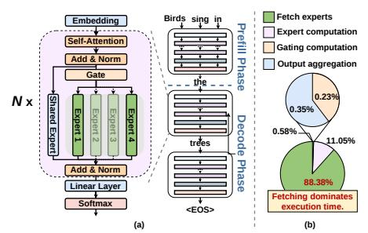

# STEP: Adaptive Spatio-Temporal Expert Prefetching for Low-Latency and Memory-Efficient MoE Inference

Fangxin Liu1,∗ , Ning Yang1,∗ , Zongwu Wang1 , Chenyang Guan1 , Haomin Li1 , Yu Feng1 , Liqiang Lu2 , Xiang Li3 , Siran Yang3 , Jiamang Wang3 , Lin Qu3 , Li Jiang1 , Haibing Guan1,† 1 School of Computer Science, Shanghai Jiao Tong University 2 Zhejiang University 3 Alibaba Group

∗ Equal contribution † Corresponding author

{liufangxin, yn937391832, ljiang\_cs, hbguan}@sjtu.edu.cn

*Abstract*—Large language models (LLMs) have driven significant advances in natural language processing, but their substantial memory and computational demands pose challenges for real-time deployment in memory- and bandwidth-constrained systems. Sparse Mixture-of-Experts (MoE) models mitigate these issues by selectively activating a subset of parameters per input, yet their irregular memory access patterns introduce significant latency and memory overhead. We propose STEP, an adaptive inference framework that optimizes MoE inference through spatio-temporal expert prefetching. STEP introduces layer-wise expert allocation to dynamically adjust the number of activated experts based on computational importance, reducing unnecessary computation and memory traffic. Additionally, it employs a predictive expert prefetching mechanism that leverages temporal locality and layer-specific predictability patterns to minimize access latency. By incorporating a token-aware adaptive window mechanism, STEP further enhances prefetch accuracy. Extensive evaluations on representative MoE models demonstrate that STEP achieves up to 3.12× speedup while maintaining model accuracy, outperforming state-of-the-art baselines in latency and memory efficiency under constrained memory budgets.

*Index Terms*—Mixture-of-Experts, Prefetching, Spatiotemporal Locality

## I. INTRODUCTION

Large Language Models (LLMs), such as GPT-4 [1], LLaMA [12], and DeepSeek-R1 [17], have demonstrated remarkable performance across applications like machine translation, summarization, reasoning, and code generation. Scaling model size consistently improves accuracy, but it incurs significant computational and memory costs. For example, serving a 175B-parameter model in real-time requires over 350 GB of GPU memory [42], exceeding the capacity of a single accelerator and posing deployment challenges in resourceconstrained environments [47], [48].

The Mixture-of-Experts (MoE) architecture offers a compelling alternative to dense LLMs by selectively activating a subset of experts per input token, reducing computational overhead while maintaining or surpassing the performance of dense models [21], [32]. For instance, models like Switch-Transformer [15] achieve state-of-the-art results with fewer activated parameters than their dense counterparts. However, MoE models introduce significant memory challenges, particularly for memory-limited or bandwidth-constrained deployment. In MoE-based Transformers, multi-layer perceptron (MLP) layers are replaced with MoE layers, each comprising a top-k gating network and multiple expert subnetworks. During inference, the gating network selects the top-k experts for computation, lowering the computational cost. Yet, the large number of experts—often up to 75× more parameters than a FLOPs-equivalent dense model, as seen in Google's Switch-Transformer compared to T5 [34]—significantly increases memory requirements. This makes it infeasible to store all expert parameters in GPU memory, creating a critical bottleneck for memory-efficient deployment [28], [30].

To address memory pressure in MoE inference, expert parallelism distributes expert parameters across multiple GPUs, with each GPU storing a subset of experts [24], [51]. However, inter-GPU communication overheads substantially degrade latency, often by up to 50% in large models, limiting scalability and increasing hardware costs [46]. Figure 1 highlights the runtime characteristics of MoE inference. Figure 1(a) shows the overall inference pipeline, including gating, expert fetching, computation, and aggregation. Figure 1(b) further quantifies the execution-time breakdown on an A100 GPU using Qwen3-30B-A3B with INT8 quantization. We observe that expert fetching dominates execution, accounting for approximately 88% of total time, while gating, computation, and aggregation together contribute less than 12%. This indicates that data movement rather than computation is the primary bottleneck in practical MoE inference, motivating system designs that specifically reduce or hide expert-fetch latency. Compression techniques, such as weight pruning [8] or quantization [7], [19], [46], reduce memory footprints but incur significant accuracy degradation (e.g., 5–10% without retraining) or require prohibitive retraining costs, making them impractical for resource-constrained systems [16]. Offloading methods [29], [41], [44], which transfer less frequently accessed expert weights to slower memory tiers (e.g., CPU or NVMe), offer a hardware-efficient alternative by leveraging existing memory hierarchies without compromising accuracy or requiring retraining. However, existing offloading methods rely on heuristic or static prefetching, which suffer from low prefetch accuracy. These methods fail to exploit spatial and temporal locality in expert access patterns, leading to inefficient bandwidth utilization and increased latency. Specifically, simplistic prefetching schemes cannot adapt to dynamic runtime behavior, while complex strategies introduce overheads that hinder effective compute-data overlap.

To address these challenges, we propose STEP, a hybrid static-dynamic optimization framework for accelerating sparse MoE inference under memory constraints. STEP exploits two key observations: (1) significant spatial imbalance in expert computational contributions across MoE layers, where many experts have minimal impact on the output, and (2) strong temporal continuity in expert selection during continuous text generation, with recently used experts likely reused in subsequent decoding steps. Leveraging these insights, STEP introduces an adaptive expert allocation mechanism that selectively activates high-impact experts to minimize computation and memory overhead while preserving accuracy. Additionally, STEP employs a predictive prefetching strategy that exploits temporal locality to preload frequently accessed experts, reducing memory access latency. To handle variability in expert activated patterns, STEP's token-aware adaptive window dynamically adjusts the prefetching scope to task- and layer-specific behaviors, maximizing the prefetch hit rate. In summary, our contributions are as follows:

- We propose a framework that exploits spatial and temporal locality in expert access patterns to enable low-latency, memory-efficient MoE inference in resource-constrained environments.
- We introduce a strategy that leverages spatial imbalances in expert contributions to dynamically reduce the number of activated experts, minimizing computational and memory overhead while maintaining near-equivalent model accuracy.
- We design a mechanism that capitalizes on temporal continuity in expert selection to proactively load highfrequency experts, reducing memory transfer latency during inference.
- We develop a technique that dynamically adjusts prefetching windows based on layer-specific and taskdependent access patterns, enhancing prefetch accuracy.

We evaluate STEP across a diverse set of MoE models on heterogeneous platforms (NVIDIA A100 GPUs and AMD EPYC CPUs). Our results demonstrate that STEP achieves up to 3.12× inference speedup over state-of-the-art baselines, while preserving model accuracy. These findings highlight STEP's ability to enable efficient MoE deployment.

#### II. BACKGROUND

## A. Mixture-of-Experts(MoEs)

The MoEs architecture leverages sparse activation to enhance the efficiency of large-scale neural networks. Unlike traditional dense models, MoE employs multiple sub-models, termed "experts," each specializing in distinct sub-tasks. This section uses Transformer-based models, such as LLaMA [39],

GPT [1], Mixtral [22], DBRX [9], and Grok [43], as examples to illustrate MoE's structure and operation. A standard Transformer model comprises stacked Transformer layers, each containing a Multi-Head Attention (MHA) block followed by a Multi-Layer Perceptron (MLP) block [14], [31]. In contrast, an MoE layer replaces the MLP block with an MoE block to introduce sparsity, as depicted in Figure 1.

An MoE block consists of two primary components: a gating operation and multiple experts. The gating operation, typically implemented with one or two feed-forward layers, a softmax function, and a top-k selection mechanism, routes each input token to k selected experts. Each expert, structurally akin to an MLP, is a feed-forward neural network tailored to specific sub-tasks. During inference, input tokens pass through the gating operation, which assigns them to the appropriate experts based on learned routing decisions.

Recent MoE designs incorporate heterogeneous experts to optimize computational efficiency [38], [43], as shown in Figure 1. These experts are categorized into two types: (1) **routed experts**, dynamically selected by the gating operation with outputs aggregated using soft weights, and (2) **shared experts**, activated for every forward pass. This hybrid approach balances computational cost and model performance, enabling efficient MoE deployment on resource-constrained hardware.

Fig. 1: MoE inference architecture and execution time breakdown. (a) MoE model inference procedure with 1 shared expert and top-2 routed experts activated per token. (b) the execution time distribution from a representative profiling study of MoE inference, where expert fetching accounts for  $\sim 88\%$  of the total execution time, highlighting the severe dataloading bottleneck. Data is tested using the Qwen-30B model on A100(64GB/s).

