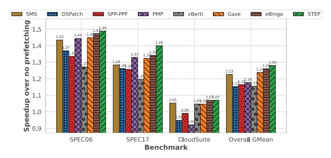
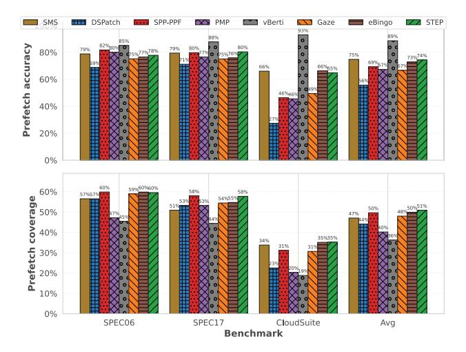
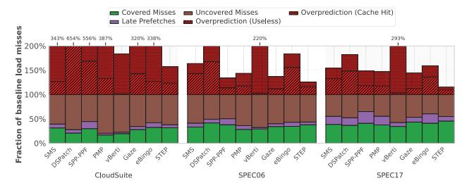

# *A. Simulator and System Configuration*

We evaluate STEP using ChampSim [4], a trace-driven simulator used in the 2nd, 3rd data prefetching championships (DPC2 [2] and DPC3 [3]), and the 2nd cache replacement championship (CRC2) [1]. ChampSim models a modern outof-order core pipeline and a detailed cache hierarchy, providing an effective platform for evaluating prefetchers. The whole system configuration is listed in Table II.

TABLE II: Simulator System Configuration

| Component  | Configuration                                             |  |
|------------|-----------------------------------------------------------|--|
| Core       | 1–8 OoO cores, 4 GHz, 4-wide issue, 128/72 LQ/SQ, 352     |  |
|            | ROB                                                       |  |
| L1-I Cache | 32 KB, 8-way, 64 B line, 4 cycles                         |  |
| L1-D Cache | 48 KB, 12-way, 64 B line, 5 cycles                        |  |
| L2 Cache   | 512 KB, 8-way, 10 cycles                                  |  |
| LLC        | 2 MB/core, 16-way, 20 cycles                              |  |
| TLBs       | ITLB/DTLB: 64-entry, 1 cycle; STLB: 1536-entry, 8 cycles  |  |
| DRAM       | DDR4-3200, 8 banks/rank, tRP = tRCD = tCAS = 12.5 ns      |  |
|            | 1C: Single channel, 1 rank/channel; 2C: Dual channel, 1   |  |
|            | rank/channel; 4C: Dual channel, 2 ranks/channel; 8C: Quad |  |
|            | channel, 2 ranks/channel;                                 |  |

Each simulation warms up for 50 M instructions and collects statistics over the following 100 M committed instructions per core. For multicore experiments, we run all cores and all cores execute until each has completed its measurement window. For homogeneous workloads, we replicate the same trace on all cores. For heterogeneous workloads, we construct mixedworkload groups by randomly sampling traces using a fixed seed (experiment date) to ensure reproducibility. We generate 50 mixed groups for each core count (2, 4, and 8 cores) and evaluate all groups.

#### *B. Workloads*

To cover both regular and irregular access behaviors, we adopt benchmark suites widely used in prior prefetching studies [11], [14]. Only memory-intensive traces (LLC miss per kilo instructions (MPKI) ≥ 1 without prefetching) are included, in total 130 traces. Traces are sourced from DPC-2/3, and CRC-2 public repositories [1]–[3]. As shown in Table III, the 130 traces span three benchmark suites, SPEC CPU2006 (39 traces), SPEC CPU2017 (39 traces), and CloudSuite (52 traces). Together, these suites span streaming versus irregular access, small versus large working sets, and single-core versus contended multi-core settings, enabling a comprehensive assessment of prefetch coverage, accuracy, and bandwidth impact.

TABLE III: Evaluated benchmark suites.

| Suite        | #Traces | Examples                                                                                                        |  |
|--------------|---------|-----------------------------------------------------------------------------------------------------------------|--|
| SPEC CPU2006 | 39      | mcf, bwaves, cactusADM, leslie3d, libquantum, omnetpp, astar, sphinx3 xalancbmk, milc, wrf, GemsFDTD, lbm |  |
| SPEC CPU2017 | 39      | gcc, cactuBSSN, wrf, povray, x264, fotonik3d, roms, pop2, mcf, bwaves, omnetpp, cam4                            |  |
| CloudSuite   | 52      | nutch, cassandra, streaming                                                                                     |  |

### C. Evaluated Prefetchers

We compare STEP against eight state-of-the-art prefetchers. vBerti [31] is a per-page local-delta prefetcher that learns, for each active page, the deltas between consecutive accesses and prioritizes the most likely to be timely. Its storage overhead is only 2.55 KB.

The Instruction Pointer Classifier Prefetcher (IPCP) [32] classifies each load instruction into a small set of spatial behaviors and issues prefetches accordingly. As reported in the original work, IPCP incurs only 895 B of storage overhead.

The Spatial Memory Streaming (SMS) prefetcher [34] uses 64-entry FT and AT tables, a 16 K-entry PHT, and a 32-entry Prefetch Buffer (PB). Its total hardware cost is approximately 116.6 KB.

The Dual Spatial Pattern Prefetcher (DSPatch) [12] characterizes patterns per PC using a 64-entry Page Buffer, a 256-entry Spatial Pattern Table (SPT), and a 32-entry Prefetch Buffer. DSPatch maintains two patterns per PC to improve coverage at minimal cost, requiring only 4.25 KB of total storage.

The Pattern Merging Prefetcher (PMP) [20] learns merged footprints across multiple regions. PMP uses 64-entry FT and AT tables, a 64-entry Offset Pattern Table (OPT), a 32-entry Prefetch Pattern Table (PPT), and a 32-entry Prefetch Buffer (PB). Its aggressiveness is governed by a maximum confidence counter of 32. The overall storage cost is approximately 5.0 KB.

The Signature Path Prefetcher (SPP) [22] encodes controlflow history into path signatures and predicts delta sequences with confidence-based lookahead. It is combined with Perceptron-based Prefetch Filtering (PPF) [13], which classifies candidate prefetches and program context to suppress likely-useless requests. The total storage overhead of the combined SPP+PPF design is approximately 39.3 KB.

We additionally evaluate an ISO-storage and enhanced Bingo baseline, denoted eBingo, which augments Bingo with the same lightweight dense-PC streaming detector used in STEP.

The Gaze [14] prefetcher operates on 4 KB regions, featuring an 8-way 64-entry FT, an 8-way 64-entry AT that stores a 64-bit footprint along with recent access offsets, a 256-entry 4-way PHT holding 64-bit footprints, and a 32-entry PB. The overall storage cost is 4.46 KB. For consistency and fair comparison against L2-only baselines, we configure Gaze to place prefetches into the L2 cache only, removing any potential advantage from multi-level fill policies. We

additionally verified that enabling Gaze's original multi-level prefetching policy does not change our qualitative conclusions.

All prefetchers are implemented within the same ChampSim baseline and placed at the L2C level with identical MSHR budgets and prefetch queue configurations.

#### D. Metrics

- **Speedup:** The ratio of instructions per cycle (IPC) with prefetching to IPC without prefetching.
- Accuracy: The fraction of issued prefetches that are eventually consumed by demand before eviction.

$$\label{eq:accuracy} \text{Accuracy} = \frac{N_{\text{useful}}}{N_{\text{useful}} + N_{\text{useless}}}$$

• **Coverage:** The fraction of baseline (no prefetching) demand misses that are eliminated by prefetching.

$$\text{Coverage} = \frac{N_{\text{miss}}^{\text{base}} - N_{\text{miss}}^{\text{pf}}}{N_{\text{miss}}^{\text{base}}},$$

where  $N_{\text{miss}}^{\text{base}}$  and  $N_{\text{miss}}^{\text{pf}}$  denote load misses without and with prefetching, respectively, measured at the same cache level.

 Overprediction: The total of (i) prefetches that are never used before eviction and (ii) duplicate prefetches whose target line was already in the cache. In Fig. 7, we report overprediction as a percentage relative to baseline demand load misses.

### V. EVALUATION

STEP supports three staged trigger points as a general framework. Unless otherwise stated, the main evaluation uses the variant that disables prefetch issuance at SOE, since this configuration achieves the best average performance according to our ablation study in Section V-E.

### A. Single-Core Performance

We evaluate STEP on SPEC CPU2006, SPEC CPU2017, and CloudSuite, reporting speedup, accuracy, coverage, and prefetch composition in Figure 5, Figure 6, Figure 7, Figure 8, and compare against representative state-of-the-art prefetchers described in Section IV-C. Overall, STEP achieves the highest average application speedup with moderate storage, while maintaining a balanced accuracy–coverage profile.

**Speedup.** Figure 5 reports geometric-mean speedups relative to no prefetching. STEP consistently achieves the highest performance across the evaluated suites. On SPEC CPU2006, STEP reaches 1.49× speedup, exceeding the strengthened fixed-trigger baseline eBingo (1.47×) and the low-storage baseline Gaze (1.45×). On SPEC CPU2017, STEP reaches 1.40×, again ranking first ahead of eBingo (1.34×). On CloudSuite, which exhibits burstier and more complex access behavior, STEP still provides a positive gain of 1.07×. While eBingo reaches the same suite-level average on CloudSuite, STEP remains the overall best design across the full workload set. Averaged across all suites, STEP achieves the highest overall geometric mean of 1.28×, ahead of eBingo (1.26×) and

Fig. 5: Geometric-mean speedup (vs. no prefetching) on SPEC CPU2006, SPEC CPU2017, and CloudSuite.

Fig. 6: Prefetch accuracy and coverage across all suites.

Gaze (1.24×). Moving to Figure 8, we examine performance at per-trace granularity. STEP is the most robust design across traces. PMP is strongest on cactuBSSN-2421, mcf-51, and leslie3d-134. eBingo remains highly competitive on most workloads and behaves the best in GemsFDTD traces. Gaze and STEP exhibit similar cross-trace trends, but STEP is usually slightly better across programs.

Accuracy. Figure 6 (top) shows that STEP maintains a strong and stable accuracy profile across all suites. vBerti achieves the highest average accuracy among the evaluated designs (89%), but this selectivity comes with a clear coverage trade-off, as shown in Figure 6 (bottom). eBingo and Gaze also exhibit competitive average accuracy (73% and 67%, respectively). STEP reaches 74% average accuracy and remains consistent across suites, which aligns with its strong end-toend speedup. Accuracy should be interpreted together with coverage and timeliness.

Coverage. Figure 6 (bottom) shows that STEP delivers the highest average coverage across suites at 51%, slightly exceeding eBingo (50%) and the other baselines. vBerti exhibits the lowest coverage largely because it explicitly accounts for both accuracy and timeliness, whereas other designs may still count late prefetches toward coverage even when they provide

Fig. 7: Prefetch-composition analysis on a single-core system: useful (covered) demand misses, late prefetches, remaining uncovered misses, and two overprediction components (cachehit prefetches and unused prefetches).

limited latency-hiding benefit.

Prefetch Composition. Figure 7 depicts the composition of issued prefetches. Overall, STEP converts a larger fraction of its prefetch activity into useful coverage while keeping waste under control. On CloudSuite, STEP issues fewer total prefetches than several competing designs, yet delivers the most useful and timely data, indicating better selectivity under bursty and irregular access behavior. On SPEC17, STEP again achieves a strong useful fraction while avoiding large growth in useless and cache-hit overpredictions. On SPEC06, a larger portion of the gain comes from FOE-triggered prefetches: this increases useful coverage and timeliness, but also raises overprediction relative to more conservative designs. Taken together, these results are consistent with STEP's staged trigger-time design: earlier trigger points capture additional opportunities when the signal is already strong, while later trigger points help avoid unnecessary traffic when more evidence is needed.

#### *B. Multi-Core Performance*

Figure 9 shows the multicore scaling of STEP, eBingo, Gaze, and DSPatch from 1 to 8 cores under both homogeneous and heterogeneous workload settings. Overall, STEP remains highly robust as core count increases, while eBingo is the strongest fixed-trigger baseline and becomes particularly competitive in the challenging heterogeneous setting.

In the homogeneous setting, all prefetchers lose performance as the number of cores increases because contention in the shared cache hierarchy and memory system becomes stronger. Nevertheless, STEP remains consistently ahead across the full 1-8 core range, and its advantage over the other prefetchers becomes more apparent as core count increases. eBingo is generally the closest baseline, followed by Gaze, while DSPatch degrades the most.

The heterogeneous setting is more challenging because mixed workloads create more irregular interference in both bandwidth and cache residency. Under this stronger interference, STEP remains among the strongest designs throughout the sweep, while eBingo becomes more competitive and matches STEP's performance at 8 cores. This result indicates that eBingo can be particularly effective under the heaviest

Fig. 8: Per-trace speedup of PMP, Gaze, eBingo, and STEP on 40 randomly selected traces from the full evaluation set.

Fig. 9: Multi-core performance scaling for homogeneous and heterogeneous workloads from 1 to 8 cores.

mixed-workload pressure, whereas STEP still maintains strong robustness across the broader multicore range. In contrast, Gaze and especially DSPatch degrade more noticeably as core count increases. Overall, these results show that STEP's benefit is not limited to the single-core setting. Its staged triggertime decisions remain effective under substantial multicore contention, while eBingo emerges as the closest baseline. More broadly, these results also suggest that local trigger-time decisions are an important part of multicore prefetching, but the hardest shared-resource interference cases may further benefit from complementary multicore-aware coordination beyond the private-core view.

