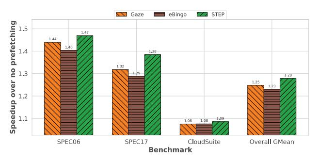
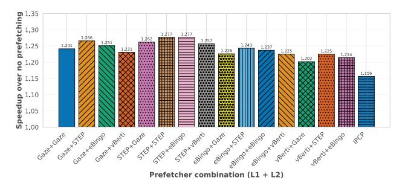
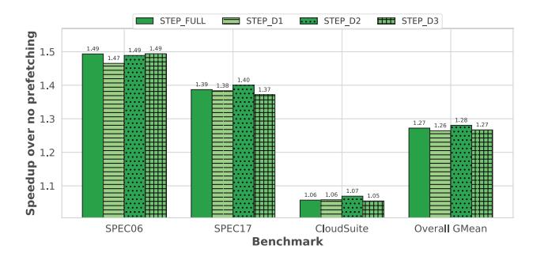
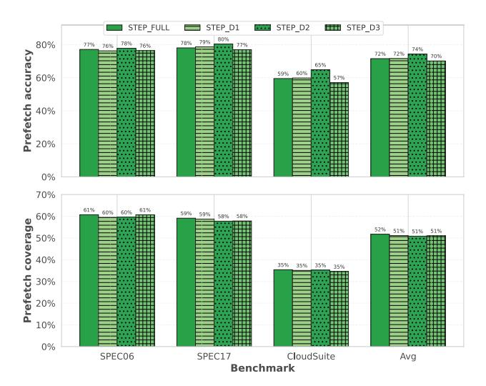

# *C. L1-level Performance*

Figure 10 reports L1-level prefetching performance for Gaze, eBingo, and STEP. STEP remains the best design at L1, achieving 1.47×, 1.38×, and 1.09× speedup on SPEC

Fig. 10: Geometric-mean speedup of L1-level prefetcher performance over no prefetching.

Fig. 11: Geometric-mean speedup of multi-level (L1+L2) prefetcher combinations over no prefetching.

CPU2006, SPEC CPU2017, and CloudSuite, respectively, and an overall geometric mean of 1.28×. This exceeds Gaze (1.25×) and eBingo (1.23×) in overall performance.

The gains are larger on SPEC CPU2006 and SPEC CPU2017 than on CloudSuite, where the three designs are closer. This indicates that STEP's staged trigger-time mechanism remains effective beyond the L2 setting and continues to provide benefit even at the more timing-sensitive and pollution-sensitive L1 level.

#### *D. Multi-level Prefetching*

Figure 11 reports the performance of multi-level (L1+L2) prefetcher combinations built from Gaze, vBerti, eBingo, and STEP. IPCP is included as a representative coordinated multi-level baseline. The results show that hybrid prefetching is not automatically additive: enabling a second prefetcher can increase memory traffic and resource contention, and the L1 prefetcher also filters the access stream seen by the L2 prefetcher, which changes its learning signal and may reduce timeliness. Despite these interactions, STEP remains highly robust across combinations. The strongest configurations are STEP+STEP and STEP+eBingo, both achieving 1.277× speedup, followed by Gaze+STEP (1.266×) and STEP+Gaze (1.262×). More broadly, nearly all top-tier combinations include STEP at either L1 or L2, indicating that STEP remains effective at both levels. When used at L1, STEP consistently forms one of the best combinations; when used at L2, pairing it with Gaze or eBingo also yields strong results.

In contrast, IPCP reaches 1.156×, noticeably below the best L1+L2 combinations. Overall, these results show that STEP's

Fig. 12: Ablation on STEP's time-point triggers. STEP-D1: disable First-Offset Event (FOE); STEP-D2: disable Second-Offset Event (SOE); STEP-D3: disable Third-Offset Event (TOE).

Fig. 13: Prefetch accuracy and coverage under ablations.

staged trigger-time mechanism remains effective even under cross-level interactions.

