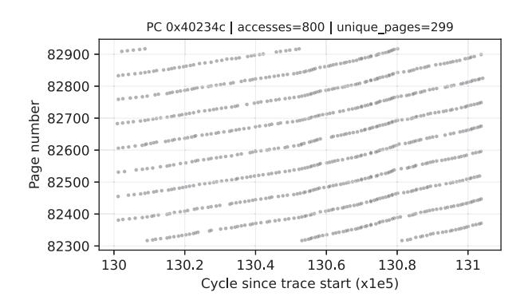

# *E. Ablation Study*

We ablate STEP's three trigger points—FOE, SOE, and TOE—to quantify their individual contributions. In this subsection, we also evaluate STEP-FULL to expose the contributions of all trigger points. We compare four variants: STEP-FULL, STEP-D1 (FOE disabled), STEP-D2 (SOE disabled), and STEP-D3 (TOE disabled).

STEP-D1: As shown in Fig. 12, disabling FOE primarily hurts performance on SPEC CPU2006, where issuing useful prefetches at the first observed offset often translates directly into IPC gains. In contrast, removing FOE rarely improves performance on SPEC CPU2017 or CloudSuite. Although accuracy changes little, the loss of early coverage and timeliness typically outweighs any reduction in speculative traffic. This suggests that FOE is especially valuable for workloads whose useful opportunities arise early in the region's lifetime.

STEP-D2: As shown in Fig. 12, disabling SOE yields the highest average performance among the ablated variants and is therefore adopted as the final STEP configuration. On average, many workloads are already well served either by FOE's earlier trigger or by TOE's later but more accurate trigger, making SOE appear redundant in the average case. However, SOE is not universally redundant. For workloads such as cactuBSSN-2421, cactuBSSN-4004, sphinx3-234, and roms-294, disabling SOE reduces performance, indicating that an intermediate trigger can still be useful once the spatial context becomes sufficiently stable at the second access.

STEP-D3: As shown in Fig. 13, removing TOE degrades accuracy across all suites while leaving coverage nearly unchanged. This indicates that earlier triggers are sufficient to cover most misses, whereas TOE primarily serves to resolve ambiguity and recover accuracy. The resulting loss is more visible on SPEC CPU2017 and CloudSuite, where access patterns are more irregular and longer-range, making twooffset evidence less reliable.

Beyond reporting performance, accuracy, and coverage, Figure 14 further breaks down the useful prefetches of STEP-FULL by trigger point: FOE, SOE, TOE, and STREAM. The results show that, besides the easy-win STREAM patterns, different workloads are dominated by different trigger points. For example, mcf-184 and mcf-51 are largely driven by FOEissued useful prefetches, whereas cactuBSSN-4004 benefits substantially from later trigger points such as SOE and TOE. This diversity is precisely the motivation for STEP: some workloads benefit primarily from early opportunity, while others require later disambiguation. A single fixed trigger cannot capture both cases equally well.

Taken together, the ablations show that FOE, SOE, and TOE contribute in different ways across workloads, which explains why no single fixed trigger is uniformly optimal.

#### *F. Real-Example Case Study*

This subsection presents real-program case studies. Beyond explaining the sources of STEP's speedup, these examples also clarify how STEP and eBingo can succeed through different mechanisms on different workloads.

In mcf-192, the performance gain mainly comes from FOE's ability to exploit very short-lived trigger opportunities. As a pointer-intensive workload, mcf-192 frequently traverses linked data structures whose accesses jump across many pages within a short time window. Figure 15 shows a representative access window from mcf-192. Within this window, a single PC touches a large number of distinct pages. When such behavior is further interleaved with accesses from other instructions, the FT must simultaneously track many active pages, and many entries are evicted before a second access to the same page arrives. As a result, mechanisms that wait for a later trigger often miss the opportunity to launch prefetches altogether. STEP benefits in this setting because FOE can still act before the page context disappears, while hashed PC information provides a lightweight disambiguation cue when the first-offset behavior under that PC remains relatively stable.

Fig. 14: Useful-prefetch breakdown by trigger points FOE, SOE, TOE, and STREAM for STEP-FULL across workloads.

Fig. 15: Case study of FOE: Representative access window from mcf-192 illustrating a single PC rapidly jumps across many pages within a short interval.

Fig. 16: Case study of TOE disambiguation for region 0xfe3 from mcf-484.

By contrast, although eBingo also issues prefetches at the first trigger point, its more specific PC+Address view provides little reusable history in such rapidly changing page contexts, while the fallback cannot recover equally reliable early decisions, because STEP and eBingo also differ in their matching and candidate-selection mechanisms. Thus, for workloads such as mcf-192, where useful page-level context is short-lived and quickly displaced, STEP can exploit transient opportunities more effectively than both eBingo and Gaze.

A related benefit of FOE is timeliness: in some cases, FOE and a later trigger eventually match the same footprint, but FOE still delivers higher performance because it issues the correct prefetches early enough to cover additional demand lines before they arrive, as observed in GemsFDTD-1491.

A third case study highlights the complementary role of

TOE in resolving ambiguity that remains at earlier trigger points. Figure 16 shows an example from mcf-484 for region 0xfe3. At SOE, the observed access pattern is compatible with three different matched entries (C0, C1, and C2). As more accesses arrive, TOE provides enough information to disambiguate the candidates, and the selected footprint matches the realized demand footprint. Without TOE, choosing C1 would introduce 30 unnecessary prefetched cache lines, increasing cache pollution and memory-system contention, while choosing C2 would still generate 12 useless prefetches and fail to fetch 11 cache lines that are eventually demanded, leading to both wasted bandwidth and lost coverage.

In this case, however, eBingo performs better than STEP. STEP's offset-based staged trigger cannot confidently distinguish the useful pattern at the early trigger points, and therefore defers issuance until TOE. This improves accuracy and reduces pollution, but it also sacrifices some early opportunity. By contrast, eBingo's richer fixed-trigger matching can already distinguish most of these useful footprint patterns at the first trigger point, and can also recognize additional useful patterns that STEP's offset-based trigger does not reliably separate yet. Although eBingo incurs higher pollution than STEP, the additional early opportunities and useful patterns captured in this case outweigh that cost and lead to better overall performance. Gaze, which is more comparable to STEP in event representation, captures fewer useful prefetches while still causing higher pollution.

Together, these examples show that STEP improves performance by exploiting two complementary effects: capturing early opportunities and delaying decisions until ambiguity is resolved. They also illustrate that STEP and eBingo can succeed in different situations because they rely on different event representations and matching strategies. Since Gaze is more comparable to STEP in overall design philosophy, it serves here as a cleaner reference point for isolating the benefit of staged trigger-time decisions.

