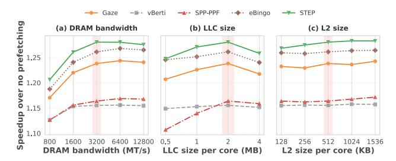
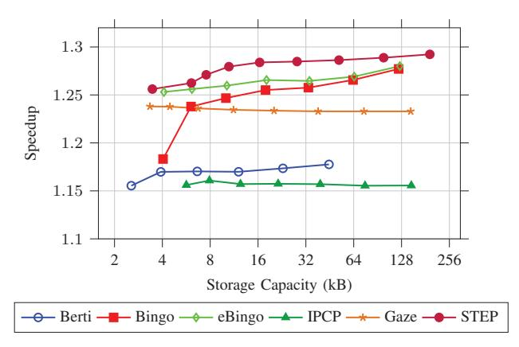

# *G. Parameter Sensitivity*

To analyze the sensitivity of STEP to internal design parameters, we sweep the sizes of the Filter Table (FT), Accumulation Table (AT), and Pattern History Table (PHT), as shown in Fig. 17. The baseline configuration uses 256 FT entries, 128 AT entries, and an 8-way associative PHT. In each experiment, we vary one parameter while keeping the other two fixed.

Fig. 17: Parameter sensitivity of STEP: (a) FT sweep, (b) AT sweep, (c) PHT sweep.

Fig. 18: System parameter study: (a) DRAM bandwidth sweep, (b) LLC size sweep, (c) L2 size sweep.

As shown in Fig. 17(a), increasing the FT size from 32 to 256 entries steadily improves performance, but further enlargement brings diminishing returns. A larger FT allows STEP to retain more active regions and therefore improves early-trigger timeliness, while very large FT sizes bring little additional benefit.

For the AT, Fig. 17(b) shows that speedup increases up to 256 entries and then saturates. When the AT is too small, complete footprint patterns are fragmented across multiple entries and timeliness is lost; when it is too large, stale entries can be retained for longer and slightly reduce prediction quality.

For the PHT, Fig. 17(c) shows the stable gains with higher associativity. Increasing from 8-way to 128-way improves speedup from 1.28× to 1.29×.

We further evaluate STEP's robustness under varying system-level parameters, including DRAM bandwidth, LLC size, and L2 cache size, as shown in Fig. 18. The baseline configuration uses a DRAM bandwidth of 3200 MT/s, a 2 MB LLC, and a 512 KB L2 cache per core. In each experiment, we vary one parameter while keeping the other two fixed at their baseline values to isolate its impact on performance.

### *H. System Parameter Experiment*

As shown in Fig. 18(a), all prefetchers benefit from increased DRAM bandwidth, but STEP maintains a consistent lead across the entire sweep. Even at the lowest bandwidth point (800 MT/s), STEP still outperforms eBingo and Gaze, indicating that its staged trigger-time mechanism remains effective even when bandwidth is tight.

In Fig. 18(b), scaling the LLC from 0.5 MB to 2 MB per core increases the speedup for all prefetchers. Beyond this

Fig. 19: Speedup vs. storage capacity for six prefetchers.

point, performance slightly declines, since a larger cache can store more data and thus reduces the benefit of prefetching. At the smallest LLC point (0.5 MB/core), STEP and eBingo exhibit very similar performance. As LLC capacity increases, STEP remains the strongest design.

Finally, as shown in Fig. 18(c), STEP continues to outperform other prefetchers across all L2 sizes. While Gaze saturates early, STEP gains modestly with larger L2 sizes due to more effective prefetch utilization and lower pollution.

Overall, these sweeps show that STEP's benefit is not tied to a single cache or memory design point. Instead, its staged trigger-time mechanism remains effective across a range of bandwidth and cache-capacity settings, including against eBingo.

